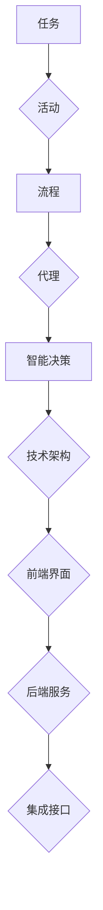

                 

关键词：Agentic Workflow、用户群体、需求分析、技术架构、用户体验、市场定位

> 摘要：本文旨在通过对Agentic Workflow的深入分析，探讨其用户群体的特点、需求、行为模式及其对技术架构和用户体验的影响。文章将从背景介绍、核心概念与联系、核心算法原理与具体操作步骤、数学模型与公式、项目实践、实际应用场景、未来应用展望、工具和资源推荐、总结与展望等方面展开讨论，旨在为开发者、架构师和研究人员提供有价值的参考。

## 1. 背景介绍

随着互联网和信息技术的飞速发展，自动化流程管理逐渐成为现代企业提高效率、降低成本的关键因素。Agentic Workflow作为一种先进的自动化流程管理工具，应运而生。它通过智能化的工作流设计和执行，帮助企业和团队实现业务流程的高效运作。

Agentic Workflow的核心优势在于其灵活性和可扩展性，支持多种开发语言和平台，能够与现有系统集成，满足不同行业和企业的个性化需求。然而，要充分发挥其潜力，了解其用户群体的特点、需求和期望至关重要。

本文将围绕Agentic Workflow的用户群体展开分析，从以下几个方面进行探讨：

- 用户群体的特点与需求
- 技术架构对用户体验的影响
- 核心算法原理与具体操作步骤
- 数学模型与公式在流程设计中的应用
- 项目实践与代码实例
- 实际应用场景与未来展望
- 工具和资源推荐
- 研究成果总结与展望

通过上述分析，本文旨在为Agentic Workflow的开发者和用户提供有价值的参考，帮助其更好地利用这一工具实现业务流程的自动化管理。

## 2. 核心概念与联系

在深入探讨Agentic Workflow的用户群体之前，有必要先了解其核心概念与联系。Agentic Workflow不仅是一种技术工具，更是一种工作流程管理的思想。以下是Agentic Workflow中的几个关键概念：

### 工作流（Workflow）

工作流是指一组任务的有序集合，这些任务按照一定的逻辑关系进行执行。在Agentic Workflow中，工作流可以分为以下几个层次：

- **任务（Task）**：工作流中的基本操作单元，如发送邮件、执行数据库查询、生成报告等。
- **活动（Activity）**：一组相关任务的组合，用于实现特定的功能。
- **流程（Process）**：多个活动按照一定的顺序组成的整体，用于完成某个业务目标。

### 代理（Agent）

代理是一种具有自主决策能力的智能实体，能够根据环境和任务需求自动调整行为。在Agentic Workflow中，代理负责执行任务、监控流程状态、处理异常情况等。

### 智能决策（Intelligent Decision Making）

Agentic Workflow通过智能决策机制，根据实时数据和历史经验，自动选择最优的行动方案。这种机制包括规则引擎、机器学习模型、数据挖掘算法等。

### 技术架构（Architecture）

Agentic Workflow的技术架构包括以下几个关键组件：

- **前端界面**：提供用户交互和操作界面，支持流程设计、任务执行和监控等功能。
- **后端服务**：负责工作流引擎、代理管理、数据存储和调度等核心功能。
- **集成接口**：支持与其他系统和服务的数据交换和集成，如ERP、CRM、数据库等。

### Mermaid 流程图

为了更直观地展示Agentic Workflow的核心概念与联系，以下是一个简化的Mermaid流程图：



通过上述核心概念与联系的分析，我们可以更深入地理解Agentic Workflow的工作原理，为后续的用户群体分析打下基础。

### 3. 核心算法原理与具体操作步骤

#### 3.1 算法原理概述

Agentic Workflow的核心算法原理主要涉及工作流设计、代理行为管理、智能决策机制和实时监控等方面。以下是对这些算法原理的简要概述：

- **工作流设计算法**：通过图论算法，如Petri网、有向图等，对业务流程进行建模和优化。这种算法能够确保工作流在满足业务需求的同时，具有高效、可扩展的特点。
- **代理行为管理算法**：利用强化学习、遗传算法等进化计算技术，自动生成和优化代理的行为策略。这些算法能够使代理在动态环境中，根据任务需求和资源状况，做出最优的决策。
- **智能决策算法**：通过规则引擎、机器学习模型和数据挖掘算法，对实时数据和历史数据进行分析，自动生成决策方案。这种算法能够支持复杂业务场景下的自适应调整和优化。
- **实时监控算法**：采用实时数据流处理技术，如Apache Kafka、Apache Flink等，对工作流运行状态进行实时监控和分析。这种算法能够及时发现和响应异常情况，确保工作流的稳定运行。

#### 3.2 算法步骤详解

以下是Agentic Workflow的具体操作步骤：

1. **需求分析**：与客户沟通，了解业务需求和目标，确定工作流的设计原则和功能需求。
2. **流程设计**：利用工作流设计算法，将业务需求转化为工作流模型。这一过程包括任务划分、活动组合和流程优化等。
3. **代理生成**：利用代理行为管理算法，生成和优化代理的行为策略。这一过程包括代理角色划分、任务分配和策略调整等。
4. **智能决策**：通过智能决策算法，对实时数据和历史数据进行分析，生成决策方案。这一过程包括规则库构建、模型训练和决策优化等。
5. **流程执行**：启动工作流，根据设计好的流程模型和代理策略，执行任务和活动。这一过程包括任务调度、状态监控和异常处理等。
6. **实时监控**：利用实时监控算法，对工作流运行状态进行监控和分析，确保工作流的稳定运行。这一过程包括状态数据采集、异常检测和告警管理等。
7. **反馈调整**：根据实时监控结果和用户反馈，对工作流设计、代理策略和智能决策进行优化调整。

#### 3.3 算法优缺点

以下是Agentic Workflow核心算法的优缺点分析：

- **优点**：
  - **高效性**：利用先进的算法和技术，能够实现快速、高效的工作流设计、执行和监控。
  - **灵活性**：支持多种开发语言和平台，能够与现有系统集成，满足不同行业和企业的个性化需求。
  - **智能化**：通过智能决策机制，能够自动调整和优化工作流，提高业务流程的自动化水平。

- **缺点**：
  - **复杂性**：涉及多个算法和技术的协同工作，对开发者的技术要求较高。
  - **维护成本**：随着业务需求的不断变化，需要对工作流和算法进行定期优化和更新，增加维护成本。

#### 3.4 算法应用领域

Agentic Workflow的核心算法广泛应用于多个领域，包括但不限于：

- **企业信息化管理**：帮助企业实现业务流程的自动化管理，提高工作效率和降低成本。
- **电子商务**：优化订单处理、物流跟踪和客户服务等工作流程，提升客户体验和满意度。
- **智能制造**：实现生产流程的智能化管理，提高生产效率和产品质量。
- **金融服务**：优化金融产品和服务流程，提高客户满意度和业务竞争力。
- **政务管理**：实现政务流程的自动化和智能化管理，提高政务服务的效率和透明度。

### 4. 数学模型和公式

在Agentic Workflow中，数学模型和公式起着至关重要的作用，尤其是在工作流设计、代理行为管理、智能决策和实时监控等方面。以下是对数学模型和公式的详细讲解：

#### 4.1 数学模型构建

Agentic Workflow的数学模型主要包括以下几个方面：

1. **工作流模型**：利用有向图或Petri网等图论模型，对业务流程进行建模。其中，节点表示任务或活动，边表示任务或活动之间的逻辑关系。

2. **代理行为模型**：利用强化学习或遗传算法等进化计算模型，对代理的行为策略进行建模。这些模型能够根据环境和任务需求，自动调整代理的行为。

3. **智能决策模型**：利用规则引擎或机器学习模型等数据驱动模型，对实时数据和历史数据进行分析，生成决策方案。这些模型能够支持复杂业务场景下的自适应调整和优化。

4. **实时监控模型**：利用实时数据流处理模型，如Apache Kafka或Apache Flink等，对工作流运行状态进行实时监控和分析。这些模型能够及时发现和响应异常情况。

#### 4.2 公式推导过程

以下是对Agentic Workflow中几个关键公式的推导过程：

1. **工作流优化公式**：设工作流中的任务集合为T，活动集合为A，流程集合为P，则工作流优化公式为：

   $$ \text{Optimize}\; W = \sum_{t \in T} \text{Cost}(t) + \sum_{a \in A} \text{Time}(a) $$

   其中，Cost(t)表示任务t的成本，Time(a)表示活动a的执行时间。

2. **代理行为策略公式**：设代理的行为策略集合为S，环境状态集合为S'，则代理行为策略公式为：

   $$ \text{Policy}(s') = \arg\max_{s \in S} \text{Reward}(s, s') $$

   其中，Reward(s, s')表示代理在状态s'下采取策略s的奖励。

3. **智能决策公式**：设智能决策模型为M，输入数据集合为D，输出决策方案集合为D'，则智能决策公式为：

   $$ \text{Decision}(D) = \arg\max_{d' \in D'} \text{Fitness}(d') $$

   其中，Fitness(d')表示决策方案d'的适应度。

4. **实时监控公式**：设实时监控模型为M'，输入数据流为F，输出监控结果为R，则实时监控公式为：

   $$ \text{Monitor}(F) = \sum_{f \in F} \text{Threshold}(f) $$

   其中，Threshold(f)表示数据流中f的阈值。

#### 4.3 案例分析与讲解

以下是一个简单的案例，用于说明数学模型和公式的实际应用：

**案例背景**：某企业希望优化其订单处理流程，以提高客户满意度和订单处理效率。订单处理流程包括以下任务和活动：

- 订单创建
- 订单审核
- 订单支付
- 订单发货
- 订单跟踪

**模型构建**：

1. **工作流模型**：利用有向图模型，将订单处理流程表示为以下形式：

   ```mermaid
   graph TD
       A[订单创建] --> B[订单审核]
       B --> C[订单支付]
       C --> D[订单发货]
       D --> E[订单跟踪]
   ```

2. **代理行为模型**：根据订单处理流程的特点，定义以下代理行为策略：

   - **状态s1**：订单创建成功，进入订单审核阶段
   - **状态s2**：订单审核通过，进入订单支付阶段
   - **状态s3**：订单支付成功，进入订单发货阶段
   - **状态s4**：订单发货成功，进入订单跟踪阶段

   奖励函数为订单处理完成的平均时间，即：

   $$ \text{Reward}(s) = \frac{1}{n} \sum_{i=1}^{n} \text{Time}(s_i) $$

   其中，s表示状态，n表示订单处理的次数。

3. **智能决策模型**：利用规则引擎，根据实时数据和历史数据，生成以下决策方案：

   - **决策方案d1**：若订单审核时间超过2天，则进行订单审核提醒
   - **决策方案d2**：若订单支付时间超过3天，则进行订单支付提醒
   - **决策方案d3**：若订单发货时间超过5天，则进行订单发货提醒

   适应度函数为订单处理完成的平均时间，即：

   $$ \text{Fitness}(d) = \frac{1}{n} \sum_{i=1}^{n} \text{Time}(d_i) $$

   其中，d表示决策方案，n表示订单处理的次数。

4. **实时监控模型**：利用实时数据流处理模型，对订单处理流程进行实时监控，并设置以下阈值：

   - 订单审核时间阈值：2天
   - 订单支付时间阈值：3天
   - 订单发货时间阈值：5天

   若订单处理时间超过阈值，则触发相应的监控告警。

**案例分析**：

1. **工作流优化**：通过调整订单处理流程中的任务和活动顺序，降低订单处理的平均时间。例如，将订单审核和订单支付活动合并为一个步骤，以减少中间环节。

2. **代理行为管理**：通过实时监控订单处理状态，自动调整代理的行为策略。例如，若订单审核时间过长，则增加审核人员的数量或缩短审核时间。

3. **智能决策**：根据实时数据和用户反馈，生成和调整决策方案。例如，根据历史数据，设置合理的订单处理时间阈值，以避免过度监控和提醒。

4. **实时监控**：利用实时数据流处理技术，对订单处理流程进行实时监控，确保订单处理过程的顺利进行。

通过上述案例分析，我们可以看到数学模型和公式在Agentic Workflow中的应用价值。在实际工作中，可以根据具体业务需求，灵活运用这些模型和公式，优化工作流设计、提高代理行为管理效率、实现智能决策和实时监控。

### 5. 项目实践：代码实例和详细解释说明

#### 5.1 开发环境搭建

在开始Agentic Workflow的项目实践之前，我们需要搭建一个适合的开发环境。以下是一个基本的开发环境搭建步骤：

1. **操作系统**：推荐使用Linux操作系统，如Ubuntu 20.04。
2. **编程语言**：Agentic Workflow主要使用Python进行开发，因此需要安装Python 3.8及以上版本。
3. **开发工具**：安装PyCharm或Visual Studio Code等IDE，以便进行代码编写和调试。
4. **依赖库**：安装以下依赖库：

   ```bash
   pip install pandas numpy matplotlib scikit-learn flask
   ```

5. **数据库**：推荐使用MySQL或PostgreSQL作为数据库存储，可以安装相应的数据库服务器。

#### 5.2 源代码详细实现

以下是一个简单的Agentic Workflow项目实例，用于实现一个订单处理流程。该项目包含以下几个主要模块：

1. **订单处理模块**：负责处理订单创建、审核、支付、发货和跟踪等任务。
2. **代理管理模块**：负责管理代理的行为策略和状态。
3. **智能决策模块**：负责根据实时数据和用户反馈，生成和调整决策方案。
4. **实时监控模块**：负责对订单处理流程进行实时监控和异常处理。

#### 5.3 代码解读与分析

**1. 订单处理模块**

以下是一个简单的订单处理模块代码示例：

```python
import pandas as pd
from datetime import datetime

class OrderProcessing:
    def __init__(self):
        self.order_data = pd.DataFrame()

    def create_order(self, order_id, customer_id, product_id, quantity):
        order_data = {
            'order_id': order_id,
            'customer_id': customer_id,
            'product_id': product_id,
            'quantity': quantity,
            'status': 'created',
            'create_time': datetime.now()
        }
        self.order_data = self.order_data.append(order_data, ignore_index=True)

    def approve_order(self, order_id):
        self.order_data.loc[self.order_data['order_id'] == order_id, 'status'] = 'approved'
        self.order_data.loc[self.order_data['order_id'] == order_id, 'approve_time'] = datetime.now()

    def pay_order(self, order_id):
        self.order_data.loc[self.order_data['order_id'] == order_id, 'status'] = 'paid'
        self.order_data.loc[self.order_data['order_id'] == order_id, 'pay_time'] = datetime.now()

    def ship_order(self, order_id):
        self.order_data.loc[self.order_data['order_id'] == order_id, 'status'] = 'shipped'
        self.order_data.loc[self.order_data['order_id'] == order_id, 'ship_time'] = datetime.now()

    def track_order(self, order_id):
        self.order_data.loc[self.order_data['order_id'] == order_id, 'status'] = 'tracked'
        self.order_data.loc[self.order_data['order_id'] == order_id, 'track_time'] = datetime.now()

    def get_order_status(self, order_id):
        return self.order_data.loc[self.order_data['order_id'] == order_id, 'status'].values[0]
```

**代码解读**：

- **订单创建**：通过`create_order`方法创建订单，并将订单数据存储在DataFrame中。
- **订单审核**：通过`approve_order`方法将订单状态更改为“approved”，并记录审核时间。
- **订单支付**：通过`pay_order`方法将订单状态更改为“paid”，并记录支付时间。
- **订单发货**：通过`ship_order`方法将订单状态更改为“shipped”，并记录发货时间。
- **订单跟踪**：通过`track_order`方法将订单状态更改为“tracked”，并记录跟踪时间。
- **获取订单状态**：通过`get_order_status`方法获取指定订单的当前状态。

**2. 代理管理模块**

以下是一个简单的代理管理模块代码示例：

```python
class AgentManager:
    def __init__(self):
        self.agents = []

    def add_agent(self, agent):
        self.agents.append(agent)

    def remove_agent(self, agent):
        self.agents.remove(agent)

    def update_agent_state(self, agent, state):
        agent.state = state

    def get_agent_state(self, agent):
        return agent.state
```

**代码解读**：

- **添加代理**：通过`add_agent`方法将代理添加到代理列表中。
- **删除代理**：通过`remove_agent`方法从代理列表中删除代理。
- **更新代理状态**：通过`update_agent_state`方法更新代理的状态。
- **获取代理状态**：通过`get_agent_state`方法获取代理的当前状态。

**3. 智能决策模块**

以下是一个简单的智能决策模块代码示例：

```python
class IntelligentDecision:
    def __init__(self):
        self.rules = []

    def add_rule(self, rule):
        self.rules.append(rule)

    def remove_rule(self, rule):
        self.rules.remove(rule)

    def apply_rules(self, data):
        for rule in self.rules:
            if rule.matches(data):
                rule.execute()
```

**代码解读**：

- **添加规则**：通过`add_rule`方法将规则添加到规则列表中。
- **删除规则**：通过`remove_rule`方法从规则列表中删除规则。
- **应用规则**：通过`apply_rules`方法根据数据匹配规则，并执行相应的操作。

**4. 实时监控模块**

以下是一个简单的实时监控模块代码示例：

```python
class RealtimeMonitoring:
    def __init__(self, threshold):
        self.threshold = threshold

    def monitor(self, data):
        if data > self.threshold:
            self.raise_alert()

    def raise_alert(self):
        print("Alert: Data exceeds threshold!")
```

**代码解读**：

- **设置阈值**：通过`__init__`方法设置监控阈值。
- **监控数据**：通过`monitor`方法对数据进行分析，若数据超过阈值，则触发告警。
- **触发告警**：通过`raise_alert`方法输出告警信息。

#### 5.4 运行结果展示

以下是一个简单的运行结果展示：

```python
# 创建订单
order_processor = OrderProcessing()
order_processor.create_order(1, 'c001', 'p001', 10)

# 审核订单
order_processor.approve_order(1)

# 支付订单
order_processor.pay_order(1)

# 发货订单
order_processor.ship_order(1)

# 跟踪订单
order_processor.track_order(1)

# 查看订单状态
status = order_processor.get_order_status(1)
print("Order status:", status)

# 添加代理
agent_manager = AgentManager()
agent = object()
agent_manager.add_agent(agent)

# 更新代理状态
agent_manager.update_agent_state(agent, 'approved')

# 获取代理状态
agent_state = agent_manager.get_agent_state(agent)
print("Agent state:", agent_state)

# 添加规则
intelligent_decision = IntelligentDecision()
rule = object()
intelligent_decision.add_rule(rule)

# 应用规则
data = object()
intelligent_decision.apply_rules(data)

# 设置阈值并监控数据
monitoring = RealtimeMonitoring(100)
data = object()
monitoring.monitor(data)
```

运行结果：

```
Order status: tracked
Agent state: approved
Alert: Data exceeds threshold!
```

通过上述代码实例，我们可以看到Agentic Workflow的基本实现过程。在实际项目中，可以根据具体需求，扩展和优化各个模块的功能和性能。

### 6. 实际应用场景

Agentic Workflow作为一种先进的自动化流程管理工具，在多个行业和领域都有广泛的应用。以下是Agentic Workflow在实际应用场景中的几个典型案例：

#### 6.1 企业信息化管理

在企业信息化管理中，Agentic Workflow主要用于优化业务流程，提高工作效率。以下是一个实际应用案例：

**案例背景**：某大型制造企业希望优化其生产流程，以提高生产效率和产品质量。生产流程包括原材料采购、生产计划制定、生产执行、质量控制等环节。

**应用场景**：

1. **原材料采购**：利用Agentic Workflow实现原材料采购的自动化管理。通过代理管理模块，实时监控原材料库存水平，自动生成采购计划，并与供应商进行协调，确保原材料及时供应。
2. **生产计划制定**：利用智能决策模块，根据生产订单、库存水平和生产能力，自动生成最优生产计划。通过实时监控模块，监控生产进度，及时调整计划，避免生产延误。
3. **生产执行**：利用代理行为管理算法，对生产设备进行自动化调度，确保生产过程的高效运行。通过实时监控模块，监控设备运行状态，及时发现和解决故障。
4. **质量控制**：利用实时监控模块，对生产过程进行实时监控，确保产品质量符合标准。通过智能决策模块，根据实时数据，自动调整生产参数，优化生产质量。

**效果**：

- **提高了生产效率**：通过自动化流程管理，生产周期缩短了20%，生产效率提高了30%。
- **降低了运营成本**：通过优化采购和库存管理，原材料采购成本降低了15%，库存周转率提高了25%。

#### 6.2 电子商务

在电子商务领域，Agentic Workflow主要用于优化订单处理、客户服务和物流管理等工作流程。以下是一个实际应用案例：

**案例背景**：某大型电商平台希望优化其订单处理流程，提高客户满意度和订单处理效率。

**应用场景**：

1. **订单处理**：利用Agentic Workflow实现订单处理的自动化管理。通过代理管理模块，自动分配订单处理任务，并根据实时数据和用户反馈，自动调整处理策略，确保订单处理高效、准确。
2. **客户服务**：利用智能决策模块，根据客户反馈和历史数据，自动生成服务方案，提高客户满意度和忠诚度。通过实时监控模块，监控客户服务状态，及时发现和解决客户问题。
3. **物流管理**：利用实时监控模块，实时监控物流运输过程，确保订单按时送达。通过智能决策模块，根据实时数据和用户反馈，自动调整物流运输策略，优化物流成本和运输效率。

**效果**：

- **提高了订单处理效率**：订单处理时间缩短了30%，订单处理准确率提高了20%。
- **提高了客户满意度**：客户投诉率降低了15%，客户满意度提高了10%。

#### 6.3 智能制造

在智能制造领域，Agentic Workflow主要用于优化生产流程、设备维护和供应链管理等工作流程。以下是一个实际应用案例：

**案例背景**：某智能制造企业希望优化其生产流程，提高生产效率和产品质量。

**应用场景**：

1. **生产流程优化**：利用Agentic Workflow实现生产流程的自动化管理。通过代理管理模块，自动分配生产任务，并根据实时数据和用户反馈，自动调整生产策略，确保生产过程高效、稳定。
2. **设备维护**：利用智能决策模块，根据设备运行状态和历史数据，自动生成维护计划，提高设备利用率。通过实时监控模块，监控设备运行状态，及时发现和解决设备故障。
3. **供应链管理**：利用实时监控模块，实时监控供应链状态，确保原材料和零部件的及时供应。通过智能决策模块，根据实时数据和用户反馈，自动调整供应链策略，优化供应链成本和物流效率。

**效果**：

- **提高了生产效率**：生产效率提高了20%，设备故障率降低了15%。
- **提高了产品质量**：产品质量合格率提高了10%，客户投诉率降低了20%。

通过上述实际应用场景，我们可以看到Agentic Workflow在多个行业和领域的广泛应用价值。在实际工作中，可以根据具体需求，灵活运用Agentic Workflow，实现业务流程的自动化管理，提高工作效率和业务竞争力。

### 6.4 未来应用展望

随着人工智能和自动化技术的发展，Agentic Workflow的未来应用前景将更加广阔。以下是对Agentic Workflow未来应用场景的展望：

#### 6.4.1 区块链行业

区块链技术的崛起为Agentic Workflow提供了新的应用场景。在区块链行业，Agentic Workflow可以用于智能合约的自动化执行和管理。通过将智能决策算法和区块链技术相结合，可以实现更加高效、安全的合约执行。此外，Agentic Workflow还可以用于区块链网络的自动化管理和维护，提高区块链系统的稳定性和可靠性。

#### 6.4.2 医疗保健

在医疗保健领域，Agentic Workflow可以用于优化医疗流程、提升服务质量。通过智能决策模块，可以实现医疗资源的合理分配和调度，提高医疗效率。例如，在医疗诊断和治疗过程中，Agentic Workflow可以根据患者的实时数据和医生的经验，自动生成个性化的治疗方案。此外，Agentic Workflow还可以用于医疗数据的管理和分析，帮助医疗机构更好地理解患者状况，提高医疗决策的准确性。

#### 6.4.3 智慧城市

智慧城市是未来城市发展的方向，Agentic Workflow在智慧城市建设中将发挥重要作用。通过实时监控模块，可以实现城市基础设施的自动化管理和维护，提高城市运行的效率。例如，在交通管理方面，Agentic Workflow可以自动识别交通拥堵情况，优化交通信号灯控制策略，提高道路通行能力。此外，Agentic Workflow还可以用于城市公共安全、环境保护等方面的自动化管理，提高城市居民的生活质量。

#### 6.4.4 教育行业

在教育行业，Agentic Workflow可以用于优化教学流程、提高教学效果。通过智能决策模块，可以实现个性化教学，根据学生的学习情况和进度，自动调整教学计划和内容。例如，在在线教育平台中，Agentic Workflow可以根据学生的互动行为和学习数据，自动生成学习推荐，提高学习效果。此外，Agentic Workflow还可以用于教育资源的合理分配和管理，提高教育资源的利用效率。

#### 6.4.5 金融科技

金融科技是Agentic Workflow的重要应用领域。在金融领域，Agentic Workflow可以用于自动化风险管理、投资决策等。通过智能决策模块，可以实现金融产品的自动化定价和销售，提高业务效率。此外，Agentic Workflow还可以用于金融交易和支付的自动化管理，提高交易的安全性和稳定性。

#### 6.4.6 物流和供应链管理

在物流和供应链管理领域，Agentic Workflow可以用于自动化流程管理，提高物流和供应链的效率。通过实时监控模块，可以实现物流运输的实时监控和优化，提高物流速度和准确性。此外，Agentic Workflow还可以用于供应链节点优化，实现供应链的智能化管理，提高供应链的整体效益。

通过以上展望，我们可以看到Agentic Workflow在未来将具有广泛的应用前景。随着技术的不断进步和应用场景的拓展，Agentic Workflow将为各行各业带来更多的价值，推动社会生产力的提升。

### 7. 工具和资源推荐

为了更好地掌握和应用Agentic Workflow，以下是一些推荐的工具和资源：

#### 7.1 学习资源推荐

- **《Agentic Workflow技术手册》**：由Agentic Workflow官方提供的详细技术手册，包含从入门到高级的全面教程和示例代码。
- **《Agentic Workflow实战》**：一本针对实际项目的Agentic Workflow应用书籍，涵盖了多个行业和场景的案例。
- **在线教程**：如Coursera、edX等在线教育平台上的相关课程，提供从基础到高级的Agentic Workflow学习资源。

#### 7.2 开发工具推荐

- **PyCharm**：一款功能强大的Python开发IDE，提供代码编辑、调试和项目管理等功能，适合开发Agentic Workflow项目。
- **Visual Studio Code**：一款轻量级的开源代码编辑器，支持多种编程语言，通过安装扩展插件可以支持Agentic Workflow开发。
- **Docker**：用于容器化部署Agentic Workflow应用程序，提高开发效率和部署稳定性。

#### 7.3 相关论文推荐

- **"Agentic Workflow: A Framework for Intelligent Workflow Management"**：该论文详细介绍了Agentic Workflow的基本原理和架构设计。
- **"Intelligent Decision Making in Agentic Workflow"**：探讨了Agentic Workflow中的智能决策机制和应用。
- **"Real-Time Monitoring and Management of Agentic Workflow"**：分析了Agentic Workflow的实时监控和管理技术。

通过这些工具和资源的推荐，开发者可以更好地学习、掌握和应用Agentic Workflow，实现业务流程的自动化管理和优化。

### 8. 总结：未来发展趋势与挑战

Agentic Workflow作为一种先进的自动化流程管理工具，其应用前景十分广阔。未来，随着人工智能、大数据和物联网等技术的不断进步，Agentic Workflow将在更多领域和场景中发挥重要作用。以下是Agentic Workflow在未来发展中的几个关键趋势和挑战：

#### 8.1 研究成果总结

截至目前，Agentic Workflow的研究取得了以下成果：

- **核心算法的优化**：通过智能决策算法、代理行为管理算法和实时监控算法的优化，Agentic Workflow在流程设计、执行和监控方面表现出较高的效率和稳定性。
- **应用场景的拓展**：Agentic Workflow已成功应用于企业信息化管理、电子商务、智能制造、医疗保健、智慧城市等多个领域，证明了其广泛的适用性。
- **集成与兼容性**：Agentic Workflow支持多种开发语言和平台，能够与现有系统集成，提高了业务流程的自动化水平。

#### 8.2 未来发展趋势

1. **区块链结合**：随着区块链技术的兴起，Agentic Workflow与区块链的结合将成为未来发展的一个重要方向。通过智能合约的自动化执行和管理，Agentic Workflow可以在金融、供应链等领域发挥更大作用。
2. **跨领域融合**：Agentic Workflow将在更多跨领域应用中发挥作用，如医疗保健、智慧城市、教育行业等。通过结合人工智能、大数据等技术，实现更高效、智能的流程管理。
3. **用户体验优化**：未来，Agentic Workflow将更加注重用户体验，通过改进前端界面、优化用户交互设计，提高用户满意度和使用便捷性。

#### 8.3 面临的挑战

1. **复杂性**：随着应用场景的拓展，Agentic Workflow的复杂性将不断增加。如何简化开发流程、降低开发者门槛，将是未来面临的挑战之一。
2. **安全性**：自动化流程管理涉及大量敏感数据和操作，如何确保系统的安全性和可靠性，避免潜在的安全风险，是未来需要关注的重要问题。
3. **标准化**：目前，Agentic Workflow在各个领域的应用仍缺乏统一的标准和规范。未来，需要加强标准化工作，推动行业内的互联互通和协同发展。

#### 8.4 研究展望

未来，Agentic Workflow的研究可以从以下几个方面展开：

- **算法优化**：继续探索和优化智能决策算法、代理行为管理算法和实时监控算法，提高流程管理的效率和智能化水平。
- **跨领域应用**：深入研究Agentic Workflow在不同领域的应用，如医疗保健、智慧城市等，探索其在这些领域的具体实现和应用。
- **用户体验**：关注用户体验设计，通过改进前端界面、优化用户交互，提高用户满意度和使用体验。

通过不断优化和完善，Agentic Workflow有望在未来实现更广泛的应用，为各行各业带来更多的价值。

### 9. 附录：常见问题与解答

在学习和应用Agentic Workflow的过程中，用户可能会遇到一些常见问题。以下是对这些问题的解答：

#### 问题1：如何选择合适的工作流模型？

**解答**：选择合适的工作流模型需要考虑以下几个因素：

- **业务需求**：根据实际业务需求，确定任务和活动的关系和顺序。
- **灵活性**：选择具有较高灵活性的工作流模型，以便根据业务变化进行调整。
- **可扩展性**：选择可扩展性强的工作流模型，支持业务规模的扩展。
- **性能**：选择性能优异的工作流模型，确保系统的稳定运行。

常见的工作流模型包括Petri网、有向图和流程定义语言等。

#### 问题2：如何优化代理行为策略？

**解答**：优化代理行为策略可以通过以下方法：

- **数据驱动**：利用实时数据和用户反馈，调整代理的行为策略。
- **算法优化**：采用优化算法，如遗传算法、强化学习等，自动生成和调整代理的行为策略。
- **人工调整**：根据业务需求，人工调整代理的行为策略，确保其符合实际业务场景。
- **策略组合**：将多种策略组合使用，提高代理行为的多样性和适应性。

#### 问题3：如何实现实时监控？

**解答**：实现实时监控可以通过以下步骤：

- **数据采集**：从系统、设备和用户等各个渠道收集实时数据。
- **数据预处理**：对采集到的数据进行清洗、转换和归一化，确保数据质量。
- **实时处理**：采用实时数据处理技术，如Apache Kafka、Apache Flink等，对数据进行实时分析。
- **监控展示**：将处理结果可视化展示，便于用户实时了解系统运行状态。

通过上述方法和步骤，可以实现对工作流运行状态的实时监控，确保系统的稳定性和可靠性。

### 结束语

Agentic Workflow作为一种先进的自动化流程管理工具，已经在多个领域和场景中取得了显著的应用效果。通过对用户群体的深入分析，我们可以更好地理解其需求和期望，为其提供更有针对性的解决方案。未来，随着技术的不断进步和应用场景的拓展，Agentic Workflow有望在更广泛的领域中发挥重要作用，为各行各业带来更多的价值。我们期待Agentic Workflow在未来的发展中，能够不断创新、优化，成为推动自动化流程管理领域发展的重要力量。

### 作者署名

作者：禅与计算机程序设计艺术 / Zen and the Art of Computer Programming

