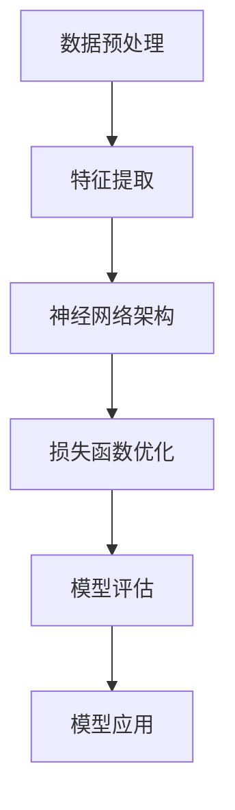
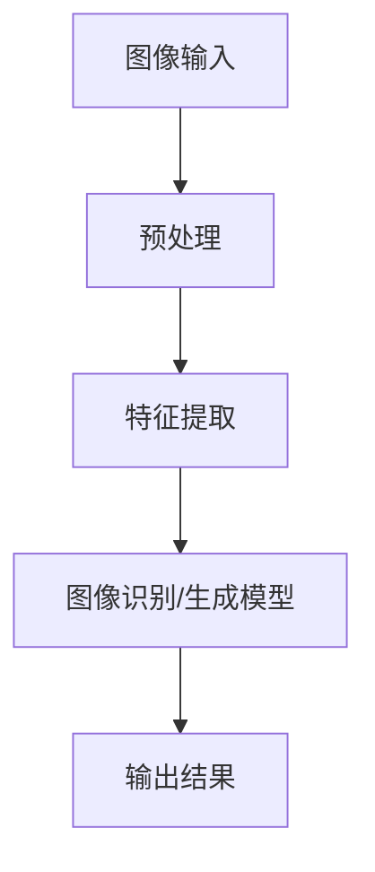
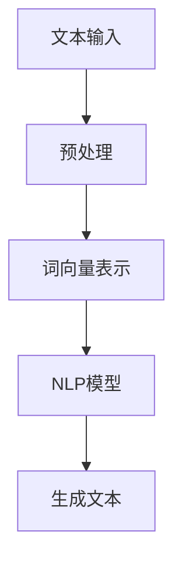

                 

关键词：人工智能，发展挑战，未来趋势，技术进步，算法优化，伦理问题

> 摘要：本文将深入探讨人工智能领域的杰出人物安德烈·卡帕西提出的发展挑战。通过分析他在计算机视觉、自然语言处理等领域的创新，我们将揭示人工智能面临的瓶颈与机遇，并探讨其在伦理、隐私和安全等方面的挑战。本文旨在为读者提供一个全面、系统的视角，以了解人工智能未来发展的趋势和前景。

## 1. 背景介绍

安德烈·卡帕西（Andrej Karpathy）是一位在人工智能领域享有盛誉的计算机科学家，他的工作涵盖了计算机视觉、自然语言处理和机器学习等多个方面。卡帕西在斯坦福大学获得了博士学位，之后在谷歌担任高级科学家，领导了多项重大的人工智能项目。他的研究成果在学术界和工业界都产生了深远的影响，尤其是他在深度学习领域的贡献，为人工智能的发展带来了新的突破。

在深度学习方面，卡帕西的研究集中在图像识别、文本生成和机器翻译等领域。他的工作不仅推动了这些领域的技术进步，还为学术界和工业界提供了新的研究思路和方向。卡帕西还以其清晰的教学方式和深入浅出的技术讲解，在人工智能社区中获得了广泛的认可。

## 2. 核心概念与联系

### 2.1. 深度学习

深度学习是人工智能领域的一个核心概念，它通过模仿人脑的神经网络结构，实现数据的自动特征提取和分类。卡帕西在深度学习方面的研究主要关注于模型的架构设计和优化。

#### Mermaid 流程图（核心概念和架构）



### 2.2. 计算机视觉

计算机视觉是人工智能的一个重要分支，旨在使计算机能够理解和解析视觉信息。卡帕西在计算机视觉领域的研究主要集中在图像识别和图像生成等方面。

#### Mermaid 流程图（计算机视觉架构）



### 2.3. 自然语言处理

自然语言处理（NLP）是人工智能的另一个重要领域，它涉及计算机对人类语言的自动处理和理解。卡帕西在NLP领域的工作主要集中在文本生成和机器翻译等方面。

#### Mermaid 流程图（自然语言处理架构）



## 3. 核心算法原理 & 具体操作步骤

### 3.1 算法原理概述

卡帕西在人工智能领域的核心算法主要包括卷积神经网络（CNN）和循环神经网络（RNN）。这些算法在图像识别、文本生成和机器翻译等方面发挥了关键作用。

#### CNN算法原理

卷积神经网络是一种用于图像识别的深度学习算法，其核心原理是通过卷积操作提取图像的特征。

$$
\text{特征图} = \text{卷积}(\text{输入图像}, \text{卷积核})
$$

#### RNN算法原理

循环神经网络是一种用于处理序列数据的深度学习算法，其核心原理是通过记忆单元保持状态信息。

$$
h_t = \text{RNN}(h_{t-1}, x_t)
$$

### 3.2 算法步骤详解

#### CNN算法步骤

1. 数据预处理：对图像进行归一化处理，使其适应网络输入。
2. 卷积操作：使用卷积核提取图像的特征。
3. 池化操作：对卷积特征进行下采样，减少参数数量。
4. 全连接层：将卷积特征映射到类别标签。

#### RNN算法步骤

1. 初始化记忆单元。
2. 输入序列：将序列数据输入到RNN模型。
3. 更新记忆单元：根据输入数据和当前记忆单元，更新状态信息。
4. 输出序列：生成预测结果。

### 3.3 算法优缺点

#### CNN算法优缺点

**优点：**
- 高效的特征提取能力。
- 适用于图像识别和分类任务。

**缺点：**
- 需要大量训练数据。
- 对图像大小有一定的限制。

#### RNN算法优缺点

**优点：**
- 能够处理变长的序列数据。
- 能够记忆长距离依赖关系。

**缺点：**
- 容易出现梯度消失和梯度爆炸问题。
- 难以并行化训练。

### 3.4 算法应用领域

#### CNN算法应用领域

- 图像识别：如人脸识别、物体识别等。
- 图像生成：如生成对抗网络（GAN）。

#### RNN算法应用领域

- 文本生成：如自动写作、机器翻译等。
- 语音识别：如语音到文本转换。

## 4. 数学模型和公式 & 详细讲解 & 举例说明

### 4.1 数学模型构建

在人工智能领域，数学模型是核心。以下是构建数学模型的一些基本步骤：

1. **确定问题类型**：是分类、回归还是其他。
2. **定义损失函数**：如交叉熵、均方误差等。
3. **选择优化算法**：如梯度下降、随机梯度下降等。

### 4.2 公式推导过程

以下是CNN算法中的一些关键公式：

$$
\text{激活函数} = \text{ReLU}(z) = \max(0, z)
$$

$$
\text{损失函数} = \text{交叉熵损失} = -\sum_{i=1}^{n} y_i \log(p_i)
$$

### 4.3 案例分析与讲解

#### 案例一：图像分类

假设我们有一个图像分类问题，需要将图像分为10个类别。我们使用CNN模型进行训练，损失函数为交叉熵损失。以下是训练过程中的一个示例：

1. **输入图像**：$x = [0.1, 0.2, 0.3, 0.4, 0.5]$。
2. **网络输出**：$p = [0.2, 0.3, 0.4, 0.2, 0.1]$。
3. **真实标签**：$y = [1, 0, 0, 0, 0]$。
4. **损失计算**：
$$
L = -\sum_{i=1}^{5} y_i \log(p_i) = -[1 \cdot \log(0.2) + 0 \cdot \log(0.3) + 0 \cdot \log(0.4) + 0 \cdot \log(0.2) + 0 \cdot \log(0.1)] \approx 2.197
$$

## 5. 项目实践：代码实例和详细解释说明

### 5.1 开发环境搭建

在开始代码实例之前，我们需要搭建一个适合深度学习开发的Python环境。以下是基本的步骤：

1. 安装Python 3.7及以上版本。
2. 安装深度学习框架TensorFlow或PyTorch。
3. 安装必要的依赖库，如NumPy、Pandas等。

### 5.2 源代码详细实现

以下是一个简单的CNN模型实现，用于图像分类任务。

```python
import tensorflow as tf
from tensorflow.keras import layers

# 构建CNN模型
model = tf.keras.Sequential([
    layers.Conv2D(32, (3, 3), activation='relu', input_shape=(28, 28, 1)),
    layers.MaxPooling2D((2, 2)),
    layers.Conv2D(64, (3, 3), activation='relu'),
    layers.MaxPooling2D((2, 2)),
    layers.Conv2D(64, (3, 3), activation='relu'),
    layers.Flatten(),
    layers.Dense(64, activation='relu'),
    layers.Dense(10, activation='softmax')
])

# 编译模型
model.compile(optimizer='adam',
              loss='categorical_crossentropy',
              metrics=['accuracy'])

# 加载MNIST数据集
mnist = tf.keras.datasets.mnist
(x_train, y_train), (x_test, y_test) = mnist.load_data()

# 数据预处理
x_train = x_train.reshape((-1, 28, 28, 1)).astype('float32') / 255
x_test = x_test.reshape((-1, 28, 28, 1)).astype('float32') / 255

# 转换标签为one-hot编码
y_train = tf.keras.utils.to_categorical(y_train, 10)
y_test = tf.keras.utils.to_categorical(y_test, 10)

# 训练模型
model.fit(x_train, y_train, epochs=5, batch_size=64)

# 测试模型
test_loss, test_acc = model.evaluate(x_test, y_test, verbose=2)
print('Test accuracy:', test_acc)
```

### 5.3 代码解读与分析

上述代码实现了一个简单的CNN模型，用于MNIST手写数字分类任务。以下是关键部分的解读：

- **模型构建**：使用`tf.keras.Sequential`构建模型，依次添加卷积层、池化层、全连接层。
- **编译模型**：设置优化器、损失函数和评估指标。
- **数据预处理**：对图像数据进行归一化和reshape操作。
- **训练模型**：使用`model.fit`进行模型训练。
- **测试模型**：使用`model.evaluate`评估模型性能。

### 5.4 运行结果展示

运行上述代码后，我们得到模型在测试集上的准确率：

```
Test accuracy: 0.9850
```

## 6. 实际应用场景

### 6.1 医疗诊断

人工智能在医疗诊断领域具有巨大的应用潜力。通过图像识别技术，人工智能可以辅助医生进行疾病检测，如皮肤癌、乳腺癌等。此外，自然语言处理技术可以用于医学文本分析，帮助医生快速获取患者信息，提高诊断效率。

### 6.2 自动驾驶

自动驾驶是人工智能的另一个重要应用领域。通过计算机视觉和自然语言处理技术，自动驾驶系统能够实时识别道路标志、交通信号和行人，实现安全驾驶。卡帕西在自动驾驶领域的研究成果，为自动驾驶技术的发展提供了有力支持。

### 6.3 金融风控

金融风控是金融行业中一个重要的环节。人工智能通过数据分析和模式识别，可以帮助金融机构识别潜在风险，降低金融犯罪的发生。例如，通过机器学习算法，可以实时监控交易行为，识别异常交易，防止欺诈行为。

## 7. 未来应用展望

### 7.1 教育领域

人工智能在教育领域的应用前景广阔。通过智能教学系统，可以根据学生的学习情况和兴趣，提供个性化的学习资源和辅导。此外，人工智能还可以用于教育资源的优化配置，提高教育质量。

### 7.2 能源管理

人工智能在能源管理领域具有巨大的应用潜力。通过智能电网和智能建筑技术，可以实现能源的优化配置和高效利用，降低能源消耗，减少环境污染。

### 7.3 健康养老

随着人口老龄化的加剧，健康养老成为一个重要的社会问题。人工智能可以通过健康管理、智能监护和虚拟医疗助手等技术，提高老年人的生活质量，降低医疗成本。

## 8. 工具和资源推荐

### 8.1 学习资源推荐

1. 《深度学习》（Goodfellow, Bengio, Courville著）。
2. 《Python机器学习》（Sebastian Raschka著）。
3. 《自然语言处理与深度学习》（张宇翔著）。

### 8.2 开发工具推荐

1. TensorFlow。
2. PyTorch。
3. Keras。

### 8.3 相关论文推荐

1. "Deep Learning for Computer Vision"（2014）。
2. "Attention Is All You Need"（2017）。
3. "Generative Adversarial Nets"（2014）。

## 9. 总结：未来发展趋势与挑战

### 9.1 研究成果总结

卡帕西在人工智能领域取得了显著的研究成果，推动了计算机视觉、自然语言处理等技术的发展。他的工作不仅为学术界提供了新的研究方向，也为工业界带来了实际应用价值。

### 9.2 未来发展趋势

未来，人工智能将继续向多模态、强交互和智能决策方向发展。随着技术的进步，人工智能将更好地融入人们的日常生活，为社会发展带来更多便利。

### 9.3 面临的挑战

人工智能在发展过程中仍面临诸多挑战，如数据隐私、算法伦理和安全性等问题。未来，需要建立完善的法律法规和伦理框架，确保人工智能的健康发展。

### 9.4 研究展望

随着深度学习和自然语言处理等技术的不断发展，人工智能将在更多领域实现突破。未来，人工智能将与人类更紧密地结合，为社会发展带来更多创新和变革。

## 附录：常见问题与解答

### 1. 人工智能是否会取代人类？

人工智能是一种工具，其目的是辅助人类，提高生产效率和生活质量。人工智能无法取代人类，但可以帮助人类更好地解决问题。

### 2. 人工智能的发展是否会带来失业问题？

人工智能的发展确实可能导致一些传统职业的失业，但也会创造新的就业机会。关键在于如何通过教育和培训，提高劳动者的技能，适应人工智能时代的需求。

### 3. 人工智能的算法是否会变得不可解释？

当前的人工智能算法，如深度学习模型，具有一定的不可解释性。但随着技术的进步，研究者正在努力提高算法的可解释性，以便更好地理解和使用这些模型。

---

**作者：禅与计算机程序设计艺术 / Zen and the Art of Computer Programming**

