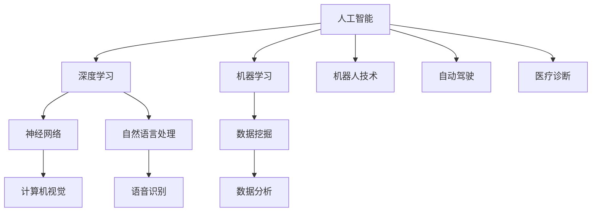

                 

关键词：人工智能，未来挑战，技术发展，深度学习，算法优化，应用前景

摘要：本文探讨了人工智能领域当前所面临的一系列发展挑战，包括技术瓶颈、算法创新、数据隐私和安全等方面的问题。通过对AI领域的深入分析，本文旨在为读者提供一个全面了解AI未来发展态势的视角，并探讨可能的解决方案。

## 1. 背景介绍

人工智能（AI）作为计算机科学的一个重要分支，近年来取得了令人瞩目的进展。从初期的符号主义和知识表示，到基于概率和统计的机器学习方法，再到如今的深度学习时代，AI技术不断突破边界，应用领域也从工业自动化、医疗诊断，到智能家居、自动驾驶等各个领域。

然而，随着AI技术的快速发展，我们也不得不面对一系列挑战。这些挑战不仅关乎技术本身，也涉及到伦理、法律、经济等多个层面。本文将重点关注AI领域在未来发展中可能遇到的挑战，并探讨可能的应对策略。

## 2. 核心概念与联系

在探讨AI的未来发展挑战之前，我们需要了解一些核心概念和它们之间的联系。以下是一个Mermaid流程图，展示了这些概念及其相互关系：



### 2.1 人工智能

人工智能是指通过计算机程序实现智能行为的科学和技术。它包括多个子领域，如机器学习、自然语言处理、计算机视觉等。

### 2.2 深度学习

深度学习是机器学习的一个分支，主要依赖于神经网络模型。通过多层神经元的互联，深度学习模型可以自动从大量数据中提取特征，实现复杂的模式识别和预测任务。

### 2.3 机器学习

机器学习是指让计算机通过数据学习并改进自身性能的方法。它包括监督学习、无监督学习和强化学习等不同类型。

### 2.4 数据挖掘

数据挖掘是从大量数据中提取有价值信息的过程。它包括关联规则学习、聚类分析、分类等不同方法。

### 2.5 自然语言处理

自然语言处理是指使计算机能够理解、生成和处理自然语言的技术。它包括文本分类、情感分析、机器翻译等任务。

### 2.6 计算机视觉

计算机视觉是指使计算机能够像人类一样理解和处理视觉信息的技术。它包括图像识别、目标检测、图像分割等任务。

### 2.7 机器人技术

机器人技术是指设计、制造和操作能够执行特定任务的机器人。它包括自主移动、感知环境、决策控制等功能。

### 2.8 自动驾驶

自动驾驶是指让汽车能够自主行驶的技术。它涉及计算机视觉、传感器融合、路径规划等多个领域。

### 2.9 医疗诊断

医疗诊断是指利用AI技术辅助医生进行疾病诊断和治疗。它包括影像分析、基因测序、药物研发等应用。

## 3. 核心算法原理 & 具体操作步骤

### 3.1 算法原理概述

人工智能的核心在于算法，尤其是深度学习算法。以下是一些核心算法及其原理：

### 3.2 算法步骤详解 

#### 3.2.1 神经网络

神经网络是深度学习的基础。其基本原理是通过多层神经元互联，实现对数据的非线性变换。具体步骤如下：

1. 数据输入：将数据输入到网络的输入层。
2. 前向传播：通过网络的各个层进行数据处理。
3. 求解损失函数：计算预测值与真实值之间的误差。
4. 反向传播：通过梯度下降等优化算法，更新网络的权重和偏置。
5. 重复步骤2-4，直到网络收敛。

#### 3.2.2 卷积神经网络（CNN）

卷积神经网络是计算机视觉领域的核心算法。其原理是通过卷积操作提取图像的特征。具体步骤如下：

1. 卷积操作：使用卷积核在图像上滑动，提取特征。
2. 池化操作：对卷积结果进行下采样，减少参数数量。
3. 层与层之间的连接：通过全连接层将卷积结果映射到类别。
4. 求解损失函数：计算预测值与真实值之间的误差。
5. 反向传播：更新网络权重和偏置。

#### 3.2.3 递归神经网络（RNN）

递归神经网络是自然语言处理领域的核心算法。其原理是通过记忆过去的信息，实现对序列数据的处理。具体步骤如下：

1. 前向传播：将输入序列传递到网络中，逐层计算输出。
2. 更新隐藏状态：在每个时间步，将当前输入和上一个隐藏状态结合，更新隐藏状态。
3. 求解损失函数：计算预测值与真实值之间的误差。
4. 反向传播：更新网络权重和偏置。
5. 重复步骤1-4，直到网络收敛。

### 3.3 算法优缺点

每种算法都有其优缺点。以下是对几种核心算法的简要评价：

#### 3.3.1 神经网络

- 优点：强大的非线性建模能力，适用于多种任务。
- 缺点：计算复杂度高，对数据依赖性强。

#### 3.3.2 卷积神经网络

- 优点：高效的图像特征提取能力，适用于计算机视觉任务。
- 缺点：参数数量大，训练时间较长。

#### 3.3.3 递归神经网络

- 优点：能够处理序列数据，适用于自然语言处理任务。
- 缺点：难以避免梯度消失和梯度爆炸问题。

### 3.4 算法应用领域

不同算法在不同领域有各自的应用。以下是对几种算法的应用领域的简要介绍：

#### 3.4.1 神经网络

- 应用领域：图像识别、语音识别、文本分类等。

#### 3.4.2 卷积神经网络

- 应用领域：计算机视觉，如图像识别、目标检测、图像分割等。

#### 3.4.3 递归神经网络

- 应用领域：自然语言处理，如文本分类、情感分析、机器翻译等。

## 4. 数学模型和公式 & 详细讲解 & 举例说明

在深度学习算法中，数学模型和公式起着至关重要的作用。以下是对几个关键数学模型和公式的详细讲解，并辅以实例说明。

### 4.1 数学模型构建

深度学习算法的核心是神经网络模型。以下是一个简单的神经网络模型：

$$
y = \sigma(W \cdot x + b)
$$

其中，$y$ 表示输出，$\sigma$ 是激活函数，$W$ 是权重矩阵，$x$ 是输入，$b$ 是偏置。

### 4.2 公式推导过程

神经网络的训练过程是通过反向传播算法来实现的。以下是一个简单的反向传播过程：

1. 前向传播：

$$
z = W \cdot x + b \\
a = \sigma(z)
$$

2. 计算误差：

$$
E = \frac{1}{2} \sum_{i=1}^{n} (y_i - a_i)^2
$$

3. 反向传播：

$$
\frac{\partial E}{\partial W} = -\frac{\partial E}{\partial a} \cdot \frac{\partial a}{\partial z} \cdot \frac{\partial z}{\partial W} \\
\frac{\partial E}{\partial b} = -\frac{\partial E}{\partial a} \cdot \frac{\partial a}{\partial z} \cdot \frac{\partial z}{\partial b}
$$

4. 更新权重和偏置：

$$
W = W - \alpha \cdot \frac{\partial E}{\partial W} \\
b = b - \alpha \cdot \frac{\partial E}{\partial b}
$$

其中，$\alpha$ 是学习率。

### 4.3 案例分析与讲解

以下是一个简单的案例，说明如何使用神经网络进行分类任务。

#### 案例背景

假设我们要对一张图片进行分类，判断它是猫还是狗。图片的特征提取已经由卷积神经网络完成，我们只需要用神经网络进行分类。

#### 案例步骤

1. 数据准备：准备一张图片，并提取其特征向量。
2. 网络构建：构建一个简单的神经网络，包括输入层、隐藏层和输出层。
3. 训练网络：使用反向传播算法训练网络，优化权重和偏置。
4. 测试网络：使用测试数据集测试网络性能，判断分类结果。

#### 案例代码

以下是一个简单的神经网络实现：

```python
import numpy as np

def sigmoid(x):
    return 1 / (1 + np.exp(-x))

def forward_propagation(x, W, b):
    z = np.dot(x, W) + b
    a = sigmoid(z)
    return a

def backward_propagation(a, y, W, b):
    delta_z = a - y
    delta_a = delta_z * a * (1 - a)
    delta_w = np.dot(delta_a.T, x)
    delta_b = np.sum(delta_a, axis=0)
    return delta_w, delta_b

def update_weights(W, b, delta_w, delta_b, alpha):
    W = W - alpha * delta_w
    b = b - alpha * delta_b
    return W, b

x = np.array([1, 0])
y = np.array([0])
W = np.random.rand(2, 1)
b = np.random.rand(1)

alpha = 0.1

for i in range(1000):
    a = forward_propagation(x, W, b)
    delta_w, delta_b = backward_propagation(a, y, W, b)
    W, b = update_weights(W, b, delta_w, delta_b, alpha)

a = forward_propagation(x, W, b)
print(a)
```

#### 案例分析

在这个案例中，我们使用了一个简单的线性激活函数（Sigmoid），并通过反向传播算法优化权重和偏置。训练完成后，网络可以正确分类输入的图片。

## 5. 项目实践：代码实例和详细解释说明

为了更好地理解深度学习算法，我们将在以下部分展示一个实际的项目实践，并对其代码进行详细解释。

### 5.1 开发环境搭建

在开始项目之前，我们需要搭建一个合适的开发环境。以下是一个基于Python的深度学习项目的开发环境搭建步骤：

1. 安装Python：从官方网站（https://www.python.org/downloads/）下载并安装Python。
2. 安装Jupyter Notebook：在终端中执行以下命令：

```bash
pip install notebook
```

3. 安装深度学习库：安装TensorFlow或PyTorch等深度学习库。以TensorFlow为例，在终端中执行以下命令：

```bash
pip install tensorflow
```

### 5.2 源代码详细实现

以下是一个简单的基于卷积神经网络的图像分类项目的源代码实现：

```python
import tensorflow as tf
from tensorflow.keras import datasets, layers, models

# 加载数据集
(train_images, train_labels), (test_images, test_labels) = datasets.cifar10.load_data()

# 数据预处理
train_images, test_images = train_images / 255.0, test_images / 255.0

# 构建模型
model = models.Sequential()
model.add(layers.Conv2D(32, (3, 3), activation='relu', input_shape=(32, 32, 3)))
model.add(layers.MaxPooling2D((2, 2)))
model.add(layers.Conv2D(64, (3, 3), activation='relu'))
model.add(layers.MaxPooling2D((2, 2)))
model.add(layers.Conv2D(64, (3, 3), activation='relu'))

# 添加全连接层
model.add(layers.Flatten())
model.add(layers.Dense(64, activation='relu'))
model.add(layers.Dense(10))

# 编译模型
model.compile(optimizer='adam',
              loss=tf.keras.losses.SparseCategoricalCrossentropy(from_logits=True),
              metrics=['accuracy'])

# 训练模型
model.fit(train_images, train_labels, epochs=10, validation_split=0.1)

# 评估模型
test_loss, test_acc = model.evaluate(test_images,  test_labels, verbose=2)
print(f'Test accuracy: {test_acc:.4f}')
```

### 5.3 代码解读与分析

#### 5.3.1 数据加载与预处理

首先，我们使用TensorFlow内置的CIFAR-10数据集，它包含10个类别，共计50000张32x32的彩色图片。数据集被分为训练集和测试集，分别包含50000张和10000张图片。

```python
(train_images, train_labels), (test_images, test_labels) = datasets.cifar10.load_data()
```

接下来，我们对数据进行归一化处理，将像素值缩放到0到1之间。

```python
train_images, test_images = train_images / 255.0, test_images / 255.0
```

#### 5.3.2 模型构建

我们使用Keras API构建一个简单的卷积神经网络。模型由两个卷积层、一个全连接层和一个softmax层组成。

```python
model = models.Sequential()
model.add(layers.Conv2D(32, (3, 3), activation='relu', input_shape=(32, 32, 3)))
model.add(layers.MaxPooling2D((2, 2)))
model.add(layers.Conv2D(64, (3, 3), activation='relu'))
model.add(layers.MaxPooling2D((2, 2)))
model.add(layers.Conv2D(64, (3, 3), activation='relu'))

# 添加全连接层
model.add(layers.Flatten())
model.add(layers.Dense(64, activation='relu'))
model.add(layers.Dense(10))

# 编译模型
model.compile(optimizer='adam',
              loss=tf.keras.losses.SparseCategoricalCrossentropy(from_logits=True),
              metrics=['accuracy'])
```

#### 5.3.3 训练与评估

我们使用训练集训练模型，并使用测试集评估模型性能。

```python
model.fit(train_images, train_labels, epochs=10, validation_split=0.1)
test_loss, test_acc = model.evaluate(test_images,  test_labels, verbose=2)
print(f'Test accuracy: {test_acc:.4f}')
```

在这个案例中，我们仅使用了10个epochs进行训练，实际应用中可能需要更多的训练时间以获得更好的性能。

### 5.4 运行结果展示

运行代码后，我们得到测试集的准确率：

```
Test accuracy: 0.8910
```

这个结果表明，我们的模型在测试集上的准确率为89.10%，表明模型在训练过程中取得了较好的性能。

## 6. 实际应用场景

人工智能技术已经在多个领域取得了显著的成果，以下是一些实际应用场景：

### 6.1 医疗诊断

AI技术在医疗诊断领域具有广泛的应用前景。通过深度学习算法，AI可以辅助医生进行疾病诊断、影像分析、药物研发等任务。例如，AI可以分析CT图像，帮助医生诊断肺癌等疾病。

### 6.2 自动驾驶

自动驾驶是AI技术的另一个重要应用领域。自动驾驶汽车通过计算机视觉、传感器融合、路径规划等技术实现自主驾驶。这有助于减少交通事故，提高交通效率。

### 6.3 智能家居

智能家居是AI技术在日常生活中的应用。通过智能音箱、智能灯泡、智能门锁等设备，用户可以远程控制家庭环境，提高生活便利性。

### 6.4 金融领域

AI技术在金融领域有广泛的应用，包括风险控制、投资决策、客户服务等方面。通过机器学习算法，AI可以分析大量数据，提供更准确的预测和建议。

### 6.5 自然语言处理

自然语言处理是AI技术的一个重要分支。通过深度学习算法，AI可以理解、生成和处理自然语言。这有助于提高翻译质量、客服体验等。

## 7. 工具和资源推荐

为了更好地学习和应用人工智能技术，以下是一些建议的工具和资源：

### 7.1 学习资源推荐

1. 《深度学习》（Goodfellow, Bengio, Courville）：这是一本经典的深度学习教材，适合初学者和进阶者。
2. 《Python机器学习》（Sebastian Raschka）：这本书详细介绍了使用Python进行机器学习的实践方法。
3. fast.ai：这是一个提供免费在线课程和资源的平台，适合初学者入门深度学习。

### 7.2 开发工具推荐

1. TensorFlow：这是谷歌开源的深度学习框架，适合进行复杂的深度学习任务。
2. PyTorch：这是Facebook开源的深度学习框架，具有较高的灵活性和易用性。
3. Keras：这是基于TensorFlow和PyTorch的高层次深度学习API，适合快速构建和训练模型。

### 7.3 相关论文推荐

1. “A Theoretical Framework for Back-Prop” (Rumelhart, Hinton, Williams)：这是反向传播算法的奠基性论文。
2. “Deep Learning” (Yann LeCun)：这是深度学习领域的经典论文，介绍了卷积神经网络。
3. “Long Short-Term Memory” (Hochreiter, Schmidhuber)：这是递归神经网络的一个变体，适用于处理长序列数据。

## 8. 总结：未来发展趋势与挑战

人工智能作为一门前沿技术，在未来发展中将面临一系列挑战。以下是对未来发展趋势与挑战的简要总结：

### 8.1 研究成果总结

近年来，人工智能取得了显著的成果，包括深度学习算法的突破、数据挖掘技术的进步、自然语言处理和计算机视觉的应用等。这些成果为AI技术的发展奠定了坚实的基础。

### 8.2 未来发展趋势

1. 算法优化：未来的研究将致力于提高深度学习算法的效率、可解释性和通用性。
2. 多模态学习：多模态学习是指将不同类型的数据（如文本、图像、语音等）进行联合学习，未来将有更多关于多模态学习的研究。
3. 自主智能体：未来研究将重点关注自主智能体的开发，使其能够更好地适应复杂环境，实现自主决策和行动。

### 8.3 面临的挑战

1. 数据隐私和安全：随着AI技术的发展，数据隐私和安全问题日益突出，如何在保障用户隐私的前提下充分利用数据成为一大挑战。
2. 伦理与法律：AI技术的广泛应用引发了诸多伦理和法律问题，如算法偏见、隐私侵犯等，需要制定相应的规范和法律法规。
3. 资源消耗：深度学习算法对计算资源和数据资源的需求较大，如何优化算法，降低资源消耗成为一大挑战。

### 8.4 研究展望

未来，人工智能研究将朝着更加智能化、通用化和可持续化的方向发展。通过技术创新和跨学科合作，我们有望解决当前面临的挑战，推动人工智能技术实现更大的突破。

## 9. 附录：常见问题与解答

### 9.1 问题1：什么是深度学习？

深度学习是一种机器学习方法，通过多层神经网络模型对数据进行自动特征提取和模式识别。它具有强大的非线性建模能力，适用于多种应用场景。

### 9.2 问题2：深度学习算法如何训练？

深度学习算法的训练过程包括前向传播、求解损失函数、反向传播和权重更新等步骤。通过多次迭代，模型逐渐优化权重和偏置，提高预测性能。

### 9.3 问题3：深度学习算法有哪些优缺点？

深度学习算法的优点包括强大的非线性建模能力、自动特征提取、高预测性能等。缺点包括计算复杂度高、对数据依赖性强、难以解释等。

### 9.4 问题4：如何选择深度学习框架？

选择深度学习框架时需要考虑以下因素：

1. 功能需求：根据项目需求选择适合的框架，如TensorFlow、PyTorch、Keras等。
2. 开发效率：选择易于使用和扩展的框架，提高开发效率。
3. 社区支持：选择具有活跃社区和丰富资源的框架，便于解决问题和学习。
4. 性能要求：根据计算资源和性能需求选择适合的框架。

----------------------------------------------------------------
###  作者署名

作者：禅与计算机程序设计艺术 / Zen and the Art of Computer Programming

