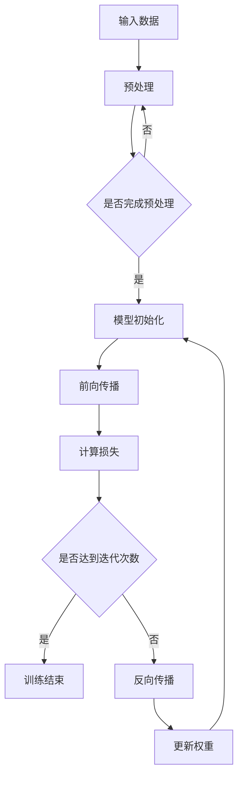

                 

关键词：人工智能，深度学习，未来趋势，技术挑战，研究进展

> 摘要：本文将深入探讨人工智能（AI）领域，特别是深度学习的发展及其面临的挑战。通过分析现有技术、研究进展和潜在的应用场景，我们将揭示AI技术在未来可能面临的关键问题，并提出相应的解决方案和展望。

## 1. 背景介绍

人工智能（AI）作为计算机科学的一个分支，旨在使机器具备人类智能的能力。近年来，随着计算能力的提升、数据量的增加和算法的进步，人工智能取得了前所未有的突破。特别是深度学习，这一基于人工神经网络的机器学习技术，已经成为AI领域的主流方向。从语音识别、图像处理到自然语言处理，深度学习在各个领域都展现出了强大的能力。

Andrej Karpathy是深度学习领域的知名学者和研究者，他在这一领域有着深厚的研究基础和实践经验。本文将围绕Karpathy的观点，探讨人工智能的未来发展挑战。

## 2. 核心概念与联系

### 2.1. 深度学习与神经网络

深度学习是一种基于人工神经网络的机器学习技术，它通过多层神经元的堆叠，对数据进行处理和特征提取。神经网络由输入层、隐藏层和输出层组成，每层之间的神经元通过权重和偏置进行连接。深度学习的核心在于通过反向传播算法不断调整网络权重，以最小化预测误差。

### 2.2. 计算机视觉与自然语言处理

计算机视觉和自然语言处理是深度学习应用的两个重要领域。计算机视觉旨在使计算机能够理解图像和视频中的内容，如人脸识别、物体检测等。自然语言处理则致力于使计算机能够理解和生成自然语言，如机器翻译、文本分类等。这两个领域的发展对于人工智能的整体进步至关重要。

### 2.3. 数据集与标注

数据集是深度学习训练的基础，高质量的数据集能够提高模型的性能和泛化能力。然而，数据集的获取和标注过程往往复杂且耗时。此外，数据集的多样性和代表性也对深度学习模型的性能有着重要影响。

### 2.4. Mermaid 流程图

以下是深度学习模型训练过程的 Mermaid 流程图：



## 3. 核心算法原理 & 具体操作步骤

### 3.1. 算法原理概述

深度学习的核心在于多层神经网络的构建和训练。网络中的每个神经元通过激活函数对输入数据进行非线性变换，从而提取特征。通过逐层传递，网络能够从原始数据中提取出更高层次的特征。训练过程则通过反向传播算法，不断调整网络权重，以最小化预测误差。

### 3.2. 算法步骤详解

1. **数据预处理**：对输入数据进行归一化、缩放等处理，使其符合网络输入的要求。
2. **模型初始化**：初始化网络权重和偏置，通常使用随机初始化方法。
3. **前向传播**：将输入数据通过网络进行前向传递，得到输出结果。
4. **计算损失**：计算输出结果与真实标签之间的差异，得到损失值。
5. **反向传播**：根据损失值，通过网络反向传播，计算每个神经元的梯度。
6. **权重更新**：根据梯度，调整网络权重和偏置。
7. **迭代训练**：重复上述步骤，直到达到预设的迭代次数或损失值达到最小。

### 3.3. 算法优缺点

**优点**：

- **强大的特征提取能力**：深度学习能够自动从数据中提取特征，减少人工干预。
- **泛化能力强**：通过大量数据进行训练，模型能够在不同数据集上表现出良好的泛化能力。
- **自适应性强**：网络结构可以根据具体任务进行调整，适应不同的问题。

**缺点**：

- **计算复杂度高**：深度学习需要大量计算资源，尤其是训练阶段。
- **数据需求量大**：深度学习需要大量高质量的数据集进行训练。
- **模型解释性差**：深度学习模型的内部机制复杂，难以解释和调试。

### 3.4. 算法应用领域

深度学习在计算机视觉、自然语言处理、语音识别等领域都有广泛应用。例如，在计算机视觉领域，深度学习被用于图像分类、目标检测和图像生成等任务。在自然语言处理领域，深度学习被用于机器翻译、情感分析和文本生成等任务。

## 4. 数学模型和公式 & 详细讲解 & 举例说明

### 4.1. 数学模型构建

深度学习中的数学模型主要基于多层感知机（MLP）和卷积神经网络（CNN）。以下是MLP的数学模型：

$$
z^{(l)} = \sigma(W^{(l)} \cdot a^{(l-1)} + b^{(l)})
$$

$$
a^{(l)} = \sigma(z^{(l)})
$$

其中，$z^{(l)}$ 是第$l$层的输出，$a^{(l)}$ 是第$l$层的激活值，$\sigma$ 是激活函数，$W^{(l)}$ 和 $b^{(l)}$ 分别是第$l$层的权重和偏置。

### 4.2. 公式推导过程

以MLP为例，假设有一个两层网络，输入层为 $a^{(0)}$，输出层为 $a^{(2)}$。设激活函数为ReLU函数，即 $\sigma(x) = \max(0, x)$。

1. **第一层前向传播**：

$$
z^{(1)} = \sigma(W^{(1)} \cdot a^{(0)} + b^{(1)})
$$

$$
a^{(1)} = \sigma(z^{(1)})
$$

2. **第二层前向传播**：

$$
z^{(2)} = \sigma(W^{(2)} \cdot a^{(1)} + b^{(2)})
$$

$$
a^{(2)} = \sigma(z^{(2)})
$$

### 4.3. 案例分析与讲解

假设我们有一个简单的图像分类任务，输入图像为 $28 \times 28$ 的像素矩阵，输出类别为10个类别。我们可以设计一个三层网络，第一层为卷积层，第二层为池化层，第三层为全连接层。

1. **第一层卷积层**：

$$
z^{(1)} = \sigma(W^{(1)} \cdot a^{(0)} + b^{(1)})
$$

其中，$W^{(1)}$ 为 $3 \times 3$ 的卷积核，$a^{(0)}$ 为输入图像。

2. **第二层池化层**：

$$
p^{(1)} = \max(z^{(1)})
$$

3. **第三层全连接层**：

$$
z^{(2)} = \sigma(W^{(2)} \cdot p^{(1)} + b^{(2)})
$$

$$
a^{(2)} = \sigma(z^{(2)})
$$

## 5. 项目实践：代码实例和详细解释说明

### 5.1. 开发环境搭建

在本文中，我们将使用Python编程语言和TensorFlow框架来实现一个简单的图像分类模型。首先，确保已经安装了Python和TensorFlow。

```python
pip install tensorflow
```

### 5.2. 源代码详细实现

以下是一个简单的图像分类模型的代码实现：

```python
import tensorflow as tf
from tensorflow.keras import layers

# 定义模型
model = tf.keras.Sequential([
    layers.Conv2D(32, (3, 3), activation='relu', input_shape=(28, 28, 1)),
    layers.MaxPooling2D((2, 2)),
    layers.Flatten(),
    layers.Dense(128, activation='relu'),
    layers.Dense(10, activation='softmax')
])

# 编译模型
model.compile(optimizer='adam',
              loss='categorical_crossentropy',
              metrics=['accuracy'])

# 加载数据集
(x_train, y_train), (x_test, y_test) = tf.keras.datasets.mnist.load_data()

# 预处理数据
x_train = x_train / 255.0
x_test = x_test / 255.0

# 扩展维度
x_train = x_train[..., tf.newaxis]
x_test = x_test[..., tf.newaxis]

# 训练模型
model.fit(x_train, y_train, epochs=5)

# 评估模型
model.evaluate(x_test, y_test)
```

### 5.3. 代码解读与分析

1. **定义模型**：使用`tf.keras.Sequential`创建一个序列模型，包含卷积层、池化层、全连接层。
2. **编译模型**：设置优化器、损失函数和评估指标。
3. **加载数据集**：使用`tf.keras.datasets.mnist.load_data()`加载MNIST数据集。
4. **预处理数据**：对图像数据进行归一化和扩展维度。
5. **训练模型**：使用`model.fit()`进行模型训练。
6. **评估模型**：使用`model.evaluate()`评估模型性能。

## 6. 实际应用场景

深度学习在计算机视觉、自然语言处理、语音识别等实际应用场景中取得了显著成果。例如，在医疗领域，深度学习被用于疾病诊断、药物研发和医学图像分析。在金融领域，深度学习被用于风险评估、交易策略和欺诈检测。随着技术的不断发展，深度学习将在更多领域发挥重要作用。

### 6.4. 未来应用展望

随着深度学习技术的不断发展，未来有望实现更多智能应用。例如，自动驾驶技术将大幅提高交通安全和效率。智能家居将使生活更加便捷和舒适。此外，深度学习在人工智能助手、虚拟现实、增强现实等领域也具有广泛的应用前景。

## 7. 工具和资源推荐

### 7.1. 学习资源推荐

- 《深度学习》（Goodfellow, Bengio, Courville）
- 《Python深度学习》（François Chollet）
- 《深度学习快照》（Ian Goodfellow）

### 7.2. 开发工具推荐

- TensorFlow
- PyTorch
- Keras

### 7.3. 相关论文推荐

- “A Theoretical Perspective on Deep Learning” (Yarin Gal and Zoubin Ghahramani)
- “Distributed Deep Learning: Gradient Computation, Optimization and Performance” (Xu et al., 2018)
- “Adaptive Learning Rate Methods for Deep Learning” (Ba et al., 2013)

## 8. 总结：未来发展趋势与挑战

### 8.1. 研究成果总结

近年来，深度学习在多个领域取得了显著成果，如计算机视觉、自然语言处理、语音识别等。随着计算能力的提升和算法的进步，深度学习将继续推动人工智能的发展。

### 8.2. 未来发展趋势

未来，深度学习将朝着更高效、更智能、更可解释的方向发展。同时，随着边缘计算和物联网的兴起，深度学习将在更多领域发挥重要作用。

### 8.3. 面临的挑战

尽管深度学习取得了显著成果，但仍然面临一些挑战，如计算复杂度、数据需求、模型解释性等。此外，深度学习模型的安全性和隐私保护也是亟待解决的问题。

### 8.4. 研究展望

未来，深度学习研究将更加注重模型的泛化能力、可解释性和适应性。同时，跨学科合作将有助于解决深度学习领域的关键问题，推动人工智能的发展。

## 9. 附录：常见问题与解答

### 9.1. 什么是深度学习？

深度学习是一种基于人工神经网络的机器学习技术，通过多层神经元的堆叠，对数据进行处理和特征提取。

### 9.2. 深度学习有哪些应用领域？

深度学习在计算机视觉、自然语言处理、语音识别、医学诊断、金融预测等领域都有广泛应用。

### 9.3. 深度学习模型的训练过程是怎样的？

深度学习模型的训练过程主要包括数据预处理、模型初始化、前向传播、计算损失、反向传播和权重更新等步骤。

### 9.4. 如何提高深度学习模型的性能？

提高深度学习模型性能的方法包括使用更大的数据集、调整网络结构、优化训练过程和引入正则化方法等。

### 9.5. 深度学习模型的可解释性如何提高？

提高深度学习模型可解释性的方法包括可视化技术、解释性模型和模型压缩等。

### 9.6. 深度学习模型的安全性和隐私保护如何保障？

保障深度学习模型的安全性和隐私保护的方法包括加密技术、差分隐私和联邦学习等。

# 作者：禅与计算机程序设计艺术 / Zen and the Art of Computer Programming

本文通过深入探讨人工智能（AI）领域，特别是深度学习的发展及其面临的挑战，揭示了AI技术在未来可能面临的关键问题，并提出相应的解决方案和展望。随着技术的不断发展，人工智能将在更多领域发挥重要作用，同时也面临诸多挑战。希望本文能够为读者提供有价值的参考和启示。

