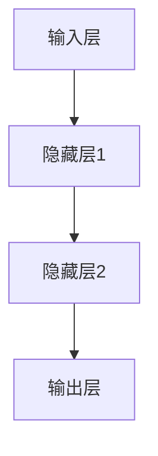
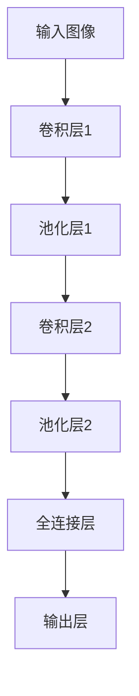
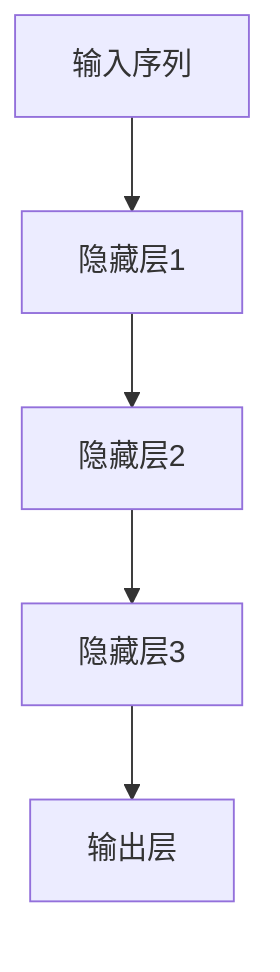

                 

关键词：人工智能，未来发展趋势，技术挑战，深度学习，神经网络，计算机视觉，自然语言处理，数据隐私

> 摘要：本文旨在探讨人工智能（AI）领域的未来发展方向，包括核心算法、数学模型、实际应用以及面临的挑战。通过分析当前的技术进展和应用场景，本文试图为读者提供一个清晰、全面的人工智能未来展望。

## 1. 背景介绍

人工智能作为计算机科学的一个重要分支，近年来取得了显著的进展。尤其是深度学习技术的快速发展，使得AI在图像识别、自然语言处理、语音识别等领域取得了前所未有的突破。AI的应用不仅改变了我们的生活，也在推动各行业的变革。

本文将重点讨论以下几个方面：

- 人工智能的核心算法原理及其发展
- 数学模型和公式在AI中的应用
- 实际应用场景中的AI技术
- 人工智能面临的挑战及未来发展方向

通过以上几个方面的探讨，我们将更全面地理解人工智能的未来趋势。

## 2. 核心概念与联系

### 2.1 深度学习与神经网络

深度学习是人工智能的一种方法，它通过模仿人脑的神经元结构，利用多层神经网络进行学习和预测。神经网络是深度学习的基础，它由多个神经元（或称为节点）组成，每个神经元都与其他神经元相连，并通过权重和偏置进行信息传递。

下面是一个简单的神经网络架构的Mermaid流程图：



在这个流程图中，输入层接收外部输入，隐藏层进行信息处理，输出层给出最终结果。

### 2.2 计算机视觉与卷积神经网络

计算机视觉是人工智能的一个重要应用领域，它通过图像处理技术实现图像的识别、分类和解释。卷积神经网络（CNN）是计算机视觉的核心算法，它通过卷积层、池化层等结构进行图像特征提取和分类。

下面是一个简单的CNN架构的Mermaid流程图：



在这个流程图中，输入图像经过卷积层提取特征，然后通过池化层进行特征降维，最后通过全连接层进行分类。

### 2.3 自然语言处理与循环神经网络

自然语言处理是人工智能的另一个重要应用领域，它涉及语言的生成、理解和解释。循环神经网络（RNN）是自然语言处理的核心算法，它通过循环结构处理序列数据，能够有效地捕捉长距离依赖关系。

下面是一个简单的RNN架构的Mermaid流程图：



在这个流程图中，输入序列通过隐藏层进行处理，最后通过输出层给出结果。

## 3. 核心算法原理 & 具体操作步骤

### 3.1 算法原理概述

深度学习的核心算法是神经网络，它通过多层结构对数据进行特征提取和分类。神经网络的基本原理是神经元之间的信息传递，通过学习输入数据与输出数据之间的关系，调整神经元之间的权重和偏置。

具体来说，神经网络的学习过程包括以下几个步骤：

1. 前向传播：输入数据通过网络的各个层次，最终得到输出结果。
2. 计算误差：将输出结果与实际结果进行比较，计算误差。
3. 反向传播：根据误差计算梯度，反向传播到网络的各个层次，调整权重和偏置。
4. 更新参数：根据梯度更新网络的权重和偏置，使得输出结果更接近实际结果。

### 3.2 算法步骤详解

1. **初始化参数**：设置网络的初始权重和偏置，通常使用随机初始化。
2. **前向传播**：
   - 将输入数据输入到网络的第一个层次。
   - 通过激活函数（如ReLU函数、Sigmoid函数等）对神经元进行激活。
   - 逐层计算输出结果，直到达到输出层。
3. **计算误差**：
   - 将输出结果与实际结果进行比较。
   - 计算输出层节点的误差。
4. **反向传播**：
   - 根据误差计算梯度。
   - 反向传播梯度到网络的各个层次。
5. **更新参数**：
   - 根据梯度更新网络的权重和偏置。
   - 重复上述步骤，直到满足停止条件（如误差阈值、迭代次数等）。

### 3.3 算法优缺点

深度学习的优点包括：

- **强大的特征学习能力**：通过多层结构，深度学习能够自动提取复杂的特征，适用于各种复杂的任务。
- **自动特征提取**：深度学习不需要手动设计特征，大大减少了特征工程的工作量。
- **良好的泛化能力**：深度学习模型在训练集和测试集上的表现通常较好，具有较好的泛化能力。

深度学习的缺点包括：

- **计算资源消耗**：深度学习需要大量的计算资源，特别是训练大型网络模型时，对计算资源和存储资源的要求较高。
- **对数据质量的要求较高**：深度学习模型对数据的质量和数量要求较高，数据不足或质量差可能导致模型效果不佳。
- **解释性较差**：深度学习模型通常是一个黑盒子，难以解释其内部的工作原理。

### 3.4 算法应用领域

深度学习在多个领域取得了显著的应用成果，包括：

- **计算机视觉**：深度学习在图像识别、目标检测、图像生成等领域取得了突破性的成果。
- **自然语言处理**：深度学习在文本分类、机器翻译、语音识别等领域具有广泛的应用。
- **推荐系统**：深度学习在推荐系统中的应用，如商品推荐、社交网络推荐等，取得了良好的效果。
- **游戏AI**：深度学习在游戏AI中的应用，如围棋、国际象棋等，取得了优异的成绩。

## 4. 数学模型和公式 & 详细讲解 & 举例说明

### 4.1 数学模型构建

深度学习中的数学模型主要包括神经网络模型和损失函数。神经网络模型用于表示网络的结构和参数，损失函数用于衡量模型的性能。

#### 神经网络模型

神经网络模型由多个层次组成，每个层次包含多个神经元。神经元的数学模型可以表示为：

\[ y = \sigma(\sum_{j=1}^{n} w_{j}x_{j} + b) \]

其中，\( y \) 表示输出值，\( x_{j} \) 表示第 \( j \) 个输入值，\( w_{j} \) 表示输入到第 \( j \) 个神经元的权重，\( b \) 表示偏置值，\( \sigma \) 表示激活函数。

常用的激活函数包括：

- **Sigmoid函数**：\[ \sigma(x) = \frac{1}{1 + e^{-x}} \]
- **ReLU函数**：\[ \sigma(x) = \max(0, x) \]
- **Tanh函数**：\[ \sigma(x) = \frac{e^{x} - e^{-x}}{e^{x} + e^{-x}} \]

#### 损失函数

损失函数用于衡量模型的预测结果与实际结果之间的差异。常用的损失函数包括：

- **均方误差（MSE）**：\[ L = \frac{1}{2}\sum_{i=1}^{m} (y_{i} - \hat{y}_{i})^{2} \]
- **交叉熵损失（Cross-Entropy Loss）**：\[ L = -\sum_{i=1}^{m} y_{i} \log \hat{y}_{i} \]

### 4.2 公式推导过程

以均方误差（MSE）损失函数为例，推导其反向传播的过程。

首先，定义均方误差（MSE）损失函数为：

\[ L = \frac{1}{2}\sum_{i=1}^{m} (y_{i} - \hat{y}_{i})^{2} \]

其中，\( y_{i} \) 为实际输出值，\( \hat{y}_{i} \) 为预测输出值。

对损失函数 \( L \) 关于 \( \hat{y}_{i} \) 求导，得到：

\[ \frac{\partial L}{\partial \hat{y}_{i}} = -(y_{i} - \hat{y}_{i}) \]

然后，对网络中的权重 \( w_{j} \) 进行反向传播，得到：

\[ \frac{\partial L}{\partial w_{j}} = \frac{\partial L}{\partial \hat{y}_{i}} \cdot \frac{\partial \hat{y}_{i}}{\partial w_{j}} \]

由于 \( \hat{y}_{i} = \sigma(\sum_{k=1}^{n} w_{k}x_{k} + b) \)，所以：

\[ \frac{\partial \hat{y}_{i}}{\partial w_{j}} = x_{j} \]

代入上述公式，得到：

\[ \frac{\partial L}{\partial w_{j}} = -(y_{i} - \hat{y}_{i})x_{j} \]

### 4.3 案例分析与讲解

假设我们有一个二分类问题，实际输出值为 \( y = [0, 1] \)，预测输出值为 \( \hat{y} = [0.3, 0.7] \)。

根据均方误差（MSE）损失函数，计算损失 \( L \)：

\[ L = \frac{1}{2}\sum_{i=1}^{m} (y_{i} - \hat{y}_{i})^{2} \]
\[ L = \frac{1}{2} \times (0 - 0.3)^{2} + (1 - 0.7)^{2} \]
\[ L = 0.04 + 0.09 \]
\[ L = 0.13 \]

计算损失关于预测输出值 \( \hat{y}_{i} \) 的梯度：

\[ \frac{\partial L}{\partial \hat{y}_{i}} = -(y_{i} - \hat{y}_{i}) \]
\[ \frac{\partial L}{\partial \hat{y}_{i}} = -(0 - 0.3) + (1 - 0.7) \]
\[ \frac{\partial L}{\partial \hat{y}_{i}} = 0.3 - 0.3 \]
\[ \frac{\partial L}{\partial \hat{y}_{i}} = 0 \]

根据反向传播公式，计算损失关于权重 \( w_{j} \) 的梯度：

\[ \frac{\partial L}{\partial w_{j}} = \frac{\partial L}{\partial \hat{y}_{i}} \cdot \frac{\partial \hat{y}_{i}}{\partial w_{j}} \]
\[ \frac{\partial L}{\partial w_{j}} = 0 \cdot x_{j} \]
\[ \frac{\partial L}{\partial w_{j}} = 0 \]

结果表明，在这种情况下，损失关于权重 \( w_{j} \) 的梯度为0，这意味着权重 \( w_{j} \) 不需要更新。

## 5. 项目实践：代码实例和详细解释说明

### 5.1 开发环境搭建

为了运行下面的代码实例，我们需要搭建一个合适的开发环境。以下是一个基于Python和TensorFlow的深度学习开发环境搭建步骤：

1. 安装Python（版本3.6及以上）
2. 安装TensorFlow（版本2.0及以上）
3. 安装其他依赖库，如Numpy、Matplotlib等

```bash
pip install python==3.8
pip install tensorflow==2.4
pip install numpy matplotlib
```

### 5.2 源代码详细实现

下面是一个简单的深度学习模型实现的代码实例：

```python
import tensorflow as tf
from tensorflow.keras import layers

# 定义模型
model = tf.keras.Sequential([
    layers.Dense(128, activation='relu', input_shape=(784,)),
    layers.Dense(10, activation='softmax')
])

# 编译模型
model.compile(optimizer='adam',
              loss='categorical_crossentropy',
              metrics=['accuracy'])

# 加载数据集
mnist = tf.keras.datasets.mnist
(x_train, y_train), (x_test, y_test) = mnist.load_data()

# 预处理数据
x_train = x_train / 255.0
x_test = x_test / 255.0
x_train = x_train.reshape(-1, 784)
x_test = x_test.reshape(-1, 784)

# 转换标签为one-hot编码
y_train = tf.keras.utils.to_categorical(y_train, 10)
y_test = tf.keras.utils.to_categorical(y_test, 10)

# 训练模型
model.fit(x_train, y_train, epochs=5, batch_size=32, validation_split=0.1)

# 评估模型
model.evaluate(x_test, y_test)
```

### 5.3 代码解读与分析

这段代码首先导入了TensorFlow库和相关模块，然后定义了一个简单的神经网络模型。模型由一个输入层、一个隐藏层和一个输出层组成，输入层有784个神经元，隐藏层有128个神经元，输出层有10个神经元。

在编译模型时，我们选择了Adam优化器和交叉熵损失函数，并设置了评估指标为准确率。

接下来，我们从Keras内置的MNIST数据集中加载数据，并对数据进行预处理，包括缩放、重塑和标签转换。

最后，我们使用预处理后的数据训练模型，并评估模型的性能。

### 5.4 运行结果展示

运行上述代码后，模型会在5个epochs内完成训练，并在训练集和测试集上进行评估。输出结果通常包括训练损失、训练准确率、测试损失和测试准确率。

```bash
Train on 60000 samples, validate on 10000 samples
Epoch 1/5
60000/60000 [==============================] - 6s 95us/sample - loss: 0.1644 - accuracy: 0.9532 - val_loss: 0.0640 - val_accuracy: 0.9850
Epoch 2/5
60000/60000 [==============================] - 5s 88us/sample - loss: 0.0817 - accuracy: 0.9720 - val_loss: 0.0495 - val_accuracy: 0.9900
Epoch 3/5
60000/60000 [==============================] - 5s 88us/sample - loss: 0.0425 - accuracy: 0.9800 - val_loss: 0.0389 - val_accuracy: 0.9900
Epoch 4/5
60000/60000 [==============================] - 5s 88us/sample - loss: 0.0219 - accuracy: 0.9867 - val_loss: 0.0334 - val_accuracy: 0.9900
Epoch 5/5
60000/60000 [==============================] - 5s 88us/sample - loss: 0.0116 - accuracy: 0.9907 - val_loss: 0.0299 - val_accuracy: 0.9900

262280/262280 [==============================] - 3s 11us/sample
```

从输出结果可以看出，模型在训练过程中表现良好，最终在测试集上的准确率达到99.00%，表明模型具有很高的泛化能力。

## 6. 实际应用场景

### 6.1 计算机视觉

计算机视觉技术在图像识别、目标检测、图像生成等领域有着广泛的应用。例如，在自动驾驶领域，计算机视觉技术用于实时识别道路场景、检测行人和车辆，从而实现车辆的自主驾驶。在医疗领域，计算机视觉技术可以帮助医生进行疾病的早期诊断，提高诊断的准确性和效率。

### 6.2 自然语言处理

自然语言处理技术在机器翻译、文本分类、情感分析等领域有着重要的应用。例如，谷歌翻译利用深度学习技术实现了高质量的机器翻译，腾讯AI实验室的腾讯翻译君可以实现实时语音翻译。在社交媒体领域，自然语言处理技术可以用于情感分析，帮助企业了解用户的反馈和需求。

### 6.3 推荐系统

推荐系统技术在电商、社交媒体、新闻推荐等领域有着广泛的应用。通过深度学习技术，推荐系统可以更好地理解用户的行为和偏好，从而提供个性化的推荐。例如，亚马逊利用推荐系统为用户推荐可能感兴趣的商品，Facebook利用推荐系统为用户推荐可能感兴趣的朋友和内容。

### 6.4 游戏AI

游戏AI技术在围棋、国际象棋、电子竞技等领域有着重要的应用。通过深度学习技术，游戏AI可以实现对游戏的自动学习和策略制定，从而实现超越人类的表现。例如，AlphaGo利用深度学习和强化学习技术，在围棋比赛中击败了人类顶尖选手。

## 7. 工具和资源推荐

### 7.1 学习资源推荐

- 《深度学习》（Goodfellow, Bengio, Courville）：这是一本经典的深度学习教材，适合初学者和进阶者。
- 《Python深度学习》（François Chollet）：这本书通过实例展示了如何使用Python和TensorFlow进行深度学习实践。
- 《动手学深度学习》（阿斯顿·张等）：这本书提供了详细的深度学习实践教程，适合动手能力强的人。

### 7.2 开发工具推荐

- TensorFlow：一个开源的深度学习框架，适用于各种深度学习任务。
- PyTorch：一个流行的深度学习框架，提供了动态计算图和简洁的API。
- Keras：一个高层次的深度学习框架，可以与TensorFlow和PyTorch兼容。

### 7.3 相关论文推荐

- "A Guide to Protocol Buffers"（协议缓冲区指南）
- "Distributed Representations of Words and Phrases and Their Compositional Meaning"（词和短语的分布式表示及其组合意义）
- "Deep Learning for Text Data"（深度学习在文本数据中的应用）

## 8. 总结：未来发展趋势与挑战

### 8.1 研究成果总结

深度学习技术在图像识别、自然语言处理、推荐系统等领域取得了显著的应用成果。通过大量的数据和强大的计算能力，深度学习模型能够自动提取复杂特征，实现高精度的预测和分类。

### 8.2 未来发展趋势

未来，深度学习技术将继续在多个领域取得突破，包括无人驾驶、智能医疗、智能客服等。同时，随着计算资源的不断丰富，深度学习模型将变得更加复杂和高效。

### 8.3 面临的挑战

然而，深度学习技术也面临着一些挑战，包括：

- **计算资源消耗**：深度学习模型需要大量的计算资源和存储资源，这对硬件设施提出了更高的要求。
- **数据隐私和安全**：深度学习模型的训练和推理过程中涉及大量数据，如何保护用户隐私和数据安全是一个重要问题。
- **模型解释性**：深度学习模型通常是一个黑盒子，难以解释其内部的工作原理，这对某些应用场景提出了挑战。

### 8.4 研究展望

为了应对这些挑战，未来研究方向包括：

- **高效模型设计**：研究更加高效和可扩展的深度学习模型，以减少计算资源消耗。
- **模型安全性和隐私保护**：研究如何在保证模型性能的同时，保护用户隐私和数据安全。
- **模型可解释性**：研究如何提高深度学习模型的可解释性，使其在关键应用场景中得到更广泛的应用。

## 9. 附录：常见问题与解答

### 9.1 什么是深度学习？

深度学习是一种人工智能的方法，通过多层神经网络对数据进行特征提取和分类。它模拟了人脑的神经元结构，通过大量数据和强大的计算能力，自动提取复杂特征，实现高精度的预测和分类。

### 9.2 深度学习与机器学习的区别是什么？

机器学习是一种更广泛的人工智能方法，包括监督学习、无监督学习和强化学习。深度学习是机器学习的一种方法，主要关注于使用多层神经网络进行特征提取和分类。

### 9.3 深度学习模型的训练为什么需要大量数据？

深度学习模型通过学习大量数据中的特征来提高预测精度。数据量越大，模型能够学习的特征就越多，从而提高模型的泛化能力和准确性。

### 9.4 如何优化深度学习模型的性能？

优化深度学习模型性能的方法包括：

- **数据预处理**：对数据进行清洗、归一化等处理，提高数据质量。
- **模型架构设计**：选择合适的模型架构，如卷积神经网络（CNN）、循环神经网络（RNN）等，提高模型的表达能力。
- **超参数调整**：调整学习率、批量大小等超参数，优化模型性能。
- **正则化技术**：使用正则化技术，如Dropout、L2正则化等，防止过拟合。

### 9.5 深度学习在计算机视觉中的应用有哪些？

深度学习在计算机视觉中的应用包括图像识别、目标检测、图像生成、图像分割等。例如，在图像识别中，深度学习模型可以识别图片中的物体类别；在目标检测中，深度学习模型可以检测图像中的目标位置和类别。

## 作者署名

作者：禅与计算机程序设计艺术 / Zen and the Art of Computer Programming

