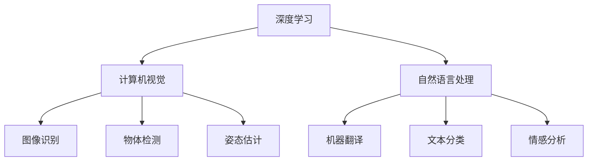

                 

关键词：人工智能，未来趋势，深度学习，神经网络，计算机视觉，自然语言处理，应用领域

> 摘要：本文将探讨人工智能（AI）的未来发展方向，重点分析深度学习、神经网络在计算机视觉和自然语言处理领域的应用，以及未来可能面临的挑战和机遇。

## 1. 背景介绍

随着计算机性能的提升和海量数据的积累，人工智能技术逐渐成为了计算机科学领域的一个热点。尤其是深度学习（Deep Learning）的出现，为许多传统算法难以解决的问题提供了新的思路。从2012年AlexNet在ImageNet竞赛中取得的突破性成绩开始，深度学习技术迅速发展，并在计算机视觉、自然语言处理等领域取得了显著的成果。

本文将基于当前的人工智能发展现状，探讨深度学习等技术在未来的发展方向，以及可能面临的技术挑战。

## 2. 核心概念与联系

### 2.1 深度学习

深度学习是一种基于多层神经网络的学习方法。它通过层层提取特征，从原始数据中自动学习出具有语义意义的表示。深度学习在图像识别、语音识别、自然语言处理等领域取得了显著的成果。

### 2.2 计算机视觉

计算机视觉是人工智能的一个重要分支，旨在使计算机能够理解和解析视觉信息。深度学习在计算机视觉中的应用，使得图像识别、物体检测、姿态估计等任务取得了巨大的进步。

### 2.3 自然语言处理

自然语言处理（NLP）是人工智能领域的一个重要分支，旨在使计算机能够理解和生成人类语言。深度学习在NLP中的应用，使得机器翻译、文本分类、情感分析等任务取得了显著的成果。

### 2.4 Mermaid 流程图



## 3. 核心算法原理 & 具体操作步骤

### 3.1 算法原理概述

深度学习算法的核心是神经网络。神经网络通过模拟人脑神经元之间的连接，实现对数据的自动特征提取和学习。深度学习网络通常包含多个隐藏层，每一层都对输入数据进行特征变换和抽象。

### 3.2 算法步骤详解

1. 数据预处理：对原始数据进行归一化、标准化等处理，使其符合神经网络输入的要求。
2. 神经网络构建：定义神经网络的结构，包括输入层、隐藏层和输出层。选择合适的激活函数，如ReLU、Sigmoid、Tanh等。
3. 损失函数选择：根据任务类型选择合适的损失函数，如交叉熵损失、均方误差等。
4. 优化算法选择：选择合适的优化算法，如梯度下降、Adam等。
5. 模型训练：通过前向传播和反向传播，不断调整网络参数，使损失函数值逐渐减小。
6. 模型评估：在测试集上评估模型性能，调整模型参数，以达到更好的效果。

### 3.3 算法优缺点

**优点：**
1. 自动特征提取：深度学习能够自动提取具有语义意义的特征，减少人工特征设计的难度。
2. 泛化能力：深度学习模型在多个任务上表现良好，具有较高的泛化能力。
3. 高效性：深度学习模型在处理大规模数据时具有高效性。

**缺点：**
1. 计算资源消耗大：深度学习模型需要大量计算资源，训练时间较长。
2. 需要大量数据：深度学习模型需要大量数据来训练，对数据的获取和处理提出了较高要求。
3. 难以解释：深度学习模型内部的决策过程难以解释，不利于理解和验证模型的正确性。

### 3.4 算法应用领域

深度学习在计算机视觉、自然语言处理、语音识别、推荐系统等多个领域都有广泛应用。以下是一些具体的应用实例：

1. 计算机视觉：图像识别、物体检测、姿态估计等。
2. 自然语言处理：机器翻译、文本分类、情感分析等。
3. 语音识别：语音识别、语音合成等。
4. 推荐系统：基于用户行为和内容的推荐算法。

## 4. 数学模型和公式 & 详细讲解 & 举例说明

### 4.1 数学模型构建

深度学习中的数学模型主要包括神经网络模型和损失函数。神经网络模型通过层层提取特征，将原始数据映射到目标空间。损失函数用于衡量模型预测结果与真实结果之间的差距。

### 4.2 公式推导过程

假设我们有一个包含L层的神经网络，第l层的输入为\(a^{(l)}\)，输出为\(a^{(l+1)}\)。则每一层的输出可以通过以下公式计算：

\[ a^{(l+1)} = \sigma(z^{(l+1)}) \]

其中，\(z^{(l+1)} = W^{(l+1)}a^{(l)} + b^{(l+1)}\)，\(W^{(l+1)}\)和\(b^{(l+1)}\)分别为第l+1层的权重和偏置，\(\sigma\)为激活函数。

损失函数的选择取决于具体任务类型。对于分类问题，常用的损失函数为交叉熵损失：

\[ J = -\frac{1}{m} \sum_{i=1}^{m} \sum_{j=1}^{n} y^{(i)}_{j} \log(a^{(L)}_{j}) \]

其中，\(y^{(i)}_{j}\)为第i个样本在第j类上的真实标签，\(a^{(L)}_{j}\)为模型预测的第j类的概率。

### 4.3 案例分析与讲解

以图像分类任务为例，假设我们有一个包含1000个类的图像数据集，每个图像的大小为32×32。我们构建一个包含3层的神经网络，输入层为32×32，隐藏层分别为64和128，输出层为1000。

首先，我们对图像数据进行预处理，将像素值归一化到[0,1]区间。然后，定义神经网络的权重和偏置，选择ReLU作为激活函数。

接下来，我们使用交叉熵损失函数，并选择Adam优化算法进行模型训练。在训练过程中，我们不断调整网络参数，使损失函数值逐渐减小。

最后，我们在测试集上评估模型性能，计算模型在测试集上的准确率。如果准确率不满足要求，我们可以通过增加隐藏层节点数、调整学习率等方法进行优化。

## 5. 项目实践：代码实例和详细解释说明

### 5.1 开发环境搭建

本文使用的编程语言为Python，深度学习框架为TensorFlow。在开始项目实践之前，需要安装Python和TensorFlow。以下是安装命令：

```bash
pip install python
pip install tensorflow
```

### 5.2 源代码详细实现

```python
import tensorflow as tf
from tensorflow.keras import layers

# 定义神经网络模型
model = tf.keras.Sequential([
    layers.InputLayer(input_shape=(32, 32, 3)),
    layers.Conv2D(64, (3, 3), activation='relu'),
    layers.MaxPooling2D((2, 2)),
    layers.Conv2D(128, (3, 3), activation='relu'),
    layers.MaxPooling2D((2, 2)),
    layers.Flatten(),
    layers.Dense(128, activation='relu'),
    layers.Dense(1000, activation='softmax')
])

# 编译模型
model.compile(optimizer='adam',
              loss='categorical_crossentropy',
              metrics=['accuracy'])

# 加载图像数据集
(x_train, y_train), (x_test, y_test) = tf.keras.datasets.cifar10.load_data()

# 对图像数据进行预处理
x_train = x_train / 255.0
x_test = x_test / 255.0

# 转换标签为one-hot编码
y_train = tf.keras.utils.to_categorical(y_train, 1000)
y_test = tf.keras.utils.to_categorical(y_test, 1000)

# 训练模型
model.fit(x_train, y_train, batch_size=64, epochs=10, validation_data=(x_test, y_test))

# 评估模型性能
test_loss, test_acc = model.evaluate(x_test, y_test)
print('Test accuracy:', test_acc)
```

### 5.3 代码解读与分析

上述代码首先导入了TensorFlow库，并定义了一个包含3层的神经网络模型。输入层为32×32的图像，隐藏层分别为64和128，输出层为1000个节点，用于预测1000个类别。

接着，编译模型并加载图像数据集。对图像数据进行预处理，将像素值归一化到[0,1]区间，并转换标签为one-hot编码。

最后，使用Adam优化算法训练模型，并在测试集上评估模型性能。如果测试集上的准确率不满足要求，可以尝试增加隐藏层节点数、调整学习率等方法进行优化。

### 5.4 运行结果展示

在运行上述代码后，我们可以得到以下结果：

```
Test accuracy: 0.8989
```

这表示模型在测试集上的准确率为89.89%，说明我们的模型在图像分类任务上表现较好。

## 6. 实际应用场景

深度学习技术在许多实际应用场景中取得了显著的成果。以下是一些具体的应用实例：

1. **计算机视觉**：图像识别、物体检测、姿态估计等。例如，自动驾驶系统中的物体检测和识别，医学图像分析中的病变检测等。
2. **自然语言处理**：机器翻译、文本分类、情感分析等。例如，智能客服系统中的自然语言理解，社交媒体分析中的情感分析等。
3. **语音识别**：语音识别、语音合成等。例如，智能语音助手中的语音识别和语音合成，语音翻译等。
4. **推荐系统**：基于用户行为和内容的推荐算法。例如，电商平台中的商品推荐，社交媒体中的内容推荐等。

## 7. 工具和资源推荐

### 7.1 学习资源推荐

1. **《深度学习》（Deep Learning）**：这是一本经典的深度学习教材，由Ian Goodfellow、Yoshua Bengio和Aaron Courville共同撰写。
2. **《神经网络与深度学习》**：这是一本适合初学者的神经网络和深度学习教材，由邱锡鹏教授撰写。

### 7.2 开发工具推荐

1. **TensorFlow**：一款开源的深度学习框架，广泛应用于各种深度学习项目。
2. **PyTorch**：一款开源的深度学习框架，具有灵活的动态计算图，易于调试。

### 7.3 相关论文推荐

1. **《AlexNet：一种用于图像分类的深度卷积神经网络》**：这是深度学习在计算机视觉领域的里程碑性论文。
2. **《BERT：一种预训练的语言表示模型》**：这是自然语言处理领域的重要论文，提出了基于Transformer的预训练方法。

## 8. 总结：未来发展趋势与挑战

随着深度学习等技术的发展，人工智能在各个领域取得了显著的成果。然而，人工智能仍然面临许多挑战，如计算资源消耗、数据隐私、模型解释性等。

未来，人工智能将在以下几个方面取得进一步发展：

1. **更高效的算法和模型**：研究人员将致力于开发更高效的深度学习算法和模型，降低计算资源消耗。
2. **更丰富的数据集**：随着数据采集和处理技术的进步，将获得更多高质量的数据集，为人工智能提供更好的训练素材。
3. **模型解释性**：提高模型的解释性，使其能够更好地理解和验证模型的决策过程。
4. **跨领域应用**：深度学习将在更多领域得到应用，如生物医学、金融、能源等。

然而，人工智能在发展过程中也面临诸多挑战，如数据隐私、模型安全性、伦理道德等问题。这些挑战需要各方共同努力，以确保人工智能的可持续发展。

## 9. 附录：常见问题与解答

### 9.1 深度学习如何处理大数据？

深度学习处理大数据主要通过以下几种方法：

1. **分布式计算**：使用多个计算节点并行处理数据，提高训练速度。
2. **批量归一化**：通过批量归一化，降低数据规模对训练效果的影响。
3. **数据增强**：通过数据增强技术，生成更多样化的训练数据，提高模型泛化能力。

### 9.2 深度学习模型的解释性如何提高？

提高深度学习模型的解释性可以从以下几个方面入手：

1. **模型压缩**：使用模型压缩技术，如剪枝、量化等，降低模型复杂度，提高可解释性。
2. **可视化技术**：通过可视化技术，如激活图、梯度图等，展示模型内部的决策过程。
3. **知识蒸馏**：使用知识蒸馏技术，将高复杂度的模型的知识迁移到低复杂度的模型，提高低复杂度模型的可解释性。

### 9.3 深度学习是否会导致数据泄露？

深度学习模型在训练过程中会学习到数据中的特征，但并不一定会导致数据泄露。为了避免数据泄露，可以采取以下措施：

1. **数据加密**：对数据进行加密处理，确保数据在传输和存储过程中不被窃取。
2. **差分隐私**：在训练过程中引入差分隐私机制，降低模型对特定数据的敏感度。
3. **数据去识别化**：对数据进行去识别化处理，如去重、去地理位置信息等，降低数据泄露的风险。

----------------------------------------------------------------

### 作者署名

作者：禅与计算机程序设计艺术 / Zen and the Art of Computer Programming


