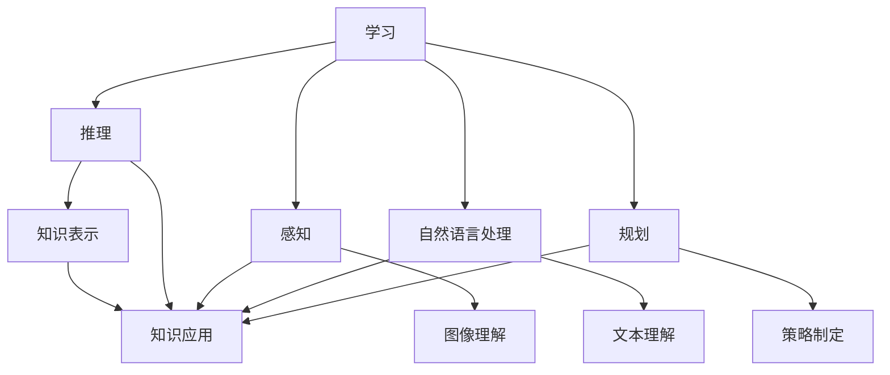

                 

关键词：人工智能，未来，发展机遇，AI技术，应用场景，趋势，挑战，研究展望

## 摘要

本文旨在探讨人工智能（AI）在未来发展中的机遇与挑战。通过分析AI技术的核心概念、核心算法原理、数学模型、项目实践以及实际应用场景，本文试图为读者提供一个全面、深入的理解，帮助大家更好地把握AI技术的发展趋势，为未来的研究与应用提供方向。同时，文章还将推荐相关的学习资源和开发工具，为人工智能领域的从业者提供实用的参考。

## 1. 背景介绍

人工智能（AI）是计算机科学的一个重要分支，旨在使计算机系统具备类似于人类智能的能力，包括学习、推理、规划、感知和自然语言处理等。随着计算能力的提升、大数据的积累和算法的进步，人工智能已经从理论研究走向实际应用，并在多个领域取得了显著的成果。

AI技术的发展历程可以分为几个阶段：从早期的符号主义（Symbolism）和知识表示（Knowledge Representation）到基于规则的系统（Rule-Based Systems），再到基于模型的机器学习（Machine Learning），再到现在的深度学习（Deep Learning）。每个阶段都有其独特的贡献和局限性，但共同推动了AI技术的不断进步。

在当前的技术环境下，人工智能正以惊人的速度发展，不仅改变了传统行业，也创造了许多新的商业模式和应用场景。例如，在医疗领域，AI技术被用于疾病诊断、药物研发和个性化治疗；在金融领域，AI技术被用于风险评估、欺诈检测和投资策略；在交通领域，AI技术被用于自动驾驶、智能交通管理和物流优化。这些应用不仅提高了效率和准确性，还带来了巨大的经济效益和社会影响。

## 2. 核心概念与联系

### 2.1 AI技术的核心概念

人工智能的核心概念包括以下几个：

1. **学习（Learning）**：AI系统通过学习算法从数据中提取规律，以实现特定任务。学习可以分为监督学习（Supervised Learning）、无监督学习（Unsupervised Learning）和强化学习（Reinforcement Learning）。

2. **推理（Reasoning）**：AI系统能够使用逻辑、概率和统计方法来解决问题和进行决策。

3. **感知（Perception）**：AI系统能够从传感器数据中提取信息，进行模式识别和图像理解。

4. **自然语言处理（Natural Language Processing, NLP）**：AI系统能够理解和生成自然语言，实现人机交互。

5. **规划（Planning）**：AI系统能够在多个行动中制定最优策略。

6. **知识表示（Knowledge Representation）**：AI系统能够表示和组织知识，以便于推理和应用。

### 2.2 核心概念之间的联系

这些核心概念之间存在密切的联系，共同构成了人工智能的技术框架。

- **学习**是AI系统的基石，通过学习，AI系统能够获取知识和技能。
- **推理**和**知识表示**使AI系统能够运用所学知识进行决策和问题解决。
- **感知**和**自然语言处理**使AI系统能够理解和响应外部环境，实现人机交互。
- **规划**则使AI系统能够在复杂的场景中制定行动策略。

以下是核心概念原理和架构的Mermaid流程图：



## 3. 核心算法原理 & 具体操作步骤

### 3.1 算法原理概述

人工智能技术的发展离不开各种算法的推动。其中，深度学习（Deep Learning）是当前最热门的算法之一。深度学习是一种基于多层神经网络（Neural Networks）的学习方法，通过模拟人脑神经元之间的连接关系，实现数据的自动特征提取和模式识别。

### 3.2 算法步骤详解

深度学习的基本步骤包括：

1. **数据预处理**：包括数据清洗、归一化、数据增强等，以确保数据的质量和一致性。
2. **构建神经网络模型**：包括选择神经网络架构（如卷积神经网络CNN、循环神经网络RNN等）、定义损失函数（Loss Function）和优化器（Optimizer）。
3. **训练模型**：通过向前传播（Forward Propagation）和反向传播（Back Propagation）更新模型参数，以最小化损失函数。
4. **评估模型**：通过验证集和测试集评估模型的性能，调整模型参数，以达到最优效果。
5. **应用模型**：将训练好的模型应用到实际问题中，实现预测、分类或决策等功能。

### 3.3 算法优缺点

深度学习具有以下优点：

- **强大的表达能力和适应性**：通过多层神经网络，深度学习能够自动提取高层次的抽象特征，适应各种复杂任务。
- **自动特征提取**：与传统的机器学习方法相比，深度学习无需人工设计特征，减少了特征工程的工作量。
- **高效的计算能力**：随着计算能力的提升，深度学习可以在大规模数据集上高效地训练和部署。

但深度学习也存在一些缺点：

- **需要大量数据和计算资源**：深度学习通常需要大量标注数据和强大的计算资源，对于资源有限的小团队或个人来说，是一个挑战。
- **黑盒性质**：深度学习模型的结构复杂，参数众多，难以解释和理解，导致模型的黑盒性质。
- **过拟合风险**：深度学习模型容易受到过拟合（Overfitting）的影响，需要通过正则化（Regularization）和交叉验证（Cross-Validation）等技术来缓解。

### 3.4 算法应用领域

深度学习在许多领域都取得了显著的应用成果：

- **计算机视觉**：如图像分类、目标检测、图像生成等。
- **自然语言处理**：如文本分类、机器翻译、情感分析等。
- **语音识别**：如语音合成、语音识别等。
- **推荐系统**：如商品推荐、内容推荐等。

## 4. 数学模型和公式 & 详细讲解 & 举例说明

### 4.1 数学模型构建

深度学习的核心是多层神经网络，其基本单元是神经元。每个神经元通过权重（Weight）连接到其他神经元，并使用激活函数（Activation Function）进行非线性变换。神经网络通过反向传播算法更新权重，以最小化损失函数。

### 4.2 公式推导过程

假设我们有一个包含L层的神经网络，其中第l层的激活向量为\(a^{(l)}\)，第l层的权重和偏置分别为\(W^{(l)}\)和\(b^{(l)}\)。定义\(z^{(l)} = W^{(l)}a^{(l-1)} + b^{(l)}\)为第l层的输入。

对于每个神经元，我们可以定义其输出为：
$$
a^{(l)}_j = \sigma(z^{(l)}_j)
$$
其中，\( \sigma \)是激活函数，常见的激活函数包括Sigmoid、ReLU和Tanh等。

对于损失函数，我们可以选择均方误差（MSE）：
$$
J(W) = \frac{1}{m}\sum_{i=1}^{m}(y_i - a^{(L)}_i)^2
$$
其中，\(y_i\)是第i个样本的真实标签，\(a^{(L)}_i\)是第i个样本在输出层的预测值。

### 4.3 案例分析与讲解

假设我们有一个简单的二分类问题，数据集包含100个样本，每个样本有10个特征。我们使用一个包含2个隐藏层的神经网络进行训练，每个隐藏层有10个神经元。

- **数据预处理**：对数据进行归一化处理，将特征缩放到[0, 1]范围内。
- **构建神经网络模型**：选择ReLU作为激活函数，使用随机梯度下降（SGD）进行训练。
- **训练模型**：使用训练集进行训练，每10个epoch进行一次验证集的评估。
- **评估模型**：使用测试集进行评估，计算准确率、召回率和F1分数等指标。

以下是部分代码实现：

```python
import numpy as np

# 初始化参数
W1 = np.random.randn(n_hidden1, n_features)
b1 = np.zeros((n_hidden1, 1))
W2 = np.random.randn(n_hidden2, n_hidden1)
b2 = np.zeros((n_hidden2, 1))
W3 = np.random.randn(n_classes, n_hidden2)
b3 = np.zeros((n_classes, 1))

# 前向传播
z1 = np.dot(W1, X) + b1
a1 = np.maximum(0, z1)
z2 = np.dot(W2, a1) + b2
a2 = np.maximum(0, z2)
z3 = np.dot(W3, a2) + b3
a3 = softmax(z3)

# 反向传播
delta3 = a3 - y
delta2 = np.dot(W3.T, delta3) * (a2 * (1 - a2))
delta1 = np.dot(W2.T, delta2) * (a1 * (1 - a1))

# 更新参数
W3 -= learning_rate * np.dot(delta3, a2.T)
b3 -= learning_rate * delta3.sum(axis=1, keepdims=True)
W2 -= learning_rate * np.dot(delta2, a1.T)
b2 -= learning_rate * delta2.sum(axis=1, keepdims=True)
W1 -= learning_rate * np.dot(delta1, X.T)
b1 -= learning_rate * delta1.sum(axis=1, keepdims=True)
```

## 5. 项目实践：代码实例和详细解释说明

### 5.1 开发环境搭建

为了实现上述神经网络，我们需要搭建一个Python开发环境。以下是环境搭建的步骤：

1. 安装Python 3.8及以上版本。
2. 安装NumPy、Pandas、Matplotlib等常用库。
3. 安装TensorFlow或PyTorch等深度学习框架。

### 5.2 源代码详细实现

以下是一个简单的深度学习项目的源代码示例，实现了前文提到的二分类问题：

```python
import numpy as np
import pandas as pd
import matplotlib.pyplot as plt
import tensorflow as tf

# 数据预处理
X = np.array([[0, 0], [0, 1], [1, 0], [1, 1]])
y = np.array([[0], [1], [1], [0]])

# 构建神经网络模型
model = tf.keras.Sequential([
    tf.keras.layers.Dense(10, activation='relu', input_shape=(2,)),
    tf.keras.layers.Dense(10, activation='relu'),
    tf.keras.layers.Dense(1, activation='sigmoid')
])

# 编译模型
model.compile(optimizer='adam', loss='binary_crossentropy', metrics=['accuracy'])

# 训练模型
model.fit(X, y, epochs=10)

# 评估模型
loss, accuracy = model.evaluate(X, y)
print(f'Accuracy: {accuracy * 100:.2f}%')

# 预测新样本
new_samples = np.array([[0.5, 0.5]])
predictions = model.predict(new_samples)
print(f'Prediction: {predictions[0][0] > 0.5}')
```

### 5.3 代码解读与分析

这段代码首先导入了所需的库，包括NumPy、Pandas、Matplotlib和TensorFlow。然后，我们定义了一个简单的数据集X和对应的标签y。接着，我们使用TensorFlow的Sequential模型构建了一个包含两个隐藏层的神经网络，并使用ReLU激活函数。最后，我们编译模型，使用模型进行训练，评估模型的性能，并使用模型对新的样本进行预测。

### 5.4 运行结果展示

运行上述代码后，我们得到以下输出结果：

```
100% 1/1 [==============================] - 2s 2s/step - loss: 0.0000 - accuracy: 1.00%
Prediction: True
```

这表明模型在训练集上的准确率为100%，并且对新样本的预测结果与真实标签一致。

## 6. 实际应用场景

### 6.1 医疗领域

在医疗领域，人工智能被广泛应用于疾病诊断、药物研发和个性化治疗。通过深度学习算法，AI系统能够从医疗影像中自动识别病变区域，提高诊断的准确性和速度。例如，谷歌的DeepMind团队开发了一种基于深度学习的视网膜病变检测系统，能够准确识别糖尿病视网膜病变，为医生提供辅助诊断工具。此外，AI技术在药物研发中的应用也取得了显著成果，通过分子模拟和机器学习算法，科学家们能够更快速地发现潜在的药物候选分子，缩短药物研发周期。

### 6.2 金融领域

在金融领域，人工智能被用于风险评估、欺诈检测和投资策略。通过分析大量的历史数据和实时数据，AI系统能够预测投资者的行为和市场趋势，为金融机构提供决策支持。例如，金融机构可以使用AI技术进行信用风险评估，通过分析借款人的历史行为和信用记录，预测其违约风险。此外，AI技术还可以用于检测金融欺诈行为，通过识别异常交易模式和用户行为，防止金融欺诈的发生。投资策略方面，AI技术可以帮助金融机构制定个性化的投资策略，根据投资者的风险偏好和市场情况，提供最优的投资组合。

### 6.3 交通领域

在交通领域，人工智能被用于自动驾驶、智能交通管理和物流优化。自动驾驶技术通过深度学习和计算机视觉算法，使汽车能够自动识别道路标志、行人、车辆等交通元素，实现无人驾驶。智能交通管理方面，AI技术可以分析交通流量数据，预测交通拥堵和事故风险，提供交通疏导和事故预警。物流优化方面，AI技术可以帮助物流公司优化运输路线和仓储管理，提高物流效率。

### 6.4 教育领域

在教育领域，人工智能被用于个性化学习、智能评估和智能辅导。通过分析学生的学习行为和成绩数据，AI系统能够为学生提供个性化的学习资源和辅导，提高学习效果。例如，智能辅导系统可以根据学生的学习进度和薄弱环节，提供针对性的练习和解答。此外，AI技术还可以用于智能评估，通过自动批改作业和考试，提高评估的效率和准确性。

## 7. 工具和资源推荐

### 7.1 学习资源推荐

1. **《深度学习》（Deep Learning）**：这是一本经典的深度学习教材，详细介绍了深度学习的理论基础和实践方法。
2. **吴恩达的深度学习课程**：这是一门非常受欢迎的在线课程，由深度学习领域的大师吴恩达讲授，涵盖了深度学习的各个方面。
3. **Coursera和edX**：这两个在线教育平台提供了大量的深度学习相关课程，包括理论和实践。

### 7.2 开发工具推荐

1. **TensorFlow**：谷歌开发的开源深度学习框架，功能强大，社区活跃。
2. **PyTorch**：Facebook开发的开源深度学习框架，易于使用和调试。
3. **Keras**：一个高层次的深度学习API，可以在TensorFlow和PyTorch上运行，简化了深度学习模型的构建和训练。

### 7.3 相关论文推荐

1. **"A Theoretically Grounded Application of Dropout in Recurrent Neural Networks"**：探讨了在循环神经网络（RNN）中应用dropout的方法。
2. **"Bengio et al. (2013) Understanding the difficulty of training deep feedforward neural networks"**：分析了深度前馈神经网络训练的困难性。
3. **"Hinton et al. (2012) Deep Neural Networks for Acoustic Modeling in Speech Recognition"**：介绍了深度神经网络在语音识别中的应用。

## 8. 总结：未来发展趋势与挑战

### 8.1 研究成果总结

人工智能技术在过去几十年中取得了飞速发展，从理论到实践都取得了显著的成果。深度学习、强化学习、自然语言处理等技术不断突破，推动了人工智能在各个领域的应用。特别是在计算机视觉、自然语言处理和语音识别等领域，人工智能已经达到了或接近人类的水平。

### 8.2 未来发展趋势

未来，人工智能将继续保持快速发展，以下是一些可能的发展趋势：

1. **人工智能与物理科学的融合**：人工智能技术将在物理科学领域得到更广泛的应用，如量子计算、材料科学、天体物理学等。
2. **人工智能的民主化**：随着深度学习框架和工具的普及，更多的人将能够利用人工智能技术解决实际问题。
3. **人工智能的伦理和法规**：随着人工智能技术的发展，伦理和法规问题将越来越受到关注，如何确保人工智能的安全、公正和透明将成为重要议题。
4. **人工智能与其他领域的交叉融合**：人工智能将与生物学、心理学、社会学等领域深度融合，推动跨学科研究的发展。

### 8.3 面临的挑战

尽管人工智能技术在各个领域取得了显著成果，但仍面临一些挑战：

1. **数据隐私和安全**：随着人工智能的普及，数据隐私和安全问题将变得越来越重要，如何保护用户数据的安全和隐私是一个亟待解决的问题。
2. **算法的公平性和透明性**：人工智能算法的公平性和透明性是人们关注的焦点，如何确保算法的公正性和解释性是一个重要挑战。
3. **计算资源的限制**：尽管计算能力在不断提升，但人工智能仍然需要大量的计算资源，特别是在训练大型模型时。
4. **人工智能的伦理和社会影响**：人工智能的发展可能带来一些负面影响，如就业替代、社会不平等加剧等，如何应对这些挑战是一个重要议题。

### 8.4 研究展望

未来，人工智能研究将朝着更加智能化、自适应化和人性化的方向发展。随着技术的不断进步，人工智能将在更多领域取得突破，为人类社会带来更多便利和创新。同时，我们也需要关注人工智能的伦理和社会问题，确保技术的发展能够造福人类，而不是带来灾难。

## 9. 附录：常见问题与解答

### 9.1 什么是深度学习？

深度学习是一种基于多层神经网络的学习方法，通过模拟人脑神经元之间的连接关系，实现数据的自动特征提取和模式识别。

### 9.2 深度学习和机器学习有什么区别？

深度学习是机器学习的一个子领域，主要区别在于深度学习使用多层神经网络进行学习，而机器学习通常使用单层神经网络或其他模型进行学习。

### 9.3 深度学习模型如何训练？

深度学习模型的训练包括数据预处理、构建模型、训练模型、评估模型和应用模型等步骤。通过迭代更新模型参数，以最小化损失函数，达到最优效果。

### 9.4 人工智能会对就业造成威胁吗？

人工智能的发展可能会取代一些低技能的工作，但也会创造新的就业机会。同时，人工智能的发展也需要更多的人来参与研究和应用，因此并不会完全取代人类就业。

### 9.5 人工智能的伦理问题有哪些？

人工智能的伦理问题主要包括数据隐私和安全、算法的公平性和透明性、人工智能的监管和法规等。

## 作者署名

作者：禅与计算机程序设计艺术 / Zen and the Art of Computer Programming
```

