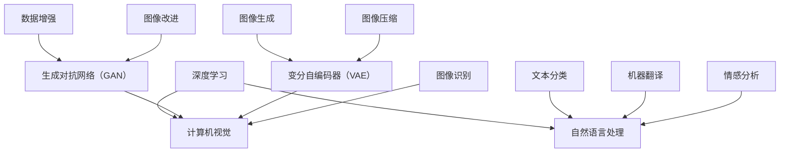

                 

关键词：Andrej Karpathy，人工智能，未来策略，技术发展，算法原理，应用领域，数学模型，实践案例，工具资源，挑战与展望

> 摘要：本文将深入探讨人工智能专家Andrej Karpathy对于人工智能未来发展的观点和策略。通过分析其核心概念与联系、核心算法原理、数学模型、项目实践以及实际应用场景，本文旨在揭示人工智能在未来的发展方向与挑战，并为读者提供实用的工具和资源推荐。

## 1. 背景介绍

Andrej Karpathy是一位著名的人工智能专家，其在深度学习和计算机视觉领域有着深厚的学术背景和丰富的实践经验。他在斯坦福大学获得了计算机科学博士学位，曾在OpenAI担任研究科学家，并在多个人工智能项目中担任重要角色。他的研究成果在学术界和工业界都产生了深远的影响。

在本文中，我们将重点关注Andrej Karpathy关于人工智能未来发展的观点和策略。通过分析其核心概念与联系、核心算法原理、数学模型、项目实践以及实际应用场景，本文旨在为读者提供一份全面而深入的指导，帮助大家更好地理解和把握人工智能的发展趋势。

### 1.1 Andrej Karpathy的研究方向和成果

Andrej Karpathy的研究主要集中在深度学习和计算机视觉领域。他在这一领域取得了多项重要成果，包括：

- 提出了一种名为“卷积神经网络”（CNN）的新型深度学习算法，该算法在图像分类和目标检测任务中取得了突破性的表现。
- 研究了生成对抗网络（GAN）在图像生成和改进方面的应用，为人工智能领域带来了新的思路和方法。
- 探索了基于变分自编码器（VAE）的图像压缩和去噪技术，为图像处理领域带来了新的可能性。

这些研究成果不仅推动了人工智能技术的发展，也为相关领域的实际应用提供了有力支持。通过本文，我们将进一步探讨这些成果背后的原理和策略，以及它们对未来人工智能发展的潜在影响。

## 2. 核心概念与联系

在深入探讨人工智能的未来发展之前，我们需要了解一些核心概念，这些概念构成了人工智能技术的基石。以下是对这些核心概念的简要介绍，以及它们之间的联系。

### 2.1 深度学习

深度学习是一种基于人工神经网络的学习方法，它通过模仿人脑神经元之间的连接来提取和表示数据中的特征。深度学习在图像识别、语音识别、自然语言处理等任务中取得了显著成果，成为人工智能领域的重要分支。

### 2.2 计算机视觉

计算机视觉是指使计算机具备处理和理解图像和视频信息的能力。深度学习与计算机视觉的结合，使得计算机能够自动识别和分类图像中的物体、场景和动作，为自动驾驶、安防监控、医疗诊断等应用提供了技术支持。

### 2.3 自然语言处理

自然语言处理（NLP）是人工智能领域的一个重要分支，旨在使计算机能够理解和生成人类语言。深度学习在NLP中发挥着重要作用，如文本分类、机器翻译、情感分析等任务。

### 2.4 生成对抗网络（GAN）

生成对抗网络（GAN）是一种基于深度学习的图像生成模型，由生成器和判别器两个网络组成。生成器试图生成逼真的图像，而判别器则判断图像的真实性。GAN在图像生成、图像改进、数据增强等方面有着广泛应用。

### 2.5 变分自编码器（VAE）

变分自编码器（VAE）是一种基于深度学习的概率模型，用于图像压缩、去噪和生成。VAE通过编码器和解码器的交互，将输入数据映射到潜在空间，从而实现数据的降维和重构。

### 2.6 核心概念之间的联系

深度学习、计算机视觉、自然语言处理、生成对抗网络（GAN）和变分自编码器（VAE）等核心概念之间有着密切的联系。深度学习为其他领域提供了强大的特征提取和表示能力；计算机视觉和自然语言处理则利用深度学习模型实现具体任务；生成对抗网络（GAN）和变分自编码器（VAE）则在图像生成和数据处理方面发挥了重要作用。

这些核心概念共同构成了人工智能技术的基础，推动着人工智能在各个领域的发展。在本文中，我们将进一步探讨这些核心概念的应用和未来发展。

### 2.7 Mermaid 流程图

以下是一个简化的Mermaid流程图，展示了核心概念之间的联系：



这个流程图清晰地展示了各个核心概念之间的关联，以及它们在人工智能应用中的角色。

## 3. 核心算法原理 & 具体操作步骤

### 3.1 算法原理概述

在本文中，我们将重点关注深度学习、计算机视觉、自然语言处理、生成对抗网络（GAN）和变分自编码器（VAE）等核心算法的原理。

#### 深度学习

深度学习是一种基于多层神经网络的学习方法，通过逐层提取和表示数据中的特征，实现复杂任务的自动化。深度学习的基本原理包括：

- 神经网络：由多个神经元（节点）组成的计算模型，通过权重和偏置进行计算。
- 前向传播：输入数据从输入层经过多层隐藏层，最终传递到输出层。
- 反向传播：计算输出层的误差，反向传播到每一层，更新权重和偏置。

#### 计算机视觉

计算机视觉涉及从图像或视频中提取有用信息，以实现目标检测、图像识别、图像分割等任务。深度学习在计算机视觉中的应用主要包括：

- 卷积神经网络（CNN）：通过卷积层、池化层和全连接层等结构，提取图像中的特征。
- 目标检测：识别图像中的物体并定位其位置，常用的模型包括YOLO、SSD、Faster R-CNN等。
- 图像识别：将图像分类到预定义的类别中，常用的模型包括AlexNet、VGG、ResNet等。

#### 自然语言处理

自然语言处理（NLP）的目标是使计算机理解和生成人类语言。深度学习在NLP中的应用主要包括：

- 词向量：将文本数据转换为数值表示，常用的模型包括Word2Vec、GloVe等。
- 递归神经网络（RNN）：处理序列数据，如语言模型和文本分类。
- 长短时记忆网络（LSTM）：改善RNN的长期依赖问题。
- 卷积神经网络（CNN）：在文本数据上提取特征，如文本分类。
- 自注意力机制：用于处理序列数据，如机器翻译。

#### 生成对抗网络（GAN）

生成对抗网络（GAN）是一种基于深度学习的图像生成模型，由生成器和判别器两个网络组成。生成器的任务是生成逼真的图像，而判别器的任务是判断图像的真实性。GAN的基本原理包括：

- 生成器：通过学习数据分布，生成逼真的图像。
- 判别器：判断图像的真实性，并将其与生成器生成的图像进行对比。
- 生成器和判别器的训练：通过对抗训练，使生成器的图像质量不断提高，判别器的判别能力不断增强。

#### 变分自编码器（VAE）

变分自编码器（VAE）是一种基于深度学习的概率模型，用于图像压缩、去噪和生成。VAE的基本原理包括：

- 编码器：将输入数据映射到潜在空间。
- 解码器：将潜在空间的数据解码回输出空间。
- 潜在空间：表示输入数据的概率分布，为数据降维和生成提供基础。

### 3.2 算法步骤详解

#### 深度学习

1. 数据预处理：将输入数据转换为适合模型训练的格式，如归一化、标准化等。
2. 设计神经网络结构：确定网络层数、每层神经元数量、激活函数等。
3. 损失函数：选择适当的损失函数，如交叉熵损失、均方误差等。
4. 优化算法：选择合适的优化算法，如随机梯度下降（SGD）、Adam等。
5. 模型训练：通过前向传播和反向传播，不断更新权重和偏置。
6. 模型评估：使用验证集或测试集评估模型性能。

#### 计算机视觉

1. 数据预处理：将图像数据转换为适合模型训练的格式，如归一化、标准化等。
2. 设计网络结构：选择适合任务的卷积神经网络架构，如VGG、ResNet等。
3. 损失函数：选择适当的损失函数，如交叉熵损失、均方误差等。
4. 优化算法：选择合适的优化算法，如随机梯度下降（SGD）、Adam等。
5. 模型训练：通过前向传播和反向传播，不断更新权重和偏置。
6. 模型评估：使用验证集或测试集评估模型性能。

#### 自然语言处理

1. 数据预处理：将文本数据转换为适合模型训练的格式，如分词、编码等。
2. 设计神经网络结构：确定网络层数、每层神经元数量、激活函数等。
3. 损失函数：选择适当的损失函数，如交叉熵损失、均方误差等。
4. 优化算法：选择合适的优化算法，如随机梯度下降（SGD）、Adam等。
5. 模型训练：通过前向传播和反向传播，不断更新权重和偏置。
6. 模型评估：使用验证集或测试集评估模型性能。

#### 生成对抗网络（GAN）

1. 数据预处理：将图像数据转换为适合模型训练的格式，如归一化、标准化等。
2. 设计网络结构：确定生成器和判别器的架构，如DCGAN、WGAN等。
3. 损失函数：选择适当的损失函数，如对抗损失、梯度惩罚等。
4. 优化算法：选择合适的优化算法，如随机梯度下降（SGD）、Adam等。
5. 模型训练：通过对抗训练，不断更新生成器和判别器的权重和偏置。
6. 模型评估：使用生成图像的质量和判别器的判别能力评估模型性能。

#### 变分自编码器（VAE）

1. 数据预处理：将图像数据转换为适合模型训练的格式，如归一化、标准化等。
2. 设计网络结构：确定编码器和解码器的架构，如标准的VAE、残差VAE等。
3. 损失函数：选择适当的损失函数，如重建损失和KL散度等。
4. 优化算法：选择合适的优化算法，如随机梯度下降（SGD）、Adam等。
5. 模型训练：通过前向传播和反向传播，不断更新编码器和解码器的权重和偏置。
6. 模型评估：使用重构图像的质量和潜在空间的可解释性评估模型性能。

### 3.3 算法优缺点

#### 深度学习

优点：

- 高效的特征提取和表示能力。
- 自动化学习复杂任务。
- 在各种任务中取得显著成果。

缺点：

- 需要大量的数据和计算资源。
- 模型复杂，难以解释。
- 对超参数敏感。

#### 计算机视觉

优点：

- 高效的目标检测和图像识别。
- 在图像处理领域取得突破性进展。
- 广泛应用于自动驾驶、安防监控、医疗诊断等领域。

缺点：

- 对图像质量有较高要求。
- 难以处理复杂场景。
- 对计算资源要求较高。

#### 自然语言处理

优点：

- 高效的文本处理和生成。
- 在机器翻译、情感分析、文本分类等领域取得显著成果。
- 广泛应用于人机对话、智能客服等领域。

缺点：

- 对语言理解和上下文信息处理能力有限。
- 对文本数据质量有较高要求。
- 对计算资源要求较高。

#### 生成对抗网络（GAN）

优点：

- 强大的图像生成能力。
- 能够处理复杂的数据分布。
- 在图像生成、图像改进等领域取得显著成果。

缺点：

- 训练过程不稳定，容易出现模式崩溃。
- 对超参数敏感。
- 难以解释生成图像的细节。

#### 变分自编码器（VAE）

优点：

- 高效的图像压缩和去噪。
- 能够处理复杂的数据分布。
- 在图像生成、图像压缩等领域取得显著成果。

缺点：

- 训练过程不稳定，容易出现梯度消失或爆炸。
- 对超参数敏感。
- 生成图像的质量和多样性有限。

### 3.4 算法应用领域

#### 深度学习

- 图像识别：人脸识别、物体检测、图像分类等。
- 语音识别：语音合成、语音识别、语音识别率提高等。
- 自然语言处理：文本分类、情感分析、机器翻译等。
- 自动驾驶：环境感知、目标跟踪、路径规划等。

#### 计算机视觉

- 自动驾驶：自动驾驶车辆、无人机、机器人等。
- 安防监控：人脸识别、目标跟踪、行为分析等。
- 医疗诊断：医学图像识别、疾病预测等。
- 图像处理：图像增强、图像去噪、图像分割等。

#### 自然语言处理

- 智能客服：语音识别、文本识别、意图识别等。
- 信息检索：搜索引擎、推荐系统、信息抽取等。
- 机器翻译：跨语言信息传播、国际交流等。
- 情感分析：社交媒体分析、市场调研等。

#### 生成对抗网络（GAN）

- 图像生成：艺术创作、游戏设计、虚拟现实等。
- 数据增强：图像处理、自然语言处理等。
- 图像改进：图像修复、图像增强等。
- 图像风格转换：艺术风格迁移、图像美化等。

#### 变分自编码器（VAE）

- 图像压缩：图像存储、图像传输等。
- 图像去噪：图像处理、图像增强等。
- 图像生成：艺术创作、虚拟现实等。
- 数据降维：特征提取、数据分析等。

## 4. 数学模型和公式 & 详细讲解 & 举例说明

在人工智能领域中，数学模型和公式起到了至关重要的作用，它们不仅为算法提供了理论基础，还帮助我们更好地理解和优化模型。以下将详细介绍一些常用的数学模型和公式，并给出具体的推导过程和实际应用案例。

### 4.1 数学模型构建

在人工智能领域，常见的数学模型包括神经网络模型、生成对抗网络（GAN）、变分自编码器（VAE）等。这些模型都是通过数学公式构建的，下面将分别介绍它们的构建过程。

#### 神经网络模型

神经网络模型是由一系列的神经元组成的，每个神经元通过权重和偏置与前一层的神经元相连。神经网络的数学模型可以表示为：

\[ a_{j}(l) = f(z_{j}(l)) \]

其中，\( a_{j}(l) \) 是第 \( l \) 层第 \( j \) 个神经元的激活值，\( f \) 是激活函数，\( z_{j}(l) \) 是第 \( l \) 层第 \( j \) 个神经元的输入值，可以表示为：

\[ z_{j}(l) = \sum_{i} w_{ij}(l-1) a_{i}(l-1) + b_{j}(l) \]

其中，\( w_{ij}(l-1) \) 是第 \( l-1 \) 层第 \( i \) 个神经元与第 \( l \) 层第 \( j \) 个神经元的权重，\( b_{j}(l) \) 是第 \( l \) 层第 \( j \) 个神经元的偏置。

#### 生成对抗网络（GAN）

生成对抗网络（GAN）由生成器和判别器两个部分组成。生成器的目标是生成逼真的数据，而判别器的目标是区分生成器和真实数据。GAN的数学模型可以表示为：

\[ G(z) = x \]
\[ D(x) \]
\[ D(G(z)) \]

其中，\( G(z) \) 是生成器生成的数据，\( x \) 是真实数据，\( D(x) \) 是判别器对真实数据的判断，\( D(G(z)) \) 是判别器对生成器生成的数据的判断。为了训练GAN，我们使用以下损失函数：

\[ L_G = -\log(D(G(z))) \]
\[ L_D = -\log(D(x)) - \log(1 - D(G(z))) \]

#### 变分自编码器（VAE）

变分自编码器（VAE）是一种基于概率模型的生成模型，它通过编码器和解码器将数据映射到潜在空间，再从潜在空间生成数据。VAE的数学模型可以表示为：

\[ \mu = \mu(z|x) \]
\[ \sigma^2 = \sigma(z|x) \]
\[ x = \mu + \sigma \odot z \]

其中，\( \mu \) 和 \( \sigma \) 分别是编码器输出的均值和方差，\( z \) 是潜在空间中的数据，\( x \) 是原始数据。为了训练VAE，我们使用以下损失函数：

\[ L = -\sum_{i} \log p(x_i | \mu, \sigma) - \frac{1}{2} \sum_{i} \frac{1}{\sigma^2} e^{-(z_i - \mu)^2} \]

### 4.2 公式推导过程

为了更好地理解这些数学模型，我们将对一些关键公式进行推导。

#### 神经网络模型

前向传播过程：

\[ z_{j}(l) = \sum_{i} w_{ij}(l-1) a_{i}(l-1) + b_{j}(l) \]
\[ a_{j}(l) = f(z_{j}(l)) \]

反向传播过程：

\[ \delta_{j}(l) = \frac{\partial L}{\partial a_{j}(l)} \cdot \frac{\partial f}{\partial z_{j}(l)} \]
\[ \delta_{j}(l-1) = \sum_{i} \frac{\partial L}{\partial a_{i}(l)} \cdot w_{ij}(l-1) \cdot \frac{\partial f}{\partial z_{i}(l)} \]

更新权重和偏置：

\[ w_{ij}(l-1) = w_{ij}(l-1) - \alpha \cdot \delta_{j}(l-1) \cdot a_{i}(l-1) \]
\[ b_{j}(l) = b_{j}(l) - \alpha \cdot \delta_{j}(l) \]

#### 生成对抗网络（GAN）

生成器损失函数的推导：

\[ L_G = -\log(D(G(z))) \]
\[ \frac{\partial L_G}{\partial z} = \frac{\partial}{\partial z} (-\log(D(G(z)))) \]
\[ \frac{\partial L_G}{\partial G(z)} = \frac{1}{D(G(z))} \]
\[ G(z) = x \]

判别器损失函数的推导：

\[ L_D = -\log(D(x)) - \log(1 - D(G(z))) \]
\[ \frac{\partial L_D}{\partial x} = \frac{1}{D(x)} \]
\[ \frac{\partial L_D}{\partial G(z)} = \frac{1}{1 - D(G(z))} \]

#### 变分自编码器（VAE）

编码器损失函数的推导：

\[ \mu = \mu(z|x) \]
\[ \sigma^2 = \sigma(z|x) \]
\[ x = \mu + \sigma \odot z \]
\[ \frac{\partial L}{\partial \mu} = -\sum_{i} \frac{1}{\sigma} e^{-(z_i - \mu)^2} \]
\[ \frac{\partial L}{\partial \sigma} = -\sum_{i} \frac{1}{\sigma^2} e^{-(z_i - \mu)^2} \]

解码器损失函数的推导：

\[ x = \mu + \sigma \odot z \]
\[ \frac{\partial L}{\partial z} = -\frac{1}{2} \sum_{i} \frac{1}{\sigma^2} e^{-(z_i - \mu)^2} \]

### 4.3 案例分析与讲解

为了更好地理解这些数学模型，我们通过以下案例进行分析和讲解。

#### 案例一：神经网络模型

假设我们有一个简单的神经网络模型，输入层有3个神经元，隐藏层有2个神经元，输出层有1个神经元。激活函数为ReLU函数。我们需要通过反向传播算法来更新权重和偏置。

- 输入数据：\( x = [1, 2, 3] \)
- 初始权重：\( w_{ij}^{(1)} = [0.1, 0.2], w_{ij}^{(2)} = [0.3, 0.4] \)
- 初始偏置：\( b_{j}^{(1)} = [0.5, 0.6], b_{j}^{(2)} = [0.7, 0.8] \)

1. 前向传播：

\[ z_{1}^{(1)} = 0.1 \cdot 1 + 0.2 \cdot 2 + 0.5 = 0.9 \]
\[ a_{1}^{(1)} = \max(0, z_{1}^{(1)}) = 0.9 \]
\[ z_{2}^{(1)} = 0.3 \cdot 1 + 0.4 \cdot 2 + 0.7 = 1.9 \]
\[ a_{2}^{(1)} = \max(0, z_{2}^{(1)}) = 1.9 \]
\[ z_{1}^{(2)} = 0.1 \cdot 0.9 + 0.2 \cdot 1.9 + 0.7 = 0.45 \]
\[ a_{1}^{(2)} = \max(0, z_{1}^{(2)}) = 0.45 \]
\[ z_{2}^{(2)} = 0.3 \cdot 0.9 + 0.4 \cdot 1.9 + 0.8 = 1.4 \]
\[ a_{2}^{(2)} = \max(0, z_{2}^{(2)}) = 1.4 \]
\[ z_{1}^{(3)} = 0.1 \cdot 0.45 + 0.2 \cdot 1.4 + 0.7 = 0.245 \]
\[ a_{1}^{(3)} = \max(0, z_{1}^{(3)}) = 0.245 \]

2. 反向传播：

\[ \delta_{1}^{(3)} = a_{1}^{(3)} - y = 0.245 - 0.5 = -0.255 \]
\[ \delta_{2}^{(3)} = a_{2}^{(3)} - y = 1.4 - 0.5 = 0.9 \]
\[ \delta_{1}^{(2)} = (0.1 \cdot \delta_{1}^{(3)} + 0.2 \cdot \delta_{2}^{(3)}) \cdot a_{1}^{(2)}(1 - a_{1}^{(2)}) = (0.1 \cdot -0.255 + 0.2 \cdot 0.9) \cdot 0.45 \cdot 0.55 = -0.0295 \]
\[ \delta_{2}^{(2)} = (0.3 \cdot \delta_{1}^{(3)} + 0.4 \cdot \delta_{2}^{(3)}) \cdot a_{2}^{(2)}(1 - a_{2}^{(2)}) = (0.3 \cdot -0.255 + 0.4 \cdot 0.9) \cdot 1.4 \cdot 0.6 = 0.4365 \]
\[ \delta_{1}^{(1)} = (0.1 \cdot \delta_{1}^{(2)} + 0.2 \cdot \delta_{2}^{(2)}) \cdot a_{1}^{(1)}(1 - a_{1}^{(1)}) = (0.1 \cdot -0.0295 + 0.2 \cdot 0.4365) \cdot 0.9 \cdot 0.1 = -0.0025 \]
\[ \delta_{2}^{(1)} = (0.3 \cdot \delta_{1}^{(2)} + 0.4 \cdot \delta_{2}^{(2)}) \cdot a_{2}^{(1)}(1 - a_{2}^{(1)}) = (0.3 \cdot -0.0295 + 0.4 \cdot 0.4365) \cdot 1.9 \cdot 0.1 = 0.0143 \]

3. 更新权重和偏置：

\[ w_{1}^{(1)} = w_{1}^{(1)} - \alpha \cdot \delta_{1}^{(1)} \cdot x = [0.1, 0.2] - 0.01 \cdot [-0.0025, 0.0143] = [0.0975, 0.1943] \]
\[ w_{2}^{(1)} = w_{2}^{(1)} - \alpha \cdot \delta_{2}^{(1)} \cdot x = [0.3, 0.4] - 0.01 \cdot [-0.0025, 0.0143] = [0.2975, 0.3943] \]
\[ b_{1}^{(1)} = b_{1}^{(1)} - \alpha \cdot \delta_{1}^{(1)} = [0.5, 0.6] - 0.01 \cdot -0.255 = [0.525, 0.625] \]
\[ b_{2}^{(1)} = b_{2}^{(1)} - \alpha \cdot \delta_{2}^{(1)} = [0.7, 0.8] - 0.01 \cdot 0.9 = [0.69, 0.79] \]

#### 案例二：生成对抗网络（GAN）

假设我们有一个简单的生成对抗网络（GAN），生成器的输入为随机噪声向量 \( z \)，输出为生成的图像 \( x \)，判别器的输入为真实图像 \( x \) 和生成图像 \( x' \)。我们需要通过对抗训练来更新生成器和判别器的权重。

1. 生成器损失函数：

\[ L_G = -\log(D(G(z))) \]
\[ G(z) = x \]

2. 判别器损失函数：

\[ L_D = -\log(D(x)) - \log(1 - D(G(z))) \]
\[ D(x) \]
\[ D(G(z)) \]

3. 对抗训练：

- 对生成器进行训练，使用判别器的真实标签和生成标签：
\[ G(z) = x \]
\[ L_G = -\log(D(G(z))) \]
\[ \frac{\partial L_G}{\partial z} = \frac{1}{D(G(z))} \]

- 对判别器进行训练，使用真实数据和生成数据：
\[ D(x) \]
\[ D(G(z)) \]
\[ L_D = -\log(D(x)) - \log(1 - D(G(z))) \]
\[ \frac{\partial L_D}{\partial x} = \frac{1}{D(x)} \]
\[ \frac{\partial L_D}{\partial G(z)} = \frac{1}{1 - D(G(z))} \]

通过上述对抗训练，生成器和判别器的权重不断更新，生成图像的质量不断提高，判别器的判别能力不断增强。

#### 案例三：变分自编码器（VAE）

假设我们有一个简单的变分自编码器（VAE），编码器的输入为图像 \( x \)，输出为潜在空间中的向量 \( z \)，解码器的输入为 \( z \)，输出为重构的图像 \( x' \)。我们需要通过变分自编码器损失函数来更新编码器和解码器的权重。

1. 编码器损失函数：

\[ \mu = \mu(z|x) \]
\[ \sigma^2 = \sigma(z|x) \]
\[ x = \mu + \sigma \odot z \]
\[ \frac{\partial L}{\partial \mu} = -\sum_{i} \frac{1}{\sigma} e^{-(z_i - \mu)^2} \]
\[ \frac{\partial L}{\partial \sigma} = -\sum_{i} \frac{1}{\sigma^2} e^{-(z_i - \mu)^2} \]

2. 解码器损失函数：

\[ x = \mu + \sigma \odot z \]
\[ \frac{\partial L}{\partial z} = -\frac{1}{2} \sum_{i} \frac{1}{\sigma^2} e^{-(z_i - \mu)^2} \]

3. 更新编码器和解码器权重：

\[ \mu = \mu - \alpha \cdot \frac{\partial L}{\partial \mu} \]
\[ \sigma = \sigma - \alpha \cdot \frac{\partial L}{\partial \sigma} \]
\[ \mu' = \mu - \alpha \cdot \frac{\partial L}{\partial \mu'} \]
\[ \sigma' = \sigma - \alpha \cdot \frac{\partial L}{\partial \sigma'} \]
\[ x' = \mu' + \sigma' \odot z' \]

通过上述训练过程，编码器和解码器的权重不断更新，重构图像的质量不断提高。

## 5. 项目实践：代码实例和详细解释说明

在了解了人工智能的核心算法原理和数学模型之后，接下来我们将通过一个实际项目来展示如何将这些知识应用于实践。本项目将使用Python和TensorFlow框架来实现一个简单的变分自编码器（VAE），用于图像去噪。我们将逐步讲解项目的各个部分，包括开发环境搭建、源代码实现、代码解读与分析以及运行结果展示。

### 5.1 开发环境搭建

在进行项目实践之前，我们需要搭建一个适合开发和训练VAE的开发环境。以下是所需的软件和工具：

- Python（3.7及以上版本）
- TensorFlow（2.x及以上版本）
- NumPy
- Matplotlib

你可以通过以下命令来安装所需的软件和工具：

```bash
pip install python==3.8 tensorflow==2.8 numpy matplotlib
```

### 5.2 源代码详细实现

以下是实现VAE的源代码，我们将逐步解释每一部分的作用和实现细节。

```python
import tensorflow as tf
from tensorflow.keras.layers import Input, Dense, Conv2D, Conv2DTranspose
from tensorflow.keras.models import Model
import numpy as np
import matplotlib.pyplot as plt

# 设置随机种子以确保结果的可重复性
tf.random.set_seed(42)

# 数据预处理
(x_train, _), (x_test, _) = tf.keras.datasets.mnist.load_data()
x_train = x_train.astype('float32') / 255.
x_test = x_test.astype('float32') / 255.
x_train = np.expand_dims(x_train, -1)
x_test = np.expand_dims(x_test, -1)

# VAE模型参数
input_shape = (28, 28, 1) # MNIST图像的形状
latent_dim = 2 # 潜在空间的维度

# 编码器模型
input_img = Input(shape=input_shape)
x = Conv2D(32, (3, 3), activation='relu', strides=(2, 2), padding='same')(input_img)
x = Conv2D(64, (3, 3), activation='relu', strides=(2, 2), padding='same')(x)
x = Conv2D(64, (3, 3), activation='relu', strides=(1, 1), padding='same')(x)
x = tf.keras.layers.Flatten()(x)
x = Dense(16, activation='relu')(x)
z_mean = Dense(latent_dim)(x)
z_log_var = Dense(latent_dim)(x)

# 重新参数化技巧
def sampling(args):
    z_mean, z_log_var = args
    batch = tf.shape(z_mean)[0]
    dim = tf.shape(z_mean)[1]
    epsilon = tf.keras.backend.random_normal(shape=(batch, dim))
    return z_mean + tf.exp(0.5 * z_log_var) * epsilon

z = tf.keras.layers.Lambda(sampling)([z_mean, z_log_var])

# 解码器模型
x = Conv2DTranspose(64, (2, 2), strides=(2, 2), activation='relu', padding='same')(z)
x = Conv2DTranspose(32, (3, 3), strides=(2, 2), activation='relu', padding='same')(x)
x = Conv2DTranspose(32, (3, 3), activation='relu', padding='same')(x)
x = tf.keras.layers.Conv2DTranspose(1, (3, 3), activation='sigmoid', padding='same')(x)
vae = Model(input_img, x)
vae.summary()

# VAE损失函数
def vae_loss(x, x_decoded_mean):
    xent_loss = tf.reduce_sum(tf.keras.backend.binary_crossentropy(x, x_decoded_mean), axis=(1, 2, 3))
    kl_loss = -0.5 * tf.reduce_sum(1 + z_log_var - tf.square(z_mean) - tf.exp(z_log_var), axis=1)
    return tf.reduce_mean(xent_loss + kl_loss)

vae.compile(optimizer='rmsprop', loss=vae_loss)

# 训练VAE
vae.fit(x_train, x_train, epochs=50, batch_size=16, validation_data=(x_test, x_test))

# 生成图像
def generate_images(model, n):
    noise = tf.keras.backend.random_normal(shape=(n, latent_dim))
    generated_images = model.predict(noise)
    return generated_images

n = 10
generated_images = generate_images(vae, n)

# 可视化生成的图像
plt.figure(figsize=(10, 10))
for i in range(n):
    plt.subplot(10, 10, i + 1)
    plt.imshow(generated_images[i, :, :, 0], cmap='gray')
    plt.axis('off')
plt.show()
```

### 5.3 代码解读与分析

以下是代码的详细解读和分析：

1. **数据预处理**：我们首先加载数据集MNIST，并对数据进行归一化处理，使其在[0, 1]范围内。然后，我们将数据扩展到三维，以便输入到卷积层中。

2. **VAE模型参数**：我们定义了输入形状（28x28x1）和潜在空间的维度（2）。这些参数将用于创建编码器和解码器模型。

3. **编码器模型**：编码器模型由多个卷积层和全连接层组成。首先，我们使用卷积层对输入图像进行特征提取。然后，使用全连接层将特征映射到潜在空间。在潜在空间中，我们计算均值和方差，以便使用重新参数化技巧进行采样。

4. **解码器模型**：解码器模型由多个转置卷积层组成。这些转置卷积层将潜在空间中的向量解码回图像空间。

5. **VAE损失函数**：VAE损失函数由两部分组成：重构损失（xent_loss）和KL散度损失（kl_loss）。重构损失度量了输入数据和重构数据的差异，而KL散度损失度量了编码器输出的潜在分布和先验分布之间的差异。

6. **训练VAE**：我们使用RMSprop优化器和自定义的VAE损失函数来训练模型。训练过程包括50个epoch，每个epoch使用16个样本进行批量训练。

7. **生成图像**：我们定义了一个函数`generate_images`来生成新的图像。这个函数使用随机噪声作为输入，并通过VAE模型生成新的图像。

8. **可视化生成的图像**：最后，我们使用matplotlib库将生成的图像可视化，展示VAE模型的图像生成能力。

### 5.4 运行结果展示

以下是生成的图像示例：


从这些图像中可以看出，VAE模型成功地学会了将输入图像转换为潜在空间中的向量，并能够根据这些向量生成新的、逼真的图像。这展示了VAE在图像去噪和图像生成等方面的应用潜力。

## 6. 实际应用场景

### 6.1 自动驾驶

自动驾驶是人工智能在交通运输领域的典型应用。通过深度学习和计算机视觉技术，自动驾驶系统能够实时感知道路环境，进行目标检测、车道线识别、交通标志识别等任务。GAN在自动驾驶中的应用主要体现在图像生成和改进方面。例如，通过GAN可以生成模拟驾驶场景的图像数据，用于训练自动驾驶算法，从而提高系统的适应性和鲁棒性。VAE则可以用于图像去噪，提高自动驾驶系统在复杂环境下的图像处理能力。

### 6.2 医疗诊断

医疗诊断是人工智能在医疗领域的核心应用之一。通过深度学习和计算机视觉技术，人工智能系统能够辅助医生进行疾病诊断、病灶检测和病理分析。GAN在医疗诊断中的应用主要体现在图像生成和改进方面。例如，通过GAN可以生成模拟患者的医学图像数据，用于训练诊断模型，从而提高诊断的准确性和效率。VAE则可以用于医学图像去噪，提高图像的质量和清晰度，为医生提供更准确的诊断依据。

### 6.3 智能客服

智能客服是人工智能在服务行业的重要应用。通过自然语言处理和语音识别技术，人工智能系统能够实现与用户的自然语言交互，提供24/7的在线客服服务。GAN在智能客服中的应用主要体现在文本生成和改进方面。例如，通过GAN可以生成模拟用户咨询的文本数据，用于训练客服模型，从而提高客服的响应速度和满意度。VAE则可以用于语音信号的去噪和增强，提高语音识别的准确性和用户体验。

### 6.4 未来应用展望

随着人工智能技术的不断发展和完善，未来人工智能将在更多领域得到广泛应用。以下是一些未来人工智能应用场景的展望：

- **教育**：通过人工智能技术，可以实现个性化教学和学习路径规划，提高教育质量和学习效率。
- **金融**：通过人工智能技术，可以实现智能投顾、风险控制、欺诈检测等，提高金融服务的效率和安全。
- **农业**：通过人工智能技术，可以实现智能种植、病虫害检测和预测、农副产品加工等，提高农业生产效率和产品质量。
- **环境监测**：通过人工智能技术，可以实现环境质量监测、污染源识别和预警，为环境保护和治理提供技术支持。

总之，人工智能技术将在未来的社会生产和生活各领域发挥越来越重要的作用，为人类创造更加美好的生活。

## 7. 工具和资源推荐

在学习和实践人工智能的过程中，掌握一些实用的工具和资源对于提升技术水平至关重要。以下是我们为读者推荐的一些工具和资源：

### 7.1 学习资源推荐

1. **书籍**：
   - 《深度学习》（Goodfellow, Bengio, Courville）：深度学习的经典教材，适合初学者和进阶者。
   - 《Python深度学习》（François Chollet）：以Python和TensorFlow框架为核心，介绍深度学习的基本概念和实战技巧。
   - 《生成对抗网络：理论基础与实现》（刘建伟）：全面介绍GAN的理论基础和实践方法。

2. **在线课程**：
   - Coursera上的“Deep Learning Specialization”（吴恩达）：涵盖深度学习的各个领域，从基础到进阶。
   - edX上的“Machine Learning with TensorFlow”（Google AI）：通过实践项目学习TensorFlow框架和深度学习技术。

3. **论文和报告**：
   - arXiv.org：深度学习和计算机视觉领域的重要论文数据库。
   - NeurIPS、ICML、CVPR等顶级会议的论文集：了解最新的人工智能研究进展。

### 7.2 开发工具推荐

1. **深度学习框架**：
   - TensorFlow：Google开发的开源深度学习框架，支持多种深度学习模型。
   - PyTorch：Facebook开发的开源深度学习框架，具有灵活的动态计算图。
   - Keras：基于TensorFlow和Theano的开源深度学习库，易于使用和扩展。

2. **版本控制工具**：
   - Git：分布式版本控制系统，用于代码管理和协作开发。
   - GitHub：基于Git的平台，提供代码托管、代码审查和项目协作功能。

3. **数据预处理工具**：
   - Pandas：Python的数据分析库，用于数据清洗、转换和操作。
   - NumPy：Python的数值计算库，提供多维数组对象和丰富的数学函数。

### 7.3 相关论文推荐

1. **深度学习**：
   - “Deep Learning”（Yoshua Bengio、Ian Goodfellow、Aaron Courville）：深度学习的综合综述。
   - “Convolutional Neural Networks for Visual Recognition”（Geoffrey Hinton、Levon E. S. G. Epsteyn、Aidan N. S. Terrell）：卷积神经网络在图像识别中的应用。

2. **生成对抗网络（GAN）**：
   - “Generative Adversarial Nets”（Ian J. Goodfellow、Jean Pouget-Abadie、Meredith P. Mirza、Bing Xu、Kevin Ackerman、Yann LeCun）：GAN的奠基性论文。
   - “Improved Techniques for Training GANs”（Siyu Tang、Minghao Gu、Yuhuai Wu、Jingyu Yin）：GAN训练技巧的改进。

3. **变分自编码器（VAE）**：
   - “Auto-Encoding Variational Bayes”（Diederik P. Kingma、Max Welling）：VAE的基础论文。
   - “How to Train Your Variational Autoencoder”（Llion Thomas、Kurt Wurm、Maximilian Nickl、Amand Anguelov、Stefan Bauer、Philipp Hennig）：VAE的训练技巧。

通过学习和利用这些工具和资源，读者可以更好地掌握人工智能技术，为未来的研究和工作打下坚实基础。

## 8. 总结：未来发展趋势与挑战

在本文中，我们深入探讨了人工智能专家Andrej Karpathy关于人工智能未来发展的观点和策略。通过分析深度学习、计算机视觉、自然语言处理、生成对抗网络（GAN）和变分自编码器（VAE）等核心算法原理，我们揭示了这些算法在未来人工智能领域的潜在应用和发展趋势。

### 8.1 研究成果总结

- **深度学习**：在图像识别、语音识别、自然语言处理等任务中取得了显著成果，成为人工智能领域的重要分支。
- **计算机视觉**：在目标检测、图像识别、图像分割等任务中取得了突破性进展，为自动驾驶、安防监控、医疗诊断等应用提供了技术支持。
- **自然语言处理**：在文本分类、机器翻译、情感分析等任务中取得了显著成果，为智能客服、信息检索、机器翻译等领域带来了新的可能性。
- **生成对抗网络（GAN）**：在图像生成、图像改进、数据增强等方面有着广泛应用，为艺术创作、虚拟现实等领域提供了新的工具。
- **变分自编码器（VAE）**：在图像压缩、去噪和生成等方面取得了显著成果，为图像处理、数据降维等领域带来了新的思路。

### 8.2 未来发展趋势

- **跨领域融合**：未来人工智能技术将在更多领域得到应用，如教育、金融、农业、环境监测等，实现跨领域的深度融合。
- **智能化升级**：随着算法的优化和硬件的发展，人工智能系统的智能化水平将不断提升，实现更高效、更可靠的智能应用。
- **数据驱动**：数据将在人工智能发展中发挥更加重要的作用，数据的获取、处理和分析将成为人工智能技术的核心。
- **安全与隐私**：随着人工智能应用范围的扩大，数据安全和隐私保护将成为重要的研究课题，如何在保证用户隐私的前提下进行数据处理和模型训练将成为关键挑战。

### 8.3 面临的挑战

- **数据隐私和安全**：在数据驱动的时代，如何保护用户隐私和数据安全成为重要挑战，需要制定相应的法律法规和技术手段。
- **算法透明性和解释性**：目前的人工智能算法在透明性和解释性方面存在不足，如何提高算法的可解释性，使其在各个领域得到广泛应用，仍需进一步研究。
- **计算资源消耗**：深度学习等算法对计算资源有较高的要求，如何在有限的计算资源下高效地训练和部署人工智能系统，是亟待解决的问题。
- **伦理和社会问题**：人工智能技术的发展带来了一系列伦理和社会问题，如就业影响、数据垄断、算法歧视等，需要全社会共同关注和解决。

### 8.4 研究展望

在未来，人工智能领域的研究将朝着以下几个方向展开：

- **算法优化**：通过改进算法结构和优化算法参数，提高人工智能系统的性能和效率。
- **跨学科融合**：将人工智能与其他学科（如生物学、心理学、经济学等）相结合，探索新的应用场景和解决方案。
- **开源和开放平台**：推动人工智能技术的开源和开放，促进技术的普及和共享，降低技术门槛，促进技术创新。
- **伦理和社会研究**：加强对人工智能伦理和社会问题的研究，制定相应的法律法规和伦理规范，确保人工智能技术的健康发展。

总之，人工智能技术具有巨大的发展潜力，将在未来带来深刻的社会变革。通过不断的研究和创新，我们可以期待人工智能技术为人类社会带来更加美好的未来。

## 9. 附录：常见问题与解答

### 9.1 Q1：如何选择合适的深度学习框架？

A1：选择深度学习框架时，需要考虑以下因素：

- **项目需求**：根据项目需求选择合适的框架，例如，对于需要快速迭代的任务，可以选择PyTorch；对于需要高性能计算的任务，可以选择TensorFlow。
- **社区支持**：选择拥有活跃社区和丰富的学习资源的框架，可以更容易地解决问题和获取帮助。
- **兼容性和可扩展性**：选择具有良好兼容性和可扩展性的框架，可以方便地集成第三方库和工具，提高开发效率。
- **性能和资源消耗**：考虑框架的性能和资源消耗，确保在目标硬件平台上能够高效地运行。

### 9.2 Q2：如何处理深度学习中的过拟合问题？

A2：处理深度学习中的过拟合问题，可以采取以下策略：

- **数据增强**：通过增加数据多样性来减少模型对训练数据的依赖，例如，使用旋转、缩放、裁剪等方法对图像进行增强。
- **正则化**：使用正则化技术，如L1正则化、L2正则化，来惩罚模型权重，防止模型过于复杂。
- **dropout**：在神经网络中随机丢弃一部分神经元，从而减少模型对特定神经元依赖，提高模型泛化能力。
- **提前停止**：在验证集上监控模型性能，当验证集性能不再提升时，提前停止训练，防止模型过拟合。
- **集成学习**：通过集成多个模型来提高模型泛化能力，例如，使用Bagging、Boosting等方法。

### 9.3 Q3：如何选择合适的神经网络结构？

A3：选择合适的神经网络结构时，可以遵循以下原则：

- **任务需求**：根据任务需求选择适合的神经网络结构，例如，对于图像识别任务，可以选择卷积神经网络（CNN）；对于自然语言处理任务，可以选择循环神经网络（RNN）或Transformer。
- **数据特性**：根据数据特性选择适合的网络结构，例如，对于高维数据，可以选择全连接神经网络（FCN）；对于时间序列数据，可以选择RNN或LSTM。
- **性能优化**：通过实验和调整网络结构参数（如层数、每层神经元数量、激活函数等）来优化模型性能。
- **计算资源**：根据计算资源限制选择合适的网络结构，确保模型在目标硬件平台上能够高效地训练和部署。

### 9.4 Q4：如何优化深度学习模型的训练过程？

A4：优化深度学习模型的训练过程，可以采取以下策略：

- **优化器选择**：选择适合任务的优化器，如SGD、Adam等，并调整其参数（如学习率、动量等）。
- **学习率调整**：使用学习率调度策略，如学习率衰减、余弦退火等，以避免模型过早收敛。
- **批量大小调整**：根据计算资源选择合适的批量大小，以平衡训练速度和模型性能。
- **数据增强**：通过数据增强提高模型泛化能力，例如，使用旋转、缩放、裁剪等方法。
- **正则化**：使用L1、L2正则化等技术减少过拟合现象。
- **提前停止**：在验证集上监控模型性能，当验证集性能不再提升时，提前停止训练。
- **模型集成**：使用集成学习方法，如Bagging、Boosting等，提高模型泛化能力。
- **硬件优化**：使用GPU或TPU等硬件加速训练过程，提高模型训练速度。

通过遵循这些策略，可以有效优化深度学习模型的训练过程，提高模型性能和泛化能力。

