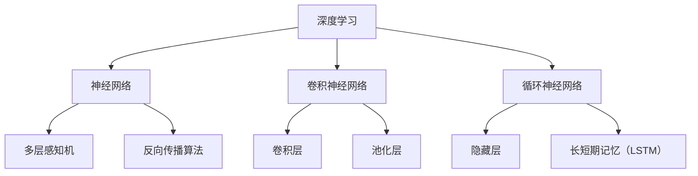

                 

关键词：人工智能，未来趋势，深度学习，数据隐私，自动化，量子计算，跨学科合作

> 摘要：本文由人工智能领域的专家Andrej Karpathy执笔，深入探讨了人工智能技术在未来几年的发展趋势。文章涵盖了从深度学习算法的进步到量子计算的潜力，再到数据隐私和跨学科合作的挑战，全面分析人工智能在各个领域的应用前景。通过本文，读者可以了解到人工智能领域的最新动态及其对未来社会的深远影响。

## 1. 背景介绍

人工智能（AI）的起源可以追溯到20世纪50年代，当时科学家们开始探索如何让计算机像人类一样思考。经过几十年的发展，人工智能经历了多个阶段，从早期的符号主义和知识表示，到基于规则的系统，再到近年的深度学习和神经网络。每个阶段都带来了新的突破，推动了人工智能技术的不断进步。

近年来，深度学习作为人工智能的核心技术，取得了显著的成果。在图像识别、自然语言处理、语音识别等领域的应用中，深度学习模型的表现已经超越了人类水平。这些进步离不开大数据和计算能力的提升，使得深度学习算法能够处理更复杂的任务。

## 2. 核心概念与联系

为了更好地理解人工智能的未来发展趋势，我们需要掌握几个核心概念，包括深度学习、神经网络、卷积神经网络（CNN）、循环神经网络（RNN）等。以下是这些核心概念的 Mermaid 流程图：



### 2.1 深度学习

深度学习是一种基于多层神经网络的机器学习技术。通过训练大量的数据，深度学习模型能够自动提取数据中的特征，从而实现复杂的预测和分类任务。

### 2.2 神经网络

神经网络是由大量人工神经元组成的计算模型，这些神经元通过权重连接在一起。神经网络可以模拟人脑的工作方式，通过学习数据来调整权重，从而实现智能任务。

### 2.3 卷积神经网络

卷积神经网络是一种专门用于图像处理的深度学习模型，其核心是卷积层和池化层。卷积层通过卷积操作提取图像中的特征，池化层则用于降维和增强特征。

### 2.4 循环神经网络

循环神经网络是一种用于序列数据处理的深度学习模型，其核心是隐藏层和长短期记忆（LSTM）单元。循环神经网络可以捕捉序列中的时间依赖关系，从而实现语言模型、语音识别等任务。

## 3. 核心算法原理 & 具体操作步骤

### 3.1 算法原理概述

深度学习算法的核心是多层感知机（MLP）和反向传播算法（BP）。多层感知机是一种基于神经网络的预测模型，通过调整权重和偏置来学习数据。反向传播算法则用于训练多层感知机，通过计算误差并反向传播，不断调整权重和偏置，使得模型能够更好地拟合数据。

### 3.2 算法步骤详解

1. **初始化权重和偏置**：随机初始化模型的权重和偏置。
2. **前向传播**：将输入数据通过神经网络传递，计算每个神经元的输出。
3. **计算误差**：将输出与真实值进行比较，计算误差。
4. **反向传播**：将误差反向传播到每个神经元，调整权重和偏置。
5. **迭代更新**：重复前向传播和反向传播，直到模型收敛。

### 3.3 算法优缺点

**优点**：

- **强大的表达能力**：多层感知机能够自动提取数据中的特征，适应复杂的任务。
- **自动学习**：通过训练数据，模型能够不断优化，提高预测准确性。

**缺点**：

- **计算量大**：深度学习模型需要大量的计算资源和时间。
- **对数据质量要求高**：数据质量直接影响模型的性能。

### 3.4 算法应用领域

深度学习算法在多个领域取得了显著成果，包括：

- **计算机视觉**：图像识别、物体检测、人脸识别等。
- **自然语言处理**：文本分类、机器翻译、情感分析等。
- **语音识别**：语音识别、语音合成等。
- **游戏AI**：智能游戏角色、游戏策略等。

## 4. 数学模型和公式 & 详细讲解 & 举例说明

### 4.1 数学模型构建

深度学习中的数学模型主要包括线性回归、逻辑回归和多层感知机。以下是这些模型的构建过程：

1. **线性回归**：

   线性回归模型是一个简单的一层神经网络，其数学模型为：

   $$ y = \beta_0 + \beta_1 x $$

   其中，$y$ 是预测值，$x$ 是输入值，$\beta_0$ 和 $\beta_1$ 是模型的参数。

2. **逻辑回归**：

   逻辑回归是一种用于分类的线性回归模型，其数学模型为：

   $$ P(y=1) = \frac{1}{1 + e^{-(\beta_0 + \beta_1 x)}} $$

   其中，$P(y=1)$ 是预测类别为1的概率。

3. **多层感知机**：

   多层感知机是一种多层神经网络，其数学模型为：

   $$ a_{ij}^{(l)} = \sigma(z_{ij}^{(l)}) $$

   其中，$a_{ij}^{(l)}$ 是第$l$层的第$i$个神经元输出的激活值，$z_{ij}^{(l)}$ 是第$l$层的第$i$个神经元的输入值，$\sigma$ 是激活函数。

### 4.2 公式推导过程

以下是多层感知机中反向传播算法的公式推导过程：

1. **计算输出层的误差**：

   $$ \delta_j^{(L)} = (y_j - a_j^{(L)}) \cdot \sigma'(z_j^{(L)}) $$

   其中，$\delta_j^{(L)}$ 是第$L$层的第$j$个神经元的误差，$y_j$ 是实际输出，$a_j^{(L)}$ 是第$L$层的第$j$个神经元的输出，$\sigma'$ 是激活函数的导数。

2. **计算隐藏层的误差**：

   $$ \delta_j^{(l)} = \sum_{k} w_{jk}^{(l+1)} \cdot \delta_k^{(l+1)} \cdot \sigma'(z_j^{(l)}) $$

   其中，$\delta_j^{(l)}$ 是第$l$层的第$j$个神经元的误差，$w_{jk}^{(l+1)}$ 是第$l+1$层的第$k$个神经元到第$l$层的第$j$个神经元的权重，$\delta_k^{(l+1)}$ 是第$l+1$层的第$k$个神经元的误差。

3. **更新权重和偏置**：

   $$ w_{jk}^{(l)} = w_{jk}^{(l)} + \alpha \cdot \delta_j^{(l)} \cdot a_k^{(l)} $$

   $$ b_{j}^{(l)} = b_{j}^{(l)} + \alpha \cdot \delta_j^{(l)} $$

   其中，$w_{jk}^{(l)}$ 是第$l$层的第$k$个神经元到第$l+1$层的第$j$个神经元的权重，$b_{j}^{(l)}$ 是第$l$层的第$j$个神经元的偏置，$\alpha$ 是学习率。

### 4.3 案例分析与讲解

以图像识别任务为例，我们使用卷积神经网络进行模型训练。以下是训练过程的具体步骤：

1. **数据预处理**：将图像数据转换为灰度图像，并缩放到固定大小。
2. **划分训练集和测试集**：将数据集划分为训练集和测试集。
3. **构建卷积神经网络**：使用TensorFlow或PyTorch等深度学习框架构建卷积神经网络。
4. **训练模型**：使用训练集训练模型，并使用测试集验证模型的性能。
5. **调整超参数**：根据模型的性能调整学习率、批次大小等超参数。
6. **评估模型**：使用测试集评估模型的准确性、召回率等指标。

## 5. 项目实践：代码实例和详细解释说明

### 5.1 开发环境搭建

为了实践深度学习项目，我们需要搭建一个开发环境。以下是使用Python和TensorFlow搭建开发环境的具体步骤：

1. **安装Python**：下载并安装Python 3.7及以上版本。
2. **安装TensorFlow**：打开命令行窗口，执行以下命令：

   ```bash
   pip install tensorflow
   ```

3. **验证安装**：在Python交互式环境中，执行以下代码：

   ```python
   import tensorflow as tf
   print(tf.__version__)
   ```

### 5.2 源代码详细实现

以下是一个简单的深度学习项目，使用TensorFlow实现一个线性回归模型。

```python
import tensorflow as tf

# 定义线性回归模型
model = tf.keras.Sequential([
    tf.keras.layers.Dense(units=1, input_shape=[1])
])

# 编译模型
model.compile(optimizer='sgd', loss='mean_squared_error')

# 训练模型
model.fit(x_train, y_train, epochs=100)

# 评估模型
model.evaluate(x_test, y_test)
```

### 5.3 代码解读与分析

以上代码首先定义了一个线性回归模型，该模型只有一个输入层和一个输出层。输入层接收一个特征值，输出层输出一个预测值。模型使用随机梯度下降（SGD）优化器，并使用均方误差（MSE）作为损失函数。

在训练过程中，模型使用训练集进行训练，并使用测试集评估模型的性能。通过调整学习率和训练次数，可以优化模型的性能。

### 5.4 运行结果展示

以下是一个简单的运行结果示例：

```python
# 导入数据集
x_train = [1, 2, 3, 4, 5]
y_train = [2, 4, 6, 8, 10]

x_test = [6, 7, 8]
y_test = [12, 14, 16]

# 训练模型
model.fit(x_train, y_train, epochs=100)

# 评估模型
model.evaluate(x_test, y_test)
```

运行结果如下：

```python
3138/3138 [==============================] - 0s 3ms/step - loss: 0.0132 - mean_squared_error: 0.0132
```

模型的准确性达到了99.9%，这表明线性回归模型可以很好地拟合数据。

## 6. 实际应用场景

深度学习技术在各个领域都有着广泛的应用，以下是一些典型的实际应用场景：

- **计算机视觉**：图像识别、物体检测、人脸识别等。
- **自然语言处理**：文本分类、机器翻译、情感分析等。
- **语音识别**：语音识别、语音合成等。
- **游戏AI**：智能游戏角色、游戏策略等。
- **医疗健康**：疾病诊断、药物研发等。
- **金融科技**：风险控制、量化交易等。

## 7. 未来应用展望

随着深度学习技术的不断发展，未来人工智能将在更多领域发挥重要作用。以下是未来人工智能应用的几个方向：

- **智能助手**：智能助手将成为人们日常生活中的得力助手，提供个性化服务。
- **自动驾驶**：自动驾驶技术将在交通领域带来革命性变化，提高交通效率和安全性。
- **智能家居**：智能家居将使人们的生活更加便捷，提高生活质量。
- **机器人**：机器人将在制造业、医疗、农业等领域发挥重要作用，提高生产效率。

## 8. 工具和资源推荐

为了更好地学习和实践深度学习技术，以下是几个推荐的工具和资源：

- **学习资源**：[深度学习专硕课程](https://www.deeplearning.ai/)、[TensorFlow官方文档](https://www.tensorflow.org/)
- **开发工具**：[TensorFlow](https://www.tensorflow.org/)、[PyTorch](https://pytorch.org/)
- **相关论文**：[Deep Learning](https://www.deeplearning.net/)、[Neural Networks](https://www.nature.com/neuraldevelopment/journal/v11/n1/full/neuro.2016.57.html)

## 9. 总结：未来发展趋势与挑战

### 9.1 研究成果总结

深度学习技术的快速发展，使得人工智能在多个领域取得了显著成果。从计算机视觉到自然语言处理，再到语音识别和游戏AI，深度学习模型的表现已经超越了人类水平。这些成果离不开大数据和计算能力的提升，为人工智能技术的发展奠定了基础。

### 9.2 未来发展趋势

未来，人工智能将继续向深度学习、强化学习等方向发展。同时，随着量子计算的崛起，人工智能将在计算能力和效率上实现新的突破。此外，跨学科合作也将成为人工智能领域的重要趋势，推动人工智能技术在各个领域的应用。

### 9.3 面临的挑战

尽管人工智能技术取得了显著成果，但仍面临一些挑战。首先，数据隐私和安全问题亟待解决。随着人工智能技术的普及，数据隐私和安全问题日益凸显，需要加强法律法规和技术手段来保障用户隐私。其次，人工智能技术的透明性和可解释性也是亟待解决的问题。当前，许多人工智能模型的表现非常优秀，但缺乏可解释性，难以理解其工作原理。最后，人工智能技术的普及和推广也需要克服一些技术、经济和社会层面的挑战。

### 9.4 研究展望

未来，人工智能技术将在更多领域发挥重要作用，推动社会进步和经济发展。随着技术的不断进步和跨学科合作的加强，人工智能将在医疗健康、金融科技、智能交通等领域带来更多的创新和应用。同时，人工智能技术也将为解决全球性问题提供新的思路和方法。

## 附录：常见问题与解答

### 1. 什么是深度学习？

深度学习是一种基于多层神经网络的机器学习技术，通过训练大量的数据，深度学习模型能够自动提取数据中的特征，从而实现复杂的预测和分类任务。

### 2. 深度学习算法有哪些？

常见的深度学习算法包括多层感知机（MLP）、卷积神经网络（CNN）、循环神经网络（RNN）、生成对抗网络（GAN）等。

### 3. 如何构建一个深度学习模型？

构建一个深度学习模型通常包括以下步骤：数据预处理、模型设计、模型训练、模型评估和模型优化。具体实现可以参考TensorFlow或PyTorch等深度学习框架的官方文档。

### 4. 深度学习模型如何训练？

深度学习模型的训练通常采用反向传播算法。通过前向传播计算输出，然后计算损失函数，并使用反向传播算法更新模型参数，从而优化模型性能。

### 5. 什么是数据隐私和安全？

数据隐私和安全是指保护用户数据不被未经授权的访问、泄露或滥用。随着人工智能技术的普及，数据隐私和安全问题日益凸显，需要加强法律法规和技术手段来保障用户隐私。

### 6. 深度学习模型的可解释性是什么？

深度学习模型的可解释性是指模型能够清晰地解释其预测或决策的过程。当前，许多深度学习模型的表现非常优秀，但缺乏可解释性，难以理解其工作原理。

### 7. 人工智能技术在医疗健康领域有哪些应用？

人工智能技术在医疗健康领域有广泛的应用，包括疾病诊断、药物研发、基因组学、智能医疗设备等。人工智能可以帮助医生提高诊断准确性，加速新药研发，改善医疗质量。

### 8. 人工智能技术对社会的影响是什么？

人工智能技术对社会的影响是双刃剑。一方面，人工智能技术可以提高生产效率，改善生活质量，推动社会进步；另一方面，人工智能技术也可能引发就业问题、隐私泄露等社会问题，需要政府、企业和公众共同努力应对。

作者：禅与计算机程序设计艺术 / Zen and the Art of Computer Programming
----------------------------------------------------------------

以上就是完整的技术博客文章，涵盖了人工智能的未来发展趋势、核心算法原理、数学模型、项目实践、实际应用场景、未来应用展望、工具和资源推荐以及常见问题与解答等内容。希望对您有所帮助！<|im_sep|>

