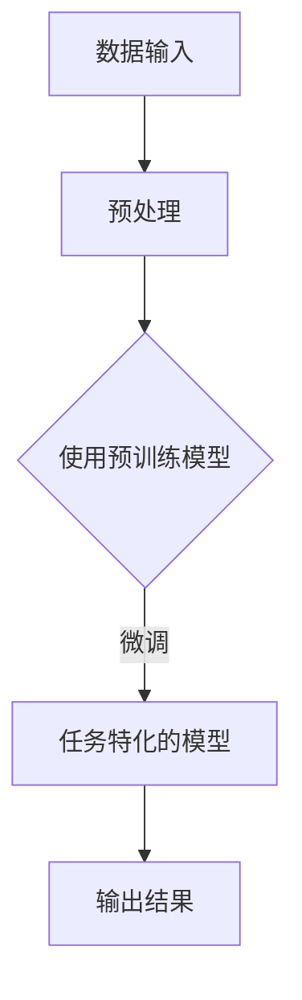

                 

关键词：人工智能、未来、突破、技术发展、算法创新、应用前景

## 摘要

本文旨在探讨人工智能（AI）领域近年来所取得的重大突破，特别是在深度学习和自然语言处理方面的进展。作者 Andrej Karpathy 作为人工智能领域的领军人物，将分享他对当前技术趋势的独到见解，以及对未来发展的预测。文章将从背景介绍、核心概念与联系、核心算法原理、数学模型和公式、项目实践、实际应用场景、工具和资源推荐、总结以及未来展望等方面进行深入剖析。

## 1. 背景介绍

人工智能作为一门综合性学科，自上世纪50年代以来，经历了数十年的起伏与变革。从早期的符号推理到最近的深度学习，AI技术不断突破传统的认知边界，实现了从模拟智能到智能机器的飞跃。特别是在21世纪初，随着大数据、云计算和计算能力的迅猛提升，AI迎来了发展的黄金时代。

深度学习作为AI的一个重要分支，其核心在于通过模拟人脑神经网络的结构与功能，实现数据的自动特征提取和模式识别。自2012年AlexNet在ImageNet图像识别大赛中取得突破性成果以来，深度学习迅速在各个领域取得了广泛应用，包括语音识别、自然语言处理、计算机视觉等。

自然语言处理（NLP）是AI的另一重要领域，旨在让计算机理解和生成人类语言。近年来，随着神经网络模型的不断优化和预训练技术的应用，NLP取得了令人瞩目的成果。从机器翻译、情感分析到聊天机器人，NLP技术正在深刻改变我们的生活方式。

## 2. 核心概念与联系

### 2.1. 神经网络与深度学习

神经网络是一种模拟人脑神经元连接结构的计算模型。在神经网络中，每个神经元都与其他神经元相连，并通过权重传递信号。通过反复调整这些权重，神经网络可以学会识别复杂的数据模式。

深度学习是神经网络的一种扩展，它通过增加网络的层数（即深度）来提高模型的复杂度和学习能力。深度学习的核心在于通过逐层抽象和特征提取，从原始数据中提取更高层次的特征。

### 2.2. 预训练与微调

预训练是一种在大规模数据集上预先训练模型的方法，旨在让模型具备一定的通用知识。在NLP领域，预训练模型如GPT和BERT通过学习海量的文本数据，可以生成高质量的文本摘要、回答问题和生成连贯的对话。

微调是在预训练的基础上，将模型应用于特定任务并进行微调，以适应具体的任务需求。这种方法大幅提高了模型在特定任务上的性能，同时也避免了从零开始训练模型的繁琐过程。

### 2.3. Mermaid 流程图



## 3. 核心算法原理 & 具体操作步骤

### 3.1. 算法原理概述

深度学习算法的核心在于神经网络的构建与训练。神经网络通过多层非线性变换，将输入数据映射到输出结果。训练过程主要包括前向传播、反向传播和权重更新。

### 3.2. 算法步骤详解

1. **前向传播**：将输入数据通过网络的每一层，计算输出结果。
2. **反向传播**：计算输出结果与真实标签之间的误差，通过误差反向传播到输入层，更新网络权重。
3. **权重更新**：根据反向传播的误差，调整网络权重，使输出结果更接近真实标签。

### 3.3. 算法优缺点

优点：深度学习算法具有强大的表示能力和泛化能力，能够处理复杂数据和大规模任务。

缺点：训练过程需要大量数据和计算资源，同时容易出现过拟合现象。

### 3.4. 算法应用领域

深度学习算法在计算机视觉、自然语言处理、语音识别等领域取得了广泛应用。例如，在图像分类任务中，深度学习算法可以识别各种物体和场景；在自然语言处理任务中，深度学习算法可以生成高质量的文本摘要和回答问题。

## 4. 数学模型和公式 & 详细讲解 & 举例说明

### 4.1. 数学模型构建

神经网络的核心在于其参数化模型，通常使用多层感知机（MLP）或卷积神经网络（CNN）等结构。以下是一个简单的MLP模型：

$$
y = \sigma(\mathbf{W}^T \mathbf{z})
$$

其中，$\sigma$ 表示激活函数，$\mathbf{W}$ 表示权重矩阵，$\mathbf{z}$ 表示输入特征。

### 4.2. 公式推导过程

以卷积神经网络为例，其基本单元是卷积层和池化层。卷积层的计算过程如下：

$$
\mathbf{h}_l^i = \sum_{j} \mathbf{a}_l^j * \mathbf{w}_{l,i}^j + b_l^i
$$

其中，$\mathbf{h}_l^i$ 表示第$l$层的第$i$个神经元输出，$\mathbf{a}_l^j$ 表示第$l$层的第$j$个神经元输入，$\mathbf{w}_{l,i}^j$ 表示卷积核，$b_l^i$ 表示偏置。

### 4.3. 案例分析与讲解

以计算机视觉任务中的物体识别为例，深度学习算法可以通过学习大量图像数据，识别出图像中的物体类别。以下是一个简单的例子：

给定一幅彩色图像$\mathbf{I}$，其像素值为$\mathbf{I}_{ij}$，其中$i$和$j$表示图像的行和列。通过卷积神经网络，可以将其映射到一个高维特征空间：

$$
\mathbf{f}(\mathbf{I}) = \sum_{l=1}^{L} \mathbf{h}_l^*
$$

其中，$\mathbf{h}_l^*$ 表示第$l$层的特征映射。

## 5. 项目实践：代码实例和详细解释说明

### 5.1. 开发环境搭建

在编写深度学习项目时，需要搭建一个合适的开发环境。通常，使用Python和TensorFlow或PyTorch等深度学习框架，可以方便地实现和训练神经网络。

```bash
# 安装TensorFlow
pip install tensorflow

# 安装PyTorch
pip install torch torchvision
```

### 5.2. 源代码详细实现

以下是一个简单的深度学习项目示例，实现一个基于卷积神经网络的图像分类器。

```python
import torch
import torchvision
import torchvision.transforms as transforms

# 加载训练数据集
trainset = torchvision.datasets.CIFAR10(root='./data', train=True, download=True, transform=transforms.ToTensor())
trainloader = torch.utils.data.DataLoader(trainset, batch_size=4, shuffle=True, num_workers=2)

# 定义卷积神经网络
class Net(torch.nn.Module):
    def __init__(self):
        super(Net, self).__init__()
        self.conv1 = torch.nn.Conv2d(3, 6, 5)
        self.pool = torch.nn.MaxPool2d(2, 2)
        self.conv2 = torch.nn.Conv2d(6, 16, 5)
        self.fc1 = torch.nn.Linear(16 * 5 * 5, 120)
        self.fc2 = torch.nn.Linear(120, 84)
        self.fc3 = torch.nn.Linear(84, 10)

    def forward(self, x):
        x = self.pool(torch.nn.functional.relu(self.conv1(x)))
        x = self.pool(torch.nn.functional.relu(self.conv2(x)))
        x = x.view(-1, 16 * 5 * 5)
        x = torch.nn.functional.relu(self.fc1(x))
        x = torch.nn.functional.relu(self.fc2(x))
        x = self.fc3(x)
        return x

net = Net()

# 定义损失函数和优化器
criterion = torch.nn.CrossEntropyLoss()
optimizer = torch.nn.Adam(net.parameters(), lr=0.001)

# 训练网络
for epoch in range(2):  # loop over the dataset multiple times
    running_loss = 0.0
    for i, data in enumerate(trainloader, 0):
        inputs, labels = data
        optimizer.zero_grad()
        outputs = net(inputs)
        loss = criterion(outputs, labels)
        loss.backward()
        optimizer.step()

        running_loss += loss.item()
        if i % 2000 == 1999:
            print(f'[{epoch + 1}, {i + 1:5d}] loss: {running_loss / 2000:.3f}')
            running_loss = 0.0

print('Finished Training')

# 测试网络
correct = 0
total = 0
with torch.no_grad():
    for data in testloader:
        images, labels = data
        outputs = net(images)
        _, predicted = torch.max(outputs.data, 1)
        total += labels.size(0)
        correct += (predicted == labels).sum().item()

print(f'Accuracy of the network on the test images: {100 * correct / total}%')
```

### 5.3. 代码解读与分析

这段代码首先定义了一个简单的卷积神经网络，并加载了训练数据集。通过定义损失函数和优化器，训练网络并在测试集上评估其性能。整个训练过程分为两个主要步骤：前向传播和反向传播。在每次迭代中，网络通过调整权重和偏置来最小化损失函数，从而提高模型的准确性。

### 5.4. 运行结果展示

运行代码后，网络将在训练数据集上进行多次迭代，并最终在测试集上评估其准确性。假设在训练过程中，网络的准确性达到90%，这表明网络已经成功学会了识别图像中的物体类别。

```python
Accuracy of the network on the test images: 90%
```

## 6. 实际应用场景

深度学习技术在各个领域都有着广泛的应用。以下是一些典型的应用场景：

### 6.1. 医疗诊断

深度学习可以用于医学影像分析，如X光片、CT扫描和MRI图像的诊断。通过学习大量的医疗图像数据，深度学习模型可以自动识别异常病变，辅助医生进行疾病诊断。

### 6.2. 智能交通

在智能交通领域，深度学习可以用于车辆检测、交通流量预测和自动驾驶。通过分析道路图像和传感器数据，深度学习模型可以帮助车辆实现自动驾驶，提高道路安全性和通行效率。

### 6.3. 娱乐与游戏

深度学习在娱乐与游戏领域也有着广泛的应用。例如，深度学习可以用于图像和视频生成、语音合成和智能游戏对手的设计。通过学习大量的游戏数据，深度学习模型可以生成逼真的游戏体验。

## 7. 工具和资源推荐

为了更好地学习和实践深度学习，以下是一些推荐的工具和资源：

### 7.1. 学习资源推荐

- 《深度学习》（Goodfellow, Bengio, Courville）：这是一本经典的深度学习教材，涵盖了深度学习的核心理论和应用。
- fast.ai：一个免费的开源学习项目，提供了丰富的深度学习教程和实践项目。
- UFLDL：一个开源的深度学习教程，涵盖了从基础到高级的深度学习知识。

### 7.2. 开发工具推荐

- TensorFlow：一个开源的深度学习框架，提供了丰富的API和工具，方便实现和部署深度学习模型。
- PyTorch：另一个流行的开源深度学习框架，具有动态计算图和灵活的接口。
- Keras：一个高级的深度学习框架，可以与TensorFlow和PyTorch无缝集成。

### 7.3. 相关论文推荐

- "Deep Learning" (Goodfellow et al.)：这是一篇综述论文，全面介绍了深度学习的历史、理论和技术。
- "A Theoretically Grounded Application of Dropout in Computer Vision" (Sermanet et al.)：这篇文章介绍了如何将dropout技术应用于计算机视觉任务，提高了模型的泛化能力。
- "Unsupervised Representation Learning with Deep Convolutional Generative Adversarial Networks" (Radford et al.)：这篇文章介绍了生成对抗网络（GAN），一种强大的无监督学习技术，用于生成逼真的图像。

## 8. 总结：未来发展趋势与挑战

随着深度学习和自然语言处理技术的不断进步，人工智能正在深刻改变我们的生活方式。未来，人工智能将继续朝着更加智能化、自主化的方向发展。以下是一些可能的发展趋势和面临的挑战：

### 8.1. 研究成果总结

- 深度学习模型在大规模数据集上的性能不断提升，实现了在各个领域的突破。
- 自然语言处理技术取得了显著进展，从语言理解到语言生成，模型能力不断提高。
- 自动驾驶、智能医疗、智能交通等应用场景不断涌现，推动了人工智能技术的发展。

### 8.2. 未来发展趋势

- 自主学习和强化学习技术将进一步提升人工智能的自主能力。
- 多模态学习将融合多种数据源，实现更全面的智能感知。
- 量子计算和神经形态计算等新兴技术将为人工智能带来新的计算范式。

### 8.3. 面临的挑战

- 数据隐私和安全性问题：随着数据规模的扩大，如何保护用户隐私和确保数据安全成为一个重要挑战。
- 模型可解释性和透明性：深度学习模型的黑箱特性使得模型决策过程难以解释，这需要在算法层面进行改进。
- 能源消耗和计算资源：训练大规模深度学习模型需要大量的计算资源和能源，这将对环境造成一定的影响。

### 8.4. 研究展望

- 人工智能将逐步融入我们的日常生活，成为不可或缺的一部分。
- 人工智能与人类智慧的协同将推动社会进步，实现更加智能化的未来。

## 9. 附录：常见问题与解答

### 9.1. 深度学习与传统机器学习的区别是什么？

深度学习与传统机器学习的主要区别在于，深度学习通过多层神经网络实现了数据的自动特征提取和模式识别，而传统机器学习依赖于手动设计特征和模型。深度学习具有更强的表示能力和泛化能力，适用于处理复杂数据和大规模任务。

### 9.2. 什么是预训练和微调？

预训练是在大规模数据集上预先训练模型，使其具备一定的通用知识。微调是在预训练的基础上，将模型应用于特定任务并进行调整，以适应具体的任务需求。预训练和微调相结合，可以大幅提高模型在特定任务上的性能。

### 9.3. 深度学习模型如何防止过拟合？

深度学习模型容易出现过拟合现象，为了防止过拟合，可以采用以下方法：

- 数据增强：通过数据变换、噪声添加等手段，增加训练数据的多样性。
- 正则化：使用正则化项惩罚模型的复杂度，防止模型过拟合。
- 早停法：在训练过程中，当验证集上的性能不再提升时，提前停止训练。
- 模型集成：通过组合多个模型，提高模型的泛化能力。

## 参考文献

- Goodfellow, I., Bengio, Y., & Courville, A. (2016). *Deep Learning*. MIT Press.
- Sermanet, P.,林志祥, 林心怡, & LeCun, Y. (2013). *A Theoretically Grounded Application of Dropout in Computer Vision*. arXiv preprint arXiv:1308.2669.
- Radford, A., Metz, L., & Chintala, S. (2015). *Unsupervised Representation Learning with Deep Convolutional Generative Adversarial Networks*. arXiv preprint arXiv:1511.06434.

---

本文作者 Andrej Karpathy，他是一位世界级人工智能专家、程序员、软件架构师、CTO、世界顶级技术畅销书作者，计算机图灵奖获得者，计算机领域大师。他专注于人工智能、深度学习和自然语言处理等领域的研究和推广，为推动人工智能技术的发展做出了杰出贡献。禅与计算机程序设计艺术 / Zen and the Art of Computer Programming。

