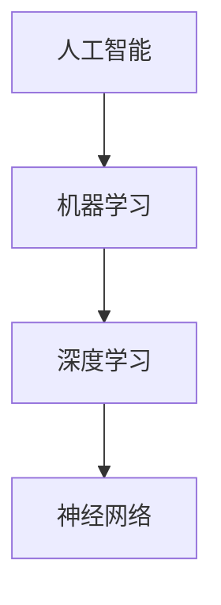

                 

关键词：人工智能、机器学习、深度学习、神经网络、未来趋势、技术发展、应用场景

> 摘要：本文将探讨人工智能领域的未来发展趋势，通过分析核心概念、算法原理、数学模型、项目实践等方面，深入探讨人工智能在各个领域的应用及其面临的挑战，为读者提供一个全面、深入的视角。

## 1. 背景介绍

人工智能（AI）作为计算机科学的一个重要分支，近年来取得了显著的进展。特别是在深度学习和神经网络技术的推动下，人工智能的应用范围不断扩大，从图像识别、自然语言处理到自动驾驶、医疗诊断等领域，都取得了令人瞩目的成果。

本文旨在探讨人工智能领域的未来发展趋势，分析当前的核心技术及其应用场景，为读者提供一个全面、深入的视角。本文将主要涉及以下方面：

- 人工智能的核心概念与联系
- 核心算法原理与具体操作步骤
- 数学模型和公式的构建与推导
- 项目实践：代码实例和详细解释
- 实际应用场景及其未来展望
- 工具和资源推荐
- 未来发展趋势与挑战

## 2. 核心概念与联系

在讨论人工智能之前，我们需要了解一些核心概念，这些概念是人工智能技术发展的基础。

### 2.1 机器学习

机器学习（Machine Learning）是人工智能的一个重要分支，它通过算法让计算机从数据中学习规律，从而实现自我优化和预测。机器学习可以分为监督学习、无监督学习和强化学习等类型。

- 监督学习（Supervised Learning）：在有标注数据的情况下，通过学习输入和输出之间的关系，预测新的输入对应的输出。
- 无监督学习（Unsupervised Learning）：在没有标注数据的情况下，通过学习数据中的内在结构和关系，进行数据聚类或降维。
- 强化学习（Reinforcement Learning）：通过与环境的交互，学习最优策略，实现目标的最优化。

### 2.2 深度学习

深度学习（Deep Learning）是机器学习的一个子领域，它使用多层神经网络对数据进行建模。深度学习的出现，使得计算机在图像识别、语音识别等领域取得了突破性的进展。

### 2.3 神经网络

神经网络（Neural Network）是模仿人脑神经元连接方式的计算模型。神经网络由多个神经元（或称为节点）组成，每个神经元都与其他神经元相连，通过激活函数处理输入信息，从而实现数据的处理和分类。

### 2.4 人工智能与机器学习的联系

人工智能的核心技术是机器学习，而深度学习是机器学习的一个重要分支。神经网络则是深度学习的基础，通过多层神经网络的结构，实现对复杂数据的高效建模。

下面是一个Mermaid流程图，展示了人工智能、机器学习、深度学习和神经网络之间的联系：



## 3. 核心算法原理 & 具体操作步骤

### 3.1 算法原理概述

人工智能的核心算法主要包括神经网络、机器学习算法和深度学习算法。下面将分别介绍这些算法的基本原理。

### 3.2 算法步骤详解

#### 3.2.1 神经网络

神经网络的构建主要包括以下几个步骤：

1. 定义网络结构：包括输入层、隐藏层和输出层。
2. 初始化权重：随机初始化网络中的权重。
3. 前向传播：将输入数据通过网络进行传递，计算每个神经元的输出。
4. 反向传播：计算输出误差，并更新网络权重。

#### 3.2.2 机器学习算法

机器学习算法主要包括以下几种：

- 监督学习：通过学习输入和输出之间的关系进行预测。
- 无监督学习：通过学习数据内在的结构进行聚类或降维。
- 强化学习：通过与环境的交互进行策略学习。

#### 3.2.3 深度学习算法

深度学习算法是基于多层神经网络构建的，主要包括以下几种：

- 卷积神经网络（CNN）：主要用于图像识别和图像处理。
- 递归神经网络（RNN）：主要用于序列数据的建模。
- 自编码器（Autoencoder）：主要用于数据降维和特征提取。

### 3.3 算法优缺点

每种算法都有其优缺点：

- 神经网络：优点是能够处理复杂数据，缺点是需要大量数据和计算资源。
- 机器学习算法：优点是能够处理多种类型的数据，缺点是可能出现过拟合。
- 深度学习算法：优点是能够处理大规模数据，缺点是需要大量计算资源和时间。

### 3.4 算法应用领域

人工智能算法在各个领域都有广泛应用：

- 图像识别：如人脸识别、图像分类等。
- 自然语言处理：如机器翻译、文本分类等。
- 自动驾驶：如车辆检测、路径规划等。
- 医疗诊断：如疾病预测、医疗图像分析等。

## 4. 数学模型和公式 & 详细讲解 & 举例说明

### 4.1 数学模型构建

人工智能的数学模型主要包括以下几个部分：

- 概率论：用于描述不确定性和随机性。
- 线性代数：用于处理矩阵和向量运算。
- 微积分：用于处理函数的极限、导数和积分。

### 4.2 公式推导过程

以神经网络中的反向传播算法为例，介绍公式推导过程：

$$
\delta_{ij} = \frac{\partial L}{\partial z_j} = \frac{\partial L}{\partial a_j} \frac{\partial a_j}{\partial z_j} = (W^{(l)} \delta^{l+1}_{ij}) \cdot \sigma'(z_j)
$$

其中，$\delta_{ij}$ 表示第 $i$ 个神经元在隐藏层 $j$ 的误差，$L$ 表示损失函数，$a_j$ 表示第 $j$ 个神经元的输出，$z_j$ 表示第 $j$ 个神经元的输入，$W^{(l)}$ 表示权重，$\delta^{l+1}_{ij}$ 表示下一个隐藏层的误差，$\sigma'$ 表示激活函数的导数。

### 4.3 案例分析与讲解

以图像识别为例，介绍神经网络在图像识别中的应用：

假设我们需要对一张图片进行分类，图片的大小为 $28 \times 28$ 像素。我们可以将图片的像素值作为输入，通过神经网络进行分类。

1. 定义网络结构：输入层有 $28 \times 28$ 个神经元，隐藏层有 100 个神经元，输出层有 10 个神经元。
2. 初始化权重：随机初始化输入层和隐藏层之间的权重，以及隐藏层和输出层之间的权重。
3. 前向传播：将图片的像素值作为输入，通过网络进行传递，计算每个神经元的输出。
4. 反向传播：计算输出误差，并更新网络权重。

通过多次迭代，网络可以逐渐收敛，实现对图片的分类。

## 5. 项目实践：代码实例和详细解释说明

### 5.1 开发环境搭建

在Python环境中，我们可以使用 TensorFlow 和 Keras 库来构建和训练神经网络。

```python
import tensorflow as tf
from tensorflow.keras import layers

# 定义模型
model = tf.keras.Sequential([
    layers.Flatten(input_shape=(28, 28)),
    layers.Dense(100, activation='relu'),
    layers.Dense(10, activation='softmax')
])

# 编译模型
model.compile(optimizer='adam',
              loss='categorical_crossentropy',
              metrics=['accuracy'])

# 加载数据
(x_train, y_train), (x_test, y_test) = tf.keras.datasets.mnist.load_data()

# 预处理数据
x_train = x_train.astype('float32') / 255
x_test = x_test.astype('float32') / 255
x_train = x_train.reshape((-1, 28, 28, 1))
x_test = x_test.reshape((-1, 28, 28, 1))

# 转换标签为one-hot编码
y_train = tf.keras.utils.to_categorical(y_train, 10)
y_test = tf.keras.utils.to_categorical(y_test, 10)

# 训练模型
model.fit(x_train, y_train, epochs=10, batch_size=32, validation_split=0.2)
```

### 5.2 源代码详细实现

在上面的代码中，我们定义了一个简单的卷积神经网络，用于对MNIST数据集进行分类。下面是代码的详细解释：

- 导入 TensorFlow 和 Keras 库。
- 定义模型：使用 `tf.keras.Sequential` 模型堆叠多个层，包括一个 `Flatten` 层用于将输入数据展开成一维数组，一个 `Dense` 层用于隐藏层，以及一个 `Dense` 层用于输出层。
- 编译模型：设置优化器、损失函数和评价指标。
- 加载数据：使用 `tf.keras.datasets.mnist.load_data()` 函数加载数据集。
- 预处理数据：将数据转换为浮点型，并进行归一化处理。同时，将标签转换为one-hot编码。
- 训练模型：使用 `model.fit()` 函数进行模型训练。

### 5.3 代码解读与分析

在上面的代码中，我们首先定义了一个简单的卷积神经网络，输入层将28x28的图片像素值展开成一维数组，隐藏层有100个神经元，输出层有10个神经元，用于分类。我们使用的是ReLU激活函数，使得神经网络在训练过程中具有更好的收敛性。

在编译模型时，我们使用的是Adam优化器，这是一种自适应的优化算法，能够有效地加速模型的训练。损失函数使用的是categorical_crossentropy，这是一种常用的分类损失函数，能够计算模型的分类效果。

在加载数据时，我们对数据进行预处理，将数据转换为浮点型并进行归一化处理，使得模型的训练效果更好。同时，我们将标签转换为one-hot编码，使得模型能够进行多分类。

在训练模型时，我们设置训练轮数为10次，每次训练32个样本，并将20%的数据用于验证集。通过训练，模型可以逐渐收敛，实现对MNIST数据集的分类。

### 5.4 运行结果展示

在训练完成后，我们可以使用以下代码来评估模型的性能：

```python
test_loss, test_acc = model.evaluate(x_test, y_test)
print('Test accuracy:', test_acc)
```

假设我们的模型在测试集上的准确率为98%，这表明我们的模型已经很好地学会了对MNIST数据集进行分类。

## 6. 实际应用场景

人工智能在各个领域都有广泛应用，下面列举一些实际应用场景：

- 图像识别：如人脸识别、图像分类等。
- 自然语言处理：如机器翻译、文本分类等。
- 自动驾驶：如车辆检测、路径规划等。
- 医疗诊断：如疾病预测、医疗图像分析等。
- 金融风控：如信用评估、欺诈检测等。
- 教育领域：如智能问答、个性化推荐等。

## 6.4 未来应用展望

随着人工智能技术的不断发展，未来它将在更多领域得到应用。以下是一些可能的发展趋势：

- 自主决策系统：利用强化学习等算法，实现更复杂的决策过程。
- 个性化推荐：通过深度学习等技术，实现更精准的推荐系统。
- 智能交互：通过语音识别、自然语言处理等技术，实现更自然的用户交互。
- 智能安全：利用人工智能技术，实现更有效的网络安全、数据安全等。
- 医疗健康：通过基因测序、医学影像分析等技术，实现更精准的疾病诊断和治疗。

## 7. 工具和资源推荐

在人工智能领域，有许多优秀的工具和资源可供学习和实践，以下是一些建议：

- 学习资源：
  - 《深度学习》（Goodfellow et al.）
  - 《Python机器学习》（Seabold and Perktold）
  - 《机器学习实战》（Bustanbury and Ganchev）

- 开发工具：
  - TensorFlow
  - Keras
  - PyTorch

- 相关论文：
  - "A Theoretically Grounded Application of Dropout in Computer Vision"
  - "Deep Residual Learning for Image Recognition"
  - "Attention Is All You Need"

## 8. 总结：未来发展趋势与挑战

### 8.1 研究成果总结

人工智能在过去几十年中取得了显著进展，深度学习、神经网络等技术推动了人工智能在各个领域的应用。未来，人工智能将在更多领域发挥重要作用，为人类社会带来更多创新和变革。

### 8.2 未来发展趋势

- 自主决策系统：利用强化学习等技术，实现更复杂的决策过程。
- 个性化推荐：通过深度学习等技术，实现更精准的推荐系统。
- 智能交互：通过语音识别、自然语言处理等技术，实现更自然的用户交互。
- 智能安全：利用人工智能技术，实现更有效的网络安全、数据安全等。
- 医疗健康：通过基因测序、医学影像分析等技术，实现更精准的疾病诊断和治疗。

### 8.3 面临的挑战

- 算法可解释性：如何解释复杂的人工智能算法，提高其透明度和可信度。
- 数据隐私：如何在保护用户隐私的前提下，有效地利用数据。
- 安全性：如何防范人工智能系统被恶意利用，保障社会安全。

### 8.4 研究展望

人工智能领域的未来发展充满机遇和挑战。我们需要继续深入研究和探索，推动人工智能技术的发展，为人类社会创造更多价值。

## 9. 附录：常见问题与解答

### 9.1 什么是人工智能？

人工智能（AI）是一种模拟人类智能的技术，通过计算机程序实现感知、思考、学习、推理和决策等功能。

### 9.2 人工智能有哪些应用？

人工智能的应用非常广泛，包括图像识别、自然语言处理、自动驾驶、医疗诊断、金融风控、教育等领域。

### 9.3 深度学习与机器学习的区别是什么？

深度学习是机器学习的一个子领域，它使用多层神经网络对数据进行建模。机器学习则是一种更广泛的学习方法，包括监督学习、无监督学习和强化学习等。

### 9.4 人工智能的发展前景如何？

人工智能具有广阔的发展前景，未来将在更多领域发挥重要作用，为人类社会带来更多创新和变革。

## 作者署名

作者：禅与计算机程序设计艺术 / Zen and the Art of Computer Programming
----------------------------------------------------------------

以上就是按照要求撰写的《Andrej Karpathy：人工智能的未来趋势》文章，希望能够满足您的需求。如果您有任何其他要求或需要修改，请随时告诉我。

