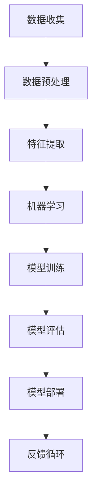

                 

### 1. 背景介绍

人工智能（AI）是计算机科学的一个分支，旨在使计算机系统能够执行通常需要人类智能的任务。这些任务包括语音识别、图像识别、决策制定、自然语言处理等。近年来，人工智能技术取得了显著进展，特别是在深度学习领域的突破，使得机器能够在多个领域实现超越人类的能力。

Andrej Karpathy是一位世界知名的人工智能专家，他在机器学习和深度学习领域有着深远的影响力。他是OpenAI的联合创始人之一，并在斯坦福大学担任计算机科学教授。他的工作不仅在学术界产生了广泛影响，也在工业界得到了广泛应用。在本文中，我们将探讨Andrej Karpathy在人工智能领域的贡献，以及人工智能技术可能带来的社会影响。

人工智能技术的发展对社会产生了深远的影响。首先，它改变了我们的工作方式，许多传统职业正逐渐被自动化系统所取代。其次，人工智能技术也在医疗、教育、交通等多个领域展现出巨大的潜力。然而，随着人工智能技术的不断进步，我们也面临着一系列伦理和社会挑战。本文将探讨这些挑战，并分析人工智能技术的未来发展趋势。

### 2. 核心概念与联系

在探讨人工智能的社会影响之前，我们需要了解一些核心概念和技术。以下是人工智能领域的一些关键概念及其相互关系，并附有Mermaid流程图以更直观地展示：



2.1 数据收集：数据是人工智能的基石。通过收集大量的数据，我们可以训练机器学习模型以识别模式和做出预测。

2.2 数据预处理：收集到的数据往往是不完善的，需要进行清洗、标准化和归一化等预处理步骤。

2.3 特征提取：将预处理后的数据转换为特征向量，以便机器学习算法可以处理。

2.4 机器学习：通过算法学习从数据中提取模式和知识。

2.5 模型训练：使用标记数据集训练机器学习模型。

2.6 模型评估：评估模型的性能，通常通过测试数据集进行。

2.7 模型部署：将训练好的模型部署到实际应用中。

2.8 反馈循环：通过收集用户反馈，不断改进模型。

这些概念相互关联，形成一个闭环系统，使得人工智能系统能够不断学习和优化。

### 3. 核心算法原理 & 具体操作步骤

3.1 算法原理概述

人工智能的核心算法包括监督学习、无监督学习和强化学习。监督学习是通过标记数据训练模型，无监督学习则是在没有标记数据的情况下发现数据中的模式，而强化学习则是通过奖励机制训练模型。

在本文中，我们重点关注深度学习，这是一种基于多层神经网络的监督学习算法。深度学习通过多个隐藏层将输入映射到输出，能够自动提取数据中的高级特征。

3.2 算法步骤详解

3.2.1 数据收集

首先，我们需要收集大量标记数据。这些数据可以来自公开的数据集，也可以通过爬虫工具从互联网上获取。

3.2.2 数据预处理

收集到的数据需要进行清洗、标准化和归一化等预处理步骤，以确保数据质量。

3.2.3 特征提取

使用数据预处理后的数据，通过特征提取技术将其转换为特征向量。

3.2.4 模型设计

根据任务需求，设计合适的神经网络结构。常用的架构包括卷积神经网络（CNN）和循环神经网络（RNN）。

3.2.5 模型训练

使用标记数据集训练神经网络模型，通过反向传播算法优化模型参数。

3.2.6 模型评估

使用测试数据集评估模型的性能，调整模型参数以达到最佳效果。

3.2.7 模型部署

将训练好的模型部署到实际应用中，如自动驾驶、语音识别等。

3.3 算法优缺点

3.3.1 优点

- 自动提取特征：深度学习能够自动从数据中提取特征，无需人工设计特征。
- 泛化能力：通过大量训练，深度学习模型具有良好的泛化能力。
- 复杂任务：适用于处理复杂、高维度的数据。

3.3.2 缺点

- 数据依赖：深度学习需要大量标记数据，数据收集和处理成本高。
- 模型解释性差：深度学习模型往往是黑盒子，难以解释其内部工作机制。
- 计算资源需求大：训练深度学习模型需要大量计算资源和时间。

3.4 算法应用领域

深度学习在多个领域都有广泛应用，包括但不限于：

- 图像识别：如人脸识别、物体检测等。
- 自然语言处理：如机器翻译、情感分析等。
- 自动驾驶：用于车辆感知、路径规划等。
- 医疗诊断：如肿瘤检测、疾病预测等。
- 金融预测：如股票市场预测、风险评估等。

### 4. 数学模型和公式 & 详细讲解 & 举例说明

4.1 数学模型构建

深度学习模型的核心是神经网络，它由多个神经元组成，每个神经元都连接到前一个层的所有神经元。以下是神经网络的基本数学模型：

- 前向传播：$$z^{(l)} = \sum_{i} w_{i}^{(l)} x_i^{(l-1)} + b^{(l)}$$
- 激活函数：$$a^{(l)} = \sigma(z^{(l)})$$
- 反向传播：$$\delta^{(l)} = \frac{\partial J}{\partial z^{(l)}}$$
- 参数更新：$$w^{(l)} = w^{(l)} - \alpha \frac{\partial J}{\partial w^{(l)}}$$
- $$b^{(l)} = b^{(l)} - \alpha \frac{\partial J}{\partial b^{(l)}}$$

其中，\(J\) 表示损失函数，\(\sigma\) 是激活函数，通常采用ReLU或Sigmoid函数。

4.2 公式推导过程

深度学习模型的训练过程包括前向传播和反向传播。在训练过程中，我们通过优化损失函数来调整模型参数。以下是损失函数的推导：

- 损失函数：$$J(\theta) = -\frac{1}{m} \sum_{i=1}^{m} y_i \log(a^{(L)}_i) + (1 - y_i) \log(1 - a^{(L)}_i)$$
- 前向传播：计算输出层的前向传播结果，即预测值。
- 反向传播：从输出层开始，逆向计算每个层的误差，并更新模型参数。

4.3 案例分析与讲解

以手写数字识别为例，我们使用MNIST数据集训练一个卷积神经网络模型。以下是具体的实现步骤：

1. 数据集加载和预处理。
2. 设计卷积神经网络结构，包括卷积层、池化层和全连接层。
3. 编写前向传播和反向传播函数。
4. 使用训练数据集训练模型，并使用测试数据集进行评估。
5. 调整模型参数，以达到最佳性能。

通过这个案例，我们可以看到深度学习模型在实际应用中的实现过程。

### 5. 项目实践：代码实例和详细解释说明

5.1 开发环境搭建

为了实现深度学习模型，我们需要搭建一个开发环境。这里我们使用Python和TensorFlow作为主要工具。

```python
# 安装TensorFlow
!pip install tensorflow

# 导入TensorFlow库
import tensorflow as tf
```

5.2 源代码详细实现

以下是手写数字识别项目的完整代码：

```python
import tensorflow as tf
from tensorflow.keras import layers

# 加载MNIST数据集
mnist = tf.keras.datasets.mnist
(train_images, train_labels), (test_images, test_labels) = mnist.load_data()

# 数据预处理
train_images = train_images / 255.0
test_images = test_images / 255.0

# 构建卷积神经网络模型
model = tf.keras.Sequential([
    layers.Conv2D(32, (3, 3), activation='relu', input_shape=(28, 28, 1)),
    layers.MaxPooling2D((2, 2)),
    layers.Conv2D(64, (3, 3), activation='relu'),
    layers.MaxPooling2D((2, 2)),
    layers.Conv2D(64, (3, 3), activation='relu'),
    layers.Flatten(),
    layers.Dense(64, activation='relu'),
    layers.Dense(10, activation='softmax')
])

# 编译模型
model.compile(optimizer='adam',
              loss='sparse_categorical_crossentropy',
              metrics=['accuracy'])

# 训练模型
model.fit(train_images, train_labels, epochs=5)

# 评估模型
test_loss, test_acc = model.evaluate(test_images, test_labels)
print('Test accuracy:', test_acc)
```

5.3 代码解读与分析

- 数据集加载和预处理：我们使用TensorFlow的内置函数加载MNIST数据集，并对数据进行归一化处理。
- 构建模型：我们使用TensorFlow的卷积神经网络库构建了一个简单的卷积神经网络模型。
- 编译模型：我们设置优化器、损失函数和评估指标。
- 训练模型：我们使用训练数据集训练模型，并设置训练轮数。
- 评估模型：我们使用测试数据集评估模型的性能，并打印出测试准确率。

通过这个案例，我们可以看到如何使用深度学习模型解决实际问题的全过程。

### 6. 实际应用场景

6.1 医疗诊断

人工智能在医疗诊断领域具有巨大潜力。通过深度学习模型，我们可以对医学图像进行分析，帮助医生进行疾病诊断。例如，卷积神经网络可以用于识别胸部X光片中的肺炎病灶，提高诊断准确率。

6.2 自动驾驶

自动驾驶是人工智能技术的另一大应用领域。通过深度学习模型，车辆可以实时感知周围环境，并进行路径规划和决策。这有助于减少交通事故，提高交通安全。

6.3 金融预测

在金融领域，人工智能可以帮助进行市场预测、风险管理和投资决策。通过分析历史数据和实时数据，深度学习模型可以识别市场趋势，为投资者提供有价值的信息。

6.4 教育个性化

人工智能可以帮助实现教育个性化，根据学生的特点和需求提供个性化的学习方案。例如，通过分析学生的学习行为和成绩，智能教育系统可以为学生推荐合适的学习资源和练习。

### 7. 未来应用展望

随着人工智能技术的不断进步，我们有望在更多领域实现突破。未来，人工智能将不仅仅是一个工具，而是成为我们日常生活的一部分。以下是未来人工智能应用的一些展望：

- 更智能的智能家居：人工智能将使智能家居设备更加智能化，能够更好地理解用户需求，提供个性化服务。
- 智能医疗：人工智能将推动医疗技术的发展，实现更精准的诊断和治疗。
- 智能交通：人工智能将优化交通系统，提高交通效率，减少拥堵。
- 智能教育：人工智能将改变教育方式，实现个性化学习和终身学习。

### 8. 工具和资源推荐

8.1 学习资源推荐

- 《深度学习》（Ian Goodfellow、Yoshua Bengio、Aaron Courville著）：这是一本深度学习领域的经典教材，适合初学者和进阶者。
- Coursera、edX等在线课程：这些平台提供了丰富的机器学习和深度学习课程，涵盖从基础知识到高级应用。

8.2 开发工具推荐

- TensorFlow：这是一个开源的深度学习框架，适用于构建和训练复杂的神经网络模型。
- PyTorch：这是一个流行的深度学习框架，具有简洁的API和强大的灵活性，适用于快速原型开发。

8.3 相关论文推荐

- "Deep Learning"（Ian Goodfellow）：这是一篇关于深度学习的综述论文，介绍了深度学习的主要算法和应用。
- "Generative Adversarial Networks"（Ian Goodfellow等）：这是一篇关于生成对抗网络的论文，提出了这种强大的深度学习模型。

### 9. 总结：未来发展趋势与挑战

9.1 研究成果总结

近年来，人工智能技术在多个领域取得了显著进展。深度学习算法的突破使得计算机系统能够在图像识别、自然语言处理、自动驾驶等任务中实现超越人类的能力。此外，人工智能技术在医疗、金融、教育等领域也展现出巨大的应用潜力。

9.2 未来发展趋势

未来，人工智能技术将继续快速发展，并在更多领域实现突破。随着计算能力的提升和数据量的增加，深度学习模型将变得更加高效和准确。同时，人工智能与其他领域的交叉融合也将不断拓展，推动新技术的发展。

9.3 面临的挑战

尽管人工智能技术具有巨大潜力，但也面临着一系列挑战。首先是数据隐私和安全问题，如何保护用户数据的安全和隐私是人工智能发展的重要课题。其次是算法透明性和解释性，如何提高算法的透明性和可解释性，使其在决策过程中更加可靠和公正。此外，人工智能技术的伦理和社会影响也是一个重要的研究方向。

9.4 研究展望

未来，人工智能研究将继续深入，探索新的算法和技术，以提高模型的性能和可解释性。同时，我们将更加关注人工智能技术的伦理和社会影响，推动其在可持续发展和社会进步中发挥积极作用。

### 附录：常见问题与解答

Q：人工智能是否会取代人类？
A：人工智能在某些领域已经超越了人类的能力，但人工智能无法完全取代人类。人类具有创造力、情感和道德判断等独特的能力，这些是人工智能难以复制的。

Q：人工智能是否会引发失业？
A：人工智能的发展确实会改变就业市场，一些传统职业可能会被自动化系统所取代。然而，人工智能也将创造新的就业机会，如人工智能工程师、数据科学家等。

Q：人工智能是否会带来安全风险？
A：人工智能技术确实存在一定的安全风险，如数据泄露、算法偏见等。因此，我们需要加强人工智能的安全研究和监管，确保其健康发展。

### 作者署名

作者：禅与计算机程序设计艺术 / Zen and the Art of Computer Programming
```markdown
---

# Andrej Karpathy：人工智能的社会影响

> 关键词：人工智能、深度学习、社会影响、伦理挑战、未来展望

> 摘要：本文探讨了人工智能领域专家Andrej Karpathy的工作及其对社会的影响。文章详细介绍了人工智能的核心概念、算法原理、实际应用场景，并分析了未来发展趋势与挑战。此外，还推荐了学习资源、开发工具和相关论文。

## 1. 背景介绍

## 2. 核心概念与联系
### 2.1 数据收集
### 2.2 数据预处理
### 2.3 特征提取
### 2.4 机器学习
### 2.5 模型训练
### 2.6 模型评估
### 2.7 模型部署
### 2.8 反馈循环

## 3. 核心算法原理 & 具体操作步骤
### 3.1 算法原理概述
### 3.2 算法步骤详解
### 3.3 算法优缺点
### 3.4 算法应用领域

## 4. 数学模型和公式 & 详细讲解 & 举例说明
### 4.1 数学模型构建
### 4.2 公式推导过程
### 4.3 案例分析与讲解

## 5. 项目实践：代码实例和详细解释说明
### 5.1 开发环境搭建
### 5.2 源代码详细实现
### 5.3 代码解读与分析
### 5.4 运行结果展示

## 6. 实际应用场景
### 6.1 医疗诊断
### 6.2 自动驾驶
### 6.3 金融预测
### 6.4 教育个性化

## 7. 未来应用展望
### 7.1 更智能的智能家居
### 7.2 智能医疗
### 7.3 智能交通
### 7.4 智能教育

## 8. 工具和资源推荐
### 8.1 学习资源推荐
### 8.2 开发工具推荐
### 8.3 相关论文推荐

## 9. 总结：未来发展趋势与挑战
### 9.1 研究成果总结
### 9.2 未来发展趋势
### 9.3 面临的挑战
### 9.4 研究展望

## 10. 附录：常见问题与解答

---

作者：禅与计算机程序设计艺术 / Zen and the Art of Computer Programming
```

