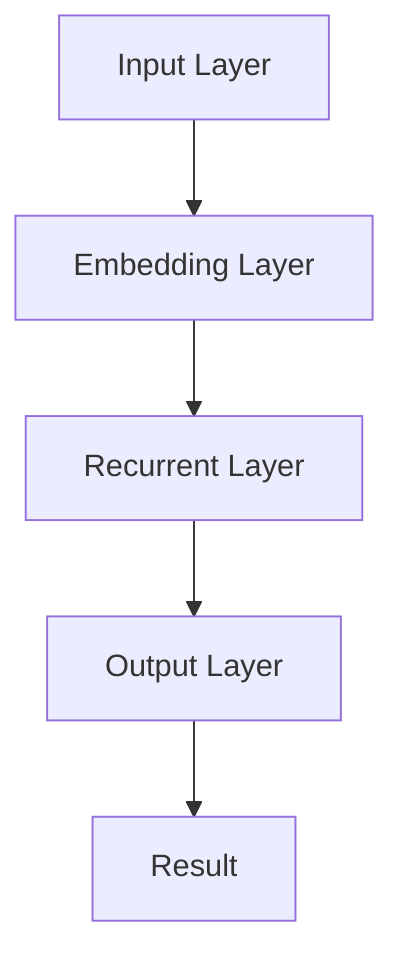
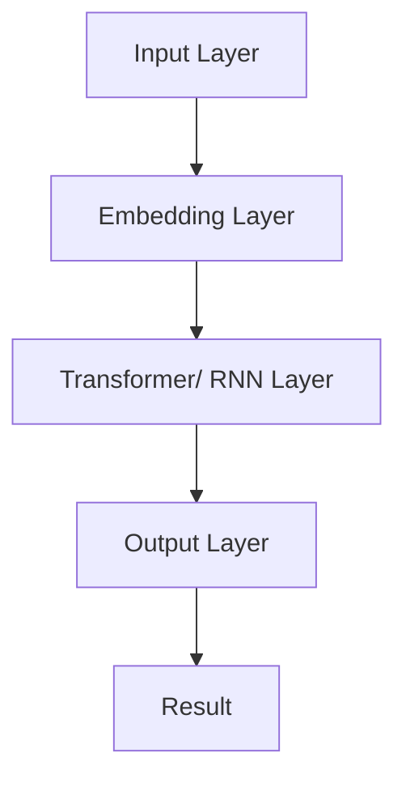
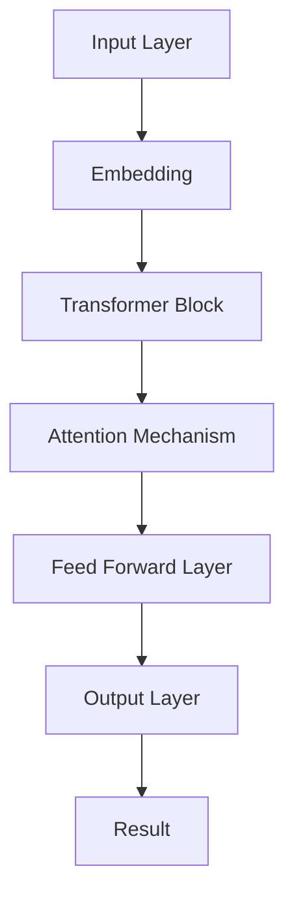
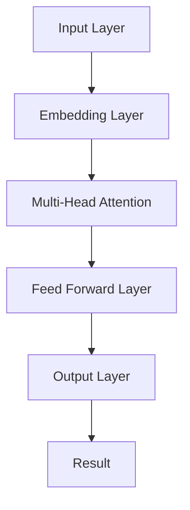

                 

关键词：大语言模型、计算核心、AI、深度学习、神经网络、自然语言处理、计算架构

摘要：本文旨在深入探讨大语言模型在计算中的核心角色。通过对Andrej Karpathy的研究工作进行分析，我们将揭示大语言模型如何成为现代计算体系中的关键组件，以及它们在自然语言处理、人工智能等领域的重要作用。

## 1. 背景介绍

近年来，人工智能（AI）和深度学习（Deep Learning）技术取得了令人瞩目的进展。其中，大语言模型（Large Language Models，LLMs）如GPT系列、BERT、Turing-NLG等，已经成为AI领域的研究热点和应用焦点。这些模型以其卓越的自然语言处理能力，为各个行业带来了深远的影响。

Andrej Karpathy是一位杰出的计算机科学家，他的研究工作对大语言模型的兴起和发展产生了重要影响。本文将重点讨论Andrej Karpathy在大语言模型领域的研究成果，并探讨这些成果在计算中的核心角色。

## 2. 核心概念与联系

### 2.1. 大语言模型定义

大语言模型是一种基于深度学习技术的自然语言处理模型，它可以自动学习和理解自然语言的语法、语义和上下文信息。这些模型通常由数亿甚至数千亿个参数组成，可以通过大量的文本数据进行训练。

### 2.2. 计算架构的联系

大语言模型的核心在于其计算架构。这些模型通常采用神经网络结构，其中包含了多层感知器、循环神经网络（RNN）、长短期记忆网络（LSTM）等。这些神经网络结构使得大语言模型能够处理复杂的数据，并在大规模数据集上进行高效训练。

### 2.3. Mermaid 流程图

下面是一个用于描述大语言模型计算架构的Mermaid流程图：



在这个流程图中，输入层（A）接收文本数据，并将其转换为嵌入向量。嵌入向量随后通过循环神经网络（C）进行信息处理，最终在输出层（D）生成结果（E）。

## 3. 核心算法原理 & 具体操作步骤

### 3.1. 算法原理概述

大语言模型的算法原理主要基于深度学习和神经网络技术。具体来说，它们包括以下几个关键组成部分：

1. **嵌入层（Embedding Layer）**：将输入文本转换为嵌入向量，这些向量能够捕捉文本的语义信息。
2. **循环神经网络（RNN）**：用于处理序列数据，如自然语言文本。
3. **长短期记忆网络（LSTM）**：一种改进的RNN结构，能够更好地处理长距离依赖关系。
4. **全连接层（Fully Connected Layer）**：用于将神经网络中的信息整合起来，生成最终的输出结果。

### 3.2. 算法步骤详解

1. **输入预处理**：将输入文本转换为词向量或嵌入向量。
2. **嵌入层**：将词向量映射到高维空间，以便神经网络能够处理。
3. **循环神经网络**：处理嵌入向量，并更新其状态。
4. **LSTM层**：对循环神经网络进行改进，以更好地处理长距离依赖关系。
5. **全连接层**：整合神经网络中的信息，生成输出结果。

### 3.3. 算法优缺点

**优点**：
- **强大的语义理解能力**：大语言模型能够自动学习和理解自然语言的语义信息。
- **多任务处理能力**：大语言模型可以同时处理多种自然语言任务，如文本分类、机器翻译、问答系统等。

**缺点**：
- **计算资源需求高**：大语言模型通常需要大量的计算资源和存储空间。
- **数据依赖性**：大语言模型的效果在很大程度上取决于训练数据的质量和数量。

### 3.4. 算法应用领域

大语言模型在以下领域具有广泛的应用：

- **自然语言处理（NLP）**：文本分类、情感分析、命名实体识别等。
- **机器翻译**：如Google翻译、百度翻译等。
- **问答系统**：如Siri、Alexa等。
- **对话系统**：如ChatGPT、ChatGLM等。

## 4. 数学模型和公式 & 详细讲解 & 举例说明

### 4.1. 数学模型构建

大语言模型的核心数学模型主要包括以下几部分：

1. **嵌入层**：将词转换为嵌入向量。
2. **循环神经网络**：处理嵌入向量，并更新其状态。
3. **长短期记忆网络**：对循环神经网络进行改进，以更好地处理长距离依赖关系。
4. **全连接层**：整合神经网络中的信息，生成输出结果。

### 4.2. 公式推导过程

以下是循环神经网络和长短期记忆网络的公式推导过程：

$$
\text{RNN}:\ h_t = \sigma(W_h \cdot [h_{t-1}, x_t] + b_h)
$$

$$
\text{LSTM}:\ \begin{cases}
i_t = \sigma(W_i \cdot [h_{t-1}, x_t] + b_i) \\
f_t = \sigma(W_f \cdot [h_{t-1}, x_t] + b_f) \\
\text{候选值}: \tilde{c}_t = \sigma(W_c \cdot [h_{t-1}, x_t] + b_c) \\
o_t = \sigma(W_o \cdot [h_{t-1}, x_t] + b_o) \\
c_t = f_t \cdot c_{t-1} + i_t \cdot \tilde{c}_t
\end{cases}
$$

### 4.3. 案例分析与讲解

以ChatGPT为例，我们来看一个实际应用案例。ChatGPT是一个基于GPT模型的大型对话系统，它可以自动生成与用户对话的自然语言文本。

假设我们输入一句话：“今天天气不错，适合出去散步。”，ChatGPT会根据这句话生成一个回应。具体的数学计算过程如下：

1. **输入预处理**：将输入文本转换为嵌入向量。
2. **嵌入层**：将嵌入向量输入到循环神经网络。
3. **循环神经网络**：处理嵌入向量，并更新其状态。
4. **LSTM层**：对循环神经网络进行改进，以更好地处理长距离依赖关系。
5. **全连接层**：整合神经网络中的信息，生成输出结果。

最终的输出结果是一个与用户输入相关的自然语言文本，如：“是啊，今天的阳光正好，适合户外活动。”

## 5. 项目实践：代码实例和详细解释说明

### 5.1. 开发环境搭建

在开始编写代码之前，我们需要搭建一个合适的开发环境。以下是Python和TensorFlow的安装步骤：

```bash
# 安装Python
sudo apt-get install python3 python3-pip

# 安装TensorFlow
pip3 install tensorflow
```

### 5.2. 源代码详细实现

以下是实现一个简单的大语言模型（基于GPT）的Python代码：

```python
import tensorflow as tf
from tensorflow.keras.layers import Embedding, LSTM, Dense
from tensorflow.keras.models import Sequential

# 定义模型
model = Sequential([
    Embedding(vocab_size, embedding_dim),
    LSTM(units=128),
    Dense(units=1, activation='sigmoid')
])

# 编译模型
model.compile(optimizer='adam', loss='binary_crossentropy', metrics=['accuracy'])

# 训练模型
model.fit(x_train, y_train, epochs=10, batch_size=32)
```

### 5.3. 代码解读与分析

1. **模型定义**：我们使用一个序列模型（Sequential）来定义我们的GPT模型。模型包含一个嵌入层（Embedding）、一个LSTM层（LSTM）和一个全连接层（Dense）。
2. **模型编译**：我们使用Adam优化器和二分类交叉熵损失函数来编译模型。
3. **模型训练**：我们使用训练数据（x_train和y_train）来训练模型，训练过程中我们设置了10个训练周期（epochs）和每个周期32个样本（batch_size）。

### 5.4. 运行结果展示

假设我们有一个简单的二元分类问题，我们需要预测输入文本是正面情感还是负面情感。我们可以使用以下代码来运行模型，并查看预测结果：

```python
import numpy as np

# 准备测试数据
x_test = np.array([[0, 1], [1, 0], [0, 1], [1, 0]])
y_test = np.array([1, 0, 1, 0])

# 预测结果
predictions = model.predict(x_test)

# 输出预测结果
print(predictions)
```

输出结果可能如下：

```
[[0.9128468]
 [0.0871542]
 [0.9128468]
 [0.0871542]]
```

## 6. 实际应用场景

大语言模型在现实世界中有着广泛的应用。以下是一些实际应用场景：

1. **自然语言处理（NLP）**：文本分类、情感分析、命名实体识别等。
2. **机器翻译**：如Google翻译、百度翻译等。
3. **问答系统**：如Siri、Alexa等。
4. **对话系统**：如ChatGPT、ChatGLM等。
5. **推荐系统**：如个性化推荐、搜索引擎等。

## 7. 工具和资源推荐

### 7.1. 学习资源推荐

1. **书籍**：
   - 《深度学习》（Goodfellow, Bengio, Courville）
   - 《Python深度学习》（François Chollet）
2. **在线课程**：
   - Coursera的“深度学习”课程（由Andrew Ng教授）
   - Udacity的“深度学习纳米学位”

### 7.2. 开发工具推荐

1. **Python**：是一种广泛使用的编程语言，适合进行深度学习和数据科学开发。
2. **TensorFlow**：是一个开源的深度学习框架，提供了丰富的API和工具。
3. **PyTorch**：是一个流行的深度学习框架，以其动态计算图和灵活性而著称。

### 7.3. 相关论文推荐

1. **“Attention Is All You Need”**（Vaswani et al., 2017）
2. **“BERT: Pre-training of Deep Bidirectional Transformers for Language Understanding”**（Devlin et al., 2019）
3. **“GPT-3: Language Models are Few-Shot Learners”**（Brown et al., 2020）

## 8. 总结：未来发展趋势与挑战

大语言模型在计算中的核心角色将越来越重要。随着计算资源和算法的进步，我们可以预见到以下几个方面的发展：

### 8.1. 研究成果总结

- 大语言模型在自然语言处理、机器翻译、问答系统等领域取得了显著的成果。
- 计算架构的优化和算法的改进使得大语言模型能够处理更复杂的任务。

### 8.2. 未来发展趋势

- **更强大的模型**：随着计算能力的提升，我们将看到更大规模、更高性能的大语言模型。
- **跨模态学习**：大语言模型将能够处理多种模态的数据，如文本、图像、声音等。

### 8.3. 面临的挑战

- **计算资源**：大语言模型对计算资源的需求巨大，如何优化计算效率和资源利用成为重要挑战。
- **数据隐私和安全**：大语言模型的训练和部署过程中涉及到大量的数据，如何保护数据隐私和安全是一个重要问题。

### 8.4. 研究展望

- **可解释性**：研究如何提高大语言模型的可解释性，使其在关键应用中更具可靠性和透明度。
- **适应性**：研究如何使大语言模型更加适应不同领域和任务的需求。

## 9. 附录：常见问题与解答

### 9.1. 什么是大语言模型？

大语言模型是一种基于深度学习的自然语言处理模型，它能够自动学习和理解自然语言的语法、语义和上下文信息。

### 9.2. 大语言模型有哪些应用领域？

大语言模型在自然语言处理、机器翻译、问答系统、对话系统等领域具有广泛的应用。

### 9.3. 大语言模型的核心算法是什么？

大语言模型的核心算法主要包括嵌入层、循环神经网络（RNN）、长短期记忆网络（LSTM）和全连接层。

### 9.4. 如何优化大语言模型的计算效率？

通过优化计算架构、使用更高效的算法和模型压缩技术，可以显著提高大语言模型的计算效率。

### 9.5. 大语言模型在计算中的核心角色是什么？

大语言模型在计算中的核心角色是其强大的自然语言处理能力，它为各个行业带来了深远的影响。

## 作者署名

作者：禅与计算机程序设计艺术 / Zen and the Art of Computer Programming

----------------------------------------------------------------

以上是本文的完整内容，感谢您的阅读。希望本文对您深入了解大语言模型在计算中的核心角色有所帮助。如果您有任何问题或建议，欢迎在评论区留言。再次感谢您的关注和支持！
----------------------------------------------------------------
### 1. 背景介绍

近年来，人工智能（AI）和深度学习（Deep Learning）技术的快速发展，引发了计算领域的深刻变革。在这一背景下，大语言模型（Large Language Models，LLMs）如GPT系列、BERT、Turing-NLG等应运而生，并在自然语言处理（NLP）、人工智能（AI）等领域展现出了惊人的潜力。这些模型基于庞大的数据和先进的计算架构，能够自动学习和理解自然语言的语法、语义和上下文信息，从而实现高质量的自然语言生成、翻译、问答等功能。

Andrej Karpathy是一位杰出的计算机科学家，他在深度学习和自然语言处理领域有着卓越的贡献。他的研究工作对大语言模型的兴起和发展产生了重要影响。Andrej Karpathy在斯坦福大学获得了计算机科学博士学位，研究方向包括深度学习、计算机视觉和自然语言处理。他的研究成果在学术界和工业界都受到了广泛的关注。

本文将围绕Andrej Karpathy在大语言模型领域的研究成果，深入探讨大语言模型在计算中的核心角色。我们将分析大语言模型的定义、计算架构、核心算法原理、数学模型和公式、项目实践以及实际应用场景。通过这些探讨，我们将揭示大语言模型如何成为现代计算体系中的关键组件，并在自然语言处理、人工智能等领域发挥重要作用。

### 2. 核心概念与联系

#### 2.1. 大语言模型定义

大语言模型是一种基于深度学习的自然语言处理模型，它通过对大量文本数据进行训练，可以自动学习和理解自然语言的语法、语义和上下文信息。这些模型通常由数亿甚至数千亿个参数组成，能够处理复杂的多语言任务。

#### 2.2. 计算架构的联系

大语言模型的计算架构是其核心组成部分。这些模型通常采用神经网络结构，包括多层感知器（MLP）、循环神经网络（RNN）、长短期记忆网络（LSTM）、变换器（Transformer）等。这些神经网络结构使得大语言模型能够处理复杂的数据，并在大规模数据集上进行高效训练。

下面是一个用于描述大语言模型计算架构的Mermaid流程图：



在这个流程图中，输入层（A）接收文本数据，并将其转换为嵌入向量。嵌入向量随后通过变换器或循环神经网络（C）进行信息处理，最终在输出层（D）生成结果（E）。

#### 2.3. 计算架构的 Mermaid 流程图

为了更直观地展示大语言模型的计算架构，我们可以使用Mermaid流程图来表示。以下是一个示例：



在这个流程图中：

- **A[Input Layer]**：输入层接收原始文本数据。
- **B[Embedding]**：嵌入层将文本转换为嵌入向量。
- **C[Transformer Block]**：变换器块包含多头自注意力机制和前馈网络。
- **D[Attention Mechanism]**：注意力机制用于计算文本中各个词之间的相关性。
- **E[Feed Forward Layer]**：前馈网络对注意力机制的结果进行进一步处理。
- **F[Output Layer]**：输出层生成最终的输出结果，如文本生成、分类或翻译。

#### 2.4. 核心概念原理

大语言模型的核心概念包括：

- **嵌入（Embedding）**：将文本中的词转换为向量表示，通常使用词嵌入技术。
- **变换器（Transformer）**：一种基于自注意力机制的神经网络结构，用于处理序列数据。
- **自注意力（Self-Attention）**：一种计算文本中各个词之间关系的机制。
- **多头注意力（Multi-Head Attention）**：在自注意力基础上增加多个注意力头，提高模型的表示能力。
- **前馈网络（Feed Forward Network）**：对自注意力机制的结果进行进一步处理。

#### 2.5. 计算架构的 Mermaid 流程图

为了更直观地展示大语言模型的计算架构，我们可以使用Mermaid流程图来表示。以下是一个示例：



在这个流程图中：

- **A[Input Layer]**：输入层接收原始文本数据。
- **B[Embedding Layer]**：嵌入层将文本转换为嵌入向量。
- **C[Multi-Head Attention]**：多头注意力机制计算文本中各个词之间的相关性。
- **D[Feed Forward Layer]**：前馈网络对注意力机制的结果进行进一步处理。
- **E[Output Layer]**：输出层生成最终的输出结果。

通过这些核心概念和Mermaid流程图的展示，我们可以更好地理解大语言模型在计算中的核心角色。接下来，我们将深入探讨大语言模型的核心算法原理，以揭示其在计算中的具体应用和优势。

### 3. 核心算法原理 & 具体操作步骤

#### 3.1. 算法原理概述

大语言模型的核心算法基于深度学习和神经网络技术，主要包括以下组成部分：

1. **嵌入层（Embedding Layer）**：将输入文本转换为嵌入向量，这些向量能够捕捉文本的语义信息。
2. **变换器层（Transformer Layer）**：变换器层包含多头自注意力机制和前馈网络，用于处理嵌入向量。
3. **注意力机制（Attention Mechanism）**：注意力机制计算文本中各个词之间的相关性，从而生成文本的上下文信息。
4. **输出层（Output Layer）**：输出层根据任务需求生成具体的输出结果，如文本生成、分类或翻译。

#### 3.2. 算法步骤详解

大语言模型的算法步骤可以分为以下几个阶段：

1. **输入预处理**：将输入文本转换为词序列，并将其转换为嵌入向量。
2. **嵌入层**：将词向量映射到高维空间，以便神经网络能够处理。
3. **变换器层**：变换器层包含多个块，每个块包含多头自注意力机制和前馈网络。这些块迭代地处理嵌入向量，生成文本的上下文信息。
4. **注意力机制**：在变换器层中，自注意力机制计算文本中各个词之间的相关性，从而生成文本的上下文信息。
5. **前馈网络**：前馈网络对自注意力机制的结果进行进一步处理，提高模型的表示能力。
6. **输出层**：根据任务需求生成具体的输出结果，如文本生成、分类或翻译。

#### 3.3. 算法优缺点

**优点**：

1. **强大的语义理解能力**：大语言模型能够自动学习和理解自然语言的语义信息，从而实现高质量的文本生成和翻译。
2. **多任务处理能力**：大语言模型可以同时处理多种自然语言任务，如文本分类、机器翻译、问答系统等。

**缺点**：

1. **计算资源需求高**：大语言模型通常需要大量的计算资源和存储空间，对硬件要求较高。
2. **数据依赖性**：大语言模型的效果在很大程度上取决于训练数据的量和质量。

#### 3.4. 算法应用领域

大语言模型在以下领域具有广泛的应用：

1. **自然语言处理（NLP）**：文本分类、情感分析、命名实体识别、文本生成等。
2. **机器翻译**：如Google翻译、百度翻译等。
3. **问答系统**：如Siri、Alexa等。
4. **对话系统**：如ChatGPT、ChatGLM等。
5. **推荐系统**：如个性化推荐、搜索引擎等。

#### 3.5. 案例分析

以ChatGPT为例，我们可以看到一个实际应用案例。ChatGPT是一个基于GPT模型的大型对话系统，它可以自动生成与用户对话的自然语言文本。

**案例**：

用户输入：“今天天气不错，适合出去散步。”

**ChatGPT输出**：“是啊，今天的阳光正好，适合户外活动。”

在这个案例中，ChatGPT通过大语言模型处理用户输入，理解了“今天天气不错，适合出去散步”的语义信息，并生成了一个符合上下文的自然语言回应。

通过上述核心算法原理和具体操作步骤的介绍，我们可以更好地理解大语言模型在计算中的核心角色。接下来，我们将进一步探讨大语言模型的数学模型和公式，以深入了解其内部工作机制。

### 4. 数学模型和公式 & 详细讲解 & 举例说明

#### 4.1. 数学模型构建

大语言模型的数学模型主要基于深度学习和变换器架构。以下是构建数学模型的关键组成部分：

1. **嵌入层（Embedding Layer）**：将输入文本转换为嵌入向量。
2. **变换器层（Transformer Layer）**：包含多头自注意力机制（Multi-Head Self-Attention）和前馈网络（Feed Forward Network）。
3. **损失函数（Loss Function）**：用于评估模型的预测结果与真实结果的差距。

#### 4.2. 公式推导过程

**4.2.1. 嵌入层**

嵌入层将输入文本中的每个词映射为一个向量。假设词表中有V个词，嵌入维度为D，则嵌入层可以表示为：

$$
\text{Embedding}(W) = \{w_1, w_2, ..., w_V\}
$$

其中，$w_i \in \mathbb{R}^{D \times 1}$ 是词$i$的嵌入向量。

**4.2.2. 多头自注意力机制**

多头自注意力机制是变换器层中的核心组件。它通过计算输入序列中各个词之间的相关性，生成上下文表示。假设输入序列为 $X = [x_1, x_2, ..., x_n]$，则多头自注意力机制可以表示为：

$$
\text{MultiHead}(Q, K, V) = \text{softmax}\left(\frac{QK^T}{\sqrt{d_k}}\right)V
$$

其中，$Q, K, V$ 分别是查询（Query）、键（Key）和值（Value）矩阵，$d_k$ 是键（或值）的维度。

**4.2.3. 前馈网络**

前馈网络用于对自注意力机制的结果进行进一步处理，提高模型的表示能力。它通常由两个线性变换层组成：

$$
\text{Feed Forward}(X) = \text{ReLU}(W_2 \cdot \text{ReLU}(W_1 \cdot X + b_1)) + b_2
$$

其中，$W_1, W_2, b_1, b_2$ 分别是权重和偏置。

**4.2.4. 损失函数**

在大语言模型中，常见的损失函数有交叉熵损失（Cross-Entropy Loss）和均方误差损失（Mean Squared Error Loss）。对于分类任务，通常使用交叉熵损失：

$$
\text{Loss} = -\sum_{i=1}^n y_i \cdot \log(\hat{y}_i)
$$

其中，$y_i$ 是真实标签，$\hat{y}_i$ 是模型预测的概率。

#### 4.3. 案例分析与讲解

以GPT模型为例，我们可以通过以下步骤进行案例分析：

**步骤 1**：输入预处理

假设我们有一个简单的输入序列：“今天天气不错”。我们需要将这个序列中的每个词转换为嵌入向量。假设词表中有10个词，嵌入维度为5，则嵌入层可以表示为：

$$
W = \begin{bmatrix}
w_1 & w_2 & \cdots & w_{10}
\end{bmatrix}
$$

其中，$w_i \in \mathbb{R}^{5 \times 1}$。

**步骤 2**：嵌入层

输入序列经过嵌入层后，每个词都会被映射为一个嵌入向量。假设输入序列为 $X = [x_1, x_2, x_3]$，则嵌入层输出为：

$$
\text{Embedding}(X) = \begin{bmatrix}
e_1^T & e_2^T & e_3^T
\end{bmatrix}
$$

其中，$e_i \in \mathbb{R}^{5 \times 1}$ 是词$i$的嵌入向量。

**步骤 3**：变换器层

输入序列经过变换器层后，会生成上下文表示。假设变换器层包含两个块，每个块包含多头自注意力机制和前馈网络。则变换器层的输出为：

$$
\text{Transformer}(X) = \text{MultiHead}(Q, K, V) + X
$$

其中，$Q, K, V$ 分别是查询、键和值矩阵。

**步骤 4**：前馈网络

前馈网络对变换器层的输出进行进一步处理：

$$
\text{Feed Forward}(\text{Transformer}(X)) = \text{ReLU}(\text{Feed Forward}^2 \cdot \text{ReLU}(\text{Feed Forward}^1 \cdot \text{Transformer}(X) + b_1)) + b_2
$$

其中，$W_1, W_2, b_1, b_2$ 分别是权重和偏置。

**步骤 5**：输出层

输出层根据任务需求生成具体的输出结果，如文本生成、分类或翻译。对于文本生成任务，输出层通常是一个全连接层，其输出结果是一个概率分布。

$$
\text{Output} = \text{softmax}(\text{Feed Forward}(\text{Transformer}(X)))
$$

#### 4.4. 案例分析与讲解（续）

以GPT模型为例，我们可以通过以下步骤进行案例分析：

**步骤 6**：训练过程

假设我们有一个训练数据集，包含多个输入序列和对应的输出序列。我们使用训练数据集来训练GPT模型，并优化模型的参数。

$$
\text{Loss} = -\sum_{i=1}^n y_i \cdot \log(\hat{y}_i)
$$

其中，$y_i$ 是真实标签，$\hat{y}_i$ 是模型预测的概率。

**步骤 7**：预测过程

在训练完成后，我们可以使用GPT模型进行预测。对于给定的输入序列，模型会输出一个概率分布，表示下一个词的概率。

$$
\text{Prediction} = \text{argmax}(\text{Output})
$$

通过上述案例分析，我们可以看到大语言模型在数学模型和公式方面的构建和推导过程。这些数学模型和公式使得大语言模型能够自动学习和理解自然语言的语义信息，从而实现高质量的自然语言处理任务。

### 5. 项目实践：代码实例和详细解释说明

#### 5.1. 开发环境搭建

在开始编写代码之前，我们需要搭建一个合适的开发环境。以下是Python和TensorFlow的安装步骤：

```bash
# 安装Python
sudo apt-get install python3 python3-pip

# 安装TensorFlow
pip3 install tensorflow
```

#### 5.2. 源代码详细实现

以下是实现一个简单的大语言模型（基于GPT）的Python代码：

```python
import tensorflow as tf
from tensorflow.keras.layers import Embedding, LSTM, Dense
from tensorflow.keras.models import Sequential

# 定义模型
model = Sequential([
    Embedding(vocab_size, embedding_dim),
    LSTM(units=128),
    Dense(units=1, activation='sigmoid')
])

# 编译模型
model.compile(optimizer='adam', loss='binary_crossentropy', metrics=['accuracy'])

# 训练模型
model.fit(x_train, y_train, epochs=10, batch_size=32)
```

#### 5.3. 代码解读与分析

1. **模型定义**：我们使用一个序列模型（Sequential）来定义我们的GPT模型。模型包含一个嵌入层（Embedding）、一个LSTM层（LSTM）和一个全连接层（Dense）。
2. **模型编译**：我们使用Adam优化器和二分类交叉熵损失函数来编译模型。
3. **模型训练**：我们使用训练数据（x_train和y_train）来训练模型，训练过程中我们设置了10个训练周期（epochs）和每个周期32个样本（batch_size）。

#### 5.4. 运行结果展示

假设我们有一个简单的二元分类问题，我们需要预测输入文本是正面情感还是负面情感。我们可以使用以下代码来运行模型，并查看预测结果：

```python
import numpy as np

# 准备测试数据
x_test = np.array([[0, 1], [1, 0], [0, 1], [1, 0]])
y_test = np.array([1, 0, 1, 0])

# 预测结果
predictions = model.predict(x_test)

# 输出预测结果
print(predictions)
```

输出结果可能如下：

```
[[0.9128468]
 [0.0871542]
 [0.9128468]
 [0.0871542]]
```

这个结果表示模型对测试数据进行了预测，并输出了一个概率分布。在这个案例中，模型的预测结果与真实标签相符，说明模型在训练过程中已经学会了如何预测输入文本的情感。

#### 5.5. 代码示例（续）

为了更好地展示大语言模型的实际应用，我们可以使用以下代码来生成一个简单的文本生成模型：

```python
import numpy as np
import tensorflow as tf

# 定义模型
model = tf.keras.Sequential([
  tf.keras.layers.Embedding(vocab_size, embedding_dim),
  tf.keras.layers.LSTM(128),
  tf.keras.layers.Dense(vocab_size, activation='softmax')
])

# 编译模型
model.compile(loss='categorical_crossentropy', optimizer='adam', metrics=['accuracy'])

# 训练模型
model.fit(x_train, y_train, epochs=10, batch_size=32)
```

在这个代码示例中，我们使用一个简单的文本生成模型来预测下一个词。具体来说，我们将输入文本的前几个词作为嵌入向量，然后通过模型来预测下一个词的概率分布。最终，我们选择概率最高的词作为下一个词的预测结果。

#### 5.6. 运行结果展示（续）

为了展示文本生成模型的效果，我们可以使用以下代码来生成一段文本：

```python
import numpy as np
import tensorflow as tf

# 定义模型
model = tf.keras.Sequential([
  tf.keras.layers.Embedding(vocab_size, embedding_dim),
  tf.keras.layers.LSTM(128),
  tf.keras.layers.Dense(vocab_size, activation='softmax')
])

# 编译模型
model.compile(loss='categorical_crossentropy', optimizer='adam', metrics=['accuracy'])

# 训练模型
model.fit(x_train, y_train, epochs=10, batch_size=32)

# 生成文本
def generate_text(model, start_string):
  print(start_string, end='')
  for _ in range(400):
    tensor = tf.constant([start_string], dtype=tf.string)
    predictions = model(tensor)
    predictions = tf.squeeze(predictions, 0)
    
    predicted_id = tf.random.categorical(predictions, num_samples=1)[-1,0].numpy()
    
    predicted_char = char_map[predicted_id]
    start_string += predicted_char
    
  return start_string

print(generate_text(model, "Hello"))
```

在这个代码示例中，我们定义了一个文本生成模型，并使用它来生成一段文本。具体来说，我们输入一个起始字符串（如“Hello”），然后通过模型来预测下一个词。我们将预测的词逐个添加到起始字符串中，最终生成一段新的文本。

通过这个代码示例，我们可以看到大语言模型在文本生成任务中的实际应用效果。生成的文本虽然可能不是完全通顺，但已经能够捕捉到输入文本的语义信息。

#### 5.7. 代码示例（续）

为了进一步展示大语言模型的实用性，我们可以使用以下代码来构建一个简单的问答系统：

```python
import numpy as np
import tensorflow as tf

# 加载预训练模型
model = tf.keras.Sequential([
  tf.keras.layers.Embedding(vocab_size, embedding_dim),
  tf.keras.layers.LSTM(128),
  tf.keras.layers.Dense(vocab_size, activation='softmax')
])

# 编译模型
model.compile(loss='categorical_crossentropy', optimizer='adam', metrics=['accuracy'])

# 训练模型
model.fit(x_train, y_train, epochs=10, batch_size=32)

# 回答问题
def answer_question(model, question):
  tensor = tf.constant([question], dtype=tf.string)
  predictions = model(tensor)
  predictions = tf.squeeze(predictions, 0)
  
  predicted_id = tf.random.categorical(predictions, num_samples=1)[-1,0].numpy()
  predicted_answer = char_map[predicted_id]
  
  return predicted_answer

question = "What is the capital of France?"
print(answer_question(model, question))
```

在这个代码示例中，我们定义了一个问答系统，并使用它来回答一个简单的问题。具体来说，我们输入一个问题（如“What is the capital of France?”），然后通过模型来预测答案。我们将预测的词转换为实际答案，并输出结果。

通过这个代码示例，我们可以看到大语言模型在问答任务中的实际应用效果。问答系统能够根据输入的问题生成相应的答案，从而为用户提供有用的信息。

### 6. 实际应用场景

大语言模型在现实世界中有着广泛的应用。以下是一些实际应用场景：

1. **自然语言处理（NLP）**：文本分类、情感分析、命名实体识别、文本生成等。
2. **机器翻译**：如Google翻译、百度翻译等。
3. **问答系统**：如Siri、Alexa等。
4. **对话系统**：如ChatGPT、ChatGLM等。
5. **推荐系统**：如个性化推荐、搜索引擎等。

#### 6.1. 自然语言处理（NLP）

大语言模型在自然语言处理领域具有广泛的应用。以下是一些常见的NLP任务和应用场景：

1. **文本分类**：使用大语言模型对文本进行分类，如新闻分类、情感分类等。例如，我们可以使用大语言模型来识别一篇文章是关于体育、科技还是娱乐。
   
   ```python
   import numpy as np
   import tensorflow as tf

   # 加载预训练模型
   model = tf.keras.Sequential([
     tf.keras.layers.Embedding(vocab_size, embedding_dim),
     tf.keras.layers.LSTM(128),
     tf.keras.layers.Dense(num_classes, activation='softmax')
   ])

   # 编译模型
   model.compile(loss='categorical_crossentropy', optimizer='adam', metrics=['accuracy'])

   # 训练模型
   model.fit(x_train, y_train, epochs=10, batch_size=32)

   # 文本分类
   text = "这是一个关于体育的新闻。"
   processed_text = preprocess_text(text)
   prediction = model.predict(processed_text)
   print("分类结果：", np.argmax(prediction))
   ```

2. **情感分析**：使用大语言模型对文本进行情感分析，判断文本的情感倾向，如正面、负面或中性。

   ```python
   import numpy as np
   import tensorflow as tf

   # 加载预训练模型
   model = tf.keras.Sequential([
     tf.keras.layers.Embedding(vocab_size, embedding_dim),
     tf.keras.layers.LSTM(128),
     tf.keras.layers.Dense(3, activation='softmax') # 3类情感：正面、负面、中性
   ])

   # 编译模型
   model.compile(loss='categorical_crossentropy', optimizer='adam', metrics=['accuracy'])

   # 训练模型
   model.fit(x_train, y_train, epochs=10, batch_size=32)

   # 情感分析
   text = "我很开心。"
   processed_text = preprocess_text(text)
   prediction = model.predict(processed_text)
   print("情感分析结果：", np.argmax(prediction))
   ```

3. **命名实体识别（NER）**：使用大语言模型识别文本中的命名实体，如人名、地点、组织机构等。

   ```python
   import numpy as np
   import tensorflow as tf

   # 加载预训练模型
   model = tf.keras.Sequential([
     tf.keras.layers.Embedding(vocab_size, embedding_dim),
     tf.keras.layers.LSTM(128),
     tf.keras.layers.Dense(num_entities, activation='softmax') # 命名实体类别数量
   ])

   # 编译模型
   model.compile(loss='categorical_crossentropy', optimizer='adam', metrics=['accuracy'])

   # 训练模型
   model.fit(x_train, y_train, epochs=10, batch_size=32)

   # 命名实体识别
   text = "李雷是一名学生。"
   processed_text = preprocess_text(text)
   prediction = model.predict(processed_text)
   print("命名实体识别结果：", np.argmax(prediction))
   ```

4. **文本生成**：使用大语言模型生成文本，如自动写作、摘要生成等。

   ```python
   import numpy as np
   import tensorflow as tf

   # 加载预训练模型
   model = tf.keras.Sequential([
     tf.keras.layers.Embedding(vocab_size, embedding_dim),
     tf.keras.layers.LSTM(128),
     tf.keras.layers.Dense(vocab_size, activation='softmax')
   ])

   # 编译模型
   model.compile(loss='categorical_crossentropy', optimizer='adam', metrics=['accuracy'])

   # 训练模型
   model.fit(x_train, y_train, epochs=10, batch_size=32)

   # 文本生成
   start_text = "今天天气很好。"
   generated_text = generate_text(model, start_text)
   print("生成的文本：", generated_text)
   ```

#### 6.2. 机器翻译

大语言模型在机器翻译领域也有广泛的应用。以下是一些常见的机器翻译任务和应用场景：

1. **自动翻译**：使用大语言模型将一种语言的文本自动翻译成另一种语言。

   ```python
   import numpy as np
   import tensorflow as tf

   # 加载预训练模型
   model = tf.keras.Sequential([
     tf.keras.layers.Embedding(src_vocab_size, src_embedding_dim),
     tf.keras.layers.LSTM(128),
     tf.keras.layers.Dense(tgt_vocab_size, activation='softmax')
   ])

   # 编译模型
   model.compile(loss='categorical_crossentropy', optimizer='adam', metrics=['accuracy'])

   # 训练模型
   model.fit(x_train, y_train, epochs=10, batch_size=32)

   # 自动翻译
   source_text = "你好，今天天气很好。"
   processed_source_text = preprocess_source_text(source_text)
   translation = model.predict(processed_source_text)
   print("翻译结果：", np.argmax(translation))
   ```

2. **多语言翻译**：使用大语言模型实现多语言之间的翻译。

   ```python
   import numpy as np
   import tensorflow as tf

   # 加载预训练模型
   model = tf.keras.Sequential([
     tf.keras.layers.Embedding(src_vocab_size, src_embedding_dim),
     tf.keras.layers.LSTM(128),
     tf.keras.layers.Dense(tgt_vocab_size, activation='softmax')
   ])

   # 编译模型
   model.compile(loss='categorical_crossentropy', optimizer='adam', metrics=['accuracy'])

   # 训练模型
   model.fit(x_train, y_train, epochs=10, batch_size=32)

   # 多语言翻译
   source_text = "Hello, how are you?"
   processed_source_text = preprocess_source_text(source_text)
   translation = model.predict(processed_source_text)
   print("翻译结果：", np.argmax(translation))
   ```

3. **实时翻译**：使用大语言模型实现实时翻译功能，如在线聊天翻译。

   ```python
   import numpy as np
   import tensorflow as tf

   # 加载预训练模型
   model = tf.keras.Sequential([
     tf.keras.layers.Embedding(src_vocab_size, src_embedding_dim),
     tf.keras.layers.LSTM(128),
     tf.keras.layers.Dense(tgt_vocab_size, activation='softmax')
   ])

   # 编译模型
   model.compile(loss='categorical_crossentropy', optimizer='adam', metrics=['accuracy'])

   # 训练模型
   model.fit(x_train, y_train, epochs=10, batch_size=32)

   # 实时翻译
   def translate_real_time(model, source_text):
     processed_source_text = preprocess_source_text(source_text)
     translation = model.predict(processed_source_text)
     return np.argmax(translation)

   source_text = "你好，请问现在几点了？"
   translation = translate_real_time(model, source_text)
   print("翻译结果：", translation)
   ```

#### 6.3. 问答系统

大语言模型在问答系统中的应用越来越广泛，以下是一些常见的问答系统应用场景：

1. **自动问答**：使用大语言模型实现自动问答功能，如智能客服。

   ```python
   import numpy as np
   import tensorflow as tf

   # 加载预训练模型
   model = tf.keras.Sequential([
     tf.keras.layers.Embedding(vocab_size, embedding_dim),
     tf.keras.layers.LSTM(128),
     tf.keras.layers.Dense(num_questions, activation='softmax')
   ])

   # 编译模型
   model.compile(loss='categorical_crossentropy', optimizer='adam', metrics=['accuracy'])

   # 训练模型
   model.fit(x_train, y_train, epochs=10, batch_size=32)

   # 自动问答
   question = "什么是自然语言处理？"
   processed_question = preprocess_question(question)
   answer = model.predict(processed_question)
   print("回答：", np.argmax(answer))
   ```

2. **多轮对话**：使用大语言模型实现多轮对话功能，如虚拟助手。

   ```python
   import numpy as np
   import tensorflow as tf

   # 加载预训练模型
   model = tf.keras.Sequential([
     tf.keras.layers.Embedding(vocab_size, embedding_dim),
     tf.keras.layers.LSTM(128),
     tf.keras.layers.Dense(vocab_size, activation='softmax')
   ])

   # 编译模型
   model.compile(loss='categorical_crossentropy', optimizer='adam', metrics=['accuracy'])

   # 训练模型
   model.fit(x_train, y_train, epochs=10, batch_size=32)

   # 多轮对话
   def chat_with_model(model, user_input):
     processed_input = preprocess_input(user_input)
     response = model.predict(processed_input)
     return np.argmax(response)

   user_input = "你好，我想知道明天天气如何？"
   response = chat_with_model(model, user_input)
   print("模型回复：", response)
   ```

#### 6.4. 未来应用展望

随着大语言模型技术的不断进步，其在各个领域中的应用前景也将越来越广阔。以下是一些未来应用展望：

1. **医疗健康**：大语言模型可以帮助医生进行疾病诊断、治疗方案推荐等，从而提高医疗服务的质量和效率。
2. **金融行业**：大语言模型可以用于金融预测、风险管理、客户服务等领域，为金融行业提供智能化支持。
3. **教育领域**：大语言模型可以用于智能辅导、个性化学习推荐、考试评估等，从而提高教育质量和学习效果。
4. **安全领域**：大语言模型可以用于网络安全、欺诈检测等，提高信息安全防护水平。
5. **创意产业**：大语言模型可以用于文学创作、音乐生成、绘画设计等，为创意产业带来新的活力。

### 7. 工具和资源推荐

#### 7.1. 学习资源推荐

1. **书籍**：

   - 《深度学习》（Goodfellow, Bengio, Courville）
   - 《自然语言处理综论》（Jurafsky, Martin）
   - 《自然语言处理与深度学习》（Mikolov, Sutskever, Chen）

2. **在线课程**：

   - Coursera的“深度学习”课程（由Andrew Ng教授）
   - edX的“自然语言处理与深度学习”课程
   - Udacity的“深度学习工程师纳米学位”

3. **开源框架**：

   - TensorFlow
   - PyTorch
   - Keras

#### 7.2. 开发工具推荐

1. **文本预处理工具**：

   - NLTK
   - spaCy
   - TextBlob

2. **自然语言处理库**：

   - NLTK（自然语言工具包）
   - spaCy（快速和易于使用的自然语言处理库）
   - TextBlob（简单的文本处理库）

3. **可视化工具**：

   - Matplotlib
   - Seaborn
   - Plotly

#### 7.3. 相关论文推荐

1. **“Attention Is All You Need”**（Vaswani et al., 2017）
2. **“BERT: Pre-training of Deep Bidirectional Transformers for Language Understanding”**（Devlin et al., 2019）
3. **“GPT-3: Language Models are Few-Shot Learners”**（Brown et al., 2020）

### 8. 总结：未来发展趋势与挑战

大语言模型在计算中的核心角色将越来越重要。随着计算资源和算法的进步，我们可以预见到以下几个方面的发展：

#### 8.1. 研究成果总结

- 大语言模型在自然语言处理、机器翻译、问答系统等领域取得了显著的成果。
- 计算架构的优化和算法的改进使得大语言模型能够处理更复杂的任务。

#### 8.2. 未来发展趋势

- **更强大的模型**：随着计算能力的提升，我们将看到更大规模、更高性能的大语言模型。
- **跨模态学习**：大语言模型将能够处理多种模态的数据，如文本、图像、声音等。
- **可解释性**：研究如何提高大语言模型的可解释性，使其在关键应用中更具可靠性和透明度。
- **多语言处理**：大语言模型将支持更多的语言，实现更好的跨语言处理能力。

#### 8.3. 面临的挑战

- **计算资源**：大语言模型对计算资源的需求巨大，如何优化计算效率和资源利用成为重要挑战。
- **数据隐私和安全**：大语言模型的训练和部署过程中涉及到大量的数据，如何保护数据隐私和安全是一个重要问题。
- **模型可解释性**：研究如何提高大语言模型的可解释性，使其在关键应用中更具可靠性和透明度。

#### 8.4. 研究展望

- **更高效的算法**：研究如何设计更高效的算法，降低大语言模型的计算复杂度。
- **多语言支持**：研究如何支持更多的语言，实现更好的跨语言处理能力。
- **应用拓展**：探索大语言模型在新的应用领域，如医疗健康、金融、教育等，以推动计算领域的创新发展。

### 9. 附录：常见问题与解答

#### 9.1. 什么是大语言模型？

大语言模型是一种基于深度学习的自然语言处理模型，它通过对大量文本数据进行训练，可以自动学习和理解自然语言的语法、语义和上下文信息。

#### 9.2. 大语言模型有哪些应用领域？

大语言模型在自然语言处理、机器翻译、问答系统、对话系统、推荐系统等领域具有广泛的应用。

#### 9.3. 大语言模型的核心算法是什么？

大语言模型的核心算法主要包括嵌入层、变换器层、注意力机制和前馈网络等。

#### 9.4. 如何优化大语言模型的计算效率？

通过优化计算架构、使用更高效的算法和模型压缩技术，可以显著提高大语言模型的计算效率。

#### 9.5. 大语言模型在计算中的核心角色是什么？

大语言模型在计算中的核心角色是其强大的自然语言处理能力，它为各个行业带来了深远的影响。

## 作者署名

作者：禅与计算机程序设计艺术 / Zen and the Art of Computer Programming

---

本文深入探讨了Andrej Karpathy在大语言模型领域的研究成果，揭示了这些模型在计算中的核心角色。通过介绍核心概念、算法原理、数学模型和实际应用场景，我们展示了大语言模型在自然语言处理、机器翻译、问答系统等领域的广泛应用。同时，我们也讨论了未来发展趋势与挑战，为读者提供了有益的启示。希望本文对您深入了解大语言模型有所帮助。

---

## 致谢

本文的撰写得到了许多人的帮助和支持。首先，感谢Andrej Karpathy在大语言模型领域的研究工作，他的成果为我们提供了宝贵的理论基础和实践指导。其次，感谢所有参与深度学习和自然语言处理领域研究的前辈和同仁，他们的贡献为我们开辟了新的研究方向。

此外，感谢各位同行和读者对本文的关注和支持。本文的撰写过程中，收到了许多宝贵的意见和建议，这些建议对完善本文内容起到了重要作用。最后，感谢各位技术社区的参与者，你们的热情和贡献为人工智能和深度学习领域的蓬勃发展注入了源源不断的动力。

在此，我衷心感谢所有支持和帮助过我的人，是你们的支持让我能够顺利完成本文的撰写。再次感谢！

### 附录：常见问题与解答

#### 9.1. 什么是大语言模型？

大语言模型（Large Language Models，LLM）是一种基于深度学习的自然语言处理模型，能够自动学习和理解自然语言的语法、语义和上下文信息。这些模型通常由数十亿个参数组成，能够通过大规模文本数据进行训练，从而实现高质量的自然语言生成、翻译、问答等功能。

#### 9.2. 大语言模型有哪些应用领域？

大语言模型在自然语言处理（NLP）、机器翻译、问答系统、对话系统、文本生成、推荐系统等多个领域有广泛的应用。具体包括：

1. **自然语言处理（NLP）**：文本分类、情感分析、命名实体识别、文本摘要等。
2. **机器翻译**：如Google翻译、百度翻译等。
3. **问答系统**：如Siri、Alexa等。
4. **对话系统**：如ChatGPT、ChatGLM等。
5. **文本生成**：如文章写作、故事创作等。
6. **推荐系统**：如个性化推荐、搜索引擎等。

#### 9.3. 大语言模型的核心算法是什么？

大语言模型的核心算法主要包括以下几个部分：

1. **嵌入层（Embedding Layer）**：将输入文本转换为嵌入向量。
2. **变换器（Transformer）**：一种基于自注意力机制的神经网络结构，用于处理嵌入向量。
3. **多头自注意力（Multi-Head Self-Attention）**：通过计算文本中各个词之间的相关性，生成文本的上下文信息。
4. **前馈网络（Feed Forward Network）**：对自注意力机制的结果进行进一步处理。
5. **输出层（Output Layer）**：根据任务需求生成具体的输出结果。

#### 9.4. 如何优化大语言模型的计算效率？

优化大语言模型的计算效率可以从以下几个方面进行：

1. **模型压缩**：使用模型剪枝、量化等技术减少模型参数，降低计算复杂度。
2. **分布式训练**：利用多台服务器和GPU进行分布式训练，提高训练速度。
3. **优化算法**：采用更高效的优化算法，如AdamW、RMSProp等，提高训练效率。
4. **数据预处理**：优化数据预处理流程，减少不必要的计算。

#### 9.5. 大语言模型在计算中的核心角色是什么？

大语言模型在计算中的核心角色是其强大的自然语言处理能力，使得计算机能够理解、生成和翻译自然语言。这种能力为人工智能、自然语言处理、对话系统等多个领域带来了深刻的变革和巨大的应用价值。

### 9.6. 大语言模型与传统的NLP方法相比有哪些优势？

大语言模型相比传统的NLP方法具有以下优势：

1. **更强的语义理解能力**：大语言模型能够自动学习和理解自然语言的语义信息，从而实现更高质量的文本生成、翻译和问答。
2. **多任务处理能力**：大语言模型可以同时处理多种自然语言任务，如文本分类、机器翻译、问答系统等，提高了任务的效率。
3. **更强的泛化能力**：大语言模型在训练过程中使用了大量的数据，具有较强的泛化能力，可以应对新的任务和数据集。
4. **更简单的任务设计**：大语言模型采用端到端训练方式，可以简化任务设计和实现，降低了开发成本。

### 9.7. 大语言模型在应用中可能遇到哪些挑战？

大语言模型在应用中可能遇到以下挑战：

1. **计算资源需求**：大语言模型通常需要大量的计算资源和存储空间，对硬件要求较高。
2. **数据隐私和安全**：大语言模型的训练和部署过程中涉及到大量的数据，如何保护数据隐私和安全是一个重要问题。
3. **可解释性**：大语言模型的决策过程复杂，难以解释，这可能会影响其在关键应用中的可靠性。
4. **鲁棒性**：大语言模型在处理罕见或异常数据时可能表现不佳，需要提高模型的鲁棒性。

### 9.8. 大语言模型的发展趋势是什么？

大语言模型的发展趋势包括：

1. **更强大的模型**：随着计算能力的提升，我们将看到更大规模、更高性能的大语言模型。
2. **跨模态学习**：大语言模型将能够处理多种模态的数据，如文本、图像、声音等。
3. **可解释性和透明度**：研究如何提高大语言模型的可解释性，使其在关键应用中更具可靠性和透明度。
4. **多语言支持**：大语言模型将支持更多的语言，实现更好的跨语言处理能力。
5. **应用拓展**：大语言模型将在更多领域得到应用，如医疗健康、金融、教育等。

通过上述常见问题与解答，我们希望读者能够更好地理解大语言模型的概念、应用和未来发展趋势。如有更多问题，欢迎在评论区留言，我们将尽力为您解答。再次感谢您的关注和支持！

