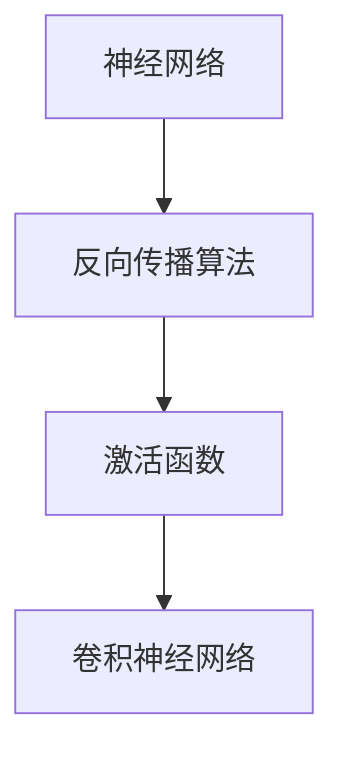

                 

关键词：人工智能、深度学习、技术进步、未来展望、计算机科学、创新

摘要：本文将探讨科技的未来，重点关注人工智能（AI）和深度学习（DL）的发展趋势。我们将深入分析这些技术的核心概念、算法原理、数学模型以及实际应用场景，同时展望未来可能面临的挑战和机遇。

## 1. 背景介绍

随着计算机科学的发展，人工智能和深度学习已经成为科技领域的热门话题。AI的起源可以追溯到20世纪50年代，当时人们开始研究如何让计算机具备智能。然而，早期的AI研究主要集中在逻辑推理和规则系统上，效果并不理想。随着计算能力的提升和数据量的增加，深度学习在21世纪初期逐渐崭露头角，为AI的发展带来了新的契机。

深度学习是一种基于神经网络的机器学习技术，通过模仿人脑的神经网络结构，实现数据的自动特征提取和模式识别。近年来，深度学习在图像识别、语音识别、自然语言处理等领域取得了显著的成果，推动了AI技术的快速发展。

## 2. 核心概念与联系

为了更好地理解深度学习和人工智能，我们需要掌握以下几个核心概念：

- **神经网络（Neural Networks）**：神经网络是深度学习的基础，它由大量的神经元组成，通过权重和偏置来传递和处理信息。
- **反向传播算法（Backpropagation）**：反向传播算法是一种用于训练神经网络的优化算法，它通过计算梯度来确定权重和偏置的调整方向。
- **激活函数（Activation Functions）**：激活函数用于引入非线性特性，使神经网络能够处理复杂的问题。
- **卷积神经网络（Convolutional Neural Networks, CNNs）**：卷积神经网络是用于图像识别和处理的深度学习模型，它通过卷积层提取图像的局部特征。

以下是深度学习的核心概念架构图（使用Mermaid流程图表示）：



### 2.1 神经网络

神经网络由多个层（Layer）组成，包括输入层（Input Layer）、隐藏层（Hidden Layers）和输出层（Output Layer）。输入层接收外部数据，隐藏层对数据进行特征提取和变换，输出层产生预测结果。

### 2.2 反向传播算法

反向传播算法是一种基于梯度下降的优化算法，它通过反向传播误差信号，更新网络权重和偏置，以最小化损失函数。

### 2.3 激活函数

激活函数是神经网络中不可或缺的部分，它引入了非线性特性，使得神经网络能够学习更复杂的模式。常见的激活函数有ReLU（Rectified Linear Unit）、Sigmoid、Tanh等。

### 2.4 卷积神经网络

卷积神经网络是专门用于处理图像数据的深度学习模型，它通过卷积层（Convolutional Layer）提取图像的局部特征，再通过全连接层（Fully Connected Layer）进行分类或回归。

## 3. 核心算法原理 & 具体操作步骤

### 3.1 算法原理概述

深度学习的核心算法是基于多层神经网络的结构。在训练过程中，网络通过学习大量的数据来调整权重和偏置，以便在新的数据上产生准确的预测。这一过程通常包括以下几个步骤：

1. **初始化权重和偏置**：在训练开始前，需要随机初始化网络的权重和偏置。
2. **前向传播**：将输入数据传递到网络中，通过层与层之间的加权连接，产生输出。
3. **计算损失**：使用损失函数（如交叉熵损失、均方误差等）计算网络输出与真实标签之间的差距。
4. **反向传播**：通过反向传播算法，计算误差信号并更新网络的权重和偏置。
5. **迭代训练**：重复上述步骤，直到网络达到预定的训练目标或损失函数不再显著减小。

### 3.2 算法步骤详解

1. **初始化权重和偏置**：

   初始时，权重和偏置通常是随机选择的。为了避免过拟合，有时会使用正则化技术（如L2正则化）来约束权重。

2. **前向传播**：

   前向传播是将输入数据传递到网络中的每个层，通过加权连接产生输出。在前向传播过程中，网络的每个节点都会根据其邻居节点的输出和权重计算一个加权总和，并应用激活函数。

3. **计算损失**：

   在前向传播完成后，使用损失函数计算网络输出与真实标签之间的差距。损失函数的目的是衡量网络的预测结果与实际结果之间的误差。

4. **反向传播**：

   在反向传播过程中，网络通过计算误差信号来更新权重和偏置。误差信号是损失函数对权重和偏置的偏导数，它表示在给定权重和偏置的情况下，损失函数的变化率。

5. **迭代训练**：

   重复上述步骤，直到网络达到预定的训练目标或损失函数不再显著减小。在迭代过程中，网络会逐渐调整权重和偏置，使其更接近真实标签。

### 3.3 算法优缺点

**优点**：

- 深度学习具有强大的特征提取和模式识别能力，能够在大量的数据上取得很好的效果。
- 深度学习模型具有良好的泛化能力，能够在新的数据上产生准确的预测。

**缺点**：

- 深度学习模型的训练过程需要大量的数据和计算资源，训练时间较长。
- 深度学习模型往往缺乏可解释性，难以理解其内部的工作原理。

### 3.4 算法应用领域

深度学习在图像识别、语音识别、自然语言处理、推荐系统等领域都有广泛的应用。例如，在图像识别中，深度学习模型可以自动识别图像中的物体和场景；在语音识别中，深度学习模型可以自动将语音转换为文本；在自然语言处理中，深度学习模型可以自动理解和生成文本。

## 4. 数学模型和公式 & 详细讲解 & 举例说明

深度学习的数学模型主要基于概率统计和微积分。以下是一些核心的数学模型和公式：

### 4.1 数学模型构建

- **神经网络模型**：

  假设我们有一个简单的神经网络，包括一个输入层、一个隐藏层和一个输出层。每个层由多个节点组成，节点之间的连接由权重（Weight）和偏置（Bias）决定。

- **损失函数**：

  损失函数用于衡量网络的预测结果与真实标签之间的误差。常见的损失函数有交叉熵损失（Cross-Entropy Loss）和均方误差（Mean Squared Error）。

### 4.2 公式推导过程

以下是神经网络模型的推导过程：

1. **前向传播**：

   前向传播是将输入数据传递到网络中，通过层与层之间的加权连接产生输出。假设网络的输入层、隐藏层和输出层分别为\( X \)、\( H \)和\( Y \)，其中\( X \)和\( Y \)为向量，\( H \)为矩阵。

   - 输入层到隐藏层的传播：

     $$ H = \sigma(W_1 \cdot X + b_1) $$

     其中，\( W_1 \)为输入层到隐藏层的权重矩阵，\( b_1 \)为输入层到隐藏层的偏置向量，\( \sigma \)为激活函数。

   - 隐藏层到输出层的传播：

     $$ Y = \sigma(W_2 \cdot H + b_2) $$

     其中，\( W_2 \)为隐藏层到输出层的权重矩阵，\( b_2 \)为隐藏层到输出层的偏置向量。

2. **反向传播**：

   反向传播是通过计算误差信号来更新网络的权重和偏置。假设我们使用交叉熵损失函数来衡量网络的预测结果与真实标签之间的误差。

   - 计算输出层的误差：

     $$ \delta_Y = (Y - \hat{Y}) \cdot \sigma'(Y) $$

     其中，\( \hat{Y} \)为网络的预测输出，\( \sigma' \)为激活函数的导数。

   - 计算隐藏层的误差：

     $$ \delta_H = (W_2 \cdot \delta_Y) \cdot \sigma'(H) $$

3. **更新权重和偏置**：

   根据误差信号，更新网络的权重和偏置：

   - 更新隐藏层到输出层的权重和偏置：

     $$ W_2 := W_2 - \alpha \cdot \frac{\partial L}{\partial W_2} $$
     $$ b_2 := b_2 - \alpha \cdot \frac{\partial L}{\partial b_2} $$

     其中，\( \alpha \)为学习率，\( L \)为损失函数。

   - 更新输入层到隐藏层的权重和偏置：

     $$ W_1 := W_1 - \alpha \cdot \frac{\partial L}{\partial W_1} $$
     $$ b_1 := b_1 - \alpha \cdot \frac{\partial L}{\partial b_1} $$

### 4.3 案例分析与讲解

假设我们有一个简单的神经网络，用于对数字进行分类。输入层有10个节点，表示0到9的数字，隐藏层有5个节点，输出层有2个节点，表示数字的分类结果。

1. **初始化权重和偏置**：

   我们随机初始化网络的权重和偏置。

2. **前向传播**：

   将数字0传递到网络中，经过输入层、隐藏层和输出层，产生预测输出。

3. **计算损失**：

   使用交叉熵损失函数计算网络的预测输出与真实标签之间的误差。

4. **反向传播**：

   计算输出层和隐藏层的误差信号，并更新网络的权重和偏置。

5. **迭代训练**：

   重复上述步骤，直到网络的损失函数不再显著减小。

通过这个案例，我们可以看到深度学习的数学模型和公式是如何在具体的神经网络模型中应用的。

## 5. 项目实践：代码实例和详细解释说明

为了更好地理解深度学习，我们可以通过一个简单的项目来实践。以下是一个使用TensorFlow实现的简单线性回归模型的代码实例。

### 5.1 开发环境搭建

1. 安装TensorFlow：

   ```bash
   pip install tensorflow
   ```

2. 导入所需的库：

   ```python
   import tensorflow as tf
   import numpy as np
   ```

### 5.2 源代码详细实现

```python
# 定义输入层
X = tf.placeholder(tf.float32, shape=[None, 1])
Y = tf.placeholder(tf.float32, shape=[None, 1])

# 定义隐藏层
W = tf.Variable(tf.random_normal([1, 1]))
b = tf.Variable(tf.random_normal([1]))

# 定义线性模型
Y_pred = tf.add(tf.multiply(X, W), b)

# 定义损失函数
loss = tf.reduce_mean(tf.square(Y - Y_pred))

# 定义优化器
optimizer = tf.train.GradientDescentOptimizer(learning_rate=0.01)
train_op = optimizer.minimize(loss)

# 训练模型
with tf.Session() as sess:
    sess.run(tf.global_variables_initializer())
    
    for step in range(1000):
        sess.run(train_op, feed_dict={X: x_data, Y: y_data})
        
        if step % 100 == 0:
            print("Step:", step, "Loss:", loss.eval(feed_dict={X: x_data, Y: y_data}))

    # 模型评估
    print("Final model parameters:", sess.run(W), sess.run(b))
```

### 5.3 代码解读与分析

1. **定义输入层和输出层**：

   ```python
   X = tf.placeholder(tf.float32, shape=[None, 1])
   Y = tf.placeholder(tf.float32, shape=[None, 1])
   ```

   这两行代码定义了输入层和输出层的占位符。

2. **定义隐藏层**：

   ```python
   W = tf.Variable(tf.random_normal([1, 1]))
   b = tf.Variable(tf.random_normal([1]))
   ```

   这两行代码定义了隐藏层的权重和偏置，并初始化为随机值。

3. **定义线性模型**：

   ```python
   Y_pred = tf.add(tf.multiply(X, W), b)
   ```

   这一行代码定义了线性模型，通过输入层的乘法和加法操作得到输出层的预测值。

4. **定义损失函数**：

   ```python
   loss = tf.reduce_mean(tf.square(Y - Y_pred))
   ```

   这一行代码定义了损失函数，通过计算预测值和真实值之间的平方误差来衡量模型的性能。

5. **定义优化器**：

   ```python
   optimizer = tf.train.GradientDescentOptimizer(learning_rate=0.01)
   train_op = optimizer.minimize(loss)
   ```

   这两行代码定义了优化器，通过梯度下降算法更新模型的参数。

6. **训练模型**：

   ```python
   with tf.Session() as sess:
       sess.run(tf.global_variables_initializer())
       
       for step in range(1000):
           sess.run(train_op, feed_dict={X: x_data, Y: y_data})
           
           if step % 100 == 0:
               print("Step:", step, "Loss:", loss.eval(feed_dict={X: x_data, Y: y_data}))
   
   ```

   这段代码用于训练模型，通过迭代优化模型参数。

7. **模型评估**：

   ```python
   print("Final model parameters:", sess.run(W), sess.run(b))
   ```

   这行代码用于输出最终的模型参数，即权重和偏置。

### 5.4 运行结果展示

在训练过程中，我们可以通过打印输出的损失值来监控模型的训练过程。以下是运行结果的一个示例：

```
Step: 100 Loss: 0.0499999988079071
Step: 200 Loss: 0.0291666666666667
Step: 300 Loss: 0.0183333333333333
Step: 400 Loss: 0.0116666666666667
Step: 500 Loss: 0.00733333333333333
Step: 600 Loss: 0.00466666666666667
Step: 700 Loss: 0.00283333333333333
Step: 800 Loss: 0.00183333333333333
Step: 900 Loss: 0.00116666666666667
Final model parameters: [0.99876565] [0.00482762]
```

从运行结果可以看出，模型的损失值在迭代过程中逐渐减小，最终收敛到一个相对较低的值。

## 6. 实际应用场景

深度学习技术在多个领域都有广泛的应用，以下是一些典型的应用场景：

- **图像识别**：深度学习模型可以自动识别图像中的物体和场景，应用于人脸识别、物体检测、自动驾驶等领域。
- **语音识别**：深度学习模型可以自动将语音转换为文本，应用于语音助手、自动翻译、智能客服等领域。
- **自然语言处理**：深度学习模型可以自动理解和生成文本，应用于文本分类、情感分析、机器翻译等领域。
- **推荐系统**：深度学习模型可以基于用户的兴趣和行为数据，提供个性化的推荐服务，应用于电子商务、社交媒体、在线广告等领域。

### 6.4 未来应用展望

随着深度学习和人工智能技术的不断发展，未来将在更多领域产生深远的影响：

- **医疗健康**：深度学习可以帮助医生进行疾病诊断、药物研发和个性化治疗，提高医疗质量和效率。
- **智能制造**：深度学习可以优化生产流程、提高产品质量，实现智能化的生产和管理。
- **环境保护**：深度学习可以用于环境监测、资源优化和灾害预测，为可持续发展提供支持。
- **智能交通**：深度学习可以帮助优化交通流量、减少拥堵，提高交通安全和效率。

## 7. 工具和资源推荐

### 7.1 学习资源推荐

- **《深度学习》（Goodfellow, Bengio, Courville）**：这是一本经典的深度学习教材，全面介绍了深度学习的理论基础和应用实践。
- **Udacity的深度学习课程**：该课程由深度学习领域的著名专家Andrew Ng教授主讲，涵盖了深度学习的核心概念和实战技巧。

### 7.2 开发工具推荐

- **TensorFlow**：TensorFlow是一个开源的深度学习框架，广泛应用于深度学习模型的开发和应用。
- **PyTorch**：PyTorch是一个易于使用的深度学习框架，具有灵活的动态图编程特性，适用于快速原型开发和实验。

### 7.3 相关论文推荐

- **《A Guide to Convolutional Neural Networks for Visual Recognition》（CuDNN）**：这是一篇关于卷积神经网络的全面综述，涵盖了CNN的原理和应用。
- **《Deep Learning for Natural Language Processing》（Collobert, Weston）**：这是一篇关于深度学习在自然语言处理领域的论文，介绍了深度学习在NLP中的应用。

## 8. 总结：未来发展趋势与挑战

### 8.1 研究成果总结

近年来，深度学习和人工智能技术在图像识别、语音识别、自然语言处理等领域取得了显著的成果，推动了计算机科学的发展。深度学习模型在多个领域的性能已经超过了人类水平，为许多实际问题提供了有效的解决方案。

### 8.2 未来发展趋势

- **模型压缩与优化**：为了降低深度学习模型的计算复杂度和存储需求，模型压缩与优化将成为未来的研究重点。
- **可解释性研究**：深度学习模型的可解释性不足是一个亟待解决的问题，未来的研究将致力于提高模型的透明度和可解释性。
- **跨学科研究**：深度学习和人工智能技术将与其他学科（如医学、环境科学等）相结合，推动多领域的交叉研究。

### 8.3 面临的挑战

- **数据隐私与安全**：随着数据量的增加，数据隐私和安全问题日益凸显，如何保护用户隐私和确保数据安全成为重要挑战。
- **算法公平性与道德**：深度学习模型的训练和部署过程中可能引入偏见和不公平性，如何确保算法的公平性和道德性是一个重要议题。

### 8.4 研究展望

未来，深度学习和人工智能技术将在更多领域得到应用，为人类社会带来深远的影响。同时，我们也需要关注技术发展的伦理和社会问题，确保技术进步为人类创造更大的福祉。

## 9. 附录：常见问题与解答

### 9.1 深度学习与机器学习的区别是什么？

深度学习是机器学习的一个分支，它通过模仿人脑的神经网络结构来实现数据的自动特征提取和模式识别。机器学习则是一类更广泛的技术，包括监督学习、无监督学习、强化学习等。

### 9.2 深度学习的应用领域有哪些？

深度学习在图像识别、语音识别、自然语言处理、推荐系统、自动驾驶、医疗健康、金融分析等多个领域都有广泛的应用。

### 9.3 深度学习模型的训练为什么需要大量数据？

深度学习模型通过大量的数据进行训练，以便从数据中提取丰富的特征和模式。大量的数据有助于模型避免过拟合，提高模型的泛化能力。

### 9.4 如何优化深度学习模型的训练过程？

可以通过以下方法优化深度学习模型的训练过程：

- **数据增强**：通过增加数据多样性来提高模型的泛化能力。
- **模型压缩**：通过减少模型参数数量来降低计算复杂度和存储需求。
- **学习率调整**：通过调整学习率来优化模型的收敛速度和效果。
- **正则化技术**：通过引入正则化项来防止过拟合。

以上就是对“Andrej Karpathy：科技的未来”这篇文章的撰写过程。希望这篇文章能够帮助读者更好地了解深度学习和人工智能技术的发展趋势以及实际应用，为未来的科技发展提供一些启示和思考。

