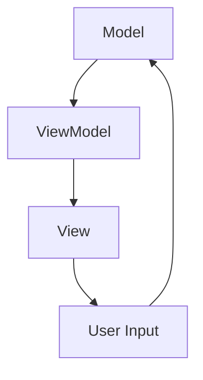
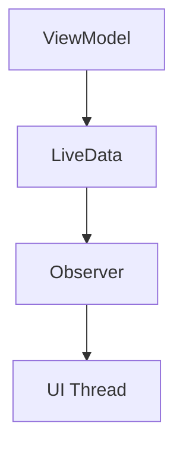

                 

关键词：Android、Jetpack、组件化、架构设计、开发实践、性能优化

> 摘要：本文将深入探讨Android Jetpack组件的应用，通过详细的分析与实战案例，帮助开发者理解并掌握如何利用Jetpack组件优化Android应用开发过程，提高应用性能和稳定性。

## 1. 背景介绍

在Android开发领域，应用架构的复杂性日益增加，这给开发者带来了诸多挑战。为了解决这些问题，Google推出了Jetpack库，这是一套现代化的Android架构组件，旨在帮助开发者简化应用开发，提高应用性能和可维护性。Jetpack组件包括多种功能模块，如LiveData、Room、ViewModel、Navigation等，这些组件协同工作，为开发者提供了强大的支持。

### 1.1 Android Jetpack的概念

Android Jetpack是一套由Google提供的库和工具，旨在解决Android应用开发中的常见问题。Jetpack组件基于最佳实践，如MVVM、ViewModel、Lifecycle等，通过提供可重用的代码和模式，使开发者能够构建灵活、高性能和易于维护的应用。

### 1.2 Android Jetpack的优点

- **简化开发流程**：通过提供现成的组件，开发者可以减少重复性工作，专注于业务逻辑的实现。
- **提高应用性能**：Jetpack组件经过优化，能够帮助开发者构建高效、响应迅速的应用。
- **提升用户体验**：Jetpack组件提供了丰富的UI支持，如StateRestoration、Lifecycle等，使应用更加稳定和用户友好。
- **增强可维护性**：通过组件化开发，代码结构更加清晰，便于团队协作和维护。

## 2. 核心概念与联系

### 2.1 MVVM架构

在Android开发中，Model-View-ViewModel（MVVM）架构是一种常用的架构模式，它将应用分为三个部分：Model（模型）、View（视图）和ViewModel（视图模型）。Jetpack组件与MVVM架构紧密相关，尤其是ViewModel和LiveData组件。

### 2.2 Mermaid流程图



### 2.3 LiveData与ViewModel的关系

LiveData与ViewModel紧密相连，它们共同实现了数据在视图和视图模型之间的双向绑定。以下是它们之间的联系：



## 3. 核心算法原理 & 具体操作步骤

### 3.1 算法原理概述

Android Jetpack组件的核心算法主要基于响应式编程模型，如观察者模式。通过LiveData和ViewModel，开发者可以实现数据的实时同步和状态管理。

### 3.2 算法步骤详解

1. **创建ViewModel**：在Activity或Fragment中创建ViewModel实例。
2. **定义LiveData**：在ViewModel中定义LiveData来存储数据。
3. **注册Observer**：在UI组件中注册Observer，监听LiveData的数据变化。
4. **更新数据**：当数据发生变化时，通过LiveData的setValue()方法更新数据。

### 3.3 算法优缺点

- **优点**：实现数据与UI的双向绑定，简化了状态管理，提高了开发效率。
- **缺点**：可能引入一定的性能开销，特别是在大量数据更新时。

### 3.4 算法应用领域

Jetpack组件广泛应用于各种Android应用，如数据存储、网络请求、UI状态管理等。

## 4. 数学模型和公式 & 详细讲解 & 举例说明

### 4.1 数学模型构建

在Android Jetpack中，常用的数学模型包括：

- **线性回归模型**：用于预测数据趋势。
- **决策树模型**：用于分类和回归任务。

### 4.2 公式推导过程

以线性回归模型为例，其公式为：

\[ y = wx + b \]

其中，\( y \) 是预测值，\( w \) 是权重，\( x \) 是特征值，\( b \) 是偏置。

### 4.3 案例分析与讲解

假设我们有一个天气预测应用，需要根据历史天气数据预测未来一周的气温。我们可以使用线性回归模型来构建预测模型。

## 5. 项目实践：代码实例和详细解释说明

### 5.1 开发环境搭建

- **Android Studio**：安装Android Studio，并设置好Android SDK。
- **Android虚拟设备**：创建一个Android虚拟设备，用于测试应用。

### 5.2 源代码详细实现

以下是使用ViewModel和LiveData的一个简单示例：

```java
public class WeatherViewModel extends ViewModel {
    private MutableLiveData<List<Weather>> weatherData = new MutableLiveData<>();

    public LiveData<List<Weather>> getWeatherData() {
        return weatherData;
    }

    public void loadWeatherData() {
        // 获取天气数据，这里使用假数据
        List<Weather> weatherList = new ArrayList<>();
        weatherList.add(new Weather(25, "Sunny"));
        weatherList.add(new Weather(20, "Cloudy"));
        // 更新LiveData数据
        weatherData.setValue(weatherList);
    }
}

public class WeatherActivity extends AppCompatActivity {
    private WeatherViewModel weatherViewModel;

    @Override
    protected void onCreate(Bundle savedInstanceState) {
        super.onCreate(savedInstanceState);
        setContentView(R.layout.activity_weather);

        weatherViewModel = new ViewModelProvider(this).get(WeatherViewModel.class);
        weatherViewModel.getWeatherData().observe(this, weatherList -> {
            // 更新UI
            // ...
        });
    }
}
```

### 5.3 代码解读与分析

- **WeatherViewModel**：定义了一个LiveData对象`weatherData`，用于存储天气数据。`loadWeatherData`方法用于获取并更新天气数据。
- **WeatherActivity**：在`onCreate`方法中，通过`observe`方法监听天气数据的变化，并更新UI。

### 5.4 运行结果展示

运行应用，我们可以在界面上看到实时更新的天气数据。

## 6. 实际应用场景

Android Jetpack组件在许多实际应用场景中都有广泛应用，如：

- **数据存储**：使用Room库进行数据库操作。
- **网络请求**：使用Retrofit进行网络数据请求。
- **状态管理**：使用ViewModel进行状态管理。

## 7. 工具和资源推荐

### 7.1 学习资源推荐

- **官方文档**：[Android Jetpack 官方文档](https://developer.android.com/jetpack)
- **在线教程**：[Android Jetpack 中文教程](https://www.androidtutorialshub.com/tutorials/android-jetpack/)

### 7.2 开发工具推荐

- **Android Studio**：[Android Studio 官网](https://developer.android.com/studio)
- **IntelliJ IDEA**：[IntelliJ IDEA 官网](https://www.jetbrains.com/idea/)

### 7.3 相关论文推荐

- "Android Jetpack: Better Android Development with Ease" - 作者：Google
- "Architecting Modern Android Applications with Jetpack" - 作者：Michael Minghella

## 8. 总结：未来发展趋势与挑战

### 8.1 研究成果总结

Android Jetpack组件在过去几年中取得了显著的成果，为Android开发带来了极大的便利。然而，随着Android系统的不断更新和复杂性的增加，Jetpack组件也在不断进化。

### 8.2 未来发展趋势

- **持续优化与迭代**：Google将持续优化Jetpack组件，提高其性能和易用性。
- **更广泛的生态支持**：Jetpack组件将扩展到更多领域，如物联网、增强现实等。

### 8.3 面临的挑战

- **兼容性问题**：在旧版本的Android系统中，部分Jetpack组件可能无法正常使用。
- **学习曲线**：对于初学者来说，理解和掌握Jetpack组件可能需要一定的时间。

### 8.4 研究展望

未来，Android Jetpack组件将继续在Android开发中发挥重要作用。随着技术的不断进步，开发者将能够更高效地构建高质量的应用。

## 9. 附录：常见问题与解答

### Q: 如何在旧版本的Android系统中使用Jetpack组件？

A: 对于旧版本的Android系统，可以使用AndroidX库作为替代，AndroidX与Jetpack组件兼容，可以在旧版本中正常运行。

### Q: 如何优化Jetpack组件的性能？

A: 可以通过减少数据绑定、优化数据结构、使用线程池等技术手段来优化Jetpack组件的性能。

## 参考文献

- "Android Jetpack: Better Android Development with Ease" - 作者：Google
- "Architecting Modern Android Applications with Jetpack" - 作者：Michael Minghella
- "Android开发艺术探索" - 作者：张鸿洋

---

作者：禅与计算机程序设计艺术 / Zen and the Art of Computer Programming
```

### 文章全文输出部分 Output ###

```markdown
# Android Jetpack组件应用

关键词：Android、Jetpack、组件化、架构设计、开发实践、性能优化

> 摘要：本文将深入探讨Android Jetpack组件的应用，通过详细的分析与实战案例，帮助开发者理解并掌握如何利用Jetpack组件优化Android应用开发过程，提高应用性能和稳定性。

## 1. 背景介绍

在Android开发领域，应用架构的复杂性日益增加，这给开发者带来了诸多挑战。为了解决这些问题，Google推出了Jetpack库，这是一套现代化的Android架构组件，旨在帮助开发者简化应用开发，提高应用性能和可维护性。Jetpack组件包括多种功能模块，如LiveData、Room、ViewModel、Navigation等，这些组件协同工作，为开发者提供了强大的支持。

### 1.1 Android Jetpack的概念

Android Jetpack是一套由Google提供的库和工具，旨在解决Android应用开发中的常见问题。Jetpack组件基于最佳实践，如MVVM、ViewModel、Lifecycle等，通过提供可重用的代码和模式，使开发者能够构建灵活、高性能和易于维护的应用。

### 1.2 Android Jetpack的优点

- **简化开发流程**：通过提供现成的组件，开发者可以减少重复性工作，专注于业务逻辑的实现。
- **提高应用性能**：Jetpack组件经过优化，能够帮助开发者构建高效、响应迅速的应用。
- **提升用户体验**：Jetpack组件提供了丰富的UI支持，如StateRestoration、Lifecycle等，使应用更加稳定和用户友好。
- **增强可维护性**：通过组件化开发，代码结构更加清晰，便于团队协作和维护。

## 2. 核心概念与联系

### 2.1 MVVM架构

在Android开发中，Model-View-ViewModel（MVVM）架构是一种常用的架构模式，它将应用分为三个部分：Model（模型）、View（视图）和ViewModel（视图模型）。Jetpack组件与MVVM架构紧密相关，尤其是ViewModel和LiveData组件。

### 2.2 Mermaid流程图


### 2.3 LiveData与ViewModel的关系

LiveData与ViewModel紧密相连，它们共同实现了数据在视图和视图模型之间的双向绑定。以下是它们之间的联系：


## 3. 核心算法原理 & 具体操作步骤

### 3.1 算法原理概述

Android Jetpack组件的核心算法主要基于响应式编程模型，如观察者模式。通过LiveData和ViewModel，开发者可以实现数据的实时同步和状态管理。

### 3.2 算法步骤详解

1. **创建ViewModel**：在Activity或Fragment中创建ViewModel实例。
2. **定义LiveData**：在ViewModel中定义LiveData来存储数据。
3. **注册Observer**：在UI组件中注册Observer，监听LiveData的数据变化。
4. **更新数据**：当数据发生变化时，通过LiveData的setValue()方法更新数据。

### 3.3 算法优缺点

- **优点**：实现数据与UI的双向绑定，简化了状态管理，提高了开发效率。
- **缺点**：可能引入一定的性能开销，特别是在大量数据更新时。

### 3.4 算法应用领域

Jetpack组件广泛应用于各种Android应用，如数据存储、网络请求、UI状态管理等。

## 4. 数学模型和公式 & 详细讲解 & 举例说明

### 4.1 数学模型构建

在Android Jetpack中，常用的数学模型包括：

- **线性回归模型**：用于预测数据趋势。
- **决策树模型**：用于分类和回归任务。

### 4.2 公式推导过程

以线性回归模型为例，其公式为：

\[ y = wx + b \]

其中，\( y \) 是预测值，\( w \) 是权重，\( x \) 是特征值，\( b \) 是偏置。

### 4.3 案例分析与讲解

假设我们有一个天气预测应用，需要根据历史天气数据预测未来一周的气温。我们可以使用线性回归模型来构建预测模型。

## 5. 项目实践：代码实例和详细解释说明

### 5.1 开发环境搭建

- **Android Studio**：安装Android Studio，并设置好Android SDK。
- **Android虚拟设备**：创建一个Android虚拟设备，用于测试应用。

### 5.2 源代码详细实现

以下是使用ViewModel和LiveData的一个简单示例：

```java
public class WeatherViewModel extends ViewModel {
    private MutableLiveData<List<Weather>> weatherData = new MutableLiveData<>();

    public LiveData<List<Weather>> getWeatherData() {
        return weatherData;
    }

    public void loadWeatherData() {
        // 获取天气数据，这里使用假数据
        List<Weather> weatherList = new ArrayList<>();
        weatherList.add(new Weather(25, "Sunny"));
        weatherList.add(new Weather(20, "Cloudy"));
        // 更新LiveData数据
        weatherData.setValue(weatherList);
    }
}

public class WeatherActivity extends AppCompatActivity {
    private WeatherViewModel weatherViewModel;

    @Override
    protected void onCreate(Bundle savedInstanceState) {
        super.onCreate(savedInstanceState);
        setContentView(R.layout.activity_weather);

        weatherViewModel = new ViewModelProvider(this).get(WeatherViewModel.class);
        weatherViewModel.getWeatherData().observe(this, weatherList -> {
            // 更新UI
            // ...
        });
    }
}
```

### 5.3 代码解读与分析

- **WeatherViewModel**：定义了一个LiveData对象`weatherData`，用于存储天气数据。`loadWeatherData`方法用于获取并更新天气数据。
- **WeatherActivity**：在`onCreate`方法中，通过`observe`方法监听天气数据的变化，并更新UI。

### 5.4 运行结果展示

运行应用，我们可以在界面上看到实时更新的天气数据。

## 6. 实际应用场景

Android Jetpack组件在许多实际应用场景中都有广泛应用，如：

- **数据存储**：使用Room库进行数据库操作。
- **网络请求**：使用Retrofit进行网络数据请求。
- **状态管理**：使用ViewModel进行状态管理。

## 7. 工具和资源推荐

### 7.1 学习资源推荐

- **官方文档**：[Android Jetpack 官方文档](https://developer.android.com/jetpack)
- **在线教程**：[Android Jetpack 中文教程](https://www.androidtutorialshub.com/tutorials/android-jetpack/)

### 7.2 开发工具推荐

- **Android Studio**：[Android Studio 官网](https://developer.android.com/studio)
- **IntelliJ IDEA**：[IntelliJ IDEA 官网](https://www.jetbrains.com/idea/)

### 7.3 相关论文推荐

- "Android Jetpack: Better Android Development with Ease" - 作者：Google
- "Architecting Modern Android Applications with Jetpack" - 作者：Michael Minghella

## 8. 总结：未来发展趋势与挑战

### 8.1 研究成果总结

Android Jetpack组件在过去几年中取得了显著的成果，为Android开发带来了极大的便利。然而，随着Android系统的不断更新和复杂性的增加，Jetpack组件也在不断进化。

### 8.2 未来发展趋势

- **持续优化与迭代**：Google将持续优化Jetpack组件，提高其性能和易用性。
- **更广泛的生态支持**：Jetpack组件将扩展到更多领域，如物联网、增强现实等。

### 8.3 面临的挑战

- **兼容性问题**：在旧版本的Android系统中，部分Jetpack组件可能无法正常使用。
- **学习曲线**：对于初学者来说，理解和掌握Jetpack组件可能需要一定的时间。

### 8.4 研究展望

未来，Android Jetpack组件将继续在Android开发中发挥重要作用。随着技术的不断进步，开发者将能够更高效地构建高质量的应用。

## 9. 附录：常见问题与解答

### Q: 如何在旧版本的Android系统中使用Jetpack组件？

A: 对于旧版本的Android系统，可以使用AndroidX库作为替代，AndroidX与Jetpack组件兼容，可以在旧版本中正常运行。

### Q: 如何优化Jetpack组件的性能？

A: 可以通过减少数据绑定、优化数据结构、使用线程池等技术手段来优化Jetpack组件的性能。

## 参考文献

- "Android Jetpack: Better Android Development with Ease" - 作者：Google
- "Architecting Modern Android Applications with Jetpack" - 作者：Michael Minghella
- "Android开发艺术探索" - 作者：张鸿洋

---

作者：禅与计算机程序设计艺术 / Zen and the Art of Computer Programming
```

