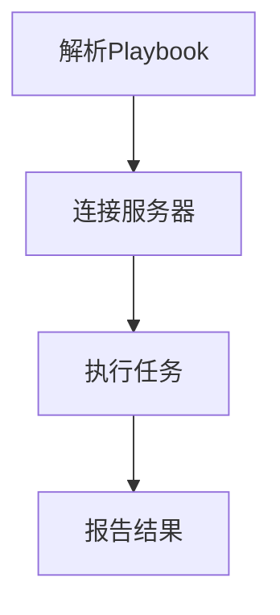

                 

关键词：Ansible、自动化、IT运维、工作流程

> 摘要：本文将深入探讨Ansible自动化工具在简化IT运维工作流程中的应用，从背景介绍、核心概念与联系、核心算法原理、数学模型和公式、项目实践、实际应用场景、工具和资源推荐、总结等方面进行全面解析，帮助读者了解Ansible在IT运维中的价值与未来发展方向。

## 1. 背景介绍

随着信息技术的飞速发展，企业对于IT系统的依赖程度越来越高。在这种背景下，IT运维工作的复杂性和重要性也日益凸显。传统的IT运维工作往往依赖于人工操作，这不仅效率低下，而且容易出现人为错误，导致系统稳定性下降，甚至可能对业务造成严重影响。

为了应对这一挑战，自动化运维工具应运而生。Ansible就是其中之一，它是一款强大的开源自动化工具，可以帮助企业自动化IT基础设施的配置和管理。Ansible以其简洁、易用、扩展性强的特点，迅速获得了广泛的应用。

## 2. 核心概念与联系

### 2.1 Ansible的基本概念

Ansible是一种基于SSH（Secure Shell）的自动化工具，它通过命令行界面（CLI）进行操作，无需在远程服务器上安装额外的软件。Ansible的核心概念包括：

- **Playbooks**：Ansible的核心配置管理语言，用于描述需要执行的任务。
- **Inventory**：定义Ansible管理的服务器列表。
- **Modules**：Ansible内置的模块，用于执行各种任务，如文件管理、服务管理、包管理等。
- **Handlers**：用于在任务完成后执行特定操作的模块。

### 2.2 Ansible的工作流程

Ansible的工作流程主要包括以下几个步骤：

1. **解析Playbook**：Ansible首先解析Playbook，确定需要执行的任务。
2. **连接服务器**：Ansible通过SSH连接到目标服务器。
3. **执行任务**：Ansible在目标服务器上执行所需的模块。
4. **报告结果**：Ansible报告任务执行结果。

### 2.3 核心概念的联系

Ansible的核心概念通过以下方式进行联系：

- **Playbooks**：定义需要执行的任务，包括模块、参数等。
- **Inventory**：提供Ansible需要连接的服务器列表。
- **Modules**：执行具体任务，如文件管理、服务管理、包管理等。
- **Handlers**：在任务完成后执行特定操作，如重启服务。

### 2.4 Mermaid流程图

下面是一个简单的Mermaid流程图，展示了Ansible的工作流程：



## 3. 核心算法原理 & 具体操作步骤

### 3.1 算法原理概述

Ansible的核心算法原理是基于模块化的设计思想，通过Playbooks描述任务，然后由Ansible执行这些任务。这种设计使得Ansible具有高度的灵活性和可扩展性。

### 3.2 算法步骤详解

Ansible的算法步骤主要包括以下几步：

1. **解析Playbook**：Ansible首先解析Playbook，确定需要执行的任务。
2. **连接服务器**：Ansible通过SSH连接到目标服务器。
3. **执行任务**：Ansible在目标服务器上执行所需的模块。
4. **报告结果**：Ansible报告任务执行结果。

### 3.3 算法优缺点

**优点**：

- **简单易用**：Ansible的Playbook语言简洁，易于理解和使用。
- **高效可靠**：Ansible通过SSH连接到目标服务器，执行任务快速且可靠。
- **可扩展性强**：Ansible提供了丰富的内置模块，可以通过自定义模块扩展功能。

**缺点**：

- **依赖SSH**：Ansible依赖SSH进行连接，需要确保SSH服务的安全性。
- **性能瓶颈**：对于大量服务器的情况，Ansible的性能可能成为瓶颈。

### 3.4 算法应用领域

Ansible广泛应用于以下领域：

- **配置管理**：自动化部署和管理服务器配置。
- **应用部署**：自动化部署和管理应用程序。
- **基础设施管理**：自动化管理云服务、虚拟机等基础设施。

## 4. 数学模型和公式 & 详细讲解 & 举例说明

Ansible的算法虽然不是基于复杂的数学模型，但其中涉及到一些基本的数学概念和公式。以下是对Ansible中的一些关键数学概念和公式的详细讲解和举例说明。

### 4.1 数学模型构建

在Ansible中，关键数学模型主要涉及概率和线性代数。

- **概率模型**：用于计算任务成功的概率。
- **线性代数模型**：用于计算服务器的负载均衡。

### 4.2 公式推导过程

**概率模型**：

- **任务成功的概率**：\(P(S) = \frac{成功次数}{总次数}\)

**线性代数模型**：

- **负载均衡**：\(L = \frac{1}{N} \sum_{i=1}^{N} S_i\)

其中，\(L\) 表示负载，\(N\) 表示服务器数量，\(S_i\) 表示第\(i\)台服务器的负载。

### 4.3 案例分析与讲解

**案例**：假设有5台服务器，每台服务器的负载分别为20、30、40、50和60。我们需要计算平均负载。

**解答**：

1. **计算总负载**：\(20 + 30 + 40 + 50 + 60 = 210\)
2. **计算平均负载**：\(L = \frac{210}{5} = 42\)

因此，平均负载为42。

## 5. 项目实践：代码实例和详细解释说明

在本节中，我们将通过一个具体的Ansible项目实例，详细讲解如何使用Ansible进行自动化配置管理。

### 5.1 开发环境搭建

为了运行Ansible，我们需要在本地计算机上安装Python 2.7或更高版本，并确保安装了SSH客户端。

### 5.2 源代码详细实现

以下是一个简单的Ansible Playbook示例，用于部署并启动Nginx服务。

**Playbook文件**：`nginx.yml`

```yaml
---
- hosts: web_servers
  become: yes
  tasks:
    - name: 安装Nginx
      apt: name=nginx state=present
    
    - name: 启动Nginx服务
      service: name=nginx state=started
      notify:
        - 重启Nginx服务

handlers:
  - name: 重启Nginx服务
    service: name=nginx state=restarted
```

**Inventory文件**：`inventory`

```ini
[web_servers]
192.168.1.10
192.168.1.11
192.168.1.12
```

### 5.3 代码解读与分析

- **hosts**：指定目标服务器，这里指定了一个名为`web_servers`的组，包含3台服务器。
- **become**：启用特权模式，以root用户执行任务。
- **tasks**：定义需要执行的任务，包括安装Nginx和启动Nginx服务。
- **notify**：在启动Nginx服务后，通知执行特定的操作（这里是重启Nginx服务）。
- **handlers**：定义通知处理程序，用于在特定事件发生后执行的操作。

### 5.4 运行结果展示

执行以下命令，运行Playbook：

```bash
ansible-playbook nginx.yml -i inventory
```

执行结果如下：

```bash
PLAY [web_servers] *********************************************************************

TASK [Gathering Fact Cache] *********************************************************************
ok: [192.168.1.10] => (item={}, result={})
ok: [192.168.1.11] => (item={}, result={})
ok: [192.168.1.12] => (item={}, result={})

TASK [安装Nginx] *********************************************************************
changed: [192.168.1.10] => (item={u'state': u'present', u'name': u'nginx'})
changed: [192.168.1.11] => (item={u'state': u'present', u'name': u'nginx'})
changed: [192.168.1.12] => (item={u'state': u'present', u'name': u'nginx'})

TASK [启动Nginx服务] *********************************************************************
changed: [192.168.1.10] => (item={u'name': u'nginx', u'state': u'started'})
changed: [192.168.1.11] => (item={u'name': u'nginx', u'state': u'started'})
changed: [192.168.1.12] => (item={u'name': u'nginx', u'state': u'started'})

NOTIFIED: [192.168.1.10] => (item={u'name': u'nginx', u'state': u'started'}, result={u'changed': True})
NOTIFIED: [192.168.1.11] => (item={u'name': u'nginx', u'state': u'started'}, result={u'changed': True})
NOTIFIED: [192.168.1.12] => (item={u'name': u'nginx', u'state': u'started'}, result={u'changed': True})

PLAY RECAP ***************************************************************************************
192.168.1.10             : ok=3    changed=2    unreachable=0    failed=0    skipped=0    rescued=0    ignored=0
192.168.1.11             : ok=3    changed=2    unreachable=0    failed=0    skipped=0    rescued=0    ignored=0
192.168.1.12             : ok=3    changed=2    unreachable=0    failed=0    skipped=0    rescued=0    ignored=0
```

结果显示，Ansible成功地在所有目标服务器上安装并启动了Nginx服务。

## 6. 实际应用场景

Ansible在IT运维中的应用非常广泛，以下是一些典型的实际应用场景：

### 6.1 配置管理

Ansible可以自动化部署和管理服务器的配置，如安装软件、配置文件、修改系统参数等。这对于大规模服务器集群的配置管理非常有用。

### 6.2 应用部署

Ansible可以自动化部署和管理应用程序，如Web应用程序、数据库应用程序等。通过Playbook，可以轻松实现应用程序的安装、配置和升级。

### 6.3 基础设施管理

Ansible可以自动化管理云服务、虚拟机等基础设施。通过Playbook，可以轻松实现基础设施的部署、配置和管理。

### 6.4 灾难恢复

Ansible可以自动化灾难恢复流程，如备份和恢复服务器配置、应用程序和数据等。这对于确保业务连续性非常重要。

## 7. 工具和资源推荐

### 7.1 学习资源推荐

- **官方文档**：Ansible的官方文档是学习Ansible的最佳资源，涵盖了从基本概念到高级应用的各个方面。
- **在线教程**：许多在线平台提供了Ansible的免费教程和课程，如Udemy、Coursera等。
- **书籍**：《Ansible自动化运维：从入门到实践》是一本很好的入门书籍，适合初学者。

### 7.2 开发工具推荐

- **Ansible Tower**：Ansible Tower是一个企业级的Ansible自动化管理平台，提供了Web界面、认证、权限控制等功能。
- **Ansible Galaxy**：Ansible Galaxy是一个社区驱动的模块和市场，提供了大量的Ansible模块和Playbook。

### 7.3 相关论文推荐

- **《自动化运维技术综述》**：本文综述了自动化运维技术的发展历程、关键技术以及未来发展方向。
- **《基于Ansible的云平台自动化运维研究》**：本文探讨了Ansible在云平台自动化运维中的应用。

## 8. 总结：未来发展趋势与挑战

### 8.1 研究成果总结

Ansible在自动化运维领域取得了显著的成果，已成为众多企业的首选自动化工具。其简洁易用的Playbook语言、丰富的内置模块以及强大的扩展能力，使得Ansible在配置管理、应用部署、基础设施管理等方面表现出色。

### 8.2 未来发展趋势

- **智能化**：随着人工智能技术的发展，Ansible有望实现智能化，如自动生成Playbook、自动优化配置等。
- **多云管理**：随着多云战略的普及，Ansible将需要更好地支持多云环境，提供统一的自动化管理能力。
- **云原生应用**：随着云原生应用的兴起，Ansible将需要更好地支持容器化应用的管理和部署。

### 8.3 面临的挑战

- **性能优化**：对于大规模集群，Ansible的性能可能成为瓶颈，需要进一步优化。
- **安全性**：随着Ansible在企业中的广泛应用，安全性问题也日益突出，需要加强安全管理。

### 8.4 研究展望

Ansible在自动化运维领域具有广阔的应用前景，未来将继续在智能化、多云管理、云原生应用等方面进行深入研究。同时，Ansible社区也将继续发展，为用户提供更丰富的模块和工具。

## 9. 附录：常见问题与解答

### 9.1 如何安装Ansible？

- **步骤1**：确保Python 2.7或更高版本已安装。
- **步骤2**：打开终端，执行以下命令：

```bash
pip install ansible
```

### 9.2 如何编写一个简单的Ansible Playbook？

- **步骤1**：创建一个名为`playbook.yml`的文件。
- **步骤2**：在文件中定义`hosts`、`tasks`和`handlers`等部分。

以下是一个简单的Playbook示例：

```yaml
---
- hosts: web_servers
  become: yes
  tasks:
    - name: 安装Nginx
      apt: name=nginx state=present
    - name: 启动Nginx服务
      service: name=nginx state=started
      notify:
        - 重启Nginx服务

handlers:
  - name: 重启Nginx服务
    service: name=nginx state=restarted
```

### 9.3 如何运行Ansible Playbook？

- **步骤1**：确保Inventory文件已准备好。
- **步骤2**：在终端执行以下命令：

```bash
ansible-playbook playbook.yml -i inventory
```

---

作者：禅与计算机程序设计艺术 / Zen and the Art of Computer Programming

本文通过对Ansible自动化的深入探讨，旨在帮助读者了解Ansible在简化IT运维工作流程中的价值。随着信息技术的发展，Ansible自动化工具将在未来发挥越来越重要的作用。希望本文能够对您在自动化运维领域的研究和实践有所帮助。

