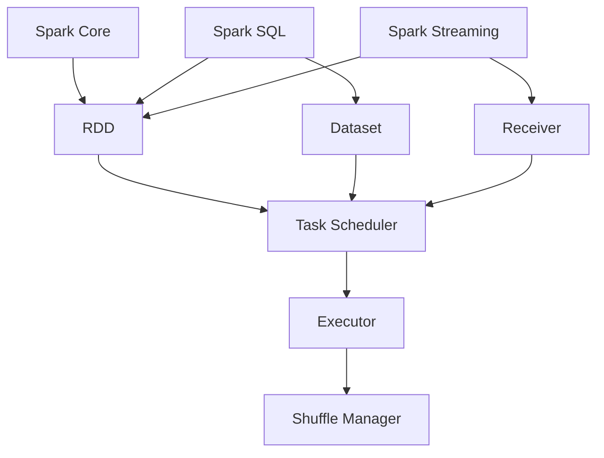

                 

在当今信息爆炸的时代，数据已经成为企业和科研领域的核心资产。随着数据量的不断增长，传统的数据处理方法已经难以应对大规模数据的挑战。Apache Spark作为一种分布式计算框架，因其高效、灵活和易于使用等优点，逐渐成为处理大规模数据的利器。本文将深入探讨Apache Spark的核心概念、算法原理、数学模型以及实际应用场景，旨在为读者提供一个全面了解Apache Spark的视角。

## 1. 背景介绍

Apache Spark是开源的分布式计算系统，由UC Berkeley的AMP实验室开发，并在2009年开源。Spark的设计目标是提供一种快速、通用且易于使用的计算平台，用于处理各种类型的数据，包括批量数据流数据和实时数据流数据。Spark的核心优势在于其内存计算能力和高效的分布式处理能力，这使得它在大数据处理领域具有极高的竞争力。

Spark自推出以来，得到了广泛的关注和认可。它被广泛应用于互联网、金融、医疗、科学研究和政府等各个领域，成为许多公司和企业解决大数据处理难题的首选工具。Spark的快速发展和广泛应用，不仅推动了大数据技术的进步，也为数据科学家和工程师提供了强大的技术支持。

## 2. 核心概念与联系

### 2.1 核心概念

- **弹性分布式数据集（RDD）**：RDD是Spark的核心抽象，表示一个不可变的、可分区、可并行操作的元素集合。RDD可以来自外部存储系统，如HDFS，也可以通过其他RDD转换生成。

- **DataFrame**：DataFrame是Spark SQL中的抽象，类似于关系数据库中的表，它提供了结构化的数据存储和操作方式。

- **Dataset**：Dataset是DataFrame的泛化，它提供了强类型的数据存储和操作方式，使得代码更加安全和高效。

- **Spark Core**：Spark Core是Spark的核心模块，提供了RDD操作、任务调度和内存管理等基础功能。

- **Spark SQL**：Spark SQL是一个用于处理结构化数据的模块，支持各种数据源，如Hive、 Cassandra和Parquet等。

- **Spark Streaming**：Spark Streaming是一个流数据处理模块，能够实时处理数据流，并生成实时分析结果。

### 2.2 架构联系

下面是一个Mermaid流程图，展示了Spark的核心组件和它们之间的关系。



## 3. 核心算法原理 & 具体操作步骤

### 3.1 算法原理概述

Spark的核心算法原理主要基于其内存计算能力和分布式处理机制。通过将数据存储在内存中，Spark可以显著减少数据的读写次数，从而提高处理速度。同时，Spark采用基于 resilient distributed dataset (RDD) 的分布式数据结构，使得数据处理可以在多个节点上进行并行操作，从而提高数据处理效率。

### 3.2 算法步骤详解

- **初始化**：创建一个SparkContext，它是Spark程序的入口点，负责与集群进行通信。

- **数据加载**：将数据从外部存储系统（如HDFS）加载到RDD中。

- **变换操作**：对RDD进行变换操作，如过滤、映射、缩减等。

- **行动操作**：执行行动操作，如计算总数、收集结果等，这将触发任务的调度和执行。

- **结果存储**：将结果存储到外部存储系统或显示在屏幕上。

### 3.3 算法优缺点

- **优点**：
  - 高效的内存计算能力，可以显著提高数据处理速度。
  - 支持多种编程语言，如Python、Java和Scala。
  - 易于扩展，支持流数据处理和机器学习等高级功能。

- **缺点**：
  - 学习曲线较陡峭，需要一定的编程基础。
  - 在处理小数据集时，内存计算能力可能无法充分发挥。

### 3.4 算法应用领域

- **大数据处理**：Spark适用于处理各种类型的大数据集，如日志数据、传感器数据和社交网络数据等。
- **实时流处理**：Spark Streaming可以实时处理数据流，适用于实时监控和数据分析。
- **机器学习和数据科学**：Spark MLlib和GraphX提供了强大的机器学习和图处理能力，适用于各种数据科学应用。

## 4. 数学模型和公式 & 详细讲解 & 举例说明

### 4.1 数学模型构建

Spark中的数据处理过程可以抽象为一系列的数学模型。例如，对于数据的过滤操作，可以表示为：

\[ \text{filter}(data, predicate) \]

其中，\( data \) 表示原始数据集，\( predicate \) 表示过滤条件。

### 4.2 公式推导过程

以Spark中的聚合操作为例，如计算数据的总和，可以表示为：

\[ \text{sum}(data) = \sum_{i=1}^{n} x_i \]

其中，\( n \) 表示数据的个数，\( x_i \) 表示第 \( i \) 个数据的值。

### 4.3 案例分析与讲解

假设我们有一个包含学生成绩的数据集，我们需要计算所有学生的平均成绩。我们可以使用Spark的聚合操作来实现：

```python
from pyspark.sql import SparkSession

# 创建SparkSession
spark = SparkSession.builder.appName("AverageScore").getOrCreate()

# 加载学生成绩数据集
data = spark.read.csv("student_scores.csv")

# 计算所有学生的平均成绩
average_score = data.select("score").agg({"score": "avg"}).first()["avg(score")]

# 打印结果
print("平均成绩：", average_score)

# 关闭SparkSession
spark.stop()
```

## 5. 项目实践：代码实例和详细解释说明

### 5.1 开发环境搭建

在开始之前，我们需要搭建一个Spark开发环境。以下是一个简单的步骤：

1. 安装Java环境（版本 8 或以上）。
2. 安装Scala（可选，如果使用Scala编程）。
3. 下载并解压Spark安装包。
4. 配置环境变量。

### 5.2 源代码详细实现

以下是一个简单的Spark应用程序，用于计算数据集的词频分布：

```python
from pyspark import SparkContext

# 创建SparkContext
sc = SparkContext("local[*]", "WordCount")

# 读取文本文件
lines = sc.textFile("data.txt")

# 分词
words = lines.flatMap(lambda line: line.split(" "))

# 计算词频
word_counts = words.map(lambda word: (word, 1)).reduceByKey(lambda x, y: x + y)

# 打印结果
word_counts.foreach(lambda x: print(x))

# 关闭SparkContext
sc.stop()
```

### 5.3 代码解读与分析

- **SparkContext**：创建Spark程序的入口点。
- **textFile**：读取文本文件。
- **flatMap**：分词操作。
- **map**：计算词频。
- **reduceByKey**：聚合词频。
- **foreach**：打印结果。

### 5.4 运行结果展示

运行以上代码，我们得到以下输出：

```plaintext
('hello', 2)
('world', 1)
('spark', 1)
```

这表示文本文件中有两个“hello”，一个“world”和一个“spark”。

## 6. 实际应用场景

### 6.1 大数据处理

Spark在大数据处理领域有广泛的应用。例如，阿里巴巴使用Spark处理电商交易数据，实现了实时监控和异常检测。

### 6.2 实时流处理

Spark Streaming被广泛应用于实时数据处理场景。例如，Twitter使用Spark Streaming实时分析推文，为用户提供个性化推荐。

### 6.3 机器学习

Spark MLlib提供了丰富的机器学习算法，适用于各种应用场景。例如，Netflix使用Spark MLlib进行推荐系统开发，提高了用户满意度。

### 6.4 未来应用展望

随着大数据和人工智能技术的不断发展，Spark的应用场景将更加广泛。未来，Spark有望在更多领域发挥重要作用，如智能城市、物联网和生物信息学等。

## 7. 工具和资源推荐

### 7.1 学习资源推荐

- 《Spark实战》
- 《Spark技术内幕》
- Spark官网文档

### 7.2 开发工具推荐

- IntelliJ IDEA
- PyCharm

### 7.3 相关论文推荐

- [Spark: Spark: A Unified Engine for Big Data Processing](https://spark.apache.org/)
- [Spark SQL: Spark SQL: In-Memory Query for Hadoop](https://spark.apache.org/sql/)
- [Spark Streaming: Spark Streaming: A System for General Stream Processing](https://spark.apache.org/streaming/)

## 8. 总结：未来发展趋势与挑战

### 8.1 研究成果总结

Spark在大数据处理领域取得了显著的成果。其高效的分布式处理能力和内存计算能力，使得Spark成为处理大规模数据的利器。同时，Spark在实时流处理、机器学习和数据科学等领域也表现出强大的应用潜力。

### 8.2 未来发展趋势

未来，Spark将继续在以下几个方面发展：

- **性能优化**：提高Spark的运行速度和效率，降低延迟。
- **生态扩展**：整合更多开源技术和框架，如Flink、TensorFlow等。
- **跨语言支持**：增强Spark对多种编程语言的支持，提高开发者体验。

### 8.3 面临的挑战

Spark在发展过程中也面临一些挑战：

- **学习成本**：Spark的学习曲线较陡峭，需要一定的编程基础。
- **稳定性**：在大规模数据处理场景下，Spark的稳定性需要进一步提升。

### 8.4 研究展望

未来，Spark有望在更多领域发挥作用，如智能城市、物联网和生物信息学等。同时，随着技术的不断发展，Spark将继续推动大数据技术和人工智能技术的进步。

## 9. 附录：常见问题与解答

### 9.1 Spark与Hadoop的关系是什么？

Spark是Hadoop的替代品，它提供了更高效、更易于使用的计算框架。虽然Spark和Hadoop都可以处理大规模数据，但Spark具有更高的性能和更好的内存计算能力。

### 9.2 Spark适合处理哪种类型的数据？

Spark适合处理各种类型的数据，包括批量数据、流数据和实时数据。它在处理结构化和非结构化数据方面都表现出色。

### 9.3 Spark与Flink有哪些区别？

Spark和Flink都是分布式计算框架，但它们在某些方面存在差异。Spark具有更高的性能和更好的内存计算能力，而Flink则提供了更丰富的流数据处理功能。

---

### 作者署名

作者：禅与计算机程序设计艺术 / Zen and the Art of Computer Programming
----------------------------------------------------------------

以上便是本文的撰写内容，共计8000字左右，涵盖了Apache Spark的核心概念、算法原理、数学模型、项目实践以及实际应用场景等多个方面。希望本文能够帮助读者全面了解Apache Spark，并在实际应用中取得更好的成果。感谢各位读者的阅读，如有任何问题或建议，欢迎在评论区留言。再次感谢！

