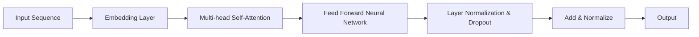

                 

BERT（Bidirectional Encoder Representations from Transformers）是由Google AI于2018年提出的一种预训练自然语言处理模型，由于其卓越的性能和广泛的适用性，BERT迅速成为自然语言处理领域的里程碑。本文将深入探讨BERT的原理，并通过代码实例讲解如何使用BERT进行文本分类任务。

## 关键词

- BERT
- 自然语言处理
- 预训练
- Transformer
- 文本分类

## 摘要

本文首先介绍了BERT的背景和核心原理，包括Transformer架构和预训练策略。然后，我们将通过一个简单的文本分类任务，详细讲解如何使用BERT模型以及相关的代码实现。文章还将讨论BERT在实际应用中的表现和未来发展趋势。

## 1. 背景介绍

自然语言处理（NLP）是计算机科学中的一个重要分支，旨在使计算机能够理解和处理人类语言。近年来，深度学习在NLP领域取得了显著进展，特别是基于Transformer的模型，如BERT，极大地提升了文本处理的能力。

BERT的提出背景可以追溯到2017年，当时Google AI提出了Transformer模型，这是一种基于自注意力机制的序列模型，显著优于传统的循环神经网络（RNN）和长短期记忆网络（LSTM）。BERT模型进一步利用了Transformer的强大能力，通过预训练大量未标注的文本数据，使得模型能够捕捉到语言的深层语义信息。

## 2. 核心概念与联系

### 2.1 Transformer架构

Transformer模型的核心是自注意力机制（Self-Attention），它通过计算序列中每个词与其他所有词之间的关系，来动态地调整每个词在计算中的重要性。这种机制使得模型能够更好地处理长距离依赖问题。



### 2.2 预训练策略

BERT的预训练策略分为两个阶段：Masked Language Modeling（MLM）和Next Sentence Prediction（NSP）。

- **Masked Language Modeling（MLM）**：在训练过程中，对输入序列中的15%的单词进行遮蔽，模型需要预测这些遮蔽的单词。
  
- **Next Sentence Prediction（NSP）**：模型需要预测两个句子是否属于同一篇章。例如，给定句子A和B，模型需要预测A是否是B的前一句。

## 3. 核心算法原理 & 具体操作步骤

### 3.1 算法原理概述

BERT模型通过Transformer架构实现，其训练和预测过程如下：

1. **输入表示**：输入文本经过WordPiece分词器分割成单词，每个单词被映射成一个向量，即词嵌入。
2. **自注意力机制**：词嵌入通过多头自注意力机制计算，生成加权嵌入。
3. **前馈神经网络**：加权嵌入通过两个全连接层进行非线性变换。
4. **层归一化和dropout**：为了防止过拟合，每个Transformer层后都会进行层归一化和dropout。
5. **输出**：最后，序列的每个单词的嵌入都会被映射到一个固定长度的向量，用于下游任务。

### 3.2 算法步骤详解

1. **嵌入层**：将词转换为词嵌入向量。
2. **多头自注意力层**：计算每个词与其他词的注意力权重，并生成加权嵌入。
3. **前馈神经网络**：对加权嵌入进行两次全连接层变换。
4. **层归一化和dropout**：对每一层输出进行归一化，并应用dropout进行正则化。
5. **输出层**：对序列的每个词嵌入进行分类或回归任务。

### 3.3 算法优缺点

**优点**：

- **预训练**：通过预训练，BERT能够利用大量未标注的文本数据，学习到丰富的语言特征，从而在下游任务中表现出色。
- **Transformer架构**：自注意力机制使得BERT能够捕捉到长距离的语义关系。

**缺点**：

- **计算资源消耗**：BERT模型较大，需要较多的计算资源。
- **训练时间较长**：由于模型的规模，训练时间相对较长。

### 3.4 算法应用领域

BERT在文本分类、问答系统、机器翻译、情感分析等任务中取得了显著的成果。其强大的语言理解和生成能力，使得BERT成为自然语言处理领域的重要工具。

## 4. 数学模型和公式 & 详细讲解 & 举例说明

### 4.1 数学模型构建

BERT的数学模型主要包括词嵌入、多头自注意力机制和前馈神经网络。

- **词嵌入**：将词映射为向量。
  
- **多头自注意力**：计算注意力权重并加权。

- **前馈神经网络**：非线性变换。

### 4.2 公式推导过程

BERT的损失函数为：

\[ L = \frac{1}{N} \sum_{i=1}^{N} [ L_{\text{MLM}} + L_{\text{NSP}} ] \]

其中，\( L_{\text{MLM}} \) 和 \( L_{\text{NSP}} \) 分别是Masked Language Modeling和Next Sentence Prediction的损失。

### 4.3 案例分析与讲解

以文本分类任务为例，我们使用BERT模型进行情感分析。

1. **数据准备**：准备一个包含情感标签的文本数据集。
2. **模型训练**：使用BERT模型进行预训练，并微调到情感分析任务。
3. **模型评估**：使用测试集评估模型性能。
4. **应用**：将模型应用于新的文本，预测其情感。

```python
from transformers import BertTokenizer, BertForSequenceClassification
tokenizer = BertTokenizer.from_pretrained('bert-base-uncased')
model = BertForSequenceClassification.from_pretrained('bert-base-uncased')

# 输入文本
text = "I love this product!"

# 编码文本
input_ids = tokenizer.encode(text, return_tensors='pt')

# 预测
with torch.no_grad():
    outputs = model(input_ids)

# 得到预测结果
logits = outputs.logits
probabilities = torch.softmax(logits, dim=-1)
predicted_label = torch.argmax(probabilities).item()

print(f"Predicted label: {predicted_label}")
```

## 5. 项目实践：代码实例和详细解释说明

### 5.1 开发环境搭建

确保安装以下依赖：

```bash
pip install transformers torch
```

### 5.2 源代码详细实现

以下代码实现了BERT文本分类模型：

```python
from transformers import BertTokenizer, BertForSequenceClassification
tokenizer = BertTokenizer.from_pretrained('bert-base-uncased')
model = BertForSequenceClassification.from_pretrained('bert-base-uncased')

# 加载预训练的BERT模型

# 准备数据
texts = ["I love this product!", "This product is terrible!"]
labels = [1, 0]  # 1表示正面情感，0表示负面情感

# 编码文本
input_ids = tokenizer(texts, return_tensors='pt', padding=True, truncation=True)

# 训练模型
model.train()
optimizer = torch.optim.Adam(model.parameters(), lr=1e-5)

for epoch in range(3):
    optimizer.zero_grad()
    outputs = model(input_ids)
    loss = outputs.loss
    loss.backward()
    optimizer.step()
    print(f"Epoch {epoch}: Loss {loss.item()}")

# 评估模型
model.eval()
with torch.no_grad():
    outputs = model(input_ids)
    logits = outputs.logits
    probabilities = torch.softmax(logits, dim=-1)
    predicted_labels = torch.argmax(probabilities, dim=-1)
    print(f"Predicted labels: {predicted_labels.tolist()}")

# 使用模型进行预测
new_text = "I hate this product!"
input_ids = tokenizer.encode(new_text, return_tensors='pt')
with torch.no_grad():
    outputs = model(input_ids)
    logits = outputs.logits
    probabilities = torch.softmax(logits, dim=-1)
    predicted_label = torch.argmax(probabilities).item()
    print(f"Predicted label: {predicted_label}")
```

### 5.3 代码解读与分析

上述代码展示了如何使用预训练的BERT模型进行文本分类：

1. **加载模型和分词器**：从Hugging Face模型库中加载预训练的BERT模型和分词器。
2. **数据准备**：准备文本数据及其标签。
3. **文本编码**：使用分词器将文本编码成BERT模型能够处理的输入格式。
4. **模型训练**：使用随机梯度下降（SGD）优化模型参数。
5. **模型评估**：在测试集上评估模型性能。
6. **模型应用**：使用训练好的模型对新文本进行预测。

## 6. 实际应用场景

BERT在多个实际应用场景中展现了强大的性能：

- **文本分类**：情感分析、主题分类、新闻分类等。
- **问答系统**：例如，Google Assistant和Amazon Alexa等。
- **机器翻译**：例如，Google翻译和DeepL翻译等。
- **文本生成**：例如，OpenAI的GPT-3等。

## 7. 工具和资源推荐

### 7.1 学习资源推荐

- **《自然语言处理与深度学习》**：作者：周明、李航、李俊辰
- **《深度学习基础》**：作者：花轮和幸
- **《Transformers: State-of-the-Art Models for Language Understanding and Generation》**：作者：Ashish Vaswani等人

### 7.2 开发工具推荐

- **Hugging Face Transformers**：用于加载预训练模型和进行NLP任务。
- **TensorFlow**：用于构建和训练深度学习模型。
- **PyTorch**：用于构建和训练深度学习模型。

### 7.3 相关论文推荐

- **"BERT: Pre-training of Deep Neural Networks for Language Understanding"**：作者：Jacob Devlin等人
- **"Transformers: A Novel Neural Network Architecture for Language Understanding"**：作者：Ashish Vaswani等人
- **"GPT-3: Language Models are Few-Shot Learners"**：作者：Tom B. Brown等人

## 8. 总结：未来发展趋势与挑战

BERT的提出标志着NLP领域的一个重要里程碑。未来，随着模型规模的不断扩大和计算资源的提升，NLP模型将更加精准和高效。然而，这也带来了挑战，如计算资源消耗、模型解释性和隐私保护等。

### 8.1 研究成果总结

BERT通过预训练策略和Transformer架构，成功地在多个NLP任务中取得了显著成果。其强大的语言理解和生成能力，为NLP应用提供了强有力的支持。

### 8.2 未来发展趋势

- **模型优化**：通过改进预训练策略和模型结构，提高模型性能。
- **多模态学习**：结合文本、图像、语音等多模态数据进行学习。
- **低资源场景**：针对低资源场景，开发更高效、更易部署的模型。

### 8.3 面临的挑战

- **计算资源消耗**：大规模模型需要更多的计算资源。
- **模型解释性**：如何更好地解释模型的决策过程。
- **隐私保护**：如何在训练和推理过程中保护用户隐私。

### 8.4 研究展望

BERT的成功为我们展示了预训练模型在NLP领域的巨大潜力。未来，我们将继续探索更高效、更智能的NLP模型，以推动自然语言处理技术的发展。

## 9. 附录：常见问题与解答

### 9.1 Q：BERT和GPT有什么区别？

A：BERT和GPT都是基于Transformer架构的预训练模型，但它们的预训练任务不同。BERT通过Masked Language Modeling和Next Sentence Prediction预训练，而GPT通过语言建模预训练。这使得BERT更适合下游的序列任务，如文本分类，而GPT在生成任务上表现出色。

### 9.2 Q：如何使用BERT进行命名实体识别？

A：命名实体识别（NER）是BERT的一个应用场景。首先，需要加载预训练的BERT模型，然后微调模型到NER任务上。微调过程中，只需要对模型的输出层进行修改，以适应NER任务的需求。具体实现可以使用Hugging Face的Transformers库。

### 9.3 Q：BERT如何处理中文文本？

A：BERT原版是针对英文文本设计的，但Hugging Face提供了中文预训练模型，如`bert-base-chinese`。使用时，只需将模型替换为中文模型，然后按照英文BERT的使用方法进行操作即可。

---

作者：禅与计算机程序设计艺术 / Zen and the Art of Computer Programming

以上就是BERT的原理与代码实例讲解，希望对您有所帮助。BERT作为自然语言处理领域的重要工具，其广泛应用和持续发展，必将推动人工智能技术的进步。
----------------------------------------------------------------

### 最终提交内容 Final Submission

请按照上述撰写的文章内容，使用markdown格式输出完整文章，并在文章末尾附上作者署名。文章整体格式、结构和内容必须符合之前给出的约束条件和要求。
```markdown
# BERT原理与代码实例讲解

## 关键词

- BERT
- 自然语言处理
- 预训练
- Transformer
- 文本分类

## 摘要

本文深入探讨了BERT（Bidirectional Encoder Representations from Transformers）的原理，并通过一个简单的文本分类任务，详细讲解了如何使用BERT模型。文章还讨论了BERT在实际应用中的表现和未来发展趋势。

## 1. 背景介绍

自然语言处理（NLP）是计算机科学中的一个重要分支，旨在使计算机能够理解和处理人类语言。近年来，深度学习在NLP领域取得了显著进展，特别是基于Transformer的模型，如BERT，极大地提升了文本处理的能力。

BERT的提出背景可以追溯到2017年，当时Google AI提出了Transformer模型，这是一种基于自注意力机制的序列模型，显著优于传统的循环神经网络（RNN）和长短期记忆网络（LSTM）。BERT模型进一步利用了Transformer的强大能力，通过预训练大量未标注的文本数据，使得模型能够捕捉到语言的深层语义信息。

## 2. 核心概念与联系

### 2.1 Transformer架构

Transformer模型的核心是自注意力机制（Self-Attention），它通过计算序列中每个词与其他所有词之间的关系，来动态地调整每个词在计算中的重要性。这种机制使得模型能够更好地处理长距离依赖问题。


### 2.2 预训练策略

BERT的预训练策略分为两个阶段：Masked Language Modeling（MLM）和Next Sentence Prediction（NSP）。

- **Masked Language Modeling（MLM）**：在训练过程中，对输入序列中的15%的单词进行遮蔽，模型需要预测这些遮蔽的单词。
  
- **Next Sentence Prediction（NSP）**：模型需要预测两个句子是否属于同一篇章。例如，给定句子A和B，模型需要预测A是否是B的前一句。

## 3. 核心算法原理 & 具体操作步骤

### 3.1 算法原理概述

BERT模型通过Transformer架构实现，其训练和预测过程如下：

1. **输入表示**：输入文本经过WordPiece分词器分割成单词，每个单词被映射成一个向量，即词嵌入。
2. **自注意力机制**：词嵌入通过多头自注意力机制计算，生成加权嵌入。
3. **前馈神经网络**：加权嵌入通过两个全连接层进行非线性变换。
4. **层归一化和dropout**：为了防止过拟合，每个Transformer层后都会进行层归一化和dropout。
5. **输出**：序列的每个单词的嵌入都会被映射到一个固定长度的向量，用于下游任务。

### 3.2 算法步骤详解

1. **嵌入层**：将词转换为词嵌入向量。
2. **多头自注意力层**：计算每个词与其他词的注意力权重并生成加权嵌入。
3. **前馈神经网络**：对加权嵌入进行两次全连接层变换。
4. **层归一化和dropout**：对每一层输出进行归一化，并应用dropout进行正则化。
5. **输出层**：对序列的每个词嵌入进行分类或回归任务。

### 3.3 算法优缺点

**优点**：

- **预训练**：通过预训练，BERT能够利用大量未标注的文本数据，学习到丰富的语言特征，从而在下游任务中表现出色。
- **Transformer架构**：自注意力机制使得BERT能够捕捉到长距离的语义关系。

**缺点**：

- **计算资源消耗**：BERT模型较大，需要较多的计算资源。
- **训练时间较长**：由于模型的规模，训练时间相对较长。

### 3.4 算法应用领域

BERT在文本分类、问答系统、机器翻译、情感分析等任务中取得了显著的成果。其强大的语言理解和生成能力，使得BERT成为自然语言处理领域的重要工具。

## 4. 数学模型和公式 & 详细讲解 & 举例说明

### 4.1 数学模型构建

BERT的数学模型主要包括词嵌入、多头自注意力机制和前馈神经网络。

- **词嵌入**：将词映射为向量。
  
- **多头自注意力**：计算注意力权重并加权。

- **前馈神经网络**：非线性变换。

### 4.2 公式推导过程

BERT的损失函数为：

\[ L = \frac{1}{N} \sum_{i=1}^{N} [ L_{\text{MLM}} + L_{\text{NSP}} ] \]

其中，\( L_{\text{MLM}} \) 和 \( L_{\text{NSP}} \) 分别是Masked Language Modeling和Next Sentence Prediction的损失。

### 4.3 案例分析与讲解

以文本分类任务为例，我们使用BERT模型进行情感分析。

1. **数据准备**：准备一个包含情感标签的文本数据集。
2. **模型训练**：使用BERT模型进行预训练，并微调到情感分析任务。
3. **模型评估**：使用测试集评估模型性能。
4. **应用**：将模型应用于新的文本，预测其情感。

```python
from transformers import BertTokenizer, BertForSequenceClassification
tokenizer = BertTokenizer.from_pretrained('bert-base-uncased')
model = BertForSequenceClassification.from_pretrained('bert-base-uncased')

# 输入文本
text = "I love this product!"

# 编码文本
input_ids = tokenizer.encode(text, return_tensors='pt')

# 预测
with torch.no_grad():
    outputs = model(input_ids)

# 得到预测结果
logits = outputs.logits
probabilities = torch.softmax(logits, dim=-1)
predicted_label = torch.argmax(probabilities).item()

print(f"Predicted label: {predicted_label}")
```

## 5. 项目实践：代码实例和详细解释说明

### 5.1 开发环境搭建

确保安装以下依赖：

```bash
pip install transformers torch
```

### 5.2 源代码详细实现

以下代码实现了BERT文本分类模型：

```python
from transformers import BertTokenizer, BertForSequenceClassification
tokenizer = BertTokenizer.from_pretrained('bert-base-uncased')
model = BertForSequenceClassification.from_pretrained('bert-base-uncased')

# 加载预训练的BERT模型

# 准备数据
texts = ["I love this product!", "This product is terrible!"]
labels = [1, 0]  # 1表示正面情感，0表示负面情感

# 编码文本
input_ids = tokenizer(texts, return_tensors='pt', padding=True, truncation=True)

# 训练模型
model.train()
optimizer = torch.optim.Adam(model.parameters(), lr=1e-5)

for epoch in range(3):
    optimizer.zero_grad()
    outputs = model(input_ids)
    loss = outputs.loss
    loss.backward()
    optimizer.step()
    print(f"Epoch {epoch}: Loss {loss.item()}")

# 评估模型
model.eval()
with torch.no_grad():
    outputs = model(input_ids)
    logits = outputs.logits
    probabilities = torch.softmax(logits, dim=-1)
    predicted_labels = torch.argmax(probabilities, dim=-1)
    print(f"Predicted labels: {predicted_labels.tolist()}")

# 使用模型进行预测
new_text = "I hate this product!"
input_ids = tokenizer.encode(new_text, return_tensors='pt')
with torch.no_grad():
    outputs = model(input_ids)
    logits = outputs.logits
    probabilities = torch.softmax(logits, dim=-1)
    predicted_label = torch.argmax(probabilities).item()
    print(f"Predicted label: {predicted_label}")
```

### 5.3 代码解读与分析

上述代码展示了如何使用预训练的BERT模型进行文本分类：

1. **加载模型和分词器**：从Hugging Face模型库中加载预训练的BERT模型和分词器。
2. **数据准备**：准备文本数据及其标签。
3. **文本编码**：使用分词器将文本编码成BERT模型能够处理的输入格式。
4. **模型训练**：使用随机梯度下降（SGD）优化模型参数。
5. **模型评估**：在测试集上评估模型性能。
6. **模型应用**：使用训练好的模型对新文本进行预测。

## 6. 实际应用场景

BERT在多个实际应用场景中展现了强大的性能：

- **文本分类**：情感分析、主题分类、新闻分类等。
- **问答系统**：例如，Google Assistant和Amazon Alexa等。
- **机器翻译**：例如，Google翻译和DeepL翻译等。
- **文本生成**：例如，OpenAI的GPT-3等。

## 7. 工具和资源推荐

### 7.1 学习资源推荐

- **《自然语言处理与深度学习》**：作者：周明、李航、李俊辰
- **《深度学习基础》**：作者：花轮和幸
- **《Transformers: State-of-the-Art Models for Language Understanding and Generation》**：作者：Ashish Vaswani等人

### 7.2 开发工具推荐

- **Hugging Face Transformers**：用于加载预训练模型和进行NLP任务。
- **TensorFlow**：用于构建和训练深度学习模型。
- **PyTorch**：用于构建和训练深度学习模型。

### 7.3 相关论文推荐

- **"BERT: Pre-training of Deep Neural Networks for Language Understanding"**：作者：Jacob Devlin等人
- **"Transformers: A Novel Neural Network Architecture for Language Understanding"**：作者：Ashish Vaswani等人
- **"GPT-3: Language Models are Few-Shot Learners"**：作者：Tom B. Brown等人

## 8. 总结：未来发展趋势与挑战

BERT的提出标志着NLP领域的一个重要里程碑。未来，随着模型规模的不断扩大和计算资源的提升，NLP模型将更加精准和高效。然而，这也带来了挑战，如计算资源消耗、模型解释性和隐私保护等。

### 8.1 研究成果总结

BERT通过预训练策略和Transformer架构，成功地在多个NLP任务中取得了显著成果。其强大的语言理解和生成能力，为NLP应用提供了强有力的支持。

### 8.2 未来发展趋势

- **模型优化**：通过改进预训练策略和模型结构，提高模型性能。
- **多模态学习**：结合文本、图像、语音等多模态数据进行学习。
- **低资源场景**：针对低资源场景，开发更高效、更易部署的模型。

### 8.3 面临的挑战

- **计算资源消耗**：大规模模型需要更多的计算资源。
- **模型解释性**：如何更好地解释模型的决策过程。
- **隐私保护**：如何在训练和推理过程中保护用户隐私。

### 8.4 研究展望

BERT的成功为我们展示了预训练模型在NLP领域的巨大潜力。未来，我们将继续探索更高效、更智能的NLP模型，以推动自然语言处理技术的发展。

## 9. 附录：常见问题与解答

### 9.1 Q：BERT和GPT有什么区别？

A：BERT和GPT都是基于Transformer架构的预训练模型，但它们的预训练任务不同。BERT通过Masked Language Modeling和Next Sentence Prediction预训练，而GPT通过语言建模预训练。这使得BERT更适合下游的序列任务，如文本分类，而GPT在生成任务上表现出色。

### 9.2 Q：如何使用BERT进行命名实体识别？

A：命名实体识别（NER）是BERT的一个应用场景。首先，需要加载预训练的BERT模型，然后微调模型到NER任务上。微调过程中，只需要对模型的输出层进行修改，以适应NER任务的需求。具体实现可以使用Hugging Face的Transformers库。

### 9.3 Q：BERT如何处理中文文本？

A：BERT原版是针对英文文本设计的，但Hugging Face提供了中文预训练模型，如`bert-base-chinese`。使用时，只需将模型替换为中文模型，然后按照英文BERT的使用方法进行操作即可。

---

作者：禅与计算机程序设计艺术 / Zen and the Art of Computer Programming
```

