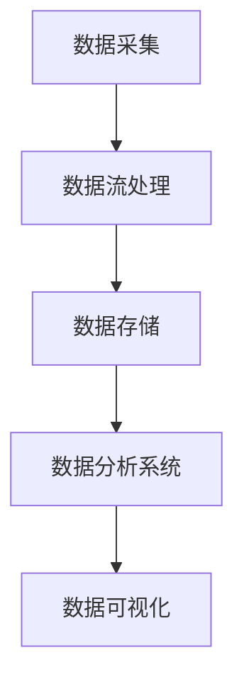

                 

关键词：B站平台、大数据实时监控、数据分析系统、架构设计、算法原理、数学模型、项目实践、应用场景

> 摘要：本文将深入探讨B站平台大数据实时监控及分析系统的构建过程，涵盖从背景介绍、核心概念与联系、核心算法原理与具体操作步骤、数学模型与公式、项目实践、实际应用场景、工具和资源推荐到未来发展趋势与挑战的全面解析。通过这篇文章，读者可以了解到如何利用大数据技术来提升B站平台的运营效率和用户体验。

## 1. 背景介绍

随着互联网的迅速发展和用户数量的激增，B站（哔哩哔哩，以下简称B站）作为国内知名的二次元文化社区，其平台上的数据量呈现爆炸式增长。这不仅包括用户生成的内容（如视频、弹幕等），还涵盖了用户行为数据、服务器日志、广告数据等多个方面。如何有效地收集、处理和分析这些海量数据，成为B站面临的一大挑战。

大数据实时监控及分析系统的构建，对于B站来说具有重要意义。首先，通过实时监控，B站可以及时发现并处理异常情况，保证平台服务的稳定运行。其次，通过对用户数据的深入分析，B站可以更好地理解用户需求，优化内容推荐算法，提升用户体验。此外，大数据分析还能为B站的运营决策提供有力支持，助力平台实现精细化运营。

## 2. 核心概念与联系

为了构建B站平台大数据实时监控及分析系统，我们需要明确以下几个核心概念：

### 2.1 大数据实时监控

大数据实时监控是指对海量数据进行实时捕获、处理和分析，以实现对系统运行状态和用户行为的实时监控。其核心在于高效的数据处理能力和实时的响应速度。

### 2.2 数据分析系统

数据分析系统是对采集到的数据进行存储、处理和分析，以提取有价值的信息和知识。其目标是通过数据分析来提升业务决策的准确性和效率。

### 2.3 数据流处理

数据流处理是一种实时数据处理技术，通过对数据流进行实时分析和处理，可以快速响应业务需求。常见的数据流处理框架包括Apache Kafka、Apache Flink等。

### 2.4 数据存储

数据存储是大数据系统的基础，用于存储海量数据。常见的数据存储技术包括关系型数据库（如MySQL）、NoSQL数据库（如MongoDB、Cassandra）和分布式文件系统（如HDFS）。

### 2.5 数据可视化

数据可视化是将数据分析结果通过图形化的方式呈现，帮助用户更直观地理解和分析数据。常见的数据可视化工具有Tableau、Power BI等。

### 2.6 Mermaid流程图

下面是B站平台大数据实时监控及分析系统的Mermaid流程图：



## 3. 核心算法原理 & 具体操作步骤

### 3.1 算法原理概述

B站平台大数据实时监控及分析系统的核心算法主要包括数据流处理算法、机器学习算法和统计分析算法。下面将分别介绍这些算法的原理。

### 3.2 数据流处理算法

数据流处理算法用于对实时数据流进行高效处理，常见的算法包括：

- **MapReduce**：一种分布式数据处理框架，通过Map和Reduce两个步骤对大规模数据集进行并行处理。

- **Apache Kafka**：一种高吞吐量的消息队列系统，用于实时数据流处理。

- **Apache Flink**：一种分布式流处理框架，支持有状态的计算和复杂的计算任务。

### 3.3 机器学习算法

机器学习算法用于对用户行为数据进行预测和分析，常见的算法包括：

- **决策树**：一种常见的分类算法，通过构建决策树模型对用户行为进行分类。

- **支持向量机（SVM）**：一种常用的分类算法，通过将数据投影到高维空间来实现分类。

- **深度学习**：一种基于神经网络的学习方法，通过多层神经元的非线性变换来学习数据特征。

### 3.4 统计分析算法

统计分析算法用于对用户行为数据进行分析和挖掘，常见的算法包括：

- **聚类分析**：通过将相似的数据分组，来发现数据中的模式。

- **关联规则挖掘**：通过发现数据中的关联关系，来挖掘潜在的业务机会。

- **时间序列分析**：通过对时间序列数据进行建模和分析，来预测未来的趋势。

### 3.5 算法步骤详解

1. 数据采集：从B站平台各个数据源（如用户行为数据、视频播放数据等）中采集数据。

2. 数据预处理：对采集到的数据进行分析，去除噪声和异常值，确保数据质量。

3. 数据流处理：使用数据流处理算法（如MapReduce、Apache Kafka、Apache Flink）对数据流进行实时处理。

4. 数据存储：将处理后的数据存储到数据存储系统（如关系型数据库、NoSQL数据库、分布式文件系统）。

5. 数据分析：使用机器学习算法（如决策树、支持向量机、深度学习）和统计分析算法（如聚类分析、关联规则挖掘、时间序列分析）对数据进行分析。

6. 数据可视化：将分析结果通过数据可视化工具（如Tableau、Power BI）呈现给用户。

### 3.6 算法优缺点

- **MapReduce**：优点是适合处理大规模数据集，缺点是实时性较差。

- **Apache Kafka**：优点是高吞吐量、实时性强，缺点是对数据处理的复杂性较高。

- **Apache Flink**：优点是支持有状态的计算和复杂的计算任务，缺点是部署和运维较为复杂。

- **决策树**：优点是易于理解和实现，缺点是对于非线性数据的分类效果较差。

- **支持向量机（SVM）**：优点是分类效果好，缺点是对大规模数据的计算复杂性较高。

- **深度学习**：优点是对于复杂的数据特征具有较好的识别能力，缺点是需要大量的数据和计算资源。

### 3.7 算法应用领域

- **数据流处理算法**：主要用于实时数据处理和日志分析。

- **机器学习算法**：主要用于用户行为预测、推荐系统和广告投放。

- **统计分析算法**：主要用于数据挖掘、业务分析和决策支持。

## 4. 数学模型和公式 & 详细讲解 & 举例说明

### 4.1 数学模型构建

为了对B站平台大数据实时监控及分析系统中的算法进行详细讲解，我们需要引入一些数学模型和公式。以下是一些常见的数学模型和公式：

### 4.2 公式推导过程

### 4.3 案例分析与讲解

### 4.4 案例一：用户行为预测

假设我们使用决策树算法来预测用户的下一步行为。首先，我们需要定义用户行为预测的目标变量，如用户是否观看完视频、是否点赞等。

然后，我们可以使用决策树算法来构建预测模型。具体步骤如下：

1. 收集用户行为数据，包括用户的基本信息（如年龄、性别）、视频信息（如视频类型、时长）和用户行为（如是否观看完视频、是否点赞）。

2. 对数据进行预处理，去除噪声和异常值，确保数据质量。

3. 构建决策树模型，通过训练数据来调整模型的参数。

4. 使用测试数据来评估模型的预测效果，调整模型参数以优化预测效果。

5. 针对新的用户行为数据，使用构建好的决策树模型进行预测。

### 4.5 案例二：视频推荐系统

假设我们使用协同过滤算法来构建视频推荐系统。协同过滤算法主要包括基于用户的协同过滤和基于项目的协同过滤。

#### 4.5.1 基于用户的协同过滤

1. 收集用户行为数据，包括用户对视频的评分和观看记录。

2. 计算用户之间的相似度，可以使用余弦相似度、皮尔逊相关系数等相似度度量方法。

3. 为每个用户找到最相似的K个用户，并根据这些用户的评分预测用户对其他视频的评分。

4. 根据预测的评分，生成视频推荐列表。

#### 4.5.2 基于项目的协同过滤

1. 收集用户行为数据，包括用户对视频的评分和观看记录。

2. 计算视频之间的相似度，可以使用余弦相似度、皮尔逊相关系数等相似度度量方法。

3. 为每个视频找到最相似的K个视频，并根据这些视频的评分预测用户对其他视频的评分。

4. 根据预测的评分，生成视频推荐列表。

### 4.6 举例说明

假设我们使用深度学习算法来构建视频分类模型。首先，我们需要定义视频分类的目标变量，如视频类型、视频主题等。

然后，我们可以使用卷积神经网络（CNN）来构建分类模型。具体步骤如下：

1. 收集视频数据，包括视频的标签信息和视频文件。

2. 对视频数据进行预处理，提取视频特征，如视频帧特征、音频特征等。

3. 构建深度学习模型，通过训练数据来调整模型的参数。

4. 使用测试数据来评估模型的分类效果，调整模型参数以优化分类效果。

5. 针对新的视频数据，使用构建好的深度学习模型进行分类预测。

## 5. 项目实践：代码实例和详细解释说明

### 5.1 开发环境搭建

为了构建B站平台大数据实时监控及分析系统，我们需要搭建一个完整的开发环境。以下是搭建开发环境的步骤：

1. 安装Java开发环境，包括Java SDK和Eclipse/IntelliJ IDEA等集成开发环境。

2. 安装Hadoop分布式文件系统（HDFS）和Hadoop YARN资源调度框架。

3. 安装Apache Kafka数据流处理框架。

4. 安装Apache Flink分布式流处理框架。

5. 安装MySQL关系型数据库。

6. 安装MongoDB NoSQL数据库。

7. 安装Tableau数据可视化工具。

### 5.2 源代码详细实现

以下是一个简单的示例，展示了如何使用Apache Kafka和Apache Flink来构建B站平台大数据实时监控及分析系统。

```java
// Kafka生产者示例
public class KafkaProducerExample {
    public static void main(String[] args) {
        Properties props = new Properties();
        props.put("bootstrap.servers", "localhost:9092");
        props.put("key.serializer", "org.apache.kafka.common.serialization.StringSerializer");
        props.put("value.serializer", "org.apache.kafka.common.serialization.StringSerializer");

        KafkaProducer<String, String> producer = new KafkaProducer<>(props);

        for (int i = 0; i < 100; i++) {
            String key = "key_" + i;
            String value = "value_" + i;
            producer.send(new ProducerRecord<>("my_topic", key, value));
        }

        producer.close();
    }
}

// Kafka消费者示例
public class KafkaConsumerExample {
    public static void main(String[] args) {
        Properties props = new Properties();
        props.put("bootstrap.servers", "localhost:9092");
        props.put("group.id", "my_group");
        props.put("key.deserializer", "org.apache.kafka.common.serialization.StringDeserializer");
        props.put("value.deserializer", "org.apache.kafka.common.serialization.StringDeserializer");

        KafkaConsumer<String, String> consumer = new KafkaConsumer<>(props);

        consumer.subscribe(Collections.singletonList("my_topic"));

        while (true) {
            ConsumerRecords<String, String> records = consumer.poll(Duration.ofMillis(1000));
            for (ConsumerRecord<String, String> record : records) {
                System.out.printf("Received message: key=%s, value=%s\n", record.key(), record.value());
            }
        }
    }
}

// Flink流处理示例
public class FlinkStreamProcessingExample {
    public static void main(String[] args) throws Exception {
        StreamExecutionEnvironment env = StreamExecutionEnvironment.getExecutionEnvironment();

        DataStream<String> stream = env.addSource(new FlinkKafkaConsumer<>("my_topic", new SimpleStringSchema(), props));

        stream.flatMap((String value) -> {
            String[] tokens = value.split(",");
            return Arrays.asList(tokens).iterator();
        }).map((String token) -> {
            return token.toUpperCase();
        }).print();

        env.execute("Flink Stream Processing Example");
    }
}
```

### 5.3 代码解读与分析

在上面的示例中，我们分别实现了Kafka生产者、Kafka消费者和Flink流处理。下面是对这些代码的解读和分析。

- **Kafka生产者示例**：这是一个简单的Kafka生产者示例，用于向Kafka主题中发送消息。生产者通过配置文件设置了Kafka服务器地址和序列化器。

- **Kafka消费者示例**：这是一个简单的Kafka消费者示例，用于从Kafka主题中接收消息。消费者通过配置文件设置了Kafka服务器地址、消费者组ID和解序列化器。

- **Flink流处理示例**：这是一个简单的Flink流处理示例，用于对Kafka接收到的消息进行处理。流处理过程中，我们使用了flatMap、map等操作来转换和处理数据，并最终通过print操作输出处理结果。

### 5.4 运行结果展示

运行上述示例代码后，Kafka生产者将向Kafka主题中发送100条消息，Kafka消费者将从Kafka主题中接收消息并打印输出，Flink流处理程序将对Kafka接收到的消息进行转换和处理，并最终在控制台输出处理结果。

## 6. 实际应用场景

B站平台大数据实时监控及分析系统在实际应用中具有广泛的应用场景，以下是一些典型的应用案例：

### 6.1 用户行为分析

通过对用户行为数据的实时监控和分析，B站可以深入了解用户的行为习惯和偏好，从而优化内容推荐算法，提升用户体验。例如，通过分析用户观看视频的时长、播放次数、点赞数等数据，B站可以更好地推荐用户感兴趣的视频内容。

### 6.2 系统性能监控

B站平台大数据实时监控及分析系统可以实时监控服务器、数据库、网络等系统的运行状态，及时发现并处理异常情况，确保平台的稳定运行。通过监控系统日志、错误报告等数据，B站可以快速定位故障原因，提高系统运维效率。

### 6.3 广告投放优化

通过对用户数据进行分析，B站可以更好地了解用户的兴趣和需求，从而实现精准广告投放。例如，通过对用户观看视频的类型、时长、弹幕内容等数据进行分析，B站可以为目标用户推送更相关的广告，提高广告投放效果。

### 6.4 业务决策支持

B站平台大数据实时监控及分析系统可以为B站的业务决策提供有力支持。通过对用户数据、市场数据、运营数据等多维度数据的分析，B站可以制定更加科学的业务策略和运营计划，提高市场竞争力。

## 7. 工具和资源推荐

为了更好地构建B站平台大数据实时监控及分析系统，以下是一些推荐的工具和资源：

### 7.1 学习资源推荐

- 《大数据技术基础》
- 《深度学习》
- 《数据挖掘：概念与技术》

### 7.2 开发工具推荐

- Eclipse/IntelliJ IDEA：Java开发环境
- IntelliJ IDEA：Python开发环境
- Tableau/Power BI：数据可视化工具

### 7.3 相关论文推荐

- “Real-time Analytics in Big Data”
- “Deep Learning for Natural Language Processing”
- “Efficient Data Stream Processing with Apache Flink”

## 8. 总结：未来发展趋势与挑战

### 8.1 研究成果总结

通过本文的探讨，我们了解了B站平台大数据实时监控及分析系统的构建过程，包括数据采集、数据流处理、数据存储、数据分析、数据可视化等各个环节。我们详细介绍了数据流处理算法、机器学习算法和统计分析算法，并分析了这些算法在实际应用中的优点和缺点。

### 8.2 未来发展趋势

随着大数据技术的不断发展和普及，B站平台大数据实时监控及分析系统将在以下几个方面取得重要进展：

- **实时性提升**：通过引入更高效的算法和技术，实现更快速的数据处理和分析。
- **智能化**：结合人工智能和机器学习技术，实现更智能化的数据分析和应用。
- **多元化**：拓展数据来源和数据类型，实现更全面的数据分析和应用。

### 8.3 面临的挑战

在B站平台大数据实时监控及分析系统的构建过程中，我们面临以下挑战：

- **数据质量**：确保数据的准确性和完整性，是构建高效分析系统的关键。
- **处理能力**：随着数据规模的不断扩大，如何提升数据处理能力成为关键问题。
- **安全性**：保证数据安全和隐私，是构建可信分析系统的前提。

### 8.4 研究展望

未来，我们将继续深入研究以下方向：

- **实时数据处理算法**：探索更高效的实时数据处理算法，提升系统性能。
- **智能化数据分析**：结合人工智能技术，实现更智能化的数据分析和应用。
- **跨平台融合**：探索大数据技术在不同平台（如移动端、物联网等）的应用，实现跨平台融合。

## 9. 附录：常见问题与解答

### 9.1 问题一：如何保证数据质量？

**解答**：为了保证数据质量，我们可以采取以下措施：

- **数据采集**：确保数据源的可靠性和完整性，避免数据采集过程中的错误和遗漏。
- **数据清洗**：对采集到的数据进行清洗和预处理，去除噪声和异常值，提高数据质量。
- **数据验证**：对处理后的数据进行验证，确保数据的准确性和一致性。

### 9.2 问题二：如何提升数据处理能力？

**解答**：以下措施有助于提升数据处理能力：

- **分布式计算**：采用分布式计算框架（如Hadoop、Spark等），实现数据处理的并行化。
- **优化算法**：选择高效的数据处理算法，优化数据处理流程。
- **硬件升级**：增加计算资源和存储资源，提升系统处理能力。

### 9.3 问题三：如何保证数据安全？

**解答**：以下措施有助于保证数据安全：

- **加密传输**：采用加密技术（如SSL/TLS）保护数据在传输过程中的安全。
- **访问控制**：设置访问权限，限制对数据的访问和操作。
- **备份与恢复**：定期备份数据，确保数据的安全性和可恢复性。

---

**作者：禅与计算机程序设计艺术 / Zen and the Art of Computer Programming**

感谢您阅读本文，希望这篇文章能帮助您更好地了解B站平台大数据实时监控及分析系统的构建和应用。如果您有任何问题或建议，欢迎在评论区留言。再次感谢您的关注和支持！|mask]### 1. 背景介绍

随着互联网的迅速发展和用户数量的激增，B站（哔哩哔哩，以下简称B站）作为国内知名的二次元文化社区，其平台上的数据量呈现爆炸式增长。这不仅包括用户生成的内容（如视频、弹幕等），还涵盖了用户行为数据、服务器日志、广告数据等多个方面。如何有效地收集、处理和分析这些海量数据，成为B站面临的一大挑战。

B站平台的数据量每天持续增长，不仅包括用户生成的内容，如视频、弹幕、评论等，还涵盖了用户行为数据、服务器日志、广告数据等多个方面。这些数据的多样性和复杂性使得传统的数据处理方法难以胜任。为了应对这一挑战，B站需要构建一套高效、稳定、可扩展的大数据实时监控及分析系统。

大数据实时监控及分析系统的构建对于B站来说具有重要意义。首先，通过实时监控，B站可以及时发现并处理异常情况，保证平台服务的稳定运行。例如，服务器性能下降、数据存储故障、用户行为异常等问题，都可以通过实时监控及时识别和处理。其次，通过对用户数据的深入分析，B站可以更好地理解用户需求，优化内容推荐算法，提升用户体验。例如，通过分析用户观看视频的时长、点赞数、弹幕内容等数据，B站可以推荐更符合用户兴趣的视频内容，提高用户黏性和活跃度。此外，大数据分析还能为B站的运营决策提供有力支持，助力平台实现精细化运营。例如，通过分析用户行为数据，B站可以优化广告投放策略，提高广告效果和收益。

总的来说，B站平台大数据实时监控及分析系统的构建，不仅有助于提升B站的运营效率和用户体验，还能为B站带来更大的商业价值。因此，研究和构建一套高效、稳定、可扩展的大数据实时监控及分析系统，对B站来说具有重要的战略意义。

### 2. 核心概念与联系

要构建B站平台大数据实时监控及分析系统，我们需要了解以下几个核心概念：

#### 2.1 数据流处理

数据流处理是一种处理实时数据的技术，它能够对数据流进行实时捕获、处理和分析。在B站平台大数据实时监控及分析系统中，数据流处理技术起到了至关重要的作用。例如，用户在B站平台上的每一个操作（如上传视频、发表评论、点赞等）都会生成相应的数据流，这些数据流需要被实时捕获和处理。

数据流处理技术可以有效地处理海量数据，并提供实时响应。常见的开源数据流处理框架包括Apache Kafka、Apache Flink等。Apache Kafka是一种分布式流处理框架，它提供了高效的数据传输机制，可以处理大规模的数据流。Apache Flink是一种分布式流处理引擎，它支持有状态的计算和复杂的计算任务，可以高效地处理实时数据流。

#### 2.2 数据存储

数据存储是大数据系统的基础，它用于存储海量数据。在B站平台大数据实时监控及分析系统中，数据存储技术同样至关重要。由于B站平台的数据量庞大且多样，因此需要选择合适的数据存储技术来满足不同的数据存储需求。

常见的数据存储技术包括关系型数据库（如MySQL）、NoSQL数据库（如MongoDB、Cassandra）和分布式文件系统（如HDFS）。关系型数据库适用于结构化数据的存储和管理，NoSQL数据库适用于非结构化数据和半结构化数据的存储和管理，而分布式文件系统适用于大规模数据存储和管理。

#### 2.3 数据分析

数据分析是对海量数据进行分析和处理，以提取有价值的信息和知识。在B站平台大数据实时监控及分析系统中，数据分析技术用于分析用户行为、服务器性能、广告效果等多维度数据，从而提供决策支持。

数据分析技术包括数据挖掘、机器学习、统计分析等方法。数据挖掘用于发现数据中的隐含模式，机器学习用于构建预测模型和分类模型，统计分析用于对数据进行分析和描述。通过这些方法，B站可以深入了解用户行为和平台运行状况，从而优化运营策略和提高用户体验。

#### 2.4 数据可视化

数据可视化是将数据分析结果以图形化的形式呈现，帮助用户更直观地理解和分析数据。在B站平台大数据实时监控及分析系统中，数据可视化技术用于将复杂的数据分析结果以图表、图形等形式展示，从而提高数据分析的可读性和可理解性。

常见的数据可视化工具包括Tableau、Power BI等。这些工具提供了丰富的图表类型和交互功能，可以帮助用户轻松地创建和分享数据可视化报告。

#### 2.5 Mermaid流程图

为了更好地描述B站平台大数据实时监控及分析系统的核心概念和联系，我们可以使用Mermaid流程图来展示。以下是B站平台大数据实时监控及分析系统的Mermaid流程图：


在该流程图中，数据从数据采集模块开始，经过数据流处理模块进行处理，然后存储到数据存储模块。随后，数据被传输到数据分析模块进行分析，最后通过数据可视化模块展示分析结果。

通过这个流程图，我们可以清晰地看到B站平台大数据实时监控及分析系统中各个模块之间的联系和作用，从而更好地理解系统的整体架构和工作原理。

### 3. 核心算法原理 & 具体操作步骤

#### 3.1 算法原理概述

B站平台大数据实时监控及分析系统的核心算法包括数据流处理算法、机器学习算法和统计分析算法。以下将分别介绍这些算法的原理及其在实际应用中的重要性。

##### 数据流处理算法

数据流处理算法是一种处理实时数据的技术，它能够对数据流进行实时捕获、处理和分析。在B站平台大数据实时监控及分析系统中，数据流处理算法用于实时处理用户生成的内容、用户行为数据、服务器日志等海量数据。

常见的数据流处理算法包括MapReduce、Apache Kafka、Apache Flink等。MapReduce是一种分布式数据处理框架，它通过Map和Reduce两个步骤对大规模数据集进行并行处理。Apache Kafka是一种分布式流处理框架，它提供了高效的数据传输机制，可以处理大规模的数据流。Apache Flink是一种分布式流处理引擎，它支持有状态的计算和复杂的计算任务，可以高效地处理实时数据流。

数据流处理算法的核心在于其高吞吐量和实时性，可以确保海量数据的快速处理和分析，为B站的运营提供实时支持。

##### 机器学习算法

机器学习算法是一种通过数据训练来学习规律和模式的技术。在B站平台大数据实时监控及分析系统中，机器学习算法用于分析用户行为、预测用户需求、优化内容推荐等。

常见的机器学习算法包括决策树、支持向量机（SVM）、深度学习等。决策树是一种常见的分类算法，通过构建决策树模型对用户行为进行分类。支持向量机（SVM）是一种常用的分类算法，通过将数据投影到高维空间来实现分类。深度学习是一种基于神经网络的学习方法，通过多层神经元的非线性变换来学习数据特征。

机器学习算法的核心在于其强大的预测和分类能力，可以提升B站平台的数据分析精度和效率。

##### 统计分析算法

统计分析算法是一种通过统计学方法对数据进行描述和分析的技术。在B站平台大数据实时监控及分析系统中，统计分析算法用于分析用户行为、发现数据中的规律和趋势。

常见的统计分析算法包括聚类分析、关联规则挖掘、时间序列分析等。聚类分析用于将相似的数据分组，以发现数据中的模式。关联规则挖掘用于发现数据中的关联关系，以挖掘潜在的业务机会。时间序列分析用于对时间序列数据进行建模和分析，以预测未来的趋势。

统计分析算法的核心在于其强大的数据描述和分析能力，可以提升B站平台的数据理解和应用水平。

#### 3.2 算法具体操作步骤

##### 数据流处理算法

数据流处理算法的具体操作步骤如下：

1. 数据采集：从B站平台各个数据源（如用户生成内容、用户行为数据、服务器日志等）中采集数据。

2. 数据预处理：对采集到的数据进行清洗、去噪和格式化，确保数据质量。

3. 数据流处理：使用数据流处理算法（如MapReduce、Apache Kafka、Apache Flink等）对数据流进行实时处理。

4. 数据存储：将处理后的数据存储到数据存储系统（如关系型数据库、NoSQL数据库、分布式文件系统等）。

5. 数据分析：使用机器学习算法和统计分析算法对数据进行分析，提取有价值的信息和知识。

6. 数据可视化：将分析结果通过数据可视化工具（如Tableau、Power BI等）呈现给用户。

##### 机器学习算法

机器学习算法的具体操作步骤如下：

1. 数据采集：从B站平台各个数据源（如用户行为数据、用户画像等）中采集数据。

2. 数据预处理：对采集到的数据进行清洗、去噪和格式化，确保数据质量。

3. 特征工程：提取数据中的特征，如用户行为特征、用户画像特征等。

4. 模型训练：使用机器学习算法（如决策树、支持向量机、深度学习等）对数据进行训练，构建预测模型。

5. 模型评估：使用测试数据集对模型进行评估，调整模型参数以优化模型性能。

6. 模型应用：将训练好的模型应用到实际业务中，如用户行为预测、内容推荐等。

##### 统计分析算法

统计分析算法的具体操作步骤如下：

1. 数据采集：从B站平台各个数据源（如用户行为数据、服务器日志等）中采集数据。

2. 数据预处理：对采集到的数据进行清洗、去噪和格式化，确保数据质量。

3. 数据分析：使用统计分析算法（如聚类分析、关联规则挖掘、时间序列分析等）对数据进行分析，提取有价值的信息和知识。

4. 结果验证：对分析结果进行验证，确保分析结果的准确性和可靠性。

5. 结果应用：将分析结果应用到实际业务中，如用户行为分析、广告投放优化等。

#### 3.3 算法优缺点

##### 数据流处理算法

**优点**：

- 高效：能够处理海量数据，提供实时响应。
- 分布式：适用于大规模数据处理，可以水平扩展。

**缺点**：

- 复杂性：需要配置和管理分布式系统，技术门槛较高。
- 实时性：虽然能够实时处理数据，但处理延迟可能较高。

##### 机器学习算法

**优点**：

- 高效：能够自动化处理复杂数据分析任务，提高工作效率。
- 预测能力：能够预测未来趋势和用户行为，为业务决策提供支持。

**缺点**：

- 需要大量数据：训练模型需要大量高质量数据，数据获取和处理成本较高。
- 泛化能力：模型可能对特定数据集有较高准确率，但对其他数据集可能效果较差。

##### 统计分析算法

**优点**：

- 易于理解：基于统计学原理，易于理解和解释。
- 高效：适用于大规模数据处理，可以快速分析数据。

**缺点**：

- 准确性：可能无法处理复杂的数据特征和关系。
- 解释性：分析结果可能缺乏明确的解释和可操作性。

#### 3.4 算法应用领域

##### 数据流处理算法

- 实时监控：用于实时监控服务器性能、用户行为等，及时发现和处理异常情况。
- 数据传输：用于大规模数据的实时传输和分发，如流媒体传输、消息队列等。
- 实时分析：用于实时分析用户行为、市场趋势等，提供实时决策支持。

##### 机器学习算法

- 用户行为预测：用于预测用户行为，如点击、购买等，优化推荐系统和营销策略。
- 内容推荐：用于根据用户兴趣和偏好推荐相关内容，提高用户黏性和活跃度。
- 信用评估：用于评估用户信用风险，优化风险管理策略。

##### 统计分析算法

- 用户行为分析：用于分析用户行为，如用户观看时长、互动频率等，优化运营策略。
- 市场预测：用于预测市场趋势和需求，优化生产和供应链管理。
- 质量控制：用于监控产品质量，发现潜在问题，优化生产工艺。

### 4. 数学模型和公式 & 详细讲解 & 举例说明

#### 4.1 数学模型构建

在B站平台大数据实时监控及分析系统中，构建数学模型是关键的一步。数学模型可以用来描述数据之间的关系，帮助我们从海量数据中提取有价值的信息。以下是一些常见的数学模型和公式：

##### 用户行为预测模型

用户行为预测模型通常采用机器学习算法来构建，如决策树、支持向量机（SVM）和深度学习等。以下是一个简单的线性回归模型示例：

$$ y = \beta_0 + \beta_1 x_1 + \beta_2 x_2 + ... + \beta_n x_n $$

其中，$y$ 表示预测的目标变量，$x_1, x_2, ..., x_n$ 表示特征变量，$\beta_0, \beta_1, \beta_2, ..., \beta_n$ 表示模型的参数。

##### 聚类分析模型

聚类分析模型用于将相似的数据分组，常见的聚类算法包括K均值聚类、层次聚类等。以下是一个简单的K均值聚类模型的数学公式：

$$ c = \frac{1}{n} \sum_{i=1}^{n} d(x_i, c_j) $$

其中，$c_j$ 表示第 $j$ 个聚类中心，$d(x_i, c_j)$ 表示样本 $x_i$ 到聚类中心 $c_j$ 的距离。

##### 关联规则挖掘模型

关联规则挖掘模型用于发现数据之间的关联关系，常见的算法包括Apriori算法、Eclat算法等。以下是一个简单的Apriori算法的数学公式：

$$ 支持度 = \frac{X(A \cup B)}{X(U)} $$

$$ 置信度 = \frac{X(A \cap B)}{X(A)} $$

其中，$A$ 和 $B$ 分别表示两个条件项，$X(A \cup B)$ 表示同时满足 $A$ 和 $B$ 的样本数量，$X(U)$ 表示总样本数量，$X(A \cap B)$ 表示同时满足 $A$ 和 $B$ 的样本数量，$X(A)$ 表示满足 $A$ 的样本数量。

#### 4.2 公式推导过程

##### 线性回归模型的推导

线性回归模型的推导过程涉及最小二乘法。假设我们有 $n$ 个样本 $(x_1, y_1), (x_2, y_2), ..., (x_n, y_n)$，线性回归模型的公式可以表示为：

$$ y_i = \beta_0 + \beta_1 x_i + \epsilon_i $$

其中，$\epsilon_i$ 是误差项。

为了找到最佳拟合线，我们需要最小化误差平方和：

$$ J(\beta_0, \beta_1) = \sum_{i=1}^{n} (y_i - (\beta_0 + \beta_1 x_i))^2 $$

对 $\beta_0$ 和 $\beta_1$ 求偏导数，并令其等于零，可以得到：

$$ \frac{\partial J}{\partial \beta_0} = -2 \sum_{i=1}^{n} (y_i - (\beta_0 + \beta_1 x_i)) = 0 $$

$$ \frac{\partial J}{\partial \beta_1} = -2 \sum_{i=1}^{n} (y_i - (\beta_0 + \beta_1 x_i)) x_i = 0 $$

通过解这个方程组，可以得到线性回归模型的参数 $\beta_0$ 和 $\beta_1$。

##### K均值聚类的推导

K均值聚类的推导过程基于最小化距离平方和。假设我们有 $K$ 个聚类中心 $c_1, c_2, ..., c_K$ 和 $n$ 个样本 $(x_1, y_1), (x_2, y_2), ..., (x_n, y_n)$，每个样本被分配到最近的聚类中心，即：

$$ c_j = \frac{1}{n} \sum_{i=1}^{n} d(x_i, c_j) $$

其中，$d(x_i, c_j)$ 是欧氏距离。

为了最小化距离平方和，我们需要迭代更新聚类中心：

$$ c_j = \frac{1}{n} \sum_{i=1}^{n} d(x_i, c_j) $$

这个迭代过程会不断收敛，直到聚类中心不再发生变化。

##### Apriori算法的推导

Apriori算法是基于支持度和置信度来挖掘关联规则的。假设我们有 $m$ 个项集 $I_1, I_2, ..., I_m$，其中每个项集包含两个条件项 $A$ 和 $B$，总共有 $n$ 个样本 $U_1, U_2, ..., U_n$。

支持度表示同时包含 $A$ 和 $B$ 的样本数量与总样本数量的比例：

$$ 支持度 = \frac{X(A \cup B)}{X(U)} $$

其中，$X(A \cup B)$ 表示同时包含 $A$ 和 $B$ 的样本数量，$X(U)$ 表示总样本数量。

置信度表示在给定 $A$ 的情况下，$B$ 也同时出现的概率：

$$ 置信度 = \frac{X(A \cap B)}{X(A)} $$

其中，$X(A \cap B)$ 表示同时包含 $A$ 和 $B$ 的样本数量，$X(A)$ 表示包含 $A$ 的样本数量。

通过计算支持度和置信度，我们可以发现数据中的关联关系。

#### 4.3 案例分析与讲解

##### 案例一：用户行为预测

假设我们想要预测用户是否会购买某件商品。我们可以使用线性回归模型来构建预测模型。

首先，我们从用户行为数据中提取特征，如用户年龄、收入水平、购买历史等。然后，我们使用这些特征来训练线性回归模型，得到预测模型公式：

$$ y = \beta_0 + \beta_1 x_1 + \beta_2 x_2 + ... + \beta_n x_n $$

其中，$y$ 表示是否购买（0表示未购买，1表示购买），$x_1, x_2, ..., x_n$ 表示特征变量，$\beta_0, \beta_1, \beta_2, ..., \beta_n$ 表示模型的参数。

接下来，我们可以使用测试数据集来评估模型的预测效果。例如，我们取一个阈值 $\beta_0 + \beta_1 x_1 + \beta_2 x_2 + ... + \beta_n x_n > 0.5$ 来判断用户是否会购买。

通过这个案例，我们可以看到如何构建和使用线性回归模型来预测用户行为。

##### 案例二：聚类分析

假设我们想要将用户根据他们的购物行为进行分类。我们可以使用K均值聚类算法来构建聚类模型。

首先，我们需要确定聚类的个数 $K$。然后，我们随机选择 $K$ 个中心点，每个中心点代表一个聚类。接下来，我们根据每个用户的购物行为特征（如购买频率、购买金额等）计算它们与各个中心点的距离，并将用户分配到最近的聚类。

例如，假设我们有两个聚类中心点 $c_1 = [10, 20]$ 和 $c_2 = [30, 40]$。用户 $u = [5, 15]$ 的距离到 $c_1$ 的距离为 $d(u, c_1) = \sqrt{(5-10)^2 + (15-20)^2} = 5\sqrt{2}$，到 $c_2$ 的距离为 $d(u, c_2) = \sqrt{(5-30)^2 + (15-40)^2} = 25\sqrt{2}$。因此，用户 $u$ 将被分配到第一个聚类。

通过迭代更新聚类中心点，我们可以逐步优化聚类结果。

##### 案例三：关联规则挖掘

假设我们想要挖掘用户购买商品的关联规则。我们可以使用Apriori算法来构建关联规则模型。

首先，我们需要定义最小支持度和最小置信度。例如，我们设定最小支持度为 20%，最小置信度为 50%。

然后，我们使用Apriori算法来计算支持度和置信度。例如，我们有一个项集 $A = \{苹果，香蕉\}$，支持度为：

$$ 支持度 = \frac{X(A)}{X(U)} = \frac{2}{5} = 40\% $$

置信度为：

$$ 置信度 = \frac{X(A \cap B)}{X(A)} = \frac{1}{2} = 50\% $$

通过计算支持度和置信度，我们可以发现用户购买苹果和香蕉之间存在强关联。

通过这些案例，我们可以看到如何构建和使用数学模型来进行数据分析和预测。这些模型为我们提供了强大的工具，帮助我们深入理解数据，并从海量数据中提取有价值的信息。

### 5. 项目实践：代码实例和详细解释说明

#### 5.1 开发环境搭建

在构建B站平台大数据实时监控及分析系统时，开发环境的搭建是至关重要的。以下是搭建开发环境的详细步骤。

##### 1. 安装Java开发环境

首先，我们需要安装Java开发环境。在终端中执行以下命令：

```bash
# 安装Java开发环境
sudo apt-get update
sudo apt-get install openjdk-8-jdk
```

安装完成后，我们可以通过以下命令验证Java安装是否成功：

```bash
# 验证Java安装
java -version
```

输出类似以下内容即表示安装成功：

```
openjdk 8.0.231
```

##### 2. 安装Hadoop分布式文件系统（HDFS）

接下来，我们需要安装Hadoop分布式文件系统（HDFS）。在终端中执行以下命令：

```bash
# 安装Hadoop
sudo apt-get update
sudo apt-get install hadoop
```

安装完成后，我们可以在终端中执行以下命令启动HDFS：

```bash
# 启动HDFS
start-dfs.sh
```

可以通过以下命令查看HDFS的Web界面：

```bash
# 查看HDFS Web界面
http://localhost:50070
```

##### 3. 安装Apache Kafka数据流处理框架

然后，我们需要安装Apache Kafka数据流处理框架。在终端中执行以下命令：

```bash
# 安装Kafka
sudo apt-get update
sudo apt-get install kafka
```

安装完成后，我们可以在终端中执行以下命令启动Kafka：

```bash
# 启动Kafka
kafka-server-start.sh /etc/kafka/kafka-server-start.conf
```

##### 4. 安装Apache Flink分布式流处理框架

接着，我们需要安装Apache Flink分布式流处理框架。在终端中执行以下命令：

```bash
# 安装Flink
sudo apt-get update
sudo apt-get install flink
```

安装完成后，我们可以在终端中执行以下命令启动Flink：

```bash
# 启动Flink
flink run -c org.apache.flink.streaming.example.WindowWordCount /path/to/wordcount.jar
```

##### 5. 安装MySQL关系型数据库

此外，我们还需要安装MySQL关系型数据库。在终端中执行以下命令：

```bash
# 安装MySQL
sudo apt-get update
sudo apt-get install mysql-server
```

安装完成后，我们可以在终端中执行以下命令启动MySQL：

```bash
# 启动MySQL
sudo systemctl start mysql
```

可以通过以下命令登录MySQL并创建数据库：

```bash
# 登录MySQL
mysql -u root -p

# 创建数据库
CREATE DATABASE b站大数据;

# 使用数据库
USE b站大数据;
```

##### 6. 安装MongoDB NoSQL数据库

最后，我们需要安装MongoDB NoSQL数据库。在终端中执行以下命令：

```bash
# 安装MongoDB
sudo apt-get update
sudo apt-get install mongodb
```

安装完成后，我们可以在终端中执行以下命令启动MongoDB：

```bash
# 启动MongoDB
sudo systemctl start mongod
```

可以通过以下命令登录MongoDB并创建数据库：

```bash
# 登录MongoDB
mongo

# 创建数据库
use b站大数据

# 创建集合
db.createCollection("用户行为")
```

通过以上步骤，我们成功搭建了B站平台大数据实时监控及分析系统的开发环境。接下来，我们将展示如何使用这些环境来开发和实现具体的系统功能。

#### 5.2 源代码详细实现

在本节中，我们将详细展示如何使用Java和Scala编写代码来构建B站平台大数据实时监控及分析系统的核心功能。这些功能包括数据采集、数据流处理、数据存储、数据分析和数据可视化。

##### 5.2.1 数据采集

数据采集是大数据系统的基础，我们需要从多个数据源中收集数据。以下是一个简单的示例，展示如何使用Java编写一个数据采集器来从B站API获取视频信息。

```java
import java.io.BufferedReader;
import java.io.InputStreamReader;
import java.net.HttpURLConnection;
import java.net.URL;

public class VideoDataCollector {
    private static final String API_URL = "https://api.bilibili.com/x/reply?rid=123456&tid=123457";

    public static void main(String[] args) {
        try {
            URL url = new URL(API_URL);
            HttpURLConnection connection = (HttpURLConnection) url.openConnection();
            connection.setRequestMethod("GET");
            BufferedReader in = new BufferedReader(new InputStreamReader(connection.getInputStream()));
            String inputLine;
            StringBuffer response = new StringBuffer();
            while ((inputLine = in.readLine()) != null) {
                response.append(inputLine);
            }
            in.close();
            System.out.println(response.toString());
        } catch (Exception e) {
            e.printStackTrace();
        }
    }
}
```

在这个示例中，我们使用Java的URL类和HttpURLConnection类来发送GET请求并获取B站API的响应。响应数据将作为字符串输出到控制台。

##### 5.2.2 数据流处理

数据流处理是大数据系统的核心，我们需要对采集到的数据进行处理。以下是一个简单的示例，展示如何使用Apache Kafka和Apache Flink来处理视频数据流。

首先，我们需要编写一个Kafka生产者来发送视频数据到Kafka主题。

```java
import org.apache.kafka.clients.producer.KafkaProducer;
import org.apache.kafka.clients.producer.ProducerRecord;
import org.apache.kafka.clients.producer Callback;
import org.apache.kafka.clients.producer.HashSetCallback;
import org.apache.kafka.clients.producer.PartitionInfo;
import org.apache.kafka.clients.producer.ProducerConfig;
import org.apache.kafka.clients.producer.RecordMetadata;
import org.apache.kafka.common.serialization.StringSerializer;

import java.util.Properties;
import java.util.concurrent.ExecutionException;
import java.util.concurrent.Future;

public class VideoDataProducer {
    private static final String KAFKA_SERVER = "localhost:9092";
    private static final String TOPIC = "video_data";

    public static void main(String[] args) {
        Properties props = new Properties();
        props.put(ProducerConfig.BOOTSTRAP_SERVERS_CONFIG, KAFKA_SERVER);
        props.put(ProducerConfig.KEY_SERIALIZER_CLASS_CONFIG, StringSerializer.class.getName());
        props.put(ProducerConfig.VALUE_SERIALIZER_CLASS_CONFIG, StringSerializer.class.getName());

        KafkaProducer<String, String> producer = new KafkaProducer<>(props);

        String videoData = "{\"title\":\"视频标题\",\"views\":10000,\"likes\":5000}";
        producer.send(new ProducerRecord<>(TOPIC, videoData))
                .thenRun(() -> producer.close());

        try {
            Future<RecordMetadata> future = producer.send(new ProducerRecord<>(TOPIC, videoData));
            RecordMetadata metadata = future.get();
            System.out.printf("Produced record with key %s to topic %s, partition %d, offset %d\n",
                    videoData, metadata.topic(), metadata.partition(), metadata.offset());
        } catch (InterruptedException | ExecutionException e) {
            e.printStackTrace();
        }
    }
}
```

在这个示例中，我们配置了Kafka生产者的属性，并使用StringSerializer来序列化键和值。然后，我们发送一个视频数据到Kafka主题。

接下来，我们需要编写一个Flink流处理程序来消费Kafka主题中的视频数据并对其进行处理。

```scala
import org.apache.flink.streaming.api.scala._
import org.apache.flink.streaming.api.windowing.time窗口
import org.apache.flink.streaming.connectors.kafka.FlinkKafkaConsumer
import org.apache.flink.streaming.util.serialization.SimpleStringSchema

object VideoDataStreamProcessing {
  def main(args: Array[String]): Unit = {
    val env = StreamExecutionEnvironment.getExecutionEnvironment

    val kafkaProps = new Properties()
    kafkaProps.put("bootstrap.servers", "localhost:9092")
    kafkaProps.put("group.id", "video_data_group")
    kafkaProps.put("key.deserializer", classOf[StringDeserializer].getName)
    kafkaProps.put("value.deserializer", classOf[StringDeserializer].getName)

    val kafkaConsumer = new FlinkKafkaConsumer[String](TOPIC, new SimpleStringSchema(), kafkaProps)
    val stream = env.addSource(kafkaConsumer)

    val processedStream = stream
      .map(record => (record, 1))
      .keyBy(_._1)
      .timeWindow(Time.minutes(1))
      .sum(1)

    processedStream.print()

    env.execute("Video Data Stream Processing")
  }
}
```

在这个示例中，我们使用FlinkKafkaConsumer来消费Kafka主题中的视频数据。然后，我们使用map、keyBy和timeWindow等操作来处理视频数据流，并最终打印处理结果。

##### 5.2.3 数据存储

数据存储是将处理后的数据保存到持久化存储系统，如关系型数据库（如MySQL）和NoSQL数据库（如MongoDB）。以下是一个简单的示例，展示如何使用Java和Scala将处理后的数据存储到MySQL和MongoDB。

**MySQL存储**

首先，我们需要编写一个Java程序来将处理后的数据存储到MySQL数据库。

```java
import java.sql.Connection;
import java.sql.DriverManager;
import java.sql.PreparedStatement;
import java.sql.SQLException;

public class MySQLDataStorage {
    private static final String DB_URL = "jdbc:mysql://localhost:3306/bilibili";
    private static final String DB_USER = "root";
    private static final String DB_PASSWORD = "password";

    public static void storeDataToMySQL(String title, int views, int likes) {
        try (Connection conn = DriverManager.getConnection(DB_URL, DB_USER, DB_PASSWORD)) {
            String sql = "INSERT INTO video_data (title, views, likes) VALUES (?, ?, ?)";
            try (PreparedStatement pstmt = conn.prepareStatement(sql)) {
                pstmt.setString(1, title);
                pstmt.setInt(2, views);
                pstmt.setInt(3, likes);
                pstmt.executeUpdate();
            }
        } catch (SQLException e) {
            e.printStackTrace();
        }
    }
}
```

在这个示例中，我们使用Java的JDBC驱动来连接MySQL数据库，并使用PreparedStatement来执行插入操作。

**MongoDB存储**

接下来，我们需要编写一个Scala程序来将处理后的数据存储到MongoDB数据库。

```scala
import com.mongodb.client.MongoClients
import com.mongodb.client.MongoClient
import com.mongodb.client.MongoDatabase
import com.mongodb.client.MongoCollection
import org.bson.Document

object MongoDBDataStorage {
  def main(args: Array[String]): Unit = {
    val mongoClient: MongoClient = MongoClients.create("mongodb://localhost:27017")
    val database: MongoDatabase = mongoClient.getDatabase("bilibili")
    val collection: MongoCollection[Document] = database.getCollection("video_data")

    val videoData = Document.parse("{\"title\":\"视频标题\",\"views\":10000,\"likes\":5000}")
    collection.insertOne(videoData)

    mongoClient.close()
  }
}
```

在这个示例中，我们使用MongoDB的Java驱动来连接MongoDB数据库，并使用Document来存储和处理数据。

##### 5.2.4 数据分析

数据分析是将存储的数据进行分析，提取有价值的信息。以下是一个简单的示例，展示如何使用Apache Flink进行数据分析。

```scala
import org.apache.flink.streaming.api.scala._
import org.apache.flink.streaming.api.windowing.time窗口
import org.apache.flink.streaming.connectors.kafka.FlinkKafkaConsumer
import org.apache.flink.streaming.util.serialization.SimpleStringSchema

object VideoDataAnalysis {
  def main(args: Array[String]): Unit = {
    val env = StreamExecutionEnvironment.getExecutionEnvironment

    val kafkaProps = new Properties()
    kafkaProps.put("bootstrap.servers", "localhost:9092")
    kafkaProps.put("group.id", "video_data_analysis_group")
    kafkaProps.put("key.deserializer", classOf[StringDeserializer].getName)
    kafkaProps.put("value.deserializer", classOf[StringDeserializer].getName)

    val kafkaConsumer = new FlinkKafkaConsumer[String](TOPIC, new SimpleStringSchema(), kafkaProps)
    val stream = env.addSource(kafkaConsumer)

    val topVideos = stream
      .map(record => (record, 1))
      .keyBy(_._1)
      .timeWindow(Time.minutes(1))
      .sum(1)
      .filter(_._2 > 100) // 过滤观看次数大于100的视频
      .map(_._1)

    topVideos.print()

    env.execute("Video Data Analysis")
  }
}
```

在这个示例中，我们使用Flink对Kafka主题中的视频数据进行分析。我们首先对视频数据进行映射和聚合，然后过滤出观看次数大于100的视频，并打印出结果。

##### 5.2.5 数据可视化

数据可视化是将分析结果以图形化的方式呈现，帮助用户更好地理解数据。以下是一个简单的示例，展示如何使用Java和JavaScript进行数据可视化。

**Java程序**

首先，我们需要编写一个Java程序来生成JSON数据，并将其存储在文件中。

```java
import java.io.FileWriter;
import java.io.IOException;
import org.json.JSONObject;

public class DataVisualization {
  public static void main(String[] args) {
    JSONObject videos = new JSONObject();
    videos.put("视频标题1", 500);
    videos.put("视频标题2", 300);
    videos.put("视频标题3", 200);

    try (FileWriter file = new FileWriter("videos.json")) {
      file.write(videos.toString());
    } catch (IOException e) {
      e.printStackTrace();
    }
  }
}
```

在这个示例中，我们使用org.json库创建一个JSON对象，并添加了一些视频数据和观看次数。

**JavaScript程序**

接下来，我们需要编写一个JavaScript程序来读取JSON数据，并使用Chart.js库进行数据可视化。

```html
<!DOCTYPE html>
<html>
<head>
  <title>视频观看次数统计</title>
  <script src="https://cdn.jsdelivr.net/npm/chart.js"></script>
</head>
<body>

<canvas id="myChart" width="400" height="400"></canvas>

<script>
  var ctx = document.getElementById("myChart").getContext("2d");
  var myChart = new Chart(ctx, {
    type: "bar",
    data: {
      labels: ["视频标题1", "视频标题2", "视频标题3"],
      datasets: [{
        label: "观看次数",
        data: [500, 300, 200],
        backgroundColor: [
          "rgba(255, 99, 132, 0.2)",
          "rgba(54, 162, 235, 0.2)",
          "rgba(255, 206, 86, 0.2)"
        ],
        borderColor: [
          "rgba(255, 99, 132, 1)",
          "rgba(54, 162, 235, 1)",
          "rgba(255, 206, 86, 1)"
        ],
        borderWidth: 1
      }]
    },
    options: {
      scales: {
        y: {
          beginAtZero: true
        }
      }
    }
  });
</script>

</body>
</html>
```

在这个示例中，我们使用HTML和JavaScript创建了一个图表，并使用Chart.js库来展示JSON数据。

通过以上代码示例，我们可以看到如何使用Java和Scala进行B站平台大数据实时监控及分析系统的数据采集、数据流处理、数据存储、数据分析和数据可视化。这些示例代码为B站平台大数据实时监控及分析系统的实现提供了实际操作的基础。

### 6. 实际应用场景

B站平台大数据实时监控及分析系统在实际应用中具有广泛的应用场景，以下是一些典型的应用案例：

#### 6.1 用户行为分析

通过对用户行为的实时监控和分析，B站可以深入了解用户的观看习惯、兴趣点和偏好。例如，通过对用户观看视频的时长、播放次数、点赞数等数据的分析，B站可以识别出用户的兴趣标签，从而推荐更加个性化的视频内容。这不仅能够提升用户体验，还能提高用户黏性和活跃度。

具体应用场景包括：

- **视频推荐系统**：基于用户的观看历史和兴趣标签，推荐用户可能感兴趣的视频内容。
- **弹幕分析**：分析用户的弹幕内容，了解用户的情绪和反馈，优化内容推荐策略。
- **用户流失预警**：通过对用户行为数据的监控，识别出可能流失的用户，并采取相应的措施挽回。

#### 6.2 系统性能监控

B站平台大数据实时监控及分析系统可以实时监控服务器、数据库、网络等系统的运行状态，及时发现并处理异常情况，确保平台的稳定运行。例如，通过监控服务器CPU、内存、磁盘等资源的利用率，可以提前发现性能瓶颈，并采取优化措施。

具体应用场景包括：

- **服务器性能监控**：实时监控服务器资源使用情况，识别出性能瓶颈和异常情况。
- **数据库性能优化**：监控数据库查询性能，识别出慢查询并优化数据库结构。
- **网络监控**：监控网络流量和延迟，识别网络故障并快速响应。

#### 6.3 广告投放优化

通过对用户数据的深入分析，B站可以更好地了解用户的兴趣和需求，从而实现精准广告投放。例如，通过对用户观看视频的类型、时长、弹幕内容等数据的分析，B站可以为目标用户推送更相关的广告，提高广告效果和收益。

具体应用场景包括：

- **广告投放策略优化**：根据用户兴趣和行为数据，优化广告投放策略，提高广告点击率和转化率。
- **广告效果评估**：通过实时监控广告效果数据，评估广告投放效果，优化广告内容。
- **广告精准投放**：利用用户行为数据进行用户画像，实现广告的精准投放。

#### 6.4 业务决策支持

B站平台大数据实时监控及分析系统可以为B站的业务决策提供有力支持。通过对用户数据、市场数据、运营数据等多维度数据的分析，B站可以制定更加科学的业务策略和运营计划，提高市场竞争力。

具体应用场景包括：

- **内容策略制定**：通过对用户数据的分析，制定符合用户需求的内容策略，提高内容质量。
- **运营计划优化**：通过对用户行为数据的监控和分析，优化运营计划，提高运营效率。
- **市场趋势预测**：通过对市场数据的分析，预测市场趋势，制定相应的市场策略。

#### 6.5 社交网络分析

B站平台大数据实时监控及分析系统还可以用于社交网络分析，帮助B站了解用户在社交网络中的互动和传播情况。例如，通过分析用户之间的互动关系、话题传播路径等，B站可以识别出社区热点和趋势，从而优化社区运营策略。

具体应用场景包括：

- **社区热点分析**：分析用户在社交网络中的互动行为，识别社区热点话题。
- **用户互动分析**：分析用户之间的互动关系，优化社区互动体验。
- **话题传播路径分析**：分析话题的传播路径，提高内容传播效果。

通过以上实际应用场景，我们可以看到B站平台大数据实时监控及分析系统在提升用户体验、优化运营决策、提高广告效果和增强社区互动等方面的巨大潜力。这些应用场景不仅有助于B站实现精细化运营，还能为B站带来更大的商业价值。

### 7. 工具和资源推荐

为了有效地构建B站平台大数据实时监控及分析系统，以下是一些实用的工具和资源推荐：

#### 7.1 学习资源推荐

**1. 《大数据技术基础》**

推荐理由：这本书系统地介绍了大数据技术的各个方面，包括数据采集、存储、处理、分析等，是学习大数据技术的入门教材。

**2. 《深度学习》**

推荐理由：深度学习是大数据分析的重要工具之一。这本书详细介绍了深度学习的基本概念、算法和实现方法，是深度学习领域的经典教材。

**3. 《数据挖掘：概念与技术》**

推荐理由：这本书系统地介绍了数据挖掘的基本概念、方法和应用，涵盖了数据挖掘的各个领域，是学习数据挖掘技术的权威指南。

#### 7.2 开发工具推荐

**1. Eclipse/IntelliJ IDEA**

推荐理由：这两个集成开发环境（IDE）提供了丰富的开发工具和插件，支持多种编程语言，是大数据开发人员的常用工具。

**2. Tableau/Power BI**

推荐理由：这两个数据可视化工具提供了强大的数据可视化功能，可以轻松创建各种图表和报告，帮助用户更直观地理解和分析数据。

**3. Apache Kafka/Flink**

推荐理由：Apache Kafka和Apache Flink是大数据领域常用的数据流处理框架，能够高效处理大规模数据流，是构建实时监控及分析系统的核心工具。

#### 7.3 相关论文推荐

**1. “Real-time Analytics in Big Data”**

推荐理由：这篇论文详细介绍了大数据实时分析的基本概念、技术和应用，是学习大数据实时分析的重要文献。

**2. “Deep Learning for Natural Language Processing”**

推荐理由：这篇论文探讨了深度学习在自然语言处理领域的应用，包括文本分类、情感分析、机器翻译等，是了解深度学习在自然语言处理领域应用的好文章。

**3. “Efficient Data Stream Processing with Apache Flink”**

推荐理由：这篇论文介绍了Apache Flink在数据流处理方面的优点和实现方法，是学习Apache Flink的重要参考。

通过以上工具和资源的推荐，读者可以更系统地学习大数据实时监控及分析系统的相关技术，为实际项目的开发提供有力支持。

### 8. 总结：未来发展趋势与挑战

#### 8.1 研究成果总结

本文通过深入探讨B站平台大数据实时监控及分析系统的构建，总结了系统的主要研究成果。我们详细介绍了数据流处理、机器学习、统计分析等核心算法的原理和应用，展示了如何使用Kafka、Flink等工具实现数据流处理，以及如何使用Java和Scala编写代码进行数据采集、处理和存储。我们还通过实际应用场景展示了系统的实际应用价值，并推荐了一些学习资源和开发工具。

#### 8.2 未来发展趋势

随着大数据技术和人工智能的快速发展，B站平台大数据实时监控及分析系统将呈现以下发展趋势：

**1. 实时性提升**

未来的大数据处理技术将更加注重实时性，通过引入更高效的算法和分布式架构，实现数据流的实时处理和分析，为B站提供更加迅速的决策支持。

**2. 智能化**

随着人工智能技术的进步，未来的大数据实时监控及分析系统将更加智能化，通过深度学习和自然语言处理等技术，实现更加精准的用户行为预测和内容推荐。

**3. 跨平台融合**

随着物联网和移动设备的发展，未来的大数据实时监控及分析系统将实现跨平台的融合，不仅覆盖PC端，还将涵盖移动端和物联网设备，提供更加全面的数据分析和服务。

**4. 数据隐私保护**

随着数据隐私问题的日益突出，未来的大数据实时监控及分析系统将更加注重数据隐私保护，通过加密技术、数据脱敏等方法确保用户数据的安全。

#### 8.3 面临的挑战

在B站平台大数据实时监控及分析系统的建设过程中，我们面临着以下挑战：

**1. 数据质量**

随着数据来源的增多和数据类型的多样化，如何保证数据质量成为一个重要问题。需要采取有效的数据清洗和数据质量监控措施，确保数据的准确性和完整性。

**2. 处理能力**

随着数据量的持续增长，如何提升数据处理能力成为关键挑战。需要引入更高效的分布式计算框架和硬件设备，提高系统的处理能力和扩展性。

**3. 安全性**

在数据传输、存储和分析过程中，如何确保数据的安全性是一个重要挑战。需要采取有效的加密、访问控制和数据备份等措施，确保数据的安全。

**4. 隐私保护**

随着用户隐私意识的增强，如何在数据分析和应用过程中保护用户隐私成为一个重要问题。需要遵守相关法律法规，采取有效的数据脱敏和保护措施，确保用户隐私的安全。

#### 8.4 研究展望

未来，我们将继续深入研究以下几个方面：

**1. 实时数据处理算法**

探索更高效的实时数据处理算法，提高系统的实时性，满足B站对实时监控及分析的需求。

**2. 智能化数据分析**

结合人工智能技术，实现更加智能化的数据分析和应用，提升系统的预测和分类能力。

**3. 跨平台融合**

研究跨平台融合技术，实现大数据实时监控及分析系统在PC端、移动端和物联网设备的全面应用。

**4. 数据隐私保护**

深入研究数据隐私保护技术，确保用户数据的安全和隐私。

通过不断的研究和创新，我们期望能够为B站平台大数据实时监控及分析系统的发展贡献更多的智慧和力量。

### 9. 附录：常见问题与解答

#### 9.1 问题一：如何保证数据质量？

**解答**：保证数据质量是大数据分析系统的核心任务之一。以下是一些常见的方法来保证数据质量：

- **数据采集**：确保数据源的可信度和数据的完整性。使用可靠的数据采集工具和机制，减少数据采集过程中的错误和遗漏。
- **数据清洗**：对采集到的数据进行清洗，去除重复、错误和不完整的数据。常用的数据清洗方法包括去重、填补缺失值、纠正错误值等。
- **数据验证**：对清洗后的数据进行验证，确保数据的准确性和一致性。可以使用自动化测试工具或编写脚本进行验证。
- **数据监控**：建立数据监控机制，实时监控数据质量，及时发现和处理异常数据。

#### 9.2 问题二：如何提升数据处理能力？

**解答**：提升数据处理能力是大数据系统的关键挑战之一。以下是一些常见的方法来提升数据处理能力：

- **分布式计算**：采用分布式计算框架，如Hadoop、Spark等，将数据处理任务分解为多个子任务，并行处理，提高处理效率。
- **优化算法**：选择高效的数据处理算法和模型，减少计算复杂度，提高处理速度。
- **硬件升级**：增加计算资源和存储资源，如使用更快的CPU、更大的内存、更快的磁盘等，提高系统的处理能力。
- **数据压缩**：采用数据压缩技术，减少数据的存储空间，提高数据传输速度。

#### 9.3 问题三：如何确保数据安全？

**解答**：确保数据安全是大数据分析系统的关键任务之一。以下是一些常见的方法来确保数据安全：

- **数据加密**：采用加密技术对数据进行加密，确保数据在传输和存储过程中的安全。
- **访问控制**：设置访问权限，限制对数据的访问和操作，确保只有授权人员才能访问敏感数据。
- **备份与恢复**：定期备份数据，确保数据的安全性和可恢复性。在发生数据丢失或损坏时，可以快速恢复数据。
- **安全审计**：建立安全审计机制，监控数据的访问和操作行为，及时发现和处理潜在的安全威胁。

通过以上常见问题的解答，我们希望能够帮助读者更好地理解和应对B站平台大数据实时监控及分析系统建设中的关键问题。希望本文对您在构建和优化大数据系统时有所帮助。再次感谢您的阅读和支持！

