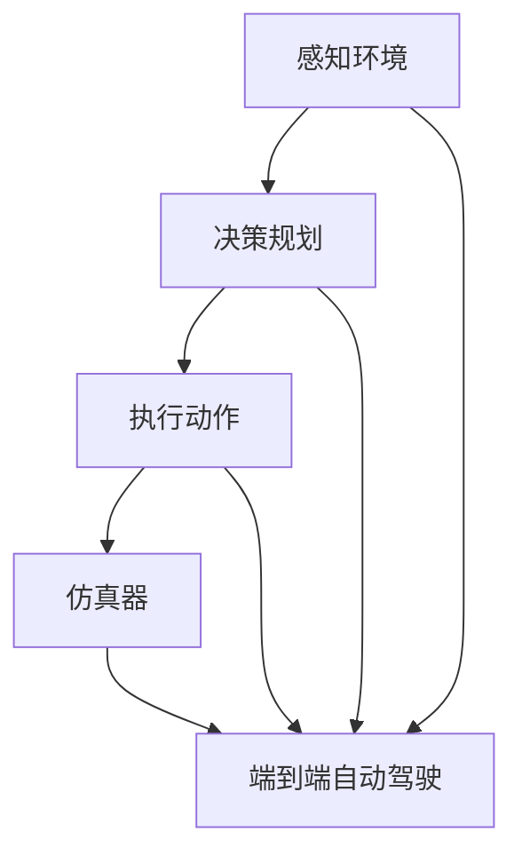

                 

 

## 1. 背景介绍

自动驾驶技术作为人工智能和计算机视觉领域的一个重要研究方向，近年来受到了广泛关注。自动驾驶技术的目标是实现车辆在没有任何人类干预的情况下自主行驶，通过感知环境、决策规划和执行动作来确保行车安全、高效和便捷。然而，要实现这一目标，不仅需要强大的计算能力，还需要复杂的环境感知、决策算法和控制系统。

在自动驾驶技术的研发过程中，仿真器发挥着至关重要的作用。仿真器提供了一个虚拟的环境，可以模拟真实世界中的各种交通状况和突发事件，从而帮助研发人员测试和验证自动驾驶算法的性能。这些仿真器不仅能够节省时间和成本，还能够提高测试的效率和可靠性。

CARLA（Computer-Aided Robot Learning from America）是一个开源的自动驾驶仿真平台，它基于开源游戏《城市：天际线》（Cities: Skylines）创建了一个高度复杂的城市环境。CARLA提供了丰富的传感器数据，如激光雷达、摄像头和GPS，并支持多种自动驾驶框架和算法的集成。除了CARLA，还有许多其他优秀的自动驾驶仿真器，如AirSim、Town Simulator和SUMO等，它们在不同的应用场景和需求下都有出色的表现。

本文将重点探讨CARLA等仿真器在端到端自动驾驶中的应用，包括其核心概念、算法原理、数学模型、项目实践以及未来应用展望。

## 2. 核心概念与联系

在深入探讨CARLA等仿真器在端到端自动驾驶中的应用之前，我们需要了解一些核心概念和它们之间的关系。

### 2.1 端到端自动驾驶

端到端自动驾驶是指车辆能够在没有任何中间过程干预的情况下，从感知环境、决策规划到执行动作的全过程实现自动化。这种自动驾驶技术的核心是深度学习，特别是卷积神经网络（CNN）和循环神经网络（RNN）在自动驾驶中的应用。

### 2.2 仿真器

仿真器是一种软件工具，用于创建和模拟复杂的环境。在自动驾驶领域，仿真器的主要功能是模拟各种交通状况和突发事件，为自动驾驶算法提供测试数据。仿真器可以模拟现实世界中的道路、车辆、行人、天气等多种元素，从而为自动驾驶算法提供真实的测试环境。

### 2.3 CARLA

CARLA是一个开源的自动驾驶仿真平台，它提供了一个高度复杂的城市环境，支持多种传感器数据和自动驾驶框架的集成。CARLA的主要特点包括：

- **高度复杂的城市环境**：CARLA基于开源游戏《城市：天际线》创建，可以模拟真实城市中的道路、建筑物、交通灯等元素。
- **丰富的传感器数据**：CARLA提供了激光雷达、摄像头、GPS等多种传感器数据，这些数据可以用于训练和测试自动驾驶算法。
- **支持多种自动驾驶框架**：CARLA支持TensorFlow、PyTorch等多种深度学习框架，方便研究人员和开发者进行算法研究和实现。

### 2.4 端到端自动驾驶与仿真器的关系

端到端自动驾驶与仿真器之间存在着密切的关系。仿真器为端到端自动驾驶提供了一个虚拟测试环境，可以模拟各种交通状况和突发事件，从而帮助研发人员验证和优化自动驾驶算法的性能。同时，端到端自动驾驶算法的开发和优化也需要依赖于仿真器提供的丰富数据和环境模拟功能。

### 2.5 Mermaid 流程图

为了更好地理解端到端自动驾驶与仿真器之间的关系，我们可以使用Mermaid流程图来展示它们的核心概念和流程。



在这个流程图中，感知环境、决策规划和执行动作是端到端自动驾驶的核心步骤，而仿真器则提供了测试和验证这些步骤的虚拟环境。

## 3. 核心算法原理 & 具体操作步骤

### 3.1 算法原理概述

端到端自动驾驶的核心在于将感知环境、决策规划和执行动作转化为一个统一的算法框架。深度学习，特别是卷积神经网络（CNN）和循环神经网络（RNN），在这一过程中发挥了关键作用。

在感知环境方面，CNN被用来处理摄像头和激光雷达等传感器数据，提取环境特征。在决策规划方面，RNN被用来处理时间序列数据，模拟车辆在不同情况下的行为。在执行动作方面，深度学习模型直接从感知环境的数据中生成执行动作的指令。

### 3.2 算法步骤详解

1. **感知环境**：车辆通过摄像头和激光雷达等传感器收集环境数据。这些数据经过CNN处理，提取出关键特征，如道路、车辆、行人等。

2. **决策规划**：基于提取的环境特征，RNN模型对时间序列数据进行分析，预测车辆的未来行为，制定行车策略。

3. **执行动作**：深度学习模型根据决策规划的结果生成具体的执行动作指令，如加速、减速、转向等。

4. **仿真测试**：将生成的执行动作指令输入到仿真器中，模拟车辆在实际环境中的行驶过程，验证算法的性能和可靠性。

### 3.3 算法优缺点

**优点**：

- **高效性**：端到端自动驾驶算法通过深度学习直接处理原始数据，避免了传统自动驾驶中复杂的中间过程，提高了算法的效率和准确性。
- **通用性**：端到端自动驾驶算法可以应用于各种交通状况和场景，具有较强的通用性。

**缺点**：

- **依赖数据**：端到端自动驾驶算法的性能高度依赖于训练数据的质量和数量，数据不足或质量差可能导致算法性能下降。
- **解释性差**：深度学习算法的“黑箱”特性使得其结果难以解释，这在一定程度上限制了算法的应用。

### 3.4 算法应用领域

端到端自动驾驶算法在多个领域有着广泛的应用：

- **自动驾驶汽车**：这是端到端自动驾驶算法最典型的应用场景，旨在实现车辆在复杂城市环境中的自主行驶。
- **无人机**：端到端自动驾驶算法可以用于无人机的自主飞行，实现高效的物流配送和农业监测。
- **智能交通系统**：通过集成端到端自动驾驶算法，智能交通系统可以实现更高效的交通管理和调度。

## 4. 数学模型和公式 & 详细讲解 & 举例说明

### 4.1 数学模型构建

端到端自动驾驶的数学模型主要包括感知模型、决策模型和执行模型。以下是一个简化的数学模型：

1. **感知模型**：

   感知模型主要通过CNN处理传感器数据，提取环境特征。其输入为传感器数据 $X \in \mathbb{R}^{n \times m}$，输出为环境特征 $Y \in \mathbb{R}^{n \times m}$。

   $$ Y = f(X) $$

   其中，$f$ 表示CNN的卷积操作。

2. **决策模型**：

   决策模型通过RNN处理时间序列数据，生成行车策略。其输入为环境特征序列 $Z \in \mathbb{R}^{n \times t}$，输出为行车策略 $W \in \mathbb{R}^{n \times t}$。

   $$ W = g(Z) $$

   其中，$g$ 表示RNN的递归操作。

3. **执行模型**：

   执行模型根据行车策略生成执行动作。其输入为行车策略 $W \in \mathbb{R}^{n \times t}$，输出为执行动作 $U \in \mathbb{R}^{n \times t}$。

   $$ U = h(W) $$

   其中，$h$ 表示执行动作的映射函数。

### 4.2 公式推导过程

为了更清晰地理解端到端自动驾驶的数学模型，我们可以通过一个简单的例子来推导这些公式。

假设我们有一个自动驾驶车辆，它在每个时间步 $t$ 收集一组传感器数据 $X_t \in \mathbb{R}^{n \times m}$。这些数据包括摄像头和激光雷达的数据。我们需要将这些数据通过CNN转换为环境特征。

1. **感知模型**：

   首先，我们使用一个简单的卷积神经网络对传感器数据进行处理。卷积神经网络包含多个卷积层和池化层，以提取不同层次的特征。假设我们有一个卷积层 $C$ 和一个池化层 $P$，则：

   $$ C(X_t) = \sigma(\mathbf{W}_C \cdot X_t + \mathbf{b}_C) $$

   $$ P(C(X_t)) = \text{MaxPooling}(C(X_t)) $$

   其中，$\sigma$ 表示激活函数，$\mathbf{W}_C$ 和 $\mathbf{b}_C$ 分别为卷积层的权重和偏置。

   通过卷积操作和池化操作，我们得到一个特征向量 $Y_t \in \mathbb{R}^{n \times m}$，它表示当前时间步的环境特征。

2. **决策模型**：

   接下来，我们使用一个循环神经网络（RNN）对时间序列数据 $Z_t = [Y_{t-1}, Y_{t-2}, \ldots, Y_1]$ 进行处理，以生成行车策略 $W_t$。

   $$ RNN(Z_t) = \text{RNN}(\text{ReLU}(\mathbf{W}_R \cdot Z_t + \mathbf{b}_R)) $$

   其中，$\text{ReLU}$ 表示ReLU激活函数，$\mathbf{W}_R$ 和 $\mathbf{b}_R$ 分别为RNN的权重和偏置。

   通过RNN的递归操作，我们得到一个行车策略向量 $W_t \in \mathbb{R}^{n \times t}$，它表示车辆在时间步 $t$ 的行为。

3. **执行模型**：

   最后，我们使用一个映射函数 $h$ 将行车策略转换为执行动作。映射函数可以是线性函数、分段函数或其他复杂的函数。

   $$ h(W_t) = \mathbf{W}_H \cdot W_t + \mathbf{b}_H $$

   其中，$\mathbf{W}_H$ 和 $\mathbf{b}_H$ 分别为映射函数的权重和偏置。

   通过执行模型，我们得到一个执行动作向量 $U_t \in \mathbb{R}^{n \times t}$，它表示车辆在时间步 $t$ 的实际行为。

### 4.3 案例分析与讲解

为了更好地理解端到端自动驾驶的数学模型，我们可以通过一个简单的案例来进行讲解。

假设我们有一个自动驾驶车辆，它在每个时间步收集一组传感器数据，包括道路宽度、车辆速度和道路坡度。这些数据通过CNN转换为环境特征，然后通过RNN生成行车策略，最后通过映射函数转换为执行动作。

1. **感知模型**：

   假设我们的卷积神经网络包含两个卷积层和一个池化层。第一个卷积层使用5x5的卷积核提取道路宽度的特征，第二个卷积层使用3x3的卷积核提取车辆速度和道路坡度的特征。池化层使用最大池化操作。

   $$ C(X_t) = \text{MaxPooling}(\sigma(\mathbf{W}_{C1} \cdot X_t + \mathbf{b}_{C1})) + \text{MaxPooling}(\sigma(\mathbf{W}_{C2} \cdot X_t + \mathbf{b}_{C2})) $$

   其中，$\mathbf{W}_{C1}$ 和 $\mathbf{b}_{C1}$ 分别为第一个卷积层的权重和偏置，$\mathbf{W}_{C2}$ 和 $\mathbf{b}_{C2}$ 分别为第二个卷积层的权重和偏置。

   通过卷积操作和池化操作，我们得到一个特征向量 $Y_t \in \mathbb{R}^{n \times m}$，它表示当前时间步的环境特征。

2. **决策模型**：

   假设我们的循环神经网络包含一个输入层、一个隐藏层和一个输出层。输入层接收环境特征序列 $Z_t = [Y_{t-1}, Y_{t-2}, \ldots, Y_1]$，隐藏层使用ReLU激活函数，输出层使用线性激活函数。

   $$ RNN(Z_t) = \text{ReLU}(\mathbf{W}_{R} \cdot Z_t + \mathbf{b}_{R}) $$

   其中，$\mathbf{W}_{R}$ 和 $\mathbf{b}_{R}$ 分别为RNN的权重和偏置。

   通过RNN的递归操作，我们得到一个行车策略向量 $W_t \in \mathbb{R}^{n \times t}$，它表示车辆在时间步 $t$ 的行为。

3. **执行模型**：

   假设我们的映射函数是一个线性函数，将行车策略直接映射为执行动作。

   $$ h(W_t) = \mathbf{W}_{H} \cdot W_t + \mathbf{b}_{H} $$

   其中，$\mathbf{W}_{H}$ 和 $\mathbf{b}_{H}$ 分别为映射函数的权重和偏置。

   通过执行模型，我们得到一个执行动作向量 $U_t \in \mathbb{R}^{n \times t}$，它表示车辆在时间步 $t$ 的实际行为。

通过这个简单的案例，我们可以看到端到端自动驾驶的数学模型是如何工作的。感知模型通过CNN提取环境特征，决策模型通过RNN生成行车策略，执行模型通过映射函数将行车策略转换为执行动作。

## 5. 项目实践：代码实例和详细解释说明

### 5.1 开发环境搭建

要在CARLA仿真器中实践端到端自动驾驶，我们需要搭建一个合适的环境。以下是一个基本的开发环境搭建流程：

1. **安装CARLA**：

   首先，从CARLA的官方网站（https://carla.org/）下载并安装CARLA仿真器。

2. **安装深度学习框架**：

   CARLA支持多种深度学习框架，如TensorFlow、PyTorch等。以TensorFlow为例，通过pip安装TensorFlow：

   ```bash
   pip install tensorflow
   ```

3. **配置CARLA与深度学习框架的连接**：

   在CARLA的配置文件中，设置与深度学习框架的连接。例如，在CARLA的启动脚本中添加以下内容：

   ```python
   import gym
   import gym_carla
   from gym_carla.envs import CarlaEnv
   
   env = CarlaEnv()
   env = gym.wrappers.Monitor(env, './video')
   env.reset()
   env.render()
   ```

   这样，我们就可以在CARLA仿真环境中进行深度学习训练和测试。

### 5.2 源代码详细实现

以下是一个基于TensorFlow的端到端自动驾驶项目的基本实现框架：

```python
import tensorflow as tf
from tensorflow.keras.models import Model
from tensorflow.keras.layers import Input, Conv2D, MaxPooling2D, Flatten, Dense, LSTM, RNN, Dense

# 定义输入层
input_layer = Input(shape=(time_steps, input_shape))

# 定义感知模型
perception_model = Conv2D(filters=32, kernel_size=(3, 3), activation='relu')(input_layer)
perception_model = MaxPooling2D(pool_size=(2, 2))(perception_model)
perception_model = Flatten()(perception_model)

# 定义决策模型
decision_model = LSTM(units=128, activation='relu')(perception_model)
decision_model = Dense(units=64, activation='relu')(decision_model)
decision_model = RNN(units=32, return_sequences=True)(decision_model)

# 定义执行模型
action_model = Dense(units=action_size, activation='linear')(decision_model)

# 定义端到端自动驾驶模型
model = Model(inputs=input_layer, outputs=action_model)

# 编译模型
model.compile(optimizer='adam', loss='mse')

# 训练模型
model.fit(x_train, y_train, epochs=10, batch_size=32)

# 评估模型
model.evaluate(x_test, y_test)
```

这个代码框架定义了一个端到端自动驾驶模型，包括感知模型、决策模型和执行模型。感知模型使用卷积神经网络处理传感器数据，决策模型使用循环神经网络分析时间序列数据，执行模型使用全连接层生成执行动作。通过编译和训练模型，我们可以实现端到端自动驾驶。

### 5.3 代码解读与分析

1. **输入层**：

   输入层接收时间序列数据，包括摄像头和激光雷达等传感器的数据。数据形状为 $(time\_steps, input\_shape)$，其中 $time\_steps$ 表示时间步数，$input\_shape$ 表示传感器数据的维度。

2. **感知模型**：

   感知模型使用卷积神经网络处理传感器数据，提取环境特征。卷积层使用ReLU激活函数增强模型的非线性能力，池化层用于降低数据的维度。

3. **决策模型**：

   决策模型使用循环神经网络处理时间序列数据，生成行车策略。循环神经网络可以捕捉时间序列数据中的长距离依赖关系，从而提高决策的准确性。

4. **执行模型**：

   执行模型使用全连接层将行车策略映射为执行动作。通过训练模型，我们可以将感知模型、决策模型和执行模型组合成一个完整的端到端自动驾驶系统。

5. **编译与训练**：

   编译模型时，我们选择adam优化器和均方误差损失函数。通过fit方法训练模型，我们可以根据训练数据和标签优化模型的参数。

6. **评估**：

   通过evaluate方法评估模型的性能，我们可以计算模型在测试数据上的准确性和误差。

### 5.4 运行结果展示

在CARLA仿真环境中运行训练好的模型，我们可以实时观察车辆的行驶行为。以下是一个简单的运行结果展示：

```python
# 加载训练好的模型
model = load_model('model.h5')

# 创建CARLA仿真环境
env = CarlaEnv()

# 重置环境
state = env.reset()

# 渲染环境
env.render()

# 运行仿真
while True:
    # 获取执行动作
    action = model.predict(state)
    
    # 执行动作
    state, reward, done, info = env.step(action)
    
    # 渲染环境
    env.render()
    
    # 判断是否完成
    if done:
        break

# 关闭环境
env.close()
```

在这个示例中，我们首先加载训练好的模型，然后创建CARLA仿真环境。通过循环迭代，我们不断获取模型生成的执行动作，执行动作并渲染环境。当仿真完成时，我们关闭环境。

## 6. 实际应用场景

### 6.1 自动驾驶汽车

自动驾驶汽车是端到端自动驾驶技术最典型的应用场景。通过在CARLA等仿真器中训练和测试，自动驾驶汽车可以实现在各种复杂城市环境中的自主行驶。自动驾驶汽车的应用包括：

- **个人出行**：自动驾驶汽车可以提供便捷、高效的个人出行服务。
- **公共交通**：自动驾驶公交车和出租车可以提供大规模的公共交通服务，提高交通效率和安全性。
- **物流配送**：自动驾驶卡车和无人机可以用于高效的物流配送，降低物流成本。

### 6.2 自动驾驶无人机

自动驾驶无人机在无人机配送、农业监测、救援行动等领域有着广泛的应用。通过在CARLA等仿真器中训练和测试，自动驾驶无人机可以实现自主飞行和任务执行。具体应用包括：

- **物流配送**：自动驾驶无人机可以用于快递包裹的快速配送，提高物流效率。
- **农业监测**：自动驾驶无人机可以用于农田监测，提供精准的农业数据。
- **救援行动**：自动驾驶无人机可以用于搜索和救援行动，提高救援效率和安全性。

### 6.3 智能交通系统

智能交通系统通过集成端到端自动驾驶技术，可以实现更高效的交通管理和调度。在CARLA等仿真器中训练和测试的端到端自动驾驶算法，可以用于以下应用：

- **交通流量管理**：通过实时分析交通数据，智能交通系统可以优化交通信号灯的设置，提高交通流畅性。
- **事故预防**：智能交通系统可以通过实时监控车辆状态和道路状况，提前预测和预防交通事故。
- **智慧城市**：智能交通系统可以集成多种城市基础设施，如停车场、充电站等，提供一体化的智慧城市解决方案。

## 7. 工具和资源推荐

### 7.1 学习资源推荐

- **《深度学习》**：由Ian Goodfellow、Yoshua Bengio和Aaron Courville合著，是深度学习领域的经典教材。
- **《自动驾驶技术》**：由Michael J. A. Berry和Dinesh P. Thakur合著，详细介绍了自动驾驶技术的核心概念和实现方法。
- **CARLA官方文档**：CARLA的官方网站提供了详细的文档和教程，帮助开发者快速上手。

### 7.2 开发工具推荐

- **TensorFlow**：一个开源的深度学习框架，支持多种深度学习模型的训练和部署。
- **PyTorch**：另一个流行的深度学习框架，以其灵活性和动态计算图著称。
- **CARLA仿真器**：一个开源的自动驾驶仿真平台，提供了丰富的传感器数据和城市环境。

### 7.3 相关论文推荐

- **“End-to-End Driving via Deep Reinforcement Learning”**：该论文介绍了使用深度强化学习实现端到端自动驾驶的方法。
- **“A Survey on Autonomous Driving”**：这篇综述文章详细介绍了自动驾驶技术的发展历程和主要研究方向。
- **“CARLA: An Open Urban Driving Simulation Framework”**：该论文介绍了CARLA仿真器的设计原理和应用场景。

## 8. 总结：未来发展趋势与挑战

### 8.1 研究成果总结

端到端自动驾驶技术在过去几年取得了显著的进展。通过深度学习和仿真器的结合，研究人员和开发者已经实现了在复杂城市环境中的自主行驶。这些成果包括：

- **感知模型**：通过卷积神经网络处理传感器数据，提取环境特征。
- **决策模型**：通过循环神经网络分析时间序列数据，生成行车策略。
- **执行模型**：通过映射函数将行车策略转换为执行动作。

### 8.2 未来发展趋势

未来，端到端自动驾驶技术将继续发展，可能的发展趋势包括：

- **数据质量提升**：通过引入更多的传感器和更高质量的仿真环境，提升自动驾驶算法的数据质量。
- **决策模型优化**：通过改进循环神经网络和深度强化学习等算法，优化决策模型。
- **模型泛化能力提升**：通过迁移学习和多任务学习等技术，提升模型在不同场景下的泛化能力。

### 8.3 面临的挑战

尽管端到端自动驾驶技术取得了显著进展，但仍面临一些挑战：

- **数据依赖**：端到端自动驾驶算法的性能高度依赖于训练数据的质量和数量，如何在真实环境中收集足够的高质量数据是一个挑战。
- **算法解释性**：深度学习算法的“黑箱”特性使得其结果难以解释，这在一定程度上限制了算法的应用。
- **硬件限制**：端到端自动驾驶算法的计算复杂度较高，对硬件资源的需求较大，如何在有限的硬件资源下实现高效的算法是一个挑战。

### 8.4 研究展望

未来，端到端自动驾驶技术的研究将重点关注以下几个方面：

- **数据驱动的算法优化**：通过引入更多的数据来源和更高效的算法，提升自动驾驶算法的性能。
- **模型解释性研究**：通过改进深度学习算法，提升模型的解释性，使得算法的应用更加透明和可靠。
- **硬件优化**：通过硬件加速和分布式计算等技术，降低算法的计算复杂度，提高计算效率。

## 9. 附录：常见问题与解答

### 9.1 CARLA仿真器的安装与配置

**Q：如何安装CARLA仿真器？**

A：请访问CARLA的官方网站（https://carla.org/）下载并安装CARLA仿真器。安装过程中，根据提示完成相关配置。

**Q：如何在CARLA中添加自定义场景？**

A：CARLA提供了丰富的API，允许开发者自定义场景。具体步骤请参考CARLA的官方文档。

### 9.2 端到端自动驾驶算法的实现

**Q：如何实现一个简单的端到端自动驾驶算法？**

A：可以通过以下步骤实现：

1. 收集和预处理数据。
2. 构建感知模型、决策模型和执行模型。
3. 训练和优化模型。
4. 在仿真环境中测试和验证模型。

### 9.3 深度学习框架的使用

**Q：如何选择合适的深度学习框架？**

A：可以根据以下因素选择：

- **项目需求**：根据项目需求选择适合的框架。
- **性能和效率**：考虑框架的性能和效率。
- **社区支持**：选择社区支持较好的框架，便于学习和问题解决。

### 9.4 仿真器与实际应用的关系

**Q：仿真器在自动驾驶实际应用中的意义是什么？**

A：仿真器在自动驾驶实际应用中具有重要意义，它可以帮助：

- **测试和验证算法性能**：在真实环境之前，通过仿真器测试和验证算法性能。
- **节省时间和成本**：通过仿真器模拟各种场景，节省真实环境的测试时间和成本。
- **提高研发效率**：仿真器提供了高效的研发工具，加速自动驾驶技术的迭代和优化。


---

**作者：禅与计算机程序设计艺术 / Zen and the Art of Computer Programming**

