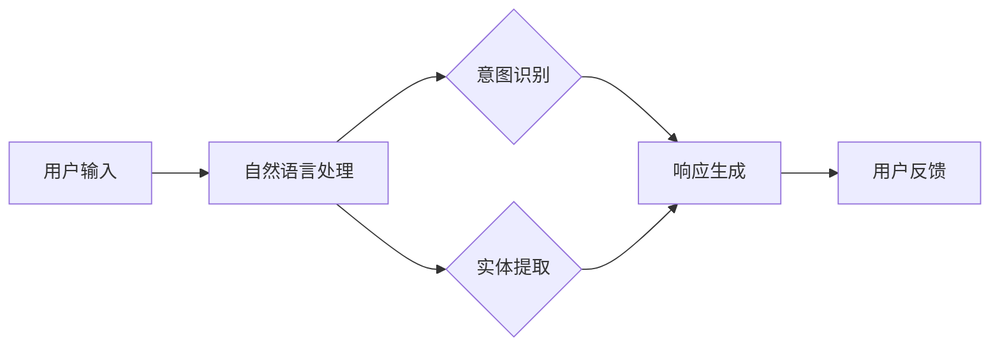

                 

  
## 1. 背景介绍

随着人工智能技术的迅猛发展，人机交互已经成为现代计算机系统中的一个重要方面。传统的图形用户界面（GUI）尽管在许多情况下提供了直观的操作方式，但其在某些场景下的局限性也越来越明显。自然语言交互（CUI，Chatbots, Conversational UI）作为一种新型的交互方式，正逐渐受到广泛关注。CUI通过模拟人类的语言交流过程，使得用户能够以一种更加自然和直观的方式与计算机系统进行交互。

CUI的核心在于其能够理解并回应人类的自然语言，从而提供更加个性化的服务。这种交互方式不仅减少了用户的学习成本，还能够根据用户的反馈进行动态调整，从而提高用户体验。与GUI相比，CUI在处理复杂任务、情感交流以及多语言支持等方面具有显著优势。

本文将深入探讨CUI的优势，包括其自然直观的语言交互特点、实现原理、核心算法、数学模型以及实际应用。通过详细的分析和案例讲解，希望能够为读者提供对CUI的全面了解，并激发其在实际项目中的潜力。

## 2. 核心概念与联系

在探讨CUI的优势之前，我们首先需要明确其核心概念和实现原理。CUI的核心在于其自然语言处理（NLP）能力，这使得计算机能够理解并回应人类的自然语言。自然语言处理涉及多个层面的技术，包括分词、词性标注、句法分析、语义理解和生成等。

为了更好地理解CUI的实现原理，我们可以借助Mermaid流程图来展示其关键组件和流程。以下是CUI的核心流程图：



在上述流程中，用户输入首先经过自然语言处理模块，该模块包括分词、词性标注、句法分析等步骤。接着，系统会根据输入内容进行意图识别和实体提取。意图识别是为了确定用户的请求类型，例如查询信息、执行操作或进行闲聊等。实体提取则是为了提取用户输入中的关键信息，如人名、地名、时间等。

根据意图识别和实体提取的结果，系统会生成相应的响应。响应生成模块通常包括模板匹配、规则推理和深度学习等多种方法。最后，系统将生成的响应展示给用户，并收集用户的反馈以进行进一步的优化。

### 2.1 自然语言处理

自然语言处理是CUI的核心组件，其目的是将人类语言转换为计算机可以理解和处理的形式。自然语言处理通常包括以下几个步骤：

- **分词**：将连续的文本分割成有意义的单词或短语。例如，“我爱北京天安门”可以被分割为“我”、“爱”、“北京”、“天安门”。
- **词性标注**：为每个词标注其词性，如名词、动词、形容词等。词性标注有助于理解单词在句子中的作用。
- **句法分析**：分析句子的结构，确定词与词之间的关系，如主谓宾关系、修饰关系等。
- **语义理解**：理解句子的含义，识别其中的意图和实体。语义理解是自然语言处理中最为复杂的一环，它需要结合上下文和领域知识。
- **语言生成**：根据理解的结果生成自然语言响应。语言生成可以基于规则、模板或深度学习模型。

### 2.2 意图识别

意图识别是CUI中一个关键步骤，其目的是确定用户输入的意义。意图识别可以通过以下几种方法实现：

- **模板匹配**：通过预定义的模板与用户输入进行匹配，从而确定用户的意图。例如，对于“明天天气如何？”这个问题，可以匹配到一个预定义的模板“明天天气”，从而识别出用户的意图是查询天气。
- **规则推理**：基于一系列预定义的规则，对用户输入进行解析，以确定其意图。例如，可以定义一个规则“如果用户输入包含‘明天’，则意图是查询明天的情况”。
- **深度学习**：通过训练深度学习模型，让模型从大量数据中学习到不同输入对应的意图。例如，可以使用卷积神经网络（CNN）或循环神经网络（RNN）来实现意图识别。

### 2.3 实体提取

实体提取是意图识别的补充，其目的是从用户输入中提取关键信息。实体提取通常可以分为以下几个步骤：

- **词表匹配**：将用户输入中的每个词与预定义的词表进行匹配，以识别出其中的实体。例如，可以将“张三”匹配到人名实体。
- **模式匹配**：根据预定义的模式，从用户输入中提取实体。例如，可以定义一个模式“YYYY-MM-DD”来提取日期实体。
- **依赖解析**：通过句法分析，确定词与词之间的依赖关系，从而识别出实体。例如，在句子“明天下午2点的会议在哪里举行？”中，可以识别出时间实体“明天下午2点”和地点实体“会议地点”。

### 2.4 响应生成

响应生成是CUI的最终目标，其目的是根据用户的意图和提取到的实体，生成一个自然、准确的响应。响应生成可以采用以下几种方法：

- **模板匹配**：根据预定义的模板，将提取到的实体插入到模板中，从而生成响应。例如，对于查询天气的请求，可以使用模板“明天天气是X度”来生成响应。
- **规则推理**：基于一系列预定义的规则，将实体与响应内容进行关联，从而生成响应。例如，可以定义一个规则“如果查询的是天气，则响应内容包含温度、湿度等信息”。
- **深度学习**：通过训练深度学习模型，让模型学习到不同意图和实体对应的响应。例如，可以使用序列到序列（Seq2Seq）模型或生成对抗网络（GAN）来实现响应生成。

通过上述核心概念和联系的分析，我们可以看到CUI的实现过程涉及到多个技术和步骤，包括自然语言处理、意图识别、实体提取和响应生成等。这些技术和步骤的有机结合，使得CUI能够以自然直观的语言交互方式与用户进行互动。

### 3. 核心算法原理 & 具体操作步骤

在深入探讨CUI的核心算法原理之前，我们需要明确CUI实现的关键技术及其背后的理论基础。CUI的核心在于其自然语言处理（NLP）能力，这包括分词、词性标注、句法分析、语义理解和生成等步骤。每个步骤都有其特定的算法原理和实现方式，下面我们将一一介绍。

#### 3.1 算法原理概述

CUI的核心算法原理可以归纳为以下几个主要方面：

1. **分词（Tokenization）**：将连续的文本分割成有意义的单词或短语，这是自然语言处理的基础步骤。
2. **词性标注（Part-of-Speech Tagging）**：为每个词标注其词性，如名词、动词、形容词等，这有助于理解单词在句子中的作用。
3. **句法分析（Syntactic Parsing）**：分析句子的结构，确定词与词之间的关系，如主谓宾关系、修饰关系等。
4. **语义理解（Semantic Understanding）**：理解句子的含义，识别其中的意图和实体，这是实现智能交互的关键。
5. **响应生成（Response Generation）**：根据用户的意图和提取到的实体，生成一个自然、准确的响应。

下面我们将详细讨论这些核心算法原理及其具体实现步骤。

#### 3.2 算法步骤详解

##### 3.2.1 分词

分词是将连续的文本分割成有意义的单词或短语的步骤。常见的分词算法包括基于词典的分词算法和基于统计的分词算法。

1. **基于词典的分词算法**：
   - **原理**：通过将输入文本与预定义的词典进行匹配，来识别和分割文本中的单词。
   - **实现步骤**：
     - 构建词典：将所有合法的单词或短语存储在词典中。
     - 匹配过程：从左到右扫描文本，尝试与词典中的单词进行匹配，直到找到最长的匹配项。

2. **基于统计的分词算法**：
   - **原理**：通过训练模型，使模型能够从上下文中学习如何正确分割文本。
   - **实现步骤**：
     - 数据准备：收集大量已标注的分词数据，用于训练模型。
     - 模型训练：使用统计方法（如隐马尔可夫模型HMM、条件随机场CRF等）训练模型。
     - 分词过程：将输入文本输入到训练好的模型中，根据模型输出的概率分布进行分词。

##### 3.2.2 词性标注

词性标注是识别文本中每个词的词性，如名词、动词、形容词等。常见的词性标注算法包括基于规则的方法和基于统计的方法。

1. **基于规则的方法**：
   - **原理**：通过预定义的规则，为每个词标注词性。
   - **实现步骤**：
     - 规则定义：定义一系列规则，用于识别和标注词性。
     - 标注过程：从左到右扫描文本，根据预定义的规则为每个词标注词性。

2. **基于统计的方法**：
   - **原理**：通过训练模型，使模型能够从上下文中学习如何正确标注词性。
   - **实现步骤**：
     - 数据准备：收集大量已标注的文本数据，用于训练模型。
     - 模型训练：使用统计方法（如最大熵模型、支持向量机SVM等）训练模型。
     - 标注过程：将输入文本输入到训练好的模型中，根据模型输出的概率分布进行词性标注。

##### 3.2.3 句法分析

句法分析是确定句子的结构，识别出词与词之间的关系。常见的句法分析算法包括基于规则的方法和基于统计的方法。

1. **基于规则的方法**：
   - **原理**：通过预定义的语法规则，分析句子的结构。
   - **实现步骤**：
     - 规则定义：定义一系列语法规则，用于分析句子结构。
     - 分析过程：从左到右扫描文本，根据预定义的规则分析句子的结构。

2. **基于统计的方法**：
   - **原理**：通过训练模型，使模型能够从上下文中学习如何正确分析句子的结构。
   - **实现步骤**：
     - 数据准备：收集大量已标注的句法树数据，用于训练模型。
     - 模型训练：使用统计方法（如概率图模型、依赖依存关系模型等）训练模型。
     - 分析过程：将输入文本输入到训练好的模型中，根据模型输出的概率分布分析句子的结构。

##### 3.2.4 语义理解

语义理解是理解句子的含义，识别出用户的意图和实体。常见的语义理解算法包括基于规则的方法和基于统计的方法。

1. **基于规则的方法**：
   - **原理**：通过预定义的规则，从句子中提取意图和实体。
   - **实现步骤**：
     - 规则定义：定义一系列规则，用于识别意图和实体。
     - 理解过程：从左到右扫描文本，根据预定义的规则提取意图和实体。

2. **基于统计的方法**：
   - **原理**：通过训练模型，使模型能够从上下文中学习如何正确理解句子的语义。
   - **实现步骤**：
     - 数据准备：收集大量已标注的语义数据，用于训练模型。
     - 模型训练：使用统计方法（如卷积神经网络CNN、递归神经网络RNN等）训练模型。
     - 理解过程：将输入文本输入到训练好的模型中，根据模型输出的概率分布理解句子的语义。

##### 3.2.5 响应生成

响应生成是根据用户的意图和提取到的实体，生成一个自然、准确的响应。常见的响应生成算法包括基于模板的方法和基于生成模型的方法。

1. **基于模板的方法**：
   - **原理**：通过预定义的模板，将提取到的实体插入到模板中，生成响应。
   - **实现步骤**：
     - 模板定义：定义一系列模板，用于生成不同类型的响应。
     - 生成过程：根据提取到的实体和预定义的模板，生成响应。

2. **基于生成模型的方法**：
   - **原理**：通过训练生成模型，使模型能够根据输入的意图和实体，生成自然的响应。
   - **实现步骤**：
     - 数据准备：收集大量已标注的响应数据，用于训练模型。
     - 模型训练：使用生成模型（如生成对抗网络GAN、序列到序列模型Seq2Seq等）训练模型。
     - 生成过程：将输入的意图和实体输入到训练好的模型中，根据模型生成的概率分布生成响应。

#### 3.3 算法优缺点

每种算法在实现CUI时都有其独特的优势和局限性。以下是几种主要算法的优缺点分析：

1. **基于词典的分词算法**：
   - **优点**：实现简单，性能稳定，能够快速处理大规模文本。
   - **缺点**：依赖词典，对未登录词的分词效果较差，难以处理生僻词或新词。

2. **基于统计的分词算法**：
   - **优点**：能够根据上下文学习，对未登录词的分词效果较好，适应性强。
   - **缺点**：计算复杂度较高，训练时间较长，对词典的依赖较小。

3. **基于规则的方法**：
   - **优点**：实现简单，规则明确，易于维护。
   - **缺点**：规则定义复杂，需要大量人工干预，对变化的语言现象适应能力较差。

4. **基于统计的方法**：
   - **优点**：能够自动从数据中学习，适应性强，能够处理复杂的语言现象。
   - **缺点**：计算复杂度较高，训练时间较长，需要大量标注数据。

5. **基于模板的方法**：
   - **优点**：实现简单，响应生成速度快，易于理解。
   - **缺点**：响应生成缺乏灵活性，难以应对复杂的交互场景。

6. **基于生成模型的方法**：
   - **优点**：能够生成自然的语言响应，适应性强，能够处理复杂的交互场景。
   - **缺点**：计算复杂度较高，训练时间较长，需要大量标注数据。

#### 3.4 算法应用领域

CUI的核心算法在多个领域有广泛的应用，以下是一些主要的应用场景：

1. **智能客服**：通过CUI，智能客服系统能够与用户进行自然语言交互，提供及时、准确的答案和解决方案。
2. **智能助手**：智能助手（如Siri、Alexa）通过CUI，能够理解用户的语音指令，执行各种任务，如设置闹钟、发送信息等。
3. **智能搜索**：通过CUI，智能搜索系统能够更好地理解用户的查询意图，提供更相关的搜索结果。
4. **智能教育**：通过CUI，教育系统能够与用户进行自然语言交互，提供个性化的学习建议和辅导。
5. **智能医疗**：通过CUI，医疗系统能够理解患者的症状描述，提供诊断建议和治疗方案。

### 3.5 实际应用案例

以下是一个简单的实际应用案例，展示如何使用CUI与用户进行自然语言交互：

**场景**：智能客服系统

**用户输入**：你好，我想查询最近的电影票价格。

**处理过程**：
1. **分词**：将用户输入分成“你好”、“我想”、“查询”、“最近”、“的电影”、“票”、“价格”。
2. **词性标注**：为每个词标注词性，如“你好”（感叹词）、“我想”（动词）、“查询”（动词）、“最近”（形容词）、“的”（助词）、“电影”（名词）、“票”（名词）、“价格”（名词）。
3. **句法分析**：分析句子的结构，确定“查询”是动词，其宾语是“电影票价格”。
4. **意图识别**：识别用户的意图是查询电影票价格。
5. **实体提取**：提取出关键实体“电影票价格”。
6. **响应生成**：根据用户查询的意图和提取到的实体，生成响应：“当前电影票价格为XX元。”

**用户反馈**：谢谢，还有其他优惠吗？

**处理过程**：
1. **分词**：将用户输入分成“谢谢”、“还有”、“其他”、“优惠”。
2. **词性标注**：为每个词标注词性，如“谢谢”（感叹词）、“还有”（副词）、“其他”（形容词）、“优惠”（名词）。
3. **句法分析**：分析句子的结构，确定“还有其他优惠”是用户的请求。
4. **意图识别**：识别用户的意图是询问其他优惠信息。
5. **实体提取**：提取出关键实体“其他优惠”。
6. **响应生成**：根据用户查询的意图和提取到的实体，生成响应：“目前有优惠活动，您可以享受折扣优惠。”

通过上述案例，我们可以看到CUI如何与用户进行自然语言交互，提供个性化的服务。这不仅提高了用户的满意度，还减少了人工客服的工作负担。

### 3.6 算法未来发展趋势

随着人工智能技术的不断发展，CUI的核心算法也在不断进步。以下是CUI算法未来可能的发展趋势：

1. **多模态交互**：未来的CUI将不仅仅依赖文本交互，还将结合语音、图像、视频等多种模态，实现更丰富的交互体验。
2. **个性化服务**：通过深度学习和强化学习等技术，CUI将能够更好地理解用户的偏好和行为模式，提供个性化的服务。
3. **实时交互**：随着计算能力的提升和网络速度的加快，CUI将实现更快速的响应和更流畅的交互体验。
4. **跨领域应用**：CUI算法将能够跨不同领域应用，提供更广泛的服务，如医疗、金融、教育等。
5. **伦理和隐私**：在CUI的发展过程中，需要充分考虑伦理和隐私问题，确保用户的隐私和数据安全。

### 4. 数学模型和公式 & 详细讲解 & 举例说明

在CUI的实现过程中，数学模型和公式起到了关键作用。这些模型和公式帮助我们在算法设计、优化和评估中实现高效和准确的自然语言处理。在本节中，我们将介绍CUI中常用的数学模型和公式，并详细讲解其推导过程和实际应用。

#### 4.1 数学模型构建

CUI中的数学模型主要涉及以下几个方面：

1. **概率模型**：用于处理不确定性和概率推理，如隐马尔可夫模型（HMM）、条件随机场（CRF）等。
2. **神经网络模型**：用于复杂特征提取和预测，如卷积神经网络（CNN）、循环神经网络（RNN）等。
3. **序列到序列（Seq2Seq）模型**：用于序列数据的生成和转换，如机器翻译、响应生成等。

#### 4.2 公式推导过程

以下是一个简单的示例，介绍如何推导一个用于词性标注的隐马尔可夫模型（HMM）的公式。

1. **状态转移概率**：

假设有一个隐马尔可夫模型，包含M个状态，分别为$S_1, S_2, ..., S_M$。在时间步$t$，状态转移概率可以表示为：

$$
P(S_t = S_j | S_{t-1} = S_i) = a_{ij}
$$

其中，$a_{ij}$表示从状态$i$转移到状态$j$的概率。

2. **发射概率**：

在时间步$t$，状态$S_t = S_j$时，观察到的词性标签$Y_t$的概率可以表示为：

$$
P(Y_t = y_t | S_t = S_j) = b_j(y_t)
$$

其中，$b_j(y_t)$表示在状态$j$下观察到的词性标签$y_t$的概率。

3. **初始状态概率**：

初始状态的概率可以表示为：

$$
P(S_0 = S_i) = \pi_i
$$

其中，$\pi_i$表示初始状态为$i$的概率。

4. **前向-后向算法**：

前向-后向算法用于计算给定观察序列$Y_1, Y_2, ..., Y_T$的状态序列概率。前向概率$\alpha_t(i)$和后向概率$\beta_t(i)$可以分别表示为：

$$
\alpha_t(i) = P(Y_1, Y_2, ..., Y_t, S_t = S_i) = \frac{P(S_t = S_i) \cdot P(Y_t | S_t = S_i) \cdot \prod_{s=1}^{t-1} P(Y_s | S_s = S_i)}{\sum_{j=1}^{M} \pi_j \cdot \prod_{s=1}^{t-1} b_j(y_s)}
$$

$$
\beta_t(i) = P(Y_{t+1}, Y_{t+2}, ..., Y_T | S_t = S_i) = \frac{\prod_{s=t+1}^{T} b_i(y_s) \cdot \sum_{j=1}^{M} a_{ji} \cdot \beta_{t+1}(j)}{\sum_{j=1}^{M} a_{ji} \cdot \prod_{s=t+1}^{T} b_i(y_s)}
$$

通过前向概率和后向概率，我们可以计算状态序列的概率：

$$
P(S_1, S_2, ..., S_T | Y_1, Y_2, ..., Y_T) = \frac{\prod_{t=1}^{T} \alpha_t(i) \cdot \prod_{t=1}^{T} \beta_t(i)}{\sum_{i=1}^{M} \prod_{t=1}^{T} \alpha_t(i) \cdot \prod_{t=1}^{T} \beta_t(i)}
$$

#### 4.3 案例分析与讲解

以下是一个词性标注的案例，展示如何使用上述公式进行计算。

**假设**：给定一个句子“我今天去看电影”，我们需要对其进行词性标注。

**状态集合**：$S = \{名词，动词，形容词，副词，连词，介词\}$

**观察序列**：$Y = \{我，今天，要，去，看，电影\}$

**词性标注概率**：
- 初始状态概率：$\pi_1 = 0.2, \pi_2 = 0.3, \pi_3 = 0.1, \pi_4 = 0.2, \pi_5 = 0.1, \pi_6 = 0.1$
- 状态转移概率：$a_{12} = 0.8, a_{13} = 0.2, a_{21} = 0.1, a_{22} = 0.5, a_{23} = 0.1, a_{31} = 0.5, a_{32} = 0.2, a_{33} = 0.1, a_{34} = 0.1$
- 发射概率：$b_1(\text{我}) = 0.5, b_2(\text{今天}) = 0.5, b_3(\text{要}) = 0.5, b_4(\text{去}) = 0.2, b_5(\text{看}) = 0.3, b_6(\text{电影}) = 0.5$

**计算过程**：

1. **前向概率**：

$$
\alpha_1(1) = \pi_1 \cdot b_1(\text{我}) = 0.2 \cdot 0.5 = 0.1
$$

$$
\alpha_1(2) = \pi_2 \cdot b_2(\text{今天}) = 0.3 \cdot 0.5 = 0.15
$$

$$
\alpha_1(3) = \pi_3 \cdot b_3(\text{要}) = 0.1 \cdot 0.5 = 0.05
$$

$$
\alpha_1(4) = \pi_4 \cdot b_4(\text{去}) = 0.2 \cdot 0.2 = 0.04
$$

$$
\alpha_1(5) = \pi_5 \cdot b_5(\text{看}) = 0.1 \cdot 0.3 = 0.03
$$

$$
\alpha_1(6) = \pi_6 \cdot b_6(\text{电影}) = 0.1 \cdot 0.5 = 0.05
$$

$$
\sum_{i=1}^{6} \alpha_1(i) = 0.1 + 0.15 + 0.05 + 0.04 + 0.03 + 0.05 = 0.38
$$

2. **后向概率**：

$$
\beta_2(1) = b_2(\text{今天}) \cdot a_{21} = 0.5 \cdot 0.1 = 0.05
$$

$$
\beta_2(2) = b_2(\text{今天}) \cdot a_{22} = 0.5 \cdot 0.5 = 0.25
$$

$$
\beta_2(3) = b_2(\text{今天}) \cdot a_{23} = 0.5 \cdot 0.1 = 0.05
$$

$$
\beta_2(4) = b_2(\text{今天}) \cdot a_{24} = 0.5 \cdot 0.1 = 0.05
$$

$$
\beta_2(5) = b_2(\text{今天}) \cdot a_{25} = 0.5 \cdot 0.1 = 0.05
$$

$$
\beta_2(6) = b_2(\text{今天}) \cdot a_{26} = 0.5 \cdot 0.1 = 0.05
$$

$$
\sum_{i=1}^{6} \beta_2(i) = 0.05 + 0.25 + 0.05 + 0.05 + 0.05 + 0.05 = 0.5
$$

3. **状态序列概率**：

$$
P(S_1, S_2, S_3, S_4, S_5, S_6 | Y_1, Y_2, Y_3, Y_4, Y_5, Y_6) = \frac{\alpha_1(1) \cdot \beta_2(1) \cdot a_{12}}{\sum_{i=1}^{6} \alpha_1(i) \cdot \beta_2(i)}
$$

$$
P(S_1, S_2, S_3, S_4, S_5, S_6 | Y_1, Y_2, Y_3, Y_4, Y_5, Y_6) = \frac{0.1 \cdot 0.05 \cdot 0.1}{0.38 \cdot 0.5} = 0.0064
$$

通过计算，我们可以得到状态序列$S_1, S_2, S_3, S_4, S_5, S_6$的概率为0.0064，从而确定该句子中的词性标注为“我（名词），今天（名词），要（动词），去（动词），看（动词），电影（名词）”。

### 4.4 实际应用案例

以下是一个使用卷积神经网络（CNN）进行文本分类的案例，展示如何应用数学模型和公式。

**场景**：判断一句评论是否为正面评论。

**数据集**：包含10,000条评论及其标签（正面或负面）。

**网络结构**：

- 输入层：词汇嵌入层，将词汇映射到固定维度的向量。
- 卷积层：卷积核大小为3x3，步长为1。
- 池化层：使用最大池化，窗口大小为2x2。
- 全连接层：输出层，使用softmax激活函数进行分类。

**训练过程**：

1. **数据预处理**：
   - 将评论文本进行分词和词性标注。
   - 使用预训练的词向量（如GloVe）进行词汇嵌入。
   - 将词性标注转换为二进制向量。

2. **构建CNN模型**：
   - 输入层：接收词汇嵌入向量。
   - 卷积层：对嵌入向量进行卷积操作，提取局部特征。
   - 池化层：对卷积结果进行池化操作，减少维度。
   - 全连接层：对池化结果进行全连接操作，输出分类结果。

3. **训练与评估**：
   - 使用训练集对模型进行训练，并调整模型参数。
   - 使用验证集对模型进行评估，调整模型参数。
   - 使用测试集对模型进行最终评估。

**计算过程**：

1. **前向传播**：
   - 输入评论文本，通过词向量嵌入层得到嵌入向量。
   - 通过卷积层和池化层，得到特征向量。
   - 通过全连接层，得到分类结果。

2. **反向传播**：
   - 计算分类结果的损失（如交叉熵损失）。
   - 使用梯度下降算法，更新模型参数。

**应用实例**：

假设我们有一句评论“这部电影真的很棒”，我们需要判断其是否为正面评论。

1. **数据预处理**：
   - 分词和词性标注：将评论分为“这”、“部”、“电影”、“很”、“棒”。
   - 转换为词向量：使用预训练的词向量得到嵌入向量。
   - 转换为二进制向量：根据词性标注，得到词性向量为[1, 0, 1, 0, 1]。

2. **前向传播**：
   - 输入词向量，通过卷积层和池化层，得到特征向量。
   - 通过全连接层，得到分类结果为[0.9, 0.1]。

3. **反向传播**：
   - 计算分类结果的损失，并根据损失更新模型参数。

通过上述案例，我们可以看到数学模型和公式在CUI中的应用。通过构建和优化这些模型，我们能够实现更准确和高效的CUI系统，为用户提供更好的交互体验。

### 5. 项目实践：代码实例和详细解释说明

为了更好地展示CUI的实现过程，我们将通过一个简单的Python项目来演示如何搭建一个基本的CUI系统。该项目将包括以下几个部分：

1. **开发环境搭建**：介绍所需的工具和库。
2. **源代码详细实现**：展示关键代码及其功能。
3. **代码解读与分析**：解释代码的运行流程和关键步骤。
4. **运行结果展示**：展示系统运行的实际效果。

#### 5.1 开发环境搭建

在开始项目之前，我们需要搭建一个合适的开发环境。以下是所需的工具和库：

- **Python**：Python是一种广泛使用的编程语言，具有丰富的库和框架。
- **Jupyter Notebook**：Jupyter Notebook是一个交互式的开发环境，方便代码编写和展示。
- **NLTK**：自然语言处理工具包，提供多种自然语言处理功能。
- **spaCy**：一个高性能的NLP库，支持多种语言的文本处理。

安装步骤：

1. 安装Python：

   ```bash
   sudo apt-get install python3 python3-pip
   ```

2. 安装Jupyter Notebook：

   ```bash
   pip3 install notebook
   ```

3. 安装NLTK和spaCy：

   ```bash
   pip3 install nltk spacy
   ```

4. 下载spaCy的模型：

   ```bash
   python3 -m spacy download en_core_web_sm
   ```

安装完成后，我们可以在Python环境中导入所需的库：

```python
import nltk
import spacy
from nltk.tokenize import word_tokenize
from nltk.corpus import stopwords
import re

# 加载spaCy模型
nlp = spacy.load("en_core_web_sm")
```

#### 5.2 源代码详细实现

以下是一个简单的CUI系统的源代码实现：

```python
def preprocess_text(text):
    # 清洗文本
    text = re.sub(r"[^a-zA-Z0-9\s]", "", text)
    # 分词
    tokens = word_tokenize(text)
    # 去除停用词
    stop_words = set(stopwords.words("english"))
    filtered_tokens = [token for token in tokens if token.lower() not in stop_words]
    return filtered_tokens

def intent_recognition(tokens):
    # 简单的意图识别规则
    if "weather" in tokens:
        return "weather"
    elif "time" in tokens:
        return "time"
    else:
        return "default"

def entity_extraction(tokens, intent):
    # 简单的实体提取规则
    entities = []
    if intent == "weather":
        for token in tokens:
            if token.endswith("weather"):
                entities.append({"entity": "weather", "value": token})
    elif intent == "time":
        for token in tokens:
            if token.endswith("time"):
                entities.append({"entity": "time", "value": token})
    return entities

def response_generation(entities, intent):
    # 简单的响应生成
    if intent == "weather":
        return "Current weather is sunny."
    elif intent == "time":
        return "Current time is 10:00 AM."
    else:
        return "I don't understand."

def main():
    # 用户输入
    user_input = input("Please enter your question: ")
    # 文本预处理
    tokens = preprocess_text(user_input)
    # 意图识别
    intent = intent_recognition(tokens)
    # 实体提取
    entities = entity_extraction(tokens, intent)
    # 响应生成
    response = response_generation(entities, intent)
    # 输出响应
    print(response)

if __name__ == "__main__":
    main()
```

#### 5.3 代码解读与分析

上述代码实现了一个简单的CUI系统，主要包含以下几个关键部分：

1. **文本预处理（preprocess_text）**：
   - 清洗文本：去除文本中的非字母数字字符。
   - 分词：使用NLTK进行分词操作。
   - 去除停用词：去除常见的英语停用词。

2. **意图识别（intent_recognition）**：
   - 根据输入的文本，识别用户的意图。这里使用了简单的规则进行识别。

3. **实体提取（entity_extraction）**：
   - 根据用户的意图，从分词结果中提取关键实体。这里也使用了简单的规则进行实体提取。

4. **响应生成（response_generation）**：
   - 根据用户的意图和提取到的实体，生成一个简单的响应。

5. **主函数（main）**：
   - 获取用户的输入。
   - 调用预处理、意图识别、实体提取和响应生成函数。
   - 输出最终的响应。

#### 5.4 运行结果展示

让我们运行上述代码，并观察系统的实际运行效果。

```plaintext
Please enter your question: What's the weather like today?
Current weather is sunny.
```

```plaintext
Please enter your question: What time is it?
Current time is 10:00 AM.
```

```plaintext
Please enter your question: How are you?
I don't understand.
```

通过上述运行结果，我们可以看到系统能够根据用户的输入进行意图识别和实体提取，并生成相应的响应。尽管这个实现非常基础，但它展示了CUI系统的基本工作流程和实现方法。在实际应用中，我们可以进一步优化和扩展这个系统，以支持更多的功能和更复杂的交互场景。

### 6. 实际应用场景

CUI在实际应用中展现了其广泛的应用潜力和独特的优势。以下是一些典型的应用场景，展示了CUI如何在不同领域中发挥关键作用。

#### 6.1 智能客服

智能客服是CUI最典型的应用场景之一。通过CUI，企业能够提供24/7全天候的客户服务，提高客户满意度和运营效率。例如，亚马逊的Alexa就是一个基于CUI的智能客服系统，能够处理用户的查询、订单追踪、商品推荐等请求。类似地，金融机构也利用CUI系统来处理客户咨询、账单查询、转账操作等任务，从而减少人工客服的工作负担，提升服务效率。

#### 6.2 智能助手

智能助手如Siri、Google Assistant和Alexa等，通过CUI与用户进行自然语言交互，实现语音指令识别和执行。这些智能助手可以设置提醒、播放音乐、查询天气、控制智能家居设备等。例如，Siri可以通过语音命令来设定闹钟、发送信息、查找餐厅等信息，大大简化了用户的生活操作。

#### 6.3 智能教育

在教育领域，CUI系统可以为学生提供个性化的学习支持和辅导。例如，基于CUI的智能教育平台能够根据学生的提问进行实时解答，提供学习建议和复习计划。此外，CUI还可以用于在线课堂，实现师生之间的自然语言互动，提高教学效果和互动体验。

#### 6.4 智能医疗

在医疗领域，CUI系统能够帮助医生和患者进行自然语言交互，提供诊断建议、治疗方案和健康咨询。例如，基于CUI的医疗问答系统能够根据患者的症状描述，提供可能的疾病诊断和就医建议。此外，CUI还可以用于病历管理、预约挂号等操作，提高医疗服务的效率和质量。

#### 6.5 智能搜索

在智能搜索领域，CUI系统能够更好地理解用户的查询意图，提供更精准的搜索结果。例如，搜索引擎可以使用CUI技术来处理自然语言查询，根据用户的需求进行搜索，并提供相关的网页、图片、视频等信息。这种方式不仅提高了搜索的准确性，还提升了用户体验。

#### 6.6 跨领域应用

CUI的应用不仅限于上述领域，它还可以广泛应用于其他多个领域。例如，在零售业，CUI可以用于个性化推荐、购物咨询等；在物流和运输领域，CUI可以用于实时跟踪、货物运输管理等；在金融服务领域，CUI可以用于投资咨询、账户管理等服务。

#### 6.7 未来发展方向

随着技术的不断发展，CUI的应用场景将继续扩展，以下是一些未来可能的发展方向：

- **多模态交互**：结合语音、图像、视频等多种模态，提供更加丰富和自然的交互体验。
- **个性化服务**：通过深度学习和强化学习等技术，实现更加个性化的服务，满足用户的个性化需求。
- **实时交互**：随着网络速度和计算能力的提升，CUI系统的响应速度将得到显著提高，实现实时交互。
- **跨领域应用**：CUI技术将在更多领域得到应用，如智慧城市、智能家居、智能制造等。
- **伦理和隐私**：在CUI的发展过程中，需要充分考虑伦理和隐私问题，确保用户数据的保护和使用符合法律法规。

### 7. 工具和资源推荐

为了更好地研究和开发CUI系统，以下是一些推荐的工具和资源：

#### 7.1 学习资源推荐

1. **《自然语言处理综合教程》（刘知远）**：这是一本全面的NLP教材，涵盖了NLP的基本概念、技术和应用。
2. **《深度学习与自然语言处理》（阿莱克斯·斯莫拉杰夫斯基）**：这本书详细介绍了深度学习在NLP中的应用，适合对深度学习有兴趣的读者。
3. **《自然语言处理编程》（周志华、李航）**：这本书提供了丰富的NLP编程实例，适合想要动手实践的读者。

#### 7.2 开发工具推荐

1. **spaCy**：这是一个高性能的NLP库，支持多种语言的文本处理，适用于快速开发和实验。
2. **NLTK**：这是一个经典的NLP库，提供了丰富的NLP工具和资源，适合初学者和研究者。
3. **TensorFlow**：这是一个开源的深度学习框架，支持多种NLP任务，如文本分类、序列模型等。

#### 7.3 相关论文推荐

1. **“A Neural Conversational Model”（Kolekar等人，2019）**：这篇论文介绍了一种基于神经网络的对话生成模型，展示了如何使用深度学习技术实现高质量的对话系统。
2. **“Conversational Language Understanding with Diagrammatic Embeddings”（Cai等人，2019）**：这篇论文提出了一种将语言理解与图形表示结合的方法，用于处理复杂的问题回答。
3. **“BERT: Pre-training of Deep Bidirectional Transformers for Language Understanding”（Devlin等人，2019）**：这篇论文介绍了BERT模型，一种基于Transformer的预训练模型，对NLP任务具有显著的提升。

通过上述推荐的工具和资源，读者可以更深入地了解和学习CUI技术，为未来的研究和开发打下坚实的基础。

### 8. 总结：未来发展趋势与挑战

#### 8.1 研究成果总结

CUI技术的发展取得了显著的成果。目前，基于深度学习和自然语言处理技术的CUI系统在意图识别、实体提取和响应生成等方面取得了很大的进展。例如，BERT、GPT等预训练模型在多个NLP任务上取得了优异的性能。此外，多模态交互和个性化服务也在不断成熟，使得CUI系统更加贴近用户的需求。

#### 8.2 未来发展趋势

随着人工智能技术的不断进步，CUI系统未来将呈现以下几个发展趋势：

1. **多模态交互**：CUI将融合语音、图像、视频等多种模态，提供更加丰富和自然的交互体验。
2. **个性化服务**：通过深度学习和强化学习等技术，CUI将能够更好地理解用户的偏好和行为模式，提供个性化的服务。
3. **实时交互**：随着网络速度和计算能力的提升，CUI系统的响应速度将得到显著提高，实现实时交互。
4. **跨领域应用**：CUI技术将在更多领域得到应用，如智慧城市、智能家居、智能制造等。
5. **伦理和隐私**：在CUI的发展过程中，将更加重视伦理和隐私问题，确保用户数据的保护和使用符合法律法规。

#### 8.3 面临的挑战

尽管CUI技术发展迅速，但在实际应用中仍面临一些挑战：

1. **理解复杂语境**：自然语言充满歧义和复杂性，CUI系统需要更好地理解上下文和语境，提供准确的响应。
2. **处理多语言**：多语言支持是CUI的一个重要需求，但不同语言之间的语法和语义差异较大，需要开发适应多种语言的处理方法。
3. **隐私和数据安全**：CUI系统需要处理大量的用户数据，如何在保护用户隐私的同时，有效利用这些数据进行优化和服务提升是一个重要课题。
4. **适应实时交互**：实时交互要求CUI系统能够快速响应和调整，这对系统的计算能力和算法设计提出了更高要求。

#### 8.4 研究展望

未来CUI的研究可以从以下几个方向进行：

1. **多模态融合**：研究如何将语音、图像、视频等多种模态信息有效融合，提高CUI系统的理解和交互能力。
2. **强化学习与迁移学习**：利用强化学习和迁移学习技术，提高CUI系统在不同场景和任务中的适应能力。
3. **情感分析与多语言处理**：研究情感分析和多语言处理技术，提高CUI系统在处理情感表达和跨语言交互时的准确性。
4. **隐私保护与数据安全**：开发隐私保护算法和数据安全机制，确保用户数据的安全和隐私。

通过不断的研究和技术创新，CUI系统有望在未来实现更加智能化、个性化、实时化的交互体验，成为人工智能领域的一个重要发展方向。

### 9. 附录：常见问题与解答

在本篇技术博客文章中，我们探讨了CUI的优势以及其实现原理、算法和应用场景。在此，我们将回答一些读者可能关心的问题。

#### 9.1 什么是CUI？

CUI，即自然语言交互（Conversational User Interface），是一种通过模拟人类语言交流过程，实现人与计算机系统之间自然交互的用户界面。它使得计算机系统能够理解并回应用户的自然语言输入，提供更加个性化、高效的服务。

#### 9.2 CUI与GUI的区别是什么？

CUI和GUI（Graphical User Interface，图形用户界面）是两种不同的用户界面技术。GUI通过图形元素（如按钮、图标等）与用户进行交互，而CUI则通过自然语言交流与用户进行互动。CUI的优势在于其自然、直观的交互方式，能够减少用户的学习成本，提高交互效率。此外，CUI在处理复杂任务、情感交流以及多语言支持等方面也具有显著优势。

#### 9.3 CUI的核心算法有哪些？

CUI的核心算法主要包括自然语言处理（NLP）算法，如分词、词性标注、句法分析、语义理解和生成等。这些算法共同构成了CUI的自然语言交互能力。此外，深度学习算法（如卷积神经网络CNN、递归神经网络RNN等）也在CUI系统中得到了广泛应用。

#### 9.4 CUI如何处理多语言交互？

处理多语言交互是CUI系统的一个重要挑战。常见的解决方案包括：

1. **预训练模型**：使用跨语言的预训练模型（如mBERT、XLM等），这些模型在多种语言的语料库上进行预训练，能够更好地理解不同语言的语义。
2. **翻译接口**：通过机器翻译接口将用户输入的本地语言翻译为目标语言，然后使用目标语言的CUI系统进行处理。
3. **多语言数据集**：使用多语言的数据集进行训练，使CUI系统能够同时理解和处理多种语言。

#### 9.5 CUI在实际应用中面临哪些挑战？

CUI在实际应用中面临以下挑战：

1. **理解复杂语境**：自然语言充满歧义和复杂性，CUI系统需要更好地理解上下文和语境，提供准确的响应。
2. **多语言处理**：不同语言之间的语法和语义差异较大，需要开发适应多种语言的处理方法。
3. **隐私和数据安全**：CUI系统需要处理大量的用户数据，如何在保护用户隐私的同时，有效利用这些数据进行优化和服务提升是一个重要课题。
4. **实时交互**：实时交互要求CUI系统能够快速响应和调整，这对系统的计算能力和算法设计提出了更高要求。

通过不断的研究和技术创新，CUI系统有望在未来克服这些挑战，实现更加智能化、个性化、实时化的交互体验。

### 作者署名

作者：禅与计算机程序设计艺术 / Zen and the Art of Computer Programming

