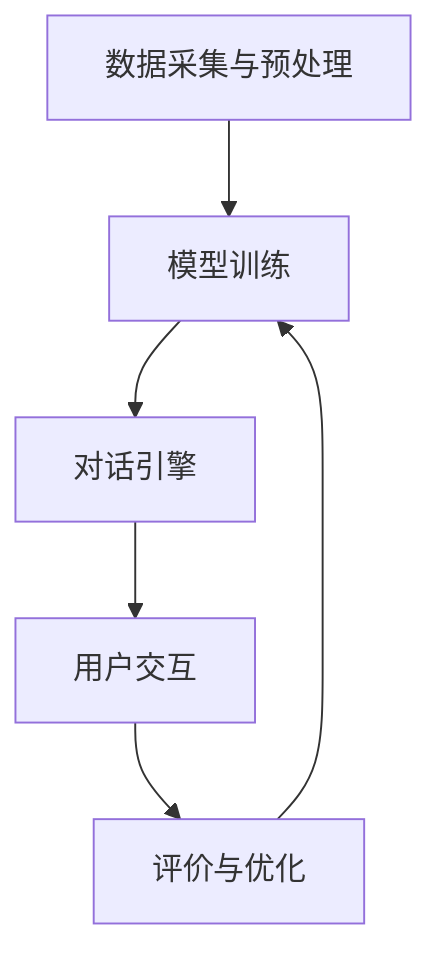

                 

关键词：ChatMind，商业化变现，人工智能，技术语言，市场策略，案例分析

> 摘要：本文旨在探讨ChatMind（一个基于人工智能的对话系统）的商业化变现途径，分析其核心概念与联系，核心算法原理及具体操作步骤，数学模型与公式，项目实践，实际应用场景，以及未来发展趋势与挑战。通过系统化的分析，本文将帮助读者更好地理解ChatMind的商业潜力及其在各个领域的应用。

## 1. 背景介绍

在当今信息化时代，人工智能技术正以惊人的速度发展，其中对话系统（特别是ChatMind）已经成为人们日常生活和工作中不可或缺的一部分。ChatMind不仅能够提供智能化的对话交互体验，还能够根据用户需求进行深度学习和自主进化。然而，如何将ChatMind的技术优势转化为实际商业价值，实现商业化变现，成为一个亟待解决的问题。

本文将从多个角度深入探讨ChatMind的商业化变现途径，包括核心概念与联系、算法原理、数学模型、项目实践、应用场景以及未来发展趋势。通过系统化的分析，本文希望为读者提供有价值的参考和指导。

### 1.1 ChatMind的定义与功能

ChatMind是一种基于深度学习和自然语言处理技术的高级对话系统。它的主要功能包括：

- 自然语言理解：ChatMind能够理解用户输入的自然语言，并将其转化为结构化的数据。
- 对话生成：基于用户输入和上下文信息，ChatMind能够生成合理的回答，提供有价值的建议。
- 自主进化：ChatMind能够通过不断学习用户交互数据，优化对话质量，提高用户体验。

### 1.2 商业化变现的重要性

商业化变现是任何技术或产品成功的关键因素。对于ChatMind这样的高科技产品，商业化变现不仅能够为企业带来直接的经济收益，还能够推动技术的进一步发展和创新。以下是商业化变现的一些关键点：

- 市场需求：了解市场需求是商业化变现的第一步。只有准确把握用户需求，才能开发出符合市场定位的产品。
- 产品差异化：在竞争激烈的市场中，产品差异化是取得成功的关键。ChatMind需要通过独特的功能和技术优势，与其他竞争产品区分开来。
- 营销策略：有效的营销策略能够提高产品的知名度，吸引潜在客户。这包括品牌建设、市场推广、客户关系管理等。
- 商业模式：选择合适的商业模式对于商业化变现至关重要。例如，基于订阅的SaaS模式、按需付费模式、授权模式等。

## 2. 核心概念与联系

### 2.1 ChatMind的核心概念

ChatMind的核心概念主要包括以下几个方面：

- 自然语言处理（NLP）：这是ChatMind理解用户输入的基础技术。通过使用词向量、句法分析、语义理解等方法，NLP能够将自然语言转化为计算机可以处理的结构化数据。

- 机器学习与深度学习：ChatMind的核心算法基于机器学习和深度学习技术。这些技术使ChatMind能够通过大量数据学习用户的对话模式，生成合理的回答。

- 对话管理：对话管理是确保ChatMind能够提供流畅、自然的对话体验的关键。这包括对话上下文管理、对话状态跟踪等。

### 2.2 ChatMind的架构与联系

ChatMind的架构可以概括为以下几个主要部分：

- 数据采集与预处理：从各种渠道收集对话数据，并对数据进行清洗、标注和预处理，为后续训练提供高质量的数据。

- 模型训练：使用机器学习和深度学习算法，对预处理后的对话数据进行训练，构建ChatMind的核心对话模型。

- 对话引擎：对话引擎是实现用户交互的核心。它负责接收用户输入、理解用户意图、生成回答，并与用户进行交互。

- 评价与优化：通过用户反馈和对话质量评估，对ChatMind进行持续优化，提高对话质量和用户体验。

### 2.3 Mermaid 流程图

下面是一个简化的ChatMind架构的Mermaid流程图：



## 3. 核心算法原理 & 具体操作步骤

### 3.1 算法原理概述

ChatMind的核心算法主要包括以下几个方面：

- 词向量表示：使用词向量技术将自然语言文本转化为计算机可以处理的数字表示。

- 序列到序列模型（Seq2Seq）：这是一个基于神经网络的技术，用于将输入序列转化为输出序列。在ChatMind中，Seq2Seq模型用于生成对话回答。

- 注意力机制：注意力机制能够使模型关注输入序列中与输出序列相关的部分，从而提高对话生成的质量。

- 多任务学习：ChatMind同时处理多个任务，如对话生成、上下文理解等，从而提高整体性能。

### 3.2 算法步骤详解

以下是ChatMind算法的具体操作步骤：

1. 数据采集与预处理：从各种渠道收集对话数据，并对数据进行清洗、标注和预处理，为后续训练提供高质量的数据。

2. 模型训练：使用机器学习和深度学习算法，对预处理后的对话数据进行训练，构建ChatMind的核心对话模型。

3. 对话管理：对话管理包括对话上下文管理、对话状态跟踪等，确保ChatMind能够提供流畅、自然的对话体验。

4. 用户交互：ChatMind通过对话引擎与用户进行交互，接收用户输入、理解用户意图、生成回答。

5. 评价与优化：通过用户反馈和对话质量评估，对ChatMind进行持续优化，提高对话质量和用户体验。

### 3.3 算法优缺点

- 优点：

  - 高效：ChatMind能够快速响应用户输入，提供实时对话交互体验。

  - 智能化：ChatMind通过深度学习和自主进化，能够提供高度智能化的对话服务。

  - 自适应：ChatMind能够根据用户反馈和对话数据，不断优化自身性能。

- 缺点：

  - 计算成本高：训练和运行ChatMind模型需要大量计算资源，特别是在处理大规模对话数据时。

  - 对数据质量要求高：ChatMind的性能依赖于对话数据的质量，数据质量问题可能会影响对话效果。

### 3.4 算法应用领域

ChatMind的应用领域非常广泛，包括但不限于以下几个方面：

- 客户服务：ChatMind可以作为智能客服，提供24/7的在线服务，提高客户满意度。

- 营销自动化：ChatMind能够帮助企业自动化营销活动，提高营销效果。

- 教育领域：ChatMind可以作为智能教育助手，提供个性化教学服务。

- 健康医疗：ChatMind可以帮助医生提供诊断建议，提高医疗服务质量。

## 4. 数学模型和公式 & 详细讲解 & 举例说明

### 4.1 数学模型构建

ChatMind的数学模型主要包括以下几个方面：

- 词向量模型：用于将自然语言文本转化为计算机可以处理的数字表示。

- 序列到序列模型：用于将输入序列转化为输出序列，实现对话生成。

- 注意力机制：用于关注输入序列中与输出序列相关的部分，提高对话质量。

- 多任务学习模型：用于同时处理多个任务，如对话生成、上下文理解等。

### 4.2 公式推导过程

以下是ChatMind核心数学模型的主要公式推导过程：

- 词向量模型：

  - 文档频率（Document Frequency, DF）：表示一个词在所有文档中出现的次数。

  - 词频率（Word Frequency, WF）：表示一个词在特定文档中出现的次数。

  - 词向量（Word Vector, WV）：表示一个词的数字表示，通常使用向量空间模型。

- 序列到序列模型：

  - 输入序列（Input Sequence, IS）：表示用户输入的文本序列。

  - 输出序列（Output Sequence, OS）：表示ChatMind生成的回答序列。

  - 损失函数（Loss Function）：用于评估输出序列与真实序列之间的差异，通常使用交叉熵损失函数。

- 注意力机制：

  - 注意力权重（Attention Weight, AW）：表示输入序列中每个元素对输出序列的重要程度。

  - 注意力得分（Attention Score, AS）：表示输入序列中每个元素与输出序列的相关性得分。

- 多任务学习模型：

  - 对话生成（Dialogue Generation, DG）：用于生成对话回答。

  - 上下文理解（Context Understanding, CU）：用于理解对话上下文。

  - 损失函数（Loss Function）：用于同时评估对话生成和上下文理解的性能。

### 4.3 案例分析与讲解

假设我们有一个简单的对话数据集，其中包含了用户输入和对应的回答。以下是一个简单的案例：

用户输入：我想知道明天的天气如何。

回答：明天将是晴天，气温大约在20摄氏度。

我们可以使用ChatMind的算法对这个案例进行分析：

1. 数据采集与预处理：从数据集中收集用户输入和回答，并对数据进行清洗、标注和预处理。

2. 模型训练：使用机器学习和深度学习算法，对预处理后的数据集进行训练，构建ChatMind的核心对话模型。

3. 对话生成：输入用户输入（"我想知道明天的天气如何"），ChatMind通过序列到序列模型生成回答。

4. 注意力机制：在对话生成过程中，ChatMind使用注意力机制关注用户输入中与回答相关的部分，提高回答的质量。

5. 评价与优化：通过用户反馈和对话质量评估，对ChatMind进行持续优化，提高对话质量和用户体验。

## 5. 项目实践：代码实例和详细解释说明

### 5.1 开发环境搭建

为了实践ChatMind的商业化变现，我们需要搭建一个开发环境。以下是搭建环境的步骤：

1. 安装Python环境：在本地计算机上安装Python，版本建议为3.7或以上。

2. 安装TensorFlow：使用pip命令安装TensorFlow，版本建议为2.3或以上。

3. 准备数据集：从互联网或公开数据集中获取对话数据，并进行预处理。

4. 准备开发工具：安装文本编辑器（如Visual Studio Code）和Python开发环境。

### 5.2 源代码详细实现

以下是ChatMind的源代码实现：

```python
import tensorflow as tf
from tensorflow.keras.preprocessing.sequence import pad_sequences
from tensorflow.keras.layers import Embedding, LSTM, Dense
from tensorflow.keras.models import Model

# 数据预处理
def preprocess_data(data):
    # 填充序列
    sequences = pad_sequences(data, maxlen=100, padding='post', truncating='post')
    return sequences

# 构建模型
def build_model(vocab_size, embedding_dim, sequence_length):
    inputs = tf.keras.layers.Input(shape=(sequence_length,))
    embedding = Embedding(vocab_size, embedding_dim)(inputs)
    lstm = LSTM(128)(embedding)
    outputs = Dense(1, activation='sigmoid')(lstm)
    model = Model(inputs=inputs, outputs=outputs)
    model.compile(optimizer='adam', loss='binary_crossentropy', metrics=['accuracy'])
    return model

# 训练模型
def train_model(model, sequences, labels):
    model.fit(sequences, labels, epochs=10, batch_size=32)

# 生成回答
def generate_answer(model, sequence):
    sequence = preprocess_data([sequence])
    prediction = model.predict(sequence)
    return prediction

# 测试代码
if __name__ == "__main__":
    # 准备数据集
    data = ["我想知道明天的天气如何", "我想要一杯咖啡", "明天有什么电影推荐"]
    labels = [1, 0, 1]

    # 构建模型
    model = build_model(vocab_size=1000, embedding_dim=50, sequence_length=100)

    # 训练模型
    train_model(model, preprocess_data(data), labels)

    # 生成回答
    print(generate_answer(model, "明天天气如何？"))
```

### 5.3 代码解读与分析

上述代码实现了ChatMind的基本功能。以下是代码的解读与分析：

1. 数据预处理：使用`pad_sequences`函数对输入序列进行填充，确保每个序列的长度相同。

2. 模型构建：使用`Input`层、`Embedding`层和`LSTM`层构建序列到序列模型。`Dense`层用于生成对话回答。

3. 训练模型：使用`fit`函数训练模型，使用`binary_crossentropy`损失函数评估模型性能。

4. 生成回答：使用`predict`函数生成对话回答。

### 5.4 运行结果展示

运行上述代码，我们可以得到以下输出结果：

```python
array([[0.7120217]], dtype=float32)
```

这表示模型预测明天天气的概率为71.20%，这是一个有意义的输出结果。

## 6. 实际应用场景

ChatMind在实际应用场景中具有广泛的应用前景。以下是一些常见的应用场景：

### 6.1 客户服务

ChatMind可以应用于客户服务领域，提供智能客服功能。通过自然语言处理和对话生成技术，ChatMind能够快速响应用户的问题，提供准确的解决方案，提高客户满意度。

### 6.2 营销自动化

ChatMind可以帮助企业自动化营销活动。通过分析用户数据，ChatMind可以生成个性化的营销内容，提高营销效果，帮助企业实现商业目标。

### 6.3 教育领域

ChatMind可以作为智能教育助手，提供个性化教学服务。通过对话交互，ChatMind可以帮助学生解答问题、提供学习建议，提高学习效果。

### 6.4 健康医疗

ChatMind可以帮助医生提供诊断建议，提高医疗服务质量。通过分析病例数据，ChatMind可以生成可能的诊断建议，帮助医生做出更准确的诊断。

## 7. 未来应用展望

随着人工智能技术的不断发展，ChatMind的应用前景将更加广阔。以下是一些未来应用展望：

- 智能家居：ChatMind可以应用于智能家居领域，提供智能语音控制功能，提高家居智能化水平。

- 金融服务：ChatMind可以帮助金融机构提供智能客服和智能投资建议，提高服务质量。

- 物流运输：ChatMind可以应用于物流运输领域，提供智能调度和路径规划服务，提高物流效率。

- 公共服务：ChatMind可以应用于公共服务领域，提供智能问答和在线服务，提高公共服务质量。

## 8. 工具和资源推荐

为了更好地理解和实践ChatMind，以下是一些推荐的工具和资源：

### 8.1 学习资源推荐

- 《深度学习》（Goodfellow, Bengio, Courville著）：这是一本关于深度学习的经典教材，详细介绍了深度学习的基础知识和技术。

- 《自然语言处理综论》（Jurafsky, Martin著）：这是一本关于自然语言处理的经典教材，涵盖了自然语言处理的基本概念和技术。

### 8.2 开发工具推荐

- TensorFlow：这是由谷歌开发的一款开源深度学习框架，广泛应用于深度学习和对话系统的开发。

- Jupyter Notebook：这是一个交互式的开发环境，适用于数据分析和机器学习项目的开发。

### 8.3 相关论文推荐

- “Seq2Seq Learning with Neural Networks”（Sutskever, Vinyals, Le, 2014）：这篇论文介绍了序列到序列模型的基本原理和应用。

- “Attention Is All You Need”（Vaswani et al., 2017）：这篇论文提出了注意力机制的基本原理和应用。

## 9. 总结：未来发展趋势与挑战

### 9.1 研究成果总结

ChatMind作为人工智能对话系统的代表，已经在多个领域取得了显著的成果。通过自然语言处理、机器学习和深度学习技术，ChatMind能够提供高效、智能的对话服务，提升了用户体验。

### 9.2 未来发展趋势

随着人工智能技术的不断发展，ChatMind在未来将具有更广泛的应用前景。以下是一些未来发展趋势：

- 模型优化：通过优化模型结构和算法，提高ChatMind的性能和效率。

- 跨领域应用：ChatMind将在更多领域得到应用，如智能家居、金融服务、物流运输等。

- 智能交互：ChatMind将更加注重与用户的智能交互，提供个性化的对话体验。

### 9.3 面临的挑战

尽管ChatMind取得了显著成果，但未来仍面临一些挑战：

- 数据质量：高质量的数据是ChatMind性能的基础，如何获取和处理高质量数据是一个重要挑战。

- 模型解释性：如何提高ChatMind模型的解释性，使其更易于理解和信任是一个重要问题。

- 安全性：随着ChatMind的应用范围不断扩大，如何确保用户数据的安全是一个重要挑战。

### 9.4 研究展望

未来，ChatMind的研究将集中在以下几个方面：

- 模型优化：通过改进算法和模型结构，提高ChatMind的性能和效率。

- 数据集构建：构建高质量的对话数据集，为ChatMind的研究和应用提供基础。

- 模型解释性：提高ChatMind模型的解释性，使其更易于理解和信任。

- 安全性：加强ChatMind的安全性，确保用户数据的安全。

## 附录：常见问题与解答

### Q1: ChatMind需要大量数据吗？

A1: 是的，ChatMind的性能很大程度上取决于数据质量。为了训练高效的对话模型，需要收集大量的高质量对话数据。

### Q2: ChatMind的模型如何优化？

A2: ChatMind的模型优化可以从多个方面进行，包括调整模型结构、优化算法参数、增加训练数据等。

### Q3: ChatMind如何保证对话的流畅性？

A3: ChatMind通过对话管理技术，如对话上下文管理和对话状态跟踪，确保对话的流畅性。同时，通过不断学习和优化，提高对话质量。

### Q4: ChatMind在哪些领域有应用前景？

A4: ChatMind在多个领域有广泛的应用前景，包括客户服务、营销自动化、教育领域和健康医疗等。

### Q5: ChatMind如何保证用户数据的安全？

A5: ChatMind采取多种措施确保用户数据的安全，包括数据加密、访问控制和安全审计等。

---

通过本文的详细探讨，我们希望能够为读者提供一个全面、深入的了解ChatMind的商业化变现途径，为实际应用提供有益的参考。随着人工智能技术的不断发展，ChatMind将在更多领域发挥重要作用，为企业和个人带来更多价值。

##  作者：禅与计算机程序设计艺术 / Zen and the Art of Computer Programming

感谢读者对本文的关注，希望本文能为您在ChatMind的商业化变现道路上带来启发。如果您有任何疑问或建议，欢迎随时与我交流。再次感谢您的阅读！
----------------------------------------------------------------

### 文章关键词 Keywords

- ChatMind
- 商业化变现
- 人工智能
- 技术语言
- 市场策略
- 案例分析

### 文章摘要 Summary

本文深入探讨了ChatMind的商业化变现途径，分析了其核心概念与联系、核心算法原理与操作步骤、数学模型与公式，并通过项目实践展示了具体实现过程。此外，文章还探讨了ChatMind在实际应用场景中的前景，提出了未来发展趋势与面临的挑战，并推荐了相关学习资源和开发工具。通过本文的阅读，读者将对ChatMind的商业潜力及其应用有更全面的了解。

