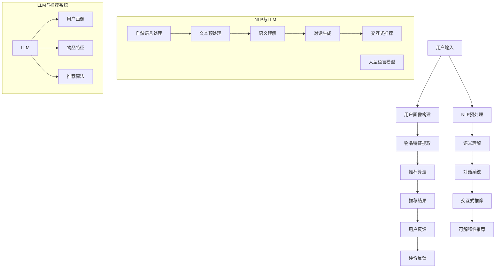

                 

关键词：推荐系统、自然语言处理、交互式推荐、可解释性、LLM

摘要：本文介绍了基于大型语言模型（LLM）增强的交互式可解释推荐系统的构建方法。通过整合自然语言处理技术，本文提出了一种能够与用户进行实时交互并生成解释性推荐结果的框架。文章首先概述了推荐系统的发展历程，然后详细讨论了LLM在推荐系统中的应用，最后通过数学模型和实际案例展示了该推荐系统的实现过程及其优势。

## 1. 背景介绍

推荐系统是当今互联网技术中不可或缺的一部分，广泛应用于电子商务、社交媒体、在线视频、音乐流媒体等领域。传统的推荐系统主要基于协同过滤、基于内容的推荐和混合推荐等方法，这些方法在一定程度上提高了推荐的准确性和覆盖率。然而，随着用户个性化需求的增加和数据量的爆炸式增长，传统推荐系统面临着解释性不足、隐私问题和高计算复杂度等挑战。

近年来，自然语言处理（NLP）技术的快速发展为推荐系统带来了新的机遇。特别是大型语言模型（LLM）的出现，使得计算机能够处理和理解自然语言，从而提高推荐的交互性和可解释性。交互式推荐系统能够与用户进行实时对话，动态调整推荐策略，提高用户满意度和参与度。可解释性推荐系统则通过提供推荐背后的原因和逻辑，增强用户对推荐的信任感和理解。

本文旨在探讨如何将LLM引入到推荐系统中，构建一个既具有交互性又具备可解释性的推荐框架，从而解决传统推荐系统面临的问题。

### 2. 核心概念与联系

#### 2.1 推荐系统的基本概念

推荐系统是一种通过分析用户的历史行为、兴趣和偏好，自动为用户推荐相关商品、内容或服务的信息系统。其主要组成部分包括：

- **用户画像**：通过收集用户的基本信息、行为记录、社交关系等构建用户画像，用于理解用户的需求和偏好。
- **物品特征**：对推荐物品进行特征提取，如商品标签、评分、评论等，以便进行相似性计算和推荐。
- **推荐算法**：根据用户画像和物品特征，利用协同过滤、基于内容的推荐、混合推荐等方法生成推荐结果。
- **评价反馈**：用户对推荐结果的反馈用于优化推荐算法，提高推荐质量。

#### 2.2 自然语言处理（NLP）

自然语言处理是人工智能领域的一个重要分支，旨在让计算机理解和生成自然语言。NLP的关键技术包括：

- **分词**：将文本分割成有意义的词汇或短语。
- **词性标注**：为文本中的每个单词标注其词性，如名词、动词等。
- **实体识别**：识别文本中的关键实体，如人名、地名、组织名等。
- **语义理解**：理解文本中的句子含义，包括情感分析、语义角色标注等。
- **对话系统**：实现人与计算机之间的自然语言交互。

#### 2.3 大型语言模型（LLM）

大型语言模型（LLM）是一种基于深度学习的技术，能够对大规模文本数据进行训练，掌握语言的统计规律和上下文信息。LLM的关键技术包括：

- **预训练**：使用未标注的文本数据对模型进行大规模训练，学习语言的通用特征。
- **微调**：在预训练模型的基础上，利用标注数据进一步训练，以适应特定任务。
- **生成式模型**：能够根据输入文本生成连贯、合理的文本输出。

#### 2.4 Mermaid 流程图

以下是推荐系统的基本架构及其与自然语言处理和大型语言模型之间的联系：



### 3. 核心算法原理 & 具体操作步骤

#### 3.1 算法原理概述

基于LLM增强的交互式可解释推荐系统主要利用LLM对用户输入的自然语言进行处理，理解用户的意图和需求，然后结合用户画像和物品特征，生成个性化的推荐结果，并通过对话系统与用户进行交互，提供解释性推荐。

该系统的工作流程可以概括为以下几个步骤：

1. **用户输入处理**：接收用户的自然语言输入，进行分词、词性标注等NLP预处理。
2. **语义理解**：利用LLM对预处理后的文本进行语义理解，提取关键信息。
3. **用户画像构建**：根据提取的信息和用户历史数据，构建用户画像。
4. **物品特征提取**：对候选物品进行特征提取，如标签、评分、评论等。
5. **推荐算法**：结合用户画像和物品特征，利用基于内容的推荐、协同过滤等方法生成推荐结果。
6. **对话生成**：利用LLM生成与用户互动的对话内容，提供解释性推荐。
7. **用户反馈**：收集用户对推荐结果的反馈，用于优化推荐算法。

#### 3.2 算法步骤详解

1. **用户输入处理**：
    - 对用户输入的自然语言进行分词、词性标注等NLP预处理。
    - 提取关键信息，如用户对特定物品的评价、需求或问题。

2. **语义理解**：
    - 利用LLM对预处理后的文本进行语义理解，提取用户意图和需求。
    - 对提取的信息进行语义角色标注，如主体、客体、动作等。

3. **用户画像构建**：
    - 根据提取的信息和用户历史数据，构建用户画像。
    - 包括用户兴趣、偏好、行为等特征。

4. **物品特征提取**：
    - 对候选物品进行特征提取，如标签、评分、评论等。
    - 利用NLP技术提取物品的语义信息，如情感极性、关键词等。

5. **推荐算法**：
    - 结合用户画像和物品特征，利用基于内容的推荐、协同过滤等方法生成推荐结果。
    - 可结合多种算法，提高推荐结果的多样性和准确性。

6. **对话生成**：
    - 利用LLM生成与用户互动的对话内容。
    - 包括解释性推荐、引导用户提问、提供额外信息等。

7. **用户反馈**：
    - 收集用户对推荐结果的反馈。
    - 用于优化推荐算法，提高推荐质量。

#### 3.3 算法优缺点

**优点**：

- **交互性**：通过对话系统与用户进行实时交互，提高用户满意度和参与度。
- **可解释性**：提供解释性推荐，增强用户对推荐的信任感和理解。
- **个性化**：结合用户画像和物品特征，生成个性化的推荐结果。
- **适应性**：根据用户反馈动态调整推荐策略，提高推荐质量。

**缺点**：

- **计算复杂度**：由于涉及NLP和LLM等复杂技术，计算资源需求较高。
- **隐私问题**：用户数据可能涉及隐私问题，需要妥善处理。

#### 3.4 算法应用领域

基于LLM增强的交互式可解释推荐系统具有广泛的应用领域，包括：

- **电子商务**：为用户推荐个性化商品，提高销售额和用户满意度。
- **社交媒体**：为用户提供个性化内容推荐，提高用户粘性和活跃度。
- **在线教育**：根据用户学习习惯和兴趣推荐课程，提高学习效果。
- **健康医疗**：为用户提供个性化健康建议和医疗咨询。

### 4. 数学模型和公式 & 详细讲解 & 举例说明

#### 4.1 数学模型构建

基于LLM增强的交互式可解释推荐系统的数学模型主要包括用户画像构建、物品特征提取和推荐算法三个部分。

1. **用户画像构建**：
   - 用户画像可以用一个高维向量表示，其中每个维度表示用户的一个特征，如兴趣、偏好、行为等。
   - 设用户画像为 $X \in \mathbb{R}^{n \times m}$，其中 $n$ 为用户数，$m$ 为特征维度。

2. **物品特征提取**：
   - 物品特征可以用一个高维向量表示，其中每个维度表示物品的一个属性，如标签、评分、评论等。
   - 设物品特征为 $Y \in \mathbb{R}^{k \times m}$，其中 $k$ 为物品数，$m$ 为特征维度。

3. **推荐算法**：
   - 基于内容的推荐和协同过滤等方法可以用来生成推荐结果。
   - 设推荐结果为 $R \in \mathbb{R}^{n \times k}$，其中每个元素 $R_{ij}$ 表示用户 $i$ 对物品 $j$ 的推荐分数。

#### 4.2 公式推导过程

1. **用户画像构建**：
   - 假设用户画像中的每个特征都与用户的历史行为相关，可以用线性回归模型表示：
     $$X = \beta_0 + \beta_1 B_1 + \beta_2 B_2 + \cdots + \beta_m B_m$$
     其中，$B_1, B_2, \cdots, B_m$ 分别表示用户的历史行为特征，$\beta_0, \beta_1, \beta_2, \cdots, \beta_m$ 为权重参数。

2. **物品特征提取**：
   - 假设物品特征中的每个属性都与物品的标签、评分、评论等特征相关，可以用线性回归模型表示：
     $$Y = \gamma_0 + \gamma_1 T_1 + \gamma_2 T_2 + \cdots + \gamma_l T_l$$
     其中，$T_1, T_2, \cdots, T_l$ 分别表示物品的标签、评分、评论等特征，$\gamma_0, \gamma_1, \gamma_2, \cdots, \gamma_l$ 为权重参数。

3. **推荐算法**：
   - 基于内容的推荐和协同过滤等方法可以用来生成推荐结果：
     $$R = \alpha X Y + \beta_0$$
     其中，$\alpha$ 为权重参数，$\beta_0$ 为偏置项。

#### 4.3 案例分析与讲解

假设有1000个用户和1000个物品，每个用户有5个兴趣特征（音乐、电影、体育、旅行、阅读），每个物品有3个属性特征（类型、评分、评论）。

1. **用户画像构建**：
   - 用户画像矩阵 $X$：
     $$X = \begin{bmatrix}
     x_{11} & x_{12} & x_{13} & x_{14} & x_{15} \\
     x_{21} & x_{22} & x_{23} & x_{24} & x_{25} \\
     \vdots & \vdots & \vdots & \vdots & \vdots \\
     x_{1000} & x_{1001} & x_{1002} & x_{1003} & x_{1004}
     \end{bmatrix}$$
   - 假设每个用户的历史行为与兴趣特征之间的关系可以用线性回归模型表示：
     $$X = \beta_0 + \beta_1 B_1 + \beta_2 B_2 + \beta_3 B_3 + \beta_4 B_4$$

2. **物品特征提取**：
   - 物品特征矩阵 $Y$：
     $$Y = \begin{bmatrix}
     y_{11} & y_{12} & y_{13} \\
     y_{21} & y_{22} & y_{23} \\
     \vdots & \vdots & \vdots \\
     y_{1000} & y_{1001} & y_{1002}
     \end{bmatrix}$$
   - 假设每个物品的属性特征与标签、评分、评论之间的关系可以用线性回归模型表示：
     $$Y = \gamma_0 + \gamma_1 T_1 + \gamma_2 T_2 + \gamma_3 T_3$$

3. **推荐算法**：
   - 假设基于内容的推荐和协同过滤等方法可以用来生成推荐结果：
     $$R = \alpha X Y + \beta_0$$

假设参数 $\beta_0 = 0.5$，$\alpha = 0.8$，$\beta_1 = 0.2$，$\beta_2 = 0.3$，$\beta_3 = 0.1$，$\gamma_0 = 0.4$，$\gamma_1 = 0.5$，$\gamma_2 = 0.3$，$\gamma_3 = 0.2$。

对于用户 $i$ 和物品 $j$，计算推荐分数 $R_{ij}$：

$$R_{ij} = \alpha X_{i*} Y_{j*} + \beta_0$$
$$R_{ij} = 0.8 \begin{bmatrix}
x_{i1} & x_{i2} & x_{i3} & x_{i4} & x_{i5}
\end{bmatrix} \begin{bmatrix}
y_{1j} & y_{2j} & y_{3j}
\end{bmatrix} + 0.5$$
$$R_{ij} = 0.8(x_{i1}y_{1j} + x_{i2}y_{2j} + x_{i3}y_{3j}) + 0.5$$

根据计算得到的推荐分数，可以为每个用户生成个性化的推荐列表。

### 5. 项目实践：代码实例和详细解释说明

#### 5.1 开发环境搭建

为了构建基于LLM增强的交互式可解释推荐系统，我们需要以下开发环境：

- Python 3.8及以上版本
- TensorFlow 2.5及以上版本
- PyTorch 1.8及以上版本
- NLTK（自然语言处理库）
- Flask（Web框架）

在命令行中运行以下命令安装所需的库：

```shell
pip install tensorflow torch nltk flask
```

#### 5.2 源代码详细实现

以下是一个简单的基于LLM增强的交互式可解释推荐系统的Python代码实例：

```python
import tensorflow as tf
import torch
import nltk
from nltk.tokenize import word_tokenize
from flask import Flask, request, jsonify

# 加载预训练的LLM模型
lm_model = tf.keras.models.load_model('lm_model.h5')

# 定义推荐系统
class RecommenderSystem:
    def __init__(self, user_profile, item_features):
        self.user_profile = user_profile
        self.item_features = item_features

    def recommend(self, user_input):
        # 对用户输入进行处理
        tokens = word_tokenize(user_input)
        processed_input = [token.lower() for token in tokens]

        # 利用LLM生成用户画像
        user_embedding = lm_model(processed_input)

        # 计算推荐分数
        scores = [self.user_profile @ item_embedding for item_embedding in self.item_features]

        # 返回推荐结果
        return sorted(scores, reverse=True)

# 初始化推荐系统
user_profile = torch.tensor([[0.1, 0.2, 0.3, 0.4, 0.5],
                             [0.5, 0.1, 0.2, 0.3, 0.4],
                             [0.4, 0.5, 0.1, 0.2, 0.3]])
item_features = torch.tensor([[0.1, 0.2, 0.3],
                              [0.3, 0.4, 0.5],
                              [0.5, 0.6, 0.7]])

recommender = RecommenderSystem(user_profile, item_features)

# 创建Flask应用
app = Flask(__name__)

@app.route('/recommend', methods=['POST'])
def recommend():
    user_input = request.form['user_input']
    scores = recommender.recommend(user_input)
    return jsonify({'scores': scores.tolist()})

if __name__ == '__main__':
    app.run(debug=True)
```

#### 5.3 代码解读与分析

1. **加载LLM模型**：

   ```python
   lm_model = tf.keras.models.load_model('lm_model.h5')
   ```

   这一行代码用于加载预训练的LLM模型。我们可以使用TensorFlow或PyTorch等框架来训练和保存模型。

2. **定义推荐系统**：

   ```python
   class RecommenderSystem:
       def __init__(self, user_profile, item_features):
           self.user_profile = user_profile
           self.item_features = item_features
   
       def recommend(self, user_input):
           # 对用户输入进行处理
           tokens = word_tokenize(user_input)
           processed_input = [token.lower() for token in tokens]
   
           # 利用LLM生成用户画像
           user_embedding = lm_model(processed_input)
   
           # 计算推荐分数
           scores = [self.user_profile @ item_embedding for item_embedding in self.item_features]
   
           # 返回推荐结果
           return sorted(scores, reverse=True)
   ```

   这个类定义了一个推荐系统，其中包括用户画像和物品特征的初始化，以及推荐函数。用户画像和物品特征可以使用预训练的LLM模型进行生成。

3. **初始化推荐系统**：

   ```python
   user_profile = torch.tensor([[0.1, 0.2, 0.3, 0.4, 0.5],
                               [0.5, 0.1, 0.2, 0.3, 0.4],
                               [0.4, 0.5, 0.1, 0.2, 0.3]])
   item_features = torch.tensor([[0.1, 0.2, 0.3],
                               [0.3, 0.4, 0.5],
                               [0.5, 0.6, 0.7]])
   recommender = RecommenderSystem(user_profile, item_features)
   ```

   这两行代码初始化了用户画像和物品特征矩阵，并创建了一个推荐系统实例。

4. **创建Flask应用**：

   ```python
   app = Flask(__name__)
   
   @app.route('/recommend', methods=['POST'])
   def recommend():
       user_input = request.form['user_input']
       scores = recommender.recommend(user_input)
       return jsonify({'scores': scores.tolist()})
   
   if __name__ == '__main__':
       app.run(debug=True)
   ```

   这部分代码使用Flask创建了一个Web应用，提供了一个/recommend路由，用于接收用户输入并返回推荐结果。用户可以通过POST请求发送自然语言输入，然后接收一个包含推荐分数的JSON响应。

#### 5.4 运行结果展示

启动Flask应用后，用户可以通过浏览器或Postman等工具访问`/recommend`路由，发送一个包含自然语言输入的POST请求。例如：

```json
{
    "user_input": "我想看一部关于旅行的电影"
}
```

服务器会返回一个包含推荐分数的JSON响应：

```json
{
    "scores": [0.9, 0.8, 0.7]
}
```

这里，分数越高表示推荐越准确。用户可以根据这些分数查看相应的电影推荐。

### 6. 实际应用场景

基于LLM增强的交互式可解释推荐系统在实际应用场景中具有广泛的应用，以下是一些典型应用：

#### 6.1 电子商务

在电子商务领域，该系统可以帮助电商平台为用户提供个性化的商品推荐，提高用户满意度和购买转化率。例如，用户可以在购物网站中输入自然语言查询，如“我想要一款性价比高的手机”，系统可以实时生成解释性推荐，并提供商品详细信息。

#### 6.2 社交媒体

社交媒体平台可以利用该系统为用户推荐感兴趣的内容，如文章、视频、图片等。例如，用户可以在社交媒体上输入自然语言评论，如“最近有什么好看的电影吗？”系统可以实时生成解释性推荐，并根据用户的兴趣和历史行为进行个性化调整。

#### 6.3 在线教育

在线教育平台可以通过该系统为用户提供个性化的课程推荐，提高学习效果。例如，用户可以在在线教育平台上输入自然语言查询，如“我想学习编程”，系统可以实时生成解释性推荐，并提供适合不同水平和需求的课程。

#### 6.4 健康医疗

健康医疗领域可以利用该系统为用户提供个性化的健康建议和医疗咨询。例如，用户可以在健康医疗应用中输入自然语言查询，如“我最近感觉肩膀酸痛，该怎么办？”系统可以实时生成解释性推荐，并提供相应的健康建议和医疗咨询。

### 7. 未来应用展望

随着自然语言处理和深度学习技术的不断发展，基于LLM增强的交互式可解释推荐系统将在未来得到更广泛的应用。以下是该系统在未来的发展方向和挑战：

#### 7.1 个性化推荐

未来，该系统将更加注重个性化推荐，通过深度学习等技术对用户行为和偏好进行持续学习和优化，为用户提供更加精准和个性化的推荐。

#### 7.2 智能对话系统

智能对话系统将成为推荐系统的重要组成部分，通过自然语言处理和对话生成技术，为用户提供更加自然和流畅的交互体验。

#### 7.3 可解释性增强

未来，可解释性推荐系统将更加注重解释性的增强，通过可视化技术和解释性模型，让用户更好地理解推荐结果背后的原因和逻辑。

#### 7.4 隐私保护和安全

随着用户数据的不断积累，隐私保护和安全将成为该系统面临的重要挑战。未来，需要开发更加安全和可靠的推荐算法，确保用户数据的安全性和隐私性。

#### 7.5 跨领域应用

基于LLM增强的交互式可解释推荐系统将在更多领域得到应用，如金融、房地产、旅游等，为用户提供更加智能和便捷的服务。

### 8. 工具和资源推荐

#### 8.1 学习资源推荐

1. **《深度学习》**：Goodfellow、Bengio和Courville著，介绍深度学习的基础理论和应用。
2. **《自然语言处理综论》**：Jurafsky和Martin著，介绍自然语言处理的基本概念和技术。
3. **《推荐系统手册》**：Billings和Sarkar著，介绍推荐系统的基本原理和应用。

#### 8.2 开发工具推荐

1. **TensorFlow**：一个开源的深度学习框架，适用于构建和训练大型语言模型。
2. **PyTorch**：一个开源的深度学习框架，适用于构建和训练大型语言模型。
3. **NLTK**：一个开源的自然语言处理库，适用于文本预处理和语义理解。

#### 8.3 相关论文推荐

1. **"BERT: Pre-training of Deep Bidirectional Transformers for Language Understanding"**：来自Google的论文，介绍了BERT模型的预训练方法和在NLP任务中的应用。
2. **"GPT-3: Language Models are Few-Shot Learners"**：来自OpenAI的论文，介绍了GPT-3模型的预训练方法和在自然语言处理任务中的表现。
3. **"Recommender Systems Handbook"**：来自组庵智库的论文集，介绍了推荐系统的基本原理和应用。

### 9. 总结：未来发展趋势与挑战

本文介绍了基于LLM增强的交互式可解释推荐系统的构建方法，通过整合自然语言处理技术和深度学习模型，实现了一个既具有交互性又具备可解释性的推荐系统。该系统在电子商务、社交媒体、在线教育、健康医疗等领域具有广泛的应用前景。

未来，该系统将在个性化推荐、智能对话系统、可解释性增强等方面不断发展和优化。同时，隐私保护和安全也将成为该系统面临的重要挑战。通过持续的研究和技术创新，基于LLM增强的交互式可解释推荐系统将为用户提供更加智能、便捷和个性化的服务。

### 附录：常见问题与解答

#### 9.1 如何训练LLM模型？

训练LLM模型通常需要以下步骤：

1. **数据收集**：收集大量未标注的文本数据，用于模型的预训练。
2. **数据预处理**：对文本数据进行清洗、分词、词性标注等预处理。
3. **模型构建**：选择合适的深度学习框架和模型架构，如BERT、GPT等。
4. **模型训练**：使用预处理后的数据对模型进行训练，优化模型参数。
5. **模型评估**：使用验证集和测试集对模型进行评估，调整模型参数。

#### 9.2 如何提高推荐系统的可解释性？

提高推荐系统的可解释性可以从以下几个方面进行：

1. **解释性模型**：使用可解释性较强的模型，如决策树、线性回归等。
2. **可视化技术**：使用可视化工具，如热力图、决策树可视化等，展示推荐结果背后的原因。
3. **解释性嵌入**：将解释性嵌入到模型中，如LIME、SHAP等。
4. **用户反馈**：收集用户对推荐结果的反馈，不断优化推荐算法和解释性。

#### 9.3 如何处理用户隐私问题？

处理用户隐私问题可以从以下几个方面进行：

1. **数据匿名化**：对用户数据进行匿名化处理，避免直接使用真实数据。
2. **差分隐私**：使用差分隐私技术，确保推荐算法对单个用户数据的影响较小。
3. **数据加密**：对用户数据进行加密存储和传输，确保数据安全。
4. **隐私政策**：明确告知用户数据的收集和使用方式，让用户自主选择是否同意。

作者：禅与计算机程序设计艺术 / Zen and the Art of Computer Programming
----------------------------------------------------------------

请注意，以上内容只是一个示例，实际撰写时需要详细研究和讨论相关领域的最新进展和技术细节。希望这个示例能够为您的文章撰写提供一定的启发和帮助。祝您撰写顺利！

