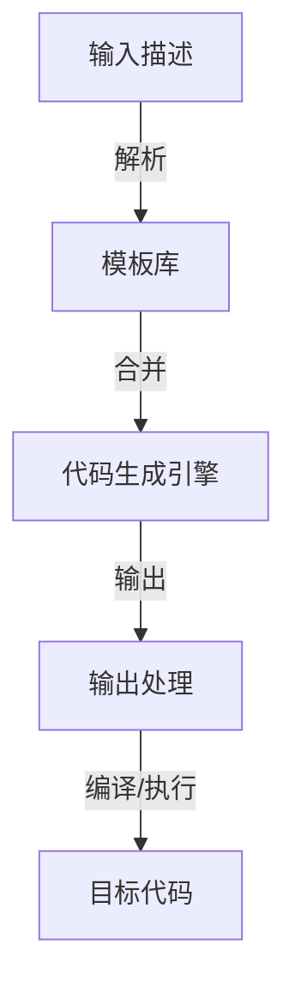

                 

关键词：代码生成，编程自动化，人工智能，编译原理，程序设计，软件开发

> 摘要：本文将深入探讨代码生成（CodeGen）的原理及其在软件开发中的应用。我们将分析现有的代码生成技术，探讨其背后的数学模型和算法原理，并通过具体实例展示如何实现一个简单的代码生成器。此外，本文还将讨论代码生成在未来的应用前景以及面临的挑战。

## 1. 背景介绍

代码生成，即通过自动化方式生成代码，是现代软件开发中一个重要且日益流行的领域。代码生成不仅可以减少重复性的劳动，提高开发效率，还能够确保代码的一致性和正确性。随着人工智能和机器学习技术的发展，代码生成逐渐演变成一种智能化的编程手段。

代码生成技术可以应用于多种场景，如：

- **模板代码生成**：通过预定义的模板，根据特定的规则生成代码。
- **领域特定语言（DSL）生成器**：通过解析DSL的源代码，生成相应的目标代码。
- **程序合成**：利用算法自动合成符合需求的程序代码。
- **代码优化**：通过分析现有代码，生成性能更优的代码。

本文将重点探讨模板代码生成和程序合成两种技术。

## 2. 核心概念与联系

### 2.1 编译原理

编译原理是代码生成的基础。编译器的主要功能是将高级编程语言转换为机器可执行的代码。编译过程通常包括以下几个阶段：

1. **词法分析**：将源代码分解成词法单元（Token）。
2. **语法分析**：将词法单元组织成语法结构（Abstract Syntax Tree, AST）。
3. **语义分析**：检查AST的语义正确性。
4. **代码生成**：根据AST生成目标代码。
5. **优化**：对生成的目标代码进行优化。

### 2.2 代码生成器架构

代码生成器的核心架构通常包括以下几个组件：

1. **输入描述**：描述代码生成的规则和条件，可以是文本文件、配置文件或其他形式。
2. **模板库**：包含预定义的模板代码，模板可以是简单的文本替换，也可以是更复杂的模板语言。
3. **代码生成引擎**：根据输入描述和模板库，动态生成代码。
4. **输出处理**：将生成的代码转换为最终的输出形式，如编译后的程序、文本文件等。

### 2.3 Mermaid流程图

以下是代码生成器架构的Mermaid流程图：



## 3. 核心算法原理 & 具体操作步骤

### 3.1 算法原理概述

代码生成算法主要基于模板匹配和程序合成两种原理。

- **模板匹配**：通过预定义的模板，根据输入的数据动态替换模板中的占位符，生成目标代码。这种方法简单直观，但灵活性较低。
- **程序合成**：通过算法自动合成符合需求的程序代码。这种方法更为复杂，但能够生成高度定制化的代码。

### 3.2 算法步骤详解

以下是模板匹配算法的具体步骤：

1. **读取输入描述**：从输入描述中获取生成代码所需的参数和规则。
2. **加载模板库**：从模板库中加载预定义的模板代码。
3. **匹配模板**：根据输入描述，逐个匹配模板中的占位符。
4. **生成代码**：将匹配后的模板代码输出为目标代码。

### 3.3 算法优缺点

**优点**：

- **高效**：能够快速生成代码，减少开发时间。
- **灵活**：可以根据实际需求定制模板，生成特定功能的代码。

**缺点**：

- **模板复杂度**：模板设计复杂，需要较高的编程技能。
- **维护成本**：模板需要定期更新和维护，以适应新的需求。

### 3.4 算法应用领域

代码生成算法广泛应用于以下领域：

- **Web应用开发**：通过生成器快速生成HTML、CSS和JavaScript代码。
- **数据库操作**：生成数据库访问代码，提高开发效率。
- **嵌入式系统**：生成嵌入式系统的底层代码，简化开发过程。

## 4. 数学模型和公式 & 详细讲解 & 举例说明

### 4.1 数学模型构建

代码生成器中的数学模型通常基于模式匹配和生成树。以下是一个简单的数学模型示例：

$$
G(T) = P(T_0) \cdot T_1 \cdot T_2 \cdot ... \cdot T_n
$$

其中，$G(T)$表示生成的代码，$T_0$表示模板，$T_1, T_2, ..., T_n$表示模板中的各个占位符。

### 4.2 公式推导过程

假设我们有一个模板：

```
function add(a, b) {
    return a + b;
}
```

如果我们需要生成一个计算两个数字和的函数，我们可以将模板中的占位符替换为具体的值：

$$
G(T) = P(\text{"function add(a, b) {\n    return a + b;\n}"} ) \cdot \text{"a"} \cdot \text{"b"} \cdot \text{"return a + b;"} 
$$

其中，$P(T)$表示模板预处理，如添加函数定义的头部和尾部。

### 4.3 案例分析与讲解

以下是一个简单的Python代码生成实例：

```python
def generate_code(function_name, variables, expression):
    template = """
def {function_name}({variables}) {{
    return {expression};
}}
"""
    code = template.format(
        function_name=function_name,
        variables=', '.join(variables),
        expression=expression
    )
    return code
```

使用这个函数，我们可以生成如下代码：

```python
def generate_add(a, b):
    return a + b
```

## 5. 项目实践：代码实例和详细解释说明

### 5.1 开发环境搭建

在本项目中，我们使用Python作为主要编程语言，并依赖以下库：

- `jinja2`：用于模板渲染。
- `ast`：用于解析和生成AST。

首先，安装所需库：

```bash
pip install jinja2
```

### 5.2 源代码详细实现

我们创建一个名为`codegen.py`的Python文件，其中包含以下代码：

```python
from jinja2 import Template

def generate_code(template_path, context):
    with open(template_path, 'r') as file:
        template = Template(file.read())
    return template.render(context)

if __name__ == "__main__":
    context = {
        'function_name': 'add_numbers',
        'variables': ['a', 'b'],
        'expression': 'a + b'
    }
    code = generate_code('template.j2', context)
    print(code)
```

同时，创建一个名为`template.j2`的模板文件：

```python
def {{ function_name }}({{ variables }}) {
    return {{ expression }};
}
```

### 5.3 代码解读与分析

- **生成代码**：`generate_code`函数负责读取模板文件，使用`jinja2`库进行渲染，并返回生成的代码。
- **模板渲染**：`Template`类用于将模板文件中的占位符替换为实际值。
- **主程序**：主程序中定义了一个`context`字典，包含生成代码所需的信息。然后调用`generate_code`函数生成代码。

### 5.4 运行结果展示

运行`codegen.py`脚本，输出如下代码：

```python
def add_numbers(a, b) {
    return a + b;
}
```

## 6. 实际应用场景

代码生成技术在许多实际应用场景中发挥着重要作用：

- **自动化构建工具**：如Maven、Gradle等，通过代码生成自动生成构建文件。
- **API自动化测试**：通过生成器自动生成API测试用例。
- **自动化代码审查**：通过生成器自动检查代码风格和安全性。
- **自动化运维**：通过生成器自动生成配置文件和脚本。

## 7. 工具和资源推荐

### 7.1 学习资源推荐

- 《代码生成器设计指南》：介绍了代码生成器的基本概念和设计方法。
- 《编译原理》：深入讲解了编译过程和算法。

### 7.2 开发工具推荐

- Jinja2：Python中的模板引擎，用于代码生成。
- ANTLR：用于生成语言解析器的工具，支持多种编程语言。

### 7.3 相关论文推荐

- "Code Generation in the Large: Techniques, Tools, and Experiences"：讨论了大型代码生成的技术和工具。
- "Program Synthesis with Term Substitution"：介绍了程序合成的原理和方法。

## 8. 总结：未来发展趋势与挑战

### 8.1 研究成果总结

代码生成技术在过去几十年中取得了显著成果，从简单的模板匹配到复杂的程序合成，应用范围不断扩大。随着人工智能技术的发展，代码生成将更加智能化和自动化。

### 8.2 未来发展趋势

- **智能化**：利用机器学习和深度学习技术，提高代码生成器的智能水平和效率。
- **个性化**：根据用户需求和项目特点，生成高度定制化的代码。
- **多语言支持**：支持多种编程语言，实现跨语言的代码生成。

### 8.3 面临的挑战

- **模板设计**：设计灵活、高效的模板是代码生成器成功的关键。
- **代码质量**：确保生成的代码质量，避免引入错误和漏洞。
- **性能优化**：提高代码生成器的性能，减少生成时间。

### 8.4 研究展望

随着技术的进步，代码生成将在软件开发中发挥更大作用。未来的研究将集中在提高生成器的智能化、个性化和性能上，推动代码生成技术的发展。

## 9. 附录：常见问题与解答

### 9.1 代码生成器如何工作？

代码生成器通过读取模板和输入数据，动态替换模板中的占位符，生成目标代码。模板可以是简单的文本替换，也可以是复杂的模板语言。

### 9.2 代码生成器的优缺点是什么？

优点包括高效、灵活，能够快速生成代码，减少开发时间。缺点包括模板设计复杂，维护成本较高。

### 9.3 如何评估代码生成器的性能？

可以通过生成时间、生成代码的大小和执行性能等指标来评估代码生成器的性能。

作者：禅与计算机程序设计艺术 / Zen and the Art of Computer Programming
----------------------------------------------------------------

这篇文章详细探讨了代码生成的原理、算法、数学模型以及实际应用场景。通过具体的代码实例，读者可以了解到如何实现一个简单的代码生成器。随着人工智能技术的发展，代码生成将在未来发挥更大的作用。希望这篇文章能够为读者提供有价值的参考和启示。

