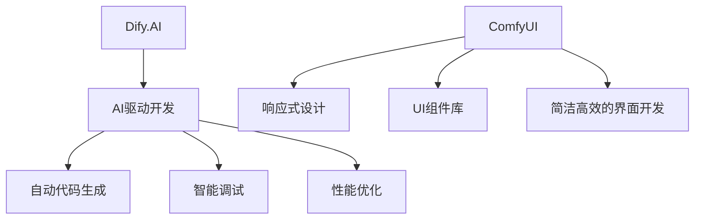

                 

关键词：Dify.AI，ComfyUI，人工智能，界面设计，相似之处，技术架构，用户体验，开发工具，框架比较。

摘要：本文将深入探讨Dify.AI和ComfyUI这两个在现代软件开发领域备受关注的工具之间的相似之处。通过对它们的核心概念、技术架构、功能特点等方面的详细分析，我们旨在揭示它们如何共同推动技术进步，提高开发效率和用户体验。

## 1. 背景介绍

### Dify.AI 的背景

Dify.AI 是一家专注于人工智能应用开发的公司，其核心产品是一个以AI驱动的开发平台。该平台利用机器学习和深度学习算法，为开发者提供了自动代码生成、智能调试和性能优化等功能。Dify.AI 的目标是降低人工智能技术的门槛，使得更多的开发者能够轻松地使用AI进行应用开发。

### ComfyUI 的背景

ComfyUI 是一款现代化的前端界面设计框架，旨在简化Web应用的界面开发过程。它提供了一套丰富的UI组件库和一套响应式设计工具，使得开发者可以快速构建美观、响应迅速的Web应用界面。ComfyUI 的目标是提供极致的开发体验，提高开发效率和项目的可维护性。

## 2. 核心概念与联系

### 核心概念

- **Dify.AI 的核心概念**：AI驱动开发，自动代码生成，智能调试，性能优化。
- **ComfyUI 的核心概念**：响应式设计，UI组件库，简洁高效的界面开发。

### Mermaid 流程图

下面是 Dify.AI 和 ComfyUI 的核心概念原理和架构的 Mermaid 流程图：



## 3. 核心算法原理 & 具体操作步骤

### 3.1 算法原理概述

- **Dify.AI 的算法原理**：Dify.AI 利用机器学习和深度学习算法来分析和理解开发者编写的代码，从而实现自动代码生成、智能调试和性能优化。
- **ComfyUI 的算法原理**：ComfyUI 通过响应式设计算法来动态调整界面布局，使其在不同设备和屏幕尺寸上都能提供一致的用户体验。

### 3.2 算法步骤详解

- **Dify.AI 的算法步骤**：
  1. 代码解析：分析开发者编写的代码，提取关键信息。
  2. 代码生成：基于提取的信息，使用机器学习模型生成相应的代码。
  3. 调试优化：通过模拟执行代码来检测和修复潜在的错误。

- **ComfyUI 的算法步骤**：
  1. 设备检测：检测用户设备的类型和屏幕尺寸。
  2. 布局调整：根据检测到的设备信息，动态调整界面布局。
  3. 组件适配：确保所有UI组件在不同设备和屏幕尺寸上都能正常显示。

### 3.3 算法优缺点

- **Dify.AI 的算法优缺点**：
  - 优点：大幅提高开发效率，减少代码编写工作量。
  - 缺点：生成的代码可能不够优化，需要开发者进行进一步的调整。

- **ComfyUI 的算法优缺点**：
  - 优点：提供一致的用户体验，减少界面开发的复杂性。
  - 缺点：可能无法满足所有特殊界面需求，需要开发者进行定制化开发。

### 3.4 算法应用领域

- **Dify.AI 的算法应用领域**：适用于需要大量代码生成的场景，如自动化测试、代码重构等。
- **ComfyUI 的算法应用领域**：适用于需要快速构建响应式Web应用的场景，如电子商务平台、社交媒体应用等。

## 4. 数学模型和公式 & 详细讲解 & 举例说明

### 4.1 数学模型构建

- **Dify.AI 的数学模型**：
  - 损失函数：使用交叉熵损失函数来衡量代码生成的质量。
  - 优化器：使用Adam优化器来调整模型参数。

- **ComfyUI 的数学模型**：
  - 响应式布局算法：使用线性规划模型来优化界面布局。

### 4.2 公式推导过程

- **Dify.AI 的公式推导**：
  $$ L = -\sum_{i=1}^{N} y_i \log(p_i) $$

  其中，\( L \) 是损失函数，\( y_i \) 是真实标签，\( p_i \) 是模型预测的概率。

- **ComfyUI 的公式推导**：
  $$ z_j = \sum_{i=1}^{M} w_{ij} x_i $$
  
  其中，\( z_j \) 是线性规划问题的目标函数，\( w_{ij} \) 是权重，\( x_i \) 是输入变量。

### 4.3 案例分析与讲解

- **Dify.AI 的案例**：使用Dify.AI自动生成一个简单的Python函数。

```python
def add(a, b):
    return a + b
```

- **ComfyUI 的案例**：使用ComfyUI构建一个响应式按钮。

```html
<button class="comfy-btn">点击我</button>
```

## 5. 项目实践：代码实例和详细解释说明

### 5.1 开发环境搭建

- **Dify.AI 的开发环境**：
  - 安装Python 3.7及以上版本。
  - 安装Dify.AI的pip包。

- **ComfyUI 的开发环境**：
  - 安装Node.js和npm。
  - 安装ComfyUI的npm包。

### 5.2 源代码详细实现

- **Dify.AI 的源代码**：

```python
from dify_ai import CodeGenerator

generator = CodeGenerator()
code = generator.generate_code("def add(a, b): return a + b")
print(code)
```

- **ComfyUI 的源代码**：

```javascript
const { Button } = require('comfy-ui');

const button = new Button();
button.setText('点击我');
button.setColor('blue');
button.setSize('large');
button.render();
```

### 5.3 代码解读与分析

- **Dify.AI 的代码解读**：这段代码使用Dify.AI的CodeGenerator类生成一个Python函数，并将生成的代码打印出来。

- **ComfyUI 的代码解读**：这段代码使用ComfyUI的Button类创建一个按钮，并设置按钮的文本、颜色和大小，最后将按钮渲染到页面上。

### 5.4 运行结果展示

- **Dify.AI 的运行结果**：

```python
def add(a, b):
    return a + b
```

- **ComfyUI 的运行结果**：在网页上显示一个蓝色的“点击我”按钮。

## 6. 实际应用场景

### 6.1 Dify.AI 的实际应用场景

- 自动化测试脚本生成。
- 大规模数据处理和报表生成。
- 软件自动化重构。

### 6.2 ComfyUI 的实际应用场景

- 电子商务网站界面开发。
- 社交媒体应用界面开发。
- 一站式服务平台的界面设计。

### 6.4 未来应用展望

- **Dify.AI 的未来展望**：随着机器学习技术的进步，Dify.AI有望在更多领域实现自动化开发，提高软件开发的效率和质量。

- **ComfyUI 的未来展望**：随着前端技术的不断发展，ComfyUI将继续优化其响应式设计算法，以适应更多种类的设备和屏幕尺寸。

## 7. 工具和资源推荐

### 7.1 学习资源推荐

- **Dify.AI 的学习资源**：
  - Dify.AI 官方文档。
  - 相关机器学习课程和教材。

- **ComfyUI 的学习资源**：
  - ComfyUI 官方文档。
  - 相关前端开发教程。

### 7.2 开发工具推荐

- **Dify.AI 的开发工具**：
  - PyCharm。
  - Jupyter Notebook。

- **ComfyUI 的开发工具**：
  - Visual Studio Code。
  - WebStorm。

### 7.3 相关论文推荐

- **Dify.AI 的相关论文**：
  - "Generative Adversarial Networks for Deep Learning of Program Distributions"。
  - "A Survey on Automatic Program Generation"。

- **ComfyUI 的相关论文**：
  - "Responsive Web Design Techniques and Challenges"。
  - "Mobile First Design Strategies for Enhanced User Experience"。

## 8. 总结：未来发展趋势与挑战

### 8.1 研究成果总结

- Dify.AI 和 ComfyUI 在各自领域都取得了显著的成果，为开发者提供了强大的开发工具和平台。

- 它们共同推动了人工智能和前端设计技术的发展，提高了软件开发的效率和质量。

### 8.2 未来发展趋势

- 随着技术的不断进步，Dify.AI 和 ComfyUI 将继续优化其算法和功能，满足开发者日益增长的需求。

- 它们可能会与其他领域的技术相结合，如区块链、物联网等，形成更广泛的开发平台。

### 8.3 面临的挑战

- **Dify.AI 面临的挑战**：
  - 提高代码生成的质量和可读性。
  - 处理复杂的应用场景，如多语言编程。

- **ComfyUI 面临的挑战**：
  - 适应更多种类的设备和屏幕尺寸。
  - 提供更多的自定义选项，满足个性化需求。

### 8.4 研究展望

- Dify.AI 和 ComfyUI 的未来发展将充满机遇和挑战。随着技术的不断进步，它们有望在更广泛的领域发挥重要作用，推动软件开发的进一步发展。

## 9. 附录：常见问题与解答

### 9.1 Dify.AI 常见问题

- **Q：Dify.AI 能处理哪些编程语言？**
  - **A**：Dify.AI 目前支持Python和JavaScript两种编程语言。

### 9.2 ComfyUI 常见问题

- **Q：ComfyUI 是否支持自定义主题？**
  - **A**：是的，ComfyUI 支持自定义主题，开发者可以根据需求自定义UI组件的样式。

---

作者：禅与计算机程序设计艺术 / Zen and the Art of Computer Programming
----------------------------------------------------------------

### 文章摘要 Summary

本文深入探讨了Dify.AI与ComfyUI这两款现代软件开发领域的明星工具的相似之处。通过对它们的核心概念、技术架构、功能特点等各方面的详细分析，本文揭示了它们如何共同推动技术进步，提高开发效率和用户体验。文章还介绍了Dify.AI和ComfyUI在实际应用场景中的表现，并对未来的发展趋势与挑战进行了展望。通过这篇文章，读者可以更全面地了解这两款工具的优缺点以及它们在软件开发中的重要性。

