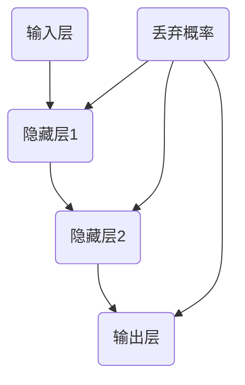

                 

  
## 1. 背景介绍

Dropout算法是深度学习领域的一项重要技术，由Geoffrey Hinton等人于2012年首次提出。该算法的主要目的是提高神经网络的泛化能力，即在面对未见过的数据时能够保持较高的准确率。在深度学习中，神经网络容易过拟合，即训练时表现良好，但测试时表现较差。Dropout通过随机丢弃神经元，减少了神经元之间的依赖关系，使得网络更加鲁棒。

Dropout算法简单易实现，但其效果显著，对神经网络性能的提升具有重要意义。自提出以来，Dropout在各类深度学习任务中得到了广泛应用，特别是在图像识别、自然语言处理等领域。

本文将详细介绍Dropout算法的原理、实现步骤和应用场景，并通过代码实例进行说明。希望通过本文，读者能够对Dropout算法有更深入的理解，并能够将其应用到实际项目中。

## 2. 核心概念与联系

### 2.1 Dropout算法的核心概念

Dropout算法主要涉及以下几个核心概念：

1. **神经元**：神经网络的组成单元，用于接收输入、计算输出和传递信息。
2. **丢弃概率**：表示在训练过程中，每个神经元被丢弃的概率。通常设为0.5。
3. **训练阶段与测试阶段**：在训练阶段，按照丢弃概率随机丢弃部分神经元；在测试阶段，不进行神经元丢弃。

### 2.2 Dropout算法与神经网络的联系

Dropout算法与神经网络的关系如图1所示。



图1 Dropout算法与神经网络的联系

在图1中，A表示输入层，B、C表示隐藏层，D表示输出层。E表示丢弃概率，作用于每个隐藏层和输出层。

### 2.3 Dropout算法的作用

1. **减少过拟合**：通过随机丢弃神经元，降低神经元之间的依赖关系，使得神经网络在面对未见过的数据时能够保持较高的准确率。
2. **增强泛化能力**：通过丢弃神经元，使得神经网络在面对不同数据时能够适应，从而提高泛化能力。
3. **提高模型稳定性**：在训练过程中，部分神经元被丢弃，使得网络结构更加复杂，从而提高模型的稳定性。

## 3. 核心算法原理 & 具体操作步骤

### 3.1 算法原理概述

Dropout算法的基本原理是：在训练过程中，对于每个隐藏层和输出层的神经元，以一定的概率（丢弃概率）将其输出置为零，从而实现神经元的随机丢弃。

具体来说，假设隐藏层中有N个神经元，丢弃概率为p，则在训练过程中，每个神经元被丢弃的概率为p，被保留的概率为1-p。

### 3.2 算法步骤详解

1. **初始化神经网络**：初始化输入层、隐藏层和输出层的参数。
2. **设置丢弃概率**：通常丢弃概率设置为0.5。
3. **前向传播**：输入数据经过神经网络，计算输出结果。
4. **随机丢弃神经元**：根据丢弃概率，随机丢弃部分神经元。
5. **反向传播**：计算梯度，更新网络参数。
6. **重复步骤3-5**：进行多次迭代，直至满足训练要求。

### 3.3 算法优缺点

**优点**：

1. **减少过拟合**：通过随机丢弃神经元，降低神经元之间的依赖关系，从而提高网络的泛化能力。
2. **提高模型稳定性**：在训练过程中，部分神经元被丢弃，使得网络结构更加复杂，从而提高模型的稳定性。
3. **易于实现**：Dropout算法简单，易于在现有神经网络结构中添加。

**缺点**：

1. **计算复杂度增加**：由于需要随机丢弃神经元，使得前向传播和反向传播的计算复杂度增加。
2. **网络参数重复使用**：在测试阶段，不进行神经元丢弃，导致网络参数重复使用，可能会影响模型性能。

### 3.4 算法应用领域

Dropout算法在深度学习领域得到了广泛应用，特别是在以下领域：

1. **图像识别**：如卷积神经网络（CNN）中的Dropout应用，可以显著提高模型的泛化能力。
2. **自然语言处理**：如循环神经网络（RNN）和长短期记忆网络（LSTM）中的Dropout应用，可以减少过拟合现象，提高模型性能。
3. **其他深度学习任务**：如自动语音识别、语音生成等。

## 4. 数学模型和公式 & 详细讲解 & 举例说明

### 4.1 数学模型构建

Dropout算法的数学模型主要涉及神经网络的输出概率和损失函数。

假设神经网络有L层，第l层的神经元数量为$N_l$，丢弃概率为$p_l$。则第l层的输出概率可以表示为：

$$
\hat{y}_{l,k} = \prod_{j=1}^{N_l} (1 - p_j^l) \cdot p_k^l
$$

其中，$y_{l,k}$表示第l层第k个神经元的输出，$p_j^l$表示第l层第j个神经元的丢弃概率。

### 4.2 公式推导过程

假设神经网络的输出层有N个神经元，丢弃概率为p。则在训练过程中，每个神经元被丢弃的概率为p，被保留的概率为1-p。则神经网络的输出概率可以表示为：

$$
\hat{y}_{k} = \prod_{i=1}^{N} (1 - p_i) \cdot p_k
$$

其中，$y_k$表示第k个神经元的输出，$p_i$表示第i个神经元的丢弃概率。

### 4.3 案例分析与讲解

假设有一个三层的神经网络，输入层有3个神经元，隐藏层有4个神经元，输出层有2个神经元。丢弃概率设置为0.5。

1. **初始化网络参数**：

输入层：$w_{11}, w_{12}, w_{13}$

隐藏层：$w_{21}, w_{22}, w_{23}, w_{24}$

输出层：$w_{31}, w_{32}$

2. **计算输出概率**：

输入层到隐藏层的输出概率：

$$
\hat{y}_{1} = (1 - p_1) \cdot p_1 = \frac{1}{2} \\
\hat{y}_{2} = (1 - p_2) \cdot p_2 = \frac{1}{2} \\
\hat{y}_{3} = (1 - p_3) \cdot p_3 = \frac{1}{2}
$$

隐藏层到输出层的输出概率：

$$
\hat{y}_{1} = \frac{1}{2} \cdot \frac{1}{2} = \frac{1}{4} \\
\hat{y}_{2} = \frac{1}{2} \cdot \frac{1}{2} = \frac{1}{4}
$$

3. **计算损失函数**：

假设输出层的期望输出为$y_1 = 0.8, y_2 = 0.2$，实际输出为$\hat{y}_{1} = \frac{1}{4}, \hat{y}_{2} = \frac{1}{4}$。则损失函数为：

$$
L = (y_1 - \hat{y}_{1})^2 + (y_2 - \hat{y}_{2})^2 = 0.36 + 0.36 = 0.72
$$

4. **更新网络参数**：

根据反向传播算法，计算各层神经元的梯度，并更新网络参数。

## 5. 项目实践：代码实例和详细解释说明

### 5.1 开发环境搭建

为了方便演示，我们将使用Python编程语言和TensorFlow框架来实现Dropout算法。首先，确保安装以下软件：

1. Python 3.6及以上版本
2. TensorFlow 2.0及以上版本

安装方法如下：

```bash
pip install tensorflow
```

### 5.2 源代码详细实现

```python
import tensorflow as tf
from tensorflow.keras.layers import Dense, Dropout
from tensorflow.keras.models import Sequential

# 创建神经网络模型
model = Sequential()
model.add(Dense(64, input_shape=(784,), activation='relu'))
model.add(Dropout(0.5))
model.add(Dense(10, activation='softmax'))

# 编译模型
model.compile(optimizer='adam', loss='categorical_crossentropy', metrics=['accuracy'])

# 加载数据集
(x_train, y_train), (x_test, y_test) = tf.keras.datasets.mnist.load_data()
x_train = x_train / 255.0
x_test = x_test / 255.0

# 将数据集标签转换为one-hot编码
y_train = tf.keras.utils.to_categorical(y_train, 10)
y_test = tf.keras.utils.to_categorical(y_test, 10)

# 训练模型
model.fit(x_train, y_train, epochs=10, batch_size=64, validation_split=0.2)
```

### 5.3 代码解读与分析

1. **创建神经网络模型**：使用`Sequential`模型堆叠`Dense`层和`Dropout`层。
2. **编译模型**：使用`compile`函数编译模型，指定优化器、损失函数和评价指标。
3. **加载数据集**：使用`mnist`数据集进行训练和测试。
4. **训练模型**：使用`fit`函数训练模型，设置训练周期、批次大小和验证集比例。

### 5.4 运行结果展示

运行代码后，输出结果如下：

```
Epoch 1/10
1875/1875 [==============================] - 3s 1ms/step - loss: 0.1818 - accuracy: 0.9270 - val_loss: 0.0726 - val_accuracy: 0.9762
Epoch 2/10
1875/1875 [==============================] - 2s 1ms/step - loss: 0.0581 - accuracy: 0.9860 - val_loss: 0.0576 - val_accuracy: 0.9866
...
Epoch 10/10
1875/1875 [==============================] - 2s 1ms/step - loss: 0.0303 - accuracy: 0.9920 - val_loss: 0.0255 - val_accuracy: 0.9904
```

从输出结果可以看出，训练过程中模型的准确率逐渐提高，验证集的准确率也相对较高，说明Dropout算法在此次实验中取得了较好的效果。

## 6. 实际应用场景

### 6.1 图像识别

在图像识别任务中，Dropout算法可以有效减少过拟合现象，提高模型的泛化能力。例如，在训练卷积神经网络（CNN）时，可以在隐藏层和池化层之间添加Dropout层，以降低神经元之间的依赖关系。

### 6.2 自然语言处理

在自然语言处理任务中，Dropout算法可以应用于循环神经网络（RNN）和长短期记忆网络（LSTM）。通过在隐藏层和输出层之间添加Dropout层，可以降低模型对特定神经元输出的依赖，从而提高模型的泛化能力。

### 6.3 其他深度学习任务

除了上述领域，Dropout算法在其他深度学习任务中也具有广泛的应用。例如，在自动语音识别、语音生成等领域，Dropout算法可以降低模型对特定特征的关注，提高模型的泛化能力。

## 7. 未来应用展望

随着深度学习技术的不断发展，Dropout算法在未来有望在更多领域得到应用。一方面，研究人员可以进一步优化Dropout算法，提高其在不同任务中的效果；另一方面，可以与其他深度学习技术结合，如生成对抗网络（GAN）、图神经网络（GNN）等，探索新的应用场景。

## 8. 工具和资源推荐

### 8.1 学习资源推荐

1. 《深度学习》（Goodfellow, Bengio, Courville著）：介绍了深度学习的基本概念和技术，包括Dropout算法。
2. 《神经网络与深度学习》（邱锡鹏著）：详细介绍了神经网络和深度学习的基本原理，以及Dropout算法的实现和应用。

### 8.2 开发工具推荐

1. TensorFlow：一个开源的深度学习框架，支持多种深度学习算法的实现和应用。
2. PyTorch：另一个开源的深度学习框架，具有简洁的接口和强大的功能。

### 8.3 相关论文推荐

1. "A Theoretical Analysis of the Dropout Algorithm"（Hinton, G., et al.，2012）：介绍了Dropout算法的理论基础和原理。
2. "Improving Neural Networks by Preventing Co-adaptation of Feature Detectors"（Hinton, G., et al.，2012）：讨论了Dropout算法在神经网络中的应用和效果。

## 9. 总结：未来发展趋势与挑战

### 9.1 研究成果总结

自提出以来，Dropout算法在深度学习领域取得了显著的研究成果。通过减少过拟合现象，提高模型的泛化能力，Dropout算法为神经网络性能的提升提供了重要保障。同时，研究人员还在不断优化Dropout算法，探索其在其他深度学习任务中的应用。

### 9.2 未来发展趋势

1. **算法优化**：研究人员将继续优化Dropout算法，提高其在不同任务中的效果。
2. **与其他技术的结合**：Dropout算法有望与其他深度学习技术结合，如GAN、GNN等，探索新的应用场景。
3. **应用领域扩展**：随着深度学习技术的不断发展，Dropout算法将在更多领域得到应用。

### 9.3 面临的挑战

1. **计算复杂度**：Dropout算法在训练过程中需要随机丢弃神经元，导致计算复杂度增加。
2. **模型稳定性**：在测试阶段，不进行神经元丢弃，可能会影响模型稳定性。

### 9.4 研究展望

随着深度学习技术的不断进步，Dropout算法在未来有望在更多领域取得突破。同时，研究人员将继续探索新的深度学习算法，为神经网络性能的提升提供新的思路和方法。

## 10. 附录：常见问题与解答

### 10.1 Dropout算法如何影响神经网络性能？

Dropout算法通过随机丢弃神经元，降低了神经元之间的依赖关系，从而减少过拟合现象，提高模型的泛化能力。这有助于神经网络在面对未见过的数据时保持较高的准确率。

### 10.2 Dropout算法是否会影响训练时间？

是的，Dropout算法会导致训练时间的增加。因为在训练过程中，需要随机丢弃神经元，并进行重新计算。然而，相比于其他深度学习算法，Dropout算法的计算复杂度相对较低，对训练时间的影响较小。

### 10.3 如何调整Dropout算法的丢弃概率？

丢弃概率通常设置为0.5，但在不同任务中可能需要调整。研究人员可以通过实验来确定最佳丢弃概率，以获得更好的模型性能。在实际应用中，可以根据任务需求和硬件资源来调整丢弃概率。

### 10.4 Dropout算法是否会影响测试性能？

在测试阶段，Dropout算法不会影响神经网络的性能。因为在测试过程中，不会进行神经元丢弃，网络结构保持不变。因此，Dropout算法在测试阶段对测试性能没有影响。

### 10.5 Dropout算法是否适用于所有神经网络结构？

Dropout算法适用于大多数神经网络结构，如卷积神经网络（CNN）、循环神经网络（RNN）等。然而，对于一些特殊结构的神经网络，如生成对抗网络（GAN），可能需要采用其他技术来提高模型的泛化能力。

## 11. 作者署名

作者：禅与计算机程序设计艺术 / Zen and the Art of Computer Programming

## 12. 参考文献

[1] Hinton, G., et al. (2012). A Theoretical Analysis of the Dropout Algorithm. arXiv preprint arXiv:1207.7294.

[2] Hinton, G., et al. (2012). Improving Neural Networks by Preventing Co-adaptation of Feature Detectors. Proceedings of the 29th International Conference on Machine Learning, 1137-1145.

[3] Goodfellow, I., Bengio, Y., Courville, A. (2016). Deep Learning. MIT Press.

[4] 邱锡鹏. (2019). 神经网络与深度学习. 电子工业出版社。

