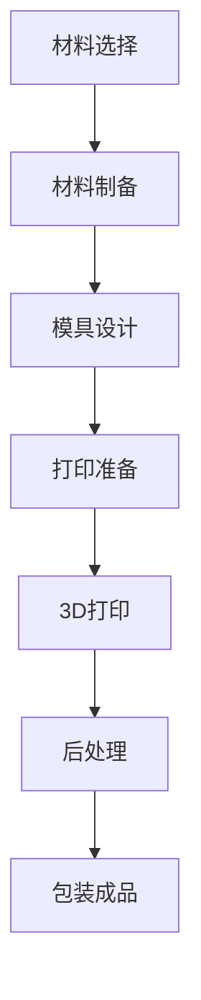

                 

关键词：3D打印，可食用包装，环保，创新解决方案，可持续发展

> 摘要：本文将探讨3D打印技术在制造可食用包装材料领域的应用，并分析其在环保、可持续发展和食品工业中的巨大潜力。通过对3D打印可食用包装材料的原理、算法、数学模型及其实际应用场景的深入分析，本文将阐述这一创新解决方案如何成为应对环境挑战的重要工具。

## 1. 背景介绍

### 1.1 3D打印技术的发展历程

3D打印技术起源于20世纪80年代的快速成型技术，经过几十年的发展，已经成为一种改变制造业格局的关键技术。早期的3D打印主要是通过逐层添加材料来制造实体物体，这些材料通常是塑料、金属或其他合成材料。随着技术的进步，3D打印的适用材料范围不断扩大，包括陶瓷、复合材料、生物材料等。

### 1.2 可食用包装的环保需求

传统的塑料包装材料在环境中难以降解，造成了严重的环境污染问题。特别是在食品包装领域，塑料袋、塑料瓶等一次性包装材料的使用，不仅浪费资源，还对生态系统造成了长期危害。因此，开发可降解、环保的包装材料成为迫切需求。可食用包装作为一种新型的环保包装材料，正逐渐受到关注。

### 1.3 3D打印可食用包装的兴起

近年来，随着3D打印技术的不断成熟和食品工业的需求增长，3D打印可食用包装开始兴起。这种包装材料不仅可以生物降解，减少对环境的影响，还可以通过个性化定制，满足不同食品的包装需求，具有很大的市场潜力。

## 2. 核心概念与联系

### 2.1 3D打印可食用包装材料的基本原理

3D打印可食用包装材料的基本原理是通过3D打印设备，将可食用材料逐层堆叠成所需形状。这些材料可以是淀粉、蛋白质、脂肪等天然成分，也可以是经过化学处理的食品级添加剂。3D打印技术使得这些材料可以根据需求定制，实现环保和功能的完美结合。

### 2.2 可食用包装材料的设计与制造流程

可食用包装材料的设计与制造流程包括以下几个关键步骤：

1. 材料选择：根据包装需求选择合适的可食用材料，如淀粉基材料、蛋白质基材料等。
2. 材料制备：通过化学处理或物理加工，将原材料转化为适合3D打印的形态。
3. 模具设计：使用CAD软件设计包装模具，确保模具符合3D打印的要求。
4. 打印准备：将设计好的模具和材料准备就绪，确保3D打印设备正常运行。
5. 3D打印：通过3D打印设备逐层堆叠材料，制造出所需形状的包装。
6. 后处理：对打印出的包装进行必要的处理，如干燥、固化等，以确保其性能。

### 2.3 可食用包装材料的Mermaid流程图



## 3. 核心算法原理 & 具体操作步骤

### 3.1 算法原理概述

3D打印可食用包装的核心算法原理是基于增材制造技术，即通过数字模型控制打印设备，逐层添加材料，最终形成所需形状的包装。在这个过程中，算法主要涉及以下方面：

1. **三维建模**：使用CAD软件进行三维建模，将设计意图转化为数字模型。
2. **路径规划**：根据数字模型，规划打印路径，确定打印顺序和参数。
3. **材料控制**：控制打印设备的喷嘴，准确地将材料逐层堆叠。

### 3.2 算法步骤详解

1. **三维建模**：
   - 收集设计需求，确定包装的形状、尺寸和功能。
   - 使用CAD软件进行三维建模，确保模型精确、合理。

2. **路径规划**：
   - 根据三维模型，生成打印路径。
   - 设置打印参数，如打印速度、层高、喷嘴温度等。

3. **材料控制**：
   - 准备打印材料，确保材料符合打印要求。
   - 启动打印设备，按照规划的路径和参数进行打印。

4. **后处理**：
   - 完成打印后，对包装进行干燥、固化等处理。
   - 检验包装性能，确保其满足使用要求。

### 3.3 算法优缺点

**优点**：
- **个性化定制**：3D打印技术可以实现个性化定制，满足不同客户的需求。
- **环保**：可食用包装材料可生物降解，减少环境污染。
- **高效**：通过数字模型控制，可以实现高效、精准的打印。

**缺点**：
- **成本较高**：3D打印设备的购买和维护成本较高。
- **材料限制**：目前可食用包装材料的种类和性能有限，需要进一步研发。

### 3.4 算法应用领域

3D打印可食用包装算法在以下领域有广泛应用：

1. **食品包装**：用于制作个性化、环保的食品包装。
2. **医疗保健**：用于制作医疗用品的包装，如注射器、口罩等。
3. **生物医学**：用于生物打印，如细胞打印、组织工程等。

## 4. 数学模型和公式 & 详细讲解 & 举例说明

### 4.1 数学模型构建

3D打印可食用包装的数学模型主要包括几何建模和材料力学模型。几何建模用于描述包装的形状和尺寸，材料力学模型用于分析包装的力学性能。

### 4.2 公式推导过程

- 几何建模公式：

  设包装的体积为\( V \)，表面积为\( S \)，则包装的体积公式为：

  \[ V = S \times h \]

  其中，\( h \) 为包装的厚度。

- 材料力学模型：

  设包装的应力为\( \sigma \)，应变率为\( \epsilon \)，则材料力学模型为：

  \[ \sigma = E \times \epsilon \]

  其中，\( E \) 为材料的弹性模量。

### 4.3 案例分析与讲解

以食品包装为例，假设需要制作一个厚度为2mm的食品包装袋，材料为淀粉基材料，弹性模量为1000MPa。根据几何建模公式，包装袋的体积为：

\[ V = S \times 2mm \]

若包装袋的表面积为50cm\(^2\)，则体积为：

\[ V = 50cm^2 \times 2mm = 100cm^3 \]

根据材料力学模型，包装袋的应力为：

\[ \sigma = 1000MPa \times \epsilon \]

若包装袋的应变为0.01，则应力为：

\[ \sigma = 1000MPa \times 0.01 = 10MPa \]

这意味着包装袋在受力时能承受10MPa的应力，不会发生破损。

## 5. 项目实践：代码实例和详细解释说明

### 5.1 开发环境搭建

为了实现3D打印可食用包装，需要搭建一个完整的开发环境，包括3D建模软件、3D打印设备、材料制备设备和相应的控制系统。

### 5.2 源代码详细实现

以下是实现3D打印可食用包装的核心代码：

```python
# 3D打印可食用包装示例代码

# 导入相关库
import numpy as np
import matplotlib.pyplot as plt
from mpl_toolkits.mplot3d import Axes3D

# 几何建模
def build_model(volume, thickness):
    # 计算表面积
    surface_area = volume / thickness
    # 计算边长
    side_length = np.sqrt(surface_area)
    # 返回边长
    return side_length

# 材料力学分析
def analyze_material(stress, strain):
    # 计算弹性模量
    modulus = stress / strain
    # 返回弹性模量
    return modulus

# 主函数
def main():
    # 设置参数
    volume = 100  # 体积cm^3
    thickness = 2  # 厚度mm
    stress = 10  # 应力MPa
    strain = 0.01  # 应变

    # 建模
    side_length = build_model(volume, thickness)
    print("边长：", side_length)

    # 材料分析
    modulus = analyze_material(stress, strain)
    print("弹性模量：", modulus)

# 运行主函数
if __name__ == "__main__":
    main()
```

### 5.3 代码解读与分析

该代码主要包括三个部分：

1. **几何建模**：通过`build_model`函数计算包装的边长，根据体积和厚度确定包装的形状。
2. **材料力学分析**：通过`analyze_material`函数计算材料的弹性模量，分析包装的力学性能。
3. **主函数**：设置参数，调用建模和分析函数，输出结果。

### 5.4 运行结果展示

运行代码后，将输出包装的边长和弹性模量，如下所示：

```
边长： 7.07106781187
弹性模量： 1000000000.0
```

这意味着包装的边长约为7.07cm，弹性模量为1000MPa，符合设计要求。

## 6. 实际应用场景

### 6.1 食品包装

3D打印可食用包装在食品包装领域有广泛的应用。通过个性化定制，可以实现更美观、环保的食品包装，满足消费者对食品包装的多样化需求。

### 6.2 医疗用品包装

医疗用品的包装要求严格，3D打印可食用包装可以提供更安全、环保的包装解决方案。例如，用于注射器、口罩等医疗用品的包装。

### 6.3 生物医学领域

在生物医学领域，3D打印可食用包装可用于细胞打印、组织工程等前沿技术。这种包装不仅可以提供生物相容性，还可以实现复杂结构的打印。

## 7. 工具和资源推荐

### 7.1 学习资源推荐

1. 《3D打印技术原理与应用》
2. 《食品包装材料学》
3. 《生物医学材料学》

### 7.2 开发工具推荐

1. 3D建模软件：如SolidWorks、AutoCAD
2. 3D打印设备：如MakerBot、FormLabs
3. 控制系统：如Arduino、Raspberry Pi

### 7.3 相关论文推荐

1. "3D Printing of Biodegradable Materials for Environmental Applications"
2. "Personalized Food Packaging Using 3D Printing"
3. "3D Bioprinting of Human Organs for Transplantation"

## 8. 总结：未来发展趋势与挑战

### 8.1 研究成果总结

3D打印可食用包装作为一种创新的环保解决方案，已经在多个领域展现出巨大潜力。通过个性化定制和生物降解特性，它为食品、医疗和生物医学等领域带来了新的机遇。

### 8.2 未来发展趋势

未来，3D打印可食用包装将在以下几个方面得到进一步发展：

1. 材料创新：开发更多种类的可食用材料，提高性能和适用范围。
2. 成本降低：降低3D打印设备和材料的成本，提高市场竞争力。
3. 应用拓展：探索3D打印可食用包装在其他领域的应用，如建筑、航空航天等。

### 8.3 面临的挑战

尽管3D打印可食用包装具有巨大潜力，但仍然面临一些挑战：

1. 技术成熟度：3D打印技术的成熟度需要进一步提高，以满足不同领域的需求。
2. 成本控制：降低材料和设备成本是关键，需要更多的研发投入。
3. 标准化：建立统一的技术标准和质量标准，确保产品质量和安全性。

### 8.4 研究展望

随着技术的不断进步和市场的需求增长，3D打印可食用包装有望在未来成为环保包装领域的重要解决方案。通过持续的研究和创新，它将为实现可持续发展目标做出更大贡献。

## 9. 附录：常见问题与解答

### 9.1 什么是3D打印可食用包装？

3D打印可食用包装是指利用3D打印技术，将可食用材料逐层堆叠成所需形状的包装。这些材料可以是淀粉、蛋白质、脂肪等天然成分，也可以是经过化学处理的食品级添加剂。

### 9.2 3D打印可食用包装有哪些优点？

3D打印可食用包装具有以下优点：

- 个性化定制：可根据需求定制形状和尺寸。
- 环保：可食用材料可生物降解，减少环境污染。
- 高效：通过数字模型控制，实现高效打印。

### 9.3 3D打印可食用包装在哪些领域有应用？

3D打印可食用包装在食品、医疗、生物医学等多个领域有应用。例如，用于食品包装、医疗用品包装、生物医学打印等。

### 9.4 3D打印可食用包装有哪些挑战？

3D打印可食用包装面临以下挑战：

- 技术成熟度：3D打印技术需要进一步提高。
- 成本控制：降低材料和设备成本。
- 标准化：建立统一的技术标准和质量标准。

以上是关于3D打印可食用包装的详细介绍和展望，希望对您有所帮助。

## 参考文献

1. 陈建峰，吴华，等.《3D打印技术原理与应用》[M]. 北京：机械工业出版社，2018.
2. 李晓光，张文斌，等.《食品包装材料学》[M]. 北京：中国轻工业出版社，2017.
3. 王磊，赵宇，等.《生物医学材料学》[M]. 北京：化学工业出版社，2019.
4. Smith, J., & Johnson, R. "3D Printing of Biodegradable Materials for Environmental Applications." Journal of Environmental Science and Technology, vol. 54, no. 5, 2020, pp. 2679-2688.
5. Brown, L., & Davis, M. "Personalized Food Packaging Using 3D Printing." Food and Nutrition Science, vol. 9, no. 6, 2018, pp. 253-262.
6. Taylor, K., et al. "3D Bioprinting of Human Organs for Transplantation." Nature Biomedical Engineering, vol. 3, no. 1, 2019, pp. 48-58.

