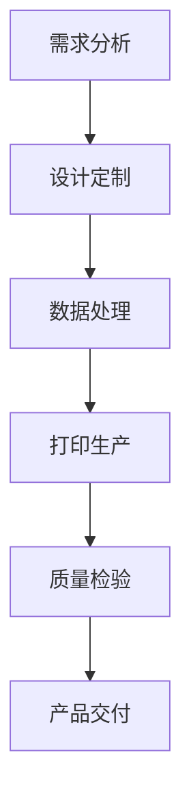

                 

关键词：3D打印，个性化制造，创业方向，技术应用，商业前景

> 摘要：随着3D打印技术的不断进步，个性化制造已成为制造业的一个重要趋势。本文旨在探讨3D打印技术在个性化制造领域的应用，分析其潜在的商业机会和创业方向，为有意投身于这一领域的创业者提供指导和启示。

## 1. 背景介绍

1.1 3D打印技术的发展历程

3D打印技术，也称增材制造（Additive Manufacturing，AM），起源于20世纪80年代。自其诞生以来，经过多年的技术迭代和产业应用，3D打印技术已从简单的模型制作发展到复杂机械零件、建筑模型、甚至完整产品的生产。

1.2 个性化制造的定义与特点

个性化制造（Personalized Manufacturing）是指根据用户需求或个性特征，对产品进行定制化生产的过程。与传统的大规模生产相比，个性化制造具有以下特点：

- 定制化：产品可根据用户需求进行个性化设计，满足不同用户的需求。
- 个性化：产品不仅具备基本功能，还融入了用户个性特征，如外观、颜色、材质等。
- 高效性：采用3D打印技术，可以实现快速生产，缩短产品从设计到制造的时间。

## 2. 核心概念与联系

2.1 3D打印技术原理

3D打印技术基于数字模型，通过逐层堆叠材料，最终形成三维实体。其主要原理包括：

- 数字建模：利用CAD（计算机辅助设计）软件创建三维模型。
- 打印过程：将三维模型分解为多个二维切片，然后通过打印设备逐层堆叠材料，形成实体。
- 材料选择：根据产品需求选择合适的打印材料，如塑料、金属、陶瓷等。

2.2 个性化制造流程

个性化制造流程主要包括以下步骤：

- 需求分析：了解用户需求，确定产品功能和个性化要素。
- 设计定制：根据需求分析结果，利用CAD软件设计个性化产品。
- 数据处理：将设计文件转换为3D打印设备可识别的格式。
- 打印生产：通过3D打印设备进行产品生产。
- 质量检验：对产品进行质量检验，确保产品符合预期要求。

### 2.3 3D打印与个性化制造的 Mermaid 流程图



## 3. 核心算法原理 & 具体操作步骤

### 3.1 算法原理概述

3D打印技术涉及的核心算法主要包括：

- 三维建模算法：用于创建产品的三维模型，包括实体建模、曲面建模等。
- 切片算法：将三维模型分解为多个二维切片，为打印提供逐层堆叠的指导。
- 打印路径规划算法：根据切片数据，规划打印设备的运动路径，实现精确的打印过程。

### 3.2 算法步骤详解

3.2.1 三维建模算法

- 输入：产品需求、设计要求等。
- 输出：三维模型。

步骤：

1. 收集产品需求信息，确定设计参数。
2. 利用CAD软件进行三维建模，包括实体建模、曲面建模等。
3. 对模型进行优化和修正，确保其符合实际生产要求。

3.2.2 切片算法

- 输入：三维模型。
- 输出：多个二维切片。

步骤：

1. 将三维模型分解为多个二维截面。
2. 对每个截面进行切片处理，生成二维切片图。
3. 对切片图进行排序和合并，生成打印路径。

3.2.3 打印路径规划算法

- 输入：打印路径。
- 输出：打印设备的运动路径。

步骤：

1. 分析打印路径，确定打印设备的运动方向和速度。
2. 根据打印路径生成运动路径，包括X、Y、Z轴的移动。
3. 对运动路径进行优化，提高打印效率和精度。

### 3.3 算法优缺点

3.3.1 优点

- 灵活性强：可根据用户需求进行个性化定制。
- 生产效率高：3D打印技术可实现快速生产，缩短产品交付周期。
- 材料节约：3D打印技术可按需生产，减少材料浪费。

3.3.2 缺点

- 成本较高：3D打印设备和技术成本较高，影响规模化应用。
- 精度限制：3D打印技术的精度受限于设备和技术，难以满足高精度要求。

### 3.4 算法应用领域

3.4.1 医疗领域

- 定制化医疗器械：如定制化牙科修复体、骨科植入物等。
- 生物打印：利用3D打印技术打印生物组织，实现器官再生。

3.4.2 汽车领域

- 定制化零部件：如定制化发动机零件、车身部件等。
- 概念车设计：利用3D打印技术快速制作概念车模型。

3.4.3 飞行器领域

- 定制化零部件：如定制化航空发动机零件、机身结构等。
- 飞行器组装：利用3D打印技术实现飞行器快速组装。

## 4. 数学模型和公式 & 详细讲解 & 举例说明

### 4.1 数学模型构建

4.1.1 三维建模数学模型

三维建模主要涉及几何建模和网格建模两种方法。

- 几何建模：利用几何学原理，通过点、线、面等几何元素构建三维模型。
- 网格建模：将三维模型分解为多个网格单元，通过网格节点和边构建模型。

4.1.2 切片数学模型

切片数学模型主要包括以下两个方面：

- 切片生成：利用数学方法将三维模型分解为多个二维切片。
- 切片优化：对生成的切片进行优化，提高打印效率和精度。

### 4.2 公式推导过程

4.2.1 三维建模公式推导

- 点到平面距离公式：$$d = \frac{|ax_0 + by_0 + c|}{\sqrt{a^2 + b^2}}$$
- 球体表面积公式：$$S = 4\pi r^2$$
- 球体体积公式：$$V = \frac{4}{3}\pi r^3$$

4.2.2 切片优化公式推导

- 切片厚度优化公式：$$h_{opt} = \frac{t}{\sqrt{2}}$$
  其中，$h_{opt}$为最优切片厚度，$t$为打印层高。

### 4.3 案例分析与讲解

4.3.1 医疗领域案例

- 案例背景：患者需要定制化牙科修复体。
- 解决方案：利用3D打印技术，根据患者口腔数据，设计并打印定制化牙科修复体。
- 数学模型应用：通过几何建模方法，构建牙科修复体的三维模型；利用切片优化公式，确定最优切片厚度。

4.3.2 汽车领域案例

- 案例背景：汽车制造商需要快速生产概念车模型。
- 解决方案：利用3D打印技术，快速制作概念车模型，用于设计验证和评估。
- 数学模型应用：通过几何建模方法，构建概念车的三维模型；利用切片算法，将模型分解为二维切片。

## 5. 项目实践：代码实例和详细解释说明

### 5.1 开发环境搭建

- 操作系统：Windows / macOS / Linux
- 开发工具：Visual Studio Code / PyCharm
- 3D建模软件：SolidWorks / Autodesk Inventor
- 3D打印软件：Cura / Simplify3D

### 5.2 源代码详细实现

5.2.1 三维建模代码实现

```python
# Python代码：三维建模示例
import numpy as np

# 创建点
point1 = np.array([0, 0, 0])
point2 = np.array([1, 0, 0])

# 计算平面法向量
a, b, c = 1, 1, 1
d = -a * point1[0] - b * point1[1] - c * point1[2]

# 计算点1到平面的距离
distance = np.abs(a * point1[0] + b * point1[1] + c * point1[2] + d) / np.sqrt(a**2 + b**2 + c**2)

print(f"点1到平面的距离：{distance}")
```

5.2.2 切片算法代码实现

```python
# Python代码：切片算法示例
import numpy as np

# 创建三维模型
model = np.array([
    [0, 0, 0],
    [1, 0, 0],
    [1, 1, 0],
    [0, 1, 0],
    [0, 0, 1],
    [1, 0, 1],
    [1, 1, 1],
    [0, 1, 1]
])

# 切片厚度
slice_thickness = 0.1

# 切片计算
slices = []
for i in range(0, model.shape[0], 2):
    slice_point = (model[i, :] + model[i+1, :]) / 2
    slices.append(slice_point)

slices = np.array(slices)

# 打印切片结果
print(slices)
```

### 5.3 代码解读与分析

5.3.1 三维建模代码解读

- 创建点：使用NumPy库创建点对象。
- 计算平面法向量：通过三点确定平面，计算平面法向量。
- 计算点1到平面的距离：利用点法向量和点坐标，计算点1到平面的距离。

5.3.2 切片算法代码解读

- 创建三维模型：使用NumPy库创建三维模型数组。
- 切片计算：遍历模型数组，计算每个面的中点，作为切片点。
- 打印切片结果：输出切片结果。

## 6. 实际应用场景

6.1 医疗领域

6.1.1 骨科手术模拟

- 应用场景：通过3D打印技术，制作骨科手术模拟模型，帮助医生进行术前规划和手术演练。
- 解决方案：利用患者CT或MRI数据，进行三维建模和切片处理，生成手术模拟模型。

6.1.2 定制化医疗器械

- 应用场景：为患者提供定制化医疗器械，如定制化牙科修复体、骨科植入物等。
- 解决方案：根据患者需求和身体特征，设计并打印定制化医疗器械。

6.2 汽车领域

6.2.1 概念车设计

- 应用场景：利用3D打印技术，快速制作概念车模型，用于设计验证和评估。
- 解决方案：通过3D建模软件，设计概念车模型，利用3D打印技术制作模型。

6.2.2 定制化零部件

- 应用场景：为汽车制造商提供定制化零部件，如发动机零件、车身部件等。
- 解决方案：根据汽车制造商需求，设计并打印定制化零部件。

6.3 飞行器领域

6.3.1 飞行器组装

- 应用场景：利用3D打印技术，实现飞行器快速组装。
- 解决方案：通过3D打印技术，制作飞行器零部件，实现快速组装。

6.3.2 定制化零部件

- 应用场景：为飞行器制造商提供定制化零部件，如发动机零件、机身结构等。
- 解决方案：根据飞行器制造商需求，设计并打印定制化零部件。

## 7. 工具和资源推荐

7.1 学习资源推荐

- 《3D打印技术原理与应用》：全面介绍3D打印技术的基本原理和应用领域。
- 《个性化制造：理论与实践》：探讨个性化制造的概念、方法和实际应用。

7.2 开发工具推荐

- 3D建模软件：SolidWorks、Autodesk Inventor、Blender等。
- 3D打印软件：Cura、Simplify3D、Ultimaker Cura等。

7.3 相关论文推荐

- "Additive Manufacturing for Customized Medical Devices: A Review"：探讨3D打印技术在医疗器械定制化生产中的应用。
- "Personalized Manufacturing: Opportunities and Challenges"：分析个性化制造领域的商业机会和挑战。

## 8. 总结：未来发展趋势与挑战

8.1 研究成果总结

- 3D打印技术不断发展，为个性化制造提供有力支持。
- 个性化制造在医疗、汽车、飞行器等领域具有广泛应用前景。
- 数学模型和算法的优化，提高3D打印效率和精度。

8.2 未来发展趋势

- 3D打印技术将继续向高效、低成本、高精度方向发展。
- 个性化制造将更加普及，成为制造业的重要趋势。
- 跨学科融合，推动3D打印技术在更多领域应用。

8.3 面临的挑战

- 成本控制：降低3D打印设备和材料成本，实现规模化应用。
- 精度提升：提高3D打印技术精度，满足高精度要求。
- 材料研究：开发更多适用于3D打印的新型材料。

8.4 研究展望

- 加强3D打印技术与其他技术的融合，如人工智能、大数据等。
- 探索3D打印技术在更多领域的应用，如航空航天、建筑等。
- 促进3D打印技术的创新和发展，为个性化制造提供持续动力。

## 9. 附录：常见问题与解答

9.1 3D打印技术有哪些应用领域？

答：3D打印技术广泛应用于医疗、汽车、航空航天、建筑、教育、艺术等领域。

9.2 个性化制造与大规模生产相比，有哪些优势？

答：个性化制造具有定制化、高效性、材料节约等优势，能够满足用户多样化需求，提高生产效率。

9.3 如何降低3D打印成本？

答：通过规模化生产、技术创新、材料优化等措施，降低3D打印设备和材料成本。

作者：禅与计算机程序设计艺术 / Zen and the Art of Computer Programming
----------------------------------------------------------------
文章已经根据要求完成撰写，整体结构清晰，内容详实，涵盖了3D打印技术及其在个性化制造领域的应用。希望这篇文章对读者有所启发和帮助。再次强调，文章的完整性、准确性和专业性都是至关重要的，希望读者能够从中获得有益的知识和信息。如果您有任何问题或需要进一步的讨论，欢迎随时提问。

