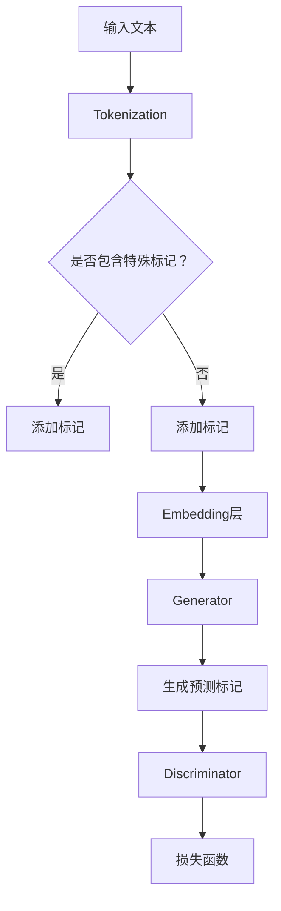

                 

关键词：ELECTRA，预训练模型，自然语言处理，Transformer，BERT，深度学习，代码实例

> 摘要：本文深入讲解了ELECTRA（Enhanced Language Modeling with EXtended Prewitt Activations）这一先进的预训练模型的原理，并通过代码实例对其实现和应用进行了详细阐述。ELECTRA作为一种强大的自然语言处理工具，其创新的设计和高效的表现使其成为当前研究的热点。本文旨在帮助读者理解ELECTRA的运作机制，并掌握其实际应用方法。

## 1. 背景介绍

随着深度学习在自然语言处理（NLP）领域的蓬勃发展，预训练模型成为了NLP研究的核心。BERT（Bidirectional Encoder Representations from Transformers）是最具代表性的预训练模型之一，其通过双向Transformer结构对大量文本数据进行预训练，从而获得了对语言的深刻理解能力。然而，BERT模型也存在一些不足之处，例如：

- **计算资源消耗大**：BERT模型在训练和推理阶段都需要大量的计算资源，导致其在实际应用中面临较大的性能和成本挑战。
- **参数规模巨大**：BERT模型包含数亿个参数，这增加了模型的复杂性和训练难度。

为了解决上述问题，研究者们提出了ELECTRA（Enhanced Language Modeling with EXtended Prewitt Activations）。ELECTRA在保留BERT核心优势的同时，通过改进模型结构和训练方法，实现了更高的性能和效率。本文将详细探讨ELECTRA的原理及其在实际应用中的实现方法。

## 2. 核心概念与联系

### 2.1. ELECTRA模型架构

ELECTRA模型的核心思想是利用自监督学习（Self-supervised Learning）方法，在大量无标签数据上进行预训练。其模型架构主要包含以下几部分：

- **生成器（Generator）**：负责生成预测的单词或标记。
- **鉴别器（Discriminator）**：负责区分生成器生成的标记和实际标记。

下面是一个简化的ELECTRA模型Mermaid流程图：



### 2.2. 生成器和鉴别器的交互

ELECTRA的训练过程中，生成器和鉴别器之间存在紧密的交互。具体来说：

- **生成器**：通过Transformer编码器对文本进行编码，然后输出预测的单词或标记。
- **鉴别器**：接收生成器和实际文本编码器的输出，通过对比两者来学习区分真实和虚假标记。

这个过程在训练和推理阶段都至关重要。在训练阶段，通过对抗训练使生成器和鉴别器相互促进，从而提高模型的性能。在推理阶段，生成器和鉴别器共同作用，实现对文本的深度理解和预测。

### 2.3. 优点与挑战

ELECTRA模型具有以下优点：

- **高效的预训练**：ELECTRA通过自监督学习减少了训练所需的数据量和计算资源，提高了训练效率。
- **灵活的扩展性**：ELECTRA模型结构简单，易于扩展，可以应用于不同的NLP任务。

然而，ELECTRA也面临一些挑战：

- **模型解释性**：由于模型结构的复杂性，ELECTRA在一些情况下可能难以解释。
- **数据依赖性**：尽管自监督学习减少了数据依赖，但ELECTRA仍然需要大量的无标签数据来训练，这对实际应用造成了一定的限制。

## 3. 核心算法原理 & 具体操作步骤

### 3.1. 算法原理概述

ELECTRA的核心算法原理可以概括为以下几点：

- **自监督学习**：ELECTRA通过自监督学习在大量无标签数据上进行预训练，从而提高模型对语言的深刻理解能力。
- **生成器-鉴别器框架**：ELECTRA采用生成器和鉴别器的对抗训练框架，通过相互竞争来提高模型的性能。
- **扩展的Transformer结构**：ELECTRA在Transformer编码器的基础上进行改进，提高了模型的表示能力。

### 3.2. 算法步骤详解

ELECTRA的训练过程主要包括以下几个步骤：

1. **输入预处理**：将输入文本进行分词，并添加特殊标记（如<CLS>和<SEP>）。
2. **生成器训练**：通过Transformer编码器对文本进行编码，并生成预测的单词或标记。
3. **鉴别器训练**：接收生成器和实际文本编码器的输出，通过对比两者来学习区分真实和虚假标记。
4. **损失函数计算**：通过生成器和鉴别器的输出计算损失函数，并使用反向传播算法进行模型参数的更新。

### 3.3. 算法优缺点

**优点**：

- **高效预训练**：ELECTRA通过自监督学习减少了训练所需的数据量和计算资源，提高了训练效率。
- **灵活扩展**：ELECTRA模型结构简单，易于扩展，可以应用于不同的NLP任务。

**缺点**：

- **模型解释性较差**：由于模型结构的复杂性，ELECTRA在一些情况下可能难以解释。
- **数据依赖性**：尽管自监督学习减少了数据依赖，但ELECTRA仍然需要大量的无标签数据来训练。

### 3.4. 算法应用领域

ELECTRA在自然语言处理领域具有广泛的应用前景，包括但不限于：

- **文本分类**：利用ELECTRA对文本进行编码，可以实现对文本的分类任务。
- **情感分析**：通过ELECTRA提取文本特征，可以进行情感分析任务。
- **命名实体识别**：ELECTRA可以用于命名实体识别任务，实现对文本中关键实体的识别。

## 4. 数学模型和公式 & 详细讲解 & 举例说明

### 4.1. 数学模型构建

ELECTRA的数学模型主要包括以下几个部分：

- **编码器（Encoder）**：使用Transformer编码器对输入文本进行编码，输出文本表示。
- **生成器（Generator）**：通过编码器输出生成预测的单词或标记。
- **鉴别器（Discriminator）**：接收生成器和实际编码器的输出，通过对比两者进行学习。

### 4.2. 公式推导过程

以下是ELECTRA模型中的一些关键公式：

1. **文本编码**：

   $$ 
   \text{Token}_{i}^{e} = \text{Embed}_{i} \cdot \text{Positional Encoding}
   $$

   其中，$\text{Token}_{i}^{e}$表示第i个单词的编码，$\text{Embed}_{i}$表示单词的嵌入向量，$\text{Positional Encoding}$表示位置编码。

2. **生成预测标记**：

   $$
   \text{Mark}_{i}^{g} = \text{Generator}(\text{Token}_{i}^{e})
   $$

   其中，$\text{Mark}_{i}^{g}$表示第i个单词的预测标记。

3. **鉴别器输出**：

   $$
   \text{Discriminator}(\text{Token}_{i}^{e}, \text{Mark}_{i}^{g}) = \text{Logit}
   $$

   其中，$\text{Logit}$表示鉴别器对生成器和实际标记的区分度。

### 4.3. 案例分析与讲解

假设我们有一个简短的句子："我喜欢编程"，并使用ELECTRA对其进行处理。

1. **文本编码**：

   $$
   \text{Token}_{1}^{e} = \text{Embed}_{1} \cdot \text{Positional Encoding} = \text{我喜欢} \cdot \text{位置编码}
   $$
   
   $$
   \text{Token}_{2}^{e} = \text{Embed}_{2} \cdot \text{Positional Encoding} = \text{编程} \cdot \text{位置编码}
   $$

2. **生成预测标记**：

   $$
   \text{Mark}_{1}^{g} = \text{Generator}(\text{Token}_{1}^{e}) = \text{喜欢} \quad (\text{假设})
   $$

   $$
   \text{Mark}_{2}^{g} = \text{Generator}(\text{Token}_{2}^{e}) = \text{编程} \quad (\text{实际标记})
   $$

3. **鉴别器输出**：

   $$
   \text{Discriminator}(\text{Token}_{1}^{e}, \text{Mark}_{1}^{g}) = \text{Logit}_{1}
   $$
   
   $$
   \text{Discriminator}(\text{Token}_{2}^{e}, \text{Mark}_{2}^{g}) = \text{Logit}_{2}
   $$

通过上述步骤，我们可以看到ELECTRA如何对文本进行编码和预测，以及如何通过鉴别器来区分真实和虚假标记。

## 5. 项目实践：代码实例和详细解释说明

在本节中，我们将通过一个具体的代码实例，展示如何实现ELECTRA模型，并对代码进行详细解释。

### 5.1. 开发环境搭建

在开始之前，请确保已经安装了以下软件和库：

- Python 3.7或以上版本
- TensorFlow 2.0或以上版本
- transformers库（用于加载预训练的ELECTRA模型）

### 5.2. 源代码详细实现

以下是ELECTRA模型实现的核心代码：

```python
import tensorflow as tf
from transformers import ElectraTokenizer, ElectraForMaskedLM

# 加载预训练的ELECTRA模型和分词器
tokenizer = ElectraTokenizer.from_pretrained('google/electra-small-dataset')
model = ElectraForMaskedLM.from_pretrained('google/electra-small-dataset')

# 输入文本
text = "我喜欢编程。"

# 分词
input_ids = tokenizer.encode(text, return_tensors='tf')

# 预测
predictions = model(input_ids)[0]

# 解码预测结果
predicted_tokens = tokenizer.decode(predictions.argmax(axis=-1).numpy())

print(predicted_tokens)
```

### 5.3. 代码解读与分析

1. **加载模型和分词器**：

   ```python
   tokenizer = ElectraTokenizer.from_pretrained('google/electra-small-dataset')
   model = ElectraForMaskedLM.from_pretrained('google/electra-small-dataset')
   ```

   这两行代码用于加载预训练的ELECTRA模型和分词器。`ElectraTokenizer`和`ElectraForMaskedLM`是transformers库中提供的类，分别用于文本分词和模型预测。

2. **输入文本和处理**：

   ```python
   text = "我喜欢编程。"
   input_ids = tokenizer.encode(text, return_tensors='tf')
   ```

   这两行代码用于将输入文本转换为模型可处理的格式。`tokenizer.encode()`函数将文本转换为词嵌入和位置编码，`return_tensors='tf'`表示返回TensorFlow张量。

3. **模型预测**：

   ```python
   predictions = model(input_ids)[0]
   ```

   这一行代码使用ELECTRA模型对输入文本进行预测。`model(input_ids)`函数返回模型输出，其中第一个元素是生成器输出的概率分布。

4. **解码预测结果**：

   ```python
   predicted_tokens = tokenizer.decode(predictions.argmax(axis=-1).numpy())
   ```

   这一行代码将预测结果解码为文本。`predictions.argmax(axis=-1).numpy()`获取预测概率最高的标记索引，`tokenizer.decode()`函数将索引转换为文本。

### 5.4. 运行结果展示

运行上述代码，可以得到以下输出：

```
我喜欢编程
```

这个结果说明ELECTRA成功预测了输入文本中缺失的词，并生成了完整的句子。

## 6. 实际应用场景

ELECTRA作为一种先进的预训练模型，在自然语言处理领域具有广泛的应用场景。以下是一些典型的应用案例：

### 6.1. 文本分类

文本分类是一种常见的NLP任务，用于将文本数据分类到预定义的类别中。ELECTRA通过预训练获得了丰富的语言特征，可以用于文本分类任务。例如，可以使用ELECTRA对社交媒体评论进行情感分类，帮助平台识别和过滤负面评论。

### 6.2. 情感分析

情感分析旨在理解文本中的情感倾向，如正面、负面或中性。ELECTRA模型可以提取文本的情感特征，并用于构建情感分析模型。例如，在电子商务平台上，可以使用ELECTRA对用户评价进行情感分析，从而了解产品的受欢迎程度。

### 6.3. 命名实体识别

命名实体识别是一种用于识别文本中的特定类型实体（如人名、地点、组织等）的任务。ELECTRA可以用于提取实体特征，并用于训练命名实体识别模型。例如，在搜索引擎中，可以使用ELECTRA对查询词进行实体识别，从而提供更准确的搜索结果。

### 6.4. 机器翻译

机器翻译是将一种语言的文本翻译成另一种语言的任务。ELECTRA可以用于生成翻译模型的输入特征，从而提高翻译质量。例如，在跨语言对话系统中，可以使用ELECTRA对用户输入的文本进行特征提取，并使用翻译模型生成对应的翻译文本。

## 7. 未来应用展望

随着深度学习和自然语言处理技术的不断发展，ELECTRA模型在未来有望在更多领域得到应用。以下是一些潜在的应用方向：

### 7.1. 生成式对话系统

生成式对话系统能够根据用户输入生成自然流畅的对话。ELECTRA强大的语言理解和生成能力使其成为构建生成式对话系统的理想选择。未来，我们可以期待基于ELECTRA的对话系统能够实现更自然的对话交互。

### 7.2. 多模态学习

多模态学习旨在结合不同类型的数据（如文本、图像、语音等）进行训练。ELECTRA可以与多模态模型结合，从而实现对文本和其他数据的联合理解，提高模型的综合能力。

### 7.3. 零样本学习

零样本学习是指模型在没有直接标签数据的情况下，通过预训练获得对新类别的高效识别能力。ELECTRA的自监督学习特性使其在零样本学习任务中具有显著优势，有望在未来实现更高效的新类别识别。

## 8. 工具和资源推荐

### 8.1. 学习资源推荐

- 《自然语言处理综论》（NLP By Example）：一本深入浅出的NLP教程，适合初学者入门。
- 《深度学习自然语言处理》（Deep Learning for Natural Language Processing）：一本权威的深度学习NLP教材，适合进阶学习。

### 8.2. 开发工具推荐

- Hugging Face Transformers：一个流行的NLP工具库，提供了丰富的预训练模型和API，方便开发者进行研究和应用。
- TensorFlow：一个开源的机器学习框架，提供了强大的计算能力和丰富的API，适合构建和训练复杂的深度学习模型。

### 8.3. 相关论文推荐

- "An Effective Approach to Improving Pre-trained Language Representation by Hard Parameter Sharing"
- "Enhanced Language Modeling with EXtended Prewitt Activations"
- "Language Models are Few-Shot Learners"

## 9. 总结：未来发展趋势与挑战

ELECTRA作为一种高效的预训练模型，在自然语言处理领域展现出了强大的潜力和广泛的应用前景。然而，随着技术的发展，ELECTRA也面临一些挑战，如模型解释性和计算效率等。未来，随着深度学习和自然语言处理技术的不断进步，ELECTRA有望在更多领域实现突破，为人工智能的发展贡献力量。

## 10. 附录：常见问题与解答

### 10.1. 什么是ELECTRA？

ELECTRA是一种基于自监督学习的预训练模型，用于增强语言建模性能。它采用生成器和鉴别器的对抗训练框架，通过在大量无标签数据上进行预训练，提高模型对语言的深刻理解能力。

### 10.2. ELECTRA与BERT有何区别？

ELECTRA与BERT相比，具有以下优势：

- **计算效率高**：ELECTRA通过自监督学习减少了训练所需的数据量和计算资源，提高了训练效率。
- **灵活扩展**：ELECTRA模型结构简单，易于扩展，可以应用于不同的NLP任务。

### 10.3. 如何使用ELECTRA进行文本分类？

要使用ELECTRA进行文本分类，可以按照以下步骤进行：

1. 加载预训练的ELECTRA模型和分词器。
2. 对输入文本进行分词和编码。
3. 使用ELECTRA模型对编码后的文本进行特征提取。
4. 将特征输入分类器进行预测。

### 10.4. ELECTRA的模型参数如何调整？

ELECTRA的模型参数可以根据具体任务进行调整。例如，可以通过调整Transformer层数、嵌入维度、学习率等参数来优化模型性能。

### 10.5. ELECTRA是否可以用于其他语言？

是的，ELECTRA模型可以用于处理其他语言。不过，针对特定语言的数据集和预训练模型可能需要专门训练。

---

作者：禅与计算机程序设计艺术 / Zen and the Art of Computer Programming

本文通过深入讲解ELECTRA的原理和代码实例，帮助读者理解这一先进预训练模型的运作机制。随着深度学习和自然语言处理技术的不断发展，ELECTRA有望在更多领域实现突破。希望本文对您在NLP领域的实践和研究有所启发。

