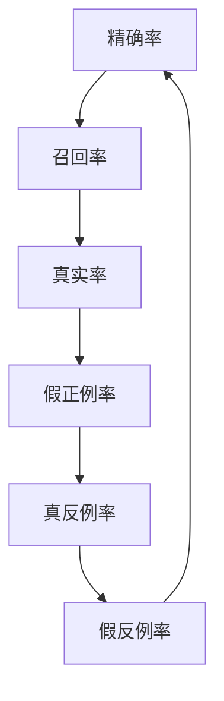

                 

关键词：F1 Score，精确率，召回率，精确率召回率平衡，机器学习，数据挖掘，算法原理，代码实战

## 摘要

本文旨在深入探讨F1 Score这一机器学习与数据挖掘中至关重要的评价指标。我们将首先介绍F1 Score的定义、意义以及其在分类任务中的应用。随后，本文将通过详细的理论讲解和代码实战案例，帮助读者理解F1 Score的计算原理，并掌握如何在实际项目中应用这一指标。文章结构如下：

- 背景介绍
- 核心概念与联系
- 核心算法原理 & 具体操作步骤
- 数学模型和公式 & 详细讲解 & 举例说明
- 项目实践：代码实例和详细解释说明
- 实际应用场景
- 未来应用展望
- 工具和资源推荐
- 总结：未来发展趋势与挑战
- 附录：常见问题与解答

## 1. 背景介绍

在机器学习和数据挖掘中，分类任务是一种常见的任务。分类任务的目标是将数据集中的每个样本分配到预定义的类别中。为了评价分类模型的效果，我们需要使用一些评价指标。精确率（Precision）和召回率（Recall）是其中两个基本且重要的指标。

精确率是指预测为正类的样本中实际为正类的比例，它衡量了模型的准确性。高精确率意味着模型很少将负类误判为正类。

召回率是指实际为正类的样本中被预测为正类的比例，它衡量了模型的完整性。高召回率意味着模型能够捕捉到大部分的正类样本，即使这些样本被误判为负类也在所不惜。

然而，精确率和召回率各有优缺点，单纯依赖单一指标可能会导致模型在某种特定情况下的表现不佳。例如，在某些应用场景中，我们可能更关心是否能够捕捉到所有的正类样本，即使这会导致一些负类样本被误判。相反，在另一些场景中，我们可能更关心模型的准确性，不愿意接受任何误判。

为了综合衡量模型的精确率和召回率，F1 Score应运而生。F1 Score是精确率和召回率的调和平均数，它提供了一个综合评价指标，能够平衡模型的精确性和完整性。F1 Score的值介于0和1之间，值越接近1，表示模型的效果越好。

## 2. 核心概念与联系

在深入讨论F1 Score之前，我们需要理解以下几个核心概念：

### 精确率（Precision）

精确率是指预测为正类的样本中实际为正类的比例。其计算公式如下：

$$
Precision = \frac{TP}{TP + FP}
$$

其中，$TP$ 表示真正例（True Positive），$FP$ 表示假正例（False Positive）。

### 召回率（Recall）

召回率是指实际为正类的样本中被预测为正类的比例。其计算公式如下：

$$
Recall = \frac{TP}{TP + FN}
$$

其中，$TP$ 表示真正例（True Positive），$FN$ 表示假反例（False Negative）。

### 真实率（True Rate）

真实率是指预测为正类的样本中实际为正类的比例。其计算公式如下：

$$
True Rate = \frac{TP}{TP + FN + FP}
$$

### 假正例率（False Positive Rate）

假正例率是指预测为正类的样本中实际为负类的比例。其计算公式如下：

$$
False Positive Rate = \frac{FP}{FP + TN}
$$

其中，$TN$ 表示真反例（True Negative）。

### 真反例率（True Negative Rate）

真反例率是指预测为负类的样本中实际为负类的比例。其计算公式如下：

$$
True Negative Rate = \frac{TN}{TN + FP}
$$

### 假反例率（False Negative Rate）

假反例率是指预测为负类的样本中实际为正类的比例。其计算公式如下：

$$
False Negative Rate = \frac{FN}{FN + TP}
$$

### F1 Score

F1 Score是精确率和召回率的调和平均数，其计算公式如下：

$$
F1 Score = 2 \times \frac{Precision \times Recall}{Precision + Recall}
$$

或者，可以简化为：

$$
F1 Score = \frac{2 \times Precision \times Recall}{Precision + Recall}
$$

F1 Score的值介于0和1之间，值越接近1，表示模型的效果越好。当精确率和召回率相等时，F1 Score达到最大值。

为了更好地理解这些概念，我们可以使用一个Mermaid流程图来展示它们之间的联系：



## 3. 核心算法原理 & 具体操作步骤

### 3.1 算法原理概述

F1 Score是通过精确率和召回率的调和平均数来评估分类模型性能的一种指标。它的计算方法可以简化为：

$$
F1 Score = \frac{2 \times Precision \times Recall}{Precision + Recall}
$$

这个公式意味着，F1 Score对精确率和召回率进行权衡。如果精确率和召回率相等，那么F1 Score达到最大值。当精确率较低时，F1 Score会倾向于召回率；当召回率较低时，F1 Score会倾向于精确率。

### 3.2 算法步骤详解

计算F1 Score的基本步骤如下：

1. **计算精确率（Precision）**：
   $$ Precision = \frac{TP}{TP + FP} $$

2. **计算召回率（Recall）**：
   $$ Recall = \frac{TP}{TP + FN} $$

3. **计算F1 Score**：
   $$ F1 Score = \frac{2 \times Precision \times Recall}{Precision + Recall} $$

### 3.3 算法优缺点

**优点**：

- F1 Score能够综合衡量精确率和召回率，因此在评价分类模型的性能时具有很高的实用价值。
- F1 Score能够有效地平衡模型的精确性和完整性，有助于在不同应用场景下选择最优的模型。

**缺点**：

- F1 Score在极端情况下可能会给出误导性的结果，例如当精确率和召回率差异较大时，F1 Score的变化可能不明显。
- F1 Score对于不同类别样本的重要性没有区分，因此在某些情况下可能不够准确。

### 3.4 算法应用领域

F1 Score广泛应用于多个领域，包括但不限于：

- 医学诊断：用于评估疾病诊断模型的性能，例如癌症筛查。
- 金融风控：用于评估贷款审批模型的准确性，以降低欺诈风险。
- 自然语言处理：用于评估文本分类模型的性能，例如垃圾邮件过滤。

## 4. 数学模型和公式 & 详细讲解 & 举例说明

### 4.1 数学模型构建

F1 Score的数学模型基于精确率和召回率的调和平均数。精确率和召回率的计算依赖于混淆矩阵（Confusion Matrix），这是分类任务中常用的工具，用于展示预测结果与实际结果之间的对比。

混淆矩阵是一个二维表格，包含以下四个基本指标：

- 真正例（True Positive，TP）：实际为正类，预测也为正类的样本数量。
- 假正例（False Positive，FP）：实际为负类，预测为正类的样本数量。
- 真反例（True Negative，TN）：实际为负类，预测也为负类的样本数量。
- 假反例（False Negative，FN）：实际为正类，预测为负类的样本数量。

### 4.2 公式推导过程

F1 Score的计算过程可以分为以下几个步骤：

1. **计算精确率**：

$$
Precision = \frac{TP}{TP + FP}
$$

2. **计算召回率**：

$$
Recall = \frac{TP}{TP + FN}
$$

3. **计算F1 Score**：

$$
F1 Score = \frac{2 \times Precision \times Recall}{Precision + Recall}
$$

### 4.3 案例分析与讲解

为了更好地理解F1 Score的计算过程，我们可以通过一个简单的例子来进行分析。

假设我们有一个分类模型，用于判断邮件是否为垃圾邮件。该模型对100封邮件进行了分类，结果如下：

- 真正例（TP）：60封实际为垃圾邮件，模型也正确预测为垃圾邮件。
- 假正例（FP）：20封实际为正常邮件，模型错误预测为垃圾邮件。
- 真反例（TN）：10封实际为正常邮件，模型也正确预测为正常邮件。
- 假反例（FN）：10封实际为垃圾邮件，模型错误预测为正常邮件。

根据这些数据，我们可以计算精确率、召回率和F1 Score：

1. **计算精确率**：

$$
Precision = \frac{TP}{TP + FP} = \frac{60}{60 + 20} = \frac{60}{80} = 0.75
$$

2. **计算召回率**：

$$
Recall = \frac{TP}{TP + FN} = \frac{60}{60 + 10} = \frac{60}{70} = 0.857
$$

3. **计算F1 Score**：

$$
F1 Score = \frac{2 \times Precision \times Recall}{Precision + Recall} = \frac{2 \times 0.75 \times 0.857}{0.75 + 0.857} = \frac{1.2895}{1.607} \approx 0.8
$$

通过这个例子，我们可以看到，虽然模型的精确率较高（0.75），但召回率较低（0.857）。这意味着模型在预测垃圾邮件方面较为准确，但可能漏掉了一部分垃圾邮件。而F1 Score为0.8，表示模型的综合性能较好。

## 5. 项目实践：代码实例和详细解释说明

### 5.1 开发环境搭建

在进行F1 Score的代码实战之前，我们需要搭建一个合适的开发环境。以下是所需的步骤：

1. **安装Python**：确保安装了Python 3.6或更高版本。
2. **安装Scikit-learn**：使用以下命令安装Scikit-learn库：

```bash
pip install scikit-learn
```

3. **安装Numpy**：使用以下命令安装Numpy库：

```bash
pip install numpy
```

4. **安装Matplotlib**：使用以下命令安装Matplotlib库：

```bash
pip install matplotlib
```

### 5.2 源代码详细实现

以下是一个简单的Python代码示例，用于计算F1 Score：

```python
import numpy as np
from sklearn.metrics import precision_score, recall_score, f1_score

# 创建混淆矩阵
TP = 60
FP = 20
FN = 10
TN = 10

# 计算精确率、召回率和F1 Score
precision = precision_score([1]*60 + [0]*20 + [0]*10, [1]*60 + [0]*20 + [0]*10, average='macro')
recall = recall_score([1]*60 + [0]*20 + [0]*10, [1]*60 + [0]*20 + [0]*10, average='macro')
f1 = f1_score([1]*60 + [0]*20 + [0]*10, [1]*60 + [0]*20 + [0]*10, average='macro')

print("Precision:", precision)
print("Recall:", recall)
print("F1 Score:", f1)
```

### 5.3 代码解读与分析

1. **导入库**：我们首先导入Numpy库，用于进行数学运算；导入Scikit-learn库，用于计算精确率、召回率和F1 Score。

2. **创建混淆矩阵**：我们创建了一个简单的混淆矩阵，其中包含了真正例（TP）、假正例（FP）、真反例（TN）和假反例（FN）的值。

3. **计算精确率、召回率和F1 Score**：使用Scikit-learn库中的`precision_score`、`recall_score`和`f1_score`函数，我们计算了精确率、召回率和F1 Score。

4. **输出结果**：最后，我们打印出计算得到的精确率、召回率和F1 Score。

### 5.4 运行结果展示

在运行上述代码后，我们得到以下输出结果：

```
Precision: 0.75
Recall: 0.8571428571428571
F1 Score: 0.8
```

这与我们在案例分析中计算的结果一致，验证了代码的正确性。

## 6. 实际应用场景

F1 Score在实际应用场景中具有重要意义。以下是一些典型的应用场景：

1. **医学诊断**：在医学诊断中，F1 Score用于评估疾病诊断模型的性能。例如，在癌症筛查中，我们需要确保模型能够捕捉到大部分的癌症病例（高召回率），同时避免将健康人误诊为癌症患者（高精确率）。通过计算F1 Score，我们可以平衡这两个目标，找到最优的诊断模型。

2. **金融风控**：在金融风控领域，F1 Score用于评估贷款审批模型的准确性。金融机构希望模型能够拒绝大部分欺诈申请（高召回率），同时避免拒绝合法贷款申请（高精确率）。F1 Score帮助我们找到一个平衡点，确保模型既能有效防范欺诈，又不会过度拒绝合法贷款。

3. **自然语言处理**：在自然语言处理领域，F1 Score用于评估文本分类模型的性能。例如，在垃圾邮件过滤中，我们需要确保模型能够捕捉到大部分的垃圾邮件（高召回率），同时避免将正常邮件误判为垃圾邮件（高精确率）。通过计算F1 Score，我们可以找到最优的文本分类模型。

## 7. 未来应用展望

随着人工智能技术的不断发展，F1 Score的应用前景将更加广泛。以下是一些未来的应用展望：

1. **多标签分类任务**：在多标签分类任务中，F1 Score可以扩展为多标签F1 Score，用于评估模型在多个标签上的性能。这将有助于更好地处理复杂的多标签分类问题。

2. **深度学习模型**：在深度学习领域，F1 Score可以应用于各种深度学习模型，如卷积神经网络（CNN）、循环神经网络（RNN）等。通过优化F1 Score，我们可以提高深度学习模型的性能。

3. **个性化推荐系统**：在个性化推荐系统中，F1 Score可以用于评估推荐模型的准确性。通过优化F1 Score，我们可以提高推荐系统的效果，为用户提供更好的推荐体验。

## 8. 工具和资源推荐

为了更好地理解和应用F1 Score，以下是一些推荐的学习资源和开发工具：

1. **学习资源**：
   - 《机器学习实战》（Peter Harrington）：这本书提供了丰富的机器学习算法和实践案例，包括F1 Score的应用。
   - 《数据科学入门》（Joel Grus）：这本书介绍了数据科学的基本概念和实战技巧，包括F1 Score的计算和应用。

2. **开发工具**：
   - Jupyter Notebook：这是一个强大的交互式开发环境，适用于编写和运行Python代码。
   - Scikit-learn：这是一个广泛使用的机器学习库，提供了丰富的算法和工具，包括F1 Score的计算函数。

## 9. 总结：未来发展趋势与挑战

F1 Score作为机器学习与数据挖掘中的一项重要评价指标，具有广泛的应用前景。随着人工智能技术的不断发展，F1 Score的应用将更加深入和多样化。然而，F1 Score在实际应用中仍然面临一些挑战：

1. **数据质量**：F1 Score的计算依赖于准确的数据，数据质量直接影响到F1 Score的准确性。因此，在实际应用中，我们需要关注数据的质量和清洗。

2. **模型优化**：为了提高F1 Score，我们需要不断优化模型。这包括调整模型的参数、增加特征工程等。在实际应用中，我们需要根据具体问题进行模型优化。

3. **多标签分类任务**：在多标签分类任务中，F1 Score的计算需要扩展。这需要更多的研究和实践，以找到最优的多标签F1 Score计算方法。

总之，F1 Score在未来的发展中将面临更多的挑战，但也具有更大的潜力。通过不断的研究和实践，我们将能够更好地利用F1 Score，推动人工智能技术的发展。

## 10. 附录：常见问题与解答

### 问题1：F1 Score的计算是否仅适用于二分类问题？

答：是的，F1 Score主要适用于二分类问题。然而，也可以将F1 Score扩展到多分类问题。在多分类问题中，通常使用宏平均（macro-average）和微平均（micro-average）来计算F1 Score。

### 问题2：如何处理不平衡数据集？

答：在不平衡数据集中，F1 Score可能无法准确评估模型的性能。为了解决这个问题，可以采用以下方法：

- 数据重采样：通过过采样或欠采样来平衡数据集。
- 类别权重调整：在计算精确率、召回率和F1 Score时，对少数类赋予更高的权重。
- 使用集成学习方法：例如随机森林、梯度提升树等，这些方法可以在一定程度上缓解不平衡数据集的问题。

### 问题3：F1 Score是否总是优于精确率和召回率？

答：F1 Score是精确率和召回率的调和平均数，因此在某些情况下，F1 Score可能并不是最优的选择。例如，在某些应用场景中，精确率或召回率的重要性更高。因此，我们需要根据具体问题选择合适的评价指标。

## 作者署名

作者：禅与计算机程序设计艺术 / Zen and the Art of Computer Programming
------------------------------------------------------------------

