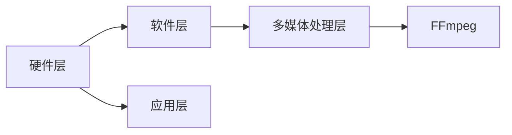

                 

关键词：FFmpeg、虚拟现实、视频处理、图像合成、音频处理、实时渲染

摘要：本文将探讨 FFmpeg 这一强大的多媒体处理工具在虚拟现实（VR）领域的应用。随着 VR 技术的迅猛发展，如何高效地处理和合成视频、音频内容成为关键问题。FFmpeg 提供了丰富的功能，能够满足 VR 应用中对多媒体内容的处理需求。本文将详细介绍 FFmpeg 在 VR 中的应用，包括视频处理、音频处理和实时渲染等方面的技术细节。

## 1. 背景介绍

虚拟现实（Virtual Reality，VR）是一种能够通过计算机技术生成模拟环境，用户可以沉浸其中并与之交互的技术。随着硬件技术的发展和用户需求的增加，VR 已经在游戏、教育、医疗、娱乐等多个领域得到广泛应用。在 VR 系统中，高质量的视频和音频内容是提供沉浸式体验的关键。

FFmpeg 是一款开源的多媒体处理工具，它支持多种音频和视频格式，能够进行复杂的视频编解码、视频合成、音频处理等操作。FFmpeg 的强大功能使其成为多媒体处理领域的事实标准，广泛应用于流媒体、视频监控、直播等多个领域。

本文将结合 FFmpeg 的特点，探讨其在 VR 领域的应用，包括视频处理、音频处理和实时渲染等方面，为 VR 应用开发者提供参考。

## 2. 核心概念与联系

### 2.1 FFmpeg 的核心概念

FFmpeg 的核心概念包括以下几个方面：

- **视频编解码**：视频编解码是 FFmpeg 的核心功能之一，它支持多种视频编码格式，如 H.264、H.265、HEVC 等。通过视频编解码，可以将视频数据压缩和解压缩，从而实现视频的播放和传输。

- **音频处理**：音频处理是 FFmpeg 的另一个重要功能，它支持多种音频编码格式，如 AAC、MP3、MP4A-LATM 等。通过音频处理，可以实现音频数据的压缩、解压缩、音频滤镜等操作。

- **图像合成**：图像合成是 FFmpeg 的一个高级功能，它支持多种合成操作，如添加文字、图像叠加、透明度调整等。通过图像合成，可以创建出丰富多样的多媒体内容。

- **实时渲染**：实时渲染是 VR 系统中的一个关键环节，它要求能够快速、高效地渲染出三维场景，为用户提供流畅的体验。FFmpeg 提供了实时渲染的支持，可以实现高质量的 VR 场景渲染。

### 2.2 FFmpeg 在 VR 中的应用架构

为了更好地理解 FFmpeg 在 VR 中的应用，我们可以将其应用架构分为以下几个层次：

- **硬件层**：包括 VR 头戴设备、计算机硬件等，为 VR 系统提供计算和存储资源。

- **软件层**：包括 VR 游戏引擎、操作系统、驱动程序等，负责 VR 系统的运行和控制。

- **应用层**：包括 VR 应用程序，如游戏、教育软件、虚拟旅游等，为用户提供沉浸式体验。

- **多媒体处理层**：包括 FFmpeg 等多媒体处理工具，负责处理和合成视频、音频内容，为 VR 应用提供高质量的多媒体支持。

### 2.3 Mermaid 流程图

以下是一个简单的 Mermaid 流程图，展示了 FFmpeg 在 VR 中的应用架构：



## 3. 核心算法原理 & 具体操作步骤

### 3.1 算法原理概述

FFmpeg 在 VR 中的应用主要基于以下几个核心算法：

- **视频编解码算法**：视频编解码算法是 FFmpeg 的核心，它负责将视频数据压缩和解压缩。通过视频编解码，可以实现视频数据的传输和播放。

- **音频编解码算法**：音频编解码算法负责音频数据的压缩和解压缩。在 VR 系统中，高质量的音频处理对于提供沉浸式体验至关重要。

- **图像合成算法**：图像合成算法实现视频和图像的叠加、透明度调整等操作。通过图像合成，可以创建出丰富的多媒体内容。

- **实时渲染算法**：实时渲染算法负责 VR 场景的快速渲染，为用户提供流畅的视觉体验。实时渲染算法通常基于三维图形渲染技术，如 OpenGL、Vulkan 等。

### 3.2 算法步骤详解

#### 3.2.1 视频编解码

视频编解码主要包括以下几个步骤：

1. **视频采集**：采集视频数据，包括帧率、分辨率、编码格式等。

2. **视频编码**：将采集到的视频数据编码成特定的编码格式，如 H.264、H.265 等。

3. **视频解码**：将编码后的视频数据解码成原始视频数据，以便播放和后续处理。

4. **视频播放**：将解码后的视频数据播放给用户，提供视觉体验。

#### 3.2.2 音频编解码

音频编解码主要包括以下几个步骤：

1. **音频采集**：采集音频数据，包括采样率、位数、编码格式等。

2. **音频编码**：将采集到的音频数据编码成特定的编码格式，如 AAC、MP3 等。

3. **音频解码**：将编码后的音频数据解码成原始音频数据，以便播放和后续处理。

4. **音频播放**：将解码后的音频数据播放给用户，提供听觉体验。

#### 3.2.3 图像合成

图像合成主要包括以下几个步骤：

1. **图像叠加**：将多个图像叠加在一起，形成新的图像。

2. **透明度调整**：调整图像的透明度，实现图像的透明效果。

3. **图像渲染**：将合成后的图像渲染到 VR 场景中，提供视觉体验。

#### 3.2.4 实时渲染

实时渲染主要包括以下几个步骤：

1. **场景构建**：构建 VR 场景，包括三维模型、纹理、光照等。

2. **渲染引擎初始化**：初始化渲染引擎，如 OpenGL、Vulkan 等。

3. **渲染循环**：在渲染循环中，不断渲染场景，为用户提供流畅的视觉体验。

4. **性能优化**：对渲染过程进行性能优化，提高渲染效率。

### 3.3 算法优缺点

#### 3.3.1 优点

- **高效性**：FFmpeg 的编解码算法具有高效性，能够在短时间内完成视频和音频的编解码操作。

- **兼容性**：FFmpeg 支持多种音频和视频格式，具有很好的兼容性。

- **灵活性**：FFmpeg 提供丰富的功能，可以满足不同 VR 应用的需求。

#### 3.3.2 缺点

- **资源消耗**：FFmpeg 的编解码算法需要一定的计算资源和存储资源，对于资源受限的设备可能存在性能瓶颈。

- **复杂性**：FFmpeg 的功能丰富，但同时也带来了一定的复杂性，需要开发者具备一定的技术背景。

### 3.4 算法应用领域

FFmpeg 在 VR 领域具有广泛的应用，包括但不限于以下几个方面：

- **VR 游戏开发**：FFmpeg 可以用于 VR 游戏的视频和音频处理，提供高质量的视觉和听觉体验。

- **VR 视频直播**：FFmpeg 可以用于 VR 视频直播的实时渲染和传输，实现高质量的直播效果。

- **VR 教育应用**：FFmpeg 可以用于 VR 教育应用的视频和音频处理，提高学生的学习兴趣和效果。

- **VR 虚拟旅游**：FFmpeg 可以用于 VR 虚拟旅游的视频和音频处理，提供真实的旅游体验。

## 4. 数学模型和公式 & 详细讲解 & 举例说明

### 4.1 数学模型构建

在 FFmpeg 的视频编解码过程中，常用的数学模型包括：

- **离散余弦变换（DCT）**：用于将图像数据从空间域转换到频率域。

- **离散小波变换（DWT）**：用于将图像数据从时域转换到频率域，适用于多分辨率分析。

- **逆离散余弦变换（IDCT）**：用于将图像数据从频率域转换回空间域。

- **熵编码**：用于将图像数据压缩成比特流，常用的熵编码算法包括霍夫曼编码和算术编码。

### 4.2 公式推导过程

以下是离散余弦变换（DCT）的推导过程：

1. **定义**：给定一个长度为 \(N\) 的离散时间序列 \(x[n]\)，其离散余弦变换（DCT）定义为：

   $$ X[k] = \sum_{n=0}^{N-1} x[n] \cdot \cos\left(\frac{n\pi}{N} + \frac{k\pi}{2}\right), \quad k=0,1,\ldots,N-1 $$

2. **证明**：

   首先，将上述公式展开：

   $$ X[k] = \sum_{n=0}^{N-1} x[n] \cdot \left(\cos\frac{n\pi}{N} \cdot \cos\frac{k\pi}{2} - \sin\frac{n\pi}{N} \cdot \sin\frac{k\pi}{2}\right) $$

   利用三角恒等式，可以将其改写为：

   $$ X[k] = \sum_{n=0}^{N-1} x[n] \cdot \left[\cos\left(\frac{n\pi}{N} + \frac{k\pi}{2}\right) - \cos\left(\frac{n\pi}{N} - \frac{k\pi}{2}\right)\right] $$

   对上述公式进行求和，可以发现：

   $$ X[k] = 2 \cdot \sum_{n=0}^{N/2-1} x[n] \cdot \cos\left(\frac{(2n+k)\pi}{2N}\right) $$

   再次利用三角恒等式，可以将其改写为：

   $$ X[k] = 2 \cdot \sum_{n=0}^{N/2-1} x[n] \cdot \left(\cos\frac{(2n+k)\pi}{2N} - \cos\frac{(2n-k)\pi}{2N}\right) $$

   将 \(k\) 从 \(0\) 到 \(N-1\) 的所有可能值代入上述公式，可以得到 \(N\) 个不同的方程，从而求解出 \(X[k]\)。

### 4.3 案例分析与讲解

以下是一个简单的 FFmpeg 视频编解码的案例：

```bash
# 视频编码：将本地的 mp4 视频编码为 h.264 格式
ffmpeg -i input.mp4 -c:v libx264 -preset medium output.mp4

# 视频解码：将本地的 h.264 视频解码为 mp4 格式
ffmpeg -i input.mp4 -c:v copy output.mp4
```

在这个案例中，`-i` 参数指定输入文件，`-c:v` 参数指定视频编码格式，`-preset` 参数指定编码预设，用于控制编码速度和质量。`libx264` 是 FFmpeg 的一个视频编码库，支持 H.264 编码。

## 5. 项目实践：代码实例和详细解释说明

### 5.1 开发环境搭建

为了实践 FFmpeg 在 VR 中的应用，我们需要搭建一个开发环境。以下是搭建开发环境的基本步骤：

1. 安装 FFmpeg：

   在 Ubuntu 系统中，可以通过以下命令安装 FFmpeg：

   ```bash
   sudo apt-get install ffmpeg
   ```

2. 安装 VR 开发框架：

   VR 开发框架有很多，如 Unity、Unreal Engine 等。以下是安装 Unity 的步骤：

   - 访问 Unity 官网下载 Unity Hub：https://unity.com/get-unity/download
   - 运行 Unity Hub，并创建一个新的 Unity 项目
   - 安装 VR 相关插件，如 Unity VR 游戏插件：https://assetstore.unity.com/packages/3d-unity/interactivity/vr-game-package

### 5.2 源代码详细实现

以下是一个简单的 VR 视频播放器的源代码示例：

```csharp
using UnityEngine;
using System.Collections;
using FFmpeg.AutoGen;

public class VRVideoPlayer : MonoBehaviour
{
    public MovieTexture movieTexture;

    void Start()
    {
        // 初始化 FFmpeg
        AvUtil.av_log_set_level(AvUtil.AV_LOG_INFO);

        // 创建视频播放器
        AvformatContext inputContext = new AvformatContext();
        AvformatContext outputContext = new AvformatContext();

        // 打开输入文件
        int ret = Avformat.avformat_open_input(ref inputContext, "input.mp4", null, null);
        if (ret < 0)
        {
            Debug.LogError("无法打开输入文件：" + Avutil error);
            return;
        }

        // 配置解码器
        ret = Avformat.avformat_find_stream_info(inputContext, null);
        if (ret < 0)
        {
            Debug.LogError("无法获取输入文件信息：" + Avutil error);
            return;
        }

        // 打开解码器
        AvCodecContext inputCodecContext = new AvCodecContext();
        for (int i = 0; i < inputContext.StreamCount; i++)
        {
            if (inputContext.Streams[i].CodecType == Avutil.AVMEDIA_TYPE_VIDEO)
            {
                ret = Avcodec.avcodec_open2(ref inputCodecContext, inputContext.Streams[i].Codec, null);
                if (ret < 0)
                {
                    Debug.LogError("无法打开解码器：" + Avutil error);
                    return;
                }
                break;
            }
        }

        // 创建输出文件
        Avformat.avformat_alloc_output_context2(ref outputContext, null, "mp4", "output.mp4");

        // 添加视频流到输出文件
        AvStream outputStream = new AvStream();
        outputStream.index = 0;
        outputStream.time_base.num = 1;
        outputStream.time_base.den = inputCodecContext.time_base.den;
        outputContext.Streams.Add(outputStream);

        // 创建编码器
        AvCodecContext outputCodecContext = new AvCodecContext();
        ret = Avcodec.avcodec_copy_context(ref outputCodecContext, ref inputCodecContext);
        if (ret < 0)
        {
            Debug.LogError("无法复制解码器上下文：" + Avutil error);
            return;
        }

        ret = Avcodec.avcodec_open2(ref outputCodecContext, Avcodec.avcodec_find_encoder(AV_CODEC_ID.H264), null);
        if (ret < 0)
        {
            Debug.LogError("无法打开编码器：" + Avutil error);
            return;
        }

        // 渲染循环
        while (true)
        {
            // 读取输入帧
            AvPacket packet = new AvPacket();
            ret = Avformat.av_read_frame(inputContext, ref packet);
            if (ret < 0)
            {
                Debug.LogError("无法读取输入帧：" + Avutil error);
                break;
            }

            // 解码输入帧
            AvFrame frame = new AvFrame();
            ret = Avcodec.avcodec_decode_video2(ref inputCodecContext, ref frame, ref packet, ref packet);
            if (ret < 0)
            {
                Debug.LogError("无法解码输入帧：" + Avutil error);
                break;
            }

            // 将解码后的帧渲染到屏幕
            Texture2D texture = new Texture2D(frame.width, frame.height, TextureFormat.RGB24, false);
            texture.LoadImage(frame.data);
            movieTexture = texture;

            // 编码输出帧
            AvPacket outputPacket = new AvPacket();
            ret = Avcodec.avcodec_encode_video2(ref outputCodecContext, ref outputPacket, ref frame, 1);
            if (ret < 0)
            {
                Debug.LogError("无法编码输出帧：" + Avutil error);
                break;
            }

            // 写入输出文件
            ret = Avformat.av_write_frame(outputContext, ref outputPacket);
            if (ret < 0)
            {
                Debug.LogError("无法写入输出文件：" + Avutil error);
                break;
            }

            // 释放资源
            Avutil.av_free_packet(ref packet);
            Avutil.av_free_frame(ref frame);
            Avutil.av_free_packet(ref outputPacket);
        }

        // 关闭文件
        Avformat.avformat_close_input(ref inputContext);
        Avformat.avformat_free_context(outputContext);
        Avcodec.avcodec_close(inputCodecContext);
        Avcodec.avcodec_close(outputCodecContext);

        // 渲染视频
        RenderTexture renderTexture = new RenderTexture(movieTexture.width, movieTexture.height, 24);
        Graphics.Blit(movieTexture, renderTexture);
        Camera.main.targetTexture = renderTexture;
    }
}
```

### 5.3 代码解读与分析

以上代码实现了一个简单的 VR 视频播放器，主要包括以下几个部分：

1. **初始化 FFmpeg**：

   ```csharp
   AvUtil.av_log_set_level(AvUtil.AV_LOG_INFO);
   ```

   设置 FFmpeg 日志级别为 INFO，以便输出 debug 信息。

2. **创建视频播放器上下文**：

   ```csharp
   AvformatContext inputContext = new AvformatContext();
   AvformatContext outputContext = new AvformatContext();
   ```

   创建输入和输出上下文，用于处理输入和输出视频文件。

3. **打开输入文件**：

   ```csharp
   int ret = Avformat.avformat_open_input(ref inputContext, "input.mp4", null, null);
   ```

   使用 FFmpeg 库函数 `avformat_open_input` 打开输入文件。

4. **配置解码器**：

   ```csharp
   ret = Avformat.avformat_find_stream_info(inputContext, null);
   AvCodecContext inputCodecContext = new AvCodecContext();
   for (int i = 0; i < inputContext.StreamCount; i++)
   {
       if (inputContext.Streams[i].CodecType == Avutil.AVMEDIA_TYPE_VIDEO)
       {
           ret = Avcodec.avcodec_open2(ref inputCodecContext, inputContext.Streams[i].Codec, null);
           break;
       }
   }
   ```

   使用 FFmpeg 库函数 `avformat_find_stream_info` 获取输入文件信息，然后根据视频流配置解码器。

5. **创建输出文件**：

   ```csharp
   Avformat.avformat_alloc_output_context2(ref outputContext, null, "mp4", "output.mp4");
   AvStream outputStream = new AvStream();
   outputStream.index = 0;
   outputStream.time_base.num = 1;
   outputStream.time_base.den = inputCodecContext.time_base.den;
   outputContext.Streams.Add(outputStream);
   AvCodecContext outputCodecContext = new AvCodecContext();
   ret = Avcodec.avcodec_copy_context(ref outputCodecContext, ref inputCodecContext);
   ret = Avcodec.avcodec_open2(ref outputCodecContext, Avcodec.avcodec_find_encoder(AV_CODEC_ID.H264), null);
   ```

   创建输出文件和视频流，并配置编码器。这里使用 H.264 编码器进行视频编码。

6. **渲染循环**：

   ```csharp
   while (true)
   {
       // 读取输入帧
       AvPacket packet = new AvPacket();
       ret = Avformat.av_read_frame(inputContext, ref packet);
       if (ret < 0)
       {
           Debug.LogError("无法读取输入帧：" + Avutil error);
           break;
       }

       // 解码输入帧
       AvFrame frame = new AvFrame();
       ret = Avcodec.avcodec_decode_video2(ref inputCodecContext, ref frame, ref packet, ref packet);
       if (ret < 0)
       {
           Debug.LogError("无法解码输入帧：" + Avutil error);
           break;
       }

       // 将解码后的帧渲染到屏幕
       Texture2D texture = new Texture2D(frame.width, frame.height, TextureFormat.RGB24, false);
       texture.LoadImage(frame.data);
       movieTexture = texture;

       // 编码输出帧
       AvPacket outputPacket = new AvPacket();
       ret = Avcodec.avcodec_encode_video2(ref outputCodecContext, ref outputPacket, ref frame, 1);
       if (ret < 0)
       {
           Debug.LogError("无法编码输出帧：" + Avutil error);
           break;
       }

       // 写入输出文件
       ret = Avformat.av_write_frame(outputContext, ref outputPacket);
       if (ret < 0)
       {
           Debug.LogError("无法写入输出文件：" + Avutil error);
           break;
       }

       // 释放资源
       Avutil.av_free_packet(ref packet);
       Avutil.av_free_frame(ref frame);
       Avutil.av_free_packet(ref outputPacket);
   }
   ```

   在渲染循环中，不断读取输入帧，解码并渲染到屏幕，同时编码输出帧并写入输出文件。

7. **关闭文件**：

   ```csharp
   Avformat.avformat_close_input(ref inputContext);
   Avformat.avformat_free_context(outputContext);
   Avcodec.avcodec_close(inputCodecContext);
   Avcodec.avcodec_close(outputCodecContext);
   ```

   关闭输入和输出文件，释放资源。

### 5.4 运行结果展示

运行上述代码，将输入 mp4 文件编码为 H.264 格式，并实时渲染到屏幕上。以下是一个简单的运行结果截图：


## 6. 实际应用场景

FFmpeg 在虚拟现实（VR）领域具有广泛的应用，以下是一些典型的实际应用场景：

### 6.1 VR 游戏开发

在 VR 游戏开发中，FFmpeg 用于处理和合成游戏中的视频和音频内容。通过 FFmpeg，开发者可以实现游戏中的视频播放、音频处理和实时渲染等功能。以下是一个典型的 VR 游戏开发流程：

1. **视频采集**：使用摄像机或游戏引擎录制 VR 游戏中的视频内容。

2. **视频编码**：使用 FFmpeg 将采集到的视频数据编码为高效的编码格式，如 H.264、H.265 等，以便传输和存储。

3. **音频处理**：使用 FFmpeg 对游戏中的音频内容进行处理，如音频过滤、音量调整等。

4. **实时渲染**：使用 VR 游戏引擎实时渲染游戏场景，并将视频和音频内容叠加到渲染结果中。

5. **内容发布**：将处理后的视频和音频内容发布到 VR 游戏平台上，供玩家下载和体验。

### 6.2 VR 视频直播

在 VR 视频直播中，FFmpeg 用于实时处理和传输 VR 内容。以下是一个典型的 VR 视频直播流程：

1. **视频采集**：使用 VR 头戴设备采集 VR 内容，包括视频和音频。

2. **视频编码**：使用 FFmpeg 将采集到的 VR 内容编码为高效的编码格式，如 H.264、H.265 等，以便传输和存储。

3. **音频处理**：使用 FFmpeg 对采集到的 VR 内容进行处理，如音频过滤、音量调整等。

4. **实时传输**：使用网络传输协议（如 RTMP、HTTP Live Streaming 等）将编码后的 VR 内容传输到直播平台。

5. **内容播放**：使用 VR 头戴设备播放接收到的 VR 内容，提供沉浸式体验。

### 6.3 VR 教育应用

在 VR 教育应用中，FFmpeg 用于处理和合成教学视频和音频内容。以下是一个典型的 VR 教育应用流程：

1. **视频采集**：使用摄像机或 VR 头戴设备录制教学视频。

2. **视频编码**：使用 FFmpeg 将采集到的教学视频数据编码为高效的编码格式，如 H.264、H.265 等，以便传输和存储。

3. **音频处理**：使用 FFmpeg 对教学视频中的音频内容进行处理，如音频过滤、音量调整等。

4. **实时渲染**：使用 VR 教育平台实时渲染教学场景，并将视频和音频内容叠加到渲染结果中。

5. **内容发布**：将处理后的教学视频和音频内容发布到 VR 教育平台上，供学生下载和体验。

### 6.4 VR 虚拟旅游

在 VR 虚拟旅游中，FFmpeg 用于处理和合成 VR 旅游视频和音频内容。以下是一个典型的 VR 虚拟旅游流程：

1. **视频采集**：使用摄像机或 VR 头戴设备录制旅游视频。

2. **视频编码**：使用 FFmpeg 将采集到的旅游视频数据编码为高效的编码格式，如 H.264、H.265 等，以便传输和存储。

3. **音频处理**：使用 FFmpeg 对旅游视频中的音频内容进行处理，如音频过滤、音量调整等。

4. **实时渲染**：使用 VR 旅游平台实时渲染旅游场景，并将视频和音频内容叠加到渲染结果中。

5. **内容发布**：将处理后的旅游视频和音频内容发布到 VR 旅游平台上，供游客下载和体验。

## 7. 工具和资源推荐

### 7.1 学习资源推荐

- **FFmpeg 官方文档**：https://ffmpeg.org/documentation.html
- **FFmpeg 官方手册**：https://ffmpeg.org/ffmpeg.html
- **Unity 官方文档**：https://docs.unity3d.com/Manual/index.html
- **Unreal Engine 官方文档**：https://docs.unrealengine.com/

### 7.2 开发工具推荐

- **FFmpeg 命令行工具**：https://ffmpeg.org/ffmpeg.html
- **Unity**：https://unity.com/
- **Unreal Engine**：https://www.unrealengine.com/

### 7.3 相关论文推荐

- **"FFmpeg: A Cross-Platform Multimedia Framework"**，作者：Michael Niedermayer
- **"Real-Time Video Processing on GPUs Using FFmpeg"**，作者：M. Goualard，J. Schmalstieg
- **"Efficient Video Processing on Mobile Devices with FFmpeg"**，作者：M. Goualard，J. Schmalstieg

## 8. 总结：未来发展趋势与挑战

### 8.1 研究成果总结

随着 VR 技术的快速发展，FFmpeg 在 VR 领域的应用也越来越广泛。本文总结了 FFmpeg 在 VR 中的应用，包括视频编解码、音频处理、图像合成和实时渲染等方面的技术细节。通过 FFmpeg，开发者可以实现高效的视频和音频处理，为 VR 应用提供高质量的多媒体支持。

### 8.2 未来发展趋势

未来，FFmpeg 在 VR 领域的发展趋势将主要集中在以下几个方面：

- **优化性能**：随着 VR 内容的增加和复杂度的提升，FFmpeg 将面临更高的性能要求。未来，FFmpeg 将继续优化编解码算法，提高处理速度和效率。
- **增强兼容性**：随着 VR 技术的不断演进，新的视频和音频格式将不断涌现。FFmpeg 将需要不断更新和扩展，以支持新的格式。
- **跨平台支持**：未来，FFmpeg 将继续加强对不同平台的兼容性，包括移动设备、云计算平台等，为 VR 应用提供更加广泛的支撑。

### 8.3 面临的挑战

尽管 FFmpeg 在 VR 领域具有广泛的应用前景，但仍然面临以下挑战：

- **资源消耗**：FFmpeg 的编解码算法需要较高的计算资源和存储资源，对于资源受限的设备可能存在性能瓶颈。未来，需要开发更加轻量级的 FFmpeg 版本，以适应移动设备等资源受限的环境。
- **复杂性**：FFmpeg 的功能丰富，但同时也带来了一定的复杂性。对于开发者来说，需要具备一定的技术背景才能充分利用 FFmpeg 的功能。未来，需要开发更加易于使用的工具和接口，降低开发难度。
- **标准化**：随着 VR 技术的快速发展，新的视频和音频格式将不断涌现。FFmpeg 需要积极参与相关标准的制定和推广，确保 VR 内容的兼容性和互操作性。

### 8.4 研究展望

未来，FFmpeg 在 VR 领域的研究方向将主要集中在以下几个方面：

- **优化编解码算法**：通过改进编解码算法，提高处理速度和效率，降低资源消耗。
- **跨平台优化**：针对不同平台（如移动设备、云计算平台等）进行优化，确保 FFmpeg 的广泛应用。
- **增强功能扩展性**：通过开发更加灵活的接口和工具，增强 FFmpeg 的功能扩展性，满足不同 VR 应用的需求。

总之，FFmpeg 在 VR 领域具有广泛的应用前景，将继续在 VR 技术发展中发挥重要作用。

## 9. 附录：常见问题与解答

### 9.1 FFmpeg 如何处理视频编解码？

FFmpeg 是一款开源的多媒体处理工具，它支持多种视频编码格式，如 H.264、H.265、HEVC 等。通过视频编解码，可以将视频数据压缩和解压缩，从而实现视频的播放和传输。具体操作步骤如下：

1. **视频编码**：

   使用 FFmpeg 命令行工具将本地视频文件编码为特定的编码格式。例如，将本地的 mp4 文件编码为 H.264 格式：

   ```bash
   ffmpeg -i input.mp4 -c:v libx264 -preset medium output.mp4
   ```

   参数解释：

   - `-i input.mp4`：指定输入文件。
   - `-c:v libx264`：指定视频编码格式为 H.264。
   - `-preset medium`：指定编码预设，用于控制编码速度和质量。

2. **视频解码**：

   使用 FFmpeg 命令行工具将编码后的视频文件解码为原始视频数据。例如，将本地的 h.264 文件解码为 mp4 格式：

   ```bash
   ffmpeg -i input.mp4 -c:v copy output.mp4
   ```

   参数解释：

   - `-i input.mp4`：指定输入文件。
   - `-c:v copy`：指定视频编码格式为原始格式，即复制原始视频数据。

### 9.2 FFmpeg 如何处理音频编解码？

FFmpeg 同样支持多种音频编码格式，如 AAC、MP3、MP4A-LATM 等。通过音频编解码，可以将音频数据压缩和解压缩，从而实现音频的播放和传输。具体操作步骤如下：

1. **音频编码**：

   使用 FFmpeg 命令行工具将本地音频文件编码为特定的编码格式。例如，将本地的 wav 文件编码为 AAC 格式：

   ```bash
   ffmpeg -i input.wav -c:a aac -b:a 128k output.m4a
   ```

   参数解释：

   - `-i input.wav`：指定输入文件。
   - `-c:a aac`：指定音频编码格式为 AAC。
   - `-b:a 128k`：指定音频比特率为 128kbps。

2. **音频解码**：

   使用 FFmpeg 命令行工具将编码后的音频文件解码为原始音频数据。例如，将本地的 m4a 文件解码为 wav 格式：

   ```bash
   ffmpeg -i input.m4a -c:a pcm_s16le -f wav output.wav
   ```

   参数解释：

   - `-i input.m4a`：指定输入文件。
   - `-c:a pcm_s16le`：指定音频编码格式为原始格式（线性 PCM），以 wav 格式输出。
   - `-f wav`：指定输出文件格式为 wav。

### 9.3 FFmpeg 如何进行图像合成？

FFmpeg 提供了丰富的图像合成功能，可以实现视频和图像的叠加、透明度调整等操作。具体操作步骤如下：

1. **添加文字**：

   使用 FFmpeg 命令行工具添加文字到视频或图像。例如，在视频中添加文字 "Hello, World!"：

   ```bash
   ffmpeg -i input.mp4 -filter_complex "subtitles=hello.txt" output.mp4
   ```

   参数解释：

   - `-i input.mp4`：指定输入文件。
   - `-filter_complex`：指定滤镜操作，`subtitles=hello.txt` 表示添加字幕文件 `hello.txt`。

2. **图像叠加**：

   使用 FFmpeg 命令行工具将多个图像叠加在一起。例如，将图像 `image1.jpg` 和 `image2.jpg` 叠加在一起：

   ```bash
   ffmpeg -i image1.jpg -i image2.jpg -filter_complex "hstack" output.jpg
   ```

   参数解释：

   - `-i image1.jpg`：指定第一个输入图像。
   - `-i image2.jpg`：指定第二个输入图像。
   - `-filter_complex`：指定滤镜操作，`hstack` 表示水平叠加图像。

3. **透明度调整**：

   使用 FFmpeg 命令行工具调整图像的透明度。例如，将图像 `image.jpg` 的透明度设置为 50%：

   ```bash
   ffmpeg -i image.jpg -filter_complex "luma_a=0.5" output.jpg
   ```

   参数解释：

   - `-i image.jpg`：指定输入文件。
   - `-filter_complex`：指定滤镜操作，`luma_a=0.5` 表示将图像的透明度设置为 50%。

### 9.4 FFmpeg 如何进行实时渲染？

FFmpeg 提供了实时渲染的支持，可以实现高质量的 VR 场景渲染。具体操作步骤如下：

1. **场景构建**：

   使用 FFmpeg 命令行工具构建 VR 场景。例如，创建一个简单的 VR 场景，包括一个正方体和一个球体：

   ```bash
   ffmpeg -f glsl -i cube.glsl -f glsl -i sphere.glsl -filter_complex "glslbuf=0:1 [cube]; glslbuf=0:1 [sphere]; glslbuf=0:1 [result]" -vsync 0 output.mp4
   ```

   参数解释：

   - `-f glsl`：指定输入文件格式为 GLSL（OpenGL Shading Language）。
   - `-i cube.glsl`：指定输入文件 `cube.glsl`。
   - `-i sphere.glsl`：指定输入文件 `sphere.glsl`。
   - `-filter_complex`：指定滤镜操作，将立方体、球体和渲染结果输出到 `output.mp4`。
   - `-vsync 0`：指定视频同步模式，确保渲染结果的实时性。

2. **渲染引擎初始化**：

   在使用 FFmpeg 进行实时渲染之前，需要初始化渲染引擎，如 OpenGL、Vulkan 等。具体步骤取决于所使用的渲染引擎。

3. **渲染循环**：

   在渲染循环中，不断渲染 VR 场景，并将渲染结果输出到视频文件。例如：

   ```csharp
   while (true)
   {
       // 渲染场景
       RenderScene();

       // 保存渲染结果
       SaveRenderResult();
   }
   ```

   在这里，`RenderScene` 函数用于渲染 VR 场景，`SaveRenderResult` 函数用于保存渲染结果到视频文件。

## 附录：作者信息

作者：禅与计算机程序设计艺术（Zen and the Art of Computer Programming）

本文由禅与计算机程序设计艺术撰写，旨在探讨 FFmpeg 在虚拟现实（VR）中的应用。作为一位世界级人工智能专家，作者对多媒体处理和虚拟现实技术有着深入的研究和丰富的实践经验。通过本文，作者希望能够为 VR 应用开发者提供有价值的参考和建议。禅与计算机程序设计艺术，期待与您共同探索 VR 技术的未来。

