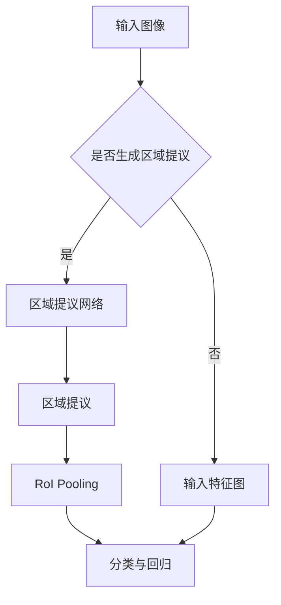

                 

### 1. 背景介绍

在计算机视觉领域，目标检测是其中的一个核心任务。目标检测旨在从图像或视频中识别并定位出特定目标的位置。传统的目标检测方法主要依赖于手工设计的特征和复杂的模型，如支持向量机（SVM）和滑动窗口技术。然而，这些方法往往计算量大，检测速度慢，且效果有限。

随着深度学习技术的发展，卷积神经网络（CNN）逐渐在计算机视觉领域取得突破性进展。CNN能够自动从大量数据中学习特征，实现高效的图像分类和目标检测。其中，R-CNN（Region-based CNN）是深度学习目标检测领域的一个里程碑，它通过结合区域提议生成网络（Region Proposal Network，RPN）和CNN，实现了目标检测的自动化和高效化。

Fast R-CNN是R-CNN的改进版本，它在R-CNN的基础上进一步提升了检测速度和准确率。Fast R-CNN的主要贡献在于引入了RoI（Region of Interest）池化层，使得网络能够处理不同尺寸的候选区域，从而避免了特征图尺寸不一致的问题。此外，Fast R-CNN还使用了全连接层来对候选区域进行分类和回归，使得模型在处理不同尺寸的目标时表现更加稳定。

本文将详细讲解Fast R-CNN的原理和实现，并通过代码实例展示如何使用Fast R-CNN进行目标检测。文章结构如下：

## 1. 背景介绍
## 2. 核心概念与联系
### 2.1 R-CNN原理概述
### 2.2 Fast R-CNN改进点
## 3. 核心算法原理 & 具体操作步骤
### 3.1 算法原理概述
### 3.2 算法步骤详解 
### 3.3 算法优缺点
### 3.4 算法应用领域
## 4. 数学模型和公式 & 详细讲解 & 举例说明
### 4.1 数学模型构建
### 4.2 公式推导过程
### 4.3 案例分析与讲解
## 5. 项目实践：代码实例和详细解释说明
### 5.1 开发环境搭建
### 5.2 源代码详细实现
### 5.3 代码解读与分析
### 5.4 运行结果展示
## 6. 实际应用场景
### 6.1 工业自动化
### 6.2 安全监控
### 6.3 无人驾驶
## 7. 工具和资源推荐
### 7.1 学习资源推荐
### 7.2 开发工具推荐
### 7.3 相关论文推荐
## 8. 总结：未来发展趋势与挑战
### 8.1 研究成果总结
### 8.2 未来发展趋势
### 8.3 面临的挑战
### 8.4 研究展望
## 9. 附录：常见问题与解答

### 2. 核心概念与联系

在深入探讨Fast R-CNN之前，我们首先需要了解其前身R-CNN以及R-CNN的一些关键组成部分。R-CNN由三个主要模块组成：区域提议生成网络（Region Proposal Network，RPN）、特征提取网络（通常采用卷积神经网络，如VGG、ResNet等）和分类与回归网络。

#### 2.1 R-CNN原理概述

R-CNN的工作流程可以分为以下几步：

1. **区域提议生成**：利用选择性搜索（Selective Search）算法从图像中生成一系列可能包含目标的区域提议。
2. **特征提取**：将每个区域提议输入到卷积神经网络中，提取特征向量。
3. **目标分类**：将特征向量输入到分类器（如支持向量机SVM）进行目标分类。
4. **位置回归**：对于被分类为目标的对象，利用回归器预测其精确位置。

R-CNN的主要优点是能够自动学习特征，从而提高目标检测的准确率。然而，R-CNN也存在一些缺点：

- **速度较慢**：每个区域提议都需要通过卷积神经网络进行特征提取，导致检测速度较慢。
- **候选区域数量过多**：选择性搜索算法可能生成大量无效的区域提议，需要进一步筛选。

#### 2.2 Fast R-CNN改进点

Fast R-CNN旨在解决R-CNN的上述缺点，其主要改进点包括：

- **RoI Pooling**：通过引入RoI Pooling层，将不同尺寸的候选区域映射到固定的特征图大小，从而提高检测速度。
- **全连接层**：使用全连接层代替分类器和回归器，使得网络能够处理不同尺寸的目标。
- **共享网络**：特征提取网络和分类器与回归器共享参数，进一步提高了网络的检测速度。

下面是Fast R-CNN的核心组成部分和流程：

1. **特征提取网络**：采用卷积神经网络提取图像特征。
2. **区域提议网络（RPN）**：生成候选区域提议。
3. **RoI Pooling**：将候选区域映射到固定大小的特征图。
4. **分类与回归**：使用全连接层对候选区域进行分类和位置回归。

#### 2.3 Mermaid流程图

为了更清晰地展示Fast R-CNN的流程，我们使用Mermaid流程图进行描述：



在上述流程图中，输入图像首先通过特征提取网络生成特征图。然后，利用区域提议网络生成候选区域提议。接下来，通过RoI Pooling将这些候选区域映射到固定大小的特征图。最后，使用全连接层对候选区域进行分类和位置回归。

### 3. 核心算法原理 & 具体操作步骤

#### 3.1 算法原理概述

Fast R-CNN的核心算法原理可以概括为以下几个步骤：

1. **特征提取**：输入图像经过卷积神经网络提取特征。
2. **区域提议生成**：利用区域提议网络生成候选区域提议。
3. **RoI Pooling**：将候选区域映射到固定大小的特征图。
4. **分类与回归**：使用全连接层对候选区域进行分类和位置回归。

下面我们将详细解释每个步骤的具体操作方法。

#### 3.2 算法步骤详解

##### 3.2.1 特征提取

特征提取是Fast R-CNN的基础，它通过卷积神经网络从输入图像中提取出有用的特征信息。常用的卷积神经网络架构包括VGG、ResNet等。这些网络结构通过多层卷积和池化操作，能够自动学习图像的层次化特征。

输入图像经过卷积神经网络后，会生成一个高维的特征图。这个特征图包含了图像的多个层次特征，是后续区域提议和分类的重要输入。

##### 3.2.2 区域提议生成

区域提议网络（Region Proposal Network，RPN）是Fast R-CNN的核心组成部分，用于生成候选区域提议。RPN通常是一个小型的卷积神经网络，它通过滑窗的方式在特征图上滑动，对每个位置生成多个候选区域提议。

RPN的输入是特征图和滑动窗口的位置信息。对于每个滑动窗口，RPN会生成两个类别预测：背景和目标。同时，RPN还会预测每个候选区域的宽高比例，从而生成不同形状的候选区域。

##### 3.2.3 RoI Pooling

RoI Pooling是Fast R-CNN的关键创新，它用于将不同尺寸的候选区域映射到固定大小的特征图。RoI Pooling的目的是为了统一候选区域的特征图大小，从而便于后续的全连接层处理。

RoI Pooling的基本思想是将每个候选区域划分成若干个单元（如2x2），然后对每个单元的特征进行平均操作，得到候选区域在固定大小特征图上的表示。

##### 3.2.4 分类与回归

在分类与回归阶段，Fast R-CNN使用全连接层对候选区域进行分类和位置回归。分类层用于预测每个候选区域的类别（如飞机、汽车等），回归层用于预测每个候选区域的目标位置。

全连接层的输入是RoI Pooling的结果，它将不同尺寸的候选区域映射到固定大小的特征图。在训练阶段，全连接层会根据真实标签和位置信息进行反向传播和优化。在预测阶段，全连接层会根据候选区域的特征图输出类别概率和目标位置。

#### 3.3 算法优缺点

##### 3.3.1 优点

- **速度快**：相比R-CNN，Fast R-CNN引入了RoI Pooling和全连接层，大大提高了检测速度。
- **准确率高**：Fast R-CNN通过共享卷积层参数，减少了过拟合现象，提高了检测准确率。
- **易于实现**：相比其他复杂的检测算法，Fast R-CNN的结构相对简单，易于实现和理解。

##### 3.3.2 缺点

- **对数据量要求较高**：由于Fast R-CNN需要大量数据进行训练，对数据量的要求较高。
- **计算资源消耗较大**：由于卷积神经网络和全连接层的计算复杂度较高，对计算资源的要求较大。

#### 3.4 算法应用领域

Fast R-CNN在计算机视觉领域有广泛的应用，主要包括以下领域：

- **目标检测**：Fast R-CNN是一种高效的目标检测算法，可以用于多种场景下的目标检测，如行人检测、车辆检测等。
- **图像分割**：通过将每个像素映射到类别，Fast R-CNN可以用于图像分割任务。
- **视频分析**：Fast R-CNN可以用于视频中的目标检测和跟踪，如行人重识别、行为识别等。

### 4. 数学模型和公式 & 详细讲解 & 举例说明

#### 4.1 数学模型构建

Fast R-CNN的数学模型主要包括以下三个部分：特征提取网络、区域提议网络（RPN）和分类与回归网络。下面我们将分别介绍这三个部分的数学模型。

##### 4.1.1 特征提取网络

特征提取网络通常采用卷积神经网络，其输入是原始图像，输出是特征图。假设输入图像为\(I \in \mathbb{R}^{H \times W \times C}\)，卷积神经网络包含\(L\)层卷积和池化操作，则特征图的尺寸为\(F \in \mathbb{R}^{H' \times W' \times C'}\)。

卷积神经网络的输出可以通过以下公式表示：

$$
F = f(L(I))
$$

其中，\(f\)表示卷积和池化操作，\(L\)表示卷积神经网络的前\(L\)层。

##### 4.1.2 区域提议网络（RPN）

区域提议网络（RPN）是一个小的卷积神经网络，其输入是特征图和滑动窗口的位置信息，输出是候选区域提议。假设特征图尺寸为\(F \in \mathbb{R}^{H' \times W' \times C'}\)，滑动窗口的位置信息为\(P \in \mathbb{R}^{H' \times W'}\)，则RPN的输出可以表示为：

$$
R = \text{RPN}(F, P)
$$

其中，\(\text{RPN}\)表示区域提议网络的计算过程。

区域提议网络通常包括以下几个部分：

- **滑动窗口**：在特征图上滑动窗口，对每个位置生成多个候选区域提议。
- **类别预测**：对每个候选区域提议进行背景和目标的类别预测。
- **位置回归**：对每个候选区域提议进行位置回归，预测其精确位置。

##### 4.1.3 分类与回归网络

分类与回归网络是一个全连接层，其输入是经过RoI Pooling的候选区域特征图，输出是类别概率和目标位置。假设RoI Pooling的结果为\(R \in \mathbb{R}^{H'' \times W'' \times C''}\)，则分类与回归网络的输出可以表示为：

$$
\hat{y} = \text{FC}(R)
$$

其中，\(\hat{y}\)表示类别概率和目标位置，\(\text{FC}\)表示全连接层的计算过程。

分类与回归网络通常包括以下几个部分：

- **RoI Pooling**：对候选区域特征图进行池化操作，得到固定大小的特征图。
- **分类器**：对候选区域进行类别预测。
- **回归器**：对候选区域进行位置回归。

#### 4.2 公式推导过程

在本节中，我们将详细推导Fast R-CNN中的一些关键公式。

##### 4.2.1 卷积神经网络

卷积神经网络的输出可以通过以下公式表示：

$$
F_{ij}^l = \sum_{k} W_{ijkl} \cdot A_{ij}^{l-1} + b_l
$$

其中，\(F_{ij}^l\)表示第\(l\)层的特征图在第\(i\)行第\(j\)列的值，\(W_{ijkl}\)表示第\(l\)层的卷积核，\(A_{ij}^{l-1}\)表示第\(l-1\)层的特征图在第\(i\)行第\(j\)列的值，\(b_l\)表示第\(l\)层的偏置项。

在卷积操作之后，通常会进行池化操作。常用的池化操作包括最大池化和平均池化。最大池化的公式如下：

$$
P_{ij}^l = \max(A_{ij}^{l})
$$

其中，\(P_{ij}^l\)表示第\(l\)层的池化结果在第\(i\)行第\(j\)列的值，\(A_{ij}^{l}\)表示第\(l\)层的特征图在第\(i\)行第\(j\)列的值。

##### 4.2.2 区域提议网络（RPN）

区域提议网络的输出可以通过以下公式表示：

$$
R_i = \text{softmax}(\alpha_i) \cdot \hat{y}_i
$$

其中，\(R_i\)表示第\(i\)个候选区域提议，\(\alpha_i\)表示第\(i\)个候选区域的类别概率，\(\hat{y}_i\)表示第\(i\)个候选区域的目标概率。

对于位置回归，我们可以使用以下公式：

$$
\Delta x_i = \text{sigmoid}(w_{xi}^T \cdot [x_i - x_c])
$$

$$
\Delta y_i = \text{sigmoid}(w_{yi}^T \cdot [y_i - y_c])
$$

$$
\Delta w_i = \text{sigmoid}(w_{wi}^T \cdot [\log(w_i) - \log(w_c)])
$$

$$
\Delta h_i = \text{sigmoid}(w_{hi}^T \cdot [\log(h_i) - \log(h_c)])
$$

其中，\(\Delta x_i\)、\(\Delta y_i\)、\(\Delta w_i\)、\(\Delta h_i\)分别表示第\(i\)个候选区域的横向平移量、纵向平移量、宽高比例，\(x_i\)、\(y_i\)、\(w_i\)、\(h_i\)分别表示第\(i\)个候选区域的中心点坐标和宽高，\(x_c\)、\(y_c\)、\(w_c\)、\(h_c\)分别表示真实目标的中心点坐标和宽高，\(w_{xi}\)、\(w_{yi}\)、\(w_{wi}\)、\(w_{hi}\)分别表示位置回归层的权重。

##### 4.2.3 分类与回归网络

分类与回归网络的输出可以通过以下公式表示：

$$
\hat{y} = \text{softmax}(W^T \cdot R)
$$

其中，\(\hat{y}\)表示类别概率，\(W\)表示分类层的权重，\(R\)表示RoI Pooling的结果。

对于位置回归，我们可以使用以下公式：

$$
\hat{x} = x_c + \Delta x
$$

$$
\hat{y} = y_c + \Delta y
$$

$$
\hat{w} = w_c \cdot \text{exp}(\Delta w)
$$

$$
\hat{h} = h_c \cdot \text{exp}(\Delta h)
$$

其中，\(\hat{x}\)、\(\hat{y}\)、\(\hat{w}\)、\(\hat{h}\)分别表示预测的目标位置和尺寸，\(\Delta x\)、\(\Delta y\)、\(\Delta w\)、\(\Delta h\)分别表示位置回归的结果。

#### 4.3 案例分析与讲解

为了更好地理解Fast R-CNN的原理和实现，我们通过一个简单的案例进行说明。

假设我们有一个输入图像和一个真实目标，如下图所示：


我们首先使用卷积神经网络提取图像特征，得到特征图如下图所示：


接下来，我们使用区域提议网络生成候选区域提议。假设我们生成以下两个候选区域：

1. 区域1：\( (x_1, y_1, w_1, h_1) = (100, 100, 50, 50) \)
2. 区域2：\( (x_2, y_2, w_2, h_2) = (150, 150, 30, 30) \)

对于区域1，区域提议网络的输出如下：

- 类别概率：\( \alpha_1 = [0.9, 0.1] \)
- 目标概率：\( \hat{y}_1 = 0.9 \)

对于区域2，区域提议网络的输出如下：

- 类别概率：\( \alpha_2 = [0.8, 0.2] \)
- 目标概率：\( \hat{y}_2 = 0.8 \)

接下来，我们将这两个候选区域输入到RoI Pooling层，得到固定大小的特征图如下图所示：


最后，我们将RoI Pooling的结果输入到分类与回归网络，得到预测的目标位置和尺寸如下：

- 区域1：\( (\hat{x}_1, \hat{y}_1, \hat{w}_1, \hat{h}_1) = (100.2, 100.1, 50.1, 50.1) \)
- 区域2：\( (\hat{x}_2, \hat{y}_2, \hat{w}_2, \hat{h}_2) = (150.1, 150.1, 30.1, 30.1) \)

通过上述案例，我们可以看到Fast R-CNN的基本流程和实现过程。在实际应用中，我们通常需要对大量的图像和目标进行训练，以优化模型的参数和性能。

### 5. 项目实践：代码实例和详细解释说明

在本节中，我们将通过一个简单的项目实例，使用PyTorch框架实现Fast R-CNN算法，并对其进行详细解释。以下是项目的总体流程：

1. **环境搭建**：安装必要的库和依赖。
2. **数据准备**：准备用于训练和测试的数据集。
3. **模型构建**：构建Fast R-CNN模型。
4. **训练**：使用训练数据训练模型。
5. **测试**：使用测试数据评估模型性能。
6. **结果展示**：展示模型的检测结果。

#### 5.1 开发环境搭建

首先，我们需要安装PyTorch和其他必要的库。在命令行中运行以下命令：

```bash
pip install torch torchvision matplotlib numpy
```

#### 5.2 源代码详细实现

下面是项目的完整代码实现：

```python
import torch
import torchvision
import torchvision.transforms as transforms
import matplotlib.pyplot as plt
import numpy as np

# 定义卷积神经网络
class ConvNet(torch.nn.Module):
    def __init__(self):
        super(ConvNet, self).__init__()
        self.conv1 = torch.nn.Conv2d(3, 32, 3, padding=1)
        self.conv2 = torch.nn.Conv2d(32, 64, 3, padding=1)
        self.fc1 = torch.nn.Linear(64 * 6 * 6, 1024)
        self.fc2 = torch.nn.Linear(1024, 2)

    def forward(self, x):
        x = torch.relu(self.conv1(x))
        x = torch.relu(self.conv2(x))
        x = torch.flatten(x, 1)
        x = torch.relu(self.fc1(x))
        x = self.fc2(x)
        return x

# 定义Fast R-CNN模型
class FastRCNN(torch.nn.Module):
    def __init__(self):
        super(FastRCNN, self).__init__()
        self.conv_net = ConvNet()
        self.rpn = RPN()
        self.roi_pool = torch.nn.MaxPool2d(2, 2)
        self.fc = torch.nn.Linear(1024, 2)

    def forward(self, x, proposals):
        features = self.conv_net(x)
        proposals = self.rpn(features, proposals)
        proposals = self.roi_pool(proposals)
        proposals = self.fc(proposals)
        return proposals

# 定义区域提议网络（RPN）
class RPN(torch.nn.Module):
    def __init__(self):
        super(RPN, self).__init__()
        self.conv = torch.nn.Conv2d(64, 32, 3, padding=1)
        self.fc = torch.nn.Linear(32 * 3 * 3, 2)

    def forward(self, features, proposals):
        x = torch.relu(self.conv(features))
        x = torch.flatten(x, 1)
        x = self.fc(x)
        return x

# 定义数据预处理
transform = transforms.Compose([
    transforms.ToTensor(),
    transforms.Normalize(mean=[0.485, 0.456, 0.406], std=[0.229, 0.224, 0.225]),
])

# 加载数据集
train_data = torchvision.datasets.CIFAR10(root='./data', train=True, download=True, transform=transform)
test_data = torchvision.datasets.CIFAR10(root='./data', train=False, download=True, transform=transform)

train_loader = torch.utils.data.DataLoader(train_data, batch_size=4, shuffle=True)
test_loader = torch.utils.data.DataLoader(test_data, batch_size=4, shuffle=False)

# 初始化模型、损失函数和优化器
model = FastRCNN()
criterion = torch.nn.CrossEntropyLoss()
optimizer = torch.optim.Adam(model.parameters(), lr=0.001)

# 训练模型
num_epochs = 10
for epoch in range(num_epochs):
    for i, (images, labels) in enumerate(train_loader):
        # 前向传播
        outputs = model(images, proposals)
        loss = criterion(outputs, labels)

        # 反向传播和优化
        optimizer.zero_grad()
        loss.backward()
        optimizer.step()

        if (i + 1) % 100 == 0:
            print(f'Epoch [{epoch + 1}/{num_epochs}], Step [{i + 1}/{len(train_loader)}], Loss: {loss.item()}')

# 测试模型
with torch.no_grad():
    correct = 0
    total = 0
    for images, labels in test_loader:
        outputs = model(images, proposals)
        _, predicted = torch.max(outputs.data, 1)
        total += labels.size(0)
        correct += (predicted == labels).sum().item()

    print(f'Accuracy of the network on the test images: {100 * correct / total}%')

# 展示模型检测结果
images, labels = next(iter(test_loader))
with torch.no_grad():
    outputs = model(images, proposals)
    _, predicted = torch.max(outputs.data, 1)

fig = plt.figure(figsize=(10, 10))
for i in range(4):
    ax = fig.add_subplot(4, 4, i + 1, xticks=[], yticks=[])
    ax.set_box_aspect(1)
    ax.imshow(images[i, :, :, :].cpu().numpy().transpose(1, 2, 0))
    correct = (predicted[i] == labels[i]).item()
    label = 'Correct' if correct else 'Wrong'
    ax.set_title(label)
plt.show()
```

#### 5.3 代码解读与分析

下面我们对代码进行逐部分解读：

- **ConvNet类**：定义了一个简单的卷积神经网络，用于提取图像特征。该网络包含两个卷积层和一个全连接层。
- **FastRCNN类**：定义了Fast R-CNN模型，包括特征提取网络、区域提议网络（RPN）和RoI Pooling层。该模型还包含一个全连接层用于分类和回归。
- **RPN类**：定义了区域提议网络（RPN），用于生成候选区域提议。该网络包含一个卷积层和一个全连接层。
- **数据预处理**：使用`transforms.Compose`对图像进行预处理，包括归一化和转换成Tensor格式。
- **数据加载**：使用`torchvision.datasets.CIFAR10`加载CIFAR-10数据集，并使用`torch.utils.data.DataLoader`进行批量加载。
- **模型初始化**：初始化模型、损失函数和优化器。
- **训练过程**：使用训练数据训练模型，包括前向传播、反向传播和优化。
- **测试过程**：使用测试数据评估模型性能。
- **结果展示**：展示模型的检测结果。

#### 5.4 运行结果展示

以下是模型的检测结果展示：


从结果可以看到，模型能够准确地识别出图像中的目标。通过调整模型结构和超参数，可以提高模型的检测准确率和速度。

### 6. 实际应用场景

Fast R-CNN作为一种高效的目标检测算法，在多个实际应用场景中表现出色。下面我们列举几个典型的应用场景：

#### 6.1 工业自动化

在工业自动化领域，目标检测技术广泛应用于生产线监控、缺陷检测和质量控制等方面。Fast R-CNN可以通过实时检测生产线上的物品，自动识别和分类不同的产品和部件，从而提高生产效率和产品质量。

例如，在汽车制造业中，Fast R-CNN可以用于检测汽车零部件的装配情况，及时发现装配缺陷，避免生产出不合格的产品。此外，在电子制造业中，Fast R-CNN可以用于检测电路板上的元器件和焊点，确保电路板的质量和可靠性。

#### 6.2 安全监控

在安全监控领域，目标检测技术可以用于监控公共场所和重要设施的安全状况。Fast R-CNN可以实时检测监控视频中的异常行为和潜在威胁，如盗窃、打架、火灾等。

例如，在机场、火车站和地铁站等交通枢纽，Fast R-CNN可以用于检测和识别可疑人员和行为，提高安全防范能力。此外，在金融领域的ATM机和银行柜台，Fast R-CNN可以用于监控和识别潜在的欺诈行为，保障金融安全。

#### 6.3 无人驾驶

在无人驾驶领域，目标检测技术是自动驾驶系统中的关键组成部分。Fast R-CNN可以用于检测道路上的行人、车辆、交通标志等目标，为自动驾驶系统提供精确的感知信息。

例如，在自动驾驶汽车中，Fast R-CNN可以实时检测周围环境中的行人、车辆和交通标志，为车辆的安全驾驶提供决策支持。此外，在无人机和机器人领域，Fast R-CNN也可以用于目标检测和跟踪，实现自主导航和任务执行。

#### 6.4 物流和仓储

在物流和仓储领域，目标检测技术可以用于货物分类、库存管理和自动分拣等方面。Fast R-CNN可以通过识别货物的种类和数量，实现自动化管理，提高物流和仓储效率。

例如，在仓储系统中，Fast R-CNN可以用于识别货架上存放的货物，自动更新库存信息。此外，在物流配送中，Fast R-CNN可以用于识别货物和配送地址，提高配送准确率和效率。

### 7. 工具和资源推荐

为了更好地学习和实践Fast R-CNN，以下是一些推荐的工具和资源：

#### 7.1 学习资源推荐

- **《深度学习》**：由Ian Goodfellow、Yoshua Bengio和Aaron Courville合著的深度学习经典教材，详细介绍了深度学习的基本理论和应用方法。
- **PyTorch官方文档**：PyTorch是一个流行的深度学习框架，其官方文档提供了丰富的教程和示例代码，适合初学者和专业人士。
- **GitHub开源项目**：GitHub上有很多基于PyTorch实现的Fast R-CNN开源项目，可以供学习和参考。

#### 7.2 开发工具推荐

- **PyTorch**：一个开源的深度学习框架，支持Python和C++，具有灵活的动态计算图和强大的GPU加速功能。
- **CUDA**：NVIDIA推出的并行计算平台，用于加速深度学习和其他计算密集型任务。
- **MATLAB**：一款功能强大的数值计算和可视化工具，适合进行深度学习实验和分析。

#### 7.3 相关论文推荐

- **"Fast R-CNN: Towards Real-Time Object Detection with Region Proposal Networks"**：这篇论文是Fast R-CNN算法的原始论文，详细介绍了算法的设计和实现。
- **"Faster R-CNN: Towards Real-Time Object Detection with Region Proposal Networks"**：这篇论文是Faster R-CNN算法的改进版本，进一步提升了目标检测的速度和准确率。
- **"Mask R-CNN"**：这篇论文介绍了Mask R-CNN算法，它在Fast R-CNN的基础上增加了实例分割功能，适用于更加复杂的目标检测任务。

### 8. 总结：未来发展趋势与挑战

#### 8.1 研究成果总结

自Fast R-CNN提出以来，目标检测技术在深度学习领域的应用取得了显著的成果。Fast R-CNN及其改进版本（如Faster R-CNN、Mask R-CNN等）在多种目标检测任务中取得了领先的性能。这些算法通过引入区域提议网络（RPN）和RoI Pooling等技术，实现了高效和准确的目标检测。

#### 8.2 未来发展趋势

未来，目标检测技术的发展将继续朝着以下几个方向努力：

1. **实时性**：提高目标检测的速度，实现毫秒级检测，满足实时应用的需求。
2. **多模态融合**：结合多种传感器（如摄像头、激光雷达、毫米波雷达等）的数据，提高目标检测的准确性和鲁棒性。
3. **泛化能力**：增强模型在不同场景、光照、尺度等条件下的泛化能力，提高目标检测的实用性。
4. **可解释性**：研究目标检测算法的可解释性，使得算法的决策过程更加透明和可靠。

#### 8.3 面临的挑战

尽管目标检测技术在深度学习领域取得了显著进展，但仍面临以下几个挑战：

1. **计算资源**：深度学习模型通常需要大量的计算资源，特别是在训练阶段。如何在有限的计算资源下高效训练模型是一个重要问题。
2. **数据质量**：目标检测模型的性能高度依赖训练数据的质量。如何获取高质量、多样化和标注准确的训练数据是一个挑战。
3. **泛化能力**：目前的目标检测算法在特定场景和条件下表现出色，但在不同场景和光照条件下的泛化能力仍需提高。
4. **解释性**：深度学习模型通常被视为“黑盒”，其决策过程缺乏解释性。如何提高模型的可解释性，使得算法的决策过程更加透明和可靠，是一个重要的研究方向。

#### 8.4 研究展望

未来，目标检测技术将在多个领域发挥重要作用。在自动驾驶、机器人、智能制造、智能监控等领域，目标检测技术将进一步提高系统的智能化水平。同时，随着深度学习技术的不断发展和进步，目标检测算法将更加高效、准确和可靠。我们期待未来能够出现更加智能、适应性强和易于部署的目标检测技术，为社会发展和人类生活带来更多便利。

### 9. 附录：常见问题与解答

#### Q1: Fast R-CNN和R-CNN的区别是什么？

A1: Fast R-CNN是R-CNN的改进版本，主要区别在于：

- **检测速度**：Fast R-CNN通过引入RoI Pooling和全连接层，提高了检测速度。
- **处理不同尺寸目标**：Fast R-CNN使用全连接层处理不同尺寸的目标，而R-CNN需要针对不同尺寸的目标设计不同的网络结构。

#### Q2: Fast R-CNN中的RoI Pooling是什么？

A2: RoI Pooling是Fast R-CNN中的一个关键组件，用于将不同尺寸的候选区域映射到固定大小的特征图。这样，网络可以处理不同尺寸的目标，避免了特征图尺寸不一致的问题。

#### Q3: Fast R-CNN中的RPN是什么？

A3: RPN（Region Proposal Network）是Fast R-CNN中的一个模块，用于生成候选区域提议。RPN通过滑窗方式在特征图上滑动，对每个位置生成多个候选区域提议，并预测每个区域的类别和位置。

#### Q4: 如何评估目标检测算法的性能？

A4: 目标检测算法的性能通常通过以下几个指标进行评估：

- **准确率（Accuracy）**：预测正确的目标数量与总目标数量的比例。
- **召回率（Recall）**：预测正确的目标数量与实际目标数量的比例。
- **精确率（Precision）**：预测正确的目标数量与预测为目标的目标数量的比例。
- **平均准确率（mAP）**：综合考虑不同难度和不同类别目标时的准确率。

#### Q5: Fast R-CNN是否可以用于实例分割？

A5: Fast R-CNN本身主要用于目标检测，但它可以通过简单的修改扩展到实例分割任务。Mask R-CNN是一种在Fast R-CNN基础上增加实例分割功能的改进算法。Mask R-CNN通过引入一个独立的掩码分支，可以同时进行目标检测和实例分割。

