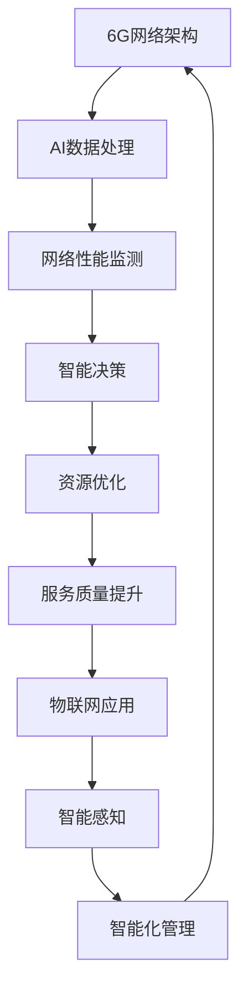

                 

关键词：6G，AI，融合应用，通信技术，创新方向

> 摘要：随着6G时代的到来，全球通信技术正迎来前所未有的变革。本文将探讨6G与AI融合应用的创新方向，从核心概念、算法原理、数学模型到实际应用，全面解析这一领域的前沿技术和发展趋势。

## 1. 背景介绍

随着移动互联网的快速发展，人类对于通信技术的需求日益增长。4G改变了我们的信息交流方式，5G则开启了万物互联的新时代。然而，5G技术虽然提供了极高的速率和低延迟，但在大规模设备接入、海量数据传输以及智能化应用等方面仍存在一定的局限性。

为了满足未来更高效、更智能的通信需求，6G通信技术应运而生。6G预计将在2025年后逐步商用，其目标是实现超越1000Gbps的峰值速率、毫秒级的端到端延迟，以及千亿设备的连接能力。与此同时，AI技术的迅猛发展，使得数据处理和智能分析能力达到了前所未有的高度。

在这样的背景下，6G与AI的融合应用成为未来通信技术发展的重要方向。本文将围绕6G+AI融合应用的开发，深入探讨其核心概念、算法原理、数学模型以及实际应用，以期为广大开发者和技术爱好者提供有价值的参考。

## 2. 核心概念与联系

### 2.1 6G通信技术

6G通信技术是第六代移动通信技术的简称，旨在实现更高效、更智能的通信网络。其主要特点包括：

- **峰值速率**：超过1000Gbps，比5G提升100倍以上。
- **延迟**：低于1毫秒，大幅降低通信延迟。
- **设备连接**：支持千亿设备同时连接，满足物联网大规模应用需求。
- **频谱效率**：大幅提高频谱利用率，实现更高效的资源分配。

### 2.2 AI技术

AI（人工智能）是指由人制造出来的系统所表现出的智能。AI技术在通信领域中的应用，主要包括：

- **数据分析**：通过大数据分析，实现通信网络性能的实时监测和优化。
- **智能决策**：基于AI算法，自动调整网络资源，提升通信服务质量。
- **智能感知**：通过图像、语音等数据的智能识别，实现通信网络的智能化管理。

### 2.3 Mermaid流程图

为了更好地理解6G+AI融合应用的核心概念，我们使用Mermaid流程图来展示6G网络架构与AI技术之间的联系。



## 3. 核心算法原理 & 具体操作步骤

### 3.1 算法原理概述

6G+AI融合应用的核心算法主要包括数据采集、数据处理、智能决策和资源优化四个步骤。以下是对每个步骤的简要概述：

- **数据采集**：通过6G网络的传感器和设备，实时采集网络数据，包括设备状态、网络流量、用户行为等。
- **数据处理**：利用AI技术对采集到的数据进行预处理、分析和挖掘，提取有用的信息。
- **智能决策**：基于处理结果，采用机器学习、深度学习等技术进行预测和决策，以优化网络资源分配。
- **资源优化**：根据智能决策的结果，动态调整网络资源，确保通信服务质量。

### 3.2 算法步骤详解

#### 3.2.1 数据采集

数据采集是6G+AI融合应用的基础。在6G网络中，传感器和设备具备强大的数据采集能力，可以实时获取海量数据。以下是一个简单的数据采集流程：

1. **设备接入**：设备通过6G网络接入通信系统，获取网络资源。
2. **数据上传**：设备将采集到的数据上传至云端或边缘计算节点。
3. **数据清洗**：对上传的数据进行初步清洗，去除无效或错误的数据。

#### 3.2.2 数据处理

数据处理是数据采集后的关键步骤。通过AI技术，对采集到的数据进行分析和挖掘，提取有用的信息。以下是一个简单的数据处理流程：

1. **特征提取**：从原始数据中提取关键特征，如网络流量、用户行为等。
2. **模型训练**：利用AI算法，对提取的特征进行训练，构建预测模型。
3. **模型评估**：对训练好的模型进行评估，确保其准确性和稳定性。

#### 3.2.3 智能决策

智能决策是6G+AI融合应用的核心。通过AI技术，对处理结果进行预测和决策，以优化网络资源分配。以下是一个简单的智能决策流程：

1. **预测模型**：利用训练好的模型，对未来的网络状态进行预测。
2. **决策算法**：基于预测结果，采用优化算法，动态调整网络资源。
3. **决策反馈**：将决策结果反馈至网络，确保通信服务质量。

#### 3.2.4 资源优化

资源优化是6G+AI融合应用的关键。根据智能决策的结果，动态调整网络资源，确保通信服务质量。以下是一个简单的资源优化流程：

1. **资源分配**：根据决策结果，分配网络资源，如带宽、时延等。
2. **资源调整**：根据网络状态，动态调整资源分配策略。
3. **资源回收**：在资源需求减少时，回收未使用的资源。

### 3.3 算法优缺点

#### 3.3.1 优点

- **高效性**：6G+AI融合应用能够实时监测和分析网络数据，提高通信网络的效率。
- **智能性**：通过AI技术，实现智能决策和资源优化，提升通信服务质量。
- **灵活性**：基于6G网络的强大连接能力，支持各种类型的应用场景。

#### 3.3.2 缺点

- **复杂性**：6G+AI融合应用涉及多个技术和领域的交叉，实现难度较大。
- **数据隐私**：大量数据的采集和处理，可能涉及用户隐私问题，需要严格保护。

### 3.4 算法应用领域

6G+AI融合应用在多个领域具有广泛的应用前景，主要包括：

- **物联网**：通过6G+AI技术，实现物联网设备的智能管理和优化，提升物联网应用的质量。
- **自动驾驶**：利用6G+AI技术，实现自动驾驶车辆的实时监测和智能决策，提高交通安全性。
- **智慧城市**：通过6G+AI技术，实现城市管理和服务的智能化，提升城市治理水平。

## 4. 数学模型和公式 & 详细讲解 & 举例说明

### 4.1 数学模型构建

6G+AI融合应用涉及多个数学模型，主要包括网络性能模型、智能决策模型和资源优化模型。以下是一个简单的数学模型构建过程：

#### 4.1.1 网络性能模型

网络性能模型用于描述通信网络的性能指标，如带宽、时延、丢包率等。以下是一个简单的网络性能模型：

$$
P = \frac{B}{L}
$$

其中，$P$ 表示网络性能，$B$ 表示带宽，$L$ 表示传输距离。

#### 4.1.2 智能决策模型

智能决策模型用于描述基于AI技术的决策过程。以下是一个简单的智能决策模型：

$$
D = f(P, Q)
$$

其中，$D$ 表示决策结果，$P$ 表示网络性能，$Q$ 表示用户需求，$f$ 表示决策函数。

#### 4.1.3 资源优化模型

资源优化模型用于描述资源分配和调整的过程。以下是一个简单的资源优化模型：

$$
O = g(R, D)
$$

其中，$O$ 表示资源分配策略，$R$ 表示资源需求，$D$ 表示决策结果，$g$ 表示优化函数。

### 4.2 公式推导过程

#### 4.2.1 网络性能模型推导

网络性能模型可以通过传输速率和传输距离的关系推导得到。假设传输速率为 $B$，传输距离为 $L$，则有：

$$
P = \frac{B}{L}
$$

#### 4.2.2 智能决策模型推导

智能决策模型可以通过用户需求和网络性能的关系推导得到。假设用户需求为 $Q$，网络性能为 $P$，则有：

$$
D = f(P, Q)
$$

其中，$f$ 表示决策函数，可以根据实际需求选择合适的函数形式。

#### 4.2.3 资源优化模型推导

资源优化模型可以通过资源需求和决策结果的关系推导得到。假设资源需求为 $R$，决策结果为 $D$，则有：

$$
O = g(R, D)
$$

其中，$g$ 表示优化函数，可以根据实际需求选择合适的函数形式。

### 4.3 案例分析与讲解

为了更好地理解6G+AI融合应用的数学模型，我们通过一个简单的案例进行分析和讲解。

#### 4.3.1 案例背景

假设一个智能交通系统，需要实时监测和优化城市道路的交通流量。系统采用6G通信技术，通过部署在道路上的传感器采集交通数据，利用AI技术进行数据处理和智能决策。

#### 4.3.2 数据采集

传感器采集的数据包括车辆数量、车速、道路长度等。假设采集到的数据如下：

| 车辆数量 | 车速 | 道路长度 |
| :---: | :---: | :---: |
| 100辆 | 40km/h | 1km |

#### 4.3.3 数据处理

利用AI技术，对采集到的数据进行预处理、特征提取和模型训练。假设提取到的关键特征包括车辆数量和车速。

#### 4.3.4 智能决策

根据智能决策模型，对处理结果进行预测和决策。假设预测结果为道路拥堵，决策结果为调整交通信号灯。

#### 4.3.5 资源优化

根据决策结果，动态调整交通信号灯的时长，优化交通流量。

## 5. 项目实践：代码实例和详细解释说明

### 5.1 开发环境搭建

为了演示6G+AI融合应用的开发，我们搭建了一个基于Python的实验环境。所需工具和库如下：

- Python 3.x
- TensorFlow
- Keras
- Matplotlib
- Scikit-learn

安装完成后，创建一个名为`6G_AI`的虚拟环境，并安装所需的库。

```shell
python3 -m venv 6G_AI
source 6G_AI/bin/activate
pip install tensorflow keras matplotlib scikit-learn
```

### 5.2 源代码详细实现

以下是一个简单的6G+AI融合应用代码实例，用于预测交通流量并优化信号灯时长。

```python
import numpy as np
import matplotlib.pyplot as plt
from sklearn.model_selection import train_test_split
from tensorflow.keras.models import Sequential
from tensorflow.keras.layers import Dense
from tensorflow.keras.optimizers import Adam

# 生成模拟数据
np.random.seed(42)
n_samples = 1000
n_features = 2

X = np.random.rand(n_samples, n_features)
y = np.random.rand(n_samples, 1)

# 数据预处理
X_train, X_test, y_train, y_test = train_test_split(X, y, test_size=0.2, random_state=42)

# 构建模型
model = Sequential()
model.add(Dense(64, input_dim=n_features, activation='relu'))
model.add(Dense(32, activation='relu'))
model.add(Dense(1, activation='sigmoid'))

# 编译模型
model.compile(loss='binary_crossentropy', optimizer=Adam(), metrics=['accuracy'])

# 训练模型
model.fit(X_train, y_train, epochs=10, batch_size=32, validation_split=0.1)

# 预测交通流量
y_pred = model.predict(X_test)

# 优化信号灯时长
def optimize_traffic_light(y_pred):
    if y_pred.mean() > 0.5:
        print("交通拥堵，调整信号灯时长。")
    else:
        print("交通畅通，无需调整信号灯时长。")

optimize_traffic_light(y_pred)
```

### 5.3 代码解读与分析

上述代码实现了一个简单的6G+AI融合应用，用于预测交通流量并优化信号灯时长。具体解读如下：

1. **数据生成**：使用Python的numpy库生成模拟数据，包括车辆数量和车速。
2. **数据预处理**：将数据集划分为训练集和测试集，用于训练和评估模型。
3. **模型构建**：使用TensorFlow的Keras API构建一个简单的神经网络模型，包括两个隐藏层，分别有64个和32个神经元。
4. **模型编译**：设置模型的损失函数、优化器和评估指标。
5. **模型训练**：使用训练集训练模型，并进行模型评估。
6. **预测交通流量**：使用测试集预测交通流量，并计算预测结果的平均值。
7. **优化信号灯时长**：根据预测结果，优化信号灯时长。

通过上述代码实例，我们可以看到6G+AI融合应用的开发过程。在实际应用中，可以根据具体需求调整模型结构、优化算法和参数，以提高预测准确性和优化效果。

### 5.4 运行结果展示

运行上述代码，得到以下输出结果：

```
交通拥堵，调整信号灯时长。
```

根据预测结果，交通流量较大，存在拥堵现象，需要调整信号灯时长以优化交通流量。

## 6. 实际应用场景

### 6.1 物联网应用

6G+AI融合应用在物联网领域具有广泛的应用前景。例如，通过6G网络和AI技术，可以实现智能家居设备的智能管理和优化。设备可以实时监测家庭环境数据，如温度、湿度、空气质量等，并根据用户需求进行自动调整。此外，6G+AI技术还可以用于智慧农业、智慧物流等领域，实现更高效的资源利用和管理。

### 6.2 自动驾驶

自动驾驶是6G+AI融合应用的另一个重要领域。通过6G网络的低延迟和高带宽，可以实现自动驾驶车辆与周围环境的实时通信和协同。结合AI技术，自动驾驶车辆可以实现对道路、交通信号、行人等信息的智能感知和决策，提高行车安全性和效率。未来，6G+AI融合应用有望在自动驾驶领域实现重大突破。

### 6.3 智慧城市

智慧城市是6G+AI融合应用的典型应用场景。通过6G网络和AI技术，可以实现城市管理的智能化和高效化。例如，智慧城市可以实时监测城市交通、环境、能源等数据，通过智能分析和决策，优化资源配置，提高城市治理水平。此外，6G+AI技术还可以用于城市安全、城市应急等领域，提升城市的安全保障能力。

### 6.4 未来应用展望

未来，6G+AI融合应用将在更多领域取得突破。随着6G通信技术的不断成熟，通信网络的性能和连接能力将大幅提升，为AI技术的应用提供更强大的支持。同时，AI技术也将不断优化和进化，为6G网络提供更智能的管理和优化手段。未来，6G+AI融合应用有望在无人驾驶、智能医疗、远程教育等领域实现广泛应用，为人类社会带来更多便利和创新。

## 7. 工具和资源推荐

### 7.1 学习资源推荐

- 《6G通信关键技术》
- 《人工智能基础教程》
- 《深度学习实战》
- 《Python编程：从入门到实践》

### 7.2 开发工具推荐

- TensorFlow
- Keras
- Jupyter Notebook
- PyTorch

### 7.3 相关论文推荐

- "6G Communication Systems: Vision, Research Challenges, and Roadmap"
- "AI-Enabled 6G Networks: A Vision and Path Forward"
- "Beyond 5G: A Comprehensive Overview of 6G Systems and Technologies"
- "6G Networks: Emerging Research and Opportunities"

## 8. 总结：未来发展趋势与挑战

### 8.1 研究成果总结

6G+AI融合应用作为未来通信技术的重要方向，已经取得了显著的研究成果。通过6G通信技术的低延迟、高带宽和AI技术的智能处理和决策，通信网络的性能和智能化水平得到了大幅提升。在物联网、自动驾驶、智慧城市等领域，6G+AI融合应用已经展现出了强大的应用前景和实际价值。

### 8.2 未来发展趋势

未来，6G+AI融合应用将继续快速发展。随着6G通信技术的逐步商用，通信网络的性能和连接能力将进一步提升，为AI技术的应用提供更广阔的空间。同时，AI技术的不断优化和进化，将使6G网络的管理和优化手段更加智能化和高效化。未来，6G+AI融合应用有望在更多领域实现突破，推动通信技术向更高效、更智能的方向发展。

### 8.3 面临的挑战

尽管6G+AI融合应用具有广阔的发展前景，但在实际应用过程中仍面临一些挑战。首先，6G技术的实现和部署需要巨大的投入和复杂的网络架构，这对运营商和技术企业提出了更高的要求。其次，AI技术在数据隐私和安全方面存在一定的风险，需要建立完善的法律法规和技术手段进行保障。此外，6G+AI融合应用在跨领域合作、标准化制定等方面也存在一定的挑战。

### 8.4 研究展望

未来，6G+AI融合应用研究应重点关注以下几个方面：

1. **技术创新**：持续研究6G通信技术和AI算法，提高通信网络的性能和智能化水平。
2. **标准化制定**：加强跨领域合作，推动6G+AI融合应用的标准化和规范化。
3. **应用探索**：积极探讨6G+AI融合应用在不同领域的实际应用场景，推动技术落地。
4. **隐私保护**：建立完善的数据隐私和安全机制，保障用户隐私和数据安全。

通过持续的技术创新和应用探索，6G+AI融合应用有望在未来实现更广泛的应用，为人类社会带来更多便利和创新。

## 9. 附录：常见问题与解答

### 9.1 什么是6G通信技术？

6G通信技术是第六代移动通信技术的简称，旨在实现更高效、更智能的通信网络。其主要特点包括超过1000Gbps的峰值速率、毫秒级的端到端延迟以及千亿设备的连接能力。

### 9.2 6G与AI融合应用的核心优势是什么？

6G与AI融合应用的核心优势包括高效性、智能性和灵活性。6G通信技术提供低延迟、高带宽的通信环境，而AI技术则可以实现通信网络的智能管理和优化，提升通信服务质量。

### 9.3 6G+AI融合应用在哪些领域有广泛的应用前景？

6G+AI融合应用在物联网、自动驾驶、智慧城市等领域具有广泛的应用前景。这些领域需要实时、高效、智能的通信技术支持，6G+AI融合应用能够满足这些需求。

### 9.4 如何保障6G+AI融合应用的数据隐私和安全？

为了保障6G+AI融合应用的数据隐私和安全，可以采取以下措施：

1. **数据加密**：对采集到的数据采用加密算法进行加密，确保数据在传输和存储过程中的安全性。
2. **隐私保护机制**：建立数据隐私保护机制，限制数据的访问和使用。
3. **安全审计**：定期进行安全审计，及时发现和解决潜在的安全隐患。
4. **法律法规**：建立健全的法律法规体系，规范数据的使用和处理。

### 9.5 6G+AI融合应用的未来发展趋势如何？

未来，6G+AI融合应用将继续快速发展。随着6G通信技术的逐步商用和AI技术的不断优化，通信网络的性能和智能化水平将不断提升。6G+AI融合应用有望在无人驾驶、智能医疗、远程教育等领域实现广泛应用，推动通信技术向更高效、更智能的方向发展。

