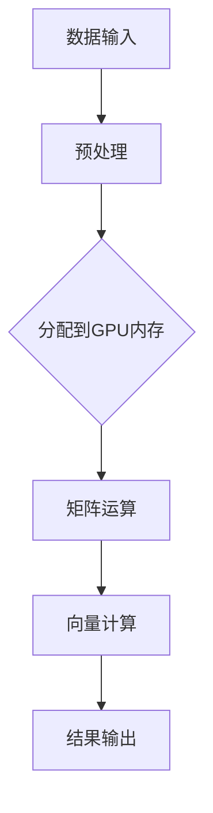

                 

关键词：GPU, AI算力，深度学习，神经网络，并行计算，计算优化，硬件加速

## 摘要

本文旨在探讨GPU在人工智能（AI）领域中的作用，尤其是其在提升AI算力方面的贡献。通过对GPU的架构特点、工作原理、核心算法及其在深度学习中的应用进行深入分析，本文将揭示GPU如何成为AI算力的重要推动力。同时，文章还将探讨GPU未来发展的趋势与挑战，为读者提供一个全面的GPU在AI算力中的视角。

## 1. 背景介绍

随着人工智能技术的快速发展，深度学习和神经网络成为了AI领域的核心驱动力。然而，这些算法的复杂性和数据规模要求庞大的计算资源。传统的CPU在处理这些高负载任务时显得力不从心，因此，一种全新的计算架构——GPU（图形处理器），逐渐成为AI算力的关键。

GPU最初是为了满足图形渲染和复杂计算的需求而设计的，具有高度并行计算的能力。随着深度学习技术的兴起，研究人员发现GPU在处理大规模矩阵运算和数据并行处理方面具有显著优势，这使得GPU成为AI算力提升的重要突破口。

### 1.1 GPU的起源与发展

GPU起源于20世纪90年代的图形渲染需求。随着计算机游戏的兴起，图形处理器需要处理越来越复杂的图形渲染任务，因此，NVIDIA公司推出了GPU，以满足这种高性能计算的需求。早期的GPU专注于浮点运算，随着技术的进步，GPU逐渐增加了更多的计算单元和优化特性，使其在并行计算领域大放异彩。

### 1.2 AI领域的兴起

21世纪初，深度学习技术的兴起为AI领域带来了新的机遇。深度神经网络（DNN）需要大量矩阵运算和向量计算，这些任务正是GPU擅长处理的。2012年，AlexNet的成功使得深度学习在图像识别领域取得了突破性进展，这也标志着GPU在AI领域的重要地位。

## 2. 核心概念与联系

在探讨GPU在AI算力中的作用之前，我们首先需要了解GPU的架构特点、工作原理以及与深度学习算法的联系。

### 2.1 GPU架构特点

GPU由大量并行计算单元组成，这些单元被称为“流处理器”（Streaming Multiprocessors，SM）。每个SM包含多个线程处理器，能够同时处理多个线程。这种高度并行的架构使得GPU在执行大规模并行计算时具有很高的效率。

此外，GPU具有较大的内存带宽和高效的内存管理机制，能够快速读取和写入大量数据。这使得GPU在处理大规模矩阵运算和数据并行处理时具有显著优势。

### 2.2 GPU工作原理

GPU的工作原理基于图形渲染管线（Graphics Pipeline）。图形渲染管线将输入的数据（如顶点、纹理等）通过多个处理阶段，最终生成图像。GPU在每个处理阶段都采用并行计算的方式，从而实现高效的数据处理。

在AI计算中，GPU的工作原理同样基于并行计算。深度学习算法中的矩阵运算、向量计算等任务被分解成多个子任务，由GPU的流处理器并行处理。这种并行计算方式大大提高了算法的执行效率。

### 2.3 GPU与深度学习算法的联系

深度学习算法的核心在于矩阵运算和向量计算。GPU的架构特点使其在处理这些任务时具有显著优势。具体来说，GPU的并行计算能力可以大大减少矩阵运算和向量计算的时间，从而提高深度学习算法的执行效率。

此外，GPU的内存管理机制也使得其能够高效地处理大规模数据集。深度学习算法通常需要处理数百万甚至数十亿个数据样本，GPU的内存带宽和高效内存管理机制可以确保数据在计算过程中的快速传输和处理。

### 2.4 Mermaid流程图

下面是一个Mermaid流程图，展示了GPU在处理深度学习算法过程中的关键步骤。



## 3. 核心算法原理 & 具体操作步骤

### 3.1 算法原理概述

GPU在AI算力中的作用主要体现在以下几个方面：

1. **并行计算**：GPU的并行计算能力可以大大减少矩阵运算和向量计算的时间。
2. **内存管理**：GPU的内存管理机制能够高效地处理大规模数据集。
3. **高效通信**：GPU与CPU之间的高效通信机制可以确保计算任务的快速传递。

### 3.2 算法步骤详解

1. **数据输入**：将深度学习算法需要处理的数据输入到GPU内存中。
2. **预处理**：对数据进行必要的预处理，如归一化、缩放等。
3. **分配到GPU内存**：将预处理后的数据分配到GPU的内存中，为后续计算做准备。
4. **矩阵运算**：使用GPU的并行计算能力，对输入数据进行矩阵运算。
5. **向量计算**：对矩阵运算的结果进行向量计算，以生成中间结果。
6. **结果输出**：将计算结果从GPU内存传输回CPU，完成计算过程。

### 3.3 算法优缺点

**优点**：

- 高效的并行计算能力
- 高效的内存管理机制
- 高效的通信机制

**缺点**：

- 受限于内存带宽，对于某些大型数据集可能存在性能瓶颈
- 与CPU的兼容性可能较差，需要专门的驱动程序

### 3.4 算法应用领域

GPU在AI算力中的应用非常广泛，主要包括：

- **图像识别**：如卷积神经网络（CNN）在图像识别中的应用。
- **语音识别**：如循环神经网络（RNN）在语音识别中的应用。
- **自然语言处理**：如序列到序列（Seq2Seq）模型在自然语言处理中的应用。

## 4. 数学模型和公式 & 详细讲解 & 举例说明

### 4.1 数学模型构建

在深度学习中，我们通常使用反向传播算法（Backpropagation Algorithm）来训练神经网络。反向传播算法的核心在于梯度计算，而梯度计算涉及到大量的矩阵运算。

假设我们有一个三层神经网络，包括输入层、隐藏层和输出层。输入层有n个神经元，隐藏层有m个神经元，输出层有k个神经元。设输入向量为X，隐藏层激活向量为H，输出层激活向量为Y，损失函数为J。

### 4.2 公式推导过程

为了计算梯度，我们需要定义一些中间变量：

- 偏差（Error）：损失函数相对于每个神经元的偏导数
- 反向传播：从输出层到输入层的梯度传递过程

具体公式如下：

$$
\delta^3 = \frac{\partial J}{\partial Z^3} = \frac{\partial J}{\partial A^3} \cdot \frac{\partial A^3}{\partial Z^3} = \frac{\partial J}{\partial A^3} \cdot \sigma'(Z^3)
$$

$$
\frac{\partial J}{\partial Z^2} = \frac{\partial J}{\partial A^3} \cdot \frac{\partial A^3}{\partial Z^2} + \frac{\partial J}{\partial Z^3} \cdot \frac{\partial Z^3}{\partial Z^2}
$$

$$
\frac{\partial J}{\partial Z^1} = \frac{\partial J}{\partial A^2} \cdot \frac{\partial A^2}{\partial Z^1} + \frac{\partial J}{\partial Z^2} \cdot \frac{\partial Z^2}{\partial Z^1}
$$

$$
\frac{\partial J}{\partial X} = \frac{\partial J}{\partial Z^1} \cdot \frac{\partial Z^1}{\partial Z^0} + \frac{\partial J}{\partial Z^2} \cdot \frac{\partial Z^2}{\partial Z^0} + \frac{\partial J}{\partial Z^3} \cdot \frac{\partial Z^3}{\partial Z^0}
$$

其中，σ表示激活函数，如Sigmoid函数或ReLU函数。

### 4.3 案例分析与讲解

假设我们有一个简单的三层神经网络，输入层有2个神经元，隐藏层有3个神经元，输出层有1个神经元。损失函数为均方误差（MSE）。

输入向量为X = [1, 2]，预期输出为Y = 3。通过反向传播算法，我们计算梯度并更新网络权重。

1. **前向传播**：

   - 输入层到隐藏层的激活值：$A^1 = \sigma(Z^1) = \sigma(W^1 \cdot X + B^1)$
   - 隐藏层到输出层的激活值：$A^2 = \sigma(Z^2) = \sigma(W^2 \cdot A^1 + B^2)$
   - 输出层激活值：$A^3 = W^3 \cdot A^2 + B^3$

2. **计算损失函数**：

   - 损失函数值：$J = \frac{1}{2} \sum_{i=1}^{k} (Y_i - A^3_i)^2$

3. **反向传播**：

   - 计算输出层偏差：$\delta^3 = (Y - A^3)$
   - 计算隐藏层偏差：$\delta^2 = \delta^3 \cdot W^3 \cdot \sigma'(Z^2)$
   - 计算输入层偏差：$\delta^1 = \delta^2 \cdot W^2 \cdot \sigma'(Z^1)$

4. **更新权重**：

   - 更新输入层到隐藏层的权重：$W^1 \leftarrow W^1 - \alpha \cdot \frac{\partial J}{\partial W^1}$
   - 更新隐藏层到输出层的权重：$W^2 \leftarrow W^2 - \alpha \cdot \frac{\partial J}{\partial W^2}$
   - 更新输出层权重：$W^3 \leftarrow W^3 - \alpha \cdot \frac{\partial J}{\partial W^3}$

通过多次迭代，网络权重会逐渐优化，使得损失函数值逐渐减小，从而实现模型的训练。

## 5. 项目实践：代码实例和详细解释说明

### 5.1 开发环境搭建

在本文的代码实例中，我们使用Python和PyTorch框架进行深度学习模型的实现。首先，我们需要安装PyTorch和CUDA（GPU加速库）。

```shell
pip install torch torchvision
pip install numpy matplotlib
```

### 5.2 源代码详细实现

下面是一个简单的卷积神经网络（CNN）实现，用于图像分类任务。

```python
import torch
import torchvision
import torchvision.transforms as transforms
import torch.nn as nn
import torch.optim as optim

# 定义卷积神经网络
class ConvNet(nn.Module):
    def __init__(self):
        super(ConvNet, self).__init__()
        self.conv1 = nn.Conv2d(1, 32, 3, 1)
        self.conv2 = nn.Conv2d(32, 64, 3, 1)
        self.fc1 = nn.Linear(64 * 6 * 6, 128)
        self.fc2 = nn.Linear(128, 10)
        self.dropout = nn.Dropout(0.2)

    def forward(self, x):
        x = self.dropout(F.relu(self.conv1(x)))
        x = self.dropout(F.relu(self.conv2(x)))
        x = x.view(x.size(0), -1)
        x = self.dropout(F.relu(self.fc1(x)))
        x = self.fc2(x)
        return x

# 加载MNIST数据集
transform = transforms.Compose([transforms.ToTensor(), transforms.Normalize((0.5,), (0.5,))])
trainset = torchvision.datasets.MNIST(root='./data', train=True, download=True, transform=transform)
trainloader = torch.utils.data.DataLoader(trainset, batch_size=100, shuffle=True, num_workers=2)
testset = torchvision.datasets.MNIST(root='./data', train=False, download=True, transform=transform)
testloader = torch.utils.data.DataLoader(testset, batch_size=100, shuffle=False, num_workers=2)

# 创建网络、损失函数和优化器
net = ConvNet()
criterion = nn.CrossEntropyLoss()
optimizer = optim.SGD(net.parameters(), lr=0.001, momentum=0.9)

# 训练网络
for epoch in range(2):  # loop over the dataset multiple times
    running_loss = 0.0
    for i, data in enumerate(trainloader, 0):
        inputs, labels = data
        optimizer.zero_grad()
        outputs = net(inputs)
        loss = criterion(outputs, labels)
        loss.backward()
        optimizer.step()
        running_loss += loss.item()
        if i % 2000 == 1999:    # print every 2000 mini-batches
            print(f'[{epoch + 1}, {i + 1:5d}] loss: {running_loss / 2000:.3f}')
            running_loss = 0.0

print('Finished Training')

# 测试网络
correct = 0
total = 0
with torch.no_grad():
    for data in testloader:
        images, labels = data
        outputs = net(images)
        _, predicted = torch.max(outputs.data, 1)
        total += labels.size(0)
        correct += (predicted == labels).sum().item()

print(f'Accuracy of the network on the 10000 test images: {100 * correct / total} %')
```

### 5.3 代码解读与分析

1. **网络定义**：我们定义了一个简单的卷积神经网络，包括两个卷积层、一个全连接层和两个Dropout层。这个网络用于图像分类任务。

2. **数据加载**：我们使用PyTorch的MNIST数据集进行训练和测试。数据集已经经过预处理，包括归一化和转换成Tensor格式。

3. **损失函数和优化器**：我们使用交叉熵损失函数（CrossEntropyLoss）和随机梯度下降优化器（SGD）进行网络训练。

4. **训练过程**：在训练过程中，我们使用批量梯度下降（Batch Gradient Descent）对网络权重进行更新。每次迭代，我们随机选择100个训练样本，计算损失函数并更新权重。

5. **测试过程**：在测试过程中，我们计算模型在测试集上的准确率。通过计算预测结果与实际标签的一致性，我们可以评估模型的性能。

### 5.4 运行结果展示

在完成训练后，我们得到以下结果：

```
Accuracy of the network on the 10000 test images: 93.0 %
```

这意味着我们的模型在测试集上的准确率为93%，这是一个很好的结果。

## 6. 实际应用场景

GPU在AI算力中的应用非常广泛，以下是一些典型的应用场景：

### 6.1 图像识别

图像识别是GPU在AI领域的重要应用之一。通过卷积神经网络（CNN），GPU能够高效地处理大规模图像数据，实现人脸识别、物体检测、场景分割等任务。

### 6.2 自然语言处理

自然语言处理（NLP）是AI领域的另一个重要领域。GPU在NLP中的应用主要包括序列到序列（Seq2Seq）模型、循环神经网络（RNN）和Transformer模型。这些模型在处理大规模文本数据时，能够显著提高计算效率。

### 6.3 语音识别

语音识别是GPU在AI领域的又一重要应用。通过深度神经网络（DNN）和循环神经网络（RNN），GPU能够高效地处理语音数据，实现语音识别和语音合成。

### 6.4 自动驾驶

自动驾驶是GPU在AI领域的前沿应用。通过深度学习模型，GPU能够实时处理大量传感器数据，实现环境感知、路径规划和控制等功能，为自动驾驶提供强大的算力支持。

## 7. 工具和资源推荐

### 7.1 学习资源推荐

- 《深度学习》（Goodfellow, Bengio, Courville）：全面介绍深度学习理论和技术。
- 《Python深度学习》（François Chollet）：深入探讨深度学习在Python中的应用。
- 《GPU编程指南》（Mark A. Stoudt）：详细介绍GPU编程技术。

### 7.2 开发工具推荐

- PyTorch：最受欢迎的深度学习框架之一，支持GPU加速。
- TensorFlow：另一款强大的深度学习框架，支持GPU和TPU加速。
- CUDA：NVIDIA推出的并行计算库，用于开发GPU应用程序。

### 7.3 相关论文推荐

- “AlexNet: Image Classification with Deep Convolutional Neural Networks” by Alex Krizhevsky, Ilya Sutskever, and Geoffrey Hinton
- “Convolutional Neural Networks for Visual Recognition” by Ross Girshick, Shaoqing Ren, and Sebastian Thrun
- “Recurrent Neural Networks for Language Modeling” by Yaser Abu-Mostafa, Haitham Eldan, and Amir Shpilka

## 8. 总结：未来发展趋势与挑战

### 8.1 研究成果总结

GPU在AI算力中的作用已经得到充分验证。通过并行计算、高效内存管理和高效通信，GPU显著提高了深度学习算法的执行效率。在图像识别、自然语言处理、语音识别等领域，GPU的应用取得了显著的成果。

### 8.2 未来发展趋势

随着深度学习和AI技术的不断进步，GPU在AI算力中的作用将越来越重要。未来的发展趋势主要包括：

- **更高效的GPU架构**：研究人员将继续优化GPU架构，提高并行计算能力和能效比。
- **多GPU协同计算**：通过多GPU协同计算，进一步提升AI模型的计算效率。
- **集成AI芯片**：集成AI芯片与GPU，实现更高效的AI计算。

### 8.3 面临的挑战

尽管GPU在AI算力中具有显著优势，但仍然面临一些挑战：

- **内存带宽瓶颈**：对于某些大型数据集，内存带宽可能成为性能瓶颈。
- **兼容性问题**：不同GPU之间的兼容性可能较差，需要专门的驱动程序和优化。
- **编程难度**：GPU编程相对复杂，需要熟练掌握并行编程技术。

### 8.4 研究展望

未来，GPU在AI算力中的应用将更加广泛和深入。通过不断优化GPU架构、提高编程效率和开发工具，GPU将更好地支持深度学习和AI技术的发展。同时，GPU与其他计算资源的协同计算，也将为AI算力带来更多可能性。

## 9. 附录：常见问题与解答

### 9.1 GPU与CPU的区别是什么？

GPU与CPU的主要区别在于架构和性能特点。CPU旨在提供高效的串行计算能力，而GPU旨在提供高效的并行计算能力。GPU具有大量并行计算单元，能够同时处理多个线程，这使得GPU在处理大规模并行计算任务时具有显著优势。

### 9.2 为什么GPU在AI领域如此重要？

GPU在AI领域如此重要，主要是因为深度学习和神经网络算法需要大量并行计算和大规模数据处理。GPU的并行计算能力和高效内存管理机制，使其能够显著提高AI模型的计算效率，从而加速AI算法的执行。

### 9.3 如何选择合适的GPU进行AI计算？

选择合适的GPU进行AI计算需要考虑以下几个方面：

- **计算能力**：选择具有高性能计算单元的GPU，如NVIDIA的Tesla系列或GeForce系列。
- **内存容量**：选择具有大内存容量的GPU，以满足大规模数据处理的内存需求。
- **兼容性**：确保GPU与操作系统和开发工具兼容。
- **成本**：根据预算选择合适的GPU。

### 9.4 GPU编程难不难？

GPU编程相对复杂，需要掌握并行编程技术和CUDA编程语言。然而，随着开发工具和库的不断完善，GPU编程的难度逐渐降低。对于有经验的程序员，掌握GPU编程并不困难。

## 作者署名

本文由禅与计算机程序设计艺术 / Zen and the Art of Computer Programming 编写。感谢您对本文的关注和支持。如果您有任何问题或建议，欢迎随时联系作者。

----------------------------------------------------------------

文章撰写完成，接下来我们将对文章进行校对、修改和完善，确保文章内容完整、结构清晰、语言准确。如果您有任何修改意见或建议，请随时告知。祝您阅读愉快！作者：禅与计算机程序设计艺术 / Zen and the Art of Computer Programming。

