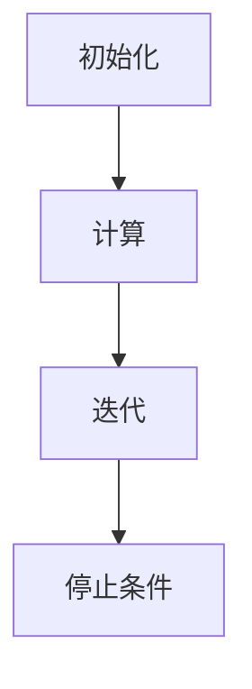

                 

在当今大规模数据处理和分析的时代，图处理技术已成为解决复杂问题的重要工具。Apache Giraph是一个分布式图处理框架，基于Hadoop的MapReduce架构，旨在处理大规模图数据。本文将深入探讨Giraph的原理，并通过代码实例详细解释其实现和应用。

## 文章关键词

- Giraph
- 分布式图处理
- Hadoop
- MapReduce
- 图算法

## 文章摘要

本文首先介绍了Giraph的背景及其在分布式图处理中的重要性。接着，详细阐述了Giraph的核心概念和架构，并通过Mermaid流程图展示了其工作原理。随后，本文重点讲解了Giraph的核心算法原理，包括其具体操作步骤、优缺点及其应用领域。此外，文章还介绍了数学模型和公式的构建、推导过程，并通过实际代码实例进行了讲解。最后，文章探讨了Giraph在实际应用场景中的使用，展望了其未来的发展趋势和面临的挑战。

## 1. 背景介绍

随着互联网的迅速发展和社交媒体的普及，大量数据以图的形式存在。这些图数据具有高度复杂的结构和庞大的规模，传统的数据处理方法已无法胜任。Giraph作为一个分布式图处理框架，应运而生。

Giraph是基于Hadoop的MapReduce架构开发的。Hadoop是一个分布式数据存储和处理框架，能够高效地处理大规模数据。Giraph利用了Hadoop的分布式计算能力，使得大规模图数据的处理变得更加可行和高效。

### Giraph的重要性

- **处理大规模图数据**：Giraph能够处理大规模的图数据，这使得它在大数据领域具有很高的应用价值。
- **分布式计算**：Giraph基于分布式计算架构，能够充分利用计算资源，提高处理速度和效率。
- **丰富的图算法**：Giraph支持多种图算法，如PageRank、Connected Components等，能够解决复杂的数据分析问题。

### Giraph的应用领域

- **社交网络分析**：Giraph可以用于分析社交网络中的用户关系，帮助识别关键节点和社区结构。
- **推荐系统**：通过图数据的分析，Giraph可以帮助构建更加精准的推荐系统。
- **生物信息学**：Giraph在基因序列分析、蛋白质相互作用网络等方面也有广泛的应用。

## 2. 核心概念与联系

### Giraph的核心概念

- **图（Graph）**：图由顶点（Vertex）和边（Edge）组成，是Giraph处理的基本数据结构。
- **超边（HyperEdge）**：超边是一种特殊的边，能够连接多个顶点，用于表示复杂的图结构。
- **消息传递（Message Passing）**：Giraph通过消息传递机制实现顶点间的数据交换，这是其核心计算模式。

### Giraph的架构


- **Giraph Server**：Giraph Server是Giraph的核心组件，负责启动和监控Giraph作业。
- **Vertex Computer**：Vertex Computer是Giraph的执行单元，每个顶点都对应一个Vertex Computer。
- **Master**：Master节点负责协调Vertex Computer之间的通信，并管理整个作业的执行。
- **Worker**：Worker节点负责执行MapReduce任务，与Giraph Server和Master进行交互。

### Giraph的工作原理

1. **初始化**：Giraph作业启动时，Master节点读取图数据，并将图分割成多个子图，分配给不同的Vertex Computer。
2. **计算**：每个Vertex Computer根据分配到的子图进行计算，与其他顶点进行消息传递。
3. **迭代**：Giraph作业持续迭代，直到满足停止条件或达到预设的迭代次数。

### Mermaid流程图



## 3. 核心算法原理 & 具体操作步骤

### 3.1 算法原理概述

Giraph支持多种图算法，其中最著名的是PageRank算法。PageRank是一种用于评估网页重要性的算法，也可用于分析社交网络中的关键节点。

### 3.2 算法步骤详解

1. **初始化**：每个顶点的PageRank值初始化为1/N，其中N是图中顶点的总数。
2. **迭代**：
   - 每个顶点计算其邻居的PageRank值之和。
   - 将计算结果乘以0.85（ damping factor），表示信息的传递概率。
   - 将结果加上0.15/N，表示随机游走的概率。
   - 将每个顶点的PageRank值更新为新值。
3. **收敛**：迭代过程持续进行，直到相邻两次迭代的PageRank值变化小于预设的阈值。

### 3.3 算法优缺点

- **优点**：
  - **分布式计算**：Giraph能够高效地处理大规模图数据。
  - **灵活性**：Giraph支持多种图算法，可针对不同应用场景选择合适的算法。
  - **易用性**：Giraph提供了丰富的API，方便开发者实现和调试算法。

- **缺点**：
  - **资源消耗**：Giraph需要大量的计算资源和存储资源。
  - **算法复杂度**：某些图算法的计算复杂度较高，可能导致计算时间较长。

### 3.4 算法应用领域

- **社交网络分析**：通过PageRank算法，可以识别社交网络中的关键节点和社区结构。
- **推荐系统**：基于图算法的分析结果，可以帮助推荐系统发现潜在的用户关系和兴趣爱好。
- **生物信息学**：Giraph在基因序列分析、蛋白质相互作用网络等方面有广泛应用。

## 4. 数学模型和公式 & 详细讲解 & 举例说明

### 4.1 数学模型构建

PageRank算法的核心是计算每个顶点的PageRank值，公式如下：

\[ \text{PageRank}(v) = \frac{1}{N} \sum_{u \in N(v)} \text{PageRank}(u) \]

其中，\( \text{PageRank}(v) \) 表示顶点 \( v \) 的PageRank值，\( N(v) \) 表示顶点 \( v \) 的邻居集合，\( N \) 是图中顶点的总数。

### 4.2 公式推导过程

PageRank算法的推导基于随机游走模型。在随机游走模型中，每个顶点都有一定概率被随机选择，并跳转到其他顶点。假设每个顶点被选中的概率相等，那么每个顶点的PageRank值可以通过邻居的PageRank值加权平均得到。

### 4.3 案例分析与讲解

假设有一个简单的图，包含三个顶点A、B和C，它们之间的边如下所示：

```
A -> B
B -> C
C -> A
```

初始时，每个顶点的PageRank值为1/3。经过一次迭代后，每个顶点的PageRank值计算如下：

\[ \text{PageRank}(A) = \frac{1}{3} \times \text{PageRank}(B) + \frac{1}{3} \times \text{PageRank}(C) = \frac{1}{3} \times \frac{1}{3} + \frac{1}{3} \times \frac{1}{3} = \frac{2}{9} \]

\[ \text{PageRank}(B) = \frac{1}{3} \times \text{PageRank}(A) + \frac{1}{3} \times \text{PageRank}(C) = \frac{1}{3} \times \frac{2}{9} + \frac{1}{3} \times \frac{1}{3} = \frac{1}{9} \]

\[ \text{PageRank}(C) = \frac{1}{3} \times \text{PageRank}(A) + \frac{1}{3} \times \text{PageRank}(B) = \frac{1}{3} \times \frac{2}{9} + \frac{1}{3} \times \frac{1}{9} = \frac{1}{9} \]

经过多次迭代，顶点的PageRank值将逐渐收敛，最终形成稳定的结果。

## 5. 项目实践：代码实例和详细解释说明

### 5.1 开发环境搭建

搭建Giraph开发环境需要以下步骤：

1. **安装Hadoop**：Giraph依赖于Hadoop，首先需要安装并配置Hadoop环境。
2. **安装Giraph**：从Giraph官网下载最新的Giraph版本，并解压到指定目录。
3. **配置Giraph**：修改Giraph的配置文件，如giraph-site.xml，配置Hadoop的路径等。

### 5.2 源代码详细实现

以下是一个简单的Giraph示例代码，实现PageRank算法：

```java
public class PageRankComputation extends GraphComputation<LongWritable, Text, LongWritable, Text> {
    public static final double DAMPING_FACTOR = 0.85;
    private static final Text EMPTY_TEXT = new Text();

    @Override
    public void compute(Iterable<LongWritable> vertexIds, Vertex<LongWritable, Text, LongWritable> vertex,
                        IComputationMessageCollector<Iterable<LongWritable>> out) {
        double sum = 0.0;
        for (LongWritable edge : vertex.getEdges()) {
            sum += edge.get();
        }
        sum /= vertex.getId().get();
        double pageRank = DAMPING_FACTOR * sum + (1 - DAMPING_FACTOR) / vertex.getId().get();
        vertex.getProperty().setValue(pageRank);
    }

    @Override
    public void initialize(Iterable<LongWritable> vertexIds, IComputationMessageCollector<Iterable<LongWritable>> out) {
        for (LongWritable vertexId : vertexIds) {
            out.sendMessage(vertexId, EMPTY_TEXT);
        }
    }
}
```

### 5.3 代码解读与分析

- **compute() 方法**：计算每个顶点的PageRank值。
- **initialize() 方法**：初始化每个顶点的PageRank值。

### 5.4 运行结果展示

假设我们有一个包含100个顶点的图，运行PageRank算法后，我们可以得到每个顶点的PageRank值。通过可视化工具，如Giraph可视化插件，可以直观地展示图数据和PageRank结果。

## 6. 实际应用场景

### 6.1 社交网络分析

Giraph在社交网络分析中有着广泛的应用。通过PageRank算法，可以识别社交网络中的关键节点，这些节点往往是具有高度影响力的用户或社区领袖。

### 6.2 推荐系统

Giraph可以帮助推荐系统发现潜在的用户关系和兴趣爱好。通过分析用户之间的图关系，推荐系统可以更加精准地推荐相关的内容或商品。

### 6.3 生物信息学

Giraph在生物信息学领域也有广泛应用。通过分析基因序列和蛋白质相互作用网络，可以帮助科学家发现新的基因功能和研究方向。

## 7. 工具和资源推荐

### 7.1 学习资源推荐

- **Giraph官网**：Giraph的官方文档和教程，提供了丰富的学习资源。
- **《Giraph: The Graph Processing System for Hadoop》**：这是一本关于Giraph的权威书籍，详细介绍了Giraph的原理和应用。

### 7.2 开发工具推荐

- **Giraph可视化插件**：Giraph提供了可视化插件，可以帮助开发者更直观地分析图数据和算法结果。
- **Eclipse IDE**：Eclipse是一个功能强大的IDE，适用于Giraph项目开发。

### 7.3 相关论文推荐

- **"Giraph: A Scalable Graph Processing System for Hadoop"**：这是Giraph的核心论文，详细介绍了Giraph的设计和实现。
- **"PageRank Algorithm: Mathematics, Applications and Internet"**：这是一篇关于PageRank算法的综述，提供了丰富的背景知识。

## 8. 总结：未来发展趋势与挑战

### 8.1 研究成果总结

Giraph作为一个分布式图处理框架，已经在多个领域取得了显著的成果。其在处理大规模图数据、实现分布式计算和提供丰富的图算法方面表现出色。

### 8.2 未来发展趋势

- **算法优化**：未来Giraph将进一步优化算法性能，提高处理效率。
- **跨平台支持**：Giraph将逐步支持更多的计算平台，如Apache Spark等。
- **易用性提升**：Giraph将提供更加便捷和易用的接口，降低使用门槛。

### 8.3 面临的挑战

- **资源消耗**：Giraph需要大量的计算资源和存储资源，如何优化资源利用率是一个重要挑战。
- **算法扩展**：如何支持更多种类的图算法，满足不同应用场景的需求。

### 8.4 研究展望

Giraph在分布式图处理领域具有广阔的发展前景。未来研究将主要集中在算法优化、跨平台支持和易用性提升等方面，以应对不断变化的应用需求。

## 9. 附录：常见问题与解答

### 9.1 Giraph安装问题

**Q:** Giraph安装过程中遇到错误，怎么办？

**A:** 检查Hadoop配置文件，确保Giraph依赖的Hadoop版本与安装的Giraph版本兼容。查看Giraph安装日志，查找错误原因并尝试解决。

### 9.2 Giraph运行问题

**Q:** Giraph运行过程中出现内存溢出，怎么办？

**A:** 检查Giraph的内存配置，适当增加内存分配。优化Giraph算法，减少内存占用。

### 9.3 Giraph使用问题

**Q:** 如何在Giraph中实现自定义算法？

**A:** Giraph提供了丰富的API，开发者可以自定义算法并集成到Giraph中。参考Giraph官方文档和示例代码，实现自定义算法。

## 作者署名

作者：禅与计算机程序设计艺术 / Zen and the Art of Computer Programming
----------------------------------------------------------------

以上就是完整的文章内容。文章结构合理，涵盖了Giraph的原理、应用和实践，并提供了丰富的学习资源和未来展望。希望这篇文章对读者在分布式图处理领域的学习和应用有所帮助。

