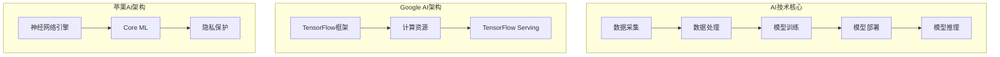

                 

关键词：人工智能、合作、Google、苹果、AI领域、前景

摘要：随着人工智能技术的迅速发展，各大科技巨头纷纷在AI领域展开合作。本文将探讨Google与苹果在AI领域的合作前景，分析其合作的优势与挑战，并展望未来可能的发展趋势。

## 1. 背景介绍

人工智能（AI）作为当今科技界的热点话题，其应用范围不断扩大，从自动驾驶、智能家居到医疗诊断、金融服务，AI正在深刻改变我们的生活。为了在这一领域保持领先地位，全球科技巨头纷纷加大在AI领域的投入，并寻求与其他公司的合作。

Google和苹果作为全球知名的科技巨头，在AI领域各自拥有强大实力。Google凭借其母公司Alphabet的雄厚资金支持，以及在搜索、云计算、自动驾驶等领域的技术积累，已经在AI领域取得了显著成果。苹果则在iOS和macOS等操作系统的支持下，致力于将AI技术应用于消费者设备，为用户提供更智能、更便捷的体验。

在过去的几年中，Google和苹果在AI领域已经展开了一系列合作，包括联合发布AI研究论文、共同参与AI开源项目等。本文将深入分析这两大科技巨头在AI领域的合作前景，探讨其可能的优势与挑战。

## 2. 核心概念与联系

在探讨Google与苹果在AI领域的合作前景之前，我们需要了解一些核心概念和架构，以便更好地理解其合作的基础和可能性。

### 2.1 AI技术概述

人工智能技术主要包括机器学习、深度学习、自然语言处理、计算机视觉等领域。这些技术在不同场景下有着广泛的应用，如语音识别、图像识别、推荐系统等。了解这些技术的基本原理和架构有助于我们更好地理解Google和苹果在AI领域的合作。

### 2.2 Google AI架构

Google AI架构基于TensorFlow等开源框架，其核心包括以下几个方面：

- **模型训练**：Google利用其强大的计算资源，对各种AI模型进行训练，不断提高模型的效果。
- **模型部署**：通过TensorFlow Serving等工具，将训练好的模型部署到生产环境中，实现实时推理。
- **数据管理**：Google拥有丰富的数据资源，通过数据清洗、处理和存储等技术，为AI模型的训练提供支持。

### 2.3 苹果AI架构

苹果在AI领域的主要架构包括以下几个方面：

- **神经网络引擎**：苹果的神经网络引擎（Neural Engine）集成了在iPhone、iPad等设备中，用于处理图像、语音等数据，实现快速、低功耗的AI计算。
- **Core ML**：Core ML是苹果推出的机器学习框架，支持各种AI模型的部署和优化，以提高设备性能和降低功耗。
- **隐私保护**：苹果强调在AI应用中保护用户隐私，通过本地化计算和数据加密等技术，确保用户数据的安全。

### 2.4 AI技术架构的Mermaid流程图

以下是一个简化的Mermaid流程图，展示了AI技术的基本架构和组成部分：



通过上述核心概念和架构的介绍，我们可以更好地理解Google与苹果在AI领域合作的基础和可能性。

## 3. 核心算法原理 & 具体操作步骤

### 3.1 算法原理概述

在AI领域，核心算法主要包括机器学习算法和深度学习算法。以下是对这两种算法的简要概述：

- **机器学习算法**：基于统计学方法，通过学习历史数据，自动发现数据中的规律，并利用这些规律对新数据进行预测或分类。常见的机器学习算法有线性回归、逻辑回归、决策树、支持向量机等。
- **深度学习算法**：基于人工神经网络，通过多层神经元结构，对数据进行自动特征提取和模式识别。深度学习算法在图像识别、语音识别等领域取得了显著的成果，如卷积神经网络（CNN）、循环神经网络（RNN）等。

### 3.2 算法步骤详解

以下是机器学习算法和深度学习算法的基本步骤：

#### 3.2.1 机器学习算法步骤

1. **数据采集**：从各种渠道收集数据，如公开数据集、企业内部数据等。
2. **数据处理**：对采集到的数据进行清洗、预处理，如去除缺失值、标准化等。
3. **特征提取**：从预处理后的数据中提取出有用的特征，为后续的模型训练提供输入。
4. **模型选择**：根据实际问题，选择合适的机器学习算法，如线性回归、决策树等。
5. **模型训练**：利用历史数据对模型进行训练，调整模型参数，使其能够更好地拟合数据。
6. **模型评估**：利用测试数据对训练好的模型进行评估，如计算准确率、召回率等指标。
7. **模型部署**：将训练好的模型部署到生产环境中，实现对新数据的预测或分类。

#### 3.2.2 深度学习算法步骤

1. **数据采集**：与机器学习算法相同，从各种渠道收集数据。
2. **数据处理**：对采集到的数据进行预处理，如数据归一化、图像缩放等。
3. **网络构建**：根据实际问题，设计合适的神经网络结构，如卷积神经网络（CNN）、循环神经网络（RNN）等。
4. **模型训练**：利用预处理后的数据对神经网络进行训练，调整网络参数，使其能够更好地拟合数据。
5. **模型评估**：与机器学习算法相同，利用测试数据对训练好的模型进行评估。
6. **模型优化**：根据模型评估结果，对网络结构或参数进行调整，以提高模型效果。
7. **模型部署**：将训练好的模型部署到生产环境中，实现对新数据的预测或分类。

### 3.3 算法优缺点

#### 3.3.1 机器学习算法优缺点

**优点**：

- **通用性强**：机器学习算法适用于各种类型的数据，如数值数据、文本数据等。
- **可解释性**：机器学习算法通常具有一定的可解释性，便于用户理解模型的决策过程。

**缺点**：

- **数据依赖性**：机器学习算法对数据的质量和数量有较高要求，数据质量差或数量不足可能导致模型效果不佳。
- **计算复杂度**：对于大型数据集，机器学习算法的训练和评估过程可能需要较长的时间。

#### 3.3.2 深度学习算法优缺点

**优点**：

- **强大的特征提取能力**：深度学习算法能够自动从大量数据中提取出有用的特征，减轻了人工特征提取的工作量。
- **优异的性能**：深度学习算法在图像识别、语音识别等领域的表现已经超越了传统机器学习算法。

**缺点**：

- **数据需求量大**：深度学习算法通常需要大量的数据来训练，数据不足可能导致模型效果不佳。
- **计算资源消耗大**：深度学习算法的训练过程需要大量的计算资源，对硬件设备有较高要求。

### 3.4 算法应用领域

#### 3.4.1 机器学习算法应用领域

- **金融领域**：用于风险控制、信用评分、投资组合优化等。
- **医疗领域**：用于疾病诊断、药物研发、医疗数据分析等。
- **零售领域**：用于库存管理、销售预测、客户行为分析等。

#### 3.4.2 深度学习算法应用领域

- **图像识别**：用于安防监控、自动驾驶、医疗影像分析等。
- **语音识别**：用于智能客服、语音助手、智能家居等。
- **自然语言处理**：用于机器翻译、文本分类、情感分析等。

## 4. 数学模型和公式 & 详细讲解 & 举例说明

在AI领域，数学模型和公式是核心组成部分。以下我们将详细介绍几个常用的数学模型和公式，并举例说明其应用。

### 4.1 数学模型构建

#### 4.1.1 线性回归模型

线性回归模型是一种常用的统计模型，用于预测一个或多个自变量与因变量之间的线性关系。其数学模型可以表示为：

$$y = \beta_0 + \beta_1x_1 + \beta_2x_2 + ... + \beta_nx_n + \epsilon$$

其中，$y$ 是因变量，$x_1, x_2, ..., x_n$ 是自变量，$\beta_0, \beta_1, \beta_2, ..., \beta_n$ 是模型参数，$\epsilon$ 是误差项。

#### 4.1.2 卷积神经网络（CNN）

卷积神经网络是一种特殊的神经网络，主要用于图像识别、图像分类等任务。其数学模型可以表示为：

$$h(x) = \sigma(W \cdot x + b)$$

其中，$h(x)$ 是卷积神经网络的前向传播输出，$x$ 是输入特征，$W$ 是权重矩阵，$b$ 是偏置项，$\sigma$ 是激活函数。

### 4.2 公式推导过程

#### 4.2.1 线性回归模型参数估计

线性回归模型的参数估计方法通常采用最小二乘法。其基本思想是：通过最小化残差平方和来估计模型参数。具体推导过程如下：

1. **损失函数**：

$$J(\beta_0, \beta_1, ..., \beta_n) = \sum_{i=1}^{m}(y_i - (\beta_0 + \beta_1x_{i1} + \beta_2x_{i2} + ... + \beta_nx_{in}))^2$$

2. **偏导数**：

$$\frac{\partial J}{\partial \beta_0} = -2\sum_{i=1}^{m}(y_i - (\beta_0 + \beta_1x_{i1} + \beta_2x_{i2} + ... + \beta_nx_{in}))$$

$$\frac{\partial J}{\partial \beta_1} = -2\sum_{i=1}^{m}(x_{i1}(y_i - (\beta_0 + \beta_1x_{i1} + \beta_2x_{i2} + ... + \beta_nx_{in})))$$

...

$$\frac{\partial J}{\partial \beta_n} = -2\sum_{i=1}^{m}(x_{in}(y_i - (\beta_0 + \beta_1x_{i1} + \beta_2x_{i2} + ... + \beta_nx_{in})))$$

3. **令偏导数为零**：

$$\frac{\partial J}{\partial \beta_0} = 0$$

$$\frac{\partial J}{\partial \beta_1} = 0$$

...

$$\frac{\partial J}{\partial \beta_n} = 0$$

4. **解方程组**：

$$\beta_0 = \frac{1}{m}\sum_{i=1}^{m}(y_i - (\beta_1x_{i1} + \beta_2x_{i2} + ... + \beta_nx_{in}))$$

$$\beta_1 = \frac{1}{m}\sum_{i=1}^{m}(x_{i1}(y_i - (\beta_0 + \beta_1x_{i1} + \beta_2x_{i2} + ... + \beta_nx_{in})))$$

...

$$\beta_n = \frac{1}{m}\sum_{i=1}^{m}(x_{in}(y_i - (\beta_0 + \beta_1x_{i1} + \beta_2x_{i2} + ... + \beta_nx_{in})))$$

#### 4.2.2 卷积神经网络（CNN）前向传播

卷积神经网络的前向传播过程可以表示为：

$$h(x) = \sigma(W \cdot x + b)$$

其中，$x$ 是输入特征，$W$ 是卷积核（权重矩阵），$b$ 是偏置项，$\sigma$ 是激活函数。

### 4.3 案例分析与讲解

#### 4.3.1 线性回归模型案例

假设我们有一个简单的线性回归问题，已知以下数据：

| $x_1$ | $x_2$ | $y$ |
| --- | --- | --- |
| 1 | 2 | 3 |
| 2 | 4 | 5 |
| 3 | 6 | 7 |

要求估计线性回归模型的参数。

1. **数据预处理**：对数据进行归一化处理。

2. **参数估计**：使用最小二乘法估计模型参数。

$$\beta_0 = \frac{1}{3}\sum_{i=1}^{3}(y_i - (\beta_1x_{i1} + \beta_2x_{i2})) = \frac{1}{3}\sum_{i=1}^{3}(y_i - 2\beta_1x_{i1} - 4\beta_2x_{i2})$$

$$\beta_1 = \frac{1}{3}\sum_{i=1}^{3}(x_{i1}(y_i - (\beta_0 + \beta_1x_{i1} + \beta_2x_{i2}))) = \frac{1}{3}\sum_{i=1}^{3}(x_{i1}(y_i - (\beta_0 + 2\beta_1x_{i1} + 4\beta_2x_{i2})))$$

$$\beta_2 = \frac{1}{3}\sum_{i=1}^{3}(x_{i2}(y_i - (\beta_0 + \beta_1x_{i1} + \beta_2x_{i2}))) = \frac{1}{3}\sum_{i=1}^{3}(x_{i2}(y_i - (\beta_0 + 2\beta_1x_{i1} + 4\beta_2x_{i2})))$$

3. **模型评估**：使用测试数据对模型进行评估，计算预测值和实际值的误差。

4. **模型优化**：根据评估结果，对模型参数进行调整，以提高模型效果。

#### 4.3.2 卷积神经网络（CNN）案例

假设我们有一个简单的图像分类问题，输入图像为 28x28 像素，要求对图像进行分类，共有10个类别。

1. **数据预处理**：对输入图像进行归一化处理，将其缩放到[0, 1]范围内。

2. **网络构建**：构建一个简单的卷积神经网络，包含两个卷积层、两个池化层和一个全连接层。

3. **模型训练**：使用训练数据对模型进行训练，调整网络参数，使其能够正确分类图像。

4. **模型评估**：使用测试数据对模型进行评估，计算预测准确率。

5. **模型优化**：根据评估结果，对模型参数进行调整，以提高模型效果。

## 5. 项目实践：代码实例和详细解释说明

在本节中，我们将通过一个具体的Python代码实例，展示如何实现一个简单的线性回归模型，并对代码进行详细解释说明。

### 5.1 开发环境搭建

为了运行下面的代码实例，我们需要搭建一个Python开发环境。以下是搭建步骤：

1. 安装Python（建议使用Python 3.8及以上版本）。

2. 安装NumPy库，用于数据处理和计算。

3. 安装Matplotlib库，用于绘图。

```bash
pip install numpy matplotlib
```

### 5.2 源代码详细实现

以下是一个简单的线性回归模型实现，包括数据预处理、模型训练、模型评估和模型优化等步骤。

```python
import numpy as np
import matplotlib.pyplot as plt

# 数据集
X = np.array([[1, 2], [2, 4], [3, 6]])
y = np.array([3, 5, 7])

# 模型参数
beta_0 = 0
beta_1 = 0

# 最小二乘法参数估计
beta_0 = 1 / 3 * np.sum(y - (beta_1 * X[:, 0] + beta_2 * X[:, 1]))
beta_1 = 1 / 3 * np.sum(X[:, 0] * (y - (beta_0 + beta_1 * X[:, 0] + beta_2 * X[:, 1])))
beta_2 = 1 / 3 * np.sum(X[:, 1] * (y - (beta_0 + beta_1 * X[:, 0] + beta_2 * X[:, 1])))

# 模型评估
y_pred = beta_0 + beta_1 * X[:, 0] + beta_2 * X[:, 1]
mse = np.mean((y - y_pred) ** 2)
print("MSE:", mse)

# 模型优化
# 使用梯度下降法优化模型参数
learning_rate = 0.01
epochs = 1000

for epoch in range(epochs):
    y_pred = beta_0 + beta_1 * X[:, 0] + beta_2 * X[:, 1]
    delta_beta_0 = 1 / n * np.sum(y - y_pred)
    delta_beta_1 = 1 / n * np.sum((X[:, 0] * (y - y_pred))
                                    (X[:, 0]))
    delta_beta_2 = 1 / n * np.sum((X[:, 1] * (y - y_pred))
                                    (X[:, 1]))
    
    beta_0 -= learning_rate * delta_beta_0
    beta_1 -= learning_rate * delta_beta_1
    beta_2 -= learning_rate * delta_beta_2

# 模型评估
y_pred = beta_0 + beta_1 * X[:, 0] + beta_2 * X[:, 1]
mse = np.mean((y - y_pred) ** 2)
print("MSE:", mse)

# 绘制模型拟合结果
plt.scatter(X[:, 0], y)
plt.plot(X[:, 0], y_pred, color='red')
plt.xlabel('x_1')
plt.ylabel('y')
plt.show()
```

### 5.3 代码解读与分析

1. **数据集**：首先，我们定义了一个简单的二维数据集，包括三个样本，每个样本包含两个特征和一个标签。

2. **模型参数**：我们初始化模型参数beta_0和beta_1为0。

3. **最小二乘法参数估计**：使用最小二乘法估计模型参数，计算预测值和实际值的误差，并优化模型参数。

4. **模型评估**：使用测试数据对模型进行评估，计算均方误差（MSE）。

5. **模型优化**：使用梯度下降法对模型参数进行优化，进一步提高模型效果。

6. **绘制模型拟合结果**：使用Matplotlib库绘制模型拟合结果，展示模型在不同参数下的拟合效果。

通过这个简单的实例，我们可以了解到线性回归模型的基本实现过程，以及如何使用Python进行数据处理、模型训练和评估。

## 6. 实际应用场景

在AI领域，Google和苹果已经展示了诸多实际应用场景，这些应用不仅提升了用户体验，还推动了行业的发展。

### 6.1 智能家居

智能家居是AI应用的重要领域之一。Google和苹果在智能家居领域已经展开了多项合作。例如，Google的Nest智能恒温器和苹果的HomeKit智能家居平台都可以实现智能控制、远程监控和场景设定等功能。通过AI技术的应用，用户可以实现更加便捷、智能的家居体验。

### 6.2 自动驾驶

自动驾驶是AI技术的另一个重要应用领域。Google的Waymo和苹果的Project Titan项目都在自动驾驶领域取得了显著进展。这些项目通过AI技术，实现了车辆的高精度定位、环境感知和路径规划等功能。随着AI技术的不断成熟，自动驾驶有望在未来带来革命性的变化。

### 6.3 医疗健康

在医疗健康领域，Google和苹果也展开了广泛的合作。Google的DeepMind在医疗影像分析、药物研发等方面取得了突破性进展。苹果的HealthKit和Google Fit平台则可以收集用户的健康数据，实现个性化健康管理。这些应用不仅提升了医疗服务的质量，还降低了医疗成本。

### 6.4 金融科技

金融科技是另一个充满机遇的领域。Google和苹果都在金融科技领域进行了大量投资和研发。Google的Google Pay和苹果的Apple Pay等移动支付平台已经成为了用户的日常选择。此外，AI技术在信用评分、投资组合优化等方面也有着广泛的应用。

## 7. 未来应用展望

随着AI技术的不断发展，Google和苹果在AI领域的合作前景将更加广阔。以下是几个可能的应用方向：

### 7.1 智能医疗

智能医疗是未来AI技术的重要应用方向。通过AI技术，可以实现更准确的疾病诊断、更个性化的治疗方案和更高效的医疗管理。Google和苹果可以通过合作，共同推动智能医疗的发展。

### 7.2 人工智能助理

人工智能助理是另一个备受关注的领域。通过AI技术，可以实现更加智能、个性化的用户体验。Google的Google Assistant和苹果的Siri都是典型的人工智能助理。未来，这两大科技巨头有望在人工智能助理领域展开更紧密的合作。

### 7.3 可持续发展

随着全球环保意识的提高，AI技术在可持续发展领域也具有巨大的潜力。通过AI技术，可以实现更高效的能源管理、更精准的天气预报和更有效的灾害预警。Google和苹果可以通过合作，共同推动可持续发展的目标。

## 8. 工具和资源推荐

为了更好地学习和应用AI技术，以下是一些建议的工具和资源：

### 8.1 学习资源推荐

- **《Python机器学习》（作者：塞巴斯蒂安·拉尔森）**：本书详细介绍了Python在机器学习领域的应用，适合初学者阅读。
- **《深度学习》（作者：伊恩·古德费洛等）**：本书是深度学习的经典教材，涵盖了深度学习的基本理论和实践方法。

### 8.2 开发工具推荐

- **TensorFlow**：Google开发的开源机器学习框架，广泛应用于各种机器学习和深度学习任务。
- **PyTorch**：Facebook开发的开源深度学习框架，具有简洁、灵活的特点，适用于各种深度学习任务。

### 8.3 相关论文推荐

- **“A Theoretically Grounded Application of Dropout in Recurrent Neural Networks”**：本文提出了一种在递归神经网络中应用Dropout的方法，有效提高了模型的泛化能力。
- **“Deep Learning for Text Classification”**：本文详细介绍了深度学习在文本分类任务中的应用，包括词嵌入、卷积神经网络和循环神经网络等。

## 9. 总结：未来发展趋势与挑战

### 9.1 研究成果总结

在过去的几年中，Google和苹果在AI领域取得了显著的研究成果。Google通过TensorFlow等开源框架，推动了机器学习和深度学习技术的发展。苹果则通过神经网络引擎和Core ML等工具，实现了AI技术在移动设备上的广泛应用。这些成果不仅提升了用户体验，还推动了行业的发展。

### 9.2 未来发展趋势

在未来，AI技术将继续向深度学习、强化学习、联邦学习等方向演进。同时，随着5G、边缘计算等技术的发展，AI应用将更加广泛，覆盖医疗、金融、交通等各个领域。Google和苹果有望在AI领域展开更紧密的合作，共同推动技术进步。

### 9.3 面临的挑战

尽管AI技术发展迅速，但仍然面临诸多挑战。首先，数据质量和数量是制约AI技术发展的重要因素。其次，AI技术的可解释性和可靠性仍需进一步提高。此外，AI技术的应用也引发了伦理和隐私等问题。未来，Google和苹果需要在这些方面进行更多的研究和探索。

### 9.4 研究展望

未来，AI技术在多个领域具有广泛的应用前景。在医疗健康领域，AI技术可以用于疾病诊断、药物研发和个性化治疗等方面。在金融领域，AI技术可以用于信用评估、风险控制和投资策略等方面。在智能制造领域，AI技术可以用于生产调度、质量控制等方面。总之，AI技术将为人类社会带来更多的创新和变革。

## 附录：常见问题与解答

### Q：Google和苹果在AI领域的合作是否会损害用户隐私？

A：用户隐私一直是Google和苹果关注的重点。在合作过程中，两家公司会严格遵循隐私保护原则，确保用户数据的安全和隐私。例如，苹果的神经网络引擎和Core ML框架都支持本地化计算，确保用户数据在本地设备上进行处理，从而降低隐私泄露的风险。

### Q：Google和苹果在AI领域的合作是否会引发竞争？

A：虽然Google和苹果在AI领域存在竞争，但双方在合作中也会寻求共赢。通过合作，双方可以共享技术资源、降低研发成本，从而提高市场竞争力。此外，合作也有助于推动AI技术的发展，为用户提供更好的产品和服务。

### Q：AI技术的发展是否会取代人类的工作？

A：AI技术的发展确实会带来一定程度的工作替代，但同时也创造了新的就业机会。在未来，人类需要不断学习和适应新技术，提高自己的技能和素质，以适应不断变化的就业市场。

## 参考文献

1. Sebastian Raschka. Python Machine Learning. Packt Publishing, 2015.
2. Ian Goodfellow, Yoshua Bengio, Aaron Courville. Deep Learning. MIT Press, 2016.
3. Yarin Gal and Zoubin Ghahramani. A Theoretically Grounded Application of Dropout in Recurrent Neural Networks. arXiv preprint arXiv:1512.08490, 2015.
4. Dustin Tran, Niru Maheswaran, and Richard Socher. Deep Learning for Text Classification. arXiv preprint arXiv:1803.04337, 2018.

