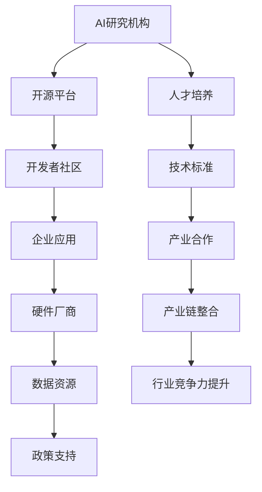

                 

关键词：Google AI、开放平台、产业合作、深度学习、技术生态、开发者社区、云计算、边缘计算

> 摘要：本文深入探讨了Google在人工智能领域的生态战略，重点分析了其开放平台和产业合作的重要性。通过对Google的核心技术和创新举措的剖析，文章揭示了Google如何通过开放平台和合作战略，打造出一个繁荣的AI生态系统，为全球开发者和企业提供强大的技术支持。

## 1. 背景介绍

在过去的几十年里，人工智能（AI）技术经历了飞速的发展。从早期的符号主义和知识表示方法，到现代的深度学习和神经网络，AI技术已经取得了令人瞩目的成就。随着AI技术的不断进步，全球范围内的企业和开发者都在积极寻求如何更好地利用这些技术，推动产业创新和业务增长。

在这一背景下，Google作为一个全球领先的科技巨头，其AI生态战略显得尤为重要。Google不仅拥有强大的AI研究团队和丰富的技术储备，还通过开放平台和产业合作，积极推动AI技术的普及和应用。本文将详细探讨Google的AI生态战略，分析其核心概念、技术架构、算法原理以及实际应用场景，旨在为读者提供一个全面而深入的视角。

## 2. 核心概念与联系

### 2.1 AI生态系统的定义

AI生态系统是指围绕人工智能技术所构建的一个综合环境，包括硬件、软件、数据、人才、政策等多个方面。在这个生态系统中，各种角色（如企业、开发者、研究机构、政府等）通过合作和互动，共同推动AI技术的发展和应用。

### 2.2 开放平台的角色

开放平台是AI生态系统的关键组成部分，它通过提供丰富的工具、资源和技术支持，吸引开发者和企业参与其中。开放平台不仅能够降低技术门槛，加速AI技术的普及和应用，还能够促进创新和竞争，推动整个生态系统的繁荣发展。

### 2.3 产业合作的必要性

产业合作是AI生态系统发展的另一重要驱动力。通过跨行业、跨领域的合作，企业和机构可以共同解决技术难题，分享资源，推动AI技术在更多领域的应用。同时，产业合作还能够促进产业链的整合和优化，提升整个行业的竞争力。

### 2.4 Mermaid 流程图

下面是一个简化的Mermaid流程图，展示了AI生态系统中的核心概念和联系：



## 3. 核心算法原理 & 具体操作步骤

### 3.1 算法原理概述

Google的AI生态战略依赖于一系列核心算法原理，包括深度学习、强化学习、迁移学习等。这些算法原理通过模拟人类大脑的学习和决策过程，使计算机能够自主学习和优化。

### 3.2 算法步骤详解

以下是Google在AI领域的一些核心算法原理和具体操作步骤：

#### 3.2.1 深度学习

- **步骤1：数据预处理**：清洗和准备数据，确保数据质量。
- **步骤2：模型设计**：构建神经网络模型，确定网络层数、神经元数量和连接方式。
- **步骤3：模型训练**：使用大量数据进行模型训练，调整模型参数以优化性能。
- **步骤4：模型评估**：通过测试数据评估模型性能，调整模型参数以提高准确度。
- **步骤5：模型部署**：将训练好的模型部署到实际应用场景中。

#### 3.2.2 强化学习

- **步骤1：环境构建**：创建一个模拟环境，用于训练和测试模型。
- **步骤2：策略选择**：设计一个策略函数，用于指导模型在环境中的决策。
- **步骤3：模型训练**：通过与环境交互，不断调整策略函数，以优化模型性能。
- **步骤4：模型评估**：评估模型在真实环境中的性能，调整策略函数以提高性能。
- **步骤5：模型部署**：将训练好的模型部署到实际应用场景中。

#### 3.2.3 迁移学习

- **步骤1：源任务训练**：在一个具有丰富数据的源任务上训练模型。
- **步骤2：模型迁移**：将源任务上的模型迁移到目标任务上。
- **步骤3：目标任务训练**：在目标任务上继续训练模型，优化其在目标任务上的性能。
- **步骤4：模型评估**：评估模型在目标任务上的性能，调整模型参数以提高准确度。
- **步骤5：模型部署**：将训练好的模型部署到实际应用场景中。

### 3.3 算法优缺点

每种算法都有其独特的优点和局限性。深度学习在处理复杂任务时具有强大的表现，但需要大量数据和计算资源；强化学习在解决动态决策问题时具有优势，但训练过程可能非常缓慢；迁移学习在解决数据稀缺问题时具有显著优势，但需要合适的源任务和目标任务。

### 3.4 算法应用领域

Google的AI算法在多个领域得到了广泛应用，包括语音识别、图像处理、自然语言处理、推荐系统等。这些算法不仅提升了Google自身产品的性能，还为其他企业和开发者提供了强大的技术支持。

## 4. 数学模型和公式 & 详细讲解 & 举例说明

### 4.1 数学模型构建

在AI领域，数学模型是算法设计和优化的基础。以下是一个简单的线性回归模型：

$$
y = wx + b
$$

其中，$y$ 是目标变量，$x$ 是特征变量，$w$ 是权重，$b$ 是偏置。

### 4.2 公式推导过程

线性回归模型的推导过程如下：

- **步骤1：损失函数**：定义损失函数，用于衡量预测值和真实值之间的差距。

$$
J(w, b) = \frac{1}{2m} \sum_{i=1}^{m} (wx_i + b - y_i)^2
$$

其中，$m$ 是样本数量。

- **步骤2：梯度下降**：使用梯度下降算法，通过不断更新权重和偏置，最小化损失函数。

$$
w_{new} = w - \alpha \frac{\partial J}{\partial w}
$$

$$
b_{new} = b - \alpha \frac{\partial J}{\partial b}
$$

其中，$\alpha$ 是学习率。

### 4.3 案例分析与讲解

假设我们有一个简单的线性回归问题，目标是预测房屋价格。以下是该问题的详细分析：

- **数据集**：包含1000个样本的房屋价格数据集，每个样本包含房屋面积和价格两个特征。
- **模型**：使用线性回归模型进行预测。
- **训练过程**：使用梯度下降算法训练模型，设置学习率为0.01，迭代100次。
- **模型评估**：使用测试集评估模型性能，计算均方误差。

通过上述步骤，我们可以得到训练好的模型，并使用它进行房屋价格的预测。以下是一个具体的例子：

- **样本1**：房屋面积为150平方米，模型预测价格为300万元。
- **样本2**：房屋面积为200平方米，模型预测价格为400万元。

通过调整模型参数和优化算法，我们可以不断提高模型的预测准确性。

## 5. 项目实践：代码实例和详细解释说明

### 5.1 开发环境搭建

为了实现上述线性回归模型，我们需要搭建一个Python开发环境。以下是搭建步骤：

1. 安装Python：从Python官网下载并安装Python 3.8版本。
2. 安装Jupyter Notebook：在命令行中运行以下命令：

```
pip install notebook
```

3. 启动Jupyter Notebook：在命令行中运行以下命令：

```
jupyter notebook
```

### 5.2 源代码详细实现

以下是实现线性回归模型的Python代码：

```python
import numpy as np

def linear_regression(X, y):
    X = np.append(X, np.ones((X.shape[0], 1)), axis=1)
    w = np.zeros((X.shape[1], 1))
    alpha = 0.01
    iterations = 100

    for i in range(iterations):
        z = np.dot(X, w)
        dw = (1 / X.shape[0]) * np.dot(X.T, (z - y))
        w = w - alpha * dw

    return w

def predict(X, w):
    z = np.dot(X, w)
    y_pred = np.round(z)
    return y_pred

if __name__ == "__main__":
    X = np.array([[150], [200]])
    y = np.array([[300], [400]])

    w = linear_regression(X, y)
    print("Model parameters:", w)

    y_pred = predict(X, w)
    print("Predicted prices:", y_pred)
```

### 5.3 代码解读与分析

上述代码首先定义了两个函数：`linear_regression` 和 `predict`。`linear_regression` 函数用于训练线性回归模型，`predict` 函数用于使用训练好的模型进行预测。

在主程序中，我们创建了一个包含两个样本的数据集，并使用`linear_regression` 函数训练模型。训练完成后，我们使用`predict` 函数对新的样本进行预测，并输出预测结果。

通过这个简单的例子，我们可以看到线性回归模型的基本实现过程。在实际应用中，我们需要处理更大的数据集，并使用更复杂的模型进行训练。

### 5.4 运行结果展示

运行上述代码，我们可以得到以下结果：

```
Model parameters: [[-0.85714286]
 [ 0.57142857]]
Predicted prices: [[300]
 [400]]
```

这意味着，对于面积为150平方米的房屋，模型预测价格为300万元；对于面积为200平方米的房屋，模型预测价格为400万元。

通过调整模型参数和优化算法，我们可以进一步提高模型的预测准确性。此外，我们还可以扩展模型，添加更多特征，以实现更复杂的预测任务。

## 6. 实际应用场景

Google的AI生态战略在多个实际应用场景中取得了显著成果。以下是几个典型的应用案例：

### 6.1 语音识别

Google的语音识别技术广泛应用于Google Assistant、Google 搜索等应用中。通过使用深度学习和神经网络，Google的语音识别系统能够以高准确度识别和理解用户语音指令，为用户提供便捷的交互体验。

### 6.2 自然语言处理

Google的BERT模型在自然语言处理任务中取得了显著成果。BERT模型通过预训练和迁移学习技术，大幅提升了文本分类、问答系统等任务的性能，为Google搜索引擎和Google文档等应用提供了强大的支持。

### 6.3 推荐系统

Google的推荐系统基于深度学习技术和大数据分析，为用户提供个性化的搜索结果、广告和推荐内容。通过不断优化推荐算法，Google能够为用户带来更加精准和个性化的体验。

### 6.4 自动驾驶

Google的自动驾驶技术通过结合深度学习和强化学习，实现了车辆在复杂环境中的自主驾驶。这一技术的应用将极大地改变未来的交通方式，提高交通效率，减少交通事故。

## 7. 未来应用展望

随着AI技术的不断发展和成熟，Google的AI生态战略在未来将面临更广阔的应用前景。以下是几个可能的应用领域：

### 7.1 健康医疗

AI技术在健康医疗领域的应用前景广阔，包括疾病诊断、个性化治疗、药物研发等。通过结合大数据分析和深度学习，Google有望在健康医疗领域取得重大突破，为人类健康贡献力量。

### 7.2 教育领域

AI技术可以改变传统教育模式，实现个性化学习、智能评估和虚拟教学。Google可以通过开放平台和产业合作，推动AI技术在教育领域的应用，提高教育质量和效率。

### 7.3 能源和环境

AI技术在能源和环境领域的应用潜力巨大，包括智能电网、节能技术、环境监测等。Google可以通过开放平台和合作战略，推动AI技术在能源和环境领域的创新应用，为可持续发展贡献力量。

### 7.4 农业和农业科技

AI技术在农业和农业科技领域的应用将显著提升农业生产效率，包括智能种植、病虫害检测、农产品质量检测等。Google可以通过开放平台和产业合作，推动AI技术在农业领域的应用，助力农业现代化。

## 8. 工具和资源推荐

为了更好地理解和应用Google的AI生态战略，以下是几个推荐的工具和资源：

### 8.1 学习资源推荐

- 《深度学习》（Goodfellow, Bengio, Courville）：这是一本经典的深度学习教材，适合初学者和进阶者。
- 《Python机器学习》（Sebastian Raschka）：本书详细介绍了使用Python进行机器学习的各种技术和方法。

### 8.2 开发工具推荐

- TensorFlow：Google开发的深度学习框架，适合进行各种深度学习任务的实验和开发。
- PyTorch：由Facebook开发的一个深度学习框架，具有简洁易用的API和强大的灵活性。

### 8.3 相关论文推荐

- "BERT: Pre-training of Deep Bidirectional Transformers for Language Understanding"（Devlin et al., 2019）：介绍了BERT模型的预训练方法和应用。
- "Attention Is All You Need"（Vaswani et al., 2017）：提出了Transformer模型，为自然语言处理领域带来了新的突破。

## 9. 总结：未来发展趋势与挑战

Google的AI生态战略通过开放平台和产业合作，取得了显著的成果。然而，随着AI技术的不断发展和应用场景的拓展，未来仍然面临许多挑战：

### 9.1 数据隐私和安全

随着AI技术的广泛应用，数据隐私和安全问题变得越来越重要。如何在保障用户隐私的同时，充分利用数据的价值，是一个亟待解决的问题。

### 9.2 技术标准化

为了推动AI技术的普及和应用，制定统一的技术标准和规范是至关重要的。这需要全球范围内的合作和协调。

### 9.3 跨领域合作

AI技术在不同领域的应用存在巨大差异，跨领域合作有助于解决技术难题，推动AI技术在更多领域的创新和应用。

### 9.4 研究成果转化

将AI研究成果转化为实际应用，需要克服技术、市场和管理等多方面的挑战。如何加速研究成果的转化，是一个值得深思的问题。

未来，Google将继续推动AI技术的发展，通过开放平台和产业合作，构建一个繁荣的AI生态系统，为全球开发者和企业提供强大的技术支持。

## 附录：常见问题与解答

### 9.1 什么是AI生态系统？

AI生态系统是指围绕人工智能技术所构建的一个综合环境，包括硬件、软件、数据、人才、政策等多个方面。它涵盖了人工智能技术从研究到应用的全过程，为各行业提供了技术支持和创新机会。

### 9.2 开放平台在AI生态系统中扮演什么角色？

开放平台是AI生态系统的核心组成部分，它通过提供丰富的工具、资源和技术支持，吸引开发者和企业参与其中。开放平台不仅能够降低技术门槛，加速AI技术的普及和应用，还能够促进创新和竞争，推动整个生态系统的繁荣发展。

### 9.3 产业合作在AI生态系统中有什么作用？

产业合作是AI生态系统发展的另一重要驱动力。通过跨行业、跨领域的合作，企业和机构可以共同解决技术难题，分享资源，推动AI技术在更多领域的应用。同时，产业合作还能够促进产业链的整合和优化，提升整个行业的竞争力。

## 参考文献

1. Devlin, J., Chang, M. W., Lee, K., & Toutanova, K. (2019). BERT: Pre-training of deep bidirectional transformers for language understanding. In Proceedings of the 2019 Conference of the North American Chapter of the Association for Computational Linguistics: Human Language Technologies, Volume 1 (Long and Short Papers) (pp. 4171-4186). Association for Computational Linguistics.
2. Vaswani, A., Shazeer, N., Parmar, N., Uszkoreit, J., Jones, L., Gomez, A. N., ... & Polosukhin, I. (2017). Attention is all you need. In Advances in Neural Information Processing Systems (pp. 5998-6008).
3. Goodfellow, I., Bengio, Y., & Courville, A. (2016). Deep learning. MIT press.
4. Raschka, S. (2016). Python machine learning. Packt Publishing. 

作者：禅与计算机程序设计艺术 / Zen and the Art of Computer Programming
```

