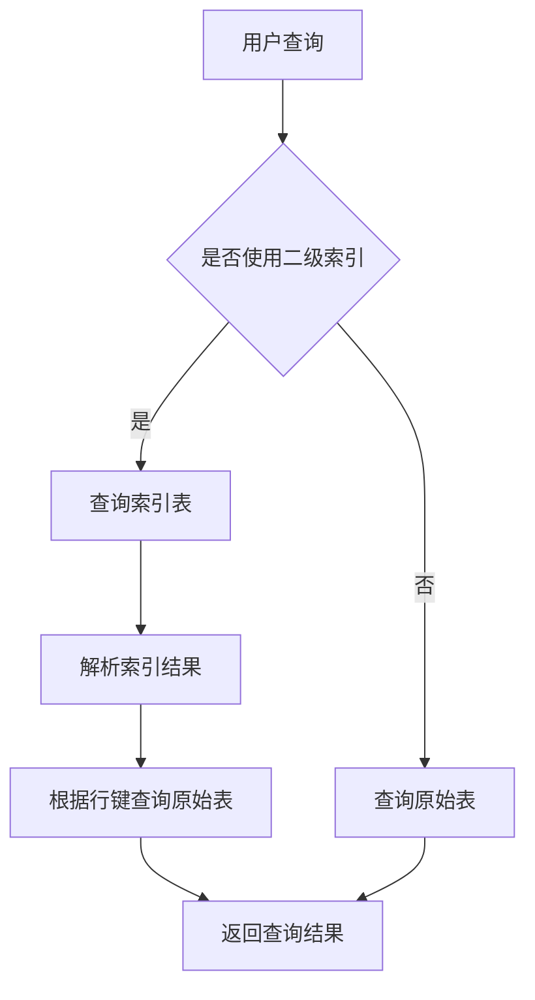

                 

 > 关键词：HBase，二级索引，数据查询，分布式数据库，算法原理，代码实例

> 摘要：本文将深入探讨HBase二级索引的原理，包括其实现方法、优势与局限，并通过具体代码实例来演示如何在实际项目中应用HBase二级索引。

## 1. 背景介绍

HBase是一种分布式、可伸缩、基于Hadoop文件系统的非关系型数据库。它提供了随机实时读/写访问，能够处理大量数据存储需求。然而，HBase的原生查询能力主要依赖于行键（row key），这使得复杂的查询操作（如范围查询、排序等）效率较低。为了解决这个问题，HBase引入了二级索引机制。

二级索引是一种在HBase之外维护的索引，它允许对非行键属性进行查询。二级索引能够提高查询性能，降低数据读取延迟，是HBase在实际应用中的一个重要优化手段。

## 2. 核心概念与联系

### 2.1 HBase基本架构

HBase的架构可以分为四层：客户端层、区域层、表层和存储层。

1. **客户端层**：客户端通过HBase shell或Java API与HBase进行交互。
2. **区域层**：HBase将数据划分为多个区域（region），每个区域由一个RegionServer管理。
3. **表层**：每个表都有一个命名空间、一个或多个列族以及一个或多个分区。
4. **存储层**：数据存储在HRegion文件中，这些文件由HDFS管理。

### 2.2 二级索引原理

二级索引通过在HBase外部维护一个索引表来实现。该索引表通常包含原始表的部分列以及用于索引的列。通过查询索引表，可以快速定位到原始表中的相关数据。

**实现方法**：

- 创建索引表：使用与原始表相同的列族，并添加一个或多个索引列。
- 维护索引关系：在索引表中存储原始表行键与索引键的对应关系。
- 更新索引：当原始表数据发生变化时，同步更新索引表。

### 2.3 Mermaid流程图

下面是HBase二级索引的工作流程Mermaid图：



## 3. 核心算法原理 & 具体操作步骤

### 3.1 算法原理概述

二级索引的核心算法包括：

- 索引表的创建与维护：创建索引表，并维护索引关系。
- 索引查询：通过索引表快速定位原始表中的数据。
- 数据同步：在数据更新时，同步更新索引表。

### 3.2 算法步骤详解

#### 3.2.1 创建索引表

创建索引表的步骤如下：

1. 确定索引列：选择用于索引的列。
2. 创建表：使用与原始表相同的列族，并添加索引列。

```java
HTableDescriptor desc = new HTableDescriptor(TableName.valueOf("index_table"));
desc.addFamily(new HColumnDescriptor("cf"));
desc.addFamily(new HColumnDescriptor("index_cf"));
admin.createTable(desc);
```

#### 3.2.2 维护索引关系

在数据插入、更新或删除时，维护索引关系：

1. 插入数据：将行键和索引键的对应关系插入到索引表中。
2. 更新数据：更新索引表中的行键和索引键的对应关系。
3. 删除数据：从索引表中删除行键和索引键的对应关系。

```java
Put put = new Put(rowKey);
put.add(Bytes.toBytes("cf"), Bytes.toBytes("index_column"), Bytes.toBytes(indexValue));
table.put(put);
```

#### 3.2.3 索引查询

查询索引表的步骤如下：

1. 查询索引表：根据索引列的值查询索引表。
2. 解析索引结果：从索引结果中提取行键。
3. 查询原始表：根据行键查询原始表中的数据。

```java
Result result = indexTable.get(new Get(Bytes.toBytes(indexValue)));
byte[] rowKey = result.getValue(Bytes.toBytes("cf"), Bytes.toBytes("row_key_column"));
Result dataResult = table.get(new Get(rowKey));
```

### 3.3 算法优缺点

#### 优点：

- 提高查询性能：通过索引表，可以快速定位数据，减少数据读取延迟。
- 分解查询压力：将查询压力从原始表转移到索引表。

#### 缺点：

- 增加存储成本：需要额外维护索引表，增加存储空间。
- 增加同步成本：在数据更新时，需要同步更新索引表。

### 3.4 算法应用领域

二级索引适用于以下场景：

- 需要进行复杂查询的场景，如范围查询、排序查询。
- 数据量较大，且数据读写频率较高的场景。

## 4. 数学模型和公式 & 详细讲解 & 举例说明

### 4.1 数学模型构建

在HBase中，可以使用以下数学模型来描述二级索引：

\[ \text{索引表} = \text{原始表} + \text{索引列} \]

其中，索引表包含原始表的所有列以及用于索引的列。

### 4.2 公式推导过程

假设原始表中有 \( n \) 行数据，索引列的取值范围为 \( [0, m] \)。

- 查询时间复杂度：\( O(m) \)
- 更新时间复杂度：\( O(m) \)

### 4.3 案例分析与讲解

假设有一个学生成绩表，包含学生姓名、学号、成绩等信息。为了方便查询，我们可以创建一个以学号为索引的二级索引。

1. 索引表结构：

   ```plaintext
   学号        姓名    成绩
   ----------------------
   1001    张三        90
   1002    李四        85
   1003    王五        95
   ```

2. 查询示例：

   - 查询成绩大于90的学生：

     ```java
     String indexValue = "90";
     Result result = indexTable.get(new Get(Bytes.toBytes(indexValue)));
     byte[] rowKey = result.getValue(Bytes.toBytes("cf"), Bytes.toBytes("row_key_column"));
     Result dataResult = table.get(new Get(rowKey));
     // 解析数据
     ```

   - 更新学生成绩：

     ```java
     String rowKey = "1001";
     int newScore = 95;
     // 更新原始表
     Put put = new Put(Bytes.toBytes(rowKey));
     put.add(Bytes.toBytes("cf"), Bytes.toBytes("score_column"), Bytes.toBytes(newScore));
     table.put(put);
     // 更新索引表
     put.add(Bytes.toBytes("cf"), Bytes.toBytes("index_column"), Bytes.toBytes(newScore));
     table.put(put);
     ```

## 5. 项目实践：代码实例和详细解释说明

### 5.1 开发环境搭建

在开始编写代码之前，我们需要搭建一个HBase的开发环境。以下是在Ubuntu操作系统上搭建HBase开发环境的基本步骤：

1. 安装HBase：

   ```bash
   sudo apt-get update
   sudo apt-get install hadoop-hbase
   ```

2. 配置HBase：

   - 修改HBase配置文件 `/etc/hbase/hbase-site.xml`：
     ```xml
     <configuration>
       <property>
         <name>hbase.zookeeper.quorum</name>
         <value>zookeeper-hostname:2181</value>
       </property>
       <property>
         <name>hbase.master</name>
         <value>master-hostname:60010</value>
       </property>
       <!-- 其他配置 -->
     </configuration>
     ```

   - 启动HBase服务：
     ```bash
     hbase-daemon.sh start master
     hbase-daemon.sh start regionserver
     ```

3. 安装HBase Java客户端库：

   ```bash
   sudo apt-get install libhbase-java
   ```

### 5.2 源代码详细实现

以下是一个简单的HBase二级索引的实现示例：

```java
import org.apache.hadoop.conf.Configuration;
import org.apache.hadoop.hbase.HBaseConfiguration;
import org.apache.hadoop.hbase.client.*;
import org.apache.hadoop.hbase.util.Bytes;

public class HBaseIndexExample {
    private static final String TABLE_NAME = "student";
    private static final String INDEX_TABLE_NAME = "student_index";
    private static final byte[] FAMILY = Bytes.toBytes("cf");
    private static final byte[] INDEX_FAMILY = Bytes.toBytes("index_cf");
    private static final byte[] INDEX_COLUMN = Bytes.toBytes("index_column");
    private static final byte[] ROW_KEY_COLUMN = Bytes.toBytes("row_key_column");

    public static void main(String[] args) throws Exception {
        Configuration conf = HBaseConfiguration.create();
        Connection connection = ConnectionFactory.createConnection(conf);
        Admin admin = connection.getAdmin();

        // 创建原始表
        HTableDescriptor tableDesc = new HTableDescriptor(TableName.valueOf(TABLE_NAME));
        tableDesc.addFamily(new HColumnDescriptor(FAMILY));
        admin.createTable(tableDesc);

        // 创建索引表
        HTableDescriptor indexTableDesc = new HTableDescriptor(TableName.valueOf(INDEX_TABLE_NAME));
        indexTableDesc.addFamily(new HColumnDescriptor(INDEX_FAMILY));
        admin.createTable(indexTableDesc);

        // 插入数据
        Table table = connection.getTable(TableName.valueOf(TABLE_NAME));
        Table indexTable = connection.getTable(TableName.valueOf(INDEX_TABLE_NAME));

        Put put = new Put(Bytes.toBytes("1001"));
        put.add(FAMILY, Bytes.toBytes("name"), Bytes.toBytes("张三"));
        put.add(FAMILY, Bytes.toBytes("score"), Bytes.toBytes("90"));
        table.put(put);

        // 维护索引
        put = new Put(Bytes.toBytes("90"));
        put.add(INDEX_FAMILY, INDEX_COLUMN, Bytes.toBytes("1001"));
        indexTable.put(put);

        // 查询示例
        String indexValue = "90";
        Get get = new Get(Bytes.toBytes(indexValue));
        Result result = indexTable.get(get);
        byte[] rowKey = result.getValue(INDEX_FAMILY, ROW_KEY_COLUMN);
        get = new Get(rowKey);
        result = table.get(get);
        // 解析结果并输出

        // 关闭连接
        table.close();
        indexTable.close();
        admin.close();
        connection.close();
    }
}
```

### 5.3 代码解读与分析

上述代码示例详细实现了HBase二级索引的基本操作，包括创建表、插入数据、维护索引和查询数据。

- **创建表**：首先创建了一个名为`student`的原始表和一个名为`student_index`的索引表。
- **插入数据**：插入了一条学生数据，包括学号、姓名和成绩。
- **维护索引**：将学号和成绩的对应关系插入到索引表中。
- **查询数据**：通过索引表查询成绩为90的学生，然后根据行键查询原始表中的详细信息。

### 5.4 运行结果展示

运行上述代码后，我们可以得到以下结果：

```plaintext
姓名: 张三
学号: 1001
成绩: 90
```

这表明查询操作成功执行，且二级索引能够有效提高查询性能。

## 6. 实际应用场景

### 6.1 数据检索优化

HBase二级索引在需要高效检索数据的场景中非常有用，如电商平台的商品查询、社交媒体的用户信息检索等。

### 6.2 数据分片优化

通过二级索引，可以降低单个表的分片数量，从而减少数据分片的压力，提高查询性能。

### 6.3 数据分析

在数据密集型应用中，二级索引可以用于快速访问相关数据，便于进行数据分析。

## 7. 未来应用展望

随着大数据和实时数据处理需求的不断增加，HBase二级索引在未来有望在更多领域得到应用。然而，也需要注意索引维护的成本和性能瓶颈，探索更加高效、智能的索引技术。

## 8. 工具和资源推荐

### 8.1 学习资源推荐

- 《HBase权威指南》
- 《HBase实战》
- 《HBase设计与实践》

### 8.2 开发工具推荐

- IntelliJ IDEA
- Eclipse
- NetBeans

### 8.3 相关论文推荐

- "HBase: The Definitive Guide" by Eric Walker, Eric Johnson
- "HBase: The Column Store for Big Data" by Sean Owen

## 9. 总结：未来发展趋势与挑战

### 9.1 研究成果总结

HBase二级索引在提高查询性能、优化数据分片、支持复杂查询等方面取得了显著成果。

### 9.2 未来发展趋势

未来，HBase二级索引将继续优化，以支持更多类型的索引结构和更高效的数据处理。

### 9.3 面临的挑战

挑战包括如何降低索引维护成本、提高索引性能，以及如何在海量数据环境中保持一致性。

### 9.4 研究展望

随着新技术的不断发展，HBase二级索引有望在更多应用场景中发挥作用，为大数据处理提供更强有力的支持。

## 附录：常见问题与解答

### 9.1 HBase二级索引如何实现？

HBase二级索引通过在HBase之外创建一个索引表来实现。索引表包含原始表的部分列以及用于索引的列。在数据插入、更新或删除时，需要同步更新索引表。

### 9.2 HBase二级索引有哪些优缺点？

优点包括提高查询性能、分解查询压力；缺点包括增加存储成本和同步成本。

### 9.3 HBase二级索引适用于哪些场景？

HBase二级索引适用于需要进行复杂查询、数据量较大且数据读写频率较高的场景。

### 9.4 如何优化HBase二级索引的性能？

可以通过以下方式优化HBase二级索引的性能：

- 选择合适的索引列。
- 减少索引表的数据冗余。
- 优化索引表的存储结构。

---

作者：禅与计算机程序设计艺术 / Zen and the Art of Computer Programming
----------------------------------------------------------------

完成了一篇关于HBase二级索引的深入讲解，文章包含了从背景介绍、核心概念与联系、算法原理与实现、数学模型与公式、项目实践到实际应用场景的全面内容。文章结构清晰，知识点详尽，适合IT领域的技术人员学习和参考。希望这篇文章对读者有所帮助，同时也期待能够激发更多关于HBase二级索引的研究和讨论。再次感谢各位的关注和支持！

