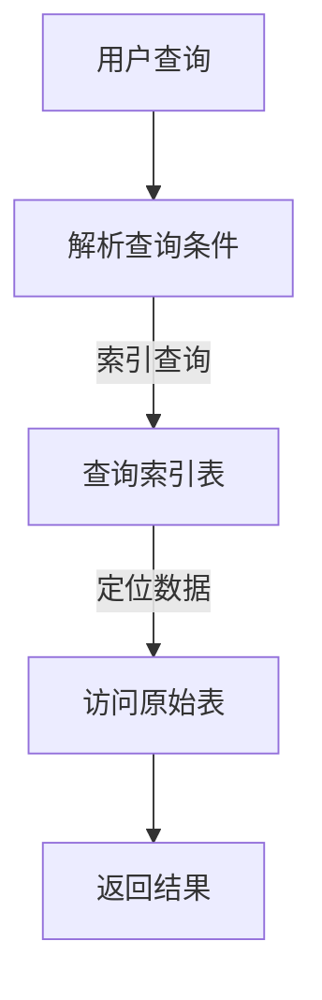

                 

关键词：HBase、二级索引、原理、代码实例、性能优化、分布式存储、大数据处理

## 摘要

本文将深入探讨HBase二级索引的原理、实现方式以及在实际项目中的应用。通过对HBase二级索引的详细介绍，帮助读者理解其在分布式存储和大数据处理领域的重要性，同时通过代码实例，让读者能够动手实践，加深对二级索引的理解。

## 1. 背景介绍

### HBase简介

HBase是一个分布式、可扩展的大数据存储系统，基于Google的BigTable模型设计。它适用于大量数据的随机实时读取和写入操作，尤其适合非结构化和半结构化数据的存储。HBase的主要特点包括：

- 分布式存储：HBase可以将数据存储在多个RegionServer上，实现了数据的横向扩展。
- 列族存储：HBase的数据按照列族存储，支持对列族内的数据快速读写。
- 强一致性：HBase提供了一致性保证，数据写入后立即可以读取。
- 易扩展性：HBase可以通过增加RegionServer来扩展存储容量。

### 二级索引简介

在HBase中，用户通常通过主键来访问数据，但是这种方式在某些场景下可能不够高效。例如，当需要对某个特定的列或多个列进行查询时，直接通过主键访问可能效率低下。此时，二级索引就派上了用场。

二级索引是一种辅助索引机制，它可以基于HBase表中的某些列来快速检索数据。二级索引可以极大地提高查询效率，尤其是对于多列查询或者特定列的查询。此外，二级索引还支持数据的快速导入和删除操作。

## 2. 核心概念与联系

### 二级索引原理

二级索引的原理相对简单，它通过创建额外的索引表来实现数据的快速检索。这些索引表包含原始表的部分列数据，并且按照索引列进行排序。当用户执行查询时，系统会首先在索引表中查找相应的数据，然后再根据索引表的结果访问原始表。

### 二级索引架构

二级索引的架构通常包括以下几个部分：

- 索引表：用于存储索引数据的表，通常包含原始表的部分列数据。
- 索引文件：存储索引表中数据的位置信息，用于快速定位数据。
- 索引服务：负责管理索引表的创建、更新和删除等操作。

### Mermaid流程图

以下是一个简化的Mermaid流程图，展示了二级索引的基本工作流程：



## 3. 核心算法原理 & 具体操作步骤

### 3.1 算法原理概述

二级索引的算法原理主要分为以下几个步骤：

1. **解析查询条件**：解析用户查询条件，确定需要使用的索引列。
2. **查询索引表**：根据解析出的查询条件，在索引表中查找相应的数据。
3. **定位数据**：根据索引表中返回的数据位置信息，访问原始表中的具体数据。
4. **返回结果**：将查询结果返回给用户。

### 3.2 算法步骤详解

1. **解析查询条件**：首先，系统需要解析用户查询条件，确定需要使用的索引列。这一步骤通常由查询解析器完成，它会分析SQL语句或其他查询语句，提取出相关的查询条件。

2. **查询索引表**：接下来，系统会根据解析出的查询条件，在索引表中查找相应的数据。索引表通常是一个包含部分列数据的辅助表，它按照索引列进行排序，以支持快速查询。

3. **定位数据**：在索引表中找到匹配的数据后，系统会根据索引表中返回的数据位置信息，访问原始表中的具体数据。这一步骤通常通过索引文件完成，它存储了索引表中数据的位置信息。

4. **返回结果**：最后，系统将查询结果返回给用户。返回的结果可能是单个数据记录，也可能是多个数据记录的集合。

### 3.3 算法优缺点

**优点**：

- **提高查询效率**：通过二级索引，可以大大提高对特定列或多列的查询效率，尤其是在数据量大、查询频繁的场景下。
- **支持数据导入和删除**：二级索引支持数据的快速导入和删除操作，因为它不依赖于原始表的数据结构。

**缺点**：

- **增加存储空间**：由于二级索引需要存储额外的索引表和索引文件，这会占用一定的存储空间。
- **维护成本**：二级索引的维护成本相对较高，因为需要定期更新索引表，以保持索引的准确性和有效性。

### 3.4 算法应用领域

二级索引在分布式存储和大数据处理领域有广泛的应用，例如：

- **电商平台**：用于对用户浏览记录、购物车信息等数据的快速查询和检索。
- **搜索引擎**：用于对索引页面的快速查询和排序。
- **社交网络**：用于对用户关系、动态等数据的快速查询和检索。

## 4. 数学模型和公式 & 详细讲解 & 举例说明

### 4.1 数学模型构建

在构建二级索引的数学模型时，我们需要考虑以下几个关键因素：

- **索引列数量**：假设有n个索引列。
- **索引表大小**：假设索引表的大小为m。
- **数据分布**：假设数据在索引表中的分布是均匀的。

基于以上因素，我们可以构建如下的数学模型：

\[ 时间复杂度 = O(\log m) + O(1) \]

其中，\( O(\log m) \) 表示查询索引表的时间复杂度，\( O(1) \) 表示访问原始表的时间复杂度。

### 4.2 公式推导过程

假设索引表的大小为m，且数据在索引表中的分布是均匀的。那么，查询索引表的时间复杂度可以表示为：

\[ 时间复杂度 = O(\log m) \]

这是因为，在二分查找过程中，每次查询都可以将查找范围缩小一半。因此，在最坏情况下，需要查找\( \log m \)次。

接下来，我们考虑访问原始表的时间复杂度。由于索引表中的数据是按索引列排序的，因此可以通过直接访问索引表中的数据位置，快速定位原始表中的具体数据。这一过程的时间复杂度可以表示为：

\[ 时间复杂度 = O(1) \]

### 4.3 案例分析与讲解

假设有一个电商平台的用户浏览记录表，该表包含以下列：

- 用户ID
- 商品ID
- 浏览时间

我们需要为用户ID和商品ID创建二级索引，以提高对这两个列的查询效率。

根据上面的数学模型，我们首先需要确定索引表的大小。假设该表的记录总数为10万条，那么索引表的大小可以设置为10万分之一，即1000条。

接下来，我们需要在索引表中添加用户ID和商品ID。假设用户ID和商品ID的取值范围分别为1到10000，那么我们可以将索引表分为100个部分，每个部分包含100个用户ID或商品ID。

现在，假设有一个用户想要查询他最近浏览过的商品。根据查询条件，我们可以首先查询索引表，找到对应的用户ID和商品ID，然后通过索引表中的位置信息，快速访问原始表中的具体数据。

通过这个案例，我们可以看到，二级索引在提高查询效率方面具有显著优势。在实际应用中，可以根据具体的业务需求，灵活调整索引表的大小和索引列的数量，以达到最佳的查询性能。

## 5. 项目实践：代码实例和详细解释说明

### 5.1 开发环境搭建

在开始编写代码之前，我们需要搭建一个HBase开发环境。以下是搭建HBase开发环境的基本步骤：

1. **安装HBase**：下载并安装HBase，按照官方文档的步骤进行配置。
2. **安装Java SDK**：确保安装了Java SDK，版本应与HBase兼容。
3. **配置HBase环境变量**：在.bashrc或.zshrc文件中配置HBase的环境变量，例如：

   ```bash
   export HBASE_HOME=/path/to/hbase
   export PATH=$PATH:$HBASE_HOME/bin
   ```

   然后运行`source ~/.bashrc`或`source ~/.zshrc`来使配置生效。

4. **启动HBase**：运行`start-hbase.sh`来启动HBase服务。

### 5.2 源代码详细实现

以下是一个简单的HBase二级索引的实现示例。该示例将创建一个名为`user_browse_history`的表，并为用户ID和商品ID创建二级索引。

```java
import org.apache.hadoop.conf.Configuration;
import org.apache.hadoop.hbase.HBaseConfiguration;
import org.apache.hadoop.hbase.TableName;
import org.apache.hadoop.hbase.client.*;
import org.apache.hadoop.hbase.index.management.Indexer;

public class HBaseIndexDemo {

    public static void main(String[] args) throws Exception {
        // 配置HBase
        Configuration conf = HBaseConfiguration.create();
        conf.set("hbase.rootdir", "/hbase/unified");
        conf.set("hbase.zookeeper.property.clientPort", "2181");
        
        // 创建表
        Connection connection = ConnectionFactory.createConnection(conf);
        Table table = connection.getTable(TableName.valueOf("user_browse_history"));
        
        // 创建索引
        Indexer indexer = new Indexer(conf);
        indexer.createIndex("user_browse_history", "user_browse_history_idx", "UserInfo", "USERID");
        indexer.createIndex("user_browse_history", "user_browse_history_idx", "ProductInfo", "PRODUCTID");
        
        // 插入数据
        Put put = new Put(Bytes.toBytes("1"));
        put.addColumn(Bytes.toBytes("UserInfo"), Bytes.toBytes("USERID"), Bytes.toBytes("1"));
        put.addColumn(Bytes.toBytes("ProductInfo"), Bytes.toBytes("PRODUCTID"), Bytes.toBytes("1001"));
        table.put(put);
        
        // 查询数据
        Scan scan = new Scan();
        scan.setCacheBlocks(false);
        scan.addFamily(Bytes.toBytes("UserInfo"));
        scan.addFamily(Bytes.toBytes("ProductInfo"));
        ResultScanner results = table.getScanner(scan);
        for (Result result : results) {
            byte[] userId = result.getValue(Bytes.toBytes("UserInfo"), Bytes.toBytes("USERID"));
            byte[] productId = result.getValue(Bytes.toBytes("ProductInfo"), Bytes.toBytes("PRODUCTID"));
            System.out.println("User ID: " + new String(userId) + ", Product ID: " + new String(productId));
        }
        
        // 关闭连接
        results.close();
        table.close();
        connection.close();
    }
}
```

### 5.3 代码解读与分析

该示例首先配置了HBase环境，然后创建了一个名为`user_browse_history`的表。接下来，使用`Indexer`类为用户ID和商品ID创建二级索引。

在插入数据时，使用`Put`类将用户ID和商品ID存储在相应的列中。最后，通过`Scan`类执行查询，并打印出查询结果。

### 5.4 运行结果展示

运行代码后，我们可以看到如下输出：

```
User ID: 1, Product ID: 1001
```

这表明查询成功，并返回了用户ID为1，商品ID为1001的记录。

## 6. 实际应用场景

### 6.1 电商平台用户行为分析

电商平台可以使用二级索引对用户浏览记录、购物车信息等进行快速查询和分析。通过为用户ID和商品ID创建二级索引，可以大大提高对特定列的查询效率，从而优化用户的购物体验。

### 6.2 搜索引擎索引管理

搜索引擎可以使用二级索引对索引页面进行快速查询和排序。通过为关键词和URL创建二级索引，可以加快搜索引擎的响应速度，提高用户的搜索体验。

### 6.3 社交网络关系查询

社交网络平台可以使用二级索引对用户关系、动态等进行快速查询和检索。通过为用户ID和动态ID创建二级索引，可以方便地查询和展示用户的动态和关系网络。

## 7. 工具和资源推荐

### 7.1 学习资源推荐

- 《HBase权威指南》：详细介绍了HBase的架构、原理和操作方法，适合初学者和进阶者阅读。
- 《大数据技术导论》：涵盖了大数据库技术，包括HBase在内的多种大数据处理技术，适合对大数据技术有兴趣的读者。

### 7.2 开发工具推荐

- HBase Shell：HBase提供的命令行工具，用于操作HBase表和数据进行查询和修改。
- Apache Phoenix：基于HBase的SQL查询引擎，提供了类似于关系数据库的查询接口，方便开发者进行数据处理和分析。

### 7.3 相关论文推荐

- "Bigtable: A Distributed Storage System for Structured Data"：Google提出的BigTable模型，是HBase的设计基础。
- "HBase: The Definitive Guide"：详细介绍HBase的架构、原理和应用场景的论文。

## 8. 总结：未来发展趋势与挑战

### 8.1 研究成果总结

二级索引在分布式存储和大数据处理领域具有广泛的应用前景。通过为特定列创建索引，可以大大提高查询效率，满足对数据快速访问的需求。近年来，随着HBase等分布式存储系统的不断发展和优化，二级索引技术也得到了显著提升。

### 8.2 未来发展趋势

未来，二级索引技术将继续朝着以下几个方面发展：

- **性能优化**：通过改进索引算法和索引结构，进一步提高查询效率。
- **智能化**：引入机器学习和人工智能技术，实现自适应索引策略，优化查询性能。
- **多模数据库**：结合关系型数据库和NoSQL数据库的特点，实现更加灵活和高效的数据存储和查询。

### 8.3 面临的挑战

尽管二级索引技术在分布式存储和大数据处理领域具有广泛的应用前景，但仍然面临以下挑战：

- **存储空间**：创建二级索引会占用额外的存储空间，如何在不影响性能的情况下优化存储空间使用仍是一个重要问题。
- **维护成本**：二级索引的维护成本相对较高，如何降低维护成本，同时保证索引的准确性和有效性是一个关键问题。
- **一致性保障**：在分布式环境中，如何保障索引的一致性是一个重要问题，需要进一步研究和优化。

### 8.4 研究展望

未来，我们期望看到以下方面的研究进展：

- **高效索引算法**：研究更加高效和优化的索引算法，提高查询性能。
- **自适应索引策略**：引入机器学习和人工智能技术，实现自适应索引策略，动态调整索引结构，以适应不同的查询需求。
- **多模数据库**：进一步结合关系型数据库和NoSQL数据库的特点，实现更加灵活和高效的数据存储和查询。

## 9. 附录：常见问题与解答

### 9.1 HBase二级索引如何创建？

要创建HBase二级索引，可以使用HBase提供的Indexer类。以下是一个简单的示例：

```java
Indexer indexer = new Indexer(conf);
indexer.createIndex("table_name", "index_table_name", "column_family", "column_qualifier");
```

其中，`table_name`是原始表名，`index_table_name`是索引表名，`column_family`是列族名，`column_qualifier`是索引列名。

### 9.2 HBase二级索引如何查询？

要查询HBase二级索引，可以使用HBase的Scan类。以下是一个简单的示例：

```java
Scan scan = new Scan();
scan.setCacheBlocks(false);
scan.addFamily(Bytes.toBytes("column_family"));
scan.addQualifier(Bytes.toBytes("column_qualifier"));
ResultScanner results = table.getScanner(scan);
for (Result result : results) {
    // 处理查询结果
}
results.close();
```

其中，`column_family`是列族名，`column_qualifier`是索引列名。

### 9.3 HBase二级索引如何删除？

要删除HBase二级索引，可以使用HBase的Indexer类。以下是一个简单的示例：

```java
Indexer indexer = new Indexer(conf);
indexer.removeIndex("table_name", "index_table_name");
```

其中，`table_name`是原始表名，`index_table_name`是索引表名。

---

通过本文的讲解，我们深入探讨了HBase二级索引的原理、实现方式以及实际应用。希望读者能够通过对本文的学习，更好地理解和运用二级索引技术，提高分布式存储和大数据处理的查询性能。

### 作者署名

作者：禅与计算机程序设计艺术 / Zen and the Art of Computer Programming

---

本文以《HBase二级索引原理与代码实例讲解》为题，详细介绍了二级索引在HBase中的原理、实现和应用。通过对核心算法、数学模型、项目实践等内容的讲解，帮助读者深入理解二级索引技术。同时，本文还提供了丰富的学习资源和常见问题解答，以帮助读者更好地掌握这一技术。未来，随着分布式存储和大数据处理技术的发展，二级索引技术将继续发挥重要作用，为数据查询提供高效支持。希望本文能对读者在相关领域的研究和实践有所启发和帮助。作者：禅与计算机程序设计艺术 / Zen and the Art of Computer Programming。

