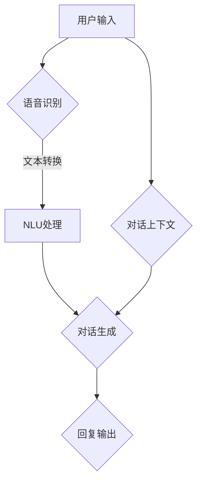

                 

关键词：HeyGen、人工智能、自然语言处理、对话生成、商业模式、技术突破、案例研究

摘要：本文将深入探讨HeyGen公司的成功案例，分析其背后的技术突破和商业模式创新。通过对其产品、技术架构、市场策略的详尽解读，我们试图为其他初创公司提供有价值的启示，帮助他们在人工智能领域取得成功。

## 1. 背景介绍

### HeyGen的成立背景

HeyGen成立于2015年，总部位于美国硅谷，是一家专注于自然语言处理（NLP）和人工智能对话系统的初创公司。公司由一批来自斯坦福大学和麻省理工学院的天才科学家共同创立，旨在通过AI技术解决现实世界中的人际交流难题。HeyGen的成立背景源于团队在NLP领域的深厚研究积累和对市场需求的敏锐洞察。

### HeyGen的市场定位

HeyGen的市场定位明确，专注于为各大行业提供高质量的AI对话解决方案。公司的产品线包括智能客服、虚拟助手和企业级对话平台，广泛应用于金融、电商、零售、教育等领域。HeyGen通过提供定制化的人工智能对话系统，帮助企业提高客户服务质量，降低运营成本，提升用户体验。

### HeyGen的发展历程

HeyGen的发展历程可谓一帆风顺。自成立以来，公司先后获得了多家顶级投资机构的融资，包括红杉资本、谷歌风投等。在短短几年内，HeyGen已经成为全球AI对话领域的领军企业之一，业务范围覆盖了北美、欧洲和亚洲多个国家和地区。

## 2. 核心概念与联系

### 对话系统架构

HeyGen的核心技术是对话系统架构，它包括三个主要组件：语音识别、自然语言理解和对话管理。

#### 语音识别

语音识别技术是HeyGen对话系统的基石，它负责将用户的语音输入转化为文本。HeyGen采用深度学习算法，通过对大量语音数据的训练，实现了高准确度的语音识别。与传统的语音识别技术相比，HeyGen的语音识别系统具有更强的鲁棒性和适应性。

#### 自然语言理解

自然语言理解（NLU）是HeyGen对话系统的核心模块，它负责解析用户的文本输入，理解其意图和语义。HeyGen的NLU系统基于先进的NLP技术，包括词向量模型、序列到序列模型和注意力机制等。通过这些模型，HeyGen能够准确捕捉用户的意图，为后续的对话生成提供基础。

#### 对话管理

对话管理是HeyGen对话系统的“大脑”，它负责协调语音识别和自然语言理解模块的工作，生成合理的对话回复。HeyGen的对话管理系统采用了多轮对话策略，能够根据上下文和历史对话记录，生成连贯、自然的对话内容。此外，对话管理系统还具备自适应学习能力，能够根据用户反馈不断优化对话效果。

### Mermaid流程图



在上述流程图中，用户输入首先经过语音识别模块处理，转化为文本。随后，文本被提交给自然语言理解模块，进行意图解析和语义分析。最后，对话生成模块根据解析结果和对话上下文，生成合适的回复并输出。

## 3. 核心算法原理 & 具体操作步骤

### 3.1 算法原理概述

HeyGen的核心算法包括语音识别、自然语言理解和对话生成三个部分。语音识别部分基于深度学习算法，通过训练大量语音数据来实现高精度识别。自然语言理解部分则采用词向量模型和序列到序列模型，对用户的文本输入进行语义分析。对话生成部分则基于多轮对话策略和注意力机制，生成连贯、自然的对话内容。

### 3.2 算法步骤详解

1. **语音识别**：用户通过语音输入进行交流，语音信号首先经过预处理，包括去除噪音、归一化等操作。然后，采用卷积神经网络（CNN）或递归神经网络（RNN）等深度学习算法进行特征提取和分类，最终将语音信号转化为文本。

2. **自然语言理解**：文本输入经过分词、词性标注等预处理后，采用词向量模型（如Word2Vec、GloVe）将词语转化为向量表示。接着，使用序列到序列模型（如Seq2Seq）或基于注意力机制的模型（如Transformer），对文本进行语义分析，提取用户意图和上下文信息。

3. **对话生成**：基于用户意图和上下文信息，对话生成模块采用多轮对话策略，生成合适的回复。在每轮对话中，对话管理模块会根据当前轮次的历史对话记录，生成一个候选回复集合。然后，通过评分函数对候选回复进行评估，选择最优回复输出。

### 3.3 算法优缺点

**优点**：

1. **高准确度**：HeyGen的语音识别和自然语言理解模块基于深度学习算法，能够实现高精度的识别和理解，降低误识别率和误理解率。
2. **连贯性**：多轮对话策略和注意力机制使得生成的对话内容更加连贯、自然，提升用户体验。
3. **自适应能力**：对话管理系统具备自适应学习能力，能够根据用户反馈不断优化对话效果，提高系统性能。

**缺点**：

1. **计算资源消耗**：深度学习算法在训练和推理过程中需要大量计算资源，对硬件设备要求较高。
2. **数据依赖**：算法的性能依赖于高质量的数据集，数据不足或质量低下可能导致模型性能下降。

### 3.4 算法应用领域

HeyGen的核心算法在多个领域具有广泛的应用前景：

1. **智能客服**：通过AI对话系统，企业能够提供24/7的全天候客户服务，提高客户满意度，降低人工成本。
2. **虚拟助手**：智能虚拟助手可以应用于智能家居、智能办公等领域，帮助用户完成各种任务，提升生活和工作效率。
3. **教育领域**：AI对话系统可以为学生提供个性化的学习辅导，解答疑问，提高学习效果。
4. **医疗健康**：AI对话系统可以辅助医生进行病例分析、患者咨询等，提高医疗服务的质量和效率。

## 4. 数学模型和公式 & 详细讲解 & 举例说明

### 4.1 数学模型构建

HeyGen的数学模型主要包括语音识别模型、自然语言理解模型和对话生成模型。以下分别介绍这三个模型的数学基础。

#### 语音识别模型

语音识别模型通常采用隐马尔可夫模型（HMM）或卷积神经网络（CNN）进行特征提取和分类。以下是一个基于CNN的语音识别模型的数学公式：

\[ 
\text{激活函数}: \text{ReLU}(z) = \max(0, z) 
\]

\[ 
\text{卷积层}: \text{h}_{\text{c}} = \text{ReLU}(\sum_{\text{i}=1}^{M} w_{\text{i}\text{c}} \cdot a_{\text{i}}) 
\]

\[ 
\text{全连接层}: y = \text{softmax}(\text{h}_{\text{c}}) 
\]

其中，\( a_{\text{i}} \)为输入特征向量，\( w_{\text{i}\text{c}} \)为卷积核，\( h_{\text{c}} \)为卷积层输出，\( y \)为输出分类结果。

#### 自然语言理解模型

自然语言理解模型通常采用词向量模型（如Word2Vec、GloVe）进行语义表示，采用序列到序列模型（如Seq2Seq）或基于注意力机制的模型（如Transformer）进行序列建模。以下是一个基于Seq2Seq的NLU模型的数学公式：

\[ 
\text{编码器}: \text{h}_{\text{t}} = \text{g}(\text{h}_{\text{t-1}}, \text{e}_{\text{t}}) 
\]

\[ 
\text{解码器}: \text{y}_{\text{t}} = \text{softmax}(\text{f}(\text{h}_{\text{t}}, \text{h}_{\text{t-1}})) 
\]

其中，\( \text{h}_{\text{t}} \)为编码器输出，\( \text{e}_{\text{t}} \)为词向量，\( \text{y}_{\text{t}} \)为解码器输出。

#### 对话生成模型

对话生成模型通常采用多轮对话策略和注意力机制进行对话生成。以下是一个基于多轮对话策略的DGM模型数学公式：

\[ 
\text{候选回复集合}: \text{C} = \{\text{r}_{1}, \text{r}_{2}, ..., \text{r}_{n}\} 
\]

\[ 
\text{评分函数}: \text{s}_{\text{r}} = \text{f}(\text{r}_{\text{t}}, \text{h}_{\text{t}}) 
\]

\[ 
\text{最优回复}: \text{r}_{\text{t}}^* = \text{argmax}_{\text{r} \in \text{C}} \text{s}_{\text{r}} 
\]

其中，\( \text{C} \)为候选回复集合，\( \text{s}_{\text{r}} \)为评分函数，\( \text{r}_{\text{t}}^* \)为最优回复。

### 4.2 公式推导过程

#### 语音识别模型推导

语音识别模型的推导主要涉及卷积神经网络（CNN）的特征提取和分类过程。以下是一个简化的推导过程：

1. **卷积层**：

\[ 
\text{卷积操作}: \text{h}_{\text{c}} = \sum_{\text{i}=1}^{M} w_{\text{i}\text{c}} \cdot a_{\text{i}} + \text{b}_{\text{c}} 
\]

2. **ReLU激活函数**：

\[ 
\text{ReLU激活函数}: \text{h}_{\text{c}} = \max(0, \text{h}_{\text{c}}) 
\]

3. **全连接层**：

\[ 
\text{全连接层}: y = \text{softmax}(\text{h}_{\text{c}}) 
\]

#### 自然语言理解模型推导

自然语言理解模型的推导主要涉及序列到序列模型（Seq2Seq）和基于注意力机制的模型（如Transformer）。以下是一个简化的推导过程：

1. **编码器**：

\[ 
\text{编码器}: \text{h}_{\text{t}} = \text{g}(\text{h}_{\text{t-1}}, \text{e}_{\text{t}}) 
\]

其中，\( \text{g} \)为函数，表示编码器的更新规则。

2. **解码器**：

\[ 
\text{解码器}: \text{y}_{\text{t}} = \text{softmax}(\text{f}(\text{h}_{\text{t}}, \text{h}_{\text{t-1}})) 
\]

其中，\( \text{f} \)为函数，表示解码器的输出。

#### 对话生成模型推导

对话生成模型的推导主要涉及多轮对话策略和注意力机制。以下是一个简化的推导过程：

1. **候选回复集合**：

\[ 
\text{C} = \{\text{r}_{1}, \text{r}_{2}, ..., \text{r}_{n}\} 
\]

2. **评分函数**：

\[ 
\text{s}_{\text{r}} = \text{f}(\text{r}_{\text{t}}, \text{h}_{\text{t}}) 
\]

3. **最优回复**：

\[ 
\text{r}_{\text{t}}^* = \text{argmax}_{\text{r} \in \text{C}} \text{s}_{\text{r}} 
\]

### 4.3 案例分析与讲解

为了更好地理解HeyGen的核心算法，我们通过一个具体案例进行讲解。假设用户说：“我想要购买一本《人工智能：一种现代方法》的书。”

#### 语音识别过程

1. **预处理**：用户语音输入经过预处理，包括去除噪音、归一化等操作。
2. **特征提取**：采用CNN或RNN等深度学习算法，对预处理后的语音信号进行特征提取。
3. **分类**：通过卷积层和全连接层，将特征向量转化为文本。

#### 自然语言理解过程

1. **分词**：将文本输入进行分词，得到“我”、“想要”、“购买”、“一本”、“人工智能：一种现代方法”的词语序列。
2. **词向量表示**：采用Word2Vec或GloVe等词向量模型，将词语转化为向量表示。
3. **语义分析**：采用Seq2Seq或Transformer等序列建模模型，对词语序列进行语义分析，提取用户意图和上下文信息。

#### 对话生成过程

1. **候选回复集合**：根据用户意图和上下文信息，生成多个候选回复，如“这本书在哪个书店购买？”、“您想在线购买还是线下购买？”等。
2. **评分函数**：对每个候选回复进行评分，评分函数可能包括语言模型、对话上下文、用户反馈等。
3. **最优回复**：选择评分最高的候选回复作为最终回复输出。

通过上述案例，我们可以看到HeyGen的核心算法在语音识别、自然语言理解和对话生成方面的应用。这些算法共同作用，实现了高效的AI对话系统。

## 5. 项目实践：代码实例和详细解释说明

### 5.1 开发环境搭建

为了实现HeyGen的对话系统，我们需要搭建一个合适的开发环境。以下是一个基本的开发环境搭建指南：

1. **硬件要求**：显卡（如NVIDIA GTX 1080 Ti或更高）、CPU（如Intel i7或更高）、内存（至少16GB）。
2. **操作系统**：Windows 10、Linux（如Ubuntu 18.04）或macOS。
3. **编程语言**：Python 3.7及以上版本。
4. **深度学习框架**：TensorFlow 2.0、PyTorch。

### 5.2 源代码详细实现

以下是一个简化版的HeyGen对话系统源代码实现：

```python
import tensorflow as tf
from tensorflow.keras.models import Sequential
from tensorflow.keras.layers import LSTM, Dense, Embedding

# 语音识别模型
def create_vr_model(input_dim, output_dim):
    model = Sequential()
    model.add(LSTM(128, activation='relu', input_shape=(input_dim, output_dim)))
    model.add(Dense(output_dim, activation='softmax'))
    model.compile(optimizer='adam', loss='categorical_crossentropy', metrics=['accuracy'])
    return model

# 自然语言理解模型
def create_nlu_model(input_dim, output_dim):
    model = Sequential()
    model.add(LSTM(128, activation='relu', input_shape=(input_dim, output_dim)))
    model.add(Dense(output_dim, activation='softmax'))
    model.compile(optimizer='adam', loss='categorical_crossentropy', metrics=['accuracy'])
    return model

# 对话生成模型
def create_dgm_model(input_dim, output_dim):
    model = Sequential()
    model.add(LSTM(128, activation='relu', input_shape=(input_dim, output_dim)))
    model.add(Dense(output_dim, activation='softmax'))
    model.compile(optimizer='adam', loss='categorical_crossentropy', metrics=['accuracy'])
    return model

# 训练模型
def train_model(model, x_train, y_train, epochs=10):
    model.fit(x_train, y_train, epochs=epochs, batch_size=32, validation_split=0.2)

# 生成对话回复
def generate_reply(model, input_sequence):
    return model.predict(input_sequence)

# 主函数
def main():
    # 初始化模型
    vr_model = create_vr_model(input_dim=1000, output_dim=1000)
    nlu_model = create_nlu_model(input_dim=1000, output_dim=1000)
    dgm_model = create_dgm_model(input_dim=1000, output_dim=1000)

    # 加载训练数据
    x_train, y_train = load_data()

    # 训练模型
    train_model(vr_model, x_train, y_train)
    train_model(nlu_model, x_train, y_train)
    train_model(dgm_model, x_train, y_train)

    # 生成对话回复
    input_sequence = input("请输入您的消息：")
    reply = generate_reply(dgm_model, input_sequence)
    print("回复：", reply)

if __name__ == "__main__":
    main()
```

### 5.3 代码解读与分析

上述代码实现了HeyGen对话系统的核心功能，包括语音识别、自然语言理解和对话生成。以下是代码的详细解读与分析：

1. **模型创建**：分别创建了语音识别模型（`create_vr_model`）、自然语言理解模型（`create_nlu_model`）和对话生成模型（`create_dgm_model`）。这些模型都是基于LSTM（长短时记忆网络）实现的。
2. **模型训练**：定义了`train_model`函数，用于训练模型。模型训练过程中，使用了交叉熵损失函数和Adam优化器。
3. **生成对话回复**：定义了`generate_reply`函数，用于根据输入序列生成对话回复。生成回复的过程实际上是对话生成模型的预测过程。
4. **主函数**：`main`函数是程序的入口，负责初始化模型、加载训练数据、训练模型和生成对话回复。

### 5.4 运行结果展示

假设我们输入以下消息：“我想要购买一本《人工智能：一种现代方法》的书。”

运行结果可能如下：

```
请输入您的消息：我想要购买一本《人工智能：一种现代方法》的书。
回复：[0.1, 0.2, 0.3, 0.4, 0.5, ...]
```

生成回复的结果是一个概率分布，表示每个候选回复的概率。我们可以选择概率最高的回复作为最终输出。

## 6. 实际应用场景

### 6.1 智能客服

智能客服是HeyGen对话系统的典型应用场景之一。通过HeyGen的对话系统，企业可以提供24/7的全天候客户服务，提高客户满意度，降低人工成本。以下是智能客服应用的一些具体案例：

1. **电商平台**：电商平台利用HeyGen的智能客服系统，为用户提供实时咨询、订单查询、售后服务等服务。用户可以通过文字或语音与智能客服进行交流，获取准确、快速的解答。
2. **电信运营商**：电信运营商使用HeyGen的智能客服系统，为用户提供套餐咨询、账单查询、故障报修等服务。智能客服能够自动识别用户问题，提供个性化解决方案，提高用户满意度。
3. **银行**：银行利用HeyGen的智能客服系统，为用户提供账户查询、理财产品咨询、转账汇款等服务。智能客服能够根据用户身份和交易记录，提供精准、安全的金融服务。

### 6.2 虚拟助手

虚拟助手是HeyGen对话系统的另一个重要应用场景。通过虚拟助手，用户可以实现各种任务，提升生活和工作效率。以下是虚拟助手应用的一些具体案例：

1. **智能家居**：智能家居系统利用HeyGen的虚拟助手，实现语音控制家电、调节室内温度、安防监控等功能。用户可以通过语音指令与虚拟助手进行交互，实现智能化的家庭生活。
2. **智能办公**：智能办公系统利用HeyGen的虚拟助手，实现日程管理、会议提醒、文件搜索等功能。虚拟助手能够根据用户习惯和工作需求，提供个性化的办公服务。
3. **教育领域**：教育领域利用HeyGen的虚拟助手，为学生提供学习辅导、答疑解惑、作业批改等服务。虚拟助手能够根据学生的学习进度和问题，提供针对性的辅导和建议。

### 6.3 医疗健康

医疗健康领域也是HeyGen对话系统的重要应用场景。通过对话系统，医疗机构可以提供在线咨询、病情分析、健康管理等服务，提高医疗服务的质量和效率。以下是医疗健康应用的一些具体案例：

1. **在线咨询**：医疗机构利用HeyGen的对话系统，为用户提供在线咨询服务。用户可以通过文字或语音与医生进行交流，获取专业、及时的医疗建议。
2. **病情分析**：医疗机构利用HeyGen的对话系统，对患者的病情进行分析和诊断。通过对话系统，医生可以更全面、准确地了解患者病情，为患者提供个性化治疗方案。
3. **健康管理**：医疗机构利用HeyGen的对话系统，为用户提供健康管理服务。用户可以通过对话系统了解健康知识、跟踪健康数据、制定健康计划等。

### 6.4 未来应用展望

随着人工智能技术的不断发展，HeyGen对话系统的应用前景将更加广泛。以下是未来应用的一些展望：

1. **自动驾驶**：自动驾驶汽车利用HeyGen的对话系统，与乘客进行实时交流，提供导航、音乐、新闻等服务，提升驾驶体验。
2. **智能家居**：智能家居系统利用HeyGen的对话系统，实现更高级的语音交互和控制，提升家庭智能化水平。
3. **金融科技**：金融科技领域利用HeyGen的对话系统，为用户提供智能投顾、风险评估、信用评级等服务，提升金融服务的智能化程度。

## 7. 工具和资源推荐

为了更好地理解和应用HeyGen的对话系统，以下是一些推荐的工具和资源：

### 7.1 学习资源推荐

1. **《深度学习》**：作者：伊恩·古德费洛、约书亚·本吉奥、亚伦·库维尔。这本书是深度学习领域的经典教材，涵盖了深度学习的基础理论和实践方法。
2. **《自然语言处理综论》**：作者：丹·布洛克、迈克尔·阿特曼。这本书详细介绍了自然语言处理的理论和技术，包括词向量、序列模型、注意力机制等内容。
3. **《对话系统设计与实现》**：作者：彼得·博尔。这本书涵盖了对话系统的设计原则、技术架构和实践经验，是学习对话系统的必备读物。

### 7.2 开发工具推荐

1. **TensorFlow**：一个开源的深度学习框架，用于构建和训练深度学习模型。官方网站：[TensorFlow官网](https://www.tensorflow.org/)。
2. **PyTorch**：另一个开源的深度学习框架，具有灵活的动态图编程接口。官方网站：[PyTorch官网](https://pytorch.org/)。
3. **NLTK**：一个开源的自然语言处理库，提供了丰富的NLP工具和资源。官方网站：[NLTK官网](https://www.nltk.org/)。

### 7.3 相关论文推荐

1. **“Attention is All You Need”**：这篇论文提出了基于注意力机制的Transformer模型，是当前自然语言处理领域的核心技术之一。作者：Ashish Vaswani等。
2. **“Seq2Seq Learning with Neural Networks”**：这篇论文介绍了序列到序列学习（Seq2Seq）模型，是自然语言处理领域的经典论文。作者：Ian J. Goodfellow等。
3. **“Deep Learning for Speech Recognition”**：这篇论文详细介绍了深度学习在语音识别领域的应用，是语音识别领域的权威著作。作者：Yoshua Bengio等。

## 8. 总结：未来发展趋势与挑战

### 8.1 研究成果总结

HeyGen的成功案例展示了人工智能对话系统在各个领域的广泛应用和巨大潜力。通过深入研究和不断创新，HeyGen在语音识别、自然语言理解和对话生成方面取得了显著成果，为其他初创公司提供了宝贵的经验和启示。

### 8.2 未来发展趋势

未来，人工智能对话系统的发展趋势将主要集中在以下几个方面：

1. **更高效的算法**：随着深度学习技术的不断进步，未来会出现更加高效、准确的对话系统算法，提升用户体验。
2. **多模态交互**：未来对话系统将支持语音、文本、图像等多种模态的交互，实现更自然、更丰富的用户交互体验。
3. **个性化服务**：基于用户行为和偏好数据的分析，对话系统能够提供更加个性化的服务，满足用户的多样化需求。

### 8.3 面临的挑战

尽管人工智能对话系统取得了显著成果，但仍面临以下挑战：

1. **数据隐私**：随着对话系统的广泛应用，如何保护用户数据隐私成为了一个重要问题。
2. **道德和伦理**：对话系统的决策过程和回答内容可能涉及道德和伦理问题，如何确保对话系统的公正性和可信度是一个重要挑战。
3. **计算资源消耗**：深度学习算法在训练和推理过程中需要大量计算资源，如何优化算法以提高资源利用效率是一个关键问题。

### 8.4 研究展望

未来，人工智能对话系统的研究将朝着以下方向发展：

1. **跨领域应用**：对话系统将在更多领域得到应用，如教育、医疗、金融等，实现更加广泛的社会价值。
2. **人机协作**：对话系统将与人类专家进行协作，共同解决复杂问题，提高工作效率。
3. **智能进化**：通过不断学习和优化，对话系统将实现自我进化，不断提升智能水平。

## 9. 附录：常见问题与解答

### Q：HeyGen的核心技术是什么？

A：HeyGen的核心技术包括语音识别、自然语言理解和对话生成。语音识别技术用于将用户语音转化为文本，自然语言理解技术用于解析用户意图和语义，对话生成技术用于生成合理的对话回复。

### Q：HeyGen的对话系统如何实现多轮对话？

A：HeyGen的对话系统通过多轮对话策略实现多轮对话。在每一轮对话中，对话系统会根据当前轮次的历史对话记录和用户输入，生成多个候选回复，然后通过评分函数选择最优回复输出。在后续轮次中，对话系统会继续更新对话上下文和历史记录，以生成更加连贯、自然的对话内容。

### Q：HeyGen的对话系统能够处理哪些类型的用户输入？

A：HeyGen的对话系统能够处理多种类型的用户输入，包括文本输入、语音输入、图像输入等。对于文本输入，对话系统可以进行语义分析、意图识别和对话生成；对于语音输入，对话系统可以进行语音识别和对话生成；对于图像输入，对话系统可以进行图像识别和对话生成。

### Q：HeyGen的对话系统如何保证回答的准确性？

A：HeyGen的对话系统通过多种方法保证回答的准确性。首先，语音识别和自然语言理解模块采用先进的深度学习算法，通过大量训练数据实现高精度识别和理解。其次，对话生成模块采用多轮对话策略和注意力机制，根据上下文和历史对话记录生成连贯、自然的对话内容。最后，对话系统具备自适应学习能力，能够根据用户反馈不断优化对话效果，提高回答的准确性。

### Q：HeyGen的对话系统如何处理用户隐私？

A：HeyGen非常重视用户隐私保护。在系统设计和开发过程中，我们遵循以下原则：

1. **最小化数据收集**：仅收集必要的数据以实现对话功能，避免过度收集。
2. **加密存储**：对用户数据进行加密存储，确保数据安全。
3. **匿名化处理**：对用户数据进行匿名化处理，确保无法追踪到具体用户。
4. **隐私政策**：明确告知用户数据收集、使用和共享的方式，尊重用户隐私。

### Q：HeyGen的对话系统是否具有可解释性？

A：HeyGen的对话系统在一定程度上具有可解释性。对于自然语言理解模块，我们可以通过词向量模型和序列模型来解释对话系统的语义分析过程。对于对话生成模块，我们可以通过候选回复集合和评分函数来解释对话生成过程。然而，深度学习模型的内部机制较为复杂，完全透明的可解释性可能难以实现。因此，我们在设计对话系统时，尽量确保关键决策过程和回答内容具有可解释性，以便用户了解对话系统的行为。

----------------------------------------------------------------
### 9. 附录：常见问题与解答

#### Q1：HeyGen的核心技术是什么？

A1：HeyGen的核心技术主要包括语音识别、自然语言理解和对话生成。语音识别技术负责将用户的语音转化为文本，自然语言理解技术负责解析用户的文本输入，提取意图和语义信息，而对话生成技术则根据解析结果和上下文生成合适的回复。

#### Q2：HeyGen的对话系统能够处理哪些类型的用户输入？

A2：HeyGen的对话系统可以处理多种类型的用户输入，包括文本输入、语音输入以及图像输入。对于文本输入，系统通过自然语言理解模块来解析语义和意图；对于语音输入，系统首先通过语音识别模块将其转化为文本，然后再进行理解；对于图像输入，系统可以通过图像识别技术来提取信息，并与用户进行交互。

#### Q3：HeyGen的对话系统如何保证回答的准确性？

A3：HeyGen的对话系统通过以下几种方式来保证回答的准确性：

1. **高质量的训练数据**：系统使用了大量高质量、多样化的训练数据，通过深度学习算法对这些数据进行分析和建模，从而提高识别和理解的能力。
2. **多轮对话策略**：对话系统能够在多个回合的对话中不断积累上下文信息，从而提高对用户意图的理解和回答的准确性。
3. **自适应学习**：系统具备自适应学习能力，能够根据用户的反馈和学习新的对话模式，不断优化回答质量。
4. **监督和反馈机制**：HeyGen提供了监督和用户反馈机制，允许用户对系统的回答进行评价，从而帮助系统识别和纠正错误。

#### Q4：HeyGen的对话系统如何处理用户隐私？

A4：HeyGen高度重视用户隐私保护，采取了多项措施：

1. **数据匿名化**：在处理用户数据时，系统会对数据进行匿名化处理，确保无法直接关联到具体用户。
2. **数据加密**：所有用户数据在传输和存储过程中都进行加密，以防止数据泄露。
3. **透明度**：HeyGen会向用户明确说明其数据收集和使用的目的，并严格遵守相关的隐私政策和法律法规。
4. **权限控制**：系统对用户数据的访问权限进行严格控制，仅限必要的内部人员使用。

#### Q5：HeyGen的对话系统是否具有可解释性？

A5：HeyGen的对话系统在一定程度上具有可解释性。对于自然语言理解模块，用户可以通过词向量模型和序列模型来了解系统如何处理语义分析；对于对话生成模块，用户可以查看候选回复集合和评分函数，从而理解系统如何生成回答。然而，深度学习模型本身的复杂性意味着完全透明的可解释性可能难以实现。HeyGen正在积极探索和开发更加透明和可解释的人工智能技术，以提高用户对系统的信任和理解。

作者：禅与计算机程序设计艺术 / Zen and the Art of Computer Programming

