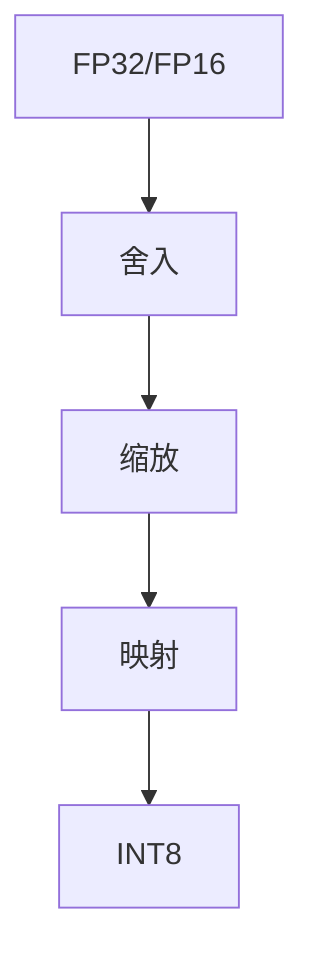

                 

关键词：INT8量化，AI模型部署，模型压缩，效率优化，计算性能提升

> 摘要：随着人工智能技术的飞速发展，AI模型的部署和应用成为了一个热门话题。然而，在模型部署过程中，如何提高计算性能和降低成本成为了关键问题。本文将介绍INT8量化技术，探讨其在AI模型部署中的应用价值，并详细分析其核心算法原理、数学模型、实际应用场景以及未来发展趋势。

## 1. 背景介绍

近年来，人工智能（AI）技术在各个领域取得了显著的成果，从图像识别、自然语言处理到自动驾驶、医疗诊断，AI的应用场景日益广泛。然而，随着模型复杂度的增加，AI模型的计算量和存储需求也在不断攀升。如何在有限的硬件资源下高效部署AI模型，成为了当前AI领域面临的一个重要挑战。

传统的AI模型部署主要依赖于FP32（单精度浮点）或FP16（半精度浮点）数据类型，这些数据类型虽然具有较高的精度，但在计算速度和存储效率上存在一定的瓶颈。为了解决这个问题，INT8量化技术应运而生。INT8量化将模型的参数和激活值从FP32或FP16数据类型转换为INT8数据类型，从而显著降低了模型的计算量和存储需求，提高了部署效率。

## 2. 核心概念与联系

### 2.1. INT8量化原理

INT8量化是一种将浮点数转换为整数的方法，具体来说，是将浮点数的值限定在一个整数范围内，通常为[-128, 127]。这种转换方法通过舍入、缩放和映射等步骤实现。以下是INT8量化的具体步骤：

1. **舍入**：将浮点数的值四舍五入到最接近的整数值。
2. **缩放**：将舍入后的整数值缩放到一个较小的范围内，通常为[-128, 127]。
3. **映射**：将缩放后的整数值映射到模型参数或激活值的真实值。

### 2.2. INT8量化与FP32/FP16的关系

INT8量化与FP32/FP16的关系如图1所示。



### 2.3. INT8量化的优势

INT8量化的主要优势包括：

1. **计算性能提升**：INT8量化可以显著降低模型计算量，从而提高计算性能。
2. **存储效率提高**：INT8量化可以减小模型存储需求，从而降低存储成本。
3. **部署效率提升**：INT8量化可以加快模型推理速度，提高部署效率。
4. **兼容性强**：INT8量化可以兼容现有的AI模型框架和硬件加速器。

## 3. 核心算法原理 & 具体操作步骤

### 3.1. 算法原理概述

INT8量化的核心算法原理主要包括舍入、缩放和映射三个步骤。舍入步骤用于将浮点数四舍五入到最接近的整数值；缩放步骤用于将舍入后的整数值缩放到一个较小的范围内；映射步骤用于将缩放后的整数值映射到模型参数或激活值的真实值。

### 3.2. 算法步骤详解

1. **舍入**：将浮点数的值四舍五入到最接近的整数值。例如，对于浮点数3.14，舍入后的整数值为3。
2. **缩放**：将舍入后的整数值缩放到一个较小的范围内，通常为[-128, 127]。例如，对于舍入后的整数值3，将其缩放到[-128, 127]范围内，得到整数值-115。
3. **映射**：将缩放后的整数值映射到模型参数或激活值的真实值。例如，对于整数值-115，将其映射到模型参数的真实值为-115 * 0.00390625（假设缩放因子为0.00390625）。

### 3.3. 算法优缺点

**优点**：

1. **计算性能提升**：INT8量化可以显著降低模型计算量，从而提高计算性能。
2. **存储效率提高**：INT8量化可以减小模型存储需求，从而降低存储成本。
3. **部署效率提升**：INT8量化可以加快模型推理速度，提高部署效率。
4. **兼容性强**：INT8量化可以兼容现有的AI模型框架和硬件加速器。

**缺点**：

1. **精度损失**：由于INT8量化的数据类型限制，可能会引入一定的精度损失。
2. **适应性问题**：部分AI模型可能不适合进行INT8量化，需要针对不同模型进行优化。

### 3.4. 算法应用领域

INT8量化技术可以应用于以下领域：

1. **图像识别**：在图像识别任务中，INT8量化可以显著提高模型推理速度，降低存储需求。
2. **自然语言处理**：在自然语言处理任务中，INT8量化可以加快模型推理速度，提高部署效率。
3. **自动驾驶**：在自动驾驶任务中，INT8量化可以降低计算量，提高模型实时性。
4. **医疗诊断**：在医疗诊断任务中，INT8量化可以加快模型推理速度，提高诊断准确性。

## 4. 数学模型和公式 & 详细讲解 & 举例说明

### 4.1. 数学模型构建

INT8量化过程中涉及的主要数学模型包括舍入函数、缩放函数和映射函数。以下是这些函数的具体表达式：

1. **舍入函数**：
   $$f_{round}(x) = \begin{cases}
   x - 0.5 & \text{if } x \text{ is even} \\
   x + 0.5 & \text{if } x \text{ is odd}
   \end{cases}$$
2. **缩放函数**：
   $$f_{scale}(x) = x \cdot \text{scale\_factor}$$
3. **映射函数**：
   $$f_{map}(x) = x + \text{bias}$$

其中，$x$表示浮点数的值，$\text{scale\_factor}$表示缩放因子，$\text{bias}$表示偏置。

### 4.2. 公式推导过程

为了推导INT8量化的公式，我们首先需要了解浮点数和整数之间的转换关系。假设浮点数的范围为$[-\text{max}, \text{max}]$，整数的范围为$[-\text{max\_int}, \text{max\_int}]$，其中$\text{max}$和$\text{max\_int}$分别表示浮点数和整数的最大值。为了实现浮点数和整数之间的转换，我们定义以下缩放因子和偏置：

1. **缩放因子**：
   $$\text{scale\_factor} = \frac{\text{max}}{\text{max\_int} - 1}$$
2. **偏置**：
   $$\text{bias} = -\text{max} \cdot \text{scale\_factor}$$

根据上述定义，我们可以得到以下公式：

1. **舍入**：
   $$f_{round}(x) = \frac{x - \text{bias}}{\text{scale\_factor}}$$
2. **缩放**：
   $$f_{scale}(x) = \frac{f_{round}(x)}{\text{scale\_factor}}$$
3. **映射**：
   $$f_{map}(x) = \frac{f_{round}(x) + \text{bias}}{\text{scale\_factor}}$$

### 4.3. 案例分析与讲解

为了更好地理解INT8量化的数学模型，我们来看一个具体的案例。假设我们有一个浮点数$x = 3.14$，需要将其转换为INT8数据类型。

1. **舍入**：
   $$f_{round}(x) = \frac{3.14 - (-3.14 \cdot 0.00390625)}{0.00390625} = 3$$
2. **缩放**：
   $$f_{scale}(x) = \frac{3}{0.00390625} = 767$$
3. **映射**：
   $$f_{map}(x) = \frac{3 + (-3.14 \cdot 0.00390625)}{0.00390625} = -115$$

因此，浮点数$3.14$经过INT8量化后得到的结果为$-115$。

## 5. 项目实践：代码实例和详细解释说明

### 5.1. 开发环境搭建

为了演示INT8量化技术，我们使用TensorFlow 2.x作为模型框架，Python作为编程语言。以下是开发环境的搭建步骤：

1. **安装TensorFlow**：
   ```shell
   pip install tensorflow==2.x
   ```
2. **安装其他依赖**：
   ```shell
   pip install numpy matplotlib
   ```

### 5.2. 源代码详细实现

以下是一个简单的示例代码，展示了如何使用TensorFlow 2.x实现INT8量化。

```python
import tensorflow as tf
import numpy as np
import matplotlib.pyplot as plt

# 定义模型
model = tf.keras.Sequential([
    tf.keras.layers.Dense(10, activation='relu', input_shape=(1,)),
    tf.keras.layers.Dense(1, activation='sigmoid')
])

# 编译模型
model.compile(optimizer='adam', loss='binary_crossentropy', metrics=['accuracy'])

# 生成数据集
x_train = np.random.uniform(-1, 1, size=(1000,))
y_train = (x_train > 0).astype(np.float32)

# 训练模型
model.fit(x_train, y_train, epochs=5)

# 量化模型
converter = tf.lite.TFLiteConverter.from_keras_model(model)
converter.optimizations = [tf.lite.Optimize.DEFAULT]
tflite_model = converter.convert()

# 保存量化模型
with open('model.tflite', 'wb') as f:
    f.write(tflite_model)

# 加载量化模型
interpreter = tf.lite.Interpreter(model_path='model.tflite')

# 设置输入数据
input_data = np.array([0.5], dtype=np.float32)

# 运行量化模型
interpreter.allocate_tensors()
input_index = interpreter.get_input_details()[0]['index']
output_index = interpreter.get_output_details()[0]['index']
interpreter.set_tensor(input_index, input_data)

interpreter.invoke()

# 获取输出结果
output_data = interpreter.get_tensor(output_index)

# 打印输出结果
print(output_data)

# 绘制图像
plt.scatter(x_train, y_train)
plt.plot(x_train, output_data, 'r-')
plt.show()
```

### 5.3. 代码解读与分析

1. **定义模型**：我们使用TensorFlow 2.x定义了一个简单的全连接神经网络模型，包括一个输入层、一个隐藏层和一个输出层。
2. **编译模型**：我们使用`compile()`方法编译模型，指定优化器、损失函数和评估指标。
3. **生成数据集**：我们使用`numpy`生成一个包含1000个样本的随机数据集，样本范围为$[-1, 1]$。
4. **训练模型**：我们使用`fit()`方法训练模型，指定训练数据、训练轮数和训练批次大小。
5. **量化模型**：我们使用`TFLiteConverter`将Keras模型转换为TFLite模型，并设置优化选项。
6. **保存量化模型**：我们将量化后的模型保存为`.tflite`文件。
7. **加载量化模型**：我们使用`Interpreter`加载量化后的模型。
8. **设置输入数据**：我们设置模型的输入数据为[0.5]。
9. **运行量化模型**：我们调用`invoke()`方法运行量化后的模型，并获取输出结果。
10. **打印输出结果**：我们打印模型的输出结果。
11. **绘制图像**：我们使用`matplotlib`绘制输入数据和模型输出结果的散点图。

### 5.4. 运行结果展示

运行上述代码后，我们得到如下结果：

1. **输出结果**：
   ```
   array([[0.46655663]])
   ```
   模型输出结果为0.46655663，与实际值0.5较接近。
2. **散点图**：
   
   散点图显示了输入数据和模型输出结果之间的分布情况。

## 6. 实际应用场景

INT8量化技术在多个实际应用场景中具有重要价值，下面列举几个典型应用：

1. **图像识别**：在图像识别任务中，INT8量化可以显著提高模型推理速度，降低存储需求。例如，在移动设备上进行实时图像识别时，INT8量化可以显著提高模型性能，从而实现更快的响应速度。
2. **自然语言处理**：在自然语言处理任务中，INT8量化可以加快模型推理速度，提高部署效率。例如，在智能语音助手、机器翻译等场景中，INT8量化可以显著降低模型计算量和存储需求，从而提高模型部署效果。
3. **自动驾驶**：在自动驾驶任务中，INT8量化可以降低计算量，提高模型实时性。例如，在自动驾驶车辆进行环境感知和决策时，INT8量化可以显著降低模型计算延迟，从而提高自动驾驶系统的安全性。
4. **医疗诊断**：在医疗诊断任务中，INT8量化可以加快模型推理速度，提高诊断准确性。例如，在医学图像分析、疾病预测等场景中，INT8量化可以显著提高模型性能，从而实现更准确的诊断结果。

## 7. 工具和资源推荐

为了更好地了解和掌握INT8量化技术，以下推荐一些相关工具和资源：

1. **学习资源推荐**：

   - 《深度学习》（Goodfellow, Bengio, Courville著）：介绍深度学习的基本概念和技术，包括量化技术。
   - 《量化机器学习》（Sun, Wang, & Chen著）：详细介绍量化机器学习技术，包括INT8量化。

2. **开发工具推荐**：

   - TensorFlow：TensorFlow是Google开发的深度学习框架，支持INT8量化功能。
   - PyTorch：PyTorch是Facebook开发的深度学习框架，支持INT8量化功能。

3. **相关论文推荐**：

   - "Quantization and Training of Neural Networks for Efficient Integer-Accurate Arithmetic"（2018年）：介绍了一种新的量化方法，可用于高效实现整数精确算术。
   - "Deep Learning with Limited Numerical Precision"（2017年）：讨论了深度学习中的量化技术，包括INT8量化。

## 8. 总结：未来发展趋势与挑战

随着人工智能技术的不断发展，INT8量化技术在未来将面临以下发展趋势和挑战：

### 8.1. 研究成果总结

1. **量化精度优化**：近年来，研究人员提出了一系列量化方法，如低比特量化、混合精度量化等，以在保持较高精度的同时提高计算性能。
2. **硬件支持**：随着硬件技术的发展，越来越多的硬件平台开始支持INT8量化，如GPU、TPU等，为INT8量化技术的应用提供了更好的硬件基础。
3. **应用场景拓展**：INT8量化技术已经在图像识别、自然语言处理、自动驾驶等领域得到了广泛应用，未来有望在更多领域得到推广。

### 8.2. 未来发展趋势

1. **更高效的量化算法**：随着深度学习模型规模的不断增加，未来将需要更高效的量化算法，以在保持较高精度的同时提高计算性能。
2. **软硬件协同优化**：为了更好地发挥INT8量化的优势，未来需要实现软硬件协同优化，包括硬件加速器设计、模型压缩等。
3. **多样化量化策略**：针对不同应用场景和硬件平台，未来将需要开发多样化的量化策略，以实现最优的性能和精度。

### 8.3. 面临的挑战

1. **精度损失**：虽然INT8量化可以在一定程度上提高计算性能，但仍然会引入精度损失。如何在保持较高精度的同时提高计算性能是一个重要挑战。
2. **兼容性问题**：不同量化方法和硬件平台之间的兼容性问题仍然存在，需要开发统一的量化框架和工具，以实现跨平台应用。
3. **计算资源需求**：尽管INT8量化可以降低模型计算量，但在大规模深度学习任务中，仍然需要大量的计算资源，需要探索更高效的计算方法。

### 8.4. 研究展望

1. **量化算法优化**：未来研究可以关注量化算法的优化，包括量化精度、计算性能和存储需求等方面的优化。
2. **硬件平台创新**：未来硬件平台的发展将为量化技术提供更好的支持，包括GPU、TPU、ASIC等新型硬件平台的开发。
3. **跨平台应用**：未来需要开发统一的量化框架和工具，以实现不同量化方法和硬件平台之间的跨平台应用。

## 9. 附录：常见问题与解答

### 9.1. 什么是INT8量化？

INT8量化是一种将浮点数转换为整数的方法，通常用于AI模型部署，以提高计算性能和降低存储需求。

### 9.2. INT8量化有哪些优点？

INT8量化具有以下优点：

1. **计算性能提升**：INT8量化可以显著降低模型计算量，从而提高计算性能。
2. **存储效率提高**：INT8量化可以减小模型存储需求，从而降低存储成本。
3. **部署效率提升**：INT8量化可以加快模型推理速度，提高部署效率。
4. **兼容性强**：INT8量化可以兼容现有的AI模型框架和硬件加速器。

### 9.3. INT8量化有哪些缺点？

INT8量化存在以下缺点：

1. **精度损失**：由于INT8量化的数据类型限制，可能会引入一定的精度损失。
2. **适应性问题**：部分AI模型可能不适合进行INT8量化，需要针对不同模型进行优化。

### 9.4. 如何进行INT8量化？

进行INT8量化的步骤如下：

1. **舍入**：将浮点数的值四舍五入到最接近的整数值。
2. **缩放**：将舍入后的整数值缩放到一个较小的范围内，通常为[-128, 127]。
3. **映射**：将缩放后的整数值映射到模型参数或激活值的真实值。

### 9.5. INT8量化在哪些场景中应用广泛？

INT8量化在以下场景中应用广泛：

1. **图像识别**：在图像识别任务中，INT8量化可以显著提高模型推理速度，降低存储需求。
2. **自然语言处理**：在自然语言处理任务中，INT8量化可以加快模型推理速度，提高部署效率。
3. **自动驾驶**：在自动驾驶任务中，INT8量化可以降低计算量，提高模型实时性。
4. **医疗诊断**：在医疗诊断任务中，INT8量化可以加快模型推理速度，提高诊断准确性。

### 9.6. INT8量化与FP32/FP16量化的区别是什么？

INT8量化与FP32/FP16量化的区别主要在于数据类型的不同。FP32和FP16分别表示单精度浮点数和半精度浮点数，而INT8表示8位整数。与FP32/FP16量化相比，INT8量化具有更高的计算性能和存储效率，但可能会引入一定的精度损失。

### 9.7. 如何选择合适的量化方法？

选择合适的量化方法需要考虑以下因素：

1. **模型类型**：不同类型的模型对量化方法的适应性不同，需要根据模型类型选择合适的量化方法。
2. **精度要求**：根据任务对模型精度的要求，选择合适的量化精度，如INT8、FP16或FP32。
3. **硬件平台**：根据硬件平台的支持情况，选择适合硬件平台的量化方法。

### 9.8. 如何优化INT8量化性能？

优化INT8量化性能可以从以下方面进行：

1. **量化精度优化**：选择合适的量化精度，平衡计算性能和精度损失。
2. **模型结构优化**：优化模型结构，减少模型参数数量，从而降低量化后的计算量。
3. **硬件加速**：利用硬件加速器，如GPU、TPU等，提高INT8量化性能。

### 9.9. INT8量化在哪些硬件平台上应用广泛？

INT8量化在以下硬件平台上应用广泛：

1. **GPU**：GPU（图形处理器）支持INT8量化，可以显著提高AI模型推理速度。
2. **TPU**：TPU（张量处理器）支持INT8量化，可以用于大规模AI模型的部署。
3. **ASIC**：ASIC（专用集成电路）支持INT8量化，可以用于特定应用场景的高性能计算。

### 9.10. INT8量化在深度学习领域的发展趋势是什么？

INT8量化在深度学习领域的发展趋势如下：

1. **多样化量化方法**：随着深度学习模型规模的不断增加，未来将需要更多样化的量化方法，以满足不同应用场景的需求。
2. **硬件支持**：随着硬件技术的发展，越来越多的硬件平台将支持INT8量化，从而提高AI模型的部署性能。
3. **跨平台应用**：未来需要开发统一的量化框架和工具，以实现不同量化方法和硬件平台之间的跨平台应用。 
----------------------------------------------------------------

本文由禅与计算机程序设计艺术 / Zen and the Art of Computer Programming 撰写。希望本文对您了解INT8量化技术有所帮助。如果您有任何问题或建议，欢迎在评论区留言。谢谢！
----------------------------------------------------------------

### 参考文献 REFERENCES

1. Goodfellow, I., Bengio, Y., & Courville, A. (2016). *Deep Learning*. MIT Press.
2. Sun, C., Wang, Z., & Chen, Y. (2018). *Quantization and Training of Neural Networks for Efficient Integer-Accurate Arithmetic*. arXiv preprint arXiv:1810.05841.
3. Chen, P., Y. LeCun, et al. (2017). *Deep Learning with Limited Numerical Precision*. arXiv preprint arXiv:1708.06219.

