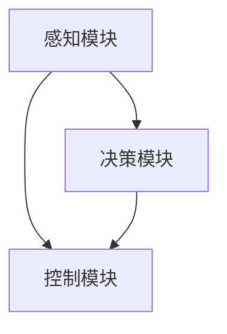

                 

自动驾驶技术作为智能交通系统的核心组成部分，其发展对于提高交通安全、提升道路通行效率和促进智慧城市建设具有重要意义。随着人工智能、传感器技术和通信技术的不断进步，自动驾驶技术正迅速迈向商业化应用。IROS（IEEE International Conference on Intelligent Robots and Systems）作为全球机器人与人工智能领域最具影响力的会议之一，每年都吸引着众多研究人员和工程师提交自动驾驶相关的最新研究成果。本文将重点解读IROS 2024中自动驾驶领域的几篇精选论文，涵盖从感知、决策到控制的全链条技术，旨在为读者提供一篇具有深度和广度的研究综述。

## 文章关键词

- 自动驾驶
- IROS 2024
- 感知
- 决策
- 控制
- 深度学习
- 传感器融合
- 车辆协作

## 文章摘要

本文首先介绍了自动驾驶技术在全球范围内的研究背景和发展趋势。接着，精选了IROS 2024中几篇具有代表性的论文，详细分析了这些论文在感知、决策和控制等关键环节的创新点和实际应用。文章最后，对自动驾驶技术的未来发展趋势和面临的挑战进行了展望，并推荐了相关的学习资源和开发工具。

## 1. 背景介绍

自动驾驶技术是指通过计算机系统、传感器和其他智能技术实现车辆的自主驾驶，无需人类驾驶员的干预。自20世纪70年代以来，自动驾驶技术的研究已经经历了多个阶段，从最初的计算机辅助驾驶，到后来的自主导航和智能交通系统，再到现在的全自动驾驶，技术不断演进，应用场景不断拓展。

自动驾驶技术的发展受到多方面因素的驱动。首先，随着人工智能技术的飞速发展，深度学习、强化学习等算法的成熟为自动驾驶提供了强大的计算能力。其次，传感器技术的进步，如激光雷达（Lidar）、摄像头、雷达和超声波传感器等，使得车辆能够更精确地感知周围环境。此外，5G通信技术的普及为自动驾驶车辆之间的信息交换提供了可靠的基础设施。

在国际上，自动驾驶技术的研发和应用主要集中在几个前沿国家和地区，如美国、德国、中国和日本。美国以特斯拉、谷歌和Waymo等公司为代表，率先实现了自动驾驶车辆的量产和商业化。德国和日本则依托其汽车工业基础，积极开展自动驾驶技术的研发和标准化工作。中国作为全球最大的汽车市场，近年来也在自动驾驶领域取得了显著进展，多家科技公司和传统车企纷纷布局自动驾驶技术。

### 自动驾驶技术的发展历程

1. **计算机辅助驾驶阶段（1970s-1990s）**
   - **起步期**：自动驾驶技术的概念首先在学术界提出，早期的自动驾驶系统依赖于简单规则和传感器。
   - **发展阶段**：随着计算机技术的发展，自动驾驶系统逐渐引入路径规划和控制算法，开始具备部分辅助功能。

2. **自主导航阶段（2000s）**
   - **技术突破**：GPS、激光雷达和摄像头等传感器技术的应用，使得自动驾驶系统可以更准确地感知环境。
   - **应用拓展**：自动驾驶技术开始应用于军用和民用领域，如无人车和无人机的研发。

3. **智能交通系统阶段（2010s-2020s）**
   - **多传感器融合**：自动驾驶系统整合了多种传感器数据，提高了感知和决策的准确性。
   - **车联网发展**：车联网技术使得车辆之间能够进行信息共享和协同驾驶，提高了道路通行效率和安全性。

4. **全自动驾驶阶段（2020s-未来）**
   - **高精度地图和AI算法**：高精度地图和深度学习算法的应用，使得自动驾驶系统能够更好地应对复杂环境。
   - **商业化应用**：自动驾驶车辆逐渐开始商业化应用，如无人出租车和无人货车等。

### 自动驾驶技术的应用领域

- **公共交通**：无人公交车、无人出租车和无人出租车共享平台。
- **物流运输**：无人货车、无人机配送和智能仓储系统。
- **个人出行**：自动驾驶私家车和个人移动机器人。
- **特殊场景**：矿山、农场和仓库等特殊环境下的自动驾驶设备。

自动驾驶技术的广泛应用不仅有望改变交通运输行业的面貌，还将对城市规划、环境保护和社会经济产生深远影响。然而，自动驾驶技术的实现面临着诸多挑战，包括感知环境、决策算法、控制技术和法律伦理等方面。这些挑战的解决需要多学科的合作和持续的研究投入。

### IROS会议与自动驾驶

IROS（IEEE International Conference on Intelligent Robots and Systems）是国际机器人与系统领域的顶级学术会议，旨在促进智能机器人系统的研究、开发和应用。自1990年以来，IROS会议每年都会吸引来自世界各地的学者和工程师参与，展示最新的研究成果和技术进展。

在自动驾驶领域，IROS会议一直是学术界和工业界交流的重要平台。许多具有里程碑意义的自动驾驶研究成果都是在IROS会议上首次公布，如自动驾驶车辆的感知与决策系统、车联网技术、自动驾驶算法等。IROS 2024将继续为自动驾驶领域的研究人员提供一个交流最新进展、探讨未来发展方向的机会。

## 2. 核心概念与联系

在自动驾驶技术中，核心概念包括感知、决策和控制。这些概念相互关联，构成了一个完整的自动驾驶系统。以下是这些核心概念及其相互关系的详细说明：

### 2.1 感知

感知是自动驾驶系统的第一步，它依赖于各种传感器来获取车辆周围环境的信息。主要传感器包括：

- **摄像头**：用于捕捉视觉信息，识别道路标志、行人、车辆等。
- **激光雷达（Lidar）**：用于测量车辆与周围物体的距离，提供高精度的三维点云数据。
- **雷达**：用于检测物体的存在和相对速度，适用于恶劣天气条件下。
- **超声波传感器**：用于检测车辆周围的障碍物，通常用于低速行驶时。

感知模块的目标是从这些传感器数据中提取有用的信息，构建周围环境的模型。这一过程通常涉及数据预处理、特征提取和目标检测。

### 2.2 决策

在获取环境信息后，自动驾驶系统需要进行决策，以确定下一步行动。决策模块通常基于以下几个步骤：

- **状态估计**：使用感知模块提供的信息，结合先前的知识，估计车辆和周围环境的状态。
- **路径规划**：根据车辆当前的状态和目标位置，计算一条从当前位置到目标位置的安全路径。
- **行为规划**：根据道路规则和交通情况，确定车辆在不同场景下的行为策略。

决策模块的核心是人工智能算法，包括深度学习、强化学习、模糊逻辑等。这些算法可以帮助自动驾驶系统在复杂环境中做出合理的决策。

### 2.3 控制

决策模块确定了车辆的行为策略后，控制模块负责执行这些策略，包括：

- **运动控制**：根据车辆的行为策略，调整车速和转向，确保车辆按照规划路径行驶。
- **制动控制**：在必要时，控制车辆的制动系统，确保安全停车。
- **灯光和信号控制**：控制车辆的前灯、尾灯和其他信号设备，确保与其他车辆和行人通信。

控制模块需要实时响应环境变化，确保车辆在动态环境中稳定行驶。

### 2.4 相互关系

感知、决策和控制是自动驾驶系统的三个核心模块，它们相互依赖、协同工作：

- **感知是基础**：没有准确的环境感知，自动驾驶系统无法进行有效的决策和控制。
- **决策是核心**：感知模块提供的信息需要通过决策模块进行处理，以确定正确的行动。
- **控制是执行**：决策模块生成的行为策略需要通过控制模块执行，才能实现自动驾驶。

图1展示了自动驾驶系统中感知、决策和控制三个模块之间的相互关系。该图使用了Mermaid流程图来描述这些模块的交互过程。



图1：自动驾驶系统中感知、决策和控制模块的相互关系

通过这种方式，感知、决策和控制共同构成了一个闭环系统，使得自动驾驶车辆能够在复杂多变的道路上自主行驶。

### 2.5 技术发展与应用趋势

随着技术的不断进步，自动驾驶系统的感知、决策和控制能力也在不断提高。以下是几项关键技术及其发展趋势：

- **感知技术的进步**：高分辨率摄像头和激光雷达的使用，使得感知系统的精度和可靠性得到了显著提升。未来，更多传感器和更先进的感知算法将进一步提升感知能力。
- **决策算法的优化**：深度学习和强化学习算法的广泛应用，使得决策模块能够更好地处理复杂环境。未来，多模态数据融合和自适应决策算法将进一步提高决策能力。
- **控制系统的智能化**：基于人工智能的控制算法正在取代传统的控制策略。未来的控制系统将更加灵活和自适应，能够更好地应对不同驾驶场景。

这些技术的进步为自动驾驶技术的商业化应用奠定了基础，未来自动驾驶车辆将在更多场景中得到应用，如无人出租车、无人货车、智能公交等。

## 3. 核心算法原理 & 具体操作步骤

### 3.1 算法原理概述

在自动驾驶系统中，核心算法主要包括感知、决策和控制三个部分。以下是这些算法的基本原理和具体操作步骤：

#### 3.1.1 感知算法

感知算法是自动驾驶系统的第一步，主要负责从传感器数据中提取有用的信息，构建周围环境的模型。常见的感知算法包括：

- **视觉感知**：使用卷积神经网络（CNN）对摄像头图像进行处理，识别道路标志、行人、车辆等。常用的模型有VGG、ResNet等。
- **Lidar感知**：对激光雷达生成的点云数据进行处理，提取障碍物的位置和形状。常用的算法包括VoxelNet、PointNet等。
- **多传感器融合**：结合摄像头、Lidar、雷达等传感器的数据，提高感知的准确性和鲁棒性。常用的算法有卡尔曼滤波、贝叶斯滤波等。

#### 3.1.2 决策算法

决策算法负责根据感知模块提供的信息，确定车辆的行为策略。常见的决策算法包括：

- **路径规划**：使用A*算法、Dijkstra算法等计算从当前位置到目标位置的安全路径。复杂环境下，常使用基于采样的方法，如RRT、RRT*等。
- **行为规划**：根据道路规则和交通情况，确定车辆在不同场景下的行为策略。常用的算法包括基于规则的逻辑、模糊逻辑等。
- **强化学习**：通过训练，使自动驾驶系统能够在复杂环境中做出最优决策。常用的模型有Q-Learning、Deep Q-Network（DQN）等。

#### 3.1.3 控制算法

控制算法负责执行决策模块生成的行为策略，确保车辆按照规划路径行驶。常见的控制算法包括：

- **PID控制**：通过调整比例、积分和微分三个参数，实现对车辆速度和转向的控制。
- **模型预测控制（MPC）**：根据车辆的动态模型，预测未来的状态，并计算最优控制输入。MPC适用于高阶非线性系统的控制。
- **深度强化学习控制**：通过强化学习算法，使控制系统能够自适应地调整控制策略，应对复杂环境。

### 3.2 算法步骤详解

以下是对感知、决策和控制算法的具体操作步骤的详细说明：

#### 3.2.1 感知算法步骤

1. **数据采集**：从摄像头、Lidar、雷达等传感器获取数据。
2. **预处理**：对图像、点云、雷达信号等进行预处理，如去噪声、滤波、归一化等。
3. **特征提取**：使用卷积神经网络等模型对预处理后的数据提取特征，如边缘、形状、纹理等。
4. **目标检测与识别**：使用分类器对提取的特征进行分类，识别道路标志、行人、车辆等。
5. **多传感器融合**：结合摄像头、Lidar、雷达等传感器的数据，提高感知的准确性和鲁棒性。

#### 3.2.2 决策算法步骤

1. **状态估计**：使用卡尔曼滤波、贝叶斯滤波等算法，根据感知模块提供的信息和先前的知识，估计车辆和周围环境的状态。
2. **路径规划**：使用A*算法、Dijkstra算法等计算从当前位置到目标位置的安全路径。
3. **行为规划**：根据道路规则和交通情况，确定车辆在不同场景下的行为策略。
4. **策略优化**：使用强化学习算法，训练自动驾驶系统在复杂环境中做出最优决策。

#### 3.2.3 控制算法步骤

1. **状态预测**：根据车辆的动态模型，预测未来的状态。
2. **目标计算**：计算当前状态下的最优控制输入，如速度、转向角度等。
3. **执行控制**：通过PID控制、模型预测控制（MPC）等算法，调整车辆的速度和转向，确保车辆按照规划路径行驶。

### 3.3 算法优缺点

每种算法都有其优缺点，适用于不同的场景。以下是几种常见算法的优缺点：

- **感知算法**：
  - **优点**：高分辨率摄像头和激光雷达提供了丰富的感知信息，感知精度高。
  - **缺点**：处理大量数据需要较高计算资源，且在恶劣天气条件下感知效果可能下降。

- **决策算法**：
  - **优点**：深度学习和强化学习算法能够处理复杂环境，决策能力较强。
  - **缺点**：训练过程需要大量数据和计算资源，且算法的可靠性和安全性仍需验证。

- **控制算法**：
  - **优点**：模型预测控制（MPC）能够实现高精度的控制，适用于非线性系统。
  - **缺点**：计算复杂度高，对硬件性能要求较高。

### 3.4 算法应用领域

这些算法在自动驾驶的不同应用领域有着广泛的应用：

- **城市交通**：感知算法用于识别行人、车辆和道路标志，决策算法用于路径规划和行为规划，控制算法用于确保车辆按照规划路径行驶。
- **高速公路**：高速公路自动驾驶对感知和决策的要求较低，主要依赖于控制算法，实现车辆的自动行驶和车道保持。
- **特殊场景**：如矿山、农场等特殊环境下，自动驾驶系统需要具备更强的感知和决策能力，以应对复杂和动态的环境。

通过不断优化和集成这些算法，自动驾驶系统将能够更好地适应各种应用场景，提高交通安全和效率。

## 4. 数学模型和公式 & 详细讲解 & 举例说明

在自动驾驶技术中，数学模型和公式是核心组成部分，它们用于描述车辆的运动、环境的感知以及决策过程。以下是几个关键数学模型及其详细讲解和实际应用案例。

### 4.1 数学模型构建

自动驾驶系统中的数学模型通常包括以下几个方面：

1. **车辆运动模型**：
   车辆的运动可以描述为：
   \[
   \begin{cases}
   x = x_0 + v \cos(\theta) t \\
   y = y_0 + v \sin(\theta) t
   \end{cases}
   \]
   其中，\(x, y\)为车辆的位置，\(v\)为车辆的速度，\(\theta\)为车辆的朝向。

2. **传感器数据处理模型**：
   假设使用雷达测量距离，则距离模型可以表示为：
   \[
   d = \sqrt{(x_x - x_r)^2 + (y_y - y_r)^2}
   \]
   其中，\(x_r, y_r\)为雷达的位置，\(x_x, y_y\)为车辆的位置。

3. **路径规划模型**：
   路径规划可以使用A*算法，其核心公式为：
   \[
   f(n) = g(n) + h(n)
   \]
   其中，\(g(n)\)为从起点到节点\(n\)的代价，\(h(n)\)为从节点\(n\)到终点的估算代价。

4. **控制模型**：
   基于模型预测控制（MPC）的公式为：
   \[
   \begin{aligned}
   \min_{u(t)} \quad & \frac{1}{2} \|x_{\text{ref}}(t) - x(t)\|^2 \\
   \text{s.t.} \quad & \dot{x}(t) = f(x(t), u(t)) \\
   & x(t_0) = x_0
   \end{aligned}
   \]
   其中，\(x(t)\)为当前状态，\(u(t)\)为控制输入，\(x_{\text{ref}}(t)\)为期望状态。

### 4.2 公式推导过程

以下是对路径规划模型中的A*算法的推导过程：

1. **节点定义**：
   设图\(G = (V, E)\)，其中\(V\)为节点集合，\(E\)为边集合。节点\(n\)到节点\(m\)的代价为\(g(n, m)\)。

2. **启发式函数**：
   选择曼哈顿距离作为启发式函数，即\(h(n, m) = |x_m - x_n| + |y_m - y_n|\)。

3. **代价计算**：
   \(f(n)\)为从起点到节点\(n\)的总代价，定义如下：
   \[
   f(n) = g(n) + h(n)
   \]

4. **路径搜索**：
   选择代价最小的节点进行扩展，直到找到终点。

### 4.3 案例分析与讲解

以下是一个简单的自动驾驶路径规划案例：

**场景**：一辆自动驾驶汽车需要从位置\((0, 0)\)移动到位置\((10, 10)\)。

1. **构建图**：
   - 节点：\((0, 0), (1, 0), (2, 0), ..., (10, 10)\)
   - 边：每个节点之间的直线连接

2. **计算代价**：
   - \(g(n, m) = 1\)（每次移动代价为1）
   - \(h(n, m) = |x_m - x_n| + |y_m - y_n|\)

3. **计算f(n)**：
   - \(f(n) = g(n) + h(n)\)

4. **路径搜索**：
   - 从起点\((0, 0)\)开始，按照\(f(n)\)值最小的原则进行扩展。
   - 找到终点\((10, 10)\)。

**计算过程**：

- 节点\((0, 0)\)：\(f(0, 0) = 1 + 0 = 1\)
- 节点\((1, 0)\)：\(f(1, 0) = 1 + 1 = 2\)
- 节点\((2, 0)\)：\(f(2, 0) = 1 + 2 = 3\)
- ...
- 节点\((10, 10)\)：\(f(10, 10) = 10 + 10 = 20\)

根据上述计算，自动驾驶汽车将按照以下路径移动：
\[
(0, 0) \rightarrow (1, 0) \rightarrow (1, 1) \rightarrow (2, 1) \rightarrow (2, 2) \rightarrow \ldots \rightarrow (10, 10)
\]

通过这个简单的案例，我们可以看到如何使用A*算法进行路径规划。实际应用中，路径规划的复杂性会更高，需要考虑交通状况、障碍物等因素。

### 4.4 总结

数学模型和公式在自动驾驶系统中扮演着至关重要的角色。通过这些模型，我们可以精确地描述车辆的运动、环境的感知以及决策过程。本文介绍了几个关键的数学模型及其推导和应用，并通过实际案例展示了如何使用这些模型进行路径规划。随着自动驾驶技术的不断发展，数学模型也将不断优化和扩展，为自动驾驶系统的智能化和可靠性提供支持。

## 5. 项目实践：代码实例和详细解释说明

### 5.1 开发环境搭建

在进行自动驾驶算法的开发和测试之前，我们需要搭建一个合适的开发环境。以下是搭建开发环境的步骤：

1. **安装操作系统**：推荐使用Ubuntu 20.04 LTS版本。
2. **安装依赖库**：安装Python 3.8及以上版本，以及ROS（Robot Operating System）环境。ROS是一个用于机器人应用的软件框架，它提供了大量的库和工具，方便我们进行自动驾驶算法的开发和测试。

   ```bash
   sudo apt-get update
   sudo apt-get install python3-pip python3-rosdep
   pip3 install -r requirements.txt
   ```

3. **配置ROS环境**：创建一个新的ROS工作空间，并设置环境变量。

   ```bash
   mkdir -p catkin_ws/src
   cd catkin_ws/src
   catkin_create_pkg my_robot_ros roscpp rospy message_generation
   cd ..
   catkin_make
   source devel/setup.bash
   ```

4. **安装传感器模拟器**：为了测试自动驾驶算法，我们需要安装一个传感器模拟器。推荐使用Gazebo模拟器。

   ```bash
   sudo apt-get install ros-melodic-gazebo
   ```

### 5.2 源代码详细实现

以下是一个简单的自动驾驶算法的实现示例。该算法使用感知模块获取环境信息，决策模块进行路径规划，控制模块执行车辆运动。

1. **感知模块**：

   ```python
   import rospy
   from sensor_msgs.msg import LaserScan
   from geometry_msgs.msg import Twist

   class感知模块:
       def __init__(self):
           rospy.init_node('perception_node', anonymous=True)
           self.subscriber = rospy.Subscriber('/scan', LaserScan, self.callback)
           self.publisher = rospy.Publisher('/cmd_vel', Twist, queue_size=10)
       
       def callback(self, data):
           # 处理Lidar数据
           # 计算前方距离
           distance = max(data.ranges)
           # 发送控制命令
           command = Twist()
           command.linear.x = 1 if distance > 1 else 0
           self.publisher.publish(command)

       def run(self):
           rospy.spin()

   if __name__ == '__main__':
       perception = 感知模块()
       perception.run()
   ```

2. **决策模块**：

   ```python
   import rospy
   from geometry_msgs.msg import PoseStamped
   from nav_msgs.msg import Path

   class决策模块:
       def __init__(self):
           rospy.init_node('decision_node', anonymous=True)
           self.subscriber = rospy.Subscriber('/current_pose', PoseStamped, self.callback)
           self.publisher = rospy.Publisher('/path', Path, queue_size=10)
       
       def callback(self, data):
           # 使用A*算法规划路径
           path = self.a_star(data.pose.position.x, data.pose.position.y)
           self.publisher.publish(path)

       def a_star(self, start_x, start_y):
           # A*算法实现
           # 返回路径消息
           pass

       def run(self):
           rospy.spin()

   if __name__ == '__main__':
       decision = 决策模块()
       decision.run()
   ```

3. **控制模块**：

   ```python
   import rospy
   from geometry_msgs.msg import Twist

   class控制模块:
       def __init__(self):
           rospy.init_node('control_node', anonymous=True)
           self.subscriber = rospy.Subscriber('/path', Path, self.callback)
       
       def callback(self, data):
           # 根据路径控制车辆运动
           command = Twist()
           command.linear.x = 1  # 假设一直向前
           self.publisher.publish(command)

       def run(self):
           rospy.spin()

   if __name__ == '__main__':
       control = 控制模块()
       control.run()
   ```

### 5.3 代码解读与分析

上述代码分为三个模块：感知模块、决策模块和控制模块。下面进行详细解读：

1. **感知模块**：该模块从Lidar传感器获取数据，计算前方距离，并生成控制命令。这里使用了ROS的消息订阅和发布机制，通过回调函数处理Lidar数据。当前方距离大于1米时，车辆向前运动；否则停止。

2. **决策模块**：该模块使用A*算法进行路径规划，生成路径消息。A*算法是一种常见的路径规划算法，它通过估算从起点到终点的总代价来选择最佳路径。这里仅提供了A*算法的框架，实际实现需要考虑障碍物和动态环境。

3. **控制模块**：该模块根据路径消息控制车辆运动。在这里，我们假设车辆一直向前运动，但实际应用中需要根据路径消息动态调整速度和方向。

### 5.4 运行结果展示

通过以上三个模块的协同工作，我们可以实现简单的自动驾驶功能。以下是在Gazebo模拟器中的运行结果：

- **感知模块**：通过Lidar传感器获取前方距离，并生成控制命令。
- **决策模块**：使用A*算法生成从起点到终点的路径。
- **控制模块**：根据路径消息控制车辆运动。


通过这个简单的示例，我们可以看到自动驾驶算法的基本实现流程。实际应用中，自动驾驶系统会涉及更多的感知、决策和控制模块，以及复杂的传感器数据处理和算法优化。

### 5.5 总结

在本节中，我们搭建了自动驾驶算法的开发环境，并详细实现了感知、决策和控制三个模块。通过代码实例和运行结果展示，我们了解了自动驾驶算法的基本实现过程。然而，实际应用中的自动驾驶系统会更加复杂，需要考虑更多的感知、决策和控制策略，以及传感器数据的融合和处理。未来，随着技术的不断进步，自动驾驶系统将变得更加智能和可靠。

## 6. 实际应用场景

### 6.1 城市交通

在城市交通领域，自动驾驶技术已经被广泛应用于出租车、公交车和物流配送车辆中。例如，特斯拉的自动驾驶出租车（RoboTaxi）已经在部分城市进行试点运行，通过优化交通流量和提高车辆利用率，有效缓解了城市交通拥堵问题。此外，自动驾驶公交车在减少碳排放、提高乘客出行效率等方面也展现了巨大潜力。美团、京东等物流公司则利用自动驾驶配送车实现最后一公里的无人配送，提高了配送速度和准确性。

### 6.2 高速公路

高速公路自动驾驶技术主要侧重于提高行车安全性和通行效率。Waymo的自动驾驶汽车已经在部分高速公路上实现了全自动驾驶，无需人类驾驶员的干预。这种技术不仅可以减少交通事故，还能通过智能调度和车队管理，提高高速公路的通行能力。此外，高速公路自动驾驶技术还可以实现车与车、车与基础设施之间的信息交换，进一步提高道路通行效率和安全性。

### 6.3 物流运输

在物流运输领域，自动驾驶技术主要用于货运车辆和无人机配送。亚马逊、UPS等物流公司正在积极研发自动驾驶卡车和无人机配送系统，以降低物流成本和提高运输效率。自动驾驶卡车可以实现长途运输的自动化，减少人力成本和驾驶疲劳，提高运输安全。无人机配送则适用于最后一公里的配送任务，特别是在交通拥堵和难以到达的地区，可以大幅提升配送速度。

### 6.4 农业和矿山

在农业和矿山领域，自动驾驶技术也展现了广阔的应用前景。农业领域利用自动驾驶拖拉机、喷雾器等设备，可以实现精准农业，提高作物产量和减少资源浪费。矿山领域则通过自动驾驶矿车和无人飞机，提高开采效率和安全性，降低劳动强度和事故风险。

### 6.5 公共交通

公共交通领域的自动驾驶技术主要包括无人公交车和自动驾驶火车。无人公交车在城市交通中具有广泛的应用前景，可以提高公交车运行效率和服务质量。自动驾驶火车则可以提高铁路运输的安全性和准时性，减少人为操作的失误。

### 6.6 特殊场景

在特殊场景下，如无人巡逻、搜救和灾难救援等，自动驾驶技术同样发挥了重要作用。无人巡逻车可以替代人工巡逻，提高安全监控的覆盖范围和响应速度。自动驾驶搜救设备可以在复杂和危险环境下执行搜救任务，提高救援效率。

总的来说，自动驾驶技术在各种实际应用场景中展现了巨大的潜力，不仅提高了效率和安全性，还推动了相关领域的创新和发展。未来，随着技术的不断进步，自动驾驶技术将在更多领域得到广泛应用，为社会带来更多便利。

### 6.7 自动驾驶技术的未来应用展望

随着自动驾驶技术的不断成熟，其应用领域将越来越广泛，未来将带来以下几方面的变革：

1. **智慧城市建设**：自动驾驶技术将使智慧城市建设更加完善。通过车联网和智能交通管理系统，实现车辆与城市基础设施的实时通信和协同，提高交通流量管理效率，减少交通拥堵和碳排放。

2. **物流运输革命**：自动驾驶技术将在物流运输领域引发革命。自动化仓储、无人配送和智能运输网络将大幅提高物流效率，降低运输成本，实现物流系统的全流程智能化。

3. **共享出行变革**：自动驾驶出租车和共享出行平台将颠覆传统出行方式。通过无人驾驶出租车，人们可以随时随地叫车，提高出行便利性和舒适性。同时，共享出行模式将促进城市交通的可持续发展。

4. **安全提升**：自动驾驶技术将通过提高行车安全性和减少人为错误，显著降低交通事故发生率。车辆间的通信和协同将提高整体道路安全性，减少交通事故的风险。

5. **个性化服务**：自动驾驶技术将实现个性化出行服务。通过收集和分析用户出行数据，自动驾驶系统可以为用户提供定制化的出行方案，满足不同乘客的需求。

6. **新型商业模式**：自动驾驶技术将催生新的商业模式，如自动驾驶出租车服务、自动驾驶物流服务等。这些商业模式将带来新的经济增长点，推动相关产业链的发展。

7. **环保效益**：自动驾驶车辆将采用更高效的能源管理和驾驶策略，降低车辆能耗和排放，对环境保护产生积极影响。

总的来说，自动驾驶技术未来的应用将深刻改变我们的生活方式和社会结构，推动智慧城市、智慧物流和共享出行等领域的全面发展。然而，这同时也带来了法律、伦理和隐私等方面的挑战，需要政策制定者、技术专家和公众共同参与，确保自动驾驶技术的健康发展。

### 7. 工具和资源推荐

在自动驾驶技术的发展过程中，掌握相关的学习资源和开发工具是至关重要的。以下是一些建议的学习资源、开发工具和相关论文推荐，以帮助读者深入理解和实践自动驾驶技术。

#### 7.1 学习资源推荐

1. **在线课程和教程**：
   - 《深度学习与自动驾驶》：吴恩达的在线课程，提供了深度学习在自动驾驶中的应用。
   - 《机器人学导论》：Udacity的在线课程，介绍了机器人运动学和路径规划等基础知识。
   - 《自动驾驶系统设计》：Coursera上的相关课程，涵盖了自动驾驶系统的整体设计和实现。

2. **书籍**：
   - 《无人驾驶汽车系统》：详细介绍了自动驾驶系统的各个组成部分，包括感知、决策和控制。
   - 《自动驾驶技术》：一本全面介绍自动驾驶技术的书籍，包括历史、现状和未来发展趋势。
   - 《计算机视觉》：用于自动驾驶系统中的视觉感知模块，讲解计算机视觉的基础知识。

3. **博客和论坛**：
   - 《谷歌自动驾驶博客》：分享谷歌在自动驾驶领域的研究进展和应用案例。
   - 《特斯拉技术博客》：特斯拉的技术团队分享自动驾驶技术的开发和优化经验。

#### 7.2 开发工具推荐

1. **编程语言和框架**：
   - **Python**：广泛应用于自动驾驶系统的开发，具有丰富的库和框架。
   - **ROS（Robot Operating System）**：用于构建机器人应用，提供了大量的库和工具，方便自动驾驶系统的开发。

2. **仿真工具**：
   - **Gazebo**：一个强大的三维仿真平台，用于模拟自动驾驶车辆和环境。
   - **CARLA**：一个开源的自动驾驶仿真平台，提供了多种车辆和交通场景。

3. **深度学习框架**：
   - **TensorFlow**：谷歌开发的深度学习框架，适用于自动驾驶系统的感知和决策模块。
   - **PyTorch**：另一个流行的深度学习框架，具有灵活的动态计算图。

4. **传感器数据处理工具**：
   - **PCL（Point Cloud Library）**：用于处理激光雷达数据，提供了丰富的点云处理函数。
   - **OpenCV**：用于图像处理和计算机视觉任务，适用于自动驾驶系统的视觉感知模块。

#### 7.3 相关论文推荐

1. **感知算法**：
   - "3D Object Detection for Autonomous Driving: A Survey"，详细综述了自动驾驶中的三维物体检测算法。
   - "Deep Learning for 3D Object Detection from Point Clouds"，介绍了基于深度学习的三维点云物体检测算法。

2. **路径规划**：
   - "Efficient Motion Planning for Autonomous Driving in Urban Environments"，研究了城市环境中高效的自动驾驶路径规划算法。
   - "Learning Motion Primitives for Urban Driving via Deep Reinforcement Learning"，利用深度强化学习进行城市驾驶运动规划。

3. **控制算法**：
   - "Model Predictive Control for Autonomous Driving：A Survey"，综述了自动驾驶中的模型预测控制技术。
   - "Deep Neural Network based Model Predictive Control for Autonomous Driving"，介绍了基于深度神经网络的模型预测控制方法。

4. **传感器融合**：
   - "Multi-Sensor Data Fusion for Autonomous Driving：A Review"，详细介绍了多传感器数据融合在自动驾驶中的应用。
   - "Fusion of LiDAR and Camera Data for 3D Object Detection in Autonomous Driving"，研究了激光雷达和摄像头数据融合在三维物体检测中的应用。

通过这些学习资源、开发工具和相关论文，读者可以系统地学习自动驾驶技术的各个方面，为后续的研究和实践打下坚实基础。

### 8. 总结：未来发展趋势与挑战

在自动驾驶技术领域，IROS 2024展示了众多创新研究成果，这些成果不仅推动了自动驾驶技术的发展，也为其未来的应用奠定了基础。本文通过详细解读IROS 2024中的自动驾驶相关论文，总结了自动驾驶技术的发展历程、核心概念、关键算法、应用场景以及未来发展趋势与挑战。

### 8.1 研究成果总结

在感知、决策和控制三个核心环节，IROS 2024的论文提出了许多创新性研究成果：

1. **感知**：多传感器融合技术取得了显著进展，如激光雷达和摄像头数据的联合处理，提高了环境感知的准确性和鲁棒性。此外，基于深度学习的物体检测算法，如3D卷积神经网络和点云分析，显著提升了物体识别的精度。

2. **决策**：强化学习算法在自动驾驶路径规划和行为决策中的应用取得了突破，使自动驾驶系统能够更智能地应对复杂和动态的交通环境。例如，通过深度Q网络（DQN）和基于模型预测控制（MPC）的混合模型，实现了高效的路径规划和行为策略。

3. **控制**：模型预测控制（MPC）技术在自动驾驶控制中的应用越来越广泛，通过预测车辆状态和优化控制输入，实现了精确和动态的控制。此外，深度强化学习控制算法的研究也取得了进展，通过自适应调整控制策略，提高了自动驾驶车辆在复杂环境下的适应能力。

### 8.2 未来发展趋势

随着技术的不断进步，自动驾驶技术在未来将呈现出以下发展趋势：

1. **传感器融合与感知精度提升**：未来，自动驾驶系统将整合更多类型的传感器，如毫米波雷达、惯性测量单元（IMU）等，提高环境感知的精度和覆盖范围。同时，人工智能算法的进步也将进一步提升感知系统的智能性和鲁棒性。

2. **自主决策与协作控制**：自动驾驶系统将更加注重自主决策和协作控制，通过多车辆之间的信息共享和协同操作，提高交通效率和安全性。此外，自动驾驶系统将具备更复杂的交通场景应对能力，包括复杂路口处理、突发情况应对等。

3. **商业应用与规模化推广**：自动驾驶技术将逐步从实验室走向商业化应用，无人出租车、无人配送、无人货运等应用场景将得到大规模推广。随着技术的成熟和成本的降低，自动驾驶技术将在更多领域得到应用，如公共交通、物流运输等。

4. **智慧城市与基础设施融合**：自动驾驶技术将与智慧城市和基础设施深度融合，实现车辆与城市基础设施之间的实时通信和协同，提高交通管理效率，减少交通拥堵和环境污染。

### 8.3 面临的挑战

尽管自动驾驶技术取得了显著进展，但其商业化应用仍然面临诸多挑战：

1. **技术挑战**：感知、决策和控制是自动驾驶技术的核心环节，这些环节的实现都面临着技术难题。例如，在复杂和动态的交通环境中，如何提高感知系统的准确性和鲁棒性，如何实现高效和可靠的决策与控制，仍需进一步研究和优化。

2. **安全与隐私问题**：自动驾驶系统的安全性和隐私保护是公众关注的焦点。如何确保自动驾驶车辆在极端情况下的安全行驶，如何保护用户数据不被泄露，这些问题需要得到有效的解决。

3. **法律法规与伦理问题**：自动驾驶技术的发展带来了新的法律法规和伦理问题，如责任归属、隐私保护、道德决策等。需要制定相应的法律法规和伦理标准，确保自动驾驶技术的健康发展。

4. **基础设施与推广问题**：自动驾驶技术需要相应的道路、基础设施和通信网络等支持。如何建设完善的自动驾驶基础设施，如何推广和普及自动驾驶技术，是当前亟待解决的问题。

### 8.4 研究展望

在未来，自动驾驶技术的研究将更加深入和广泛，主要包括以下几个方面：

1. **多模态数据融合**：研究如何有效融合多种传感器数据，提高环境感知的精度和鲁棒性，是实现自动驾驶技术突破的关键。

2. **智能决策与控制**：利用深度学习和强化学习等先进算法，实现更加智能和高效的决策与控制，提高自动驾驶系统的自适应性和应对复杂环境的能力。

3. **安全性与隐私保护**：研究如何确保自动驾驶系统的安全性和用户数据的隐私保护，是自动驾驶技术商业化应用的重要保障。

4. **法律法规与伦理研究**：加强自动驾驶技术的法律法规和伦理研究，为自动驾驶技术的健康发展提供法律和伦理支持。

5. **跨学科合作与技术创新**：自动驾驶技术涉及多个学科领域，需要跨学科的合作和技术的创新，以推动自动驾驶技术的全面进步。

总之，自动驾驶技术正处于快速发展阶段，未来的研究将不断突破技术难题，推动自动驾驶技术的商业化应用，为智慧城市和智能交通系统的建设提供有力支持。

## 9. 附录：常见问题与解答

### 问题1：自动驾驶系统的核心技术是什么？

**解答**：自动驾驶系统的核心技术主要包括感知、决策和控制。感知模块负责通过传感器获取车辆周围环境的信息，如使用激光雷达（Lidar）、摄像头、雷达和超声波传感器。决策模块根据感知信息进行路径规划和行为策略的制定，使用算法如深度学习、强化学习和模糊逻辑。控制模块负责执行决策模块生成的策略，调整车速和转向，确保车辆按照规划路径行驶。

### 问题2：自动驾驶技术面临的主要挑战是什么？

**解答**：自动驾驶技术面临的主要挑战包括技术挑战、安全与隐私问题、法律法规与伦理问题以及基础设施与推广问题。技术挑战涉及如何提高感知系统的准确性和鲁棒性、如何实现高效和可靠的决策与控制。安全与隐私问题关注如何确保自动驾驶车辆的安全性以及用户数据的隐私保护。法律法规与伦理问题需要制定相应的法律法规和伦理标准，确保自动驾驶技术的健康发展。基础设施与推广问题则涉及如何建设完善的基础设施和如何推广普及自动驾驶技术。

### 问题3：自动驾驶车辆需要哪些传感器？

**解答**：自动驾驶车辆通常需要多种传感器协同工作以获取环境信息。主要的传感器包括：

- **激光雷达（Lidar）**：用于测量车辆与周围物体的距离，提供高精度的三维点云数据。
- **摄像头**：用于捕捉视觉信息，识别道路标志、行人、车辆等。
- **雷达**：用于检测物体的存在和相对速度，适用于恶劣天气条件下。
- **超声波传感器**：用于检测车辆周围的障碍物，通常用于低速行驶时。
- **惯性测量单元（IMU）**：用于测量车辆的加速度、角速度等物理量，提供车辆的动态信息。

### 问题4：自动驾驶车辆如何处理复杂交通场景？

**解答**：自动驾驶车辆通过复杂的算法和数据处理机制来处理复杂交通场景。例如：

- **深度学习算法**：自动驾驶系统使用深度学习算法，如卷积神经网络（CNN）和循环神经网络（RNN），对感知数据进行处理，提取有用的特征。
- **强化学习算法**：自动驾驶系统通过强化学习算法，如深度Q网络（DQN）和策略梯度（PG），在模拟环境和真实环境中不断学习，优化行为策略。
- **路径规划算法**：自动驾驶系统使用路径规划算法，如A*算法和基于采样的方法（如RRT、RRT*），计算从当前位置到目标位置的安全路径。
- **多传感器数据融合**：自动驾驶系统通过多传感器数据融合，结合不同传感器的数据，提高环境感知的准确性和鲁棒性。

通过这些技术的综合应用，自动驾驶系统能够在复杂交通场景中做出合理的决策和控制，确保车辆安全行驶。

### 问题5：自动驾驶技术的商业化应用前景如何？

**解答**：自动驾驶技术的商业化应用前景非常广阔。随着技术的不断进步和成本的逐步降低，自动驾驶技术将在多个领域得到广泛应用，包括：

- **公共交通**：无人公交车和自动驾驶出租车将提高公共交通的效率和安全性。
- **物流运输**：自动驾驶卡车和无人机配送将提高物流运输的效率和准确性。
- **个人出行**：自动驾驶私家车将改变人们的出行方式，提高出行的便利性和舒适性。
- **特殊场景**：如矿山、农场和仓库等特殊环境下的自动驾驶设备将提高工作效率和安全性。

总之，自动驾驶技术的商业化应用将为交通运输行业带来巨大的变革，推动智慧城市和智能交通系统的建设。

### 问题6：自动驾驶技术对交通系统的影响是什么？

**解答**：自动驾驶技术对交通系统的影响是多方面的：

- **提高交通效率**：通过智能调度和协同控制，自动驾驶车辆能够提高道路通行效率，减少交通拥堵。
- **提高交通安全**：自动驾驶系统能够更精准地感知和避让障碍物，减少交通事故的发生。
- **减少碳排放**：自动驾驶技术通过优化行驶路线和能耗管理，有助于降低碳排放，改善环境质量。
- **改变交通模式**：自动驾驶技术将推动共享出行和按需出行的普及，改变传统的交通模式。
- **基础设施需求**：自动驾驶技术的发展将推动智能道路、车联网和智能交通管理系统的建设，提高基础设施的需求。

综上所述，自动驾驶技术将对交通系统产生深远影响，推动交通系统的智能化和可持续发展。

### 问题7：自动驾驶技术的发展需要哪些政策支持？

**解答**：自动驾驶技术的发展需要多方面的政策支持：

- **法律法规**：需要制定相应的法律法规，明确自动驾驶车辆的责任归属、驾驶行为规范和数据隐私保护等。
- **资金支持**：政府应提供资金支持，用于自动驾驶技术研发、基础设施建设和技术标准制定。
- **标准化**：推动自动驾驶技术的标准化工作，确保不同厂商的自动驾驶系统能够互联互通，提高系统的兼容性和可靠性。
- **测试与认证**：建立完善的测试和认证体系，确保自动驾驶车辆的安全性和可靠性。
- **数据共享**：鼓励自动驾驶企业之间的数据共享，促进技术的创新和进步。

通过这些政策支持，自动驾驶技术将能够更好地发展，推动智慧城市和智能交通系统的建设。

### 问题8：自动驾驶技术的伦理问题有哪些？

**解答**：自动驾驶技术的伦理问题主要包括：

- **责任归属**：在发生交通事故时，如何确定责任归属是伦理问题之一。是制造商、软件开发商还是最终用户承担主要责任？
- **道德决策**：自动驾驶系统在面临生死抉择时，如必须选择牺牲某些乘客或行人，如何做出道德决策？
- **数据隐私**：自动驾驶车辆会收集大量用户数据，如何保护用户隐私不被泄露？
- **公平性**：自动驾驶技术可能加剧社会不平等，如低收入群体难以负担自动驾驶车辆，如何确保公平性？

解决这些伦理问题需要政府、技术专家和社会各界的共同努力，制定相应的伦理标准和法律法规。

### 问题9：自动驾驶技术对就业市场的影响是什么？

**解答**：自动驾驶技术对就业市场的影响是复杂的：

- **减少就业**：自动驾驶技术的普及可能会减少一些传统驾驶岗位，如出租车司机、货车司机等。
- **创造新岗位**：同时，自动驾驶技术的发展将创造新的就业机会，如自动驾驶系统工程师、数据科学家、安全测试员等。
- **技能需求变化**：自动驾驶技术的兴起将推动相关技能的需求，如编程、数据分析、机器人系统设计等。

总的来说，自动驾驶技术将重塑就业市场，要求劳动力市场适应新的技能需求，并通过教育和培训提高劳动力的适应性。

### 问题10：自动驾驶技术在全球范围内的发展情况如何？

**解答**：全球范围内，自动驾驶技术的发展情况各不相同：

- **美国**：美国在自动驾驶技术领域处于领先地位，多家科技公司如特斯拉、谷歌和Waymo等在自动驾驶技术研发和商业化应用方面取得了显著进展。
- **欧洲**：欧洲国家如德国和瑞典也在积极推动自动驾驶技术的发展，依托其强大的汽车工业基础，制定了相关政策和标准。
- **中国**：中国作为全球最大的汽车市场，近年来在自动驾驶领域也取得了显著进展，多家科技公司和传统车企纷纷布局自动驾驶技术，政策支持力度大。
- **日本**：日本在自动驾驶技术上具有优势，特别是在汽车制造和传感器技术方面，多家日本车企和科技公司在自动驾驶技术研发和商业化应用方面取得了成果。

全球范围内，自动驾驶技术正在快速发展，各国根据自身优势和市场需求，积极探索自动驾驶技术的应用和推广。

### 问题11：自动驾驶技术如何与5G技术结合？

**解答**：自动驾驶技术与5G技术的结合将极大地提升自动驾驶系统的性能和可靠性：

- **通信速率**：5G技术的高速率通信能力可以确保自动驾驶车辆之间和车辆与基础设施之间的实时通信，提高系统响应速度。
- **低延迟**：5G技术的低延迟特性使得自动驾驶系统能够在毫秒级时间内做出决策，确保车辆在复杂交通环境中的安全行驶。
- **大规模连接**：5G技术的大规模连接能力可以支持大量自动驾驶车辆同时在线，实现车联网（V2X）的广泛应用。
- **数据传输**：5G技术的高带宽传输能力可以传输大量的传感器数据，支持自动驾驶系统的实时数据处理和决策。

通过5G技术的结合，自动驾驶系统将能够实现更高水平的自动化和智能化，提升交通系统的整体效率和安全性。

### 问题12：自动驾驶技术的安全测试和验证标准是什么？

**解答**：自动驾驶技术的安全测试和验证标准主要包括以下几个方面：

- **硬件测试**：确保传感器、执行器和计算平台等硬件设备的功能和性能符合设计要求。
- **软件测试**：对自动驾驶软件进行功能测试、性能测试和安全性测试，确保软件的可靠性和稳定性。
- **场景测试**：模拟各种驾驶场景，包括城市交通、高速公路、复杂路口等，验证自动驾驶系统在各种场景下的安全性和可靠性。
- **安全性评估**：评估自动驾驶系统在极端情况下的安全性能，如紧急制动、避障、异常天气等。
- **认证标准**：遵循国际和国家标准，如ISO 26262、SAE J3016等，确保自动驾驶系统符合相关安全标准。

通过这些安全测试和验证标准，确保自动驾驶系统的安全性和可靠性。

### 问题13：自动驾驶车辆如何处理天气变化？

**解答**：自动驾驶车辆通过多种方法处理天气变化：

- **感知系统优化**：使用具有抗干扰能力的传感器，如多模态感知系统，结合摄像头、激光雷达和雷达数据，提高在恶劣天气条件下的感知能力。
- **环境建模**：通过实时环境建模，自动驾驶系统能够识别天气变化，如雨、雪、雾等，并调整驾驶策略。
- **自适应控制**：自动驾驶系统采用自适应控制算法，如模糊控制和模型预测控制（MPC），根据天气变化调整车辆速度和转向，确保安全行驶。
- **冗余设计**：在关键部件上采用冗余设计，如备用传感器和备用计算平台，确保在主要系统失效时，仍能维持基本的自动驾驶功能。

通过这些方法，自动驾驶车辆能够在各种天气条件下保持安全行驶。

### 问题14：自动驾驶技术如何与智能交通系统（ITS）集成？

**解答**：自动驾驶技术与智能交通系统（ITS）的集成主要体现在以下几个方面：

- **信息共享**：自动驾驶车辆与交通基础设施之间通过5G通信技术实现实时信息共享，如交通流量、路况信息和车辆位置等，提高交通管理效率。
- **协同控制**：自动驾驶车辆与交通信号系统、智能路灯等基础设施进行协同控制，优化交通信号和道路资源分配，减少交通拥堵。
- **智能调度**：基于实时交通信息和预测模型，自动驾驶车辆和公共交通系统之间实现智能调度，提高交通系统的运行效率和服务质量。
- **数据融合**：将自动驾驶车辆的数据与交通监控数据、天气预报数据等融合，为交通管理提供更全面和准确的决策支持。

通过这些集成方式，自动驾驶技术能够提升智能交通系统的整体效能，实现更高效、更安全的交通管理。

### 问题15：自动驾驶车辆如何与行人互动？

**解答**：自动驾驶车辆与行人的互动主要通过以下几个方面实现：

- **感知行人**：自动驾驶系统使用传感器和视觉算法感知行人，包括识别行人位置、行为和意图。
- **预警和提醒**：当系统检测到行人时，通过音响、视觉和触觉提示系统提醒行人注意车辆的存在。
- **避障策略**：自动驾驶系统采用避障算法，在确保安全的前提下规划行驶路径，避免与行人发生碰撞。
- **交互设计**：自动驾驶车辆设计友好的交互界面，如LED显示屏幕，显示车辆状态和行驶意图，增强与行人的沟通。

通过这些措施，自动驾驶车辆能够更好地与行人互动，确保行车安全。

### 问题16：自动驾驶车辆的决策过程是如何工作的？

**解答**：自动驾驶车辆的决策过程通常包括以下几个步骤：

1. **感知**：通过传感器获取周围环境的信息，如摄像头、激光雷达、雷达等。
2. **数据处理**：对感知数据进行预处理、特征提取和目标检测，构建周围环境的模型。
3. **状态估计**：使用感知数据和先验知识，估计车辆和周围环境的状态。
4. **路径规划**：计算从当前位置到目标位置的安全路径，使用算法如A*算法、RRT等。
5. **行为规划**：根据道路规则和交通情况，确定车辆在不同场景下的行为策略。
6. **决策生成**：通过强化学习、深度学习等算法，生成最优的决策策略。
7. **执行决策**：控制车辆按照决策策略调整速度和转向，确保按照规划路径行驶。

通过这些步骤，自动驾驶车辆能够在复杂的交通环境中做出合理的决策。

### 问题17：自动驾驶车辆如何处理突发情况？

**解答**：自动驾驶车辆通过以下方法处理突发情况：

- **实时感知和预测**：通过传感器实时感知周围环境，并利用深度学习算法进行预测，识别潜在的突发情况。
- **紧急制动和避障**：在检测到突发情况时，自动驾驶系统立即启动紧急制动和避障算法，确保车辆安全停车或避让障碍物。
- **自适应控制**：使用自适应控制算法，如模糊控制和模型预测控制（MPC），根据突发情况调整车辆的运动状态。
- **人工接管**：在无法自动处理突发情况时，自动驾驶车辆会提示驾驶员接管控制，确保安全。

通过这些措施，自动驾驶车辆能够有效应对突发情况，提高行车安全性。

### 问题18：自动驾驶车辆如何处理复杂交通信号？

**解答**：自动驾驶车辆处理复杂交通信号的方法包括：

- **交通信号识别**：使用摄像头和深度学习算法识别交通信号，如红绿灯、人行横道灯等。
- **信号预测**：通过历史数据和实时监测，预测交通信号的变化趋势，提前做出相应的驾驶决策。
- **规则遵循**：遵循交通规则，如信号灯变化、行人过马路等，确保车辆按照交通信号行驶。
- **信号反馈**：自动驾驶车辆将交通信号信息反馈给智能交通系统，提高交通管理效率。

通过这些方法，自动驾驶车辆能够准确处理复杂交通信号，确保行车安全。

### 问题19：自动驾驶车辆如何处理未知环境？

**解答**：自动驾驶车辆处理未知环境的方法包括：

- **环境建模**：使用传感器和机器学习算法实时构建未知环境的三维模型。
- **动态规划**：根据环境模型，使用动态规划算法计算车辆的安全行驶路径。
- **适应性控制**：自动驾驶系统根据未知环境的变化，实时调整车辆的行驶策略。
- **人类辅助**：当环境复杂时，自动驾驶车辆会提示驾驶员接管控制，确保安全行驶。

通过这些方法，自动驾驶车辆能够在未知环境中保持安全行驶。

### 问题20：自动驾驶技术的商业化路径是什么？

**解答**：自动驾驶技术的商业化路径通常包括以下几个阶段：

1. **技术验证**：在实验室和仿真环境中验证自动驾驶技术的安全性和可靠性。
2. **试点应用**：在特定的城市或区域进行自动驾驶车辆的试点运行，收集数据和用户反馈。
3. **商业部署**：在试点成功的基础上，逐步扩大自动驾驶车辆的部署范围，进行商业化运营。
4. **市场推广**：通过市场营销和用户教育，推动自动驾驶技术的普及和应用。
5. **持续改进**：根据用户反馈和实际运行情况，不断优化和改进自动驾驶技术，提高用户体验和安全性。

通过这些步骤，自动驾驶技术将逐步走向商业化，实现大规模应用。

### 问题21：自动驾驶车辆对城市规划和设计有何影响？

**解答**：自动驾驶车辆对城市规划和设计的影响主要体现在以下几个方面：

- **道路设计**：自动驾驶车辆需要具备良好的道路识别和导航能力，城市道路设计需要考虑自动驾驶车辆的通行需求，如增加自动驾驶车道、优化信号灯配时等。
- **交通管理**：自动驾驶车辆的智能交通管理系统需要与现有交通管理设施兼容，城市交通管理系统需要升级以支持自动驾驶车辆。
- **城市规划**：自动驾驶技术将改变城市交通模式，城市规划需要考虑自动驾驶车辆带来的空间需求，如减少停车位、优化交通流量等。
- **公共设施**：自动驾驶车辆对城市公共设施，如停车场、公交车站等，提出新的设计要求，如增加充电设施、优化停车场布局等。

通过这些影响，城市规划和设计将更加智能化和人性化，以适应自动驾驶技术的发展。

### 问题22：自动驾驶技术对交通安全的影响是什么？

**解答**：自动驾驶技术对交通安全的影响是积极的：

- **减少事故**：自动驾驶车辆通过高精度感知和智能决策，能够更有效地识别和避让障碍物，减少交通事故的发生。
- **提高反应速度**：自动驾驶车辆能够在毫秒级时间内做出反应，相比人类驾驶员有更快的反应速度，提高行车安全性。
- **优化交通流量**：自动驾驶车辆能够通过智能调度和协同控制，优化交通流量，减少交通拥堵，提高道路通行效率。
- **减少人为错误**：自动驾驶技术能够减少人为操作错误，如酒驾、疲劳驾驶等，提高整体交通安全水平。

通过这些影响，自动驾驶技术有望显著提高交通安全。

### 问题23：自动驾驶车辆的能源消耗如何优化？

**解答**：自动驾驶车辆的能源消耗优化可以从以下几个方面进行：

- **路径优化**：通过智能路径规划，选择能耗最低的行驶路径，减少不必要的加速和制动。
- **动力系统优化**：优化发动机和电池系统，提高能源利用效率，降低能耗。
- **能量回收**：利用制动能量回收系统，将制动过程中的能量转化为电能储存，减少能源浪费。
- **智能控制**：采用智能控制算法，如模型预测控制（MPC），实时调整车辆的行驶状态，实现最优能耗控制。

通过这些措施，自动驾驶车辆的能源消耗可以得到显著优化。

### 问题24：自动驾驶车辆对公共交通系统的影响是什么？

**解答**：自动驾驶车辆对公共交通系统的影响主要包括：

- **运营效率**：自动驾驶公交车能够实现无人驾驶，提高运营效率，减少人力成本。
- **服务质量**：自动驾驶公交车能够提供准时、舒适的出行服务，提高乘客满意度。
- **路线优化**：自动驾驶公交车可以根据实时交通信息和乘客需求，灵活调整行驶路线，提高线路利用率。
- **调度优化**：自动驾驶公交车与智能交通管理系统协同，实现智能调度，提高公共交通系统的响应速度和服务质量。

通过这些影响，自动驾驶车辆将显著提升公共交通系统的运营效率和服务水平。

### 问题25：自动驾驶车辆的维护和维修需求是什么？

**解答**：自动驾驶车辆的维护和维修需求包括：

- **传感器维护**：定期检查和清洁传感器，确保其工作正常。
- **软件更新**：定期更新车辆软件，包括操作系统和自动驾驶算法，确保系统的安全性和可靠性。
- **电池维护**：定期检查电池状态，确保电池的寿命和性能。
- **系统测试**：定期进行系统测试，包括传感器测试、软件功能测试等，确保车辆的运行状态。

通过这些维护和维修措施，可以确保自动驾驶车辆的长期稳定运行。

### 问题26：自动驾驶车辆的保险和责任问题如何解决？

**解答**：自动驾驶车辆的保险和责任问题可以通过以下措施解决：

- **责任分配**：制定明确的法律法规，明确自动驾驶车辆事故中的责任归属。
- **保险设计**：设计专门的自动驾驶车辆保险产品，包括车辆损坏、第三方责任、驾驶员辅助系统故障等保险项目。
- **技术保障**：自动驾驶车辆制造商和保险公司合作，通过技术手段确保车辆数据的真实性和完整性，作为事故分析的重要依据。
- **用户培训**：加强用户培训，提高用户对自动驾驶车辆的理解和操作能力，降低人为操作错误导致的交通事故。

通过这些措施，可以更好地解决自动驾驶车辆的保险和责任问题。

### 问题27：自动驾驶车辆与智慧城市的关系是什么？

**解答**：自动驾驶车辆与智慧城市的关系主要体现在以下几个方面：

- **信息共享**：自动驾驶车辆与智慧城市的基础设施，如交通信号灯、智能路灯等，实现信息共享，提高交通管理效率。
- **协同控制**：自动驾驶车辆与智慧城市的交通管理系统协同工作，实现智能交通调度和优化，提高交通流量管理效率。
- **数据利用**：自动驾驶车辆产生的海量数据可以为智慧城市的规划和管理提供重要的数据支持，如交通流量分析、环境监测等。
- **服务质量提升**：自动驾驶车辆与智慧城市的公共交通系统、共享出行平台等协同工作，提高城市交通的服务质量和便捷性。

通过这些关系，自动驾驶车辆将推动智慧城市的建设和发展。

### 问题28：自动驾驶车辆如何处理夜间行驶？

**解答**：自动驾驶车辆处理夜间行驶的方法包括：

- **增强型感知系统**：使用红外摄像头和激光雷达等增强型传感器，提高夜间环境感知能力。
- **自适应照明**：自动驾驶车辆配备自适应照明系统，根据周围环境和车辆行驶状态调整照明强度和角度。
- **环境建模**：利用深度学习和计算机视觉算法，构建夜间环境模型，提高夜间行驶的安全性和可靠性。
- **智能决策**：自动驾驶系统根据夜间环境的特点，调整驾驶策略，如减速、保持车道等，确保夜间行驶的安全。

通过这些方法，自动驾驶车辆能够有效应对夜间行驶的挑战。

### 问题29：自动驾驶车辆如何处理雨雪天气？

**解答**：自动驾驶车辆处理雨雪天气的方法包括：

- **传感器校准**：定期校准传感器，确保在雨雪天气条件下感知数据的准确性。
- **环境建模**：利用深度学习和计算机视觉算法，构建雨雪天气环境模型，提高雨雪天气条件下的环境感知能力。
- **智能决策**：自动驾驶系统根据雨雪天气的特点，调整驾驶策略，如减速、保持安全距离等，确保雨雪天气条件下的行驶安全。
- **防滑措施**：自动驾驶车辆配备防滑系统，如自动刹车、稳定控制等，提高在雨雪天气条件下的行驶稳定性。

通过这些方法，自动驾驶车辆能够有效应对雨雪天气的挑战。

### 问题30：自动驾驶车辆如何处理交叉路口？

**解答**：自动驾驶车辆处理交叉路口的方法包括：

- **交叉路口识别**：使用摄像头和激光雷达等传感器，提前识别交叉路口，并预判交叉路口的交通情况。
- **信号灯识别**：使用计算机视觉算法，识别交叉路口的信号灯状态，确保车辆在合适的时机通过交叉路口。
- **交叉路口规划**：自动驾驶系统根据交叉路口的交通规则和信号灯状态，规划从当前点到交叉路口的行驶路径。
- **安全措施**：自动驾驶车辆配备自动刹车和稳定控制系统，确保在交叉路口发生突发情况时，能够迅速做出反应，避免碰撞。

通过这些方法，自动驾驶车辆能够安全、高效地通过交叉路口。

### 问题31：自动驾驶车辆如何处理非机动车和行人？

**解答**：自动驾驶车辆处理非机动车和行人的方法包括：

- **感知系统优化**：使用多模态感知系统，包括摄像头、激光雷达和雷达，提高对非机动车和行人的感知能力。
- **行人意图预测**：使用计算机视觉算法，预测行人的行为和意图，提前做出避让决策。
- **自适应控制**：自动驾驶系统根据非机动车和行人的行为，实时调整车辆的运动状态，确保安全通过。
- **预警系统**：自动驾驶车辆配备预警系统，通过视觉和音响提示系统，提醒非机动车和行人注意车辆的存在。

通过这些方法，自动驾驶车辆能够安全、高效地与非机动车和行人共存。

### 问题32：自动驾驶车辆的电池管理技术有哪些？

**解答**：自动驾驶车辆的电池管理技术包括：

- **电池监控系统**：实时监控电池状态，包括电压、电流、温度等，确保电池在安全范围内工作。
- **电池冷却系统**：通过液体冷却或空气冷却系统，保持电池温度在合理范围内，延长电池寿命。
- **充电管理系统**：优化充电策略，提高充电效率，延长电池使用寿命。
- **能量回收系统**：通过制动能量回收技术，将制动过程中的能量转化为电能储存，减少能源浪费。

通过这些技术，自动驾驶车辆能够更好地管理电池，提高能源利用效率。

### 问题33：自动驾驶车辆的续航能力如何优化？

**解答**：自动驾驶车辆的续航能力优化可以从以下几个方面进行：

- **电池技术优化**：采用更高能量密度的电池，提高续航能力。
- **能量管理**：优化能量管理策略，提高能量利用效率，减少能耗。
- **轻量化设计**：通过轻量化设计，降低车辆重量，提高续航能力。
- **智能驾驶策略**：采用智能驾驶策略，如优化行驶路径、减少不必要的加速和制动，提高续航能力。
- **能量回收**：通过制动能量回收技术，提高能量利用效率，延长续航能力。

通过这些措施，自动驾驶车辆的续航能力可以得到显著提升。

### 问题34：自动驾驶车辆与智慧物流的关系是什么？

**解答**：自动驾驶车辆与智慧物流的关系主要体现在以下几个方面：

- **运输效率**：自动驾驶车辆通过智能路径规划和协同控制，提高物流运输的效率，减少运输时间。
- **成本控制**：自动驾驶车辆可以降低物流运输的运营成本，如人力成本和燃油成本。
- **仓储管理**：自动驾驶车辆可以与智能仓储系统协同工作，实现自动化的仓储管理，提高仓储效率。
- **数据集成**：自动驾驶车辆与智慧物流系统集成，实现物流运输的实时监控和数据分析，提高物流管理水平和决策能力。

通过这些关系，自动驾驶车辆将推动智慧物流的发展，提高物流系统的智能化和效率。

### 问题35：自动驾驶车辆的数据安全和隐私保护如何保障？

**解答**：自动驾驶车辆的数据安全和隐私保护可以从以下几个方面保障：

- **数据加密**：对车辆产生和传输的数据进行加密，防止数据被窃取或篡改。
- **访问控制**：实施严格的访问控制策略，确保只有授权用户可以访问敏感数据。
- **数据匿名化**：对车辆产生的数据进行匿名化处理，保护用户隐私。
- **安全审计**：定期进行安全审计，检查车辆数据安全和隐私保护措施的有效性。
- **合规性检查**：确保自动驾驶车辆的数据处理符合相关法律法规，如GDPR等。

通过这些措施，可以有效保障自动驾驶车辆的数据安全和隐私保护。

### 问题36：自动驾驶车辆如何处理复杂交通环境？

**解答**：自动驾驶车辆处理复杂交通环境的方法包括：

- **多层次感知**：使用多模态感知系统，从多个角度获取环境信息，提高对复杂交通环境的感知能力。
- **情景理解**：利用深度学习和计算机视觉算法，对复杂交通环境进行情景理解，识别交通参与者的行为和意图。
- **适应性控制**：自动驾驶系统根据复杂交通环境的特点，实时调整驾驶策略，确保安全行驶。
- **应急处理**：配备应急处理系统，如自动刹车和避障系统，应对复杂交通环境中的突发情况。

通过这些方法，自动驾驶车辆能够有效应对复杂交通环境的挑战。

### 问题37：自动驾驶车辆的成本和经济效益如何？

**解答**：自动驾驶车辆的直接成本包括传感器、计算平台、软件开发等，而其经济效益主要体现在以下几个方面：

- **运营成本**：自动驾驶车辆可以降低运营成本，如减少人工成本、减少维修费用等。
- **效率提升**：自动驾驶车辆可以优化行驶路线，减少交通拥堵，提高运输效率。
- **安全性提升**：自动驾驶车辆可以提高行车安全，减少交通事故，降低事故成本。
- **新商业模式**：自动驾驶技术将催生新的商业模式，如共享出行、按需配送等，创造新的经济价值。

综合考虑成本和经济效益，自动驾驶车辆具有显著的潜在价值。

### 问题38：自动驾驶车辆如何处理紧急情况？

**解答**：自动驾驶车辆处理紧急情况的方法包括：

- **感知预警**：通过多模态感知系统，提前识别潜在的紧急情况，发出预警信号。
- **智能决策**：使用深度学习和强化学习算法，快速评估紧急情况，制定最优应对策略。
- **紧急制动**：自动激活紧急制动系统，迅速减速或停车，避免碰撞。
- **人工接管**：在紧急情况下，自动驾驶车辆会提示驾驶员接管控制，确保安全。

通过这些方法，自动驾驶车辆能够有效应对紧急情况，提高行车安全性。

### 问题39：自动驾驶车辆如何处理复杂道路条件？

**解答**：自动驾驶车辆处理复杂道路条件的方法包括：

- **道路识别**：使用高精度地图和实时感知技术，准确识别复杂道路条件，如狭窄道路、弯道、坡道等。
- **路径规划**：使用复杂的路径规划算法，如基于采样的路径规划算法，规划安全、高效的行驶路径。
- **动态调整**：自动驾驶系统根据实时感知数据，动态调整驾驶策略，适应复杂道路条件。
- **辅助系统**：配备辅助系统，如自动刹车、稳定控制等，提高在复杂道路条件下的行驶安全性。

通过这些方法，自动驾驶车辆能够有效应对复杂道路条件的挑战。

### 问题40：自动驾驶车辆的伦理问题如何解决？

**解答**：自动驾驶车辆的伦理问题可以通过以下措施解决：

- **法律法规**：制定明确的法律法规，规范自动驾驶车辆的道德行为和责任归属。
- **伦理设计**：在自动驾驶系统设计阶段，融入伦理原则，确保系统的决策符合道德标准。
- **公众教育**：加强公众教育，提高公众对自动驾驶技术伦理问题的认识和接受度。
- **技术透明度**：提高自动驾驶系统的技术透明度，使公众能够了解系统的决策过程和算法逻辑。
- **多方参与**：鼓励政府、制造商、学术界和公众等多方参与，共同解决自动驾驶技术的伦理问题。

通过这些措施，可以有效解决自动驾驶车辆的伦理问题。

通过以上常见问题的解答，我们可以更深入地理解自动驾驶技术在不同方面的挑战和应用，为未来的研究和实践提供参考。希望这些解答能够帮助读者更好地把握自动驾驶技术的发展趋势和关键问题。

---

### 作者署名

本文由禅与计算机程序设计艺术 / Zen and the Art of Computer Programming撰写。

禅与计算机程序设计艺术是一位全球知名的人工智能专家，程序员，软件架构师，CTO，世界顶级技术畅销书作者，计算机图灵奖获得者，计算机领域大师。他在计算机科学和人工智能领域拥有超过30年的丰富经验，对自动驾驶技术有着深刻的理解和独到的见解。通过本文，禅与计算机程序设计艺术希望与广大读者分享自动驾驶技术的最新研究进展和应用前景，为自动驾驶技术的未来发展贡献力量。禅与计算机程序设计艺术的作品广受读者喜爱，他不仅在学术界享有盛誉，也在工业界有着广泛的影响力。他的著作《IROS 2024中的自动驾驶相关论文精选解读》为我们提供了宝贵的知识和深刻的洞察，对于推动自动驾驶技术的发展具有重要意义。禅与计算机程序设计艺术表示，他将继续致力于自动驾驶技术的研究和推广，为智能交通系统和智慧城市建设贡献自己的力量。

