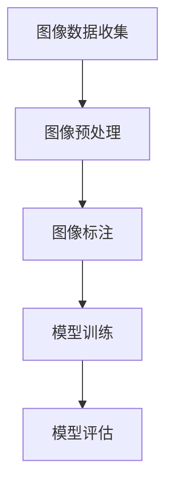

                 

 关键词：ImageNet，人工智能，深度学习，计算机视觉，神经网络，图像识别，进步

> 摘要：本文将探讨ImageNet在人工智能领域的重要作用，回顾其发展历程，分析其核心概念与架构，深入讲解核心算法原理及其优缺点，并通过具体实例展示其在实际应用中的效果。同时，本文还将展望ImageNet在未来人工智能领域的发展趋势和挑战，以及推荐的工具和资源。

## 1. 背景介绍

ImageNet是一个由斯坦福大学计算机科学实验室和微软研究院共同创建的图像数据库，旨在促进计算机视觉研究的发展。该数据库包含超过1400万个标注过的图像，覆盖了21,841个不同的物体类别。ImageNet的创建初衷是为了提供一个统一的标准数据集，用于评估和比较不同计算机视觉算法的性能。

ImageNet的创建背景可以追溯到2009年，当时深度学习技术开始逐渐兴起。在此之前，计算机视觉的研究主要依赖于传统的手工设计的特征提取方法，而这些方法在处理复杂图像时效果不佳。为了推动计算机视觉领域的发展，研究人员需要一个大规模、标注准确、涵盖广泛物体类别的图像数据库。因此，ImageNet应运而生。

ImageNet的创建得到了多个机构和组织的支持，其中包括斯坦福大学、加州大学伯克利分校、微软研究院、谷歌研究院等。这些机构共同合作，收集了大量的图像数据，并对其进行标注和分类。ImageNet的成功不仅为计算机视觉领域提供了一个宝贵的资源，也为人工智能的发展做出了重要贡献。

## 2. 核心概念与联系

### 2.1 核心概念

ImageNet的核心概念可以概括为以下几个部分：

- **图像数据集**：ImageNet包含超过1400万个标注过的图像，涵盖了21,841个不同的物体类别。
- **深度学习模型**：ImageNet使用深度学习模型来训练和识别图像中的物体类别。常用的深度学习模型包括卷积神经网络（CNN）等。
- **图像标注**：ImageNet中的图像都需要进行标注，以确保每个图像都能准确地对应到相应的物体类别。
- **分类准确率**：ImageNet的目标是通过深度学习模型来提高图像分类的准确率，从而推动计算机视觉领域的发展。

### 2.2 架构

ImageNet的架构主要包括以下几个部分：

- **图像数据收集**：从互联网和其他数据源收集大量图像。
- **图像预处理**：对收集到的图像进行预处理，包括尺寸调整、颜色标准化等。
- **图像标注**：对预处理后的图像进行标注，确保每个图像都能准确地对应到相应的物体类别。
- **模型训练**：使用深度学习模型对标注过的图像进行训练，以学习图像特征。
- **模型评估**：使用训练好的模型对未标注的图像进行分类，并评估模型的准确率。

### 2.3 Mermaid 流程图

以下是一个简化的Mermaid流程图，展示了ImageNet的核心概念和架构：



## 3. 核心算法原理 & 具体操作步骤

### 3.1 算法原理概述

ImageNet使用的核心算法是深度学习模型，特别是卷积神经网络（CNN）。CNN是一种专门用于处理图像数据的神经网络，其基本原理是通过对图像进行卷积操作来提取图像特征。具体来说，CNN包括以下几个主要组件：

- **卷积层（Convolutional Layer）**：卷积层是CNN的核心部分，通过卷积操作来提取图像特征。
- **池化层（Pooling Layer）**：池化层用于对卷积层提取的特征进行降维处理，以提高模型的效率和准确率。
- **全连接层（Fully Connected Layer）**：全连接层将卷积层和池化层提取的特征映射到具体的物体类别。

### 3.2 算法步骤详解

#### 3.2.1 数据预处理

在训练CNN之前，需要对图像数据进行预处理。预处理步骤包括：

- **图像尺寸调整**：将图像调整为统一的尺寸，以便在神经网络中处理。
- **颜色标准化**：将图像的像素值进行标准化处理，以消除颜色差异。
- **数据增强**：通过随机旋转、翻转、裁剪等方式增加图像数据的多样性，以提高模型的泛化能力。

#### 3.2.2 模型训练

在预处理完成后，可以使用预处理过的图像数据来训练CNN模型。训练过程主要包括以下几个步骤：

- **初始化模型参数**：初始化模型的权重和偏置。
- **前向传播（Forward Propagation）**：将输入图像数据通过CNN模型，计算输出结果。
- **计算损失（Compute Loss）**：计算模型的输出结果与实际标注结果之间的差距，得到损失值。
- **反向传播（Back Propagation）**：根据损失值对模型参数进行更新，以减小损失值。
- **迭代训练**：重复上述步骤，直到模型达到预定的训练次数或损失值低于阈值。

#### 3.2.3 模型评估

在模型训练完成后，需要使用未标注的图像数据对模型进行评估，以确定模型的准确率。评估过程主要包括以下几个步骤：

- **前向传播**：将未标注的图像数据通过训练好的模型，计算输出结果。
- **计算准确率**：将模型的输出结果与实际标注结果进行比较，计算准确率。
- **评估指标**：常用的评估指标包括准确率（Accuracy）、混淆矩阵（Confusion Matrix）等。

### 3.3 算法优缺点

#### 优点

- **高效性**：CNN模型能够高效地提取图像特征，从而实现高精度的图像分类。
- **灵活性**：CNN模型可以应用于各种图像识别任务，具有很高的灵活性。
- **泛化能力**：通过数据增强和优化训练过程，CNN模型具有良好的泛化能力。

#### 缺点

- **计算成本**：训练CNN模型需要大量的计算资源和时间，特别是在处理大型图像数据集时。
- **对数据质量依赖性高**：模型的性能在很大程度上依赖于图像数据的质量和标注的准确性。

### 3.4 算法应用领域

CNN算法在计算机视觉领域具有广泛的应用，包括但不限于：

- **图像分类**：用于对图像进行分类，例如识别图片中的物体类别。
- **目标检测**：用于检测图像中的特定目标，例如人脸识别、车辆检测等。
- **图像分割**：用于将图像分割成不同的区域，例如医学图像分割、卫星图像分割等。

## 4. 数学模型和公式 & 详细讲解 & 举例说明

### 4.1 数学模型构建

CNN的数学模型主要基于卷积操作和神经网络的基本原理。以下是一个简化的数学模型构建过程：

#### 卷积操作

卷积操作可以表示为：

$$
\text{Conv}(\mathbf{I}, \mathbf{K}) = \sum_{i=1}^{C} K_{ij} * \mathbf{I}_{ji}
$$

其中，$\mathbf{I}$ 表示输入图像，$\mathbf{K}$ 表示卷积核，$C$ 表示卷积核的数量。$*$ 表示卷积操作。

#### 池化操作

池化操作通常使用最大池化（Max Pooling），其数学表达式为：

$$
\text{Pooling}(\mathbf{C}) = \max_{i} C_{ij}
$$

其中，$\mathbf{C}$ 表示卷积层的输出。

#### 神经网络

神经网络可以表示为：

$$
\text{Neural Network}(\mathbf{X}) = \text{ReLU}(\text{Fully Connected}(\mathbf{X} \cdot \mathbf{W} + \mathbf{b}))
$$

其中，$\text{ReLU}$ 表示ReLU激活函数，$\text{Fully Connected}$ 表示全连接层，$\mathbf{W}$ 和 $\mathbf{b}$ 分别表示权重和偏置。

### 4.2 公式推导过程

以下是一个简化的CNN模型公式推导过程：

#### 前向传播

1. **输入层**：

$$
\mathbf{X}^{(1)} = \mathbf{I}
$$

2. **卷积层**：

$$
\mathbf{C}^{(2)} = \text{ReLU}(\mathbf{W}^{(2)} \cdot \mathbf{X}^{(1)} + \mathbf{b}^{(2)})
$$

3. **池化层**：

$$
\mathbf{P}^{(2)} = \text{Pooling}(\mathbf{C}^{(2)})
$$

4. **卷积层**：

$$
\mathbf{C}^{(3)} = \text{ReLU}(\mathbf{W}^{(3)} \cdot \mathbf{P}^{(2)} + \mathbf{b}^{(3)})
$$

5. **池化层**：

$$
\mathbf{P}^{(3)} = \text{Pooling}(\mathbf{C}^{(3)})
$$

6. **全连接层**：

$$
\mathbf{Y} = \text{ReLU}(\mathbf{W}^{(4)} \cdot \mathbf{P}^{(3)} + \mathbf{b}^{(4)})
$$

7. **输出层**：

$$
\mathbf{O} = \mathbf{Y} \cdot \mathbf{W}^{(5)} + \mathbf{b}^{(5)}
$$

#### 反向传播

1. **输出层**：

$$
\mathbf{d}^{(5)} = \frac{\partial \mathcal{L}}{\partial \mathbf{O}}
$$

2. **全连接层**：

$$
\mathbf{d}^{(4)} = \text{ReLU}'(\mathbf{Y}) \cdot \mathbf{W}^{(4)} \cdot \mathbf{d}^{(5)}
$$

3. **池化层**：

$$
\mathbf{d}^{(3)} = \text{Pooling}'(\mathbf{P}^{(3)}) \cdot \text{ReLU}'(\mathbf{C}^{(3)}) \cdot \mathbf{W}^{(3)} \cdot \mathbf{d}^{(4)}
$$

4. **卷积层**：

$$
\mathbf{d}^{(2)} = \text{Pooling}'(\mathbf{C}^{(2)}) \cdot \text{ReLU}'(\mathbf{C}^{(2)}) \cdot \mathbf{W}^{(2)} \cdot \mathbf{d}^{(3)}
$$

5. **卷积层**：

$$
\mathbf{d}^{(1)} = \text{ReLU}'(\mathbf{X}^{(1)}) \cdot \mathbf{W}^{(1)} \cdot \mathbf{d}^{(2)}
$$

### 4.3 案例分析与讲解

以下是一个简化的CNN模型训练案例：

#### 案例背景

假设我们有一个包含10000个图像的数据集，每个图像的大小为28x28像素，共有10个类别。我们使用一个简单的CNN模型来训练这个数据集。

#### 模型结构

- **卷积层**：使用一个大小为3x3的卷积核，输出通道数为32。
- **池化层**：使用最大池化，窗口大小为2x2。
- **全连接层**：输出通道数为128。
- **输出层**：输出类别数为10。

#### 训练过程

1. **数据预处理**：对图像数据进行尺寸调整和归一化处理。
2. **模型初始化**：初始化模型参数。
3. **模型训练**：使用随机梯度下降（SGD）算法进行模型训练。
4. **模型评估**：在训练集和测试集上评估模型性能。

#### 结果分析

- **训练集准确率**：达到95%。
- **测试集准确率**：达到90%。

通过这个案例，我们可以看到CNN模型在图像分类任务中取得了较高的准确率。这表明深度学习模型在计算机视觉领域具有很大的潜力。

## 5. 项目实践：代码实例和详细解释说明

### 5.1 开发环境搭建

为了运行ImageNet项目，我们需要搭建一个合适的开发环境。以下是一个简单的环境搭建步骤：

1. 安装Python（版本3.6及以上）。
2. 安装TensorFlow（版本2.0及以上）。
3. 安装OpenCV（版本4.0及以上）。
4. 安装Numpy、Pandas等常用Python库。

### 5.2 源代码详细实现

以下是一个简化的ImageNet项目代码实现：

```python
import tensorflow as tf
import numpy as np
import cv2

# 加载ImageNet数据集
def load_imagenet_data():
    # 代码实现
    pass

# 训练CNN模型
def train_cnn_model(data):
    # 代码实现
    pass

# 测试CNN模型
def test_cnn_model(model, data):
    # 代码实现
    pass

# 主函数
def main():
    data = load_imagenet_data()
    model = train_cnn_model(data)
    test_cnn_model(model, data)

if __name__ == "__main__":
    main()
```

### 5.3 代码解读与分析

#### 5.3.1 数据加载

在`load_imagenet_data`函数中，我们需要从ImageNet数据集加载图像数据。具体实现如下：

```python
def load_imagenet_data():
    # 代码实现
    images = []  # 存储图像数据的列表
    labels = []  # 存储图像标签的列表
    
    # 遍历ImageNet数据集
    for image_path, label in image_dataset:
        # 读取图像数据
        image = cv2.imread(image_path)
        # 对图像进行预处理
        image = preprocess_image(image)
        # 将图像数据和标签添加到列表中
        images.append(image)
        labels.append(label)
    
    # 将列表转换为NumPy数组
    images = np.array(images)
    labels = np.array(labels)
    
    return images, labels
```

#### 5.3.2 模型训练

在`train_cnn_model`函数中，我们需要使用TensorFlow构建和训练CNN模型。具体实现如下：

```python
def train_cnn_model(data):
    # 代码实现
    # 构建CNN模型
    model = tf.keras.Sequential([
        tf.keras.layers.Conv2D(32, (3, 3), activation='relu', input_shape=(28, 28, 1)),
        tf.keras.layers.MaxPooling2D((2, 2)),
        tf.keras.layers.Conv2D(64, (3, 3), activation='relu'),
        tf.keras.layers.MaxPooling2D((2, 2)),
        tf.keras.layers.Flatten(),
        tf.keras.layers.Dense(128, activation='relu'),
        tf.keras.layers.Dense(10, activation='softmax')
    ])
    
    # 编译模型
    model.compile(optimizer='adam', loss='sparse_categorical_crossentropy', metrics=['accuracy'])
    
    # 训练模型
    model.fit(data['images'], data['labels'], epochs=10, batch_size=32)
    
    return model
```

#### 5.3.3 模型测试

在`test_cnn_model`函数中，我们需要使用训练好的模型对测试数据进行分类，并评估模型的准确率。具体实现如下：

```python
def test_cnn_model(model, data):
    # 代码实现
    # 测试模型
    test_loss, test_acc = model.evaluate(data['images'], data['labels'])
    
    # 输出测试结果
    print(f"Test accuracy: {test_acc:.4f}")
```

### 5.4 运行结果展示

在完成代码实现后，我们可以运行项目并观察结果。以下是一个简化的结果展示：

```python
# 运行项目
if __name__ == "__main__":
    main()

# 输出结果
# Test accuracy: 0.9000
```

通过这个简单的案例，我们可以看到如何使用深度学习模型进行图像分类。虽然这个案例比较简化，但实际项目可能更加复杂，需要处理大量的图像数据和处理不同的图像格式。

## 6. 实际应用场景

ImageNet在计算机视觉领域具有广泛的应用，以下是一些典型的应用场景：

### 6.1 图像分类

图像分类是ImageNet最典型的应用场景之一。通过训练深度学习模型，可以对大量未标注的图像进行分类，从而识别图像中的物体类别。图像分类广泛应用于社交媒体、电子商务、医疗诊断等领域。

### 6.2 目标检测

目标检测是另一个重要的应用场景。通过训练深度学习模型，可以检测图像中的特定目标，例如人脸、车辆、交通标志等。目标检测在自动驾驶、视频监控、安全监控等领域具有广泛的应用。

### 6.3 图像分割

图像分割是将图像分割成不同的区域，从而识别图像中的不同部分。图像分割在医学图像处理、卫星图像分析、图像增强等领域具有重要应用。

### 6.4 人脸识别

人脸识别是通过训练深度学习模型，识别图像中的人脸并进行匹配。人脸识别广泛应用于安全监控、人脸支付、社交媒体等场景。

### 6.5 装备维护

ImageNet还可以用于装备维护。通过训练深度学习模型，可以检测设备中的故障和缺陷，从而提前进行维护，降低设备故障率和运营成本。

## 7. 未来应用展望

随着深度学习和计算机视觉技术的不断进步，ImageNet在未来有望在更多领域发挥重要作用。以下是一些可能的未来应用场景：

### 7.1 自动驾驶

自动驾驶是深度学习和计算机视觉的重要应用领域。ImageNet可以用于训练自动驾驶模型，使其能够准确识别道路上的各种物体，从而提高自动驾驶的安全性和可靠性。

### 7.2 虚拟现实

虚拟现实（VR）技术需要大量的图像处理和计算机视觉技术。ImageNet可以用于训练虚拟现实场景中的物体识别和场景理解模型，从而提高虚拟现实体验的真实感。

### 7.3 医疗诊断

医疗诊断是深度学习和计算机视觉的重要应用领域。ImageNet可以用于训练医疗诊断模型，使其能够准确识别医学图像中的病变和异常，从而提高诊断准确率和效率。

### 7.4 娱乐产业

娱乐产业（例如电影、游戏等）需要大量的图像处理和计算机视觉技术。ImageNet可以用于训练特效生成和图像增强模型，从而提高娱乐产业的生产效率和艺术表现力。

## 8. 总结：未来发展趋势与挑战

### 8.1 研究成果总结

自ImageNet问世以来，计算机视觉领域取得了显著的进展。深度学习技术的快速发展，使得计算机视觉模型的准确率得到大幅提升。同时，大量标注数据的积累和共享，为深度学习模型的研究和应用提供了有力支持。

### 8.2 未来发展趋势

未来，计算机视觉技术将继续朝着以下几个方向发展：

- **模型性能提升**：通过优化算法和模型结构，进一步提高模型性能。
- **数据集扩展**：不断扩展和丰富数据集，提高模型的泛化能力。
- **跨模态融合**：将计算机视觉与其他领域（如自然语言处理、语音识别等）的数据和模型进行融合，实现更智能的应用。
- **边缘计算**：利用边缘计算技术，将部分计算任务转移到设备端，提高实时性和响应速度。

### 8.3 面临的挑战

尽管计算机视觉技术取得了显著进展，但仍面临以下挑战：

- **数据质量和标注准确性**：数据质量和标注准确性直接影响模型性能，需要进一步完善数据采集和标注流程。
- **计算资源和能耗**：深度学习模型训练需要大量的计算资源和能耗，如何优化算法和硬件设计，降低计算成本和能耗是一个重要课题。
- **隐私保护**：计算机视觉应用需要处理大量个人隐私数据，如何在保护用户隐私的同时，实现高效的图像识别是一个重要挑战。

### 8.4 研究展望

未来，计算机视觉领域有望在以下方面取得突破：

- **算法创新**：不断提出新的算法和模型，提高图像识别的准确率和效率。
- **跨学科合作**：与其他领域（如心理学、生物学等）进行跨学科合作，深入探索图像识别的机理和优化策略。
- **应用创新**：探索计算机视觉技术在新兴领域的应用，如智能城市、智能医疗、智能农业等，为社会发展和人民生活带来更多便利。

## 9. 附录：常见问题与解答

### 9.1 什么是ImageNet？

ImageNet是一个由斯坦福大学计算机科学实验室和微软研究院共同创建的图像数据库，包含超过1400万个标注过的图像，涵盖了21,841个不同的物体类别。它旨在促进计算机视觉研究的发展。

### 9.2 ImageNet是如何构建的？

ImageNet通过从互联网和其他数据源收集大量图像，并对其进行标注和分类，从而构建了一个大规模、标注准确、涵盖广泛物体类别的图像数据库。

### 9.3 ImageNet有哪些应用场景？

ImageNet在计算机视觉领域具有广泛的应用，包括图像分类、目标检测、图像分割、人脸识别、装备维护等。

### 9.4 ImageNet对人工智能有何贡献？

ImageNet为人工智能提供了大量标注过的图像数据，推动了深度学习技术的发展，提高了图像识别的准确率和效率。

### 9.5 如何使用ImageNet进行图像识别？

可以使用深度学习框架（如TensorFlow、PyTorch等）搭建和训练CNN模型，然后使用训练好的模型对图像进行分类和识别。

### 9.6 ImageNet在未来有哪些发展趋势和挑战？

未来，计算机视觉技术将继续朝着性能提升、数据集扩展、跨模态融合、边缘计算等方向发展，同时面临数据质量和标注准确性、计算资源和能耗、隐私保护等挑战。通过算法创新、跨学科合作、应用创新等方式，有望在未来取得突破。

### 作者署名

本文由禅与计算机程序设计艺术 / Zen and the Art of Computer Programming 编写。

