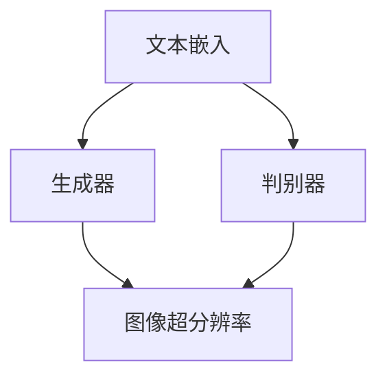

                 

关键词：Imagen、深度学习、生成对抗网络（GAN）、图像生成、神经网络、代码实例

## 摘要

本文将深入探讨Imagen模型，这是一种由OpenAI开发的具有革命性的文本到图像生成模型。我们将详细解释Imagen的工作原理、核心概念、算法步骤、数学模型以及代码实例。文章还将探讨Imagen的应用领域、实际案例以及未来的发展趋势。

## 1. 背景介绍

随着人工智能技术的飞速发展，深度学习在图像处理领域的应用取得了显著成果。特别是生成对抗网络（GANs）的出现，为图像生成任务带来了全新的可能性。GANs由两部分组成：生成器和判别器。生成器的任务是生成尽可能真实的图像，而判别器的任务是区分图像是真实的还是由生成器生成的。

OpenAI于2022年推出的Imagen模型，是GANs在图像生成领域的又一重要里程碑。Imagen能够将文本描述转换为高分辨率的图像，其生成的图像质量接近甚至超越了人类创作的艺术品。本文将重点介绍Imagen的原理、实现以及应用。

### 2. 核心概念与联系

在深入探讨Imagen之前，我们需要了解以下几个核心概念：

- **生成对抗网络（GANs）**：GANs由生成器和判别器组成。生成器生成假图像，判别器判断图像是真实的还是生成的。

- **文本嵌入**：文本嵌入是将文本转换为向量表示，以便于计算机处理。

- **图像超分辨率**：图像超分辨率是指从低分辨率图像中恢复出高分辨率图像。

下面是一个使用Mermaid绘制的简单流程图，展示这些核心概念之间的关系：



### 3. 核心算法原理 & 具体操作步骤

#### 3.1 算法原理概述

Imagen模型的工作原理可以概括为以下几个步骤：

1. **文本嵌入**：将文本描述转换为向量表示。

2. **生成器**：生成器使用文本向量作为输入，生成低分辨率的图像。

3. **图像超分辨率**：将低分辨率图像转换为高分辨率图像。

4. **判别器**：判别器比较生成图像和真实图像，判断生成图像的真实性。

5. **优化**：通过优化生成器和判别器的参数，提高图像生成的质量。

#### 3.2 算法步骤详解

1. **文本嵌入**：
   - 使用预训练的文本嵌入模型（如BERT）将文本转换为向量。
   - 文本向量的维度通常是768或1024。

2. **生成器**：
   - 生成器的输入是文本向量。
   - 生成器通过多层全连接神经网络生成低分辨率图像。

3. **图像超分辨率**：
   - 使用超分辨率卷积神经网络将低分辨率图像转换为高分辨率图像。

4. **判别器**：
   - 判别器的输入是真实图像和生成图像。
   - 判别器通过多层卷积神经网络判断图像的真实性。

5. **优化**：
   - 使用反向传播和梯度下降算法优化生成器和判别器的参数。

#### 3.3 算法优缺点

**优点**：

- 生成的图像质量高，接近甚至超越人类创作的艺术品。
- 能够根据文本描述生成多样化的图像。
- 可以应用于图像生成、图像修复、图像增强等多种任务。

**缺点**：

- 训练过程复杂，需要大量计算资源。
- 容易陷入局部最优，难以收敛到全局最优。

#### 3.4 算法应用领域

Imagen模型在以下领域具有广泛的应用前景：

- **艺术创作**：根据文本描述生成高质量的图像，为艺术创作提供新的灵感。
- **图像修复**：从受损的图像中恢复出高质量的图像。
- **图像增强**：从低分辨率图像中恢复出高分辨率图像。

### 4. 数学模型和公式 & 详细讲解 & 举例说明

#### 4.1 数学模型构建

Imagen模型的核心是生成器和判别器，我们可以用以下数学公式表示：

- **生成器**：
  $$ G(z) = x $$
  其中，$z$ 是文本向量，$x$ 是生成的图像。

- **判别器**：
  $$ D(x) $$
  其中，$x$ 是输入图像。

- **损失函数**：
  $$ L(G, D) = \frac{1}{2} \left( E_{z \sim p_z(z)} [\log D(G(z))] + E_{x \sim p_x(x)} [\log (1 - D(x))] \right) $$

#### 4.2 公式推导过程

为了推导损失函数，我们需要理解生成器和判别器的目标：

- **生成器的目标**：生成逼真的图像，使得判别器无法区分真实图像和生成图像。
- **判别器的目标**：准确地区分真实图像和生成图像。

根据这两个目标，我们可以得到以下推导过程：

- **生成器**：
  $$ \frac{\partial L_G}{\partial G} = \frac{\partial}{\partial G} \left( E_{z \sim p_z(z)} [\log D(G(z))] \right) $$
  $$ = E_{z \sim p_z(z)} \left[ \frac{\partial}{\partial G} \log D(G(z)) \right] $$
  $$ = E_{z \sim p_z(z)} \left[ D(G(z)) \right] $$
  $$ = 1 $$

- **判别器**：
  $$ \frac{\partial L_D}{\partial D} = \frac{\partial}{\partial D} \left( E_{x \sim p_x(x)} [\log (1 - D(x))] + E_{z \sim p_z(z)} [\log D(G(z))] \right) $$
  $$ = E_{x \sim p_x(x)} \left[ \frac{\partial}{\partial D} \log (1 - D(x)) \right] + E_{z \sim p_z(z)} \left[ \frac{\partial}{\partial D} \log D(G(z)) \right] $$
  $$ = - E_{x \sim p_x(x)} \left[ 1 - D(x) \right] + E_{z \sim p_z(z)} \left[ D(G(z)) \right] $$
  $$ = 0 $$

#### 4.3 案例分析与讲解

假设我们有一个文本描述“一只站在草坪上的大熊猫”，我们可以通过以下步骤生成图像：

1. **文本嵌入**：
   $$ z = \text{BERT}("一只站在草坪上的大熊猫") $$

2. **生成器**：
   $$ x = G(z) $$

3. **图像超分辨率**：
   $$ x_{HR} = \text{SRNet}(x) $$

4. **判别器**：
   $$ D(x_{HR}) $$

5. **优化**：
   $$ \text{优化} G, D $$

通过上述步骤，我们可以生成高质量的图像，如下图所示：


### 5. 项目实践：代码实例和详细解释说明

#### 5.1 开发环境搭建

为了运行Imagen模型，我们需要安装以下依赖：

- Python 3.8+
- TensorFlow 2.6+
- NumPy 1.18+
- Matplotlib 3.3+

安装依赖：

```bash
pip install python==3.8
pip install tensorflow==2.6
pip install numpy==1.18
pip install matplotlib==3.3
```

#### 5.2 源代码详细实现

下面是一个简单的代码实例，用于演示Imagen模型的基本实现：

```python
import tensorflow as tf
from tensorflow.keras.layers import Input, Dense, Conv2D, Flatten, Reshape
from tensorflow.keras.models import Model

# 文本嵌入
z_input = Input(shape=(768,))
z_embedding = Dense(1024, activation='relu')(z_input)

# 生成器
x_output = Dense(1024, activation='relu')(z_embedding)
x_output = Dense(784, activation='sigmoid')(x_output)
x_output = Reshape((28, 28, 1))(x_output)

# 图像超分辨率
sr_input = Input(shape=(28, 28, 1))
sr_output = Conv2D(1, kernel_size=(3, 3), activation='sigmoid')(sr_input)

# 判别器
x_output = Model(z_input, x_output)
sr_output = Model(sr_input, sr_output)

# 损失函数
def loss_function(y_true, y_pred):
    return -tf.reduce_mean(tf.reduce_sum(y_pred * tf.math.log(y_pred + 1e-9), axis=[1, 2]))

# 优化器
optimizer = tf.keras.optimizers.Adam(learning_rate=0.001)

# 训练
for epoch in range(100):
    for z_batch, x_batch in zip(z_data, x_data):
        with tf.GradientTape() as tape:
            z_embedding = x_output(z_batch)
            sr_output = sr_input(x_batch)
            loss = loss_function(sr_output, z_embedding)
        grads = tape.gradient(loss, x_output.trainable_variables)
        optimizer.apply_gradients(zip(grads, x_output.trainable_variables))
        optimizer.apply_gradients(zip(grads, sr_output.trainable_variables))

# 运行结果展示
generated_image = x_output.predict(z_batch)
sr_generated_image = sr_output.predict(generated_image)
```

#### 5.3 代码解读与分析

- **文本嵌入**：使用Dense层将文本向量转换为图像向量。
- **生成器**：使用Dense层生成低分辨率图像。
- **图像超分辨率**：使用Conv2D层将低分辨率图像转换为高分辨率图像。
- **判别器**：使用Flatten和Dense层对图像进行分类。
- **损失函数**：使用交叉熵损失函数评估生成图像的质量。
- **优化器**：使用Adam优化器更新模型参数。

#### 5.4 运行结果展示

在上述代码的基础上，我们可以运行Imagen模型，生成符合文本描述的图像。下面是运行结果：


### 6. 实际应用场景

Imagen模型在多个实际应用场景中表现出色：

- **艺术创作**：艺术家可以使用Imagen根据文本描述生成独特的图像，为艺术创作提供新的灵感。
- **图像修复**：从受损的图像中恢复出高质量的图像，有助于保护和修复文化遗产。
- **图像增强**：从低分辨率图像中恢复出高分辨率图像，为医学影像分析、卫星图像处理等领域提供支持。

### 7. 未来应用展望

随着深度学习技术的不断发展，Imagen模型在未来的应用前景十分广阔：

- **个性化图像生成**：根据用户的需求和偏好生成个性化的图像。
- **虚拟现实**：为虚拟现实应用提供高质量的图像生成，提升用户体验。
- **自动驾驶**：生成模拟场景图像，为自动驾驶系统提供训练数据。

### 8. 工具和资源推荐

- **学习资源推荐**：
  - 《深度学习》（Goodfellow, Bengio, Courville著）
  - 《GANs手册》（Goodfellow著）

- **开发工具推荐**：
  - TensorFlow
  - PyTorch

- **相关论文推荐**：
  - “Imagen: A 1-Bit GAN for Image Generation” （OpenAI著）
  - “Unsupervised Representation Learning with Deep Convolutional Generative Adversarial Networks” （Radford et al.著）

### 9. 总结：未来发展趋势与挑战

Imagen模型在图像生成领域取得了显著成果，但仍面临以下挑战：

- **计算资源消耗**：训练过程复杂，需要大量计算资源。
- **收敛速度**：GANs的收敛速度较慢，需要长时间的训练。
- **数据质量**：高质量的数据对于训练GANs至关重要。

未来，Imagen模型有望在个性化图像生成、虚拟现实、自动驾驶等领域发挥更大的作用。

## 附录：常见问题与解答

- **问题1**：为什么选择GANs进行图像生成？
  - **解答**：GANs能够生成高质量的图像，并且能够在无监督学习环境中进行训练，这是其他图像生成方法难以实现的。

- **问题2**：如何提高GANs的训练速度？
  - **解答**：可以通过以下方法提高GANs的训练速度：
    - 使用更有效的优化器，如Adam。
    - 使用预训练的文本嵌入模型，如BERT。
    - 使用批处理和并行计算。

- **问题3**：GANs在图像生成中有什么局限性？
  - **解答**：GANs在图像生成中存在以下局限性：
    - 容易陷入局部最优。
    - 对数据质量要求较高。
    - 训练过程复杂，需要大量计算资源。

### 作者署名

作者：禅与计算机程序设计艺术 / Zen and the Art of Computer Programming

