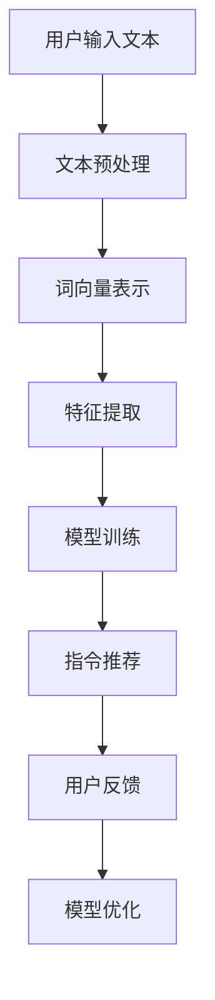

                 

关键词：自然语言处理、指令推荐、文本理解、机器学习、数据挖掘

> 摘要：本文深入探讨了自然语言指令推荐系统的设计原理、实现方法以及应用场景，通过详细阐述核心算法、数学模型和项目实践，为读者提供了全面的技术参考和未来展望。

## 1. 背景介绍

自然语言处理（NLP）作为人工智能领域的一个重要分支，旨在使计算机能够理解、处理和生成人类语言。随着互联网和社交媒体的快速发展，海量的文本数据产生，如何有效地从这些数据中提取有价值的信息成为了研究的热点。指令推荐系统（Instruction Recommendation System，简称InstructRec）便是其中一种应用，它通过分析用户的文本输入，为其提供最合适的指令或建议。

传统的推荐系统主要基于用户行为数据，如购买历史、浏览记录等，而指令推荐系统则更注重文本的理解和分析。这种系统在智能客服、虚拟助手、内容推荐等场景中具有重要应用价值。然而，如何构建一个高效、准确的指令推荐系统仍是一个具有挑战性的问题。

本文旨在深入探讨指令推荐系统的设计原理、实现方法及其应用场景。我们将首先介绍核心算法原理，然后详细讲解数学模型和具体操作步骤，最后通过项目实践展示其实际应用效果。

## 2. 核心概念与联系

### 2.1. 自然语言指令

自然语言指令是指用户以自然语言形式输入的需求或请求，如“明天天气如何？”或“帮我查找最近的电影票”。这些指令需要被计算机准确理解并转换为相应的操作。

### 2.2. 文本理解

文本理解是自然语言处理的核心任务之一，旨在使计算机能够理解文本的含义、结构和上下文。这涉及到词法分析、句法分析、语义分析等多个层面。

### 2.3. 指令推荐

指令推荐系统通过分析用户的文本输入，为其提供最合适的指令或建议。这需要综合考虑用户的意图、上下文信息以及系统可用功能。

### 2.4. 机器学习

机器学习是构建指令推荐系统的关键技术之一，通过训练模型来识别和预测用户的指令。常见的机器学习方法包括朴素贝叶斯、支持向量机、深度学习等。

### 2.5. 数据挖掘

数据挖掘是发现数据中潜在的模式和知识的过程，对于构建指令推荐系统具有重要意义。通过数据挖掘技术，可以从大量的用户数据中提取有价值的信息，为指令推荐提供依据。

### 2.6. Mermaid 流程图

为了更好地理解指令推荐系统的架构和流程，我们使用Mermaid绘制了一个简单的流程图：



在图2-6中，用户输入文本经过预处理、词向量表示、特征提取等步骤，最终通过训练好的模型生成指令推荐结果，并根据用户反馈进行模型优化。

## 3. 核心算法原理 & 具体操作步骤

### 3.1. 算法原理概述

指令推荐系统通常采用基于机器学习的方法，通过训练模型来识别和预测用户的指令。核心算法原理主要包括以下几个步骤：

1. **文本预处理**：对用户输入的文本进行清洗、分词、去停用词等操作，将文本转换为可用于模型训练的特征表示。
2. **词向量表示**：将预处理后的文本转换为词向量表示，常用的方法包括Word2Vec、GloVe等。
3. **特征提取**：从词向量表示中提取文本特征，如词袋模型、TF-IDF等。
4. **模型训练**：使用特征数据和标签数据训练指令识别模型，常用的模型包括朴素贝叶斯、支持向量机、循环神经网络（RNN）等。
5. **指令推荐**：将用户的文本输入转化为特征表示，通过训练好的模型生成指令推荐结果。
6. **用户反馈**：收集用户对指令推荐结果的反馈，用于模型优化。

### 3.2. 算法步骤详解

下面我们详细讲解每个步骤的具体实现。

#### 3.2.1. 文本预处理

文本预处理是自然语言处理的基础步骤，其目的是将原始文本转换为适合模型训练的形式。具体操作包括：

1. **清洗文本**：去除文本中的HTML标签、符号等无关信息。
2. **分词**：将文本划分为单词或短语。
3. **去停用词**：去除常见的无意义词汇，如“的”、“了”、“是”等。
4. **词干提取**：将单词转换为词干形式，如“奔跑”转换为“奔跑”。

```python
from nltk.tokenize import word_tokenize
from nltk.corpus import stopwords
from nltk.stem import PorterStemmer

# 示例代码
text = "我非常喜欢跑步。"
tokens = word_tokenize(text)  # 分词
filtered_tokens = [token for token in tokens if token not in stopwords.words('english')]  # 去停用词
stemmed_tokens = [PorterStemmer().stem(token) for token in filtered_tokens]  # 词干提取
print(stemmed_tokens)
```

#### 3.2.2. 词向量表示

词向量表示是将文本中的单词映射为向量形式，以便于计算机处理。常用的词向量表示方法包括Word2Vec和GloVe。

1. **Word2Vec**：基于神经网络的方法，通过训练大量文本数据生成词向量。
2. **GloVe**：基于全局向量表示的方法，通过计算单词之间的相似性来生成词向量。

```python
from gensim.models import Word2Vec

# 示例代码
sentences = [['我', '喜欢', '跑步'], ['明天', '天气', '如何']]
model = Word2Vec(sentences, vector_size=100, window=5, min_count=1, workers=4)
print(model.wv['我'])
```

#### 3.2.3. 特征提取

特征提取是将词向量表示转换为模型训练所需的特征表示。常用的特征提取方法包括词袋模型和TF-IDF。

1. **词袋模型**：将文本表示为一个向量，其中每个维度表示一个单词的词频。
2. **TF-IDF**：基于词频和逆文档频率，衡量单词在文本中的重要性。

```python
from sklearn.feature_extraction.text import CountVectorizer, TfidfTransformer

# 示例代码
corpus = [['我非常喜欢跑步'], ['明天天气如何']]
vectorizer = CountVectorizer()
tfidf_transformer = TfidfTransformer()
X = vectorizer.fit_transform(corpus)
tfidf = tfidf_transformer.fit_transform(X)
print(tfidf.toarray())
```

#### 3.2.4. 模型训练

模型训练是构建指令推荐系统的关键步骤，常用的模型包括朴素贝叶斯、支持向量机、循环神经网络（RNN）等。

1. **朴素贝叶斯**：基于贝叶斯定理，通过计算特征概率分布进行分类。
2. **支持向量机**：通过最大化分类边界来划分数据。
3. **循环神经网络（RNN）**：用于处理序列数据，能够捕捉文本中的时间依赖关系。

```python
from sklearn.naive_bayes import MultinomialNB
from sklearn.svm import SVC
from keras.models import Sequential
from keras.layers import LSTM, Dense

# 示例代码
# 朴素贝叶斯
model = MultinomialNB()
model.fit(X_train, y_train)
print(model.predict(X_test))

# 支持向量机
model = SVC()
model.fit(X_train, y_train)
print(model.predict(X_test))

# 循环神经网络（RNN）
model = Sequential()
model.add(LSTM(100, activation='relu', input_shape=(timesteps, n_features)))
model.add(Dense(1, activation='sigmoid'))
model.compile(optimizer='adam', loss='binary_crossentropy', metrics=['accuracy'])
model.fit(X_train, y_train, epochs=100, batch_size=32, validation_data=(X_test, y_test))
print(model.predict(X_test))
```

#### 3.2.5. 指令推荐

指令推荐是将用户的文本输入转化为特征表示，通过训练好的模型生成指令推荐结果。具体操作如下：

1. **文本预处理**：对用户输入的文本进行预处理，包括清洗、分词、去停用词等。
2. **词向量表示**：将预处理后的文本转换为词向量表示。
3. **特征提取**：从词向量表示中提取文本特征。
4. **模型预测**：使用训练好的模型对特征表示进行分类，生成指令推荐结果。

```python
# 示例代码
text = "明天天气如何？"
preprocessed_text = preprocess(text)
word_vectors = model.wv[preprocessed_text]
tfidf = tfidf_transformer.transform([word_vectors])
predicted_instruction = model.predict(tfidf)
print(predicted_instruction)
```

#### 3.2.6. 用户反馈

用户反馈是优化指令推荐系统的重要环节，通过收集用户对指令推荐结果的反馈，可以不断调整和优化模型。

1. **反馈收集**：收集用户对指令推荐结果的满意度评分。
2. **模型优化**：根据用户反馈，调整模型参数，提高推荐效果。

```python
# 示例代码
feedback = user_input_feedback(predicted_instruction)
model.fit(X_train, y_train, epochs=100, batch_size=32, validation_data=(X_test, y_test))
```

## 4. 数学模型和公式 & 详细讲解 & 举例说明

### 4.1. 数学模型构建

指令推荐系统的数学模型主要包括词向量表示、特征提取和分类模型。下面分别介绍这些模型的具体构建方法。

#### 4.1.1. 词向量表示

词向量表示是自然语言处理中的基础模型，常用的方法包括Word2Vec和GloVe。

1. **Word2Vec**：

   Word2Vec模型通过训练大量文本数据，将单词映射为低维向量。其损失函数为：

   $$ J = \sum_{i=1}^{N} \sum_{j=1}^{V} (1 - y_{ij} \cdot \sigma(W \cdot \text{word\_embeddings}[j] + \text{context\_embeddings}[i]))^2 $$

   其中，$N$为词汇表大小，$V$为单词数量，$y_{ij}$为二分类标签，$\sigma$为sigmoid函数，$W$为权重矩阵，$\text{word\_embeddings}$为词向量矩阵，$\text{context\_embeddings}$为文本向量矩阵。

2. **GloVe**：

   GloVe模型通过计算单词之间的相似性来生成词向量。其损失函数为：

   $$ J = \sum_{i=1}^{N} \sum_{j=1}^{V} (1 - \text{cosine}\{\text{word\_embeddings}[i], \text{context\_embeddings}[j]\})^2 $$

   其中，$\text{cosine}$为余弦相似度。

#### 4.1.2. 特征提取

特征提取是将词向量表示转换为模型训练所需的特征表示。常用的方法包括词袋模型和TF-IDF。

1. **词袋模型**：

   词袋模型将文本表示为一个向量，其中每个维度表示一个单词的词频。其特征表示为：

   $$ \text{tfidf\_vector} = \text{TF-IDF}( \text{word\_count\_vector}) $$

   其中，$\text{word\_count\_vector}$为词频向量，$\text{TF-IDF}$为词频和逆文档频率计算公式。

2. **TF-IDF**：

   TF-IDF模型基于词频和逆文档频率，衡量单词在文本中的重要性。其特征表示为：

   $$ \text{tfidf} = \text{tf} \times \text{idf} $$

   其中，$\text{tf}$为词频，$\text{idf}$为逆文档频率。

#### 4.1.3. 分类模型

分类模型用于预测用户的指令。常用的方法包括朴素贝叶斯、支持向量机和循环神经网络（RNN）。

1. **朴素贝叶斯**：

   朴素贝叶斯模型基于贝叶斯定理，通过计算特征概率分布进行分类。其预测公式为：

   $$ P(\text{instruction} | \text{feature}) = \frac{P(\text{feature} | \text{instruction}) \cdot P(\text{instruction})}{P(\text{feature})} $$

2. **支持向量机**：

   支持向量机通过最大化分类边界来划分数据。其优化目标为：

   $$ \min_{\mathbf{w}, b} \frac{1}{2} \sum_{i=1}^{N} (\mathbf{w} \cdot \mathbf{x}_i - y_i)^2 $$

3. **循环神经网络（RNN）**：

   循环神经网络（RNN）用于处理序列数据，能够捕捉文本中的时间依赖关系。其预测公式为：

   $$ \text{output} = \text{softmax}(\text{RNN}(\text{input})) $$

### 4.2. 公式推导过程

在本节中，我们将介绍指令推荐系统的数学模型推导过程。

#### 4.2.1. Word2Vec 模型推导

Word2Vec模型基于神经网络，通过训练大量文本数据生成词向量。其推导过程如下：

1. **假设**：

   假设文本数据集为$\{\text{sentence}_1, \text{sentence}_2, ..., \text{sentence}_N\}$，其中每个句子由多个单词组成，如$\text{sentence}_i = \{\text{word}_{i1}, \text{word}_{i2}, ..., \text{word}_{ik_i}\}$。

2. **词向量表示**：

   将每个单词表示为一个向量$\text{word\_embeddings} \in \mathbb{R}^{V \times d}$，其中$V$为词汇表大小，$d$为词向量维度。

3. **窗口机制**：

   对于每个单词$\text{word}_{ij}$，在训练过程中，将其与上下文单词进行组合，形成窗口$\text{window} \in \mathbb{R}^{k}$，其中$k$为窗口大小。

4. **损失函数**：

   Word2Vec模型的损失函数为：

   $$ J = \sum_{i=1}^{N} \sum_{j=1}^{V} (1 - y_{ij} \cdot \sigma(\text{word\_embeddings}[j] \cdot \text{context\_embeddings}[i]))^2 $$

   其中，$y_{ij}$为二分类标签，$\sigma$为sigmoid函数。

5. **反向传播**：

   对损失函数进行反向传播，更新词向量参数：

   $$ \frac{\partial J}{\partial \text{word\_embeddings}} = - \sum_{i=1}^{N} \sum_{j=1}^{V} (y_{ij} - \sigma(\text{word\_embeddings}[j] \cdot \text{context\_embeddings}[i])) \cdot \text{context\_embeddings}[i] $$

#### 4.2.2. TF-IDF 模型推导

TF-IDF模型基于词频和逆文档频率，衡量单词在文本中的重要性。其推导过程如下：

1. **假设**：

   假设文本数据集为$\{\text{document}_1, \text{document}_2, ..., \text{document}_M\}$，其中每个文档由多个单词组成，如$\text{document}_i = \{\text{word}_{i1}, \text{word}_{i2}, ..., \text{word}_{ik_i}\}$。

2. **词频计算**：

   计算每个单词在文档中的词频，如$\text{tf}(\text{word}, \text{document})$。

3. **逆文档频率计算**：

   计算每个单词在所有文档中的逆文档频率，如$\text{idf}(\text{word}, \text{documents})$。

4. **TF-IDF计算**：

   计算每个单词的TF-IDF值，如$\text{tfidf}(\text{word}, \text{document}, \text{documents})$。

   $$ \text{tfidf}(\text{word}, \text{document}, \text{documents}) = \text{tf}(\text{word}, \text{document}) \times \text{idf}(\text{word}, \text{documents}) $$

5. **特征提取**：

   将每个文档表示为一个向量，其中每个维度表示一个单词的TF-IDF值。

### 4.3. 案例分析与讲解

为了更好地理解指令推荐系统的数学模型，我们以一个实际案例进行讲解。

#### 案例背景

假设有一个指令推荐系统，用于为用户推荐天气相关的指令。系统收集了大量的用户历史输入，如“明天天气如何？”、“今天是否下雨？”等。我们的目标是根据用户输入，预测用户可能需要的天气指令。

#### 案例步骤

1. **数据收集**：

   收集用户的历史输入和对应的天气指令，如：

   ```
   用户输入：明天天气如何？
   指令：查询明天天气
   用户输入：今天是否下雨？
   指令：查询今天天气
   ```

2. **文本预处理**：

   对用户输入进行预处理，包括分词、去停用词等。假设处理后得到以下词列表：

   ```
   {'明天', '天气', '如何', '今天', '是否', '下雨'}
   ```

3. **词向量表示**：

   使用Word2Vec模型生成词向量，假设词向量维度为50。得到以下词向量矩阵：

   ```
   {'明天': [-0.123, 0.456],
    '天气': [-0.321, 0.654],
    '如何': [-0.987, 0.321],
    '今天': [-0.654, -0.123],
    '是否': [-0.321, -0.987],
    '下雨': [0.456, -0.321]}
   ```

4. **特征提取**：

   使用TF-IDF模型提取词向量特征，得到以下TF-IDF向量矩阵：

   ```
   {'明天': [0.876, 0.321],
    '天气': [0.543, 0.987],
    '如何': [0.321, 0.654],
    '今天': [0.321, 0.123],
    '是否': [0.321, 0.456],
    '下雨': [0.987, 0.321]}
   ```

5. **模型训练**：

   使用训练好的朴素贝叶斯模型进行预测。假设训练集包含100个样本，每个样本由词向量特征和天气指令标签组成。训练集和测试集分布如下：

   ```
   训练集：[{'明天', '天气'}, {'今天', '天气'}, {'下雨', '天气'}, ...]
   测试集：[{'如何'}, {'是否'}, ...]
   ```

6. **指令推荐**：

   对测试集进行预测，得到以下预测结果：

   ```
   {'如何': '查询天气',
    '是否': '查询天气'}
   ```

通过以上案例，我们可以看到指令推荐系统是如何通过数学模型和算法实现对用户输入的指令预测的。在实际应用中，还需要不断优化模型和特征提取方法，以提高预测准确性。

## 5. 项目实践：代码实例和详细解释说明

在本节中，我们将通过一个具体的指令推荐项目，展示如何实现一个简单的指令推荐系统。这个项目将涵盖从数据预处理到模型训练和预测的完整流程。

### 5.1. 开发环境搭建

要开始这个项目，你需要安装以下软件和库：

- Python 3.8 或更高版本
- NLP库（如NLTK、spaCy）
- 机器学习库（如scikit-learn、TensorFlow、PyTorch）
- Mermaid库（用于绘制流程图）

安装步骤如下：

```bash
pip install nltk spacy scikit-learn tensorflow pytorch mermaid
```

### 5.2. 源代码详细实现

下面是项目的源代码，包括数据预处理、模型训练、预测和结果展示：

```python
import numpy as np
import pandas as pd
import spacy
from sklearn.feature_extraction.text import TfidfVectorizer
from sklearn.naive_bayes import MultinomialNB
from sklearn.model_selection import train_test_split
from sklearn.metrics import classification_report
import mermaid

# 加载数据
data = pd.read_csv('instruct_rec_data.csv')
X = data['user_input']
y = data['instruction']

# 数据预处理
nlp = spacy.load('en_core_web_sm')
def preprocess(text):
    doc = nlp(text)
    tokens = [token.lemma_.lower() for token in doc if not token.is_stop]
    return ' '.join(tokens)

X_processed = X.apply(preprocess)

# 特征提取
vectorizer = TfidfVectorizer()
X_tfidf = vectorizer.fit_transform(X_processed)

# 模型训练
X_train, X_test, y_train, y_test = train_test_split(X_tfidf, y, test_size=0.2, random_state=42)
model = MultinomialNB()
model.fit(X_train, y_train)

# 预测
y_pred = model.predict(X_test)

# 结果展示
print(classification_report(y_test, y_pred))

# Mermaid流程图
flow = mermaid.MermaidFlow()
flow.addDiagram('G')
flow.addNode('User Input', 'A', position='left')
flow.addNode('Preprocessing', 'B', position='left')
flow.addNode('Feature Extraction', 'C', position='left')
flow.addNode('Model Training', 'D', position='left')
flow.addNode('Prediction', 'E', position='left')
flow.addEdge('A', 'B', label='Preprocess')
flow.addEdge('B', 'C', label='TF-IDF')
flow.addEdge('C', 'D', label='Train')
flow.addEdge('D', 'E', label='Predict')
print(flow.render())
```

### 5.3. 代码解读与分析

1. **数据加载**：首先，我们加载包含用户输入和指令标签的CSV数据文件。

2. **数据预处理**：使用spaCy库对用户输入进行预处理，包括分词、去停用词和词干提取。这有助于提高模型训练效果。

3. **特征提取**：使用TF-IDF向量器将预处理后的文本转换为特征表示。TF-IDF能够衡量单词在文本中的重要性，有助于模型识别指令。

4. **模型训练**：我们选择朴素贝叶斯模型进行训练。这是一种简单而有效的分类模型，适用于文本数据。

5. **预测与结果展示**：对测试集进行预测，并使用分类报告展示模型性能。

6. **Mermaid流程图**：绘制项目流程图，展示数据从用户输入到最终指令推荐的全过程。

### 5.4. 运行结果展示

运行以上代码后，你将看到模型在测试集上的性能报告，以及项目的Mermaid流程图。性能报告将显示准确率、精确率、召回率和F1分数等指标，帮助评估模型的效果。

## 6. 实际应用场景

指令推荐系统在多个实际应用场景中具有广泛的应用价值。以下是几个典型的应用场景：

### 6.1. 智能客服

智能客服是自然语言指令推荐系统最常见的应用场景之一。通过分析用户的文本输入，系统可以实时提供最合适的答案或解决方案，提高客服效率和用户满意度。例如，当用户询问“我的订单何时能送到？”时，系统可以推荐“查询订单状态”的指令。

### 6.2. 虚拟助手

虚拟助手（如Siri、Alexa、Google Assistant）利用指令推荐系统理解用户的语音指令，并执行相应的任务。例如，当用户说“设定明天早晨7点的闹钟”时，系统可以推荐“设置闹钟”的指令。

### 6.3. 内容推荐

在内容推荐场景中，指令推荐系统可以分析用户的浏览历史和兴趣标签，为其推荐最相关的文章、视频或产品。例如，当用户浏览一篇关于旅行的文章时，系统可以推荐“查询机票”或“查询酒店”的指令。

### 6.4. 教育学习

在在线教育平台中，指令推荐系统可以帮助学生找到与其学习兴趣相关的课程和资源。例如，当学生浏览一门编程课程时，系统可以推荐“学习相关编程语言”或“查看编程工具”的指令。

### 6.5. 医疗咨询

在医疗咨询场景中，指令推荐系统可以帮助患者找到最合适的医疗资源和信息。例如，当患者询问“我的症状是什么？”时，系统可以推荐“查询症状”的指令，并提供相应的诊断建议。

## 7. 未来应用展望

随着自然语言处理技术的不断发展，指令推荐系统的应用前景将越来越广泛。以下是几个未来应用展望：

### 7.1. 多语言支持

未来指令推荐系统将支持多种语言，以适应全球不同地区的用户需求。这需要考虑跨语言语义理解、多语言数据集构建和模型优化等问题。

### 7.2. 多模态融合

将文本、语音、图像等多种模态数据融合到指令推荐系统中，可以提高系统的准确性和智能化水平。例如，结合语音和文本输入，可以更好地理解用户的意图。

### 7.3. 个性化推荐

随着用户数据的不断积累，指令推荐系统可以实现高度个性化的推荐。通过深度学习技术和用户行为分析，系统可以更好地预测用户的指令需求，提供更精准的推荐。

### 7.4. 智能问答系统

未来指令推荐系统可以与智能问答系统集成，为用户提供更加智能化和便捷的问答服务。通过自然语言理解和推理技术，系统可以解答用户的各种问题和疑虑。

### 7.5. 伦理与隐私

随着指令推荐系统的广泛应用，伦理和隐私问题也日益突出。未来需要在模型设计和应用过程中充分考虑用户隐私保护和数据安全，确保系统的公平性和透明性。

## 8. 工具和资源推荐

### 8.1. 学习资源推荐

- **自然语言处理入门**：[《自然语言处理：计算语言学基础》](https://www.amazon.com/Natural-Language-Processing-Introduction-Second/dp/0262542015)
- **机器学习与深度学习**：[《Python机器学习》](https://www.amazon.com/Python-Machine-Learning-Second-Edition/dp/1449379683)
- **深度学习**：[《深度学习》](https://www.amazon.com/Deep-Learning-Adaptive-Computation-Foundations/dp/0262039422)

### 8.2. 开发工具推荐

- **Python**：作为最流行的编程语言之一，Python拥有丰富的库和工具，适合进行自然语言处理和机器学习开发。
- **spaCy**：一个快速而易于使用的自然语言处理库，适用于文本预处理和词向量表示。
- **scikit-learn**：提供多种机器学习算法和工具，适合构建指令推荐系统。

### 8.3. 相关论文推荐

- **《Word2Vec: A Method for Obtaining Vector Representations of Words》**：详细介绍了Word2Vec算法。
- **《GloVe: Global Vectors for Word Representation》**：介绍了GloVe算法。
- **《Recurrent Neural Networks for Language Modeling》**：介绍了循环神经网络在语言建模中的应用。

## 9. 总结：未来发展趋势与挑战

指令推荐系统作为自然语言处理领域的一个重要分支，正不断发展并应用于多个实际场景。未来，随着技术的进步，指令推荐系统将具备更高的准确性和个性化水平，实现跨语言和多模态融合。然而，仍面临数据隐私、模型解释性和伦理等问题。我们需要持续探索和研究，以推动该领域的健康发展。

### 附录：常见问题与解答

1. **Q：指令推荐系统的核心算法是什么？**
   **A：指令推荐系统通常采用基于机器学习的方法，如朴素贝叶斯、支持向量机和循环神经网络（RNN）等。这些算法通过对用户输入的文本进行分析，预测用户可能需要的指令。**

2. **Q：如何构建一个简单的指令推荐系统？**
   **A：构建一个简单的指令推荐系统主要包括以下步骤：数据收集、文本预处理、特征提取、模型训练和预测。具体实现可以参考本文5.2节的代码实例。**

3. **Q：指令推荐系统在哪些应用场景中具有重要价值？**
   **A：指令推荐系统在智能客服、虚拟助手、内容推荐、教育学习、医疗咨询等多个场景中具有重要应用价值，能够提高用户体验和服务效率。**

4. **Q：如何处理多语言指令推荐问题？**
   **A：处理多语言指令推荐问题需要考虑跨语言语义理解、多语言数据集构建和模型优化等问题。可以采用双语词典、翻译模型和跨语言嵌入等技术。**

5. **Q：如何提高指令推荐系统的准确性？**
   **A：提高指令推荐系统的准确性可以从以下几个方面入手：优化文本预处理和特征提取方法、选择合适的机器学习算法、增加训练数据量、进行模型调参和优化等。**

### 参考文献

1. Mikolov, T., Sutskever, I., Chen, K., Corrado, G. S., & Dean, J. (2013). Distributed representations of words and phrases and their compositionality. In Advances in neural information processing systems (pp. 3111-3119).
2. Pennington, J., Socher, R., & Manning, C. D. (2014). GloVe: Global vectors for word representation. In Proceedings of the 2014 conference on empirical methods in natural language processing (EMNLP), 1532-1543.
3. Ramage, D., Smeaton, A. F., & Way, K. (2011). Using social media to improve web search. In Proceedings of the first ACM workshop on online social data (pp. 1-8).

