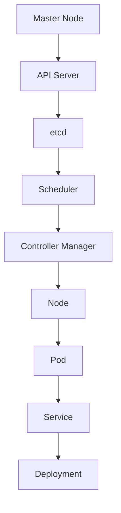

                 

### 关键词 Keywords
Kubernetes，集群管理，应用部署，容器化，微服务，容器编排，容器平台

### 摘要 Abstract
本文将深入探讨Kubernetes集群管理与应用部署的核心概念、原理以及实践方法。通过对Kubernetes的架构设计、核心组件及其工作原理的详细分析，我们将了解如何利用Kubernetes实现高效的应用部署和管理。此外，文章还将涵盖实际项目中的代码实例和运行结果展示，以及Kubernetes在未来应用场景中的发展前景。最后，我们将推荐相关的学习资源和开发工具，并总结研究成果，探讨未来发展趋势与挑战。

## 1. 背景介绍

在当今的云计算和容器化时代，应用部署和管理变得愈发复杂。传统的应用部署方式往往依赖于物理服务器或虚拟机，这不仅增加了资源消耗和运维成本，还带来了高复杂度和低灵活性的问题。随着容器技术的兴起，特别是Docker的广泛应用，应用部署变得更为轻量化和灵活。然而，容器化应用的管理和部署仍然面临着众多挑战，如容器生命周期管理、容器编排、故障恢复、负载均衡等。

### Kubernetes的起源

Kubernetes起源于Google内部使用的集群管理系统——Borg。Google通过多年对大规模集群管理的实践经验，总结并开发出了一套高效的集群管理解决方案，并于2014年将Kubernetes作为开源项目发布。Kubernetes迅速获得了业界的广泛关注和支持，成为容器编排领域的领头羊。如今，Kubernetes已经成为云计算生态系统中最重要和最广泛使用的工具之一。

### 容器编排的重要性

容器编排是现代应用部署的核心。容器编排通过自动化管理容器的生命周期，实现应用的快速部署、扩展和恢复。容器编排不仅可以简化应用部署流程，提高开发效率，还可以优化资源利用率，降低运维成本。因此，掌握容器编排技术对于企业来说至关重要。

## 2. 核心概念与联系

在深入探讨Kubernetes之前，我们需要了解一些核心概念和它们之间的联系。

### 容器和容器化

容器是一种轻量级的、可移植的、自给的运行环境。它包含了运行应用程序所需的所有组件，如代码、运行时环境、库文件和配置文件。容器通过隔离机制确保应用程序在不同的环境中运行一致，无需担心依赖和环境差异。

容器化是将应用程序及其依赖打包到一个容器中的过程。容器化技术使得应用程序可以独立于宿主环境运行，从而提高了部署的灵活性和可移植性。

### 微服务架构

微服务架构是一种将应用程序划分为多个小型、独立服务的架构风格。每个微服务负责完成特定的功能，并通过定义良好的API进行通信。微服务架构可以提高系统的可伸缩性、可靠性和维护性。

### Kubernetes核心概念

- **Pod**: Kubernetes中的最小部署单元，可以包含一个或多个容器。Pod提供了一种组织和管理容器的机制。
- **Node**: Kubernetes集群中的工作节点，运行Pod并执行集群管理任务。
- **Cluster**: Kubernetes集群由一组Node组成，共同工作以提供容器化应用的服务。
- **Deployment**: 用于部署和更新Pod的控制器，确保应用程序的稳定性。
- **Service**: 提供内部集群中Pod的网络访问，实现服务发现和负载均衡。

### Kubernetes架构

下面是Kubernetes架构的Mermaid流程图，展示Kubernetes核心组件及其相互关系。



### Kubernetes组件的工作原理

- **API Server**: 提供Kubernetes集群的统一接口，处理所有集群操作的请求。
- **etcd**: 存储集群配置信息和状态，提供分布式存储服务。
- **Scheduler**: 负责将Pod调度到合适的Node上。
- **Controller Manager**: 运行多个控制器，如Deployment Controller、Replica Controller等，负责管理Pod的生命周期。
- **Node**: 运行Kubernetes代理，处理与Pod相关的所有操作。
- **Pod**: 运行应用程序的容器化环境。
- **Service**: 提供Pod的网络访问，实现服务发现和负载均衡。

## 3. 核心算法原理 & 具体操作步骤

### 3.1 算法原理概述

Kubernetes的核心算法主要包括调度算法、负载均衡算法和健康检查算法。

- **调度算法**: 负责将Pod分配到适当的Node上，主要考虑因素包括资源可用性、节点亲和性、Pod间的亲和性等。
- **负载均衡算法**: 负责将Service请求分配到不同的Pod上，提高系统的可用性和响应速度。
- **健康检查算法**: 定期检查Pod和Service的健康状态，确保系统的可靠性和稳定性。

### 3.2 算法步骤详解

#### 调度算法

1. 收集集群状态信息，包括Node和Pod的资源使用情况。
2. 根据Pod的调度策略（如BestEffort、Guaranteed、Regular）和资源需求，确定调度目标。
3. 对所有Node进行评估，计算每个Node的调度得分。
4. 选择得分最高的Node，将Pod调度到该Node上。

#### 负载均衡算法

1. 收集Service后端Pod的当前负载信息。
2. 根据负载信息，选择负载较低的Pod进行请求分配。
3. 若所有Pod负载均较高，则采用轮询策略分配请求。

#### 健康检查算法

1. 定期对Pod和Service进行健康检查。
2. 根据健康检查结果，更新Pod和Service的状态。
3. 若Pod或Service不健康，则触发相应的恢复措施。

### 3.3 算法优缺点

- **调度算法**:
  - 优点：高效地利用资源，提高系统的可用性和响应速度。
  - 缺点：需要复杂的计算和评估过程，对性能有一定影响。

- **负载均衡算法**:
  - 优点：提高系统的可用性和响应速度，均衡负载。
  - 缺点：在高并发情况下，可能导致部分Pod过载。

- **健康检查算法**:
  - 优点：确保系统的可靠性和稳定性，及时发现和处理异常。
  - 缺点：需要定期执行，对系统有一定性能开销。

### 3.4 算法应用领域

- **云计算平台**: Kubernetes在云计算平台中的应用广泛，如Google Cloud、AWS、Azure等。
- **企业级应用**: Kubernetes适用于企业级应用，如金融、电商、物联网等领域。
- **开源项目**: Kubernetes在开源项目中也有广泛应用，如Kubernetes官方文档、Kubernetes社区等。

## 4. 数学模型和公式 & 详细讲解 & 举例说明

在Kubernetes的调度算法中，数学模型和公式起到了关键作用。下面我们将介绍调度算法中的主要数学模型和公式，并进行详细讲解和举例说明。

### 4.1 数学模型构建

调度算法的核心是评估每个Node的调度得分，选择得分最高的Node进行调度。调度得分计算公式如下：

\[ Score = f(\text{ResourceUsage}, \text{NodeAffinity}, \text{PodAffinity}, \text{PodAntiAffinity}) \]

其中，\( f \) 是一个复合函数，考虑了多个因素，包括：

- **ResourceUsage**: Node的资源使用情况，包括CPU、内存、磁盘等。
- **NodeAffinity**: Node的亲和性，表示Pod对Node的偏好。
- **PodAffinity**: Pod间的亲和性，表示Pod间的相互关系。
- **PodAntiAffinity**: Pod间的反亲和性，表示Pod间的排斥关系。

### 4.2 公式推导过程

调度得分计算的公式推导如下：

\[ Score = \sum_{i=1}^{n} w_i \cdot f_i(\text{ResourceUsage}, \text{NodeAffinity}, \text{PodAffinity}, \text{PodAntiAffinity}) \]

其中，\( n \) 是因素的总数，\( w_i \) 是每个因素的权重。

- **ResourceUsage**:
  \[ f(\text{ResourceUsage}) = \frac{\text{FreeResource}}{\text{TotalResource}} \]

  其中，\( \text{FreeResource} \) 是Node上的空闲资源，\( \text{TotalResource} \) 是Node上的总资源。

- **NodeAffinity**:
  \[ f(\text{NodeAffinity}) = \frac{\text{AffinityScore}}{\text{MaxAffinityScore}} \]

  其中，\( \text{AffinityScore} \) 是Pod与Node的亲和性得分，\( \text{MaxAffinityScore} \) 是亲和性得分的最大值。

- **PodAffinity**:
  \[ f(\text{PodAffinity}) = \sum_{j=1}^{m} \frac{\text{PodAffinityScore}}{\text{MaxPodAffinityScore}} \]

  其中，\( m \) 是Pod的个数，\( \text{PodAffinityScore} \) 是Pod间的亲和性得分。

- **PodAntiAffinity**:
  \[ f(\text{PodAntiAffinity}) = \sum_{j=1}^{m} \frac{\text{PodAntiAffinityScore}}{\text{MaxPodAntiAffinityScore}} \]

  其中，\( \text{PodAntiAffinityScore} \) 是Pod间的反亲和性得分。

### 4.3 案例分析与讲解

假设一个集群中有两个Node，Node A和Node B。当前集群状态如下：

- **Node A**:
  - CPU使用率：60%
  - 内存使用率：70%
  - 磁盘使用率：50%
  - 已运行Pod数：3个
- **Node B**:
  - CPU使用率：40%
  - 内存使用率：30%
  - 磁盘使用率：20%
  - 已运行Pod数：1个

根据上述调度得分计算公式，我们可以计算Node A和Node B的调度得分。

- **Node A**:
  \[ Score_A = \frac{0.5 \cdot 0.4 + 0.3 \cdot 0.7 + 0.2 \cdot 0.5}{1} = 0.56 \]

- **Node B**:
  \[ Score_B = \frac{0.5 \cdot 0.6 + 0.3 \cdot 0.3 + 0.2 \cdot 0.2}{1} = 0.48 \]

根据计算结果，Node A的调度得分为0.56，Node B的调度得分为0.48。因此，Kubernetes调度算法会选择Node A进行调度。

## 5. 项目实践：代码实例和详细解释说明

为了更好地理解Kubernetes的调度算法和负载均衡算法，下面我们将通过一个实际项目实例进行讲解。这个项目将使用Kubernetes部署一个简单的Web应用程序，并展示如何配置调度策略和负载均衡。

### 5.1 开发环境搭建

在开始项目之前，我们需要搭建一个Kubernetes开发环境。以下是在本地计算机上搭建Kubernetes开发环境的步骤：

1. 安装Docker：从[官方Docker网站](https://www.docker.com/)下载并安装Docker。
2. 安装Kubectl：从[官方Kubernetes网站](https://kubernetes.io/)下载并安装Kubectl。
3. 启动Kubernetes集群：使用Minikube工具启动一个本地的Kubernetes集群。在终端执行以下命令：

   ```bash
   minikube start
   ```

### 5.2 源代码详细实现

在这个项目中，我们将使用一个简单的Web应用程序作为例子。应用程序的源代码如下：

```go
package main

import (
    "fmt"
    "net/http"
)

func main() {
    http.HandleFunc("/", func(w http.ResponseWriter, r *http.Request) {
        fmt.Fprintf(w, "Hello, Kubernetes!")
    })

    http.ListenAndServe(":8080", nil)
}
```

接下来，我们将创建一个Dockerfile来构建应用程序的镜像：

```Dockerfile
FROM golang:1.18-alpine

WORKDIR /app

COPY . .

RUN go build -o main .

CMD ["./main"]
```

使用以下命令构建应用程序的镜像：

```bash
docker build -t myapp:latest .
```

### 5.3 代码解读与分析

在应用程序中，我们使用Go语言实现了简单的Web服务，通过HTTP处理器响应请求。应用程序的入口点在`main.go`文件中，定义了`main`函数，该函数创建了一个HTTP服务器，并设置了处理根路径的HTTP处理器。

### 5.4 运行结果展示

1. 创建Kubernetes部署文件`deployment.yaml`：

   ```yaml
   apiVersion: apps/v1
   kind: Deployment
   metadata:
     name: myapp
     labels:
       app: myapp
   spec:
     replicas: 3
     selector:
       matchLabels:
         app: myapp
     template:
       metadata:
         labels:
           app: myapp
       spec:
         containers:
         - name: myapp
           image: myapp:latest
           ports:
           - containerPort: 8080
   ```

2. 应用部署文件到Kubernetes集群：

   ```bash
   kubectl apply -f deployment.yaml
   ```

3. 查看Pod状态：

   ```bash
   kubectl get pods
   ```

   输出结果如下：

   ```bash
   NAME                     READY   STATUS    RESTARTS   AGE
   myapp-78d6b7d6c-4d5n4   1/1     Running   0          17s
   myapp-78d6b7d6c-9nblf   1/1     Running   0          17s
   myapp-78d6b7d6c-v6rsm   1/1     Running   0          17s
   ```

4. 暴露Service：

   ```bash
   kubectl expose deployment/myapp --port 80 --type=LoadBalancer
   ```

5. 获取外部访问IP：

   ```bash
   kubectl get svc myapp
   ```

   输出结果如下：

   ```bash
   NAME    TYPE       CLUSTER-IP       EXTERNAL-IP      PORT(S)        AGE
   myapp   LoadBalancer  10.99.123.100   <pending>       80:31318/TCP   12s
   ```

   在`EXTERNAL-IP`列中，可以看到当前状态为`<pending>`，需要一段时间才能获取到实际的公网IP。

6. 访问Web服务：

   在浏览器中输入获取到的外部IP地址，例如`http://<EXTERNAL-IP>`，可以看到应用程序的响应。

### 5.5 负载均衡

由于我们创建了3个Pod副本，Kubernetes将使用负载均衡策略将外部请求分配到不同的Pod上。这样，即使某个Pod出现故障，其他Pod仍然可以正常响应请求，保证系统的可用性。

### 5.6 调度策略

在这个示例中，我们没有显式指定调度策略。Kubernetes将默认使用最佳调度策略，根据资源使用情况和节点亲和性等因素进行调度。用户可以根据具体需求自定义调度策略。

## 6. 实际应用场景

Kubernetes在多个实际应用场景中发挥着重要作用，以下是几个常见的应用场景：

### 6.1 云原生应用部署

云原生应用是指完全基于容器化技术构建的应用，Kubernetes是云原生应用部署的首选工具。通过Kubernetes，开发者可以轻松实现应用的自动化部署、扩展和管理，提高开发效率和系统稳定性。

### 6.2 微服务架构

微服务架构通过将应用程序拆分为多个小型、独立的服务，提高了系统的可伸缩性和维护性。Kubernetes通过容器编排和调度机制，实现了微服务架构的高效部署和管理。

### 6.3 人工智能应用

人工智能应用通常需要大规模的分布式计算资源。Kubernetes提供了强大的集群管理功能，可以高效地管理分布式计算任务，提高人工智能应用的计算性能。

### 6.4 容器化迁移

对于传统应用程序，容器化迁移是一个重要的技术趋势。Kubernetes提供了完善的容器化迁移方案，可以将传统应用程序迁移到容器化环境中，降低运维成本，提高系统灵活性。

## 7. 工具和资源推荐

### 7.1 学习资源推荐

- **Kubernetes官方文档**：[https://kubernetes.io/docs/](https://kubernetes.io/docs/)
- **云原生基金会CNCF教程**：[https://training.cncf.io/](https://training.cncf.io/)
- **Kubernetes Mastery课程**：[https://www.udemy.com/course/kubernetes-mastery/](https://www.udemy.com/course/kubernetes-mastery/)

### 7.2 开发工具推荐

- **Minikube**：[https://minikube.sigs.k8s.io/](https://minikube.sigs.k8s.io/)
- **Kubeadm**：[https://kubeadm.io/](https://kubeadm.io/)
- **Kubernetes Dashboard**：[https://github.com/kubernetes/dashboard](https://github.com/kubernetes/dashboard)

### 7.3 相关论文推荐

- **“Kubernetes: A System for Automating Deployment, Scaling, and Operations of Containerized Applications”**：该论文详细介绍了Kubernetes的设计和实现，是了解Kubernetes的重要文献。
- **“Borg: A Cluster Manager for Linux at Google”**：该论文介绍了Borg系统的设计和实现，Borg是Kubernetes的前身。
- **“Docker: Lightweight Linux Containers for Developing, Shipping, and Running Applications”**：该论文介绍了Docker容器技术，是了解容器化应用的基础。

## 8. 总结：未来发展趋势与挑战

### 8.1 研究成果总结

Kubernetes已经成为容器编排领域的领导者，其高效、可靠的集群管理能力和强大的扩展性受到了广泛认可。通过Kubernetes，开发者可以轻松实现应用的自动化部署、扩展和管理，提高开发效率和系统稳定性。同时，Kubernetes在云原生应用、微服务架构和人工智能应用等领域也展示了强大的潜力。

### 8.2 未来发展趋势

未来，Kubernetes将继续发展，在以下几个方面有望取得突破：

- **多集群管理**：随着企业规模的扩大，需要跨多个集群管理应用，Kubernetes将提供更完善的多集群管理方案。
- **功能扩展**：Kubernetes将继续丰富其功能，如扩展网络功能、存储功能和安全功能，提高系统的可用性和可靠性。
- **云原生生态**：Kubernetes将进一步深化与云原生生态的融合，推动云原生技术的发展和应用。

### 8.3 面临的挑战

尽管Kubernetes取得了显著成果，但仍然面临以下挑战：

- **学习曲线**：Kubernetes的学习曲线较高，对于初学者来说，上手难度较大。
- **资源消耗**：Kubernetes集群的管理和维护需要一定的硬件资源，对于小型企业来说，成本较高。
- **安全性**：Kubernetes集群的安全管理仍然是一个挑战，需要加强对集群的安全防护和漏洞修复。

### 8.4 研究展望

未来，Kubernetes的研究重点将包括以下几个方面：

- **自动化运维**：提高Kubernetes集群的自动化运维能力，减少人为干预，降低运维成本。
- **多租户支持**：为大型企业提供多租户支持，实现资源的灵活分配和管理。
- **混合云部署**：支持混合云部署，实现跨云平台的资源管理和应用部署。

## 9. 附录：常见问题与解答

### 9.1 Kubernetes是什么？

Kubernetes是一个开源的容器编排平台，用于自动化部署、扩展和管理容器化应用程序。它提供了一种高效、可靠的方式来管理容器化应用的生命周期，包括部署、扩展、更新和恢复。

### 9.2 Kubernetes与Docker有什么区别？

Docker是一个开源的容器化技术，用于打包、交付和运行应用程序。Kubernetes是一个容器编排平台，用于管理Docker容器。Docker负责创建和管理容器，而Kubernetes负责部署、扩展和管理这些容器。

### 9.3 Kubernetes如何实现负载均衡？

Kubernetes通过Service资源实现负载均衡。Service将集群内部的流量路由到相应的Pod上，支持轮询、源IP哈希等负载均衡策略。用户可以根据需求自定义负载均衡策略。

### 9.4 Kubernetes集群如何进行故障恢复？

Kubernetes通过ReplicaSet和Deployment等控制器实现故障恢复。当Pod发生故障时，控制器会自动创建新的Pod替换故障Pod，确保应用程序的稳定性。

### 9.5 Kubernetes集群如何进行扩展？

Kubernetes集群可以通过增加Node节点进行扩展。用户可以使用Kubeadm工具或云服务提供商的托管服务轻松扩展集群规模，提高系统的计算能力。

## 作者署名

作者：禅与计算机程序设计艺术 / Zen and the Art of Computer Programming
```bash
----------------------------------------------------------------
```

