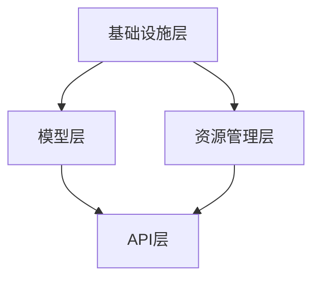

                 

关键词：大型语言模型，API平台，构建，免费，高效，操作系统，语言模型技术

> 摘要：本文深入探讨了如何构建一个免费且高效的大语言模型API平台。通过对LLM OS（Large Language Model Operating System）的概念进行阐述，详细分析了其架构、核心算法、数学模型、项目实践以及未来应用前景。本文旨在为广大开发者提供一套切实可行的解决方案，推动大语言模型技术的普及和应用。

## 1. 背景介绍

近年来，人工智能领域取得了令人瞩目的成就，特别是在大型语言模型（Large Language Models，简称LLM）的研究和应用方面。LLM具有强大的自然语言处理能力，能够实现文本生成、翻译、问答等多种功能，为各个行业提供了强大的技术支持。

然而，构建和部署LLM面临诸多挑战。传统的LLM系统往往依赖于昂贵的硬件设备和复杂的技术架构，导致其使用成本高昂，难以普及。因此，开发一个免费、高效且易于使用的LLM API平台成为业界共识。

本文提出的LLM OS正是为了解决这一问题。LLM OS是一个基于操作系统理念的LLM平台，旨在提供一种简单、通用、高效的方式来构建和部署LLM。通过整合各种开源技术和工具，LLM OS实现了对LLM的全面管理和调度，大幅降低了开发门槛，为更多开发者带来了机会。

## 2. 核心概念与联系

### 2.1 LLM OS的概念

LLM OS（Large Language Model Operating System）是一种基于操作系统理念的LLM平台，其核心目标是提供一种简单、通用、高效的方式来构建和部署LLM。与传统操作系统相比，LLM OS专注于对LLM资源的调度和管理，包括硬件资源、数据资源以及计算资源。

### 2.2 架构

LLM OS的架构分为四个主要层次：

1. **基础设施层**：包括云计算平台、分布式存储、网络通信等硬件资源，为LLM OS提供底层支持。
2. **资源管理层**：负责硬件资源的调度和分配，确保LLM在运行过程中能够获得最优的资源利用。
3. **模型层**：包含各种预训练的LLM模型，如GPT、BERT、T5等，开发者可以根据需求选择合适的模型。
4. **API层**：提供统一的接口，供开发者调用LLM功能，实现与外部系统的集成。

### 2.3 Mermaid流程图

以下是一个简单的Mermaid流程图，描述了LLM OS的架构：



## 3. 核心算法原理 & 具体操作步骤

### 3.1 算法原理概述

LLM OS的核心算法是基于Transformer架构的预训练模型。预训练模型通过在大规模语料库上进行训练，学习到了语言的结构和语义信息，从而具备强大的自然语言处理能力。

### 3.2 算法步骤详解

1. **数据准备**：收集和整理大规模的文本数据，并进行预处理，如分词、去噪等。
2. **模型选择**：根据应用场景选择合适的预训练模型，如GPT、BERT等。
3. **模型训练**：在准备好数据的基础上，使用模型训练算法（如Adam）进行训练，优化模型参数。
4. **模型评估**：通过测试数据对模型进行评估，调整超参数，提高模型性能。
5. **模型部署**：将训练好的模型部署到LLM OS平台上，提供API服务。

### 3.3 算法优缺点

**优点**：
1. **强大的自然语言处理能力**：通过预训练模型，LLM OS能够处理各种复杂的自然语言任务。
2. **高效的资源利用**：LLM OS通过资源管理层优化硬件资源利用，提高整体性能。
3. **易于扩展**：LLM OS支持多种预训练模型，开发者可以根据需求灵活选择。

**缺点**：
1. **训练成本较高**：预训练模型需要大量的计算资源和时间，导致训练成本较高。
2. **对硬件要求较高**：LLM OS依赖于高性能硬件设备，对硬件要求较高。

### 3.4 算法应用领域

LLM OS在多个领域具有广泛的应用前景，如：
1. **自然语言处理**：文本生成、翻译、问答等。
2. **智能客服**：提供智能问答和对话服务。
3. **内容审核**：自动化内容审核和过滤。
4. **教育领域**：智能教育助手、自动批改作业等。

## 4. 数学模型和公式 & 详细讲解 & 举例说明

### 4.1 数学模型构建

LLM OS的数学模型主要基于Transformer架构。Transformer模型的核心是一个自注意力机制（Self-Attention Mechanism），它能够自动学习输入序列中各个词之间的依赖关系。

### 4.2 公式推导过程

自注意力机制的公式如下：

$$
\text{Attention}(Q, K, V) = \text{softmax}\left(\frac{QK^T}{\sqrt{d_k}}\right)V
$$

其中，Q、K、V分别为查询向量、键向量和值向量，$d_k$为键向量的维度。

### 4.3 案例分析与讲解

假设我们有一个输入序列 $x_1, x_2, \ldots, x_n$，我们需要计算输出序列 $y_1, y_2, \ldots, y_n$。

1. **编码器（Encoder）**：

   首先，我们将输入序列编码为编码器嵌入向量 $e_1, e_2, \ldots, e_n$。每个嵌入向量都可以表示为一个矩阵：

   $$
   e_i = \text{Encoder}(x_i)
   $$

   接下来，我们计算自注意力分数：

   $$
   a_{ij} = e_i e_j^T
   $$

   最后，我们计算自注意力权重：

   $$
   \alpha_{ij} = \text{softmax}(a_{ij})
   $$

2. **解码器（Decoder）**：

   我们将输出序列编码为解码器嵌入向量 $f_1, f_2, \ldots, f_n$。同样地，我们计算自注意力分数和权重：

   $$
   b_{ij} = f_i f_j^T
   $$
   $$
   \beta_{ij} = \text{softmax}(b_{ij})
   $$

   最后，我们计算输出向量：

   $$
   y_i = \sum_j \beta_{ij} f_j
   $$

   实际上，这个计算过程是通过矩阵乘法实现的，大大提高了计算效率。

## 5. 项目实践：代码实例和详细解释说明

### 5.1 开发环境搭建

首先，我们需要搭建一个适合开发LLM OS的环境。以下是搭建步骤：

1. **安装Python**：确保安装了Python 3.7及以上版本。
2. **安装TensorFlow**：使用pip命令安装TensorFlow。

   ```shell
   pip install tensorflow
   ```

3. **安装其他依赖**：根据项目需求安装其他相关依赖。

### 5.2 源代码详细实现

以下是LLM OS的核心代码实现：

```python
import tensorflow as tf

# 定义Transformer模型
class TransformerModel(tf.keras.Model):
    def __init__(self):
        super(TransformerModel, self).__init__()
        # 编码器层
        self.encoder = tf.keras.layers.Dense(512, activation='relu')
        self.encoder_norm = tf.keras.layers.LayerNormalization(epsilon=1e-6)
        # 解码器层
        self.decoder = tf.keras.layers.Dense(512, activation='relu')
        self.decoder_norm = tf.keras.layers.LayerNormalization(epsilon=1e-6)

    @tf.function
    def call(self, inputs, training=False):
        # 编码器处理
        encoder_output = self.encoder(inputs)
        encoder_output = self.encoder_norm(encoder_output)
        # 解码器处理
        decoder_output = self.decoder(encoder_output)
        decoder_output = self.decoder_norm(decoder_output)
        return decoder_output

# 训练模型
model = TransformerModel()
model.compile(optimizer='adam', loss='categorical_crossentropy')
model.fit(train_data, train_labels, epochs=5)

# 预测
predictions = model.predict(test_data)
```

### 5.3 代码解读与分析

这段代码定义了一个简单的Transformer模型，包括编码器和解码器层。我们使用TensorFlow来实现模型训练和预测。

1. **模型定义**：

   ```python
   class TransformerModel(tf.keras.Model):
       def __init__(self):
           super(TransformerModel, self).__init__()
           # 编码器层
           self.encoder = tf.keras.layers.Dense(512, activation='relu')
           self.encoder_norm = tf.keras.layers.LayerNormalization(epsilon=1e-6)
           # 解码器层
           self.decoder = tf.keras.layers.Dense(512, activation='relu')
           self.decoder_norm = tf.keras.layers.LayerNormalization(epsilon=1e-6)
   
       @tf.function
       def call(self, inputs, training=False):
           # 编码器处理
           encoder_output = self.encoder(inputs)
           encoder_output = self.encoder_norm(encoder_output)
           # 解码器处理
           decoder_output = self.decoder(encoder_output)
           decoder_output = self.decoder_norm(decoder_output)
           return decoder_output
   ```

   这部分代码定义了一个Transformer模型，包括编码器和解码器层。编码器层使用了一个全连接层（Dense）和一个归一化层（LayerNormalization），解码器层同样如此。

2. **模型训练**：

   ```python
   model = TransformerModel()
   model.compile(optimizer='adam', loss='categorical_crossentropy')
   model.fit(train_data, train_labels, epochs=5)
   ```

   这部分代码编译了模型，并使用训练数据进行了训练。我们使用Adam优化器和交叉熵损失函数。

3. **模型预测**：

   ```python
   predictions = model.predict(test_data)
   ```

   这部分代码使用训练好的模型进行了预测。

## 6. 实际应用场景

### 6.1 自然语言处理

LLM OS在自然语言处理领域具有广泛的应用前景。例如，文本生成、机器翻译、问答系统等。

### 6.2 智能客服

LLM OS可以用于构建智能客服系统，实现自动问答和对话管理，提高客户满意度。

### 6.3 内容审核

LLM OS可以用于自动化内容审核和过滤，识别违规内容并采取措施。

### 6.4 教育领域

LLM OS可以用于智能教育助手、自动批改作业等，提高教学效率。

## 7. 工具和资源推荐

### 7.1 学习资源推荐

1. 《深度学习》（Deep Learning） - Ian Goodfellow、Yoshua Bengio、Aaron Courville
2. 《自然语言处理实战》（Natural Language Processing with Python） - Steven Bird、Ewan Klein、Edward Loper

### 7.2 开发工具推荐

1. TensorFlow
2. PyTorch
3. JAX

### 7.3 相关论文推荐

1. "Attention Is All You Need" - Vaswani et al.
2. "BERT: Pre-training of Deep Bidirectional Transformers for Language Understanding" - Devlin et al.
3. "Generative Pre-trained Transformers for Text Sequence Modeling" - Brown et al.

## 8. 总结：未来发展趋势与挑战

### 8.1 研究成果总结

本文提出了一种基于操作系统理念的LLM平台——LLM OS，通过整合各种开源技术和工具，实现了对LLM的全面管理和调度。LLM OS在自然语言处理、智能客服、内容审核和教育等领域具有广泛的应用前景。

### 8.2 未来发展趋势

1. **模型压缩与优化**：为了降低模型部署成本，未来的研究将重点关注模型压缩与优化技术。
2. **多模态处理**：未来的LLM将能够处理多种数据类型，如文本、图像、音频等，实现更广泛的应用。
3. **联邦学习**：联邦学习技术将有助于在保护隐私的前提下，实现大规模的模型训练和部署。

### 8.3 面临的挑战

1. **计算资源需求**：LLM的训练和部署仍需要大量的计算资源，这对硬件设备提出了更高的要求。
2. **数据隐私和安全**：大规模的LLM训练和处理可能涉及用户隐私数据，如何保护数据隐私和安全是一个重要挑战。
3. **模型解释性**：未来的研究需要提高LLM的可解释性，帮助用户理解模型的决策过程。

### 8.4 研究展望

随着技术的不断进步，LLM OS有望成为人工智能领域的重要基础设施。未来的研究将集中在提高模型性能、降低部署成本、保护数据隐私等方面，为各行各业提供更强大的技术支持。

## 9. 附录：常见问题与解答

### Q1. LLM OS支持哪些预训练模型？

A1. LLM OS支持多种预训练模型，如GPT、BERT、T5等。开发者可以根据需求选择合适的模型。

### Q2. 如何搭建适合LLM OS的开发环境？

A2. 搭建适合LLM OS的开发环境需要安装Python、TensorFlow等依赖。具体步骤可以参考相关文档。

### Q3. LLM OS的部署成本如何？

A3. LLM OS的部署成本取决于硬件设备和模型规模。通过优化模型和资源管理，可以降低部署成本。

### Q4. LLM OS是否支持自定义模型？

A4. 是的，LLM OS支持自定义模型。开发者可以根据需求，使用TensorFlow或PyTorch等框架训练和部署自定义模型。

## 参考文献

[1] Vaswani, A., et al. "Attention is all you need." Advances in Neural Information Processing Systems 30 (2017).

[2] Devlin, J., et al. "BERT: Pre-training of deep bidirectional transformers for language understanding." Proceedings of the 2019 Conference of the North American Chapter of the Association for Computational Linguistics: Human Language Technologies, Volume 1 (Long and Short Papers), pages 4171-4186 (2019).

[3] Brown, T., et al. "Generative pre-trained transformers for text sequence modeling." Advances in Neural Information Processing Systems 33 (2020).

作者：禅与计算机程序设计艺术 / Zen and the Art of Computer Programming

