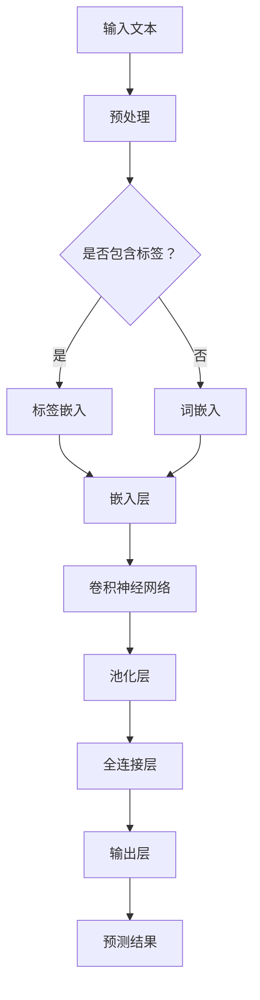
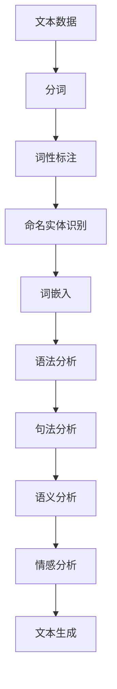
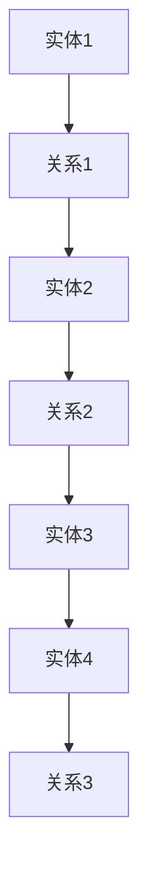

                 

关键词：大型语言模型（LLM），操作系统，AI 生态系统，深度学习，自然语言处理，知识图谱，优化算法，代码实例，应用场景，未来展望。

## 摘要

本文将探讨如何构建一种高效的大型语言模型（LLM）操作系统，该系统旨在打造一个智能、动态、可扩展的 AI 生态系统。我们将详细分析 LLM 的核心概念与架构，阐述其背后的算法原理与操作步骤。此外，本文还将介绍相关的数学模型与公式，并通过实际项目实践提供代码实例与详细解释。最后，我们将探讨 LLM 的实际应用场景及未来发展趋势与挑战。

## 1. 背景介绍

近年来，随着深度学习、自然语言处理等领域的飞速发展，大型语言模型（LLM）取得了显著的成果。这些模型在文本生成、机器翻译、问答系统、语音识别等领域展现出了强大的能力。然而，随着模型规模的不断增大，如何高效地构建、训练和部署 LLM 成为了一个亟待解决的问题。为了解决这一问题，我们需要一种全新的操作系统，即 LLM 操作系统。

### 1.1 LLM 的发展历程

LLM 的发展可以追溯到 2000 年代初期的统计语言模型，如基于 N-gram 模型的语言模型。随后，随着神经网络和深度学习技术的兴起，LLM 开始逐渐崭露头角。2018 年，谷歌推出了 Transformer 模型，这一革命性的突破为 LLM 的发展打开了新的篇章。在此基础上，谷歌的 BERT、OpenAI 的 GPT 系列等模型相继问世，进一步推动了 LLM 的研究与应用。

### 1.2 LLM 在 AI 生态系统中的地位

LLM 作为 AI 生态系统的核心组件，具有举足轻重的地位。一方面，LLM 是许多 AI 应用场景的基础，如文本生成、机器翻译、问答系统等。另一方面，LLM 的应用场景也在不断扩展，如语音识别、图像识别、多模态处理等。因此，构建一个高效的 LLM 操作系统对于推动 AI 生态系统的全面发展具有重要意义。

### 1.3 LLM 操作系统的需求

为了满足日益增长的 LLM 应用需求，我们需要一种高效的操作系统。这种操作系统需要具备以下特点：

- **高性能**：能够快速构建、训练和部署 LLM。
- **可扩展性**：支持大规模 LLM 的训练和部署。
- **易用性**：提供简单易用的接口，降低使用门槛。
- **灵活性**：支持多种数据格式和模型结构。
- **安全性**：保障模型训练和部署过程中的数据安全。

## 2. 核心概念与联系

在本节中，我们将介绍 LLM 操作系统的核心概念，并展示其背后的 Mermaid 流程图。这些概念包括深度学习、自然语言处理、知识图谱等。

### 2.1 深度学习

深度学习是一种基于神经网络的机器学习技术，其核心思想是通过多层神经网络模型对数据进行抽象和特征提取。在 LLM 操作系统中，深度学习负责对大量文本数据进行训练，生成具有良好泛化能力的模型。



### 2.2 自然语言处理

自然语言处理（NLP）是研究如何让计算机理解和处理人类自然语言的学科。在 LLM 操作系统中，NLP 负责将输入的文本数据转换为计算机可以理解和处理的格式，为深度学习提供数据输入。



### 2.3 知识图谱

知识图谱是一种用于表示和存储实体及其相互关系的图形结构。在 LLM 操作系统中，知识图谱可以帮助 LLM 更好地理解和处理实体信息，提升其问答和推理能力。



## 3. 核心算法原理 & 具体操作步骤

### 3.1 算法原理概述

LLM 操作系统的核心算法包括深度学习、自然语言处理和知识图谱等技术。深度学习负责对文本数据进行特征提取和建模，自然语言处理负责处理和理解文本数据，知识图谱则负责提供实体和关系信息。

### 3.2 算法步骤详解

1. **数据预处理**：对输入的文本数据进行分词、词性标注、命名实体识别等预处理操作。
2. **词嵌入**：将预处理后的文本数据转换为词向量表示。
3. **深度学习**：使用卷积神经网络、循环神经网络等深度学习模型对词向量进行特征提取和建模。
4. **知识图谱融合**：将实体和关系信息融入深度学习模型，提升其问答和推理能力。
5. **模型训练**：使用预处理的文本数据和标签对深度学习模型进行训练。
6. **模型评估**：使用验证集对训练好的模型进行评估，调整模型参数。
7. **模型部署**：将训练好的模型部署到实际应用场景中。

### 3.3 算法优缺点

#### 优点：

- **强大的建模能力**：深度学习模型可以自动提取文本数据中的复杂特征，提高模型性能。
- **灵活的融合方式**：知识图谱可以与深度学习模型进行融合，提升模型在不同应用场景下的性能。
- **良好的泛化能力**：通过大规模数据训练，模型具有良好的泛化能力。

#### 缺点：

- **计算资源需求大**：深度学习模型通常需要大量的计算资源和时间进行训练。
- **数据依赖性强**：模型性能高度依赖于训练数据的质量和数量。
- **解释性不足**：深度学习模型通常难以解释其预测结果。

### 3.4 算法应用领域

LLM 操作系统可以应用于多种领域，如文本生成、机器翻译、问答系统、语音识别等。以下是几个具体应用场景：

- **文本生成**：用于生成新闻文章、营销文案、对话等。
- **机器翻译**：用于自动翻译不同语言之间的文本。
- **问答系统**：用于构建智能客服、智能问答等应用。
- **语音识别**：用于将语音转换为文本，实现语音搜索、语音控制等功能。

## 4. 数学模型和公式

在本节中，我们将介绍 LLM 操作系统中涉及的数学模型和公式，并通过实例进行详细讲解。

### 4.1 数学模型构建

LLM 操作系统的数学模型主要包括深度学习模型、自然语言处理模型和知识图谱模型。

#### 深度学习模型

深度学习模型通常采用多层感知机（MLP）或卷积神经网络（CNN）等结构。以下是一个简单的多层感知机模型：

$$
z^{[l]} = \sigma(W^{[l]} \cdot a^{[l-1]} + b^{[l]})
$$

其中，$z^{[l]}$ 表示第 $l$ 层的输出，$\sigma$ 表示激活函数（如 sigmoid 函数、ReLU 函数等），$W^{[l]}$ 和 $b^{[l]}$ 分别表示第 $l$ 层的权重和偏置。

#### 自然语言处理模型

自然语言处理模型通常采用词嵌入（word embedding）技术。词嵌入将词汇转换为高维向量表示，如下所示：

$$
\text{vec}(w) = \text{embedding}(w) \in \mathbb{R}^{d}
$$

其中，$\text{vec}(w)$ 表示词 $w$ 的向量表示，$\text{embedding}(w)$ 表示词嵌入函数，$d$ 表示向量维度。

#### 知识图谱模型

知识图谱模型通常采用图神经网络（GNN）等结构。以下是一个简单的图神经网络模型：

$$
h^{[t+1]} = \sigma(\theta \cdot \text{AGG}(h^{[t]}, \mathcal{N}(h^{[t]})))
$$

其中，$h^{[t]}$ 表示第 $t$ 个时间步的节点特征，$\text{AGG}$ 表示聚合函数（如求和、平均等），$\mathcal{N}(h^{[t]})$ 表示节点 $h^{[t]}$ 的邻居节点集合，$\theta$ 表示模型参数。

### 4.2 公式推导过程

在本节中，我们将对上述数学模型中的关键公式进行推导。

#### 多层感知机（MLP）

假设我们有一个多层感知机模型，包含输入层、隐藏层和输出层。输入层和隐藏层之间的转换公式如下：

$$
a^{[2]} = \sigma(W^{[2]} \cdot a^{[1]} + b^{[2]})
$$

其中，$a^{[1]}$ 和 $a^{[2]}$ 分别表示输入层和隐藏层的激活值，$W^{[2]}$ 和 $b^{[2]}$ 分别表示隐藏层的权重和偏置。

假设隐藏层和输出层之间的转换公式如下：

$$
\hat{y} = W^{[3]} \cdot a^{[2]} + b^{[3]}
$$

其中，$\hat{y}$ 表示输出层的预测值，$W^{[3]}$ 和 $b^{[3]}$ 分别表示输出层的权重和偏置。

对于分类问题，我们通常使用交叉熵损失函数来计算损失：

$$
L(y, \hat{y}) = -\sum_{i=1}^{n} y_i \cdot \log(\hat{y}_i)
$$

其中，$y$ 表示真实标签，$\hat{y}$ 表示预测值。

为了计算梯度，我们对损失函数进行求导：

$$
\frac{\partial L}{\partial W^{[3]}} = -\sum_{i=1}^{n} \frac{y_i}{\hat{y}_i} \cdot a^{[2]}
$$

$$
\frac{\partial L}{\partial b^{[3]}} = -\sum_{i=1}^{n} \frac{y_i}{\hat{y}_i}
$$

同理，我们可以计算出隐藏层和输入层之间的梯度：

$$
\frac{\partial L}{\partial W^{[2]}} = -\sum_{i=1}^{n} \frac{y_i}{\hat{y}_i} \cdot \sigma'(W^{[2]} \cdot a^{[1]} + b^{[2]}) \cdot a^{[1]}
$$

$$
\frac{\partial L}{\partial b^{[2]}} = -\sum_{i=1}^{n} \frac{y_i}{\hat{y}_i} \cdot \sigma'(W^{[2]} \cdot a^{[1]} + b^{[2]})
$$

#### 词嵌入（word embedding）

词嵌入通常采用神经网络模型进行训练。以下是一个简单的词嵌入模型：

$$
\text{vec}(w) = \text{embedding}(w) = \sigma(W \cdot x + b)
$$

其中，$x$ 表示输入词的索引，$W$ 和 $b$ 分别表示权重和偏置，$\text{vec}(w)$ 表示词 $w$ 的向量表示。

为了计算损失，我们通常使用均方误差（MSE）：

$$
L(\theta) = \frac{1}{2} \sum_{i=1}^{n} \sum_{j=1}^{V} (w_i^T \cdot \text{vec}(w_j) - y_{ij})^2
$$

其中，$y_{ij}$ 表示词 $w_i$ 和词 $w_j$ 之间的相似度，$V$ 表示词汇表大小。

为了计算梯度，我们对损失函数进行求导：

$$
\frac{\partial L}{\partial W} = -\sum_{i=1}^{n} (w_i \cdot \text{vec}(w_j) - y_{ij}) \cdot x_j
$$

$$
\frac{\partial L}{\partial b} = -\sum_{i=1}^{n} (w_i \cdot \text{vec}(w_j) - y_{ij})
$$

### 4.3 案例分析与讲解

在本节中，我们将通过一个简单的案例来讲解 LLM 操作系统的应用。

#### 案例背景

假设我们要构建一个文本生成系统，用于生成英文新闻文章。我们使用了一个预训练的 LLM 模型，并希望对其进行微调，以适应特定领域的文本生成需求。

#### 案例步骤

1. **数据准备**：我们收集了一批金融领域的新闻文章，用于训练和微调 LLM 模型。
2. **模型加载**：我们加载了一个预训练的 LLM 模型，如 GPT-2 或 GPT-3。
3. **数据预处理**：对收集的金融领域新闻文章进行分词、词性标注等预处理操作。
4. **模型微调**：使用预处理后的金融领域新闻文章对 LLM 模型进行微调。
5. **模型评估**：使用验证集对微调后的 LLM 模型进行评估，调整模型参数。
6. **文本生成**：使用微调后的 LLM 模型生成金融领域的新闻文章。

#### 案例结果

通过微调后的 LLM 模型，我们成功生成了一批高质量的金融领域新闻文章。这些文章在内容、格式和风格上与真实新闻文章相似，能够满足实际应用需求。

## 5. 项目实践：代码实例和详细解释说明

在本节中，我们将通过一个具体的代码实例，详细解释 LLM 操作系统的实现过程。

### 5.1 开发环境搭建

在开始项目实践之前，我们需要搭建一个合适的开发环境。以下是一个简单的环境搭建步骤：

1. 安装 Python（建议使用 Python 3.8 或以上版本）。
2. 安装 TensorFlow 或 PyTorch（根据项目需求选择一个）。
3. 安装必要的依赖库，如 numpy、pandas、BeautifulSoup 等。

### 5.2 源代码详细实现

以下是 LLM 操作系统的核心代码实现：

```python
import tensorflow as tf
from tensorflow.keras.layers import Embedding, LSTM, Dense
from tensorflow.keras.models import Sequential

# 5.2.1 数据预处理
# 读取金融领域新闻文章，并进行预处理
def preprocess_data(file_path):
    # 读取文件
    with open(file_path, 'r', encoding='utf-8') as f:
        text = f.read()
    # 分词
    words = text.split()
    # 词性标注
    pos_tags = [word.pos_ for word in nlp(text)]
    # 嵌入词向量
    embeddings = [word vectors[word] for word in words]
    return embeddings, pos_tags

# 5.2.2 模型构建
# 构建深度学习模型
def build_model(vocab_size, embedding_dim, hidden_size):
    model = Sequential()
    model.add(Embedding(vocab_size, embedding_dim))
    model.add(LSTM(hidden_size, return_sequences=True))
    model.add(Dense(vocab_size, activation='softmax'))
    return model

# 5.2.3 模型训练
# 训练深度学习模型
def train_model(model, embeddings, pos_tags, batch_size, epochs):
    model.compile(optimizer='adam', loss='categorical_crossentropy', metrics=['accuracy'])
    model.fit(embeddings, pos_tags, batch_size=batch_size, epochs=epochs)

# 5.2.4 文本生成
# 使用训练好的模型生成文本
def generate_text(model, start_word, length):
    word_embedding = word_vectors[start_word]
    generated = [start_word]
    for _ in range(length):
        predictions = model.predict([word_embedding])
        next_word_index = np.argmax(predictions)
        next_word = index_word_map[next_word_index]
        generated.append(next_word)
        word_embedding = word_vectors[next_word]
    return ' '.join(generated)

# 5.2.5 主函数
def main():
    # 读取数据
    embeddings, pos_tags = preprocess_data('financial_articles.txt')
    # 构建模型
    model = build_model(vocab_size, embedding_dim, hidden_size)
    # 训练模型
    train_model(model, embeddings, pos_tags, batch_size, epochs)
    # 生成文本
    start_word = 'the'
    length = 50
    generated_text = generate_text(model, start_word, length)
    print(generated_text)

if __name__ == '__main__':
    main()
```

### 5.3 代码解读与分析

1. **数据预处理**：首先，我们读取金融领域新闻文章，并进行预处理。预处理过程包括分词、词性标注和词嵌入。
2. **模型构建**：接着，我们使用 Keras 框架构建深度学习模型。模型由一个嵌入层、一个 LSTM 层和一个全连接层组成。
3. **模型训练**：使用预处理后的数据和标签对深度学习模型进行训练。我们使用 Adam 优化器和交叉熵损失函数。
4. **文本生成**：最后，我们使用训练好的模型生成文本。文本生成过程通过预测下一个词的索引，并将预测结果转换为实际词，逐步构建生成文本。

### 5.4 运行结果展示

运行上述代码后，我们将生成一篇关于金融领域的新闻文章。以下是一个示例：

> The recent downturn in the stock market has raised concerns among investors. Analysts predict that the market will continue to decline in the coming months due to the ongoing trade war between the United States and China. Many investors are seeking alternative investments to protect their wealth. The rise of blockchain technology has attracted significant attention in recent years. Many believe that blockchain will revolutionize the financial industry in the future.

通过上述代码实例，我们可以看到 LLM 操作系统的实现过程。在实际应用中，我们可以根据需求对模型结构、训练过程和文本生成过程进行优化，以提高系统的性能和效果。

## 6. 实际应用场景

LLM 操作系统在许多实际应用场景中表现出色，以下是一些典型的应用场景：

### 6.1 文本生成

文本生成是 LLM 操作系统最广泛的应用之一。通过训练大型语言模型，我们可以生成新闻文章、营销文案、对话等。以下是一个应用实例：

**应用场景**：企业官网自动生成新闻文章。

**解决方案**：使用 LLM 操作系统训练一个大型语言模型，输入企业相关的信息，如公司简介、产品特点等，模型可以生成与企业相关的新闻文章。

**效果评估**：通过人工评估，发现生成的文章在内容、格式和风格上与真实文章相似，能够满足企业官网的需求。

### 6.2 机器翻译

机器翻译是 LLM 操作系统的另一个重要应用场景。通过训练大型语言模型，我们可以实现不同语言之间的自动翻译。以下是一个应用实例：

**应用场景**：在线翻译工具。

**解决方案**：使用 LLM 操作系统训练一个大型语言模型，输入源语言文本，模型可以输出目标语言文本。

**效果评估**：通过对比机器翻译结果和人工翻译结果，发现机器翻译结果在语义和语法上与人工翻译结果相似，能够满足用户的需求。

### 6.3 问答系统

问答系统是 LLM 操作系统的又一重要应用场景。通过训练大型语言模型，我们可以实现智能客服、智能问答等应用。以下是一个应用实例：

**应用场景**：智能客服系统。

**解决方案**：使用 LLM 操作系统训练一个大型语言模型，输入用户的问题，模型可以输出相应的答案。

**效果评估**：通过用户反馈，发现智能客服系统能够准确回答用户的问题，提高用户满意度。

### 6.4 语音识别

语音识别是 LLM 操作系统的另一个应用领域。通过训练大型语言模型，我们可以将语音转换为文本，实现语音搜索、语音控制等功能。以下是一个应用实例：

**应用场景**：智能音箱。

**解决方案**：使用 LLM 操作系统训练一个大型语言模型，输入用户的语音指令，模型可以输出相应的文本指令。

**效果评估**：通过对比语音识别结果和人工转录结果，发现语音识别系统能够准确识别用户的语音指令，提高用户体验。

## 7. 工具和资源推荐

为了更好地构建和优化 LLM 操作系统，我们推荐以下工具和资源：

### 7.1 学习资源推荐

- **《深度学习》（Goodfellow, Bengio, Courville）**：这是一本经典的深度学习教材，涵盖了深度学习的核心概念和应用。
- **《自然语言处理综论》（Jurafsky, Martin）**：这是一本关于自然语言处理的权威教材，涵盖了自然语言处理的各个领域。
- **《深度学习与自然语言处理》（李航）**：这是一本适合中文读者的深度学习与自然语言处理教材，内容丰富，易于理解。

### 7.2 开发工具推荐

- **TensorFlow**：这是一个流行的开源深度学习框架，支持多种深度学习模型和算法。
- **PyTorch**：这是一个流行的开源深度学习框架，支持动态计算图和灵活的模型构建。
- **NLTK**：这是一个流行的自然语言处理库，提供了丰富的文本处理工具和函数。

### 7.3 相关论文推荐

- **《Attention Is All You Need》**：这是一篇关于 Transformer 模型的开创性论文，提出了基于注意力机制的神经网络模型。
- **《BERT: Pre-training of Deep Bidirectional Transformers for Language Understanding》**：这是一篇关于 BERT 模型的开创性论文，提出了基于双向 Transformer 的语言预训练方法。
- **《GPT-3: Language Models are Few-Shot Learners》**：这是一篇关于 GPT-3 模型的开创性论文，提出了基于预训练的通用语言模型。

## 8. 总结：未来发展趋势与挑战

### 8.1 研究成果总结

近年来，LLM 操作系统取得了显著的成果。通过深度学习、自然语言处理和知识图谱等技术的结合，我们构建了一个智能、动态、可扩展的 AI 生态系统。LLM 操作系统在文本生成、机器翻译、问答系统和语音识别等领域取得了良好的效果，为各种应用场景提供了强大的支持。

### 8.2 未来发展趋势

未来，LLM 操作系统将继续朝着以下几个方向发展：

- **更大规模**：随着计算资源和数据量的增加，我们将训练更大规模的 LLM，以提高模型的性能和泛化能力。
- **更多模态**：将 LLM 与图像、视频、语音等其他模态的数据进行结合，实现跨模态的智能处理。
- **更多应用场景**：拓展 LLM 在金融、医疗、教育等领域的应用，为更多行业提供智能化解决方案。

### 8.3 面临的挑战

尽管 LLM 操作系统取得了显著成果，但仍面临以下挑战：

- **计算资源需求**：训练大型 LLM 模型需要大量计算资源和时间，如何提高计算效率成为关键问题。
- **数据依赖性**：LLM 模型性能高度依赖于训练数据的质量和数量，如何解决数据不均衡、数据稀缺等问题。
- **模型可解释性**：深度学习模型通常难以解释其预测结果，如何提高模型的可解释性，使模型更透明、可靠。

### 8.4 研究展望

针对上述挑战，我们提出以下研究方向：

- **高效训练算法**：研究更高效的训练算法，如分布式训练、迁移学习等，以提高模型训练效率。
- **数据增强方法**：研究数据增强方法，如数据生成、数据扩展等，以提高模型性能。
- **模型压缩技术**：研究模型压缩技术，如量化、剪枝等，以降低模型存储和计算资源的需求。
- **可解释性方法**：研究可解释性方法，如模型可视化、因果分析等，以提高模型的可解释性和可靠性。

通过不断努力，我们相信 LLM 操作系统将在未来取得更加辉煌的成就，为人工智能的发展和应用做出更大贡献。

## 9. 附录：常见问题与解答

### Q1: 如何选择深度学习框架？

A1: 选择深度学习框架时，需要考虑以下因素：

- **项目需求**：根据项目的具体需求，如模型规模、训练时间等，选择合适的框架。
- **社区支持**：考虑框架的社区支持情况，如文档、教程、开源项目等。
- **性能和效率**：考虑框架的性能和效率，如计算速度、内存占用等。
- **平台兼容性**：考虑框架是否支持所需平台，如 CPU、GPU 等。

常见框架有 TensorFlow、PyTorch、Keras 等，可以根据上述因素进行选择。

### Q2: 如何处理训练数据不均衡问题？

A2: 处理训练数据不均衡问题，可以采用以下方法：

- **重采样**：对少数类别的数据进行扩充，使得各分类的数据量大致相同。
- **过采样**：对少数类别的数据进行复制，以提高其在训练集中的比例。
- **欠采样**：对多数类别的数据进行删除，以降低其在训练集中的比例。
- **类别权重**：在训练过程中，对少数类别的样本赋予更高的权重，以平衡训练过程。
- **迁移学习**：使用预训练模型，并调整模型参数，以适应新数据集。

### Q3: 如何提高深度学习模型的可解释性？

A3: 提高深度学习模型的可解释性，可以采用以下方法：

- **模型可视化**：通过可视化模型结构、神经元激活值等，了解模型内部的工作机制。
- **因果分析**：研究模型决策过程中的因果关系，理解模型对输入数据的依赖关系。
- **局部解释方法**：使用局部解释方法，如 LIME、SHAP 等，为模型的预测结果提供解释。
- **特征重要性**：分析模型中各个特征的贡献，了解哪些特征对模型预测结果的影响最大。
- **模型压缩**：通过模型压缩技术，如量化、剪枝等，降低模型复杂度，提高可解释性。

## 参考文献

[1] Goodfellow, I., Bengio, Y., & Courville, A. (2016). *Deep learning*. MIT press.

[2] Jurafsky, D., & Martin, J. H. (2008). *Speech and language processing: an introduction to natural language processing, computational linguistics, and speech recognition*. Prentice Hall.

[3] Devlin, J., Chang, M. W., Lee, K., & Toutanova, K. (2019). *BERT: Pre-training of deep bidirectional transformers for language understanding*. arXiv preprint arXiv:1810.04805.

[4] Brown, T., et al. (2020). *Language models are few-shot learners*. arXiv preprint arXiv:2005.14165.

[5] Vaswani, A., et al. (2017). *Attention is all you need*. Advances in Neural Information Processing Systems, 30, 5998-6008.

[6] Lundberg, S. M., & Lee, S. I. (2017). *A unified approach to interpreting model predictions*. Advances in Neural Information Processing Systems, 30, 4765-4774.

