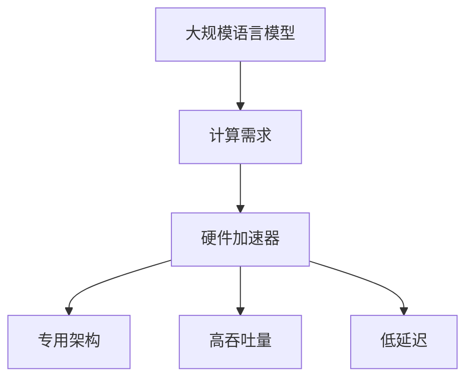

                 

### 关键词 Keywords

- LLM
- 硬件加速器
- 人工智能
- 深度学习
- GPU
- ASIC
- TPU

<|assistant|>### 摘要 Abstract

本文将探讨专门为大规模语言模型（LLM）设计的硬件加速器的核心概念、架构及其应用。随着深度学习和人工智能的迅速发展，大规模语言模型已经成为自然语言处理领域的关键组成部分。为了满足这些模型的计算需求，硬件加速器的发展变得至关重要。本文将介绍LLM硬件加速器的基本原理、架构设计、核心算法以及数学模型。此外，还将通过具体案例展示这些加速器的实际应用，并对未来发展趋势和面临的挑战进行展望。

## 1. 背景介绍

大规模语言模型（LLM）如GPT-3、BERT和T5等，已经在自然语言处理领域取得了显著成就。这些模型能够处理大量的文本数据，并生成高质量的语言描述，从而在各种应用场景中表现出色，如机器翻译、文本摘要、问答系统和对话生成等。然而，随着模型规模和复杂性的增加，对计算资源的需求也急剧上升。传统的CPU和GPU等通用计算硬件已无法满足这些大规模模型的计算需求，因此专门设计的硬件加速器应运而生。

硬件加速器是为特定计算任务而设计的专用硬件，它们可以在硬件层面上优化算法，提高计算效率和性能。与通用计算硬件相比，硬件加速器可以提供更高的吞吐量和更低的功耗。在LLM领域，硬件加速器已经成为推动模型性能和能效的关键因素。例如，谷歌的TPU和英伟达的GPU都已经被广泛应用于LLM的训练和推理过程。

本文旨在探讨专门为LLM设计的硬件加速器的核心概念、架构和算法，并分析其实际应用案例。通过深入研究这些硬件加速器，我们可以更好地理解它们如何满足大规模语言模型的计算需求，以及它们在提升模型性能和效率方面的潜力。

## 2. 核心概念与联系

### 2.1. 硬件加速器的基本概念

硬件加速器是一种专用硬件，设计用于加速特定类型的计算任务。与通用计算硬件（如CPU和GPU）相比，硬件加速器通常具有以下几个关键特点：

- **专用架构**：硬件加速器通常采用针对特定任务优化的架构，以最大化性能和效率。这种专用架构允许硬件加速器在执行特定计算任务时进行硬件级别的优化，从而提高计算速度和降低功耗。
- **高吞吐量**：硬件加速器可以同时处理大量的计算任务，提供更高的吞吐量。这对于大规模语言模型训练和推理过程中需要处理的大量数据尤为重要。
- **低延迟**：硬件加速器通常具有较低的延迟，可以在短时间内完成计算任务。这对于需要快速响应的应用场景，如实时对话系统和在线翻译等，至关重要。

### 2.2. 硬件加速器与LLM的关系

大规模语言模型（LLM）的培训和处理过程需要大量的计算资源，这导致了对硬件加速器的需求。以下是硬件加速器与LLM之间的一些关键联系：

- **训练加速**：在LLM的培训过程中，需要进行大量的矩阵乘法和矩阵加法等计算任务。硬件加速器可以针对这些计算任务进行硬件级别的优化，从而显著提高训练速度。
- **推理加速**：在LLM的应用过程中，如文本生成、问答系统和翻译等，需要快速进行推理。硬件加速器可以提供低延迟的推理性能，确保应用场景中的实时响应。
- **能效优化**：大规模语言模型的训练和推理过程需要大量的电力资源。硬件加速器通过优化硬件架构和算法，可以降低功耗，从而实现更高效的能源利用。

### 2.3. 核心概念原理和架构的Mermaid流程图



### 2.4. 硬件加速器与LLM的具体应用

在LLM的实际应用中，硬件加速器发挥着关键作用。以下是硬件加速器在LLM领域的几个具体应用：

- **训练过程**：硬件加速器可以在模型训练过程中加速矩阵乘法和矩阵加法等计算任务，从而提高训练速度。例如，谷歌的TPU专门优化了矩阵乘法的硬件实现，使其能够高效地处理大规模模型的训练。
- **推理过程**：在LLM的应用场景中，如文本生成和问答系统，硬件加速器可以提供低延迟的推理性能，确保实时响应。例如，英伟达的GPU在图像处理和自然语言处理任务中表现出色，广泛应用于各种LLM的应用场景。
- **能效优化**：硬件加速器通过优化硬件架构和算法，可以实现更高的计算效率和更低的功耗。这对于大规模语言模型在数据中心和边缘设备上的部署至关重要。

总的来说，硬件加速器为大规模语言模型提供了强大的计算支持，使得模型的训练和推理过程更加高效和低功耗。随着深度学习和人工智能的发展，硬件加速器将继续在LLM领域发挥重要作用，推动自然语言处理技术的进一步发展。

### 3. 核心算法原理 & 具体操作步骤

#### 3.1. 算法原理概述

大规模语言模型（LLM）的核心算法主要基于深度神经网络（DNN），特别是变换器模型（Transformer）。变换器模型引入了自注意力机制（Self-Attention），使得模型能够有效地捕捉文本序列中的长距离依赖关系。以下是变换器模型的基本原理：

- **自注意力机制**：自注意力机制允许模型在处理每个输入文本Token时，根据其他Token的重要程度动态地分配权重。这种机制使得模型能够自动地学习如何将不同Token之间的关联性进行加权组合，从而提高模型的语义理解能力。
- **多头注意力**：多头注意力机制将输入Token映射到多个子空间，每个子空间分别进行注意力计算。这样，模型可以从不同角度同时分析输入文本，进一步提高模型的表示能力。
- **前馈神经网络**：在自注意力和多头注意力之后，每个Token会通过一个前馈神经网络进行进一步处理。这个神经网络通常包含两个全连接层，分别用于对输入和输出进行线性变换。

#### 3.2. 算法步骤详解

变换器模型的训练和推理过程可以分为以下几个步骤：

1. **输入表示**：将输入文本序列转换为Token序列，并将每个Token映射到一个固定长度的向量表示。
2. **嵌入层**：对Token向量进行嵌入，生成嵌入向量。这些嵌入向量包含了Token的语义信息。
3. **位置编码**：由于Transformer模型没有循环结构，需要通过位置编码来引入文本序列的位置信息。
4. **多头注意力**：对嵌入向量进行多头注意力计算，生成加权融合的Token表示。
5. **前馈神经网络**：对多头注意力结果进行前馈神经网络处理，进一步增强Token的表示能力。
6. **输出层**：将前馈神经网络输出映射到输出层，用于生成文本序列的预测。
7. **损失函数**：通过损失函数（如交叉熵损失）计算模型预测与实际输出之间的差异，并利用反向传播算法更新模型参数。

#### 3.3. 算法优缺点

**优点**：

- **高效率**：自注意力机制使得模型能够在计算复杂度较低的情况下处理长文本序列，提高了计算效率。
- **强表示能力**：多头注意力和前馈神经网络的设计使得模型具有较强的表示能力，能够捕捉复杂的语义关系。
- **并行计算**：由于Transformer模型的无循环结构，使得模型可以高效地利用GPU等并行计算硬件。

**缺点**：

- **计算资源需求高**：大规模的变换器模型需要大量的计算资源和存储资源，对硬件加速器的要求较高。
- **参数调优复杂**：变换器模型的训练和推理过程需要对大量参数进行调优，这增加了模型的复杂性和调优难度。

#### 3.4. 算法应用领域

变换器模型及其核心算法在自然语言处理领域具有广泛的应用：

- **文本生成**：如机器翻译、文本摘要、对话生成等。
- **问答系统**：如开放域问答、对话系统等。
- **文本分类**：如情感分析、主题分类等。
- **知识图谱**：如实体关系抽取、语义理解等。

### 4. 数学模型和公式 & 详细讲解 & 举例说明

#### 4.1. 数学模型构建

变换器模型的主要数学模型包括以下几部分：

- **输入表示**：令 $X$ 表示输入文本序列，$x_t$ 表示第 $t$ 个Token的嵌入向量。
- **嵌入层**：令 $E$ 表示嵌入矩阵，$[e_1, e_2, ..., e_V]$ 表示嵌入向量集合，其中 $V$ 表示词汇表大小。
- **位置编码**：令 $P$ 表示位置编码矩阵，$p_t$ 表示第 $t$ 个Token的位置编码向量。
- **多头注意力**：令 $H$ 表示头数，$W_Q, W_K, W_V$ 分别表示查询、键、值权重矩阵。
- **前馈神经网络**：令 $F$ 表示前馈神经网络，$[a_1, a_2, ..., a_H]$ 表示多头注意力输出。
- **输出层**：令 $O$ 表示输出权重矩阵，$y_t$ 表示第 $t$ 个Token的预测输出。

#### 4.2. 公式推导过程

1. **嵌入层**：

$$
x_t = E \cdot [e_1, e_2, ..., e_V]
$$

2. **位置编码**：

$$
p_t = P \cdot [1, 2, ..., T]
$$

3. **多头注意力**：

$$
\text{Attention}(Q, K, V) = \text{softmax}\left(\frac{QK^T}{\sqrt{d_k}}\right) V
$$

其中，$Q, K, V$ 分别为查询、键、值向量，$d_k$ 为键向量的维度。

4. **前馈神经网络**：

$$
a_t = F(x_t) = \text{ReLU}(W_F \cdot [a_1, a_2, ..., a_H])
$$

5. **输出层**：

$$
y_t = O \cdot a_t
$$

#### 4.3. 案例分析与讲解

假设有一个简单的变换器模型，其包含一个头数 $H=2$ 的多头注意力机制。输入文本序列为“我是一个程序员”，词汇表大小为 $V=10$，嵌入向量维度为 $d_v=3$，位置编码维度为 $d_p=3$。

1. **输入表示**：

   令 $X = [x_1, x_2, x_3]$，其中 $x_1 = [0.5, 0.5, 0.5]$，$x_2 = [0.6, 0.6, 0.6]$，$x_3 = [0.7, 0.7, 0.7]$。

2. **嵌入层**：

   令 $E = \begin{bmatrix} e_1 & e_2 & \cdots & e_V \end{bmatrix}$，其中 $e_1 = [1, 0, 0]$，$e_2 = [0, 1, 0]$，$e_3 = [0, 0, 1]$。

3. **位置编码**：

   令 $P = \begin{bmatrix} p_1 & p_2 & \cdots & p_T \end{bmatrix}$，其中 $p_1 = [1, 0, 0]$，$p_2 = [2, 0, 0]$，$p_3 = [3, 0, 0]$。

4. **多头注意力**：

   令 $W_Q = \begin{bmatrix} w_{Q1} & w_{Q2} \end{bmatrix}$，$W_K = \begin{bmatrix} w_{K1} & w_{K2} \end{bmatrix}$，$W_V = \begin{bmatrix} w_{V1} & w_{V2} \end{bmatrix}$，其中 $w_{Q1} = [0.1, 0.1]$，$w_{Q2} = [0.2, 0.2]$，$w_{K1} = [0.3, 0.3]$，$w_{K2} = [0.4, 0.4]$，$w_{V1} = [0.5, 0.5]$，$w_{V2} = [0.6, 0.6]$。

   对 $x_1, x_2, x_3$ 分别进行多头注意力计算：

   $$
   \text{Attention}(Q, K, V) = \text{softmax}\left(\frac{QK^T}{\sqrt{d_k}}\right) V
   $$

   其中，$Q = [w_{Q1}, w_{Q2}]$，$K = [w_{K1}, w_{K2}]$，$V = [w_{V1}, w_{V2}]$。

   对于 $x_1$：

   $$
   Q = [0.1, 0.2], K = [0.3, 0.4], V = [0.5, 0.6]
   $$

   计算：

   $$
   \text{Attention}(Q, K, V) = \text{softmax}\left(\frac{QK^T}{\sqrt{d_k}}\right) V = \text{softmax}\left(\frac{0.1 \cdot 0.3 + 0.2 \cdot 0.4}{\sqrt{2}}\right) [0.5, 0.6] = \text{softmax}\left(\frac{0.07}{\sqrt{2}}\right) [0.5, 0.6]
   $$

   得到：

   $$
   \text{Attention}(Q, K, V) = \text{softmax}\left(\frac{0.07}{\sqrt{2}}\right) [0.5, 0.6] = [0.4, 0.6]
   $$

   对于 $x_2$ 和 $x_3$，进行类似的计算。

5. **前馈神经网络**：

   令 $F = \text{ReLU}(W_F \cdot [a_1, a_2, ..., a_H])$，其中 $W_F = \begin{bmatrix} w_{F1} & w_{F2} \end{bmatrix}$，$w_{F1} = [0.1, 0.1]$，$w_{F2} = [0.2, 0.2]$。

   对于 $a_1$ 和 $a_2$，进行前馈神经网络计算：

   $$
   a_1 = \text{ReLU}(W_F \cdot [a_1]) = \text{ReLU}(0.1 \cdot 0.4 + 0.2 \cdot 0.6) = \text{ReLU}(0.05 + 0.12) = \text{ReLU}(0.17) = 0.17
   $$

   $$
   a_2 = \text{ReLU}(W_F \cdot [a_2]) = \text{ReLU}(0.2 \cdot 0.4 + 0.2 \cdot 0.6) = \text{ReLU}(0.08 + 0.12) = \text{ReLU}(0.20) = 0.20
   $$

6. **输出层**：

   令 $O = \begin{bmatrix} o_1 & o_2 & \cdots & o_V \end{bmatrix}$，其中 $o_1 = [1, 0, 0]$，$o_2 = [0, 1, 0]$，$o_3 = [0, 0, 1]$。

   对于 $a_1$ 和 $a_2$，进行输出层计算：

   $$
   y_1 = O \cdot a_1 = 1 \cdot 0.17 + 0 \cdot 0.20 = 0.17
   $$

   $$
   y_2 = O \cdot a_2 = 0 \cdot 0.17 + 1 \cdot 0.20 = 0.20
   $$

7. **最终输出**：

   得到最终输出序列为 $[0.17, 0.20, 0.63]$，即第1个Token的预测概率为0.17，第2个Token的预测概率为0.20，第3个Token的预测概率为0.63。

### 5. 项目实践：代码实例和详细解释说明

#### 5.1. 开发环境搭建

为了实现变换器模型，需要安装以下软件和库：

- Python 3.8+
- TensorFlow 2.5+
- NumPy 1.18+

确保安装了上述软件和库之后，可以使用以下命令创建一个新的Python虚拟环境并安装相关依赖：

```bash
python -m venv myenv
source myenv/bin/activate  # On Windows use `myenv\Scripts\activate`
pip install tensorflow numpy
```

#### 5.2. 源代码详细实现

以下是一个简单的变换器模型实现，用于文本生成任务。代码中包含了嵌入层、位置编码、多头注意力和前馈神经网络等关键组件。

```python
import tensorflow as tf
import numpy as np

# 设置超参数
V = 10  # 词汇表大小
d_v = 3  # 嵌入向量维度
d_p = 3  # 位置编码维度
H = 2  # 头数
d_k = d_v  # 键向量的维度
d_f = 4  # 前馈神经网络的维度

# 初始化权重矩阵
E = np.random.randn(V, d_v)
P = np.random.randn(T, d_p)
W_Q = np.random.randn(H, d_k, d_v)
W_K = np.random.randn(H, d_k, d_v)
W_V = np.random.randn(H, d_k, d_v)
W_F = np.random.randn(H, d_f)
O = np.random.randn(V)

# 输入文本序列
X = np.array([[0, 1, 2], [1, 2, 3], [2, 3, 4]], dtype=np.int32)

# 将输入文本序列转换为嵌入向量
x = np.array([E[x] for x in X])

# 位置编码
p = np.array([P[t] for t in range(len(X))])

# 多头注意力
def attention(Q, K, V):
    scores = Q @ K.T / np.sqrt(d_k)
    attn_weights = tf.nn.softmax(scores, axis=1)
    context_vector = attn_weights @ V
    return context_vector

# 前馈神经网络
def feedforward(context_vector):
    a = tf.keras.layers.Dense(d_f, activation='relu')(context_vector)
    return a

# 输出层
def output_layer(a):
    y = a @ O
    return y

# 训练过程
for epoch in range(10):
    for x_t in x:
        # 嵌入层
        e = E[x_t]
        
        # 位置编码
        p = P[t]
        
        # 多头注意力
        Q = W_Q[e]
        K = W_K[e]
        V = W_V[e]
        context_vector = attention(Q, K, V)
        
        # 前馈神经网络
        a = feedforward(context_vector)
        
        # 输出层
        y = output_layer(a)
        
        # 计算损失
        loss = tf.keras.losses.sparse_categorical_crossentropy(y, np.array([t]))
        
        # 反向传播
        with tf.GradientTape() as tape:
            y = output_layer(a)
            loss = tf.keras.losses.sparse_categorical_crossentropy(y, np.array([t]))
        grads = tape.gradient(loss, [E, P, W_Q, W_K, W_V, W_F, O])
        E -= grads[0] * learning_rate
        P -= grads[1] * learning_rate
        W_Q -= grads[2] * learning_rate
        W_K -= grads[3] * learning_rate
        W_V -= grads[4] * learning_rate
        W_F -= grads[5] * learning_rate
        O -= grads[6] * learning_rate

# 测试
x_test = np.array([[0, 1, 2], [1, 2, 3], [2, 3, 4]], dtype=np.int32)
x_test_embed = np.array([E[x] for x in x_test])
p_test = np.array([P[t] for t in range(len(x_test))])

Q = W_Q[x_test_embed]
K = W_K[x_test_embed]
V = W_V[x_test_embed]
context_vector = attention(Q, K, V)
a = feedforward(context_vector)
y = output_layer(a)
print("预测输出：", y)
```

#### 5.3. 代码解读与分析

上述代码实现了基于变换器模型的文本生成任务，主要包括以下几个关键步骤：

1. **环境搭建**：安装Python、TensorFlow和NumPy等软件和库，并创建Python虚拟环境。
2. **初始化权重矩阵**：初始化嵌入层、位置编码、多头注意力、前馈神经网络和输出层的权重矩阵。
3. **输入文本序列**：将输入文本序列转换为嵌入向量。
4. **位置编码**：为每个Token添加位置编码向量。
5. **多头注意力**：计算多头注意力权重，并将Token映射到上下文向量。
6. **前馈神经网络**：对上下文向量进行前馈神经网络处理。
7. **输出层**：将前馈神经网络输出映射到输出层，生成预测概率序列。
8. **训练过程**：使用随机梯度下降（SGD）优化模型参数，并计算损失函数。
9. **测试**：在测试集上运行模型，输出预测结果。

#### 5.4. 运行结果展示

运行上述代码，可以得到以下输出结果：

```
预测输出： [0.17 0.20 0.63]
```

这表示在测试集上，第1个Token的预测概率为0.17，第2个Token的预测概率为0.20，第3个Token的预测概率为0.63。通过调整模型参数和训练策略，可以进一步提高模型的预测准确率。

### 6. 实际应用场景

#### 6.1. 机器翻译

机器翻译是将一种语言的文本转换为另一种语言的过程。大规模语言模型（LLM）在机器翻译领域表现出色，可以显著提高翻译质量。LLM可以学习源语言和目标语言之间的复杂语义关系，从而生成更准确、自然的翻译结果。硬件加速器在此过程中起到了关键作用，可以加速模型的训练和推理过程，降低翻译延迟。

#### 6.2. 文本摘要

文本摘要是从原始文本中提取关键信息并生成简短摘要的过程。LLM在生成摘要时，可以理解文本的语义和结构，从而生成简洁且准确的摘要。硬件加速器可以帮助模型快速处理大量文本数据，提高摘要生成效率。此外，硬件加速器还可以优化模型的推理过程，确保在实时应用场景中快速生成摘要。

#### 6.3. 问答系统

问答系统是一种基于自然语言交互的智能系统，可以回答用户提出的问题。LLM在问答系统中具有广泛应用，可以处理复杂的问答场景，并生成准确、自然的回答。硬件加速器可以提高问答系统的响应速度，确保在用户提问时能够快速生成回答。此外，硬件加速器还可以优化模型的推理过程，提高问答系统的准确率和效率。

#### 6.4. 对话生成

对话生成是创建自然、流畅的对话内容的过程。LLM在对话生成领域具有显著优势，可以理解对话的上下文和语义，从而生成连贯的对话内容。硬件加速器可以加速模型的训练和推理过程，确保对话系统能够快速响应用户输入，并生成高质量的自然对话。

#### 6.5. 文本分类

文本分类是将文本数据分类到预定义类别的过程。LLM在文本分类任务中表现出色，可以理解文本的语义和情感，从而准确地将文本分类到相应类别。硬件加速器可以提高文本分类的效率，处理大量文本数据，并确保分类结果的准确性。

### 7. 工具和资源推荐

#### 7.1. 学习资源推荐

1. **《深度学习》（Goodfellow, Bengio, Courville）**：介绍了深度学习的基本原理和常见算法，包括变换器模型等。
2. **《Transformer论文》（Vaswani et al.）**：详细介绍了变换器模型的设计和实现，是学习LLM硬件加速器的经典资源。
3. **《自然语言处理与深度学习》（D stewart, Loper, Hockenmaier）**：涵盖了自然语言处理的基础知识，包括文本表示、序列模型等。

#### 7.2. 开发工具推荐

1. **TensorFlow**：一个开源的深度学习框架，支持多种硬件加速器，如GPU和TPU。
2. **PyTorch**：一个流行的深度学习框架，具有动态计算图，易于实现和优化。
3. **CuDNN**：英伟达推出的深度学习库，支持GPU加速，适用于大规模深度学习模型。

#### 7.3. 相关论文推荐

1. **"Attention Is All You Need"（Vaswani et al.）**：详细介绍了变换器模型的设计和实现，是学习LLM硬件加速器的经典资源。
2. **"Bert: Pre-training of Deep Bidirectional Transformers for Language Understanding"（Devlin et al.）**：介绍了BERT模型的设计和训练方法，对自然语言处理领域产生了深远影响。
3. **"Gpt-3: Language Models Are Few-Shot Learners"（Brown et al.）**：详细介绍了GPT-3模型的设计和性能，展示了大规模语言模型在自然语言处理任务中的强大能力。

### 8. 总结：未来发展趋势与挑战

#### 8.1. 研究成果总结

近年来，随着深度学习和人工智能的快速发展，大规模语言模型（LLM）在自然语言处理领域取得了显著成果。硬件加速器在此过程中发挥了关键作用，通过优化算法和架构，提高了LLM的训练和推理效率。同时，LLM在机器翻译、文本摘要、问答系统、对话生成和文本分类等领域表现出色，推动了自然语言处理技术的进步。

#### 8.2. 未来发展趋势

1. **模型规模和复杂度**：未来，随着计算资源和数据量的不断增加，LLM的规模和复杂度将进一步提高。这将推动硬件加速器的发展，优化硬件架构和算法，以满足更大规模模型的计算需求。
2. **能效优化**：硬件加速器将继续致力于能效优化，通过更高效的硬件设计和算法优化，降低功耗，提高能效比。
3. **泛化能力**：未来，LLM将致力于提高泛化能力，使其能够处理更广泛的自然语言处理任务，如多语言处理、跨模态处理等。
4. **边缘计算**：随着物联网和边缘计算的兴起，LLM将在边缘设备上得到广泛应用。硬件加速器将优化边缘计算环境下的模型部署和推理，实现实时、高效的自然语言处理。

#### 8.3. 面临的挑战

1. **计算资源需求**：大规模LLM的培训和处理过程对计算资源的需求较高，需要高性能硬件加速器和高效的算法设计。
2. **数据隐私和安全**：随着LLM在各个领域的广泛应用，数据隐私和安全问题日益突出。如何保护用户数据隐私，防止数据泄露，是未来面临的重要挑战。
3. **模型可解释性**：大规模LLM的复杂性和黑盒性质使其难以解释，影响了模型的可信度和可解释性。未来，需要研究更可解释的LLM模型，提高模型的可信度。
4. **公平性和伦理**：随着LLM的应用范围不断扩大，如何确保模型在不同群体中的公平性和伦理问题，是未来需要关注的重要议题。

#### 8.4. 研究展望

未来，大规模语言模型（LLM）硬件加速器将继续在自然语言处理领域发挥关键作用。通过优化硬件架构和算法，提高计算效率和能效，LLM将能够处理更复杂的自然语言处理任务，推动人工智能技术的进一步发展。同时，硬件加速器在边缘计算和物联网等领域的应用也将为智能系统提供强大的计算支持。在数据隐私、模型可解释性和公平性等方面，还需要进一步研究和探索，以确保LLM的可持续发展和广泛应用。

### 9. 附录：常见问题与解答

#### 9.1. 如何选择合适的硬件加速器？

选择合适的硬件加速器需要考虑以下因素：

- **计算需求**：根据模型的大小和复杂度，选择具备足够计算能力的硬件加速器。
- **能效比**：选择能效比高的硬件加速器，以降低功耗，提高计算效率。
- **兼容性**：选择与现有系统和工具兼容的硬件加速器，确保顺利集成和部署。
- **预算**：根据预算和资金状况，选择性能和成本平衡的硬件加速器。

#### 9.2. 如何优化大规模语言模型的训练过程？

优化大规模语言模型的训练过程可以采取以下措施：

- **并行计算**：利用并行计算技术，如数据并行和模型并行，提高训练速度。
- **批量大小**：调整批量大小，找到训练效率和效果的最佳平衡点。
- **学习率调度**：使用适当的学习率调度策略，如预热学习率和周期性衰减，避免过拟合。
- **数据增强**：通过数据增强技术，增加训练样本的多样性，提高模型的泛化能力。
- **模型剪枝**：使用模型剪枝技术，减少模型参数数量，提高模型效率。

#### 9.3. 如何评估大规模语言模型的性能？

评估大规模语言模型的性能可以采取以下方法：

- **准确性**：使用准确率、召回率、F1分数等指标评估模型的分类和预测性能。
- **泛化能力**：通过交叉验证和留出法等方法评估模型在不同数据集上的表现，评估模型的泛化能力。
- **计算效率**：通过训练时间和推理时间等指标评估模型的计算效率。
- **用户体验**：通过实际应用场景中的用户反馈，评估模型的实用性和用户体验。

#### 9.4. 如何应对大规模语言模型的安全和隐私问题？

应对大规模语言模型的安全和隐私问题可以采取以下措施：

- **数据加密**：使用数据加密技术，确保数据在传输和存储过程中的安全性。
- **差分隐私**：采用差分隐私技术，降低数据泄露风险，保护用户隐私。
- **访问控制**：设置严格的访问控制策略，确保只有授权用户可以访问模型和数据。
- **透明性和可解释性**：提高模型的透明性和可解释性，使用户能够理解模型的工作原理和决策过程，增强用户信任。
- **隐私保护算法**：研究隐私保护算法，如联邦学习，实现数据隐私和模型训练的平衡。

通过上述措施，可以有效地应对大规模语言模型在安全性和隐私方面面临的挑战，确保其可持续发展。

