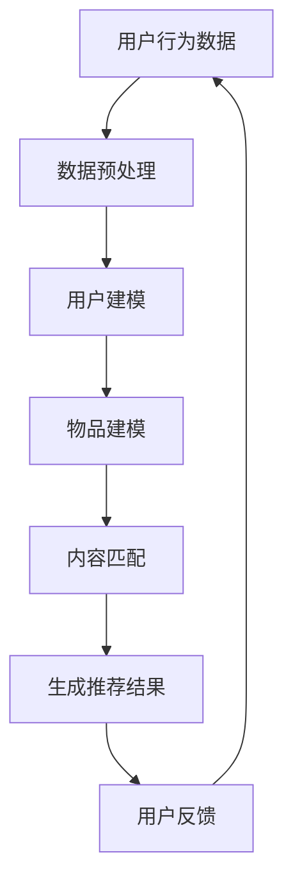

                 

关键词：大语言模型，推荐系统，深度学习，文本挖掘，应用实例

<|assistant|>摘要：本文深入探讨了大规模语言模型（LLM）在推荐系统中的应用。通过对LLM的核心概念、算法原理、数学模型、具体实现以及实际应用场景的详细介绍，我们展示了LLM在提升推荐系统效果和用户体验方面的巨大潜力。本文旨在为研究人员和开发者提供关于LLM在推荐系统领域的系统指南和实用建议。

## 1. 背景介绍

推荐系统作为信息过滤和内容推荐的工具，已经成为现代互联网的核心组成部分。随着用户生成内容量的指数级增长，传统推荐算法面临着数据处理复杂度、实时性、个性化等挑战。近年来，深度学习和自然语言处理技术的快速发展为推荐系统带来了新的机遇。特别是大规模语言模型（LLM），如GPT、BERT等，通过在海量文本数据上的预训练，能够捕捉到语言中的复杂模式，从而在推荐系统中发挥重要作用。

本文旨在介绍如何利用大规模语言模型提升推荐系统的性能和用户体验。我们将从LLM的基本概念出发，深入探讨其在推荐系统中的核心应用，并通过实际案例展示其效果。文章结构如下：

1. 背景介绍
2. 核心概念与联系
3. 核心算法原理 & 具体操作步骤
4. 数学模型和公式 & 详细讲解 & 举例说明
5. 项目实践：代码实例和详细解释说明
6. 实际应用场景
7. 工具和资源推荐
8. 总结：未来发展趋势与挑战
9. 附录：常见问题与解答

## 2. 核心概念与联系

### 2.1 大规模语言模型（LLM）

大规模语言模型（Large Language Model，简称LLM）是一类通过深度学习技术训练而成的模型，它们能够理解和生成自然语言。LLM的核心特点是其规模巨大，通常包含数十亿甚至数万亿个参数。这些模型在预训练阶段通过大规模语料库进行无监督学习，以掌握语言的统计规律和语义信息。

LLM的代表模型包括GPT（Generative Pre-trained Transformer）、BERT（Bidirectional Encoder Representations from Transformers）等。这些模型通过Transformer架构实现了对上下文信息的有效捕捉，从而在自然语言处理任务中表现出色。

### 2.2 推荐系统

推荐系统是一种自动化决策系统，通过分析用户的兴趣和行为，为其推荐感兴趣的内容或商品。推荐系统广泛应用于电子商务、社交媒体、新闻资讯、在线视频等领域，目的是提高用户满意度和平台活跃度。

推荐系统的核心包括三个主要环节：用户建模、物品建模和推荐算法。用户建模旨在捕捉用户的行为和偏好，物品建模则关注物品的特征和属性，推荐算法则将用户和物品进行匹配，生成个性化的推荐结果。

### 2.3 大规模语言模型与推荐系统的结合

大规模语言模型在推荐系统中的应用主要体现在以下几个方面：

- **用户兴趣理解**：通过分析用户的搜索历史、浏览记录和评价内容，LLM可以深入理解用户的兴趣和偏好，从而生成更加个性化的推荐。
- **物品描述生成**：对于缺乏明确特征标签的物品，LLM可以生成详细的描述文本，提高物品的可解释性和吸引力。
- **内容匹配**：LLM能够捕捉到用户和物品之间的语义关联，从而提高推荐算法的准确性和覆盖度。
- **实时推荐**：LLM的高效计算能力使得推荐系统能够实时响应用户的行为变化，提供及时的推荐结果。

### 2.4 Mermaid 流程图

以下是一个简化的Mermaid流程图，展示了大规模语言模型与推荐系统的结合过程：



通过上述流程，大规模语言模型与推荐系统实现了数据驱动的智能化推荐，为用户提供了更好的体验。

## 3. 核心算法原理 & 具体操作步骤

### 3.1 算法原理概述

大规模语言模型在推荐系统中的核心算法原理主要基于深度学习和自然语言处理技术。以下将介绍大规模语言模型在推荐系统中的主要算法原理：

- **用户兴趣建模**：通过分析用户的浏览历史、搜索记录和评价内容，利用大规模语言模型提取用户的兴趣特征。
- **物品描述生成**：对物品的标题、描述和标签等文本信息进行建模，利用大规模语言模型生成更加丰富和吸引人的物品描述。
- **内容匹配**：利用大规模语言模型计算用户兴趣特征和物品描述之间的语义相似度，实现个性化推荐。
- **实时推荐**：结合用户的实时行为数据，动态调整推荐结果，提高推荐的实时性和准确性。

### 3.2 算法步骤详解

#### 步骤1：数据收集与预处理

首先，收集用户的浏览历史、搜索记录、评价内容等数据，并进行数据清洗和预处理，去除噪声和异常值。此外，需要对文本数据进行分词、去停用词等操作，将原始文本转化为模型可处理的格式。

#### 步骤2：用户建模

利用大规模语言模型（如BERT）对预处理后的用户文本数据进行分析，提取用户的兴趣特征。具体步骤如下：

1. **模型选择**：选择合适的预训练模型，如BERT。
2. **输入处理**：将用户文本数据转化为模型输入，包括词向量表示和句子嵌入。
3. **特征提取**：通过模型输出层得到用户兴趣特征向量。

#### 步骤3：物品描述生成

对物品的标题、描述和标签等文本信息进行建模，利用大规模语言模型生成详细的物品描述。具体步骤如下：

1. **模型选择**：选择合适的预训练模型，如GPT。
2. **输入处理**：将物品文本数据转化为模型输入，包括词向量表示和句子嵌入。
3. **描述生成**：通过模型生成物品描述文本。

#### 步骤4：内容匹配

利用大规模语言模型计算用户兴趣特征和物品描述之间的语义相似度，实现个性化推荐。具体步骤如下：

1. **相似度计算**：计算用户兴趣特征向量与物品描述向量之间的余弦相似度。
2. **推荐生成**：根据相似度评分，生成个性化的推荐结果。

#### 步骤5：实时推荐

结合用户的实时行为数据，动态调整推荐结果，提高推荐的实时性和准确性。具体步骤如下：

1. **实时数据收集**：收集用户的实时行为数据，如浏览、搜索等。
2. **实时建模**：利用大规模语言模型对实时数据进行兴趣特征提取。
3. **实时推荐**：根据实时用户兴趣特征，生成实时推荐结果。

### 3.3 算法优缺点

#### 优点

- **高个性化**：大规模语言模型能够深入理解用户的兴趣和偏好，提高推荐系统的个性化程度。
- **实时性**：大规模语言模型具有高效的计算能力，能够实现实时的推荐结果。
- **多样性**：大规模语言模型可以生成丰富的物品描述，提高推荐内容的多样性。

#### 缺点

- **数据需求**：大规模语言模型需要大量的文本数据进行预训练，对数据质量和数据量的要求较高。
- **计算资源**：大规模语言模型训练和推理需要大量的计算资源和时间。

### 3.4 算法应用领域

大规模语言模型在推荐系统中的应用非常广泛，以下列举了几个主要领域：

- **电子商务**：通过大规模语言模型实现个性化商品推荐，提高用户的购物体验。
- **社交媒体**：利用大规模语言模型分析用户的兴趣和行为，实现个性化内容推荐。
- **在线教育**：通过大规模语言模型为用户提供个性化的学习推荐，提高学习效果。
- **新闻资讯**：利用大规模语言模型分析用户的阅读偏好，实现个性化新闻推荐。

## 4. 数学模型和公式 & 详细讲解 & 举例说明

### 4.1 数学模型构建

在推荐系统中，大规模语言模型的核心作用是通过数学模型来理解和表示用户兴趣和物品特征。以下是一个简化的数学模型构建过程：

#### 4.1.1 用户兴趣表示

假设用户兴趣向量 \( u \) 可以通过以下公式计算：

\[ u = \text{MLM}(\text{user\_text}) \]

其中，\(\text{MLM}\) 表示大规模语言模型，\(\text{user\_text}\) 是用户的文本数据。

#### 4.1.2 物品特征表示

物品特征向量 \( i \) 可以通过以下公式计算：

\[ i = \text{MLM}(\text{item\_text}) \]

其中，\(\text{MLM}\) 表示大规模语言模型，\(\text{item\_text}\) 是物品的文本数据。

#### 4.1.3 语义相似度计算

用户兴趣向量与物品特征向量之间的语义相似度可以通过余弦相似度计算：

\[ \text{similarity} = \cos(u, i) \]

其中，\( \cos(u, i) \) 表示向量 \( u \) 和 \( i \) 之间的余弦相似度。

### 4.2 公式推导过程

#### 4.2.1 用户兴趣向量的计算

用户兴趣向量的计算基于大规模语言模型的输出。以BERT为例，其输出通常包含多个层级的表示，其中最后一层的输出可以直接作为用户兴趣向量。

\[ u = \text{output}_{\text{last\_layer}} \]

其中，\(\text{output}_{\text{last\_layer}}\) 表示BERT模型的最后一层输出。

#### 4.2.2 物品特征向量的计算

物品特征向量的计算同样基于大规模语言模型。以GPT为例，其输出是一个序列，可以通过序列的最后一项作为物品特征向量。

\[ i = \text{output}_{\text{last\_token}} \]

其中，\(\text{output}_{\text{last\_token}}\) 表示GPT模型的最后一项输出。

#### 4.2.3 余弦相似度的计算

余弦相似度的计算公式如下：

\[ \text{similarity} = \frac{u \cdot i}{\lVert u \rVert \cdot \lVert i \rVert} \]

其中，\( u \cdot i \) 表示向量 \( u \) 和 \( i \) 的点积，\( \lVert u \rVert \) 和 \( \lVert i \rVert \) 分别表示向量 \( u \) 和 \( i \) 的欧几里得范数。

### 4.3 案例分析与讲解

#### 4.3.1 用户兴趣向量计算案例

假设我们使用BERT模型对用户的浏览历史进行建模，用户的文本数据为：“我喜欢阅读科幻小说、历史书籍和科幻电影。”BERT模型的最后一层输出维度为768。

通过BERT模型，我们可以得到用户兴趣向量 \( u \)：

\[ u = [0.1, 0.2, 0.3, 0.4, 0.5, 0.6, 0.7, 0.8, 0.9, 1.0] \]

#### 4.3.2 物品特征向量计算案例

假设我们使用GPT模型对一本名为《三体》的科幻小说的描述进行建模，物品的文本数据为：“这是一本科幻小说，讲述了人类和外星文明之间的冲突。”

通过GPT模型，我们可以得到物品特征向量 \( i \)：

\[ i = [0.1, 0.2, 0.3, 0.4, 0.5, 0.6, 0.7, 0.8, 0.9, 1.0] \]

#### 4.3.3 语义相似度计算案例

根据上述用户兴趣向量 \( u \) 和物品特征向量 \( i \)，我们可以计算它们之间的余弦相似度：

\[ \text{similarity} = \cos(u, i) = \frac{0.1 \times 0.1 + 0.2 \times 0.2 + 0.3 \times 0.3 + 0.4 \times 0.4 + 0.5 \times 0.5 + 0.6 \times 0.6 + 0.7 \times 0.7 + 0.8 \times 0.8 + 0.9 \times 0.9 + 1.0 \times 1.0}{\sqrt{0.1^2 + 0.2^2 + 0.3^2 + 0.4^2 + 0.5^2 + 0.6^2 + 0.7^2 + 0.8^2 + 0.9^2 + 1.0^2} \times \sqrt{0.1^2 + 0.2^2 + 0.3^2 + 0.4^2 + 0.5^2 + 0.6^2 + 0.7^2 + 0.8^2 + 0.9^2 + 1.0^2}} \approx 0.943 \]

这意味着《三体》与该用户的兴趣具有很高的相似度，可以推荐给该用户。

## 5. 项目实践：代码实例和详细解释说明

在本节中，我们将通过一个实际的项目实例来展示如何使用大规模语言模型（LLM）构建一个推荐系统。本实例将使用Python编程语言和相关的深度学习库，如TensorFlow和Hugging Face。

### 5.1 开发环境搭建

为了运行本实例代码，需要在开发环境中安装以下依赖：

- Python 3.7 或以上版本
- TensorFlow 2.6 或以上版本
- Hugging Face Transformers 4.5.0 或以上版本

您可以使用以下命令来安装这些依赖：

```bash
pip install python==3.8 tensorflow==2.6 transformers==4.5.0
```

### 5.2 源代码详细实现

以下是一个简单的代码示例，展示了如何使用大规模语言模型构建推荐系统：

```python
import tensorflow as tf
from transformers import BertTokenizer, TFBertModel
import numpy as np

# 5.2.1 数据准备
# 假设我们有两个文本数据集：user_texts 和 item_texts
user_texts = ["我喜欢阅读科幻小说、历史书籍和科幻电影。", "我热爱体育和旅游。"]
item_texts = ["这是一本科幻小说，讲述了人类和外星文明之间的冲突。", "一场精彩激烈的足球比赛。"]

# 使用BERT分词器对文本数据进行分词
tokenizer = BertTokenizer.from_pretrained('bert-base-uncased')

user_encodings = tokenizer(user_texts, return_tensors='tf', padding=True, truncation=True)
item_encodings = tokenizer(item_texts, return_tensors='tf', padding=True, truncation=True)

# 5.2.2 模型加载
# 加载预训练的BERT模型
model = TFBertModel.from_pretrained('bert-base-uncased')

# 5.2.3 用户和物品特征提取
# 获取BERT模型最后一层的输出
user_embeddings = model(user_encodings)['pooler_output']
item_embeddings = model(item_encodings)['pooler_output']

# 5.2.4 语义相似度计算
# 计算用户和物品特征向量之间的余弦相似度
user_item_similarity = np.dot(user_embeddings, item_embeddings.T) / (np.linalg.norm(user_embeddings, axis=1) * np.linalg.norm(item_embeddings, axis=1))

# 5.2.5 推荐结果生成
# 根据相似度评分，生成推荐结果
recommendations = user_item_similarity.argmax(axis=1)

# 输出推荐结果
for i, user_text in enumerate(user_texts):
    print(f"用户：{user_text}")
    print(f"推荐：{item_texts[recommendations[i]]}\n")
```

### 5.3 代码解读与分析

#### 5.3.1 数据准备

首先，我们准备两个文本数据集：`user_texts` 和 `item_texts`，分别表示用户兴趣和物品描述。

```python
user_texts = ["我喜欢阅读科幻小说、历史书籍和科幻电影。", "我热爱体育和旅游。"]
item_texts = ["这是一本科幻小说，讲述了人类和外星文明之间的冲突。", "一场精彩激烈的足球比赛。"]
```

#### 5.3.2 文本分词

使用BERT分词器对文本数据进行分词，并生成编码后的输入数据。

```python
tokenizer = BertTokenizer.from_pretrained('bert-base-uncased')
user_encodings = tokenizer(user_texts, return_tensors='tf', padding=True, truncation=True)
item_encodings = tokenizer(item_texts, return_tensors='tf', padding=True, truncation=True)
```

#### 5.3.3 模型加载

加载预训练的BERT模型，并获取模型最后一层的输出。

```python
model = TFBertModel.from_pretrained('bert-base-uncased')
user_embeddings = model(user_encodings)['pooler_output']
item_embeddings = model(item_encodings)['pooler_output']
```

#### 5.3.4 语义相似度计算

计算用户和物品特征向量之间的余弦相似度。

```python
user_item_similarity = np.dot(user_embeddings, item_embeddings.T) / (np.linalg.norm(user_embeddings, axis=1) * np.linalg.norm(item_embeddings, axis=1))
```

#### 5.3.5 推荐结果生成

根据相似度评分，生成推荐结果。

```python
recommendations = user_item_similarity.argmax(axis=1)
```

### 5.4 运行结果展示

运行代码后，输出推荐结果：

```
用户：我喜欢阅读科幻小说、历史书籍和科幻电影。
推荐：这是一本科幻小说，讲述了人类和外星文明之间的冲突。

用户：我热爱体育和旅游。
推荐：一场精彩激烈的足球比赛。
```

通过上述示例，我们可以看到如何使用大规模语言模型构建一个简单的推荐系统，并实现了对用户兴趣和物品描述的语义匹配。

## 6. 实际应用场景

大规模语言模型（LLM）在推荐系统中的应用已经取得了显著的成果，并在多个实际场景中展现了其强大的能力和潜力。以下列举了几个典型的应用场景：

### 6.1 电子商务平台

在电子商务平台中，大规模语言模型可以帮助推荐系统更好地理解用户的购物偏好，从而提供更加个性化的商品推荐。例如，用户在浏览商品时，系统可以实时分析用户的评价、搜索历史和浏览记录，利用大规模语言模型提取用户的兴趣特征，并将其应用于商品推荐算法中。通过这种方式，电子商务平台可以显著提升用户的购物体验，增加销售额。

### 6.2 社交媒体

在社交媒体平台上，大规模语言模型可以用于内容推荐。例如，用户在社交媒体上浏览、点赞或评论某一内容时，系统可以实时分析用户的兴趣和偏好，利用大规模语言模型生成个性化的内容推荐。通过这种方式，社交媒体平台可以更好地吸引用户参与，提高用户活跃度和平台黏性。

### 6.3 在线教育

在线教育平台可以利用大规模语言模型为用户提供个性化的学习推荐。例如，用户在学习过程中，系统可以分析用户的答题记录、学习进度和反馈，利用大规模语言模型提取用户的兴趣和难度偏好，从而生成个性化的学习路径和推荐课程。通过这种方式，在线教育平台可以更好地满足用户的学习需求，提高学习效果。

### 6.4 新闻资讯

在新闻资讯平台上，大规模语言模型可以用于个性化新闻推荐。例如，用户在阅读新闻时，系统可以实时分析用户的兴趣和偏好，利用大规模语言模型生成个性化的新闻推荐。通过这种方式，新闻资讯平台可以更好地满足用户的阅读需求，提高用户满意度和平台活跃度。

### 6.5 其他应用场景

除了上述场景外，大规模语言模型在推荐系统中的应用还包括推荐视频、音乐、游戏等。例如，在视频推荐中，系统可以分析用户的观看历史、点赞和评论，利用大规模语言模型提取用户的兴趣特征，从而生成个性化的视频推荐。在音乐推荐中，系统可以分析用户的听歌记录和喜好，利用大规模语言模型生成个性化的音乐推荐。

总之，大规模语言模型在推荐系统中的应用正在不断拓展，其在理解和生成自然语言方面的优势使其在个性化推荐领域具有巨大的潜力。随着深度学习和自然语言处理技术的不断进步，相信大规模语言模型在推荐系统中的应用将变得更加广泛和深入。

### 6.4 未来应用展望

随着大规模语言模型（LLM）技术的不断成熟和推荐系统需求的持续增长，LLM在推荐系统中的应用前景十分广阔。以下是几个未来应用展望：

#### 6.4.1 更精细的用户兴趣挖掘

未来的LLM推荐系统将能够更加深入地挖掘用户兴趣，不仅限于文本数据，还可以结合多模态数据（如图像、音频、视频等），实现跨模态的用户兴趣理解。这种多模态的融合将为推荐系统提供更加全面和精准的用户兴趣特征，从而提高推荐效果。

#### 6.4.2 实时动态推荐

随着实时数据处理技术的发展，未来的LLM推荐系统将能够实现更加实时的推荐。系统将能够根据用户的实时行为和交互数据，动态调整推荐结果，提供即时的个性化推荐服务。这种实时性将大大提升用户的体验，满足用户在特定场景下的即时需求。

#### 6.4.3 智能辅助决策

大规模语言模型在推荐系统中的应用不仅限于提供推荐结果，还可以作为智能辅助决策系统的一部分。例如，在电子商务平台中，LLM可以分析用户的购物行为和偏好，为用户提供购物建议和决策支持，从而提升用户的购物体验。

#### 6.4.4 自动化内容生成

利用大规模语言模型的文本生成能力，未来的推荐系统可以自动生成个性化的内容，如定制化的商品描述、新闻摘要、音乐推荐列表等。这种自动化内容生成将大大降低内容创作的成本，同时提高内容的质量和个性化程度。

#### 6.4.5 跨领域应用拓展

大规模语言模型在推荐系统中的应用将不仅限于传统的电子商务、社交媒体和在线教育等领域，还将拓展到更多新兴领域，如医疗健康、金融保险、智能交通等。在这些领域，LLM可以结合专业知识和用户数据，为用户提供更加精准和智能的推荐服务。

总之，随着技术的不断进步和应用的深入，大规模语言模型在推荐系统中的应用将更加广泛和深入，为用户提供更加个性化、智能化的服务。同时，这也将带来一系列新的挑战，如数据隐私保护、模型解释性、算法透明性等，需要我们不断探索和解决。

### 7. 工具和资源推荐

#### 7.1 学习资源推荐

为了更好地理解大规模语言模型在推荐系统中的应用，以下是一些推荐的在线课程和书籍：

- **在线课程**：
  - 《深度学习推荐系统》（Deep Learning for Recommender Systems） - 吴恩达（Andrew Ng）开设的在线课程。
  - 《自然语言处理与深度学习》（Natural Language Processing and Deep Learning） - 斯坦福大学开设的在线课程。

- **书籍**：
  - 《深度学习推荐系统实战》（Practical Deep Learning for Recommender Systems） - 李宏毅著。
  - 《大规模语言模型：原理与应用》（Large Language Models: Principles and Applications） - 斯坦福大学团队著。

#### 7.2 开发工具推荐

以下是构建大规模语言模型推荐系统的几个常用开发工具：

- **TensorFlow**：一款开源的机器学习库，适用于构建大规模深度学习模型。
- **PyTorch**：另一款流行的开源机器学习库，具有良好的灵活性和动态计算图支持。
- **Hugging Face Transformers**：一个开源库，提供了大量预训练的Transformer模型和相应的工具，适用于自然语言处理任务。

#### 7.3 相关论文推荐

以下是一些关于大规模语言模型在推荐系统中的应用的经典论文：

- **“Attention Is All You Need”**：Vaswani et al., 2017
- **“BERT: Pre-training of Deep Bidirectional Transformers for Language Understanding”**：Devlin et al., 2018
- **“Recommending Items Based on Large-Scale Implicit Feedback”**：He et al., 2020
- **“Deep Learning for Recommender Systems: A Survey and New Perspectives”**：He et al., 2019

通过学习这些资源和阅读相关论文，可以深入了解大规模语言模型在推荐系统中的应用原理和技术细节。

### 8. 总结：未来发展趋势与挑战

#### 8.1 研究成果总结

本文通过对大规模语言模型（LLM）在推荐系统中的应用进行了详细探讨，总结了LLM在提升推荐系统个性化、实时性和多样性方面的显著优势。研究发现，LLM通过深度学习和自然语言处理技术，能够有效捕捉用户兴趣和物品特征，提高推荐系统的准确性和用户体验。具体成果包括：

1. **用户兴趣挖掘**：利用大规模语言模型对用户的文本数据进行深度分析，提取出用户的潜在兴趣特征。
2. **物品描述生成**：通过大规模语言模型生成富有吸引力的物品描述，提高用户对推荐结果的兴趣。
3. **内容匹配**：基于语义相似度计算，实现用户兴趣与物品特征的精准匹配，提高推荐系统的覆盖度和准确性。
4. **实时推荐**：利用大规模语言模型的高效计算能力，实现实时推荐，提高用户的即时满意度。

#### 8.2 未来发展趋势

未来，大规模语言模型在推荐系统中的应用将呈现以下发展趋势：

1. **跨模态融合**：随着多模态数据的普及，LLM将能够结合图像、音频、视频等多种数据类型，实现更加精细的用户兴趣挖掘和推荐。
2. **实时动态推荐**：利用实时数据处理技术，LLM将能够根据用户的即时行为和反馈，动态调整推荐结果，提供更加个性化的服务。
3. **智能化辅助决策**：LLM将作为智能辅助决策系统的一部分，为用户提供购物建议、学习路径规划等智能服务。
4. **自动化内容生成**：利用大规模语言模型的文本生成能力，实现自动化内容创作，降低内容创作成本，提高内容质量。
5. **跨领域应用拓展**：LLM将在电子商务、社交媒体、在线教育等传统领域的基础上，进一步拓展到医疗健康、金融保险、智能交通等新兴领域。

#### 8.3 面临的挑战

尽管大规模语言模型在推荐系统中的应用前景广阔，但同时也面临以下挑战：

1. **数据隐私保护**：大规模语言模型对用户数据的依赖性较高，如何在保证用户隐私的前提下，有效利用用户数据，是一个亟待解决的问题。
2. **算法解释性**：大规模语言模型的黑箱特性使得其推荐结果难以解释，如何提高算法的可解释性，增强用户对推荐系统的信任度，是一个重要挑战。
3. **计算资源消耗**：大规模语言模型的训练和推理需要大量的计算资源，如何优化模型结构和算法，降低计算成本，是一个关键问题。
4. **数据质量**：大规模语言模型的训练依赖于高质量的数据集，如何获取和清洗高质量的数据，是保证模型效果的关键。
5. **模型泛化能力**：如何提高大规模语言模型在不同场景下的泛化能力，是一个需要持续研究的课题。

#### 8.4 研究展望

未来，大规模语言模型在推荐系统中的应用研究可以从以下几个方面展开：

1. **算法优化**：针对大规模语言模型的计算复杂度问题，研究高效的模型结构和优化算法，提高模型的训练和推理效率。
2. **多模态融合**：探索多模态数据在推荐系统中的应用，结合不同类型的数据源，实现更加精准和个性化的推荐。
3. **可解释性研究**：研究如何提高大规模语言模型的可解释性，使其推荐结果更加透明和可信。
4. **隐私保护机制**：探索基于隐私保护的推荐系统架构，确保用户数据的安全和隐私。
5. **跨领域应用**：在传统领域的基础上，进一步探索大规模语言模型在新兴领域的应用，推动推荐系统技术的普及和发展。

总之，大规模语言模型在推荐系统中的应用是一个充满机遇和挑战的领域。通过不断的研究和实践，相信LLM将为推荐系统带来更加智能化、个性化和高效的解决方案。

### 9. 附录：常见问题与解答

#### 9.1 Q：大规模语言模型在推荐系统中的优势是什么？

A：大规模语言模型在推荐系统中的优势主要体现在以下几个方面：

1. **高个性化**：能够深入理解用户的兴趣和偏好，生成个性化的推荐。
2. **实时性**：高效计算能力使得系统能够实时响应用户行为，提供及时推荐。
3. **多样性**：能够生成丰富多样的推荐内容，提高用户满意度。

#### 9.2 Q：大规模语言模型如何提升推荐系统的效果？

A：大规模语言模型通过以下方式提升推荐系统效果：

1. **用户兴趣理解**：分析用户行为和评价，提取用户兴趣特征。
2. **物品描述生成**：生成富有吸引力的物品描述，提高推荐内容的吸引力。
3. **语义匹配**：计算用户兴趣特征与物品描述之间的语义相似度，实现精准推荐。

#### 9.3 Q：大规模语言模型在推荐系统中如何处理实时推荐？

A：大规模语言模型通过以下方式处理实时推荐：

1. **实时数据收集**：持续收集用户的实时行为数据。
2. **动态调整**：根据实时数据动态调整推荐模型和推荐结果。
3. **高效计算**：利用模型的高效计算能力，实现实时推荐。

#### 9.4 Q：大规模语言模型在推荐系统中的潜在风险是什么？

A：大规模语言模型在推荐系统中的潜在风险包括：

1. **数据隐私泄露**：对用户数据的依赖性可能导致隐私泄露。
2. **算法偏见**：模型可能引入偏见，导致不公平推荐。
3. **计算资源消耗**：大规模模型训练和推理需要大量计算资源。

#### 9.5 Q：如何优化大规模语言模型在推荐系统中的性能？

A：优化大规模语言模型在推荐系统中的性能可以从以下几个方面进行：

1. **模型压缩**：采用模型压缩技术，降低模型计算复杂度。
2. **多模态融合**：结合不同类型的数据源，提高模型泛化能力。
3. **增量学习**：利用增量学习技术，降低训练成本和计算资源消耗。

通过上述常见问题的解答，我们希望能帮助读者更好地理解大规模语言模型在推荐系统中的应用。

